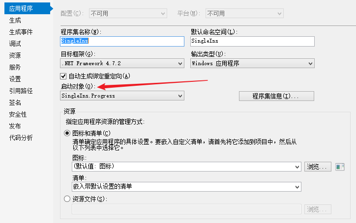
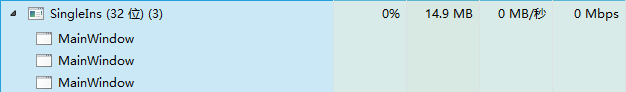
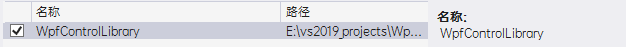
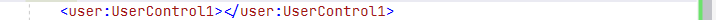
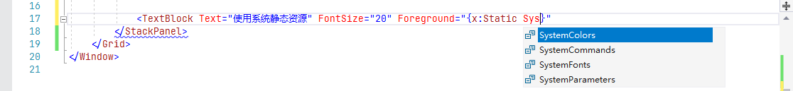
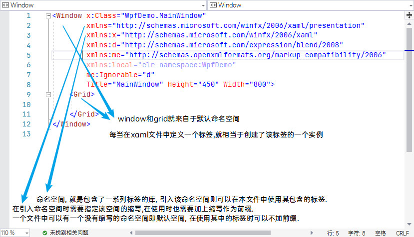
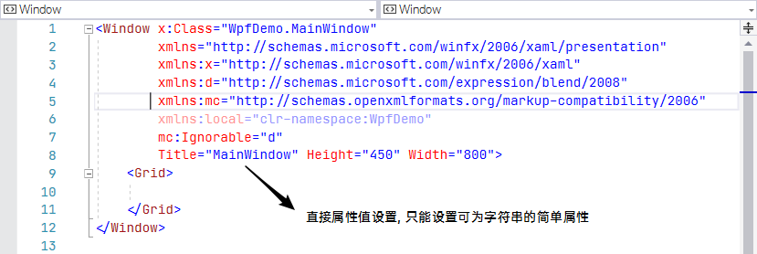
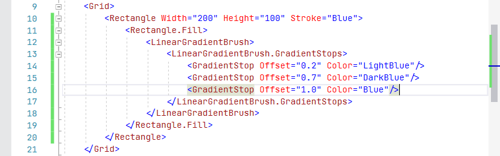
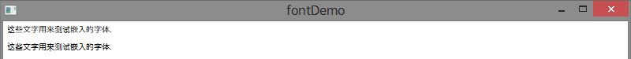
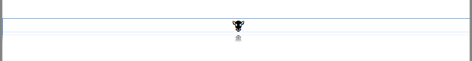

> 在 `文件大纲` 窗口可查看 xaml 文件的控件树


vs创建不同类型项目的本质

> 	C# 本身可以通过命令配置编译成不同类型的文件, 同时需要指定编译引用到的库, vs创建不同类型的项目实际上是帮你指定好相关引用, 以及编译命令, 此项信息可以在 菜单栏->项目-><项目名>属性 中查看

创建项目

1. 新建项目 wpf application( .net framework )

> wpf 页面不同于 winform 页面的平面结构, 是树形结构通过 xml 文件来表现


#### 项目结构

1. 与winform相同, 同样是一个页面分为 xaml 文件 和 cs 文件来写, xaml 关注交互设计, cs 关注逻辑处理
2. 项目中 App.xaml 为项目入口
3. 默认生成 MainWindow 页面, 作为初始页面
4. Properties 中存放项目资源文件和参数文件
5. 引用 文件夹存放项目使用到的引用库
6. 添加页面时, 选择添加窗口则新建的xaml文件以 window 为根节点, 选择添加页面则新建的xaml文件以 page 为根节点


#### 接收命令行参数

> 本质就是切换为手动启动窗口的方式并接收参数

1. 工具栏 , 项目 , 项目属性 , 调试 , 添加 命令行参数

2. 删除 App.xaml 中的 startUpUri 属性

3. 定义 application 标签的 startUp 事件, 通过参数 e.Args 获取命令行参数

   ```c#
   //手动加载主页面
   private void Application_Startup(object sender, StartupEventArgs e)
   {
     	//新建页面实例
       expandorDemo ed = new expandorDemo();
     	//show主页面
       ed.Show();
     	//获取命令行参数并显示
       MessageBox.Show(e.Args[0]);
   }
   ```

   


#### 单实例应用

> 默认应用程序是多实例应用程序, 多次打开会生成多个进程

1. 删除自带的 App.xaml

2. 创建 App 类继承自 Application , 封装 show() 用来显示主窗口

   ```C#
   class App : Application //继承自Application
   {
       public App()
       {
           showMain(); //实例化时显示主窗口
       }
   		//封装显示主窗口的方法用以再次打开程序时调用
       public void showMain()
       {
           var win = new MainWindow();
           win.Show();
       }
   }
   ```

3. 解决方案窗口, 项目, 引用, 右键, 添加引用, 引用 MicroSoft.VisualBasic 库

4. 创建 AppWrapper 类继承 vb 库的 WindowsFormsApplicationBase类 

   在无参构造方法中设置 this.IsSingleInstance 为 true 

   在该类中添加 App实例 为字段

   override OnStartup 方法初始化 App 实例并 Run()  

   override OnStartUpNextInstance 方法为调用步骤 2 中封装的 show 方法, 直接返回新的页面而不是新的 APP实例

   ```C#
   class AppWrapper : Microsoft.VisualBasic.ApplicationServices.WindowsFormsApplicationBase
   {
       public AppWrapper()
       {
           this.IsSingleInstance = true;
       }
   
       //将Application实例定义为类字段, 使得可以在多个事件中访问并返回单一实例
       private App app;
       protected override bool OnStartup(StartupEventArgs eventArgs)
       {
           base.OnStartup(eventArgs);
           app = new App();
           app.Run();
           return true;
       }
     	//再次打开程序事件
       protected override void OnStartupNextInstance(StartupNextInstanceEventArgs eventArgs)
       {
           base.OnStartupNextInstance(eventArgs);
           app.showMain(); //直接显示一个新窗口, 而不是创建新的APP实例
       }
   }
   ```

5. 创建程序入口类, 设置单线程执行Attribute, 在 main 方法中 新建 AppWrapper 实例, 并调用  Run()

   ```c#
   class Progress
   {
       [STAThread]
       static void Main(string[] args)
       {
           //仿照winform的启动方式新建Application实例并Run
           //var app = new App();
           //app.Run();
         	//创建包裹了App实例的AppWrapper实例并Run
           var appWrapper = new AppWrapper();
           appWrapper.Run(args);
       }
   }
   ```

6. 菜单栏, 项目, 项目属性, 应用程序, 启动对象 中设置入口类为 步骤 5 创建的类

   

7. 多次启动程序, 在任务管理器中只有一个进程, 该进程下有多个窗口

   


#### 模块化设计 (用户控件)

1. 在解决方案中创建 wpf 用户控件库( .net framework )

2. 在上一步项目中新建 cs 页面文件进行布局

3. 在要引用该用户控件的项目引用中添加该项目的引用

   

4. 在要使用该用户控件的页面中添加该项目的命名空间

   

5. 使用 命名空间缩写:标签名 来使用该用户控件

   


#### 程序集资源

默认文件为资源文件, 随可执行程序打包

可直接在项目上 右键, 添加现有项, 本质就是将该文件复制到项目下 

或者 

在 Properties/Resources 中添加现有项 , 这种方式添加的资源文件会默认放到项目根目录中 Resources 文件夹中, 在引用时无需写文件路径, 直接使用文件名进行引用

使用时直接通过属性面板设置 source 属性选择文件即可

如果想要资源文件不随可执行文件打包, 在项目中右键资源文件, 属性, 设置 生成操作 为 内容, 设置 复制到输出目录 为 始终复制

那么该文件将不会打包到可执行文件中, 而是直接复制到可执行文件目录下.


#### 数据资源

> 数据资源相当于定义常量, 实际上是设置了属性值的对象实例.

> 每个控件上都有 Resource 属性, 用来定义数据资源 , 在控件上可以访问所有其父控件上的 Resource 属性
>
> 资源的寻找方式为自底向上, 到 window 实例 , 到 Application 实例 ,  资源寻找的最后一站是系统静态资源
>
> 直接将资源定义到 App.xaml 中的 Application.Resources 上 , 称为应用资源

###### 使用系统静态资源

>
>```xaml
><!--静态使用-->
><TextBlock Text="使用系统静态资源" FontSize="20" Foreground="{x:Static SystemColors.WindowTextBrush}"/>
><!--动态使用, 当系统主题文字颜色改变时, 此处文字颜色改变-->
><TextBlock Text="使用系统静态资源" FontSize="20" Foreground="{DynamicResource {x:Static SystemColors.WindowTextBrushKey}}"/>
>```
>
>系统静态资源封装在如下四个类中
>
>

在代码中获取资源实例

```c#
控件实例.Resources["资源key"]
```

###### 定义资源

```xaml
<Window.Resources>
  <!--在此定义资源实例, x:key设置该资源的唯一标识-->
</Window.Resources>
```

###### 使用资源

> 使用标记扩展的方式使用资源

| 资源使用方式                | 说明                                               |
| --------------------------- | -------------------------------------------------- |
| {StaticResource 资源的key}  | 静态资源, 只第一次取值                             |
| {DynamicResource 资源的key} | 动态资源, 当资源实例发生变化时, 该属性值也随之变化 |

###### 资源字典

> 资源字典就是数据资源的集合, 单独定义在一个 xaml 文件中, 方便数据资源的管理和共享

创建和使用

1. 首先右键项目, 添加, 资源字典 , 或者将现成的资源字典文件复制到项目下

   

2. 在资源字典文件中添加数据资源项

   ```xaml
   <ResourceDictionary xmlns="http://schemas.microsoft.com/winfx/2006/xaml/presentation"
                       xmlns:x="http://schemas.microsoft.com/winfx/2006/xaml"
                       xmlns:local="clr-namespace:WpfDemo">
       <!--在资源字典中定义数据资源-->
       <ImageBrush x:Key="imb" ImageSource="yang.jpg" Opacity="0.3"/>
   </ResourceDictionary>
   ```

3. 然后在 Application.Resources 下引用资源字典 

   ```xaml
   <Application.Resources>
       <!--引用资源字典为应用资源-->
       <ResourceDictionary>
           <ResourceDictionary.MergedDictionaries>
               <ResourceDictionary Source="ResDic.xaml"/>
           </ResourceDictionary.MergedDictionaries>
       </ResourceDictionary>
   </Application.Resources>
   ```

4. 最后就可以在应用中其他任意位置通过资源字典中数据资源的 key 进行使用

   ```xaml
   <!--根据数据资源的 key 引用资源-->
   <Button Content="使用资源字典" Background="{StaticResource imb}" Height="100"/>
   ```

项目之间资源字典共享

1. 一般是新建一个 `wpf项目` ( 作为类库使用 ), 把要使用的资源字典文件都放到该项目中, 而不是直接复制资源字典文件到项目下

2. 然后在其他项目中添加该类库项目的引用

3. 然后可以通过代码动态加载该类库下的资源文件

   ```c#
   //加载资源字典类库, 然后在控件上使用
   ResourceDictionary rd = new ResourceDictionary();
   rd.Source = new Uri("DicLibrary;component/dic1.xaml", UriKind.Relative);
   this.useLibBtn.Background = (ImageBrush)rd["lib_imb"]; //通过key调用数据资源
   ```

4. 也可以通过 ComponentResourceKey 扩展标记使用该类库下的资源文件

###### 基本类型数据资源

1. 先引入系统命名空间

   ```xaml
   xmlns:sys="clr-namespace:System;assembly=mscorlib"
   ```

2. 然后定义基本类型数据资源, 就相当于常量

   ```xaml
   <Window.Resources>
       <sys:Double x:Key="fontsize">22</sys:Double>
   </Window.Resources>
   ```

3. 在控件中使用

   ```xaml
   <!--使用常量数据资源-->
   <Button Content="使用基本类型数据资源" FontSize="{StaticResource fontsize}"/>
   ```

   

###### objectDataProvider

> objectDataProvider 类型的资源通过定义指定类中的指定方法来获取数据, 在xaml渲染之前执行该方法获取数据, 作为数据资源可直接绑定到控件上, 这样就省去了手动在 loaded 事件中给控件设置数据源的代码
>
> 同时可以设置 isAsync 属性为 true , 即异步加载, 与xaml渲染同时进行, 待到执行指定方法完毕获取到数据时, 自动更新绑定该数据的ui

1. 编写获取并返回数据的方法

   ```c#
   public class ProviderService
   {
       //使用 ObservableCollection 类型列表, 在列表数据更新时, 与其绑定的 UI元素 内容随之更新
       ObservableCollection<Product> ps;
   
       //假装该方法在Dao层的类中
       public ObservableCollection<Product> GetProducts()
       {
           ps = new ObservableCollection<Product>();
           //假装此处访问数据库加载数据
           ps.Add(new Product(1, "weapon", 99.99));
           ps.Add(new Product(2, "apple", 9.09));
           ps.Add(new Product(3, "iphone", 9999.9));
           ps.Add(new Product(4, "ipad", 1399.99));
           ps.Add(new Product(5, "benz", 13599.9));
           return ps;
       }
   }
   ```

2. 在xaml中定义 objectDataProvider 数据资源, 并使用

   ```xaml
   <Window.Resources>
     <!--定义 objectDataProvider 资源, 指定调用哪个类的哪个方法获取数据-->
       <ObjectDataProvider x:Key="products" ObjectType="{x:Type local:ProviderService}" MethodName="GetProducts"></ObjectDataProvider>
   </Window.Resources>
   <!--直接使用 DisplayMemberPath 指定显示为列表项的属性值-->
   <!--直接 Binding 到 ObjectDataProvider-->
   <ListBox DisplayMemberPath="name" x:Name="nameList" Grid.Row="0" Grid.ColumnSpan="2" ItemsSource="{Binding Source={StaticResource products}}"></ListBox>
   ```

3. 运行项目, 绑定数据资源的控件将自动获取到数据


###### xmlDataProvider

> 从xml文件中获取数据资源

1. 先整一个xml文件

   ```xml
   <?xml version="1.0"?>
   <products>
   	<product>
   		<id>1</id>
   		<name>xml_weapon</name>
   		<price>9.99</price>
   	</product>
   	<product>
   		<id>2</id>
   		<name>xml_iphone</name>
   		<price>9.99</price>
   	</product>
   	<product>
   		<id>3</id>
   		<name>xml_ipad</name>
   		<price>9.99</price>
   	</product>
   	<product>
   		<id>4</id>
   		<name>xml_mac</name>
   		<price>9.99</price>
   	</product>
   </products
   ```

2. 然后使用 xmlDataProvider 从xml文件中获取数据并作为数据资源

   默认异步加载, 可设置 isAsync 属性 false 为同步加载

   使用 Xpath 属性指定要使用 xml 文件中的哪部分内容

   ```xaml
   <Window.Resources>
       <!--XPath 设置从 根元素products下面开始获取数据-->
       <XmlDataProvider x:Key="ps" Source="xml/products.xml" XPath="/products"></XmlDataProvider>
   </Window.Resources>
   ```

3. 在其他控件中绑定此数据资源

   ```xaml
   <!--直接使用 DisplayMemberPath 指定显示为列表项的属性值-->
   <!--直接 Binding 到 xmlDataProvider, 从绑定的 xmlDataProvider 中获取属性值时应当设置 xpath 属性而不是 path属性-->
   <ListBox DisplayMemberPath="name" x:Name="nameList" Grid.Row="0" Grid.ColumnSpan="2" 
            ItemsSource="{Binding Source={StaticResource ps},XPath=product}"></ListBox>
   ```

4. 运行测试读取 xml 文件数据的结果


#### 窗口数据交互

###### 父窗口给子窗口传值

> 打开子窗口的本质就是 新建子窗口实例 并 show 出来

1. 在子窗口类中添加 属性 用来接收父窗口的传值
2. 父窗口 new 出来子窗口示例后, 给上一步创建的属性赋值
3. 在子窗口的 load 方法中取得 该属性值 , 即为父窗口的传值

###### 子窗口给父窗口传值

> 同样是借用 子窗口类 的 属性来实现
>
> 注意这里应当使用 showDialog 显示子窗口使得主窗口进入阻塞

1. 在子窗口类中添加 属性 用来存储要返回给父窗口的传值
2. 父窗口使用 showDialog 显示子窗口并使得自身进入阻塞状态
3. 在 子窗口的 closing 事件中对 该属性赋值
4. 在主窗口中通过子窗口实例直接获取上一步中设置的值, 即为子窗口返回的值


#### Application

> application 实例用来管理 windows 的打开关闭和事件, 在项目中定义到 app.xaml 中

属性

* StartUpUri 指定初始页面
* ShutDownMode 应用关闭模式
  * OnExplicitShutdown 不会关闭应用除非手动调用 application.ShutDown() 关闭
  * OnLastWindowClose 所有的窗口都关闭后就关闭应用, 默认设置
  * OnMainWindowClose 主窗口关闭后就关闭应用

事件

> 以下事件都存在默认实现,  方法名为 `on事件名`,  修饰符为 protected  ,可 override 这些实现改变默认操作

* startUp 调用 app.Run() 之后, 主窗口显示之前事件

* exit  应用程序退出事件

* activated 从其他应用程序切换到该应用程序事件

* deactivated 应用程序失去焦点事件 

* dispatcherUnhandledException 应用发生异常事件

* SessionEnding 系统注销或关机事件

  ```c#
  //override OnSessionEnding 事件来阻止注销系统
  public partial class App : Application
  {
    protected override void OnSessionEnding(SessionEndingCancelEventArgs e)
      {
          base.OnSessionEnding(e);
          //设置取消注销系统
          e.Cancel = true;
          MessageBox.Show("拒绝注销");
      }
  }
  ```
  

###### <span style="color:cyan;">访问Application实例</span>

application 实例中管理了所有当前应用打开的窗口, 所以可以通过访问 Application 实例实现 : 

* 获取当前 Application 实例

  ```c#
  //随便在哪里可通过 Application类 的静态方法和字段获取 Application实例 的信息
  var app = (Application)Application.Current;
  ```

* 获取应用程序主窗口

  ```c#
  //随便在哪里可通过 Application类 的静态方法和字段获取 Application实例 的信息
  var mainTitle = Application.Current.MainWindow.Title;
  MessageBox.Show(mainTitle);
  ```

* 获取当前打开的所有窗口实例

  ```c#
  //随便在哪里可通过 Application类的静态方法和字段获取 Application实例的信息
  var wins = Application.Current.Windows;
  foreach (Window w in wins)
  {
      MessageBox.Show(w.Title);
  }
  
  ```

* 窗口之间进行交互, 在一个窗口中操作其他窗口

  实现思路: 

  1. 在 Application 类中添加 List\<Window\> 属性
  2. 每次新建窗口实例时, 将新建的窗口实例保存到这个属性中
  3. 当要在一个窗口中操作另外一个窗口时, 先通过 Application.Current 获取当前 Application 实例, 然后得到 List\<Window\> 属性, 根据条件筛选出目标窗口对其进行操作


#### window

###### 属性

* sizeToContent 是否将窗口宽高根据内容自动调整 

* Top 窗口距离屏幕上距离

* Left 窗口距离屏幕上距离

* TopMost 是否总是在最上层显示

* WindowStartupLocation 窗口启动位置

* WindowState 窗口状态, 最大, 最小, 还是常规

* Owner 该窗口的拥有者窗口

  窗口A拥有另外一个窗口B , 则A最小化或关闭时, B也会随之最小化或关闭 , word中的搜索窗口就是被拥有窗口

*  OwnedWindows 当前窗口拥有的所有窗口集合

###### API

* ins.Close() 关闭
* this.Hide() 隐藏

###### 打开另外一个窗口

* 直接 new 一个对应窗口的实例, 然后 show() 或者 showDialog() 即可

###### 相关

* SystemParameters.PrimaryScreenWidth 整个屏幕的宽度
* SystemParameters.WorkArea.Width 整个屏幕除去任务栏的宽度

###### 不规则外观窗口

1. window.allowTransparency=true 允许窗口透明

2. window.windowStyle=None 去除边框

3. window.background=transparent 窗口背景设置为透明

4. 使用 png 图片填充, 或者 path 自定义形状, 或者 border 圆角矩形 来实现不规则外观

5. 因为关闭了边框, 所以失去了拖动窗口的功能, 可以设置窗口的 MouseLeftDown 事件为拖动功能

   ```c#
   private void window_MouseLeftButtonDown(object sender, MouseLeftDownEventArgs e){
     this.DragMove();
   }
   ```

   

###### 系统对话框

```c#
using Microsoft.Win32;
//文件选择对话框
OpenFileDialog dig = new OpenFileDialog();
dig.Filter = "Image files(*.jpg;*.png;)|*.jpg;*.png"; //设置类型过滤,管道符前面的是描述, 后面的是规则
dig.Multiselect = true; //支持多选
//判断用户点击了 打开 还是 取消
if(dig.ShowDialog()==true){
  //获取用户选择的文件
  string[] files = dig.FileNames;
}else{
  //用户点击了取消按钮
}
//保存文件对话框
SaveFileDialog  
```


#### page

> 运行page页面时, 会自动将其放入一个 NavigationWindow 中 , 具有导航功能条

> 请不要设置page 的宽度和高度, 它会根据内容自动调整宽高, 否则会显示不全或者四周留白

> 同 window , 只能有一个子元素

> 没有 show 方法,  如要切换页面 ,使用 Hyperlink 超链接
>
> ```xaml
> <!--Hyperlink一般嵌套在TextBlock中-->
> <TextBlock>click <Hyperlink NavigateUri="page2Demo.xaml">here</Hyperlink> to page2</TextBlock>
> <!--Hyperlink可直接链接到网址, 会在当前窗口打开网页-->
> <!--如果网址404或者其他异常, 会导致程序抛异常中断, 所以应当在 Application 上定义 NavigationFailed 事件处理异常-->
> <TextBlock>click <Hyperlink NavigateUri="http://www.baidu.com">here</Hyperlink> to page2</TextBlock>
> ```

属性

* windowWidth 包裹该page 的 navigatationWindow的宽度
* keepAlive 当用户导航到另外一个页面, 该页面是否保持存活
* showNavigationUI 是否显示导航条

嵌入到window

1. 使用 Frame 包裹

2. 将 Frame 放到 window 中目标位置

   ```xaml
   <!--window下边一半放置Frame-->
   <Grid>
       <Grid.RowDefinitions>
           <RowDefinition Height="*"></RowDefinition>
           <RowDefinition Height="*"></RowDefinition>
       </Grid.RowDefinitions>
   
       <TextBlock Text="this is a window with frame..." HorizontalAlignment="Center" VerticalAlignment="Center"></TextBlock>
       <!--NavigationUIVisibility设置导航条显示模式-->
       <Frame Grid.Row="1" Source="page1Demo.xaml" HorizontalAlignment="Stretch" NavigationUIVisibility="Visible"></Frame>
   </Grid>
   ```


#### Xaml

##### 使用规则

使用xml的格式来定义布局, 所以是树形结构



xaml文件标签的属性设置方式

1. 直接设置标签属性值

   

2. 使用属性标签设置

   

3. 使用属性扩展


##### 布局

| 布局        | 格式     |
| ----------- | -------- |
| Grid        | 网格     |
| StackPanel  | 堆叠     |
| DockPanel   | 停靠     |
| WrapPanel   | 流式     |
| Canvas      | 自由     |
| UniformGrid | 均分网格 |

Gird

* GridSplitter 网格分隔条, 可拖动调整网格大小

  1. 在要放置分隔条的地方新增一列或一行, 设置该列或该行的宽度为 Auto

  2. 添加GridSplitter到该行或该列

  3. 设置GridSplitter的宽度为 Stretch , 高度方向 center

     ```xaml
     <Grid>
         <Grid.ColumnDefinitions>
             <ColumnDefinition Width="*" MinWidth="50"></ColumnDefinition>
             <ColumnDefinition Width="Auto"></ColumnDefinition>
             <ColumnDefinition Width="*" MinWidth="50"></ColumnDefinition>
         </Grid.ColumnDefinitions>
         <Grid.RowDefinitions>
             <RowDefinition></RowDefinition>
         </Grid.RowDefinitions>
     
         <Button Grid.Column="0" Grid.Row="0" >Abtn</Button>
         <Button Grid.Column="2" Grid.Row="0">Bbtn</Button>
         <GridSplitter Grid.Column="1" Width="3" VerticalAlignment="Stretch" HorizontalAlignment="Center"/>
     
     </Grid>
     ```

  4. 运行该页面查看分割线拖动调整大小效果


##### 样式

> 给控件使用 style , 相当于使用 css , 同时 style 可继承 , 相当于 less

> style 中设置属性 TargetType="Button" 后, 所有的 Button 都会采用此样式, 如果某个Button不想按照此样式, 设置 style="{x:Null}"

```xaml
<Window.Resources>
        <!--设置样式并使用样式继承-->
        <Style x:Key="baseStyle" TargetType="Button">
            <Setter Property="FontSize" Value="10"></Setter>
        </Style>
        <Style x:Key="btnStyle" TargetType="Button" BasedOn="{StaticResource baseStyle}">
            <Setter Property="Foreground" Value="blue"></Setter>
        </Style>
</Window.Resources>
<Grid>
				<!--在button上使用style-->
				<Button Width="100" Height="40" Style="{StaticResource btnStyle}">button</Button>
</Grid>
```


##### 触发器

###### 基本触发器

> 触发器, 可做鼠标 hover 改变 style 效果

```xaml
<!--设置样式并设置触发器-->
<Style x:Key="btnStyle" TargetType="Button">
		<Setter Property="Foreground" Value="blue"></Setter>
		<Style.Triggers>
				<!--设置鼠标over时改变样式-->
				<Trigger Property="IsMouseOver" Value="True">
						<Setter Property="Foreground" Value="Red"></Setter>
				</Trigger>
		</Style.Triggers>
</Style>
```


###### 多条件触发器

> 多条件触发器, 同时满足多个条件时才能触发

```xaml
<!--设置样式并设置触发器-->
        <Style x:Key="btnStyle" TargetType="Button">
            <Setter Property="Foreground" Value="blue"></Setter>
            <Style.Triggers>
                <!--也可设置多条件触发器, 即同时满足多个条件时才能触发-->
                <MultiTrigger>
                    <MultiTrigger.Conditions>
                        <!--只有focus和鼠标over时才能触发-->
                            <Condition Property="IsMouseOver" Value="True"></Condition>
                        <Condition Property="IsFocused" Value="True"></Condition>
                    </MultiTrigger.Conditions>
                    <MultiTrigger.Setters>
                        <Setter Property="Foreground" Value="Red"></Setter>
                    </MultiTrigger.Setters>
                </MultiTrigger>
            </Style.Triggers>
        </Style>
```


###### 事件触发器

> 事件触发器, 通过事件来进行触发, 可实现动画效果, 上边两种触发器只能直接设置属性, 该触发器可以设置 action

```xaml
<!--设置样式并设置触发器-->
 <Style x:Key="btnStyle" TargetType="Button">
     <Setter Property="Foreground" Value="blue"></Setter>
     <Style.Triggers>
         <!--设置事件触发器, 鼠标over时执行action动画-->
         <EventTrigger RoutedEvent="Mouse.MouseEnter">
             <EventTrigger.Actions>
                 <BeginStoryboard>
                     <Storyboard>
                       <!--Duration设置为0.5秒动画-->
             	 <DoubleAnimation Duration="0:0:0.5" Storyboard.TargetProperty="FontSize" To="30"></DoubleAnimation>
                    </Storyboard>
                </BeginStoryboard>
            </EventTrigger.Actions>
        </EventTrigger>
    </Style.Triggers>
</Style>
```

###### 数据触发器

> DataTrigger , 一般用在 DataTemplate 中, binding 一个属性值, 当该属性值符合条件时, 设置该项的样式

```xaml
<DataTemplate.Triggers>
    <DataTrigger Binding="{Binding Path=id}" Value="1">
        <Setter Property="Cursor" Value="ScrollNS"></Setter>
    </DataTrigger>
</DataTemplate.Triggers>
```


##### 控件模板

> ControlTemplate 控件模板, 就是自定义控件的样式和触发器

> 如果是基于原有控件进行控件模板的定制 , 最快捷的方式是在 文件大纲 窗口中, 找到目标控件实例, 右键 , 编辑样式, 创建副本, 然后该控件的默认模板就会添加到当前 xaml 文件的 window标签下, 然后根据需求对其进行定制.

ControlTemplate 中的 TemplateBinding

> 就是设置该属性绑定的是控件实例上设置的指定属性的值, 例如
>
> 模板中设置了 BorderBrush="{TemplateBinding BorderBrush}" , 那么意味着在使用该控件模板的控件上设置 BorderBrush 属性就相当于在设置 BorderBrush 属性

控件模板使用方法

> 最佳实践 是不要将控件模板定义与页面内容放到一个文件中, 而是将 控件模板单独放到 资源字典中, 然后在需要的地方对其引用

1. 先创建目标控件模板

2. 然后自定义控件模板

   ```xaml
   <Window.Resources>
           <!--自定义控件模板-->
               <ControlTemplate x:Key="myButton" TargetType="{x:Type ButtonBase}">
                 <!--border中设置控件边框样式-->
               <Border x:Name="border"
                       CornerRadius="15"
                       BorderBrush="{TemplateBinding BorderBrush}" 
                       BorderThickness="{TemplateBinding BorderThickness}" 
                       Background="{TemplateBinding Background}" 
                       SnapsToDevicePixels="True">
                 <!--contentPresenter设置控件内容样式-->
                   <ContentPresenter x:Name="contentPresenter" ContentTemplate="{TemplateBinding ContentTemplate}" Content="{TemplateBinding Content}" ContentStringFormat="{TemplateBinding ContentStringFormat}" Focusable="False" HorizontalAlignment="{TemplateBinding HorizontalContentAlignment}" Margin="{TemplateBinding Padding}" RecognizesAccessKey="True" SnapsToDevicePixels="{TemplateBinding SnapsToDevicePixels}" VerticalAlignment="{TemplateBinding VerticalContentAlignment}"/>
               </Border>
                 <!--触发器设置控件触发器-->
               <ControlTemplate.Triggers>
                   <Trigger Property="Button.IsDefaulted" Value="True">
                       <Setter Property="BorderBrush" TargetName="border" Value="{DynamicResource {x:Static SystemColors.HighlightBrushKey}}"/>
                   </Trigger>
                   <Trigger Property="IsMouseOver" Value="True">
                       <Setter Property="Background" TargetName="border" Value="#FFBEE6FD"/>
                       <Setter Property="BorderBrush" TargetName="border" Value="#FF3C7FB1"/>
                   </Trigger>
                   <Trigger Property="IsPressed" Value="True">
                       <Setter Property="Background" TargetName="border" Value="#FFC4E5F6"/>
                       <Setter Property="BorderBrush" TargetName="border" Value="#FF2C628B"/>
                   </Trigger>
                   <Trigger Property="ToggleButton.IsChecked" Value="True">
                       <Setter Property="Background" TargetName="border" Value="#FFBCDDEE"/>
                       <Setter Property="BorderBrush" TargetName="border" Value="#FF245A83"/>
                   </Trigger>
                   <Trigger Property="IsEnabled" Value="False">
                       <Setter Property="Background" TargetName="border" Value="#FFF4F4F4"/>
                       <Setter Property="BorderBrush" TargetName="border" Value="#FFADB2B5"/>
                       <Setter Property="Foreground" Value="#FF838383"/>
                   </Trigger>
               </ControlTemplate.Triggers>
           </ControlTemplate>
           
       </Window.Resources>
   ```

3. 在指定控件上设置 template 以使用自定义控件模板

   ```xaml
   <!--使用 DynamicResouce 设置 template 属性以使用自定义模板-->
   <Button Style="{StaticResource ResourceKey=btnStyle}" Width="100" Height="40" Content="button" Template="{DynamicResource myButton}"/>
   ```

   


##### 数据模板

> DataTemplate 数据模板, 实际上就是用于自定义集合控件中集合项内容的模板 
>
> 适用于 DataGrid( 表格 ), ComboBox(下拉列表), ListBox(列表) , TreeView(树结构) 等集合控件 

> 在集合控件中设置属性 ItemTemplate 为自定义的 DataTemplate

> 如果数据模板单独作为资源, 使用 `DataType 属性` 设置数据项所用到数据的类型 , 那么该资源所在节点的所有子节点中只要是使用该数据类型作为 数据子项 的控件都会自动使用该模板, 相当于在 style 中设置了 targetType

一般的使用步骤

1. 在 windows.Resources 中定义 DataTemplate 模板, 同时指定 binding 数据源的字段

   ```xaml
   <Window.Resources>
     	<!--定义combobox的datatemplate-->
       <DataTemplate x:Key="comboTemplate">
           <StackPanel Orientation="Horizontal">
               <Border Width="10" Height="10" Background="{Binding code}"/>
               <TextBlock Text="{Binding code}"/>
           </StackPanel>
       </DataTemplate>
   </Window.Resources>
   ```

2. 在集合控件中指定使用上一步定义的 DataTemplate 作为集合项的表现形式

   ```xaml
   <!--设置ItemTemplate属性以指定使用响应的DataTemplate-->
   <ComboBox x:Name="cbx" IsEditable="False" ItemTemplate="{StaticResource comboTemplate}"/>
   ```

3. 在逻辑处理文件中为集合控件指定数据源, 也可以直接在上一步中直接设置集合控件的 ItemSource 属性以指定数据源

   ```c#
   //Coolr类有一个属性code
   List<Coolr> clrs = new List<Coolr>();
   clrs.Add(new Coolr("#ff0324"));
   clrs.Add(new Coolr("#dde244"));
   clrs.Add(new Coolr("#fe03f4"));
   //指定combobox控件的数据源
   this.cbx.ItemsSource = clrs;
   ```

4. 运行该页面查看集合项的自定义效果


##### 自定义集合控件

> ItemControll 自定义集合控件, 需要同时指定该控件的容器 和 集合项模板

1. 在设计页面添加ItemControll

   ```xaml
   <!--设置name属性以在逻辑处理中操作该控件-->
   <ItemsControl x:Name="mic">
       <ItemsControl.ItemsPanel>
           <!--定义该ItemsControll的外层容器, 应当是panel系列, 否则会报错-->
           <ItemsPanelTemplate>
               <StackPanel Orientation="Horizontal"></StackPanel>
           </ItemsPanelTemplate>
       </ItemsControl.ItemsPanel>
       <ItemsControl.ItemTemplate>
           <!--定义数据项模板, 以及binding数据源的属性-->
           <DataTemplate>
               <TextBlock Width="40" Height="40" Text="{Binding txt}" Background="#eee"/>
           </DataTemplate>
       </ItemsControl.ItemTemplate>
   </ItemsControl>
   ```

2. 在界面逻辑中指定ItemControll的数据源

   ```c#
   //Txt类中包含一个属性txt
   List<Txt> ts = new List<Txt>();
   ts.Add(new Txt("alice"));
   ts.Add(new Txt("alisf"));
   ts.Add(new Txt("avsue"));
   //指定自定义itemControll的数据源
   this.mic.ItemsSource = ts;
   ```

3. 运行该页面测试效果


##### 数据绑定

###### Binding

> binding 绑定数据, 相当于 vue 中的数据绑定

> {Binding xxx} , 相当于 {Binding path=xxx} , 相当于绑定的就是逐级向上查找发现的第一个 DataContext 对象中的 xxx 属性

> {Binding} , 相当于绑定的就是逐级向上查找发现的第一个 DataContext 对象

> 		如果数据绑定的发起者是文本框且双向绑定, 那么在文本框内容修改后, 需要等到文本框失去焦点才能反映到绑定目标上, 如果需要文本框内容改变时立即反映到目标上, 在绑定设置中 `UpdateSourceTrigger=PropertyChanged` ,  例如 {Binding ElementName=xxx,Path=xxx,UpdateSourceTrigger=PropertyChanged}

绑定模式

| 模式           | 说明               |
| -------------- | ------------------ |
| OneWay         | 单向绑定           |
| TwoWay         | 双向绑定           |
| OneTime        | 单向绑定且单次模式 |
| OneWayToSource | 反向的单向绑定     |
| Default        | 默认               |

数据源为其他元素的属性

> Binding ElementName

```xaml
<Slider x:Name="lider" Width="200" Maximum="100"></Slider>
<TextBlock Text="{Binding ElementName=lider,Path=Value,Mode=OneWay}" HorizontalAlignment="Center"></TextBlock>
```

数据源为静态资源的属性

> Binding Source StaticResource

```xaml
<Window.Resources>
    <TextBox x:Key="txt" Text="alice"></TextBox>
</Window.Resources>
<StackPanel>
    <TextBlock Text="{Binding Source={StaticResource txt},Path=Text,Mode=OneWay}" HorizontalAlignment="Center">			  </TextBlock>
</StackPanel>
```

数据源为匹配对象的属性

> Binding RelativeSource

```xaml
<StackPanel Width="150">
    <!--向上查找第一个stackPanel元素, 取其width属性值作为绑定数据, AncestorLevel设置匹配向上查找第几个,默认为1-->
    <TextBlock FontSize="20" Text="{Binding RelativeSource={RelativeSource Mode=FindAncestor,
        AncestorType={x:Type StackPanel},AncestorLevel=1},Path=Width}" HorizontalAlignment="Center"/>
    <!--绑定控件自身的其他属性-->
    <TextBlock Text="{Binding RelativeSource={RelativeSource Mode=Self}, Path=Name}" Name="绑定自身其他属性"/>
</StackPanel>
```

数据源为DataContext对象的属性

> 每一个控件标签都是一个对象实例, 所以可以直接在标签上设置 DataContext 属性, 也可以在代码中设置
>
> 如下方式在页面逻辑中设置就相当于在当前页面最顶级 window 标签上设置 DataContext 属性

* 属性为普通字符串

  ```C#
  //页面逻辑文件
  public partial class bindDemo : Window
  {
      public bindDemo()
      {
          InitializeComponent();
          //设置DataContext对象
          this.DataContext = new student("alice", 20);
      }
  }
  
  class student
  {
      public student(string name, int age)
      {
          this.name = name;
          this.age = age;
      }
      public string name { get; set; }
      public int age { get; set; }
  }
  ```

  ```xaml
  <!--页面ui文件-->
  <!--直接binding到DataContext对象中的属性-->
  <TextBlock Text="{Binding name}"></TextBlock>
  ```

* 属性为列表

  ```c#
  //页面逻辑文件
  public partial class bindDemo : Window
  {
      public bindDemo()
      {
          InitializeComponent();
          //设置DataContext对象
          className cls = new className();
          cls.classNum = 1;
          List<student> stus = new List<student>();
          stus.Add(new student("alice", 20));
          stus.Add(new student("blice", 18));
          stus.Add(new student("vlice", 22));
          cls.students = stus;
          this.DataContext = cls;
      }
  }
  
  class className
  {
      public int classNum { get; set; }
      public List<student> students { get; set; }
  }
  
  class student
  {
      public student(string name, int age)
      {
          this.name = name;
          this.age = age;
      }
      public string name { get; set; }
      public int age { get; set; }
  }
  ```

  ```xaml
  <!--页面ui文件-->
  <StackPanel>
      <TextBlock Text="{Binding classNum}"/>
    	<!--对于DataContext的列表属性, 直接设置即可-->
      <DataGrid ItemsSource="{Binding students}" AutoGenerateColumns="False">
          <DataGrid.Columns>
            	<!--对于列表项对象的属性, 再次使用binding进行绑定-->
              <DataGridTextColumn Binding="{Binding name}" Header="名字"/>
              <DataGridTextColumn Binding="{Binding age}" Header="年龄"/>
          </DataGrid.Columns>
      </DataGrid>
  </StackPanel>
  ```


###### MultiBinding

> 同时绑定多个属性, 即同时使用多个属性值进行显示, 在 stringFormat 属性中使用 {序号} 代表 binding 的多个属性值


##### 数据转换

> 将绑定的数据通过转换后的形式进行显示

* 可以使用内置的 stringformat 方式对字符串属性进行转换

  ```xaml
  <!--格式如下, 使用{0}代表当前值-->
  {Binging path=xxx,StringFormat=自定义的内容{0}}
  ```

* 也可以自定义转换器进行转换

  > 转换器本质就是用来将原数据转换后`在页面中显示` , 待到从页面中获取数据时, 会自动调用 ConvertBack 将页面中的数据再转换回来

  1. 创建转换器类实现 IValueConverter 接口, 实现 Convert 方法 和 ConvertBack方法

     如果是多值绑定 multiBinding , 那么需要实现 IMultiValueBinding 接口

  2. 在 xaml 中使用自定义的 转换器
  
     ```xaml
   {Binging path=xxx,converter=xxx}
     ```
  


##### 设置 ItemContent 子项样式

> 属于 ItemContent 类型的控件, 例如 listbox, listview , combobox , datagrid , 都可以设置 ItemContainerStyle 来定制子项样式

> 同时这类组件因为继承自 ItemsControl , 还包含 `AlternationCount 循环计数` 和 `AlternationIndex 当前计数` 两个属性, 可以使用这两个属性来实现隔行变色

```xaml
<!--使用AlternationCount设置循环计数总数为2-->
<ListBox DisplayMemberPath="name" x:Name="nameList" Grid.Row="0" Grid.ColumnSpan="2" 
         ItemsSource="{Binding Source={StaticResource ps},XPath=product}"
         AlternationCount="2">
    <!--使用ItemContainerStyle设置子项样式-->
    <ListBox.ItemContainerStyle>
        <Style TargetType="ListBoxItem">
            <Setter Property="Background" Value="LightGray"></Setter>
            <Setter Property="Margin" Value="5"></Setter>
            <Setter Property="Padding" Value="5"></Setter>

            <Style.Triggers>
                <!--使用AlternationIndex实现各行变色-->
                <Trigger Property="ItemsControl.AlternationIndex" Value="0">
                    <Setter Property="Background" Value="#007acc"></Setter>
                </Trigger>
            </Style.Triggers>
        </Style>
    </ListBox.ItemContainerStyle>
</ListBox>
```


#### 控件

##### Tag属性

> 所有控件都有Tag属性, 相当于预留的属性, 用来存放额外的自定义信息

示例: 利用Tag属性获取 ListBoxItem 代表的值

```xaml
<!--前景色绑定到ListBox选中项上的Tag属性值-->
<TextBlock Text="same text..." FontSize="20" Foreground="{Binding ElementName=ls, Path=SelectedItem.Tag}"/>
<ListBox x:Name="ls">
    <ListBoxItem Tag="Blue">blue</ListBoxItem>
    <ListBoxItem Tag="Red">red</ListBoxItem>
    <ListBoxItem Tag="Green">green</ListBoxItem>
</ListBox>
```


##### 使用嵌入字体

> 如果要使用的字体可能系统不存在, 那么可以直接把字体的 ttf 文件加入到项目中进行使用

1. 右键项目 , 添加 , 现有项 , 选择 ttf 文件 , 然后该文件会被复制到项目根目录下

2. 使用 FontFamily 属性设置要使用的字体

   ```xaml
   <!--使用项目中的字体文件作为FontFamily设置, 直接写相对路径, 前面加#, 后面不需要加后缀-->
   <Label FontFamily="./#OPPOSans-M" FontSize="22">这些文字用来测试嵌入的字体.</Label>
   ```


##### 解决小字体模糊

> 在 wpf 程序中, 如果字体大小设置过小(小于12) , 那么会造成边缘模糊的情况 
>
> 设置附加属性 `TextOptions.TextFormattingMode="Display"` 可解决这个问题

```xaml
<Label FontFamily="./#OPPOSans-M" FontSize="10">这些文字用来测试嵌入的字体.</Label>
<Label FontFamily="./#OPPOSans-M" FontSize="10" TextOptions.TextFormattingMode="Display">这些文字用来测试嵌入的字体.</Label>
```

对比结果, 设置了属性的字体更加清晰




##### 设置光标

1. 可以直接在 xaml 中控件上通过 cursor 属性静态设置光标状态

   ```xaml
    <Button Cursor="Wait">等待鼠标状态</Button>
   ```

2. 也可以在逻辑代码中动态设置鼠标的状态

   ```C#
   //设置控件的Cursor属性来指定鼠标悬浮时的状态
   this.Cursor = Cursors.Hand;
   ```


##### 控件分类


###### 面板控件

> 继承自 PanelControll

> 可以包含多个子元素


###### 内容控件

> 继承自 ContentControll 

> 只能包含一个子元素即为其 Content 属性值


###### 标题控件

> 继承自 ContentControll

> 只能包含一个子元素即为其 Content 属性值

> 包含 header 属性

* <span style="color:cyan;">GroupBox</span>   带标题且只能包含一个子元素的panel, header 属性设置标题

* <span style="color:cyan;">TabItem</span>  TabControll控件中的子项, header 属性设置选项卡的名字, 可以通过元素属性设置更加复杂的选项卡样式 , 通过 isSelected 属性设置或判断选择状态

  ```xaml
  <!--TabStripPlacement 设置选项卡按钮位置-->
  <TabControl TabStripPlacement="Bottom">
      <TabItem>
        	<!--使用元素属性设置更复杂的header样式-->
          <TabItem.Header>
              <StackPanel Orientation="Horizontal">
                  <Image Source="/Resources/tab.png" Width="16" Height="16" />
                  <TextBlock Text="选项卡1" Margin="3 0 0 0"/>
              </StackPanel>
          </TabItem.Header>
          <Label Content="内容1"/>
      </TabItem>
      <TabItem Header="选项卡2">
          <Label Content="内容2"/>
      </TabItem>
  </TabControl>
  ```

* <span style="color:cyan;">Expander</span> 手风琴控件, 只能包含一个子元素, header 属性设置其标题, 一个该控件就是一个褶子

  ```xaml
  <Expander ExpandDirection="Down" Header="褶子1">
      <TextBlock Text="ex1 text..."/>
  </Expander>
  <Expander ExpandDirection="Down" Header="褶子2">
      <TextBlock Text="ex2 text..."/>
  </Expander>
  ```

  


###### 文本控件

* TextBox

  属性

  * VerticalScrollBarVisibility 垂直滚动条
  * MaxLength 最大长度
  * SpellCheck.IsEnabled="True" 启用拼写检查, 只支持 英语, 法语, 德语, 西班牙语, 具体根据哪种语言进行拼写检查取决于当前输入法的语言, 出错的单词下会出现红色波浪线, 右键可查看修改备选

  API

  * ins.SelectionStart 选中文本的起始位置
  * ins.SelectionLength 选中文本的长度
  * ins.SelectedText 选中的文本

  事件

  * SelectionChanged 选中文本改变

* RichTextBox

* PasswordBox

  属性

  * PasswordChar 密码字符


###### 列表控件

> 继承自 ItemControll

* ListBox 列表控件

  > 子项为 ListBoxItem 控件, 可以不显式定义 ListBoxItem 子项, wpf会自动将其子项套上一层 ListBoxItem 标签

* ComboBox 下拉列表控件

  > 子项为 ComboBoxItem 控件, 可以不显式定义 ComboBoxItem 子项, wpf会自动将其子项套上一层 ListBoxItem 标签


###### 范围控件

* Slider 滑块控件

  属性

  * orientation 方向
  * maximum 最大值
  * value 当前值
  * tickPlacement 刻度显示位置
  * tickFrequency 每隔几来一个刻度
  * ticks="10,20,25" 自定义显示刻度
  * IsSelectionRangeEnabled="True" 高亮显示某个范围, 结合下面两个属性设置起始终止值
  * SelectionStart 高亮范围起点值
  * SelectionEnd 高亮范围终点值
  * smallChange="1" 使用键盘 < 和 > 移动时的步长
  * largeChange="5" 使用键盘 pageUp 和 pageDown 移动时的步长
  * IsSnapToTickEnabled="True"  只允许滑块值为整数

* ProgressBar 进度条

  属性

  * minimum 
  * maximum
  * value
  * IsIndeterminate="True" 不确定进度的进度条


###### 日期控件

* calendar 月历

  属性

  * displayMode 显示到日 或 月 或 年
  * displayDateStart 显示的起始日期
  * displayDateEnd 显示的终止日期
  * FirstDayOfWeek 每周第一天
  * selectionMode 选中日期的模式, 多选还是单选
  * SelectedDate 选中的日期
  * SelectedDates 选中的日期们
  * isTodayHighlighted 是否高亮今天

* DatePicker 日期选择框

  属性

  * isDropDownOpen 是否默认打开月历

  事件

  * DateValidationError 通过文本框设置了非法日期事件


##### border控件

> 实际上就是div


##### 按钮控件

属性

* IsCancel="True" 当按下键盘 esc 键时, 触发该按钮的 click 事件
* IsDefault="True" 当按下键盘 Enter 时, 触发该按钮的 click 事件


##### 提示控件

直接加到控件属性上

```xaml
<Button ToolTip="这是提示内容">按钮</Button>
```

也可以使用属性标签设置更加复杂的提示

```xaml
<Button Content="按钮">
    <Button.ToolTip>
        <!--可以自定义气泡出现位置, 可也设置 placement 为 Absolute 相对屏幕绝对定位-->
        <ToolTip Placement="Mouse" HorizontalOffset="20" VerticalOffset="20">
            <StackPanel>
                <TextBlock Text="这是提示内容"/>
                <Button Content="提示中的按钮"/>
            </StackPanel>
        </ToolTip>
    </Button.ToolTip>
</Button>
```


##### 滚动控件

>scrollView 控件

> 其子控件大小大于该控件时, 自动显示滚动条

属性

* HorizontalScrollBarVisibility 水平滚动条
* VerticalScrollBarVisibility  垂直滚动条
* canContentScroll="True" 每次滚动一个元素的距离, 要求 scrollView 子元素实现了 IsScrollInfo 接口 , stackPanel 就实现了该接口

API

* ins.LineUp()  向上滚动

* ins.PageUp()  向上滚动一页

* ins.LineDown() 向下滚动

* ins.PageDown()  向下滚动一页

* ins.ScrollToEnd() 到页尾

* ins.ScrollToHome() 到页首

  


##### viewbox

> viewbox 内只能有一个子元素, 可随窗口大小改变而缩放内容

例子: 在 viewbox 中画形状, 其大小随窗口大小改变

```xaml
<Grid>
    <Viewbox HorizontalAlignment="Left">
        <Canvas Width="200" Height="100">
            <Rectangle Canvas.Left="0" Canvas.Top="0" Width="100" Height="50" Fill="AliceBlue" Stroke="Black"/>
        </Canvas>
    </Viewbox>
</Grid>
```


##### listbox

> 列表

属性

* ItemTemplate 设置子项模板

  ```xaml
  <ListBox.ItemTemplate>
      <DataTemplate>
        模板内容...
      </DataTemplate>
  </ListBox.ItemTemplate>
  ```

* ItemsPanel 设置子项容器

  ```xaml
  <!--设置容器, 直接给一个容器即可-->
  <ListBox.ItemsPanel>
      <ItemsPanelTemplate>
          <WrapPanel></WrapPanel>
      </ItemsPanelTemplate>
  </ListBox.ItemsPanel>
  ```

  


##### listview

> 继承自 listbox , 多了一个 view 属性, 用来设置视图显示格式
>
> 提供多种视图的列表控件

```xaml
<!--这里使用xml文件作为数据源-->
<ListView x:Name="lv" ItemsSource="{Binding Source={StaticResource ps},XPath=product}">
    <ListView.View >
        <GridView>
            <!--设置表头-->
            <GridView.Columns >
                <GridViewColumn Header="编号" DisplayMemberBinding="{Binding XPath=id}"></GridViewColumn>
                <GridViewColumn Header="名字" DisplayMemberBinding="{Binding XPath=name}"></GridViewColumn>
                <GridViewColumn Header="价格" >
                    <!--定义单元格模板-->
                    <GridViewColumn.CellTemplate>
                        <DataTemplate>
                            <StackPanel Margin="2">
                                <Border BorderBrush="LightGray" BorderThickness="2">
                                    <TextBlock Text="{Binding XPath=price}" Foreground="Black"></TextBlock>
                                </Border>
                            </StackPanel>
                        </DataTemplate>
                    </GridViewColumn.CellTemplate>
                </GridViewColumn>
            </GridView.Columns>
        </GridView>
    </ListView.View>
</ListView>
```


##### treeView

事件

* Expanded 节点展开事件
* Collapsed 节点收回事件

```xaml
<!--注意两个事件都是 TreeViewItem 下的事件-->
<TreeView x:Name="tree" TreeViewItem.Collapsed="tree_Collapsed"  TreeViewItem.Expanded="tree_Expanded"></TreeView>
```


##### DataGrid

> 一般就使用 DataGridTextColumn 普通文本列
>
> 自定义就使用 DataGridTemplateColumn 结合 DataTemplate 模板进行自定义列

属性

* FrozenColumnCount  从左数冻结列的个数, 使用横向滚动条时, 冻结的列始终显示

* AutoGenerateColumns 是否使用自动生成的表头

* RowDetailsTemplate 

  行细节模板, 在行下面以单独区域进行展示

  需要同时设置 RowDetailsVisibilityMode 属性为 Visible(显示全部行细节) 或 VisibleWhenSelected(仅显示被选中行的细节)

* IsReadOnly 单元格是否可编辑, 可编辑状态下可在 DataGridTemplateColumn 列中设置 CellEditingTemplate 来自定义编辑框样式

事件

* loadingRow 行加载事件, 每当一行被加载, 就执行一次 , 可在此对行数据进行判断, 给出不同的样式

```c#
//设置dataGrid数据源
private void Window_Loaded(object sender, RoutedEventArgs e)
{
    List<Phone> ps = new List<Phone>();
    ps.Add(new Phone(1, "apple", 999.0, "apple apple apple apple apple apple ..."));
    ps.Add(new Phone(2, "bpple", 989.0, "bpple bpple bpple bpple bpple bpple ..."));
    ps.Add(new Phone(3, "ipad", 1399.0, "ipad ipad ipad ipad ipad ipad ..."));
    ps.Add(new Phone(2, "iwatch", 599.0, "iwatch iwatch iwatch iwatch iwatch iwatch ..."));
    ps.Add(new Phone(2, "imac", 14999.0, "imac imac imac imac imac imac ..."));
    this.dg.ItemsSource = ps;
}
//行加载事件
private void dg_LoadingRow(object sender, DataGridRowEventArgs e)
{
    //当前行对象
    DataGridRow row = e.Row;
    //当前行对象上的数据对象
    Phone p = (Phone)row.DataContext;
    //判断数据给出不同的样式
    if (p.price > 1000)
        row.Background = new SolidColorBrush(Colors.Orange);
    else
        row.Background = new SolidColorBrush(Colors.White);
}
```

```xaml
<!--表格-->
<DataGrid x:Name="dg" AutoGenerateColumns="False" FrozenColumnCount="1" 
          IsReadOnly="False"
          LoadingRow="dg_LoadingRow"
          RowDetailsVisibilityMode="VisibleWhenSelected">
    <!--定义行细节模板-->
    <DataGrid.RowDetailsTemplate>
        <DataTemplate>
            <StackPanel Margin="5">
                <Border Padding="5" BorderThickness="1" BorderBrush="#007acc">
                    <TextBlock Text="{Binding desc}"></TextBlock>
                </Border>
            </StackPanel>
        </DataTemplate>
    </DataGrid.RowDetailsTemplate>
    <DataGrid.Columns>
        <!--DataGridTextColumn普通文本列-->
        <DataGridTextColumn Header="id" Binding="{Binding id}"></DataGridTextColumn>
        <DataGridTextColumn Header="name" Binding="{Binding name}"></DataGridTextColumn>
        <!--DataGridTemplateColumn自定义模板列-->
        <DataGridTemplateColumn Header="price">
            <DataGridTemplateColumn.CellTemplate>
                <DataTemplate>
                    <StackPanel>
                        <Border BorderThickness="1" BorderBrush="LightGray" CornerRadius="5">
                            <TextBlock Text="{Binding price}"></TextBlock>
                        </Border>
                    </StackPanel>
                </DataTemplate>
            </DataGridTemplateColumn.CellTemplate>
            <!--使用 CellEditingTemplate 自定义编辑框样式-->
            <DataGridTemplateColumn.CellEditingTemplate>
                <DataTemplate>
                    <Border Padding="2" Margin="2" BorderThickness="1" BorderBrush="DarkRed">
                        <TextBlock Text="{Binding price}"></TextBlock>
                    </Border>
                </DataTemplate>
            </DataGridTemplateColumn.CellEditingTemplate>
        </DataGridTemplateColumn>
        <DataGridTextColumn Header="desc" Binding="{Binding desc}">
            <!--在 ElementStyle 中设置单元格样式-->
            <DataGridTextColumn.ElementStyle>
                <Style TargetType="TextBlock">
                    <Setter Property="TextWrapping" Value="Wrap"></Setter>
                </Style>
            </DataGridTextColumn.ElementStyle>
        </DataGridTextColumn>
    </DataGrid.Columns>
</DataGrid>
```


##### Menu

属性

* IsMainMenu 是否为主菜单, 按下 alt 或 F10 时, 主菜单会获得焦点

MenuItem 菜单子项

属性

* IsCheckable 是否为复选样式

Separator 分隔条

属性

* Template 分隔条模板

```xaml
<Menu IsMainMenu="True">
    <MenuItem Header="file">
        <MenuItem Header="new"></MenuItem>
        <MenuItem Header="open"></MenuItem>
        <!--分割条-->
        <Separator></Separator>
        <MenuItem Header="exit"></MenuItem>
    </MenuItem>
    <MenuItem Header="edit">
        <MenuItem Header="undo"></MenuItem>
        <MenuItem Header="redo"></MenuItem>
        <!--可自定义分割条模板使其呈现选项分类标题的效果-->
        <Separator>
            <Separator.Template >
                <ControlTemplate>
                    <Border BorderBrush="LightGray" BorderThickness="1" Padding="2">
                        <TextBlock Text="复制粘贴" FontSize="12"></TextBlock>
                    </Border>
                </ControlTemplate>
            </Separator.Template>
        </Separator>
        <MenuItem Header="copy"></MenuItem>
        <MenuItem Header="paste"></MenuItem>
    </MenuItem>
</Menu>
```


##### toolBar

> 工具栏

toolBarTray

> 工具栏组

```xaml
<!--ToolBarTray工具栏组, 使用band属性设置工具栏处在第几行-->
<!--isLocked设置是否可拖动工具栏-->
<ToolBarTray DockPanel.Dock="Top" IsLocked="False">
    <ToolBar Band="0">
        <Button Content="new"></Button>
        <Button Content="open"></Button>
        <Button Content="close"></Button>
    </ToolBar>
    <ToolBar Band="1">
        <CheckBox Content="Bold"></CheckBox>
        <CheckBox Content="ityle"></CheckBox>
        <CheckBox Content="underline"></CheckBox>
    </ToolBar>
</ToolBarTray>
```


##### statusBar

> 状态栏


##### ContextMenu

> 右键菜单

> 在其他控件的 ContextMenu属性 中设置使用的右键菜单


#### 形状

通用属性

* stroke 边框
* fill 填充
* width 宽度, 不设置时默认填充父容器
* height 高度, 不设置时默认填充父容器
* stretch 形状拉伸模式
* strokeDashArray="1 2" 虚线边框( 实线长度 空白长度 )

###### Rectangle  矩形

属性

* radiusX 圆角
* radiusY 圆角

###### Ellipse 椭圆

###### Line 直线

* X1
* Y1
* X2
* Y2
* strokeThickness 线宽
* strokeEndLineCap 端点样式
* strokeStartLineCap 端点样式

###### polyLine 折线

* Points="5,5,10,10,15,20"  多个点的坐标

###### polygon 多边形

* Points="5,5,10,10,15,20"  多个点的坐标


#### 画刷

> 用于给其他控件设置填充颜色

> 只要是能设置颜色的地方, 都能使用画刷对象

###### solidColorBrush 单颜色画刷

```xaml
<Button Content="按钮">
    <Button.Background>
        <SolidColorBrush Color="AliceBlue"/>
    </Button.Background>
</Button>
```

###### LinearGradientBrush 线性渐变画刷

```xaml
<Button Content="彩虹按钮" Width="100" Height="50">
    <Button.Background>
        <!--默认起点是0,0  默认终点是1,1  也就是左上到右下-->
        <LinearGradientBrush StartPoint="0,0" EndPoint="1,0">
            <GradientStop Color="Red" Offset="0"/>
            <GradientStop Color="Orange" Offset="0.15"/>
            <GradientStop Color="Yellow" Offset="0.3"/>
            <GradientStop Color="Green" Offset="0.45"/>
            <GradientStop Color="Cyan" Offset="0.6"/>
            <GradientStop Color="Blue" Offset="0.75"/>
            <GradientStop Color="Purple" Offset="0.9"/>
            <GradientStop Color="White" Offset="1"/>
        </LinearGradientBrush>
    </Button.Background>
</Button>
```

###### RadialGradientBrush 辐射渐变画刷

```xaml
<Ellipse Width="150" Height="150">
    <Ellipse.Fill>
        <!--GradientOrigin 辐射起点, RadiusX 辐射范围, RadiusY 辐射范围-->
        <RadialGradientBrush GradientOrigin="0.7,0.3" RadiusX="0.5" RadiusY="0.5">
            <GradientStop Color="White" Offset="0"/>
            <GradientStop Color="Blue" Offset="1"/>
        </RadialGradientBrush>
    </Ellipse.Fill>
</Ellipse>
```

###### ImageBrush 图像画刷

> 就是设置为图片

```xaml
<Ellipse Width="200" Height="200">
    <Ellipse.Fill>
        <!--Stretch: *None保持原图, *fill拉伸以填充,会失去比例, *Uniform保持比例填充, *UniformToFill保持比例填充满,会被裁剪-->
        <!--Viewbox 手动裁剪, 设置裁剪区域左上和右下坐标-->
        <!--TileMode: *None不重复平铺,默认选择, *FlipX以X轴对称平铺, *FlipY以Y轴对称平铺, *FlipXY同时以XY轴对称平铺-->
        <!--ViewboxUnits: *RelativeToBoundingBox 在viewpoint中使用0~1的相对值, *Absolute 在viewpoint中使用绝对的像素值-->
        <!--Viewport: 平铺中某一个单元的左上和右下位置, 其余的单元会以此单元位置为基础平铺开来-->
        <ImageBrush Stretch="None" ImageSource="yang.jpg" Viewbox="0.18,0.18,0.6,0.6"
                    TileMode="None" ViewboxUnits="RelativeToBoundingBox" Viewport="0,0 0.5,0.5"></ImageBrush>
    </Ellipse.Fill>
</Ellipse>
```

###### VisualBrush 幻影画刷

> 将一个控件的样式复制到另外一个控件上

> 可以以此实现 预览效果, 放大镜效果

```xaml
<Button x:Name="btn" Content="this is a button" Margin="6"/>
<Rectangle Height="20" Width="800" Margin="5" Stroke="#eee">
    <Rectangle.Fill>
        <!--设置要复制的控件-->
        <VisualBrush Visual="{Binding ElementName=btn}"></VisualBrush>
    </Rectangle.Fill>
</Rectangle>
```

###### BitMapCacheBrush 位图缓存画刷

> 功能同 VisualBrush, 不同点是会将复制的样式转换为位图并缓存到内存中

```xaml
<Button x:Name="btn" Content="this is a button" Margin="6"/>
<Rectangle Height="20" Width="800" Margin="5" Stroke="#eee">
    <Rectangle.Fill>
        <!--设置要复制的控件-->
        <BitmapCacheBrush Target="{Binding ElementName=btn}"/>
    </Rectangle.Fill>
</Rectangle>
```


#### 变换

> 所有的控件都支持变换, 不仅仅是形状元素

> `控件.RenderTransform` 是先按照未变换的元素进行布局, 然后再进行变换显示
>
> `控件.LayoutTransform` 是先对元素进行变换, 然后按照变换后的元素进行布局显示

###### 旋转

> 同时支持 缩放, 平移 等其他变换

```xaml
<Canvas>
    <!--正常无旋转-->
    <Rectangle Width="140" Height="20" Fill="Aqua" Stroke="Black" Canvas.Left="20" Canvas.Top="20"></Rectangle>
    <!--通过 CenterX 和 CenterY 指定确切像素旋转中心点-->
    <Rectangle Width="140" Height="20" Fill="Aqua" Stroke="Black" Canvas.Left="20" Canvas.Top="20">
        <Rectangle.RenderTransform>
            <RotateTransform Angle="45" CenterX="70" CenterY="10"></RotateTransform>
        </Rectangle.RenderTransform>
    </Rectangle>
    <!--通过 RenderTransformOrigin 指定相对位置旋转中心点-->
    <Rectangle Width="140" Height="20" Fill="Aqua" Stroke="Black" Canvas.Left="20" Canvas.Top="20" RenderTransformOrigin="0.5,0.5">
        <Rectangle.RenderTransform>
            <RotateTransform Angle="-45"></RotateTransform>
        </Rectangle.RenderTransform>
    </Rectangle>
</Canvas>
```

###### 透明

> 所有的控件都有 Opacity 用来设置透明度

> 也可以通过设置 画刷 的 Opacity 然后控件应用此画刷来达到透明效果

> 也可以通过设置带alpha通道的颜色值来透明, 比如 Background="#ee666666"

OpacityMask 透明蒙版

> 可结合线性画刷实现渐进透明

```xaml
<Grid Width="400" Height="250">
    <!--设置grid背景图片-->
    <Grid.Background>
        <ImageBrush ImageSource="yang.jpg" Stretch="Uniform"></ImageBrush>
    </Grid.Background>
    <!--使用border盖住grid-->
    <Border Width="400" Height="250" Background="Green">
        <!--设置透明蒙版-->
        <Border.OpacityMask>
            <!--使用线性画刷实现渐进透明-->
            <LinearGradientBrush StartPoint="0,0" EndPoint="0,1">
                <GradientStop Offset="0" Color="Black"></GradientStop>
                <!--Transparent为透明色-->
                <GradientStop Offset="1" Color="Transparent"></GradientStop>
            </LinearGradientBrush>
        </Border.OpacityMask>
    </Border>
</Grid>
```

天空之境

> 幻影画刷, 渐进透明, 控件变换 实现天空之境效果
>
> 

```xaml
<Grid Height="200">
    <Grid.RowDefinitions>
        <RowDefinition></RowDefinition>
        <RowDefinition></RowDefinition>
    </Grid.RowDefinitions>

    <!--上面的文本框-->
    <TextBox x:Name="refTxt" Text="this is a reflect textbox." Width="800" 
             HorizontalContentAlignment="Center" FontSize="20" VerticalAlignment="Bottom"></TextBox>
    <Rectangle Grid.Row="1" Height="30" VerticalAlignment="Top">
        <!--使用幻影画刷复制文本框内容-->
        <Rectangle.Fill>
            <VisualBrush Visual="{Binding ElementName=refTxt}"></VisualBrush>
        </Rectangle.Fill>
        <!--设置渐进透明-->
        <Rectangle.OpacityMask>
            <LinearGradientBrush StartPoint="0,0" EndPoint="0,1">
                <GradientStop Color="Black" Offset="1"></GradientStop>
                <GradientStop Color="Transparent" Offset="0.4"></GradientStop>
            </LinearGradientBrush>
        </Rectangle.OpacityMask>
        <!--翻转镜面内容, 调整位置-->
        <Rectangle.RenderTransform>
            <TransformGroup>
                <ScaleTransform ScaleY="-1"></ScaleTransform>
                <TranslateTransform Y="25"></TranslateTransform>
            </TransformGroup>
        </Rectangle.RenderTransform>
    </Rectangle>
    
</Grid>
```


#### 效果

> 内置的几种效果可直接给控件设置

###### BlurEffect 模糊效果

> Radius 设置模糊半径

```xaml
<Button Content="blur button" FontSize="20">
    <Button.Effect>
        <BlurEffect Radius="5"></BlurEffect>
    </Button.Effect>
</Button>
```

###### DropShadowEffect 阴影效果

```xaml
<TextBlock Text="dropShadowEffect text..." FontSize="22">
    <TextBlock.Effect>
        <!-- BlurRadius 阴影模糊度 -->
        <!-- ShadowDepth 阴影偏移量 -->
        <!--Direction 阴影方向,0~360-->
        <!--Color 阴影颜色-->
        <!--Opacity 阴影透明度-->
        <DropShadowEffect BlurRadius="5" ShadowDepth="5" Direction="325" Color="#666" Opacity="0.8"></DropShadowEffect>
    </TextBlock.Effect>
</TextBlock>
```


#### 动画

###### DoubleAnimation

> 线性改变一个浮点型的属性值来实现动画

> 可以同时进行多个动画, 但是不能保证多个动画同时结束

```c#
//点击按钮后对按钮的大小执行动画
private void btn_Click(object sender, RoutedEventArgs e)
{
    //创建动画对象
    DoubleAnimation da = new DoubleAnimation();
    da.From = 100;
    da.To = 300;
    da.AutoReverse = true; //动画执行完后反向执行
    da.BeginTime = TimeSpan.FromSeconds(1); //延迟开始动画
    da.SpeedRatio = 2; //2倍速动画
 	  da.AccelerationRatio = 0.4; //前40%的动画加速执行
	  da.DecelerationRatio = 0.6; //后60%的动画减速执行
  	da.RepeatBehavior = new RepeatBehavior(2); //动画重复执行2次
    da.Duration = TimeSpan.FromSeconds(0.5);
    //开始动画
    this.btn.BeginAnimation(Button.WidthProperty, da);

    //同时开始多个动画
    DoubleAnimation hda = new DoubleAnimation();
    hda.From = 25;
    hda.To = 80;
    da.Duration = TimeSpan.FromSeconds(0.5);
    this.btn.BeginAnimation(Button.HeightProperty, hda);
}
```

直接在逻辑代码中定义的动画显然违背了 UI 和 业务逻辑 分离的原则, 可以使用标签的形式将动画定义在xaml中

在代码中对 DoubleAnimation 对象设置的属性都可以在下面标签中设置


###### ColorAnimation

> 颜色变化动画, 作用的属性应当是 color 类型


###### PointAnimation

> 点左边变化动画, 作用的属性应当是形如 x,y 的点坐标值

例子: 同时用 colorAnimation 和 pointAnimation

```xaml
<Window.Triggers>
    <EventTrigger RoutedEvent="Window.Loaded">
        <EventTrigger.Actions>
            <BeginStoryboard>
                <Storyboard>
                    <ColorAnimation
                    Storyboard.TargetName="circle" Storyboard.TargetProperty="Fill.GradientStops[1].Color"
                    To="Red" Duration="0:0:2" AutoReverse="True" RepeatBehavior="Forever"></ColorAnimation>
                    <PointAnimation 
                    Storyboard.TargetName="circle" Storyboard.TargetProperty="Fill.GradientOrigin"
                    To="0.3,0.7" Duration="0:0:2" AutoReverse="True" RepeatBehavior="Forever"></PointAnimation>
                </Storyboard>
            </BeginStoryboard>
        </EventTrigger.Actions>
    </EventTrigger>
</Window.Triggers>
<Grid>
    <Ellipse Name="circle" Width="250" Height="250" HorizontalAlignment="Center">
        <Ellipse.Fill>
            <RadialGradientBrush GradientOrigin="0.7,0.3" RadiusX="1" RadiusY="1">
                <GradientStop Color="White" Offset="0"></GradientStop>
                <GradientStop Color="Blue" Offset="1"></GradientStop>
            </RadialGradientBrush>
        </Ellipse.Fill>
    </Ellipse>
</Grid>
```

例子: 使用 DoubleAnimation 实现动态模糊效果

```xaml
<Window.Resources>
    <Style TargetType="{x:Type Button}">
        <Setter Property="HorizontalAlignment" Value="Center"/>
        <Setter Property="Margin" Value="5"></Setter>
        <Setter Property="Padding" Value="5"/>
        <!--blur效果-->
        <Setter Property="Effect">
            <Setter.Value>
                <BlurEffect Radius="8"></BlurEffect>
            </Setter.Value>
        </Setter>
        <Style.Triggers>
            <EventTrigger RoutedEvent="Button.MouseEnter">
                <EventTrigger.Actions>
                    <BeginStoryboard>
                        <Storyboard>
                            <!--改变blur值-->
                            <DoubleAnimation Storyboard.TargetProperty="Effect.Radius" Duration="0:0:0.2" To="1">
                            </DoubleAnimation>
                        </Storyboard>
                    </BeginStoryboard>
                </EventTrigger.Actions>
            </EventTrigger>
            <EventTrigger RoutedEvent="Button.MouseLeave">
                <EventTrigger.Actions>
                    <BeginStoryboard>
                        <Storyboard>
                            <DoubleAnimation Duration="0:0:0.2" To="5"
                                             Storyboard.TargetProperty="Effect.Radius"></DoubleAnimation>
                        </Storyboard>
                    </BeginStoryboard>
                </EventTrigger.Actions>
            </EventTrigger>
        </Style.Triggers>
    </Style>
</Window.Resources>
<StackPanel>
    <Button Content="one"></Button>
    <Button Content="two"></Button>
    <Button Content="three"></Button>
</StackPanel>
```


###### storyBoard

> 用于定义一个或一组动画
>
> 在同一个 Storyboard 中定义的多个持续时间相同的动画会出在统一时间线上执行, 会同时完成

> CurrentTimeInvalidated 事件为时间线更新 , 在story运行过程中持续更新当前所在时间线的位置
>
> ```c#
> private void Storyboard_CurrentTimeInvalidated(object sender, EventArgs e)
> {
>   	//获取到当前执行到第几秒了, 结合 mediaTimeline 可实现视频进度条功能
>     Clock c = (Clock)sender;
>     c.CurrentTime.ToString();
> }
> ```

```xaml
<Button Content="button" Width="100" Height="25" HorizontalAlignment="Center">
    <Button.Triggers>
        <EventTrigger RoutedEvent="Button.Click">
            <EventTrigger.Actions>
                <BeginStoryboard>
                    <Storyboard>
                        <DoubleAnimation Storyboard.TargetProperty="Width" From="100" To="300" Duration="0:0:0.4"></DoubleAnimation>
                    </Storyboard>
                </BeginStoryboard>
            </EventTrigger.Actions>
        </EventTrigger>
    </Button.Triggers>
</Button>
```

以上直接定义在 button 标签中的动画也可以定义在 style 中并对其加以引用

> storyBoard 通过 BeginStoryBoard , PauseStoryBoard , ResumeStoryBoard , StopStoryBoard 进行控制

> currentTimeInvalidate 事件为动画执行进度更新事件, 可在该事件的 sender 中获取当前动画执行的进度

例子: 一套完整的故事板动画控制界面

```xaml
<Window.Triggers>
    <!--对一个故事板动画的控制应当放在同一个Triggers下-->
    <EventTrigger SourceName="startBtn" RoutedEvent="Button.Click">
        <!--开始故事板动画, 要定义name属性为了能够进行其他操作-->
        <BeginStoryboard x:Name="stb">
            <!--定义currentTimeInvalidated事件实时获取动画进度-->
            <Storyboard CurrentTimeInvalidated="stb_CurrentTimeInvalidated">
                <DoubleAnimation Storyboard.TargetName="img" Storyboard.TargetProperty="Opacity" 
                                 From="1" To="0" Duration="0:0:10"></DoubleAnimation>
            </Storyboard>
        </BeginStoryboard>
    </EventTrigger>
    <!--暂停故事板动画-->
    <EventTrigger SourceName="pauseBtn" RoutedEvent="Button.Click">
        <PauseStoryboard BeginStoryboardName="stb"></PauseStoryboard>
    </EventTrigger>
    <!--继续故事板动画-->
    <EventTrigger RoutedEvent="Button.Click" SourceName="resumeBtn">
        <ResumeStoryboard BeginStoryboardName="stb"></ResumeStoryboard>
    </EventTrigger>
    <!--停止故事板动画-->
    <EventTrigger SourceName="stopBtn" RoutedEvent="Button.Click">
        <StopStoryboard BeginStoryboardName="stb"></StopStoryboard>
    </EventTrigger>
</Window.Triggers>
<Grid>
    <Grid.RowDefinitions>
        <RowDefinition></RowDefinition>
        <RowDefinition Height="auto"></RowDefinition>
        <RowDefinition Height="auto"></RowDefinition>
    </Grid.RowDefinitions>

    <Image x:Name="img" Source="yang.jpg" Margin="0 5"></Image>
    <StackPanel Grid.Row="1" HorizontalAlignment="Left" Orientation="Horizontal">
        <Button x:Name="startBtn" Content="start" Width="100" Margin="5 0"></Button>
        <Button x:Name="pauseBtn" Content="pause" Width="100" Margin="5 0"></Button>
        <Button x:Name="resumeBtn" Content="resume" Width="100" Margin="5 0"></Button>
        <Button x:Name="stopBtn" Content="stop" Width="100" Margin="5 0"></Button>
    </StackPanel>
    <ProgressBar x:Name="pb" Grid.Row="2" Height="10" Minimum="0" Maximum="1" Margin="5" Foreground="Aqua"></ProgressBar>

</Grid>
```

```c#
//更新动画进度条事件
private void stb_CurrentTimeInvalidated(object sender, EventArgs e)
{
    Clock clk = (Clock)sender;
    if (clk.CurrentProgress == null)
        this.pb.Value = 0;
    else
        this.pb.Value = (double)clk.CurrentProgress;
}
```

###### 动画缓动

> 动画缓动是在原有线性动画的基础上, 添加变速曲线, 使得动画以不同的速率执行

```xaml
<Window.Triggers>
    <!--鼠标enter触发动画-->
    <EventTrigger SourceName="btn" RoutedEvent="Button.MouseEnter">
        <BeginStoryboard>
            <Storyboard>
                <DoubleAnimation Duration="0:0:1" From="100" To="130"
                                 Storyboard.TargetProperty="Width" Storyboard.TargetName="btn">
                    <!--给动画加点缓动效果-->
                    <DoubleAnimation.EasingFunction>
                        <!--松紧带效果, 设置弹跳3次-->
                        <!--此处内置多种效果可供选择, 效果见下表-->
                        <ElasticEase Oscillations="3"></ElasticEase>
                    </DoubleAnimation.EasingFunction>
                </DoubleAnimation>
            </Storyboard>
        </BeginStoryboard>
    </EventTrigger>
    <!--鼠标leave触发动画-->
    <EventTrigger SourceName="btn" RoutedEvent="Button.MouseLeave">
        <BeginStoryboard>
            <Storyboard>
                <DoubleAnimation From="130" To="100" Duration="0:0:0.2"
                                 Storyboard.TargetName="btn" Storyboard.TargetProperty="Width">
                </DoubleAnimation>
            </Storyboard>
        </BeginStoryboard>
    </EventTrigger>
</Window.Triggers>
<Grid>
    <Button Name="btn" Content="button" Width="100" Height="20"></Button>
</Grid>
```

内置缓动效果

| 名字                  | 效果                   |
| --------------------- | ---------------------- |
| BackEase              | 过度按压效果           |
| BounceEase            | 落地回弹效果           |
| ElasticEase           | 松紧带效果             |
| CircleEase            | 圆函数加速或减速效果   |
| CubicEase             | 立方函数加速或减速效果 |
| SineEase              | 正弦函数加速或减速效果 |
| PowerEase             | 幂函数加速或减速效果   |
| 除此之外还有好几种... |                        |

自定义缓动函数

1. 创建自定义缓动类, 创建完后要 生成解决方案 编译该类

   ```c#
   //自定义缓动类继承自 EasingFunctionBase
   public class CustomEasing : EasingFunctionBase
   {
       protected override double EaseInCore(double normalizedTime)
       {
           //自定义缓动函数, 参数 normalizedTime 相当于自变量
           return Math.Pow(normalizedTime, 3);
       }
       protected override Freezable CreateInstanceCore()
       {
           //需要重写该方法以返回该类实例
           return new CustomEasing();
       }
   }
   ```

2. 在 xaml 中引用命名空间 , 然后会用该类作为缓动对象

   ```xaml
   <!--给动画加自定义缓动效果-->
   <DoubleAnimation.EasingFunction>
       <local:CustomEasing></local:CustomEasing>
   </DoubleAnimation.EasingFunction>
   ```


###### 关键帧动画

> 关键帧动画实现定义动画的几个关键帧, 相当于多较短的普通动画连在一起执行

> 关键帧动画标签名字为 `普通动画标签+UsingKeyFrames`, 且不在标签中直接设置 from , to , duration, 使用关键帧子标签对各个关键帧进行设置 , 关键帧子标签名字为 `关键帧类型+改变的属性类型+KeyFrame`

分类

* 线性关键帧(Linear) : 就是多个普通的动画连接在一起执行

* 离散关键帧(Discrete) : 跳跃性地依次设置为每个关键帧的值

* 缓动关键帧(Eas) : 将线性关键帧中的线性变化改为缓动函数变化

* 样条关键帧(Spline) : 就是使用三阶贝塞尔曲线作为缓动函数的缓动关键帧, 通过 keySpline 设置三阶贝塞尔曲线的两个控制点坐标

  ```xaml
  <!-- 四种关键帧示例 -->
  <Window.Triggers>
      <EventTrigger RoutedEvent="Window.Loaded">
          <EventTrigger.Actions>
              <BeginStoryboard>
                  <Storyboard>
                      <PointAnimationUsingKeyFrames
                      Storyboard.TargetName="circle" Storyboard.TargetProperty="Fill.GradientOrigin" 
                          RepeatBehavior="Forever">
                          <!--0秒时点在0.7,0.3位置-->
                          <!--线性关键帧-->
                          <LinearPointKeyFrame KeyTime="0:0:0" Value="0.7,0.3"/>
                          <!--2秒时点在0.3,0.7位置-->
                          <!--缓动关键帧-->
                          <EasingPointKeyFrame KeyTime="0:0:2" Value="0.3,0.3">
                              <!--设置缓动函数-->
                              <EasingPointKeyFrame.EasingFunction>
                                  <CircleEase></CircleEase>
                              </EasingPointKeyFrame.EasingFunction>
                          </EasingPointKeyFrame>
                          <!--离散关键帧-->
                          <DiscretePointKeyFrame KeyTime="0:0:4" Value="0.3,0.7"/>
                          <!--样条关键帧-->
                          <SplinePointKeyFrame KeySpline="0.2,0 0.7,0.7" KeyTime="0:0:6" Value="0.7,0.7"/>
                          <LinearPointKeyFrame KeyTime="0:0:8" Value="0.7,0.3"/>
                      </PointAnimationUsingKeyFrames>
                  </Storyboard>
              </BeginStoryboard>
          </EventTrigger.Actions>
      </EventTrigger>
  </Window.Triggers>
  <Grid>
      <Ellipse Name="circle" Width="250" Height="250" HorizontalAlignment="Center">
          <Ellipse.Fill>
              <RadialGradientBrush GradientOrigin="0.7,0.3" RadiusX="1" RadiusY="1">
                  <GradientStop Color="White" Offset="0"></GradientStop>
                  <GradientStop Color="Blue" Offset="1"></GradientStop>
              </RadialGradientBrush>
          </Ellipse.Fill>
      </Ellipse>
  </Grid>
  ```

  


#### 页面处理逻辑

###### 事件处理

> 事件默认按照冒泡方式从顶到底进行传递, 如果指定的事件是 `Preview事件名`, 例如 `PreviewKeyDown` , 那么此事件是按照隧道方式进行传递, 从最底层元素开始触发, 然后逐级向上传递, 与冒泡方式传递的方向相反
>
> 每一个事件都对应有一个隧道传播事件, 如 `MouseUp` 和 `PreviewMouseUp`

> 事件处理参数列表为 `(object sender , RoutedEventArgs e)`
>
> `sender` 为触发事件的控件, e 为事件参数
>
> `sender.ToString()` 显示触发事件的类名
>
> `e.Source` 显示触发事件的最顶层控件的类名, 即使是通过冒泡传递到底层控件的事件, 该参数也会返回触发事件的最顶层元素
>
> `e.OriginalSource` 显示触发事件的最顶级控件类名
>
> `e.Handled` 通过设置该值为 True 来阻断事件继续冒泡传播

###### 捕获鼠标

> 使用一个控件捕获鼠标, 即获得鼠标的控制权
>
> 捕获鼠标后, 该窗口中其他控件无法触发鼠标事件, 也就是除了捕获鼠标的控件外, 其他控件鼠标点击都会失效
>
> 除非先使得当前窗口失去焦点再重新获取焦点, 才能释放鼠标.

```c#
private void Button_Click(object sender, RoutedEventArgs e)
{
  //捕获鼠标
	Mouse.Capture((IInputElement)sender);
}
```

###### 拖放事件

> 实现的效果为可以将一个控件中的内容比如值通过鼠标拖放移动到另外一个控件中

> 拖放事件的流程为:
>
> 1. 源控件的 MouseDown 事件中设置进入拖放状态
> 2. 目标控件设置允许接收拖放数据
> 3. 目标控件设置接收拖放事件处理逻辑

1. 在源控件上设置 MouseDown 事件, 进入拖放状态

   ```C#
   //拖放源控件的鼠标按下事件
   private void Label_MouseDown(object sender, MouseButtonEventArgs e)
   {
       Label lb = (Label)sender;
       //进入拖放状态, 设置拖放内容为当前label的content属性值, 设置拖放模式为将content复制过去
       DragDrop.DoDragDrop(lb, lb.Content, DragDropEffects.Copy);
   }
   ```

2. 设置目标控件的 AllowDrop 属性为 true, 即允许接收拖放, 同时设置 Drop 事件, 即接收到拖放时的逻辑

   ```xaml
   <Label Grid.Row="1" VerticalAlignment="Center" HorizontalAlignment="Center" AllowDrop="True" Drop="Label_Drop">target label.</Label>
   ```

3. 设置目标控件的 Drop 事件逻辑

   ```c#
   //接收拖放内容
   private void Label_Drop(object sender, DragEventArgs e)
   {
       //接收拖放内容, 直接替换本控件的content值
       ((Label)sender).Content = e.Data.GetData(DataFormats.Text);
   }
   ```

 


#### 项目配置文件

> 项目配置属性是在 `项目根目录/Properties/Settings.settings` 中以 xml 的形式保存

> 在vs中, 项目设置, 设置, 添加设置项

C#中读取配置属性

```c#
string dbConfig = WpfDemo.Properties.Settings.Default.db; 
```


#### .net 工具库

###### 播放系统声音

```c#
//仅提供几种系统声音
SystemSounds.Question.Play();
```

###### 播放音乐和视频

> <span style="color:red;">! ! ! ! ! !</span> 要播放的视频或音频放到项目中后, 一定要设置文件属性为 `总是复制`, 否则编译后的程序无法在对应位置找到文件

1. 使用 MediaPlayer 类进行播放 , MediaPlayer 没界面, 所以无论是视频还是音频, 都只有声音

MediaPlayer  属性

* balance 左声道和右声道平衡, 取值 -1~1
* volume 音量, 0~1
* SpeedRatio 倍速
* HasAudio 是否有音轨
* HasVideo 是否有视频
* NaturalDuration 视频或音频长度
* NaturalVideoHeight 视频高度
* NaturalVideoWidth 视频宽度
* Position 播放进度的timespan , 可设置此值来控制播放进度

MediaPlayer 方法

* ins.play()
* ins.open()
* ins.pause()
* ins.stop()

```c#
//应当把MediaPlayer对象设置为类字段, 因为play是异步进行, 如果将该对象放到方法中, 待到方法执行完即被释放内存, 导致播放失败
MediaPlayer mp = new MediaPlayer();
private void Button_Click(object sender, RoutedEventArgs e)
{
    mp.Open(new Uri("01.11：11.mp3", UriKind.Relative));
    mp.Play();
    //open和play不会报异常, 应当添加如下两个事件对执行状态进行判断处理
    mp.MediaOpened += mpOpened;
    mp.MediaFailed += Mp_MediaFailed;
}

private void Mp_MediaFailed(object sender, ExceptionEventArgs e)
{

    MessageBox.Show("failed : " + e.ErrorException);
}

private void mpOpened(object sender, EventArgs e)
{
    MessageBox.Show("opened");
}
```

2. 使用 MediaElement 播放, MediaElement 对 MediaPlayer 进行封装, 添加了界面元素 , 能够播放视频

使用按钮 + 故事板 + mediaTimeLine 控制播放

> 当然也可以设置 MediaElement 的 LoadedBehavior="manual" , 然后在代码中手动控制播放

> 如果需要进度条功能 , 可在 mpOpened 中根据音频的总长度对进度条的总长度进行设置

```xaml
<MediaElement Name="me" MediaFailed="me_MediaFailed" ></MediaElement>
<StackPanel Orientation="Horizontal">
    <StackPanel.Triggers>
        <!--控制播放的触发器-->
        <EventTrigger RoutedEvent="Button.Click" SourceName="btnPlay">
            <EventTrigger.Actions>
                <BeginStoryboard x:Name="beginstory" Storyboard="{StaticResource plauMusic}"></BeginStoryboard>
            </EventTrigger.Actions>
        </EventTrigger>
        <EventTrigger RoutedEvent="Button.Click" SourceName="btnPause">
            <EventTrigger.Actions>
                <PauseStoryboard BeginStoryboardName="beginstory"></PauseStoryboard>
            </EventTrigger.Actions>
        </EventTrigger>
        <EventTrigger RoutedEvent="Button.Click" SourceName="btnStop">
            <EventTrigger.Actions>
                <StopStoryboard BeginStoryboardName="beginstory"></StopStoryboard>
            </EventTrigger.Actions>
        </EventTrigger>
    </StackPanel.Triggers>
    <Button Name="btnPlay" Content="play" Margin="5" Padding="5"></Button>
    <Button x:Name="btnPause" Content="pause" Margin="5" Padding="5"></Button>
    <Button x:Name="btnStop" Content="stop" Margin="5" Padding="5"></Button>
    <Grid>
        <Grid.ColumnDefinitions>
            <ColumnDefinition Width="auto"></ColumnDefinition>
            <ColumnDefinition Width="*"></ColumnDefinition>
        </Grid.ColumnDefinitions>
        <Grid.RowDefinitions>
            <RowDefinition></RowDefinition>
            <RowDefinition></RowDefinition>
        </Grid.RowDefinitions>
        <TextBlock Text="volume:" Grid.Column="0" Grid.Row="0"></TextBlock>
        <TextBlock Text="balance:" Grid.Column="0" Grid.Row="1"></TextBlock>
        <!--控制音量和平衡-->
        <Slider Minimum="0" Maximum="1" Value="{Binding ElementName=me,Path=Volume}" 
                Grid.Row="0" Grid.Column="1" Width="100"></Slider>
        <Slider Minimum="-1" Maximum="1" Value="{Binding ElementName=me,Path=Balance}" 
                Grid.Row="1" Grid.Column="1" Width="100"></Slider>
    </Grid>
</StackPanel>
```


###### 语音合成

> 使用

1. 添加引用 system.speech

2. 使用命名控件 `using System.Speech.Synthesis;`

3. 读

   ```c#
   private void Button_Click(object sender, RoutedEventArgs e)
   {
       //就读一下文本框
       string t = this.text.Text;
       SpeechSynthesizer speecher = new SpeechSynthesizer();
       speecher.Speak(t);
   }
   
   private void Button_Click_1(object sender, RoutedEventArgs e)
   {
       //用 PromptBuilder 设置读的语气
       PromptBuilder pb = new PromptBuilder();
       pb.AppendText("how");
   
       PromptStyle ps = new PromptStyle();
       ps.Rate = PromptRate.ExtraSlow;
       pb.StartStyle(ps);
       pb.AppendText("are");
       pb.EndStyle();
       pb.AppendText("you");
       SpeechSynthesizer speecher = new SpeechSynthesizer();
       speecher.Speak(pb);
   }
   
   private void Button_Click_2(object sender, RoutedEventArgs e)
   {
       //单个字母读
       PromptBuilder pb = new PromptBuilder();
       pb.AppendText("how");
       pb.AppendTextWithHint("are", SayAs.SpellOut);
       pb.AppendText("you");
       SpeechSynthesizer speecher = new SpeechSynthesizer();
       speecher.Speak(pb);
   }
   ```

###### 语音识别

```C#
//这个应该整成类字段, 否则会被垃圾回收
SpeechRecognizer rec = new SpeechRecognizer();
public speechRec()
{
    InitializeComponent();

    GrammarBuilder gb = new GrammarBuilder();
    gb.Append(new Choices("red", "green", "blue"));
    gb.Append(new Choices("on", "off"));
    rec.LoadGrammar(new Grammar(gb));
    //探测到语音输入
    rec.SpeechDetected += Rec_SpeechDetected;
    //识别出内容
    rec.SpeechRecognized += Rec_SpeechRecognized;
    //未识别到内容
    rec.SpeechRecognitionRejected += Rec_SpeechRecognitionRejected;
    //尝试进行识别
    rec.SpeechHypothesized += Rec_SpeechHypothesized;
}

private void Rec_SpeechHypothesized(object sender, SpeechHypothesizedEventArgs e)
{
    this.tip.Text = "正在解析...";
}

private void Rec_SpeechRecognitionRejected(object sender, SpeechRecognitionRejectedEventArgs e)
{
    this.tip.Text = "未能识别出内容";
}

private void Rec_SpeechRecognized(object sender, SpeechRecognizedEventArgs e)
{
    this.tip.Text = "识别为: " + e.Result.Text;
}

private void Rec_SpeechDetected(object sender, SpeechDetectedEventArgs e)
{
    this.tip.Text = "正在聆听...";
}

//重写关闭窗口事件, 释放 SpeechRecognizer 对象
protected override void OnClosed(EventArgs e)
{
    base.OnClosed(e);
    rec.Dispose();
}
```


#### 关于winForm和Wpf

* wpf 相较于 winForm 扩展了许多功能, 但是少许 winForm 中的功能在 wpf 中不存在

* 如果需求使用 winForm 较容易实现, 那么可以在 wpf 中添加 winForm 页面, 推荐一个窗口只使用一种技术

* 在 winForm 中使用较为现代的 wpf 样式风格

  ```c#
  //重写 OnStartUp 方法
  protected override void OnStartup(StartupEventArgs e){
    base.OnStartup(e);
    System.Windows.Forms.Application.EnableVisualStyles();
  }
  ```

  


#### 托盘功能

> wpf 中没有托盘功能的支持, 需要使用 winForm 中的 NotifyIcon 来实现

1. 添加 `组件类`, 将在该组件类中封装 winForm 的 notifyIcon 和 contextMenuStrip 

2. 在该组件类的可视化设计窗口拖动 NotifyIcon 和 ContextMenuStrip 组件进去 

   设置 NotifyIcon 控件的图标和文字, 以及使用 ContextMenuStrip 控件

   设置 ContextMenuStrip 的子选项, 并在代码中设置子项的click事件

   ```c#
   //组件类的代码部分
   public partial class notifyIcon : Component
   {
   
       //新建主页面实例
       private testWindowWithNotify win = new testWindowWithNotify();
       public notifyIcon()
       {
           InitializeComponent();
           //给右键菜单项添加点击事件
           this.open.Click += Open_Click;
           this.exit.Click += Exit_Click;
           //显示主页面
           win.Show();
       }
   
       private void Exit_Click(object sender, EventArgs e)
       {
           //真正关闭窗口
           System.Windows.Application.Current.Shutdown();
       }
   
       private void Open_Click(object sender, EventArgs e)
       {
          //点击 open 子项时显示窗口
           win.WindowState = WindowState.Normal;
           win.ShowInTaskbar = true;
       }
   
       public notifyIcon(IContainer container)
       {
           container.Add(this);
   
           InitializeComponent();
       }
   }
   ```

3. 重写程序的主窗口的 onClosing 事件, 在其中不真正的关闭窗口, 只是设置最小化以及不在任务栏显示

   ```c#
   protected override void OnClosing(CancelEventArgs e)
   {
       //base.OnClosing(e);
       //关闭窗口的时候不真正退出
       e.Cancel = true;
       this.ShowInTaskbar = false;
       this.WindowState = WindowState.Minimized;
   }
   ```

4. 设置程序的 Application , 删除 StartupUri 设置, 然后在构造函数中构造自定义的 notifyIcon 组件, 并设置程序退出时回收该实例

   ```c#
   //前提得先删除 Application 中 startupUri 设置
   //创建自定义的 notifyIcon 字段
   private notifyIcon nf;
   protected override void OnStartup(StartupEventArgs e)
   {
       base.OnStartup(e);
       //启动时初始化 notifyIcon 实例
       this.ShutdownMode = ShutdownMode.OnExplicitShutdown;
       nf = new notifyIcon();
   }
   protected override void OnExit(ExitEventArgs e)
   {
       base.OnExit(e);
       //退出程序时回收 notifyIcon 实例
       this.nf.Dispose();
   }
   ```

5. 此时启动程序将不再是直接显示主窗口

   启动时执行的顺序为:

   创建 Application 示例

   初始化 notifyIcon 示例

   show主窗口


#### 多线程

> 一般耗时操作尽量放到额外的 thread 中执行 , 由于只能在 ui 线程中操作控件, 所以在其他 thread 中要操作控件时, 应当调用 `Dispatcher.Invoke()` 使得操作在正确的线程( 即主线程 )中执行.

> 或者直接使用 BackgroundWorker 实例运行一个耗时的后台操作

```c#
//BackgroundWorker实例
private BackgroundWorker bw;

//页面构造函数
public backgroundWorkerDemo()
{
    InitializeComponent();
		//实例化BackgroundWorker实例
    bw = new BackgroundWorker();
    //设置实时报告任务进度值
    bw.WorkerReportsProgress = true;
    //设置进度更新事件
    bw.ProgressChanged += Bw_ProgressChanged;
    //设置干什么
    bw.DoWork += Bw_DoWork;
    //设置干完了之后做什么
    bw.RunWorkerCompleted += Bw_RunWorkerCompleted;
}

private void Bw_ProgressChanged(object sender, ProgressChangedEventArgs e)
{
    //更新后台任务进度到进度条上
    this.pro.Value = e.ProgressPercentage;
}

private void Bw_RunWorkerCompleted(object sender, RunWorkerCompletedEventArgs e)
{
    //任务完成时更新页面
    this.resList.Items.Clear();
    int[] res = e.Result as int[];
    foreach (int i in res)
    {
        this.resList.Items.Add(i);
    }
}

private void Bw_DoWork(object sender, DoWorkEventArgs e)
{
    Random rd = new Random();

    int[] res = new int[100];
    for (int i = 0; i < 100; i++)
    {
        Thread.Sleep(TimeSpan.FromSeconds(0.5));
        res[i] = i * rd.Next();
    }
    //设置返回的结果
    e.Result = res;
}

private void Button_Click(object sender, RoutedEventArgs e)
{
    //开始异步执行后台任务 
    bw.RunWorkerAsync();
}
```


#### 打包安装包

* installshield
* vs安装向导项目
* clickonce打包


#### 示例

* win8加载 
* 动态模糊按钮
* 四种关键帧动画
* 动画控制
* 自定义数据项 (dataTemplate)
* 拖拽文字
* 自定义列表容器(ItemControll)
* 天空之镜
* 分割可调节面板
* 自定义样式CheckBox
* 仿win10系统通知
* 用户控件自定义属性和事件
* 键盘操纵示例
* 自定义开关按钮
* 小球跟随鼠标移动
* 侧边栏
* 波纹按钮
* 绑定列表数据
* 文件浏览器(treeView)
* 托盘程序

