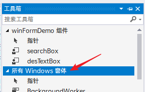

> 该文档中 , 关于 api 的列示, 使用 ins 代表该控件实例

> messageBox.show("xxx"); 提示对话框


### 创建项目

1. vs2019
2. c#  windows  桌面
3. 创建 windows窗体应用


 


### 项目结构

###### 入口文件

> program.cs 是程序入口

###### 视图文件

> xxx.cs 和 xxx.design.cs 是视图类, 采用了拆分类的方式, 继承自 Form 类
>
> * xxx.cs 用来写点击事件之类的业务代码, 右键 xxx.cs 可查看代码进而进行编辑
> * xxx.design.cs 用来写页面布局, 为自动生成的布局代码, 不要修改该文件

###### 资源文件

> 将所有使用到的字符串, 位图, 图标, 音频等为该项目的资源, 存放到项目下 Properties/Resources.resx 中

> 资源文件会被打包到 exe 文件中, 增大 exe 的体积

添加资源文件并使用

1. 在vs中双击Resources.resx 文件, 打开资源管理器

2. 点击添加现有文件

3. 建议重命名资源文件使得规范

4. 在代码中直接使用资源文件

   ```c#
   //直接使用该图片资源
   BitMap img = Properties.Resources.上一步中资源的名字;
   ```

5. 也可以直接在页面设计器中使用, 比如图片资源可直接在 PictureBox 的 image 属性中点击设置


### 控件

> 控件里的大部分属性都能直接在属性面板中找到并设置, 少部分不显示在属性面板的属性, 可通过查看该控件的代码获取, 然后在页面初始化时对控件实例的该属性进行修改


###### maskedTextBox

> 带检校的 textbox, 在输入框中直接显示规则限定 如 "    年   月   日"

属性

* beepOnError 输入不合法字符时是否 bb 地叫

* mask 掩码, 也就是输入字符串的规则, 内置了几种掩码

  | 掩码 | 规则                       |
  | ---- | -------------------------- |
  | 0    | 一个数字                   |
  | 9    | 一个数字 \| 空格           |
  | #    | 一个数字 \| 空格 \| + \| - |
  | L    | 一个ASC2字母               |
  | &    | 一个字符                   |
  | C    | 一个字符 \| 空格           |
  | A    | 一个字母 \| 空格           |

* rejectInputOnFirstFailure : 是否只要有一个字符输入不符合规则就拒绝整条输入

* text  值

* cutCopyMaskFormat : 复制文本框里的值时, 是否带着规则( 年,月,日 )一块复制

事件

* maskInputRejected : 输入不符合规则事件
* textChanged : 文本值改变事件


###### richTextBox

> 富文本框

属性

* lines :  文本框中的文本 , 一行文本是一个 string
* text : 文本框中的文本
* wordWrap : 是否自动换行

API

* ins.Clear()
* ins.Copy()
* ins.Paste()
* ins.Find()
* ins.LoadFile(路径 , RichTextBoxStreamType.PlainText)  加载文件到富文本框
* ins.SaveFile( 保存路径 )  保存内容到文件, 保存的文件应当是 rtf 格式的文件
* ins.Redo()
* ins.Undo()
* ins.SelectionFont 当前字体, 返回 Font 类型
* ins.SelectionAlignment 当前文本定位情况, 设置的值为 HorizontalAlignment.XXX

事件

* textChanged

* linkClicked 点击文本中的超链接事件

  ```c#
  private void richTextBox1_LinkClicked(object sender, LinkClickedEventArgs e)
          {
              //在新进程中打开链接地址
              System.Diagnostics.Process.Start(e.LinkText);
          }
  ```

* selectionChanged 选中文本变化事件

* 插入图片

  ```c#
  //先整一个按钮, 然后使用该按钮来插入图片 
  private void button1_Click(object sender, EventArgs e)
          {
              //加载图片
              Image img = Image.FromFile(@"E:\Python-Projects\PyPractice\opencvPra\imgs\yang.jpg");
              //将图片保存到剪切板
              Clipboard.SetImage(img);
              //从剪切板中粘贴图片
              this.richTextBox1.Paste();
          }
  ```

  


###### radiobox

> 单选按钮 

> 如果一个页面中同时包含多组 radiobox , 使用多个 groupbox 进行包裹


checkbox

> 复选框

* checkstate : 状态, 有三种状态, 选中, 未选中, 中间状态
* threestate : 是否支持三种状态切换, false 为只支持 选中 和 未选中 两种状态


###### pictureBox

> 显示图片

```c#
BitMap bm = new BitMap("图片路径\\, 不支持/");  //加载图片
pictureBox1.Image = bm; //设置图片
pictureBox1.SizeMode = PictureBoxSizeMode.Zoom; //设置缩放模式
//也可以,直接加载图片
pictureBox1.Load("图片路径\\, 不支持/");
```


###### comboBox

> 下拉列表, 就是 textBox + listBox

> 一次添加大量数据项时, 需要 combobox.beginUpdate() 和 combobox.endUpdate()

属性

* DropDownStyle : 下拉框样式, 是否输入
* DataSource : 动态数据源, 使用了数据源后需要操作数据项时, 操作方法同listBox
* DisplayMember : 当数据项是 object 类型时, 数据项显示的属性
* ValueMember : 当数据项是 object 类型时,  数据项的值使用哪个属性
* DropDownHeight : 下拉框高度
* items : 数据集合

api

* combobox.Items.[Add|Remove|Clear...] 数据项操作api , 绑定数据源后不可使用

事件

* selectedIndexChanged : 选择的项发生变化事件, 适合级联下拉列表的场景


###### listBox

> 平铺列表选项的面板

> 要加载大量数据时, 每次添加一项都会导致页面更新而降低效率, 前后应当加上  listbox.beginUpdate() 和 listbox.endUpdate()

> 在使用了 dataSource 之后, 不能直接通过 listBox.Items.[Add|Remove|RemoveAt|...] 之类的api操作数据, 应当先使用中间变量将 listBox.DataSource 接收下来, 然后修改该中间变量, 然后设置 listBox.DataSource 为 null, 最后将中间变量赋值给 listBox.DataSource

属性

* <span style="color:cyan;">dataSrouce</span> : 动态数据源, 应当是 object[] 类型的变量
* <span style="color:cyan;">displayMember</span> : 当数据项是 object 类型时,  设置具体在界面中显示数据项的哪个字段
* <span style="color:cyan;">valueMember</span> : 当数据项是 object 类型时, 设置每个数据项的值为数据项的哪个字段, 在使用 listBox.SelectedIndex 时获取到到该值 
* selectionMode : 多选还是单选
* multiColumn : 是否多列显示

事件

* selectedIndexChanged : 选择的项发生变化事件

*DataSource使用实例*

```c#
//在 InitializeComponent(); 之后执行的绑定数据源操作

//设置listbox数据源
            List<User> users = new List<User>();
            users.Add(new User(1,"alice", 20));
            users.Add(new User(2,"avice", 19));
            users.Add(new User(3,"aeice", 18));
            users.Add(new User(4,"rlice", 21));
            users.Add(new User(5,"aliee", 22));
            users.Add(new User(6,"aliye", 23));
            this.listBox1.DataSource = users;
            //设置显示在列表中的字段, 如果不设置, 默认显示数据项的 ToString() 结果
            this.listBox1.DisplayMember = "name";
            this.listBox1.ValueMember = "id";
            //绑定了数据源的listBox不可直接使用 listBox.Items 下的方法
            //先用中间变量将数据保存下来
            List<User> tmpUsers = this.listBox1.DataSource as List<User>;
            //然后修改该中间变量
            tmpUsers.RemoveAt(0);
            //然后将原DataSource设置为null
            this.listBox1.DataSource = null;
            //最后将修改后的中间变量赋值给DataSource, 同时还得再次设置displaymember和valueMember
            this.listBox1.DataSource = tmpUsers;
            this.listBox1.DisplayMember = "name";
            this.listBox1.ValueMember = "id";
```


###### listView

> 加强版的列表, 能够实现的功能同 windows 文件夹的各种显示模式, 能够设置表头, 实现按列排序功能

```c#
public void InitListView()
        {
            //设置显示模式为detail
            //detail : windows文件夹中的详情视图, 有表头
            //bigIcon : windows文件夹中的大图标视图
            //smallIcon : windows文件夹中的小图标视图
            //list : windows文件夹中的列表视图, 无表头, 只显示第一列数据
            this.listView1.View = View.Details;

            //设置整行选中
            this.listView1.FullRowSelect = true;

            //设置第一列可编辑(文件名编辑)
            //开启此设定后可通过慢双击进行编辑, 如果使用其他方式手动进入编辑, 可调用 beginEdit()
            //listView可绑定 beforEdit 和 afterEdit 事件, 分别为重命名前后的逻辑操作
            this.listView1.LabelEdit = true;

            //设置表头, 第二个参数是列宽, -2自适应
            listView1.Columns.Add("文件名",-2, HorizontalAlignment.Left);
            listView1.Columns.Add("修改时间",100, HorizontalAlignment.Left);
            listView1.Columns.Add("类型",100, HorizontalAlignment.Left);
            listView1.Columns.Add("大小",-2, HorizontalAlignment.Left);

            //每次往listView中添加数据项时, 都会导致视图的更新, 如果一次需要添加很多条数据, 那么会造成视图更新频繁, 严重影响性能
            //此时应当使用 BeginUpdate() 停止视图自动更新, 待到数据添加完毕后, endUpdate() 一次更新所有数据到视图中
            listView1.BeginUpdate();


            //设置listView的图标列表, 应当根据显示需求决定设置大图标列表还是小图标列表
            ImageList imglist = new ImageList();
            imglist.ImageSize = new Size(16, 16);//设置图标的大小
            imglist.Images.Add(Properties.Resources.ico_linux);
            imglist.Images.Add(Properties.Resources.ico_windows);
            listView1.LargeImageList = imglist;
            listView1.SmallImageList = imglist;

            //添加数据项, 这个是该数据项的第一个属性值
            //第二个参数是使用的图标在图标列表中的索引
            //因为文件夹中第一个属性为文件名, 一般都有图标, 所以把这个单列出来
            ListViewItem li = new ListViewItem("alice_is_girl", 0);
            //设置其余的属性值
            li.SubItems.Add("2020-02-02 18:18:18");
            li.SubItems.Add("avi");
            li.SubItems.Add("2.04GB");
            //将数据项添加到 listview 中
            listView1.Items.Add(li);

            //结束添加数据项, 更新视图
            listView1.EndUpdate();

        }
```

> ListView 可绑定 beforEdit 和 afterEdit 事件, 分别设置 重命名前后 的逻辑

```c#
//重命名后
        private void listView1_AfterLabelEdit(object sender, LabelEditEventArgs e)
        {
            //e.Item为编辑项的索引, e.Label为修改后的值, e.CancelEdit表示是否取消本次输入
            int index = e.Item;
            string val = e.Label;
            e.CancelEdit = true;
            MessageBox.Show("重命名 "+index+"-"+val+" 被取消, 因为你是个傻屌");
        }
```


###### <span style="color:cyan">DataGridView</span>

> 表格的形式展示数据

> 直接拖动生成的表格, 可直接右键设置列和数据
>
> 也可以直接设置数据源 , 比如数据库, 但是不推荐, 推荐在代码中绑定数据源


属性
* columns 列
* DataPropertyName 列属性, 绑定数据源的字段名
* columnHeadersVisible 是否显示表头
* rowHeadersVisible 是否显示行头
* allowUserToAddRows 是否允许添加数据
* allowUserToDeleteRows 是否允许用户使用delete键删除行
* allowUserToOrderColumn 是否允许用户通过拖动表头调换列的顺序
* allowUserToResizeColumn 是否允许用户调整列宽度
* allowUserToResizeRows 是否允许用户调整行宽度
* autoSizeColumnsMode 自动调整列宽模式, fill根据总列宽调整表格宽度
* backgroundColor 表格背景色
* DataSource 数据源

API

* ins.AutoGenerateColumns 指定数据源时, 是否自动创建列名, 如果数据源是数据库, 返回 DataTable 类型数据, 那么列名为返回表的字段名, 可以在sql中使用别名实现自定义返回表的字段名

事件

* cellClick 单击单元格内任意位置
* cellContentClick 单击单元格内值位置
* cellValueChanged 单元格值变化事件, 选中某行且修改了数据时被视为未提交状态, 此时不会触发该事件, 只有当该行失去焦点时, 才被视为提交完成, 触发该事件
* currentCellDirtyStateChanged 行数据被修改且未提交时事件 


> 在 CellValidating 事件中, e.ColumnIndex 为编辑的列索引, e.FormattedValue 为编辑后的值, e.Cancel 为是否取消本次编辑


###### checkedListBox

> 选项前带 复选框 的 listbox

属性

* multiColumn : 是否多列显示
* Items : 数据集合
* selectionMode : 选择模式 , 单选还是多选
* sorted : 是否支持排序
* checkOnClick : 是否点击数据项时就勾选该项
* DataSource : 动态数据源, 同上
* displayMember : 显示的属性, 同上
* valueMember : 值使用哪个属性, 同上

api

* ins.checkedItems : 勾选的数据项, 也就是哪些项前面的复选框被勾选了
* ins.selectedItems : 选中的数据项, 就是哪些数据项被选中了
* ins.Items.[Add|Remove|...] 操作数据

事件

* selectedIndexChanged : 选择的项发生改变事件
* itemCheck : 某项的选中状态发生变化事件


###### dateTimePicker

属性

* value : 值
* format : 显示的时间格式
* customFormat : 当 format 设置为 custom 之后, 按照该格式显示

api

* ins.Text  日期时间框里的值
* ins.Value 以默认格式返回日期时间框里的值

事件

* valueChanged


###### monthCalendar

> 日历面板

属性

* firstDayOfWeek
* maxSelectionCount 最多同时选择的天数
* showWeekNumbers 是否在左侧显示当前是今年的第几周
* TodayDate 设置今天是哪天

api

* ins.SelectionStart.ToLongDateString() 范围选择时的开始日期  ( 在日历上按住shift进行范围选择 )
* ins.SelectionEnd.ToLongDateString() 范围选择时的截止日期

事件

* dateChanged 选择的日期发生变化事件


###### numericUpDown

> 数字加减输入框

属性

* hexadecimal 值是否以十六进制显示
* thousandSeparator 十进制数显示时是否每三位添加 - 分割字符
* value 实际数值
* decimalPlaces 显示值的小数位数
* text 文本框里显示的值

api

* ins.UpButton();  增加值 
* ins.DownButton(); 减少值

事件

* valueChanged 值改变


###### timer

*在UI线程( 主线程 )中才能修改UI元素*

<span style="color:cyan;">System.Windows.Forms.Timer</span>

> 基于UI的定时器

> 按照给定的间隔时间, 循环触发事件
>

> 该定时器会独占主线程( UI线程 ), 所以能够在触发事件中修改UI元素 , 但是如果定时任务执行时间过长, 可能影响其他逻辑的执行

> 如果单次触发执行时间超过间隔时间, 会影响下次触发, 精度差

<span style="color:cyan;">system.Timers.Timer </span>

> 基于服务的定时器, 不在主线程( UI线程 )中执行, 而是在额外的线程中执行, 所以不能操作 UI元素
>
> 优势在于不会影响 UI 的显示, 且即使单次运行时间过长也不会影响下一次执行
>
> 特点是可以设置为一次性定时器

属性 

* autoReset : 否是为一次性的定时器

事件

* elapse

使用方法

1. 该定时器在工具箱中默认不显示, 可以在这里右键, 点击 ***选择项**** , 进入 ***选择工具箱项*** 窗口, 然后在 ***通用windows组件*** 中找到 Timers.Timer , 将其添加到工具箱
2. 然后直接在工具箱中找到 Timers.Timer , 拖动到页面中, 设置属性和触发事件

或者直接在代码中创建

1. ```C#
   //页面加载事件
           private void myform_Load(object sender, EventArgs e)
           {
             //创建timers.timer
               System.Timers.Timer t = new System.Timers.Timer();
               t.Enabled = true;
               t.AutoReset = true; //设置为无限定时器, 默认为true
               t.Elapsed += ttimer_elapsed;
               t.Interval = 1000;
               t.Start();
           }
   
           //timers.timer的触发事件
           public void ttimer_elapsed(object sender, System.Timers.ElapsedEventArgs e)
           {
               MessageBox.Show("1");
           }
   ```

在timers.timer 中修改 ui 的方式

> 通过 invoke 调用委托的方式修改 UI 

1. ```c#
    //timers.timer的触发事件
           public void ttimer_elapsed(object sender, System.Timers.ElapsedEventArgs e)
           {
               Action act = changeText;  //创建委托变量
               this.Invoke(act); //通过调用invoke切换到主线程, 从而能够修改UI
           }
           //修改ui的逻辑
           private void changeText()
           {
               this.tttext.Text = DateTime.Now.ToString();
           }
   ```

   

<span style="color:cyan;">system.Threading.Timer </span>

> 基于线程的定时器, 不会阻塞主线程
>
> 优势在于不会影响 UI 的显示, 且即使单次运行时间过长也不会影响下一次执行
>
> 特点是可以推迟开始, 也可以设置为一次性

1. 在工具箱中搜索并添加, 同上

2. 或者直接在代码中添加, 同样需要修改 ui 时 , 使用 invoke 切换到主线程执行逻辑

   ```c#
   //页面加载事件
           System.Threading.Timer thtimer;
           private void myform_Load(object sender, EventArgs e)
           {
               var count = 0;
               //创建thread.timer, 指定触发事件, 指定开始延迟, 指定时间间隔
               thtimer = new System.Threading.Timer(new System.Threading.TimerCallback(obj =>
               {
                   count++;
                   if (count == 5)
                   {
                       //执行5次后, 关闭定时器
                       thtimer.Change(System.Threading.Timeout.Infinite,0);
                   }
                   //使用invoke方式修改UI
                   //当然Action也可以定义为有参数的委托
                   this.Invoke(new Action<int>(changeText),count);
               }), null,3000,1000);
           }
          
           //修改ui的逻辑
           private void changeText(int count)
           {
               this.tttext.Text = DateTime.Now.ToString()+" -- "+count;
           }
   ```

   


###### progress

属性

* MarqueeAnimationSpeed 进度条中浮动动画滚动速度
* step 每次增量值
* value 当前值

API

* ins.PerformStep()  根据step值向前推进进度条, 如果进度条 style 设置为 marquee, 不能使用此方法更新进度条, 而是使用 `ins.value += ins.step;`
* ins.Increment(int value) 根据给定的value向前推进进度条


###### ImageList

> 单纯用来存放页面中要使用的图片供其他控件使用

> 其他控件需要先设置 imageList 属性, 然后只需指定图片索引即可使用该 imageList 中的图片


###### treeview

> 树形控件, 节点类型为 TreeNode

属性

* CheckBoxes 是否显示复选框
* FullRowSelect 选中时是否跨越选项宽度
* Nodes 根节点集合
* imageIndex 选项前图标索引
* indent 子节点缩进
* lineColor 节点连线颜色

API

* ins.CollapseAll()  折叠所有
* ins.ExpendAll()  展开所有
* ins.GetNodeAt( Point p ) 获取某个节点


###### toolTip

> 鼠标经过时显示气泡提示

> 直接拖动 toolTip 到对应控件上即可, 然后在对应控件的属性中设置 提示内容

属性

* active 是否启用
* autoPopDelay 气泡存在时间
* isBalloon 是否气球方式显示


###### notifyIncon

> 托盘图标

> 图标闪烁效果实际上是两个图标不断切换显示, 其中一个图标是完全透明的

> 可结合右键菜单实现托盘图标功能菜单

> 如果要添加托盘功能, 建议添加窗体 deactived 事件, 当窗口最小化时, 设置图标不在任务栏显示, 此时仅在托盘显示 , 当窗口正常显示时, 设置图标出现在任务栏

属性

* icon 显示在托盘的图标
* text 鼠标悬停在托盘图标时的提示文字
* visible 是否可见
* contextMenuStrip 右键菜单

事件

* mouseDoubleClick 鼠标双击托盘图标

<span style="color:cyan;">双击托盘图标显示或隐藏主页面</span>

```C#
//双击托盘图标显示或隐藏主页面
        private void notify_MouseDoubleClick(object sender, MouseEventArgs e)
        {
            if (this.WindowState == FormWindowState.Minimized)
            {//如果是最小化状态, 则显示窗口
                this.WindowState = FormWindowState.Normal;
                return;
            }
            if (this.WindowState==FormWindowState.Normal||
                this.WindowState == FormWindowState.Maximized)
            {//如果是正常显示状态, 则最小化窗口
                this.WindowState = FormWindowState.Minimized;
                return;
            }
        }
```

<span style="color:cyan;">通过托盘退出程序</span>

```C#
//通过托盘退出程序
        private void 退出ToolStripMenuItem_Click(object sender, EventArgs e)
        {
            this.notify.Visible = false;//关闭托盘图标
            this.Close();//关闭窗口
        }
```


###### 菜单栏

> MenuStrip 控件

属性

* shortcutkeys 快捷键, 一级菜单应当使用 alt+x 的快捷键, 同时需要在text属性后面加上 (&x) , 例如 文件(&F)
* items 一级菜单
* dropdownitems 二级菜单

事件

* click 点击菜单事件


###### 工具栏

> ToolStrip 控件


###### 状态栏

> statusStrip 控件


###### 右键菜单

> ContextMenuStrip 控件

1. 先在页面中拖一个 contextMenuStrip 控件进去, 并编辑选项
2. 给需要使用该右键菜单的控件添加右键点击事件, 其中通过调用 右键菜单实例.Show() 来显示右键菜单 , 或者直接在要使用该右键菜单的控件上设置 contextMenuStrip 属性
3. 右键菜单中每一个选项都是一个单独的变量, 可对该变量进行属性的设置来实现如禁用某些选项的功能

API

* ins.ShowDropDown() 显示子菜单


###### 选项卡

> tabControl 控件

属性

* drawMode 使用系统提供样式还是自定义样式
* multiline 是否允许多行显示选项卡
* tabPages 选项卡集合

API

* ins.SelectedTab 当前选中的选项卡
* ins.SelectTab( int index )  设置选中的选项卡
* ins.SelectedIndex 当前选中的选项卡的索引 

事件

* SelectedIndexChanged 选中的选项卡改变事件


###### splitContainer

> 分割面板, 显示为可调节大小的分割区域

属性

* borderStyle 分割线样式
* autoScroll 是否显示滚动条
* fixedPanel 调整窗口大小时, 固定某个面板宽度
* isSplitterFixed 拆分线是否可用
* orientation 拆分方向
* panel1Collapsed 面板1是否折叠
* panel1MinSize 面板1最小宽度
* splitterDistance 拆分线与窗口左边框或上边框的距离
* splitterIncrement 拆分线每次移动步长
* splitterWidth 拆分线宽度

事件

* splitteMoving 拆分线移动事件
* splitterMoved 拆分线移动完事件


#### 用户控件

> 需要在 工具栏 -> 工具 -> 选项 -> windows窗体设计器 -> 常规 -> 自动填充工具箱 -> True

##### 扩展控件

> 在原有控件的基础上对其扩展, 继承自 原有控件

> 一般扩展控件都会在当前解决方案下新建 C# 类库项目, 然后在原项目中直接使用该扩展控件, 额外的 C# 类库项目会被打包成 dll 文件, 需要放到 exe 文件同目录下才能使得 exe 文件正常运行

> 如果要使用其他解决方案下的类库文件, 应当先对其进行编译生成 dll 文件, 然后在要使用该扩展控件的项目工具箱中右键选择项, 浏览添加对应的 dll 文件

1. 解决方案资源管理器 -> 解决方案 -> 右键 ->  添加 -> 新建项目 -> C#类库(.net framework) 
2. 在新建的类库项目中 添加 类文件, 该类文件为用户控件类
3. 将该类文件继承自要扩展的控件类, 此时该项目还未引用 System.Windows.Form 库, 需要 右键引用 -> 添加引用, 然后添加 Form 库
4. 在此继承了原控件类的扩展控件类中进行定制, 比如添加自定义属性和方法
5. 重新生成解决方案, 可在原项目工具箱中直接使用该扩展控件

##### 组合控件

> 在原有控件的基础上, 进行组合形成新的控件, 继承自 UserControl

> 可以使用用户控件的方式对原生的 textBox 进行封装, 用来解决其不能设置 padding 的问题

1. 在解决方案中添加 用户控件
2. 使用可视化的编辑方式编辑新建的 用户控件
3. 生成 -> 生成解决方案
4. 重新打开要使用用户控件的页面, 在 工具箱 中会出现上面创建的控件, 直接拖进来使用

<span style="color:cyan;">自定义属性</span>

1. 可以在 用户控件.cs 代码类中添加自定义属性, 该属性会出现在 vs 的属性控制面板中, 通过设置自定义属性 get 和 set 行为来达到需求

   ```c#
   //在 用户控件.cs 中控件类添加自定义属性
   //自定义属性
   public string searchText
   {
   	get
   	{
   		return this.textBox1.Text;
   	}
   	set
   	{
   		this.textBox1.Text = value;
   	}
   }
   ```

2. 也可以重写原有属性

   ```c#
    //重写原有属性
   public override string Text { get => this.textBox1.Text; set => this.textBox1.Text = value; }
   ```

3. 修改用户属性后, 要重新执行生成解决方案, 然后才能在其他页面中使用该 用户控件 的 自定义属性

<span style="color:cyan;">自定义事件</span>

1. 在 `用户控件.cs` 文件中添加 `event EventHandler 自定义事件名;` 的属性

   ```c#
   //自定义事件
   public event EventHandler Search;
   ```

2. 设置原有的事件触发时调用该 `自定义事件` , 比如某个控件的 click 事件时进行调用

   ```c#
   //通过子picturebox控件的click事件来触发自定义事件search, 也就是用户点击该控件中的 picBox 控件那部分时, 会触发用户自定义的 Search事件的处理逻辑
   private void pictureBox1_Click(object sender, EventArgs e)
   {
   	//如果Search方法不为空就调用
   	Search?.Invoke(this, e);
   }
   ```

3. 在用到用户控件的界面中设置 `自定义事件` 的 `触发方法`

   ```c#
   //自定义事件触发逻辑
   private void toSearch(object sender, EventArgs e)
   {
   	MessageBox.Show("begin to search...");
   }
   ```

4. 比如上面是在 click 事件的触发逻辑中调用的自定义事件 ,

5. 整个调用流程为, 在使用用户控件的页面中点击 picBox 区域, 因为该区域的点击事件调用了自定义事件的处理逻辑, 所以在点击该区域时, 实际上是在触发 自定义事件 绑定的处理逻辑


##### 自定义控件

> 完全自定义的控件, 直接继承自 Control


### 窗体

###### 系统对话框

> 系统内置对话框


###### 窗体

窗口属性

* fromBorderStyle : 设置边框, None 为无边框

* showInTaskBar : 是否显示在任务栏

* startPosition : 启动时显示位置

* isMdiContainer : 是否是Mdi容器, 如果是, 那么它的子窗口只能在其内部操作, 不能脱离本窗体

  ```c#
  //一般为mdi窗口创建子窗体的过程
  //0.首先要设置父窗体的 isMdiContainer 为 true
  //0.还要保证mdi父容器要直接展示子窗口的位置是空闲的
  //1.新建子窗口实例
  Pages.about ab = new Pages.about();
  //2.设置子窗口的父容器为mdi窗口
  ab.MdiParent = this;
  //3.show子窗体, 注意mdi子窗口不能使用 showDialog 来显示
  ab.Show();
  ```

> fromBorderStyle  无 , showInTaskBar 否, startPosition 屏幕中央, 适合做软件加载页

窗口动作

* `窗口实例.show();`  就是额外打开一个窗口, 与原窗口互不影响
* `窗口实例.showDialog();` 以对话框的形式打开一个窗口, 新窗口不关, 原窗口不能操作

* `窗口实例.activite();`   激活窗口, 就是焦点定位到该窗体
* `窗口实例.hide();` 隐藏窗口
* `窗口实例.close();` 关闭窗口

窗口事件

* `load` 窗口加载时事件, 默认先初始化控件, 然后执行 load 事件
* `formclosing` 窗口关闭前事件
* `formclosed` 窗口关闭后事件
* `activited` 窗口获得焦点事件
* `deactivited` 窗口失去焦点事件
* `keypress` 在窗口中按下键盘事件
* `keyup` 在窗口中释放键盘事件