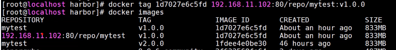

***Jenkins 安装***


​		Jenkins 实现自动从 git 拉取代码 **[git parameter插件]**，然后使用 maven 构建打包代码为可执行文件 **[直接将 maven 和 jdk 添加到 jenkins 数据目录下并设置]**，最后将通过测试的可执行文件使用 docker 的方式部署到服务器 **[publish over ssh 插件]**

*   设置 JDK 和 maven

    ​		因此，应当在 Jenkins 中添加 jdk 和 maven，把 jdk 和 maven 整个软件文件夹复制到 **挂载的数据卷** 下，然后在 jenkins 主页面中配置这两个的所在位置：

    1.  jenkins 主页
    2.  manage jenkins
    3.  global tool configuration
    4.  add jdk 、add maven 设置两者所在位置

*   设置要发布软件的服务器位置

    1.  主页
    2.  configure system
    3.  publish over ssh
    4.  add ssh servers
    5.  输入服务器地址、用户名、密码、部署路径等信息


Jenkins:2.319.3-lts

位置： /usr/local/docker/jenkins/

**数据卷挂载位置**： /usr/local/docker/jenkins/data/

用户名： root

密码： 123123

已修改镜像源为清华源


##### Jenkins CI

实现以下流程的自动化： 

开发 -> 提交到 git -> 构建可执行程序 -> 发送到目标服务器 -> 构建 docker 镜像 -> 运行 docker 容器

至此，在目标服务器上已经存在可供测试的最新开发内容

1.  jenkins 自动拉取代码设置

    1.  首先保证将开发好的代码 push 到 git 远程仓库

    2.  在 jenkins 中新建项目 

    3.  

    4.  

    5.  保存

    6.  此时在该项目中点击左侧 ***立即构建*** 可自动从该 git 仓库拉取代码

        

    7.  

    8.  此时 `docker exec -it jenkins bash` 进入 `~/workspace/项目名` 为 jenkins 从 git 拉取到本地的代码

2.  自动 maven 构建代码设置

    1.  进入项目设置

    2.  构建 -> 调用顶层 maven 目标

        

    3.  输入 maven 构建命令

        

    4.  应用保存，此时再次 ***立即构建*** 可实现自动从 git 拉取代码并编译打包代码到 jenkins 本地的 workspace 

3.  以 docker 的方式自动部署到目标服务器设置

    1.  首先确保目标服务器上有docker，因为要在上面使用docker运行服务

    2.  在原项目中添加使用 jar 包构建 docker 镜像的 Dockerfile

        

    3.  在原项目中添加 docker-compose 配置文件，即使用 docker-compose 启动docker容器

        

    4.  在原项目中将以上更改提交到 git，此时 jenkins 可从 git 拉取 docker 相关文件

    5.  在jenkins项目设置中，构建后操作

    6.  send build artifacts over ssh

    7.  使用在系统配置中设置的目标服务器地址

    8.  设置 sources files，即要发送到目标服务器的文件，可使用正则

        

    9.  设置发送后执行的命令 exec command

        

    10.  此时 ***立即构建*** 即可完成从git拉取代码，使用maven构建项目，以docker的方式部署到目标服务器的功能

         >   如果构建日志出现 [stats 127]，那么是不存在该命令，此处可能是 docker-compose 命令未放到 /usr/local/bin 中


##### Jekins CD

实现的功能是，利用 git 中的tag，拉取不同的代码进行构建部署

至此，已经实现版本切换和回退功能

>   通过 git 中提供的 tag 功能，实现根据不同的tag拉取不同代码，然后完成后续流程
>
>   git 中的 tag 就相当于 ***存档点***，保存一个时点的代码记录

1.  jenkins 项目设置

2.  general

3.  参数化构建过程

4.  git参数，添加对 tag 的使用，并设置 git tag 为变量 tag

    

5.  在构建过程中，使用 maven 构建之前添加切换 git tag 的命令

    

6.  在 git 中提交不同版本的代码，分别新建不同的 tag

7.  此时在 jenkins 的项目中可根据不同 tag 的代码执行 ***立即构建***


##### 代码检查 SonarQube

jenkins可以借用SonarQube完成代码检查，所以SonarQube应当安装到 jenkins 所在主机上


前提条件：

1.  `docker pull postgres` 安装 SonarQube 需要用到的数据库
2.  `docker pull sonarqube:8.9.6-community` 

单独使用sonarqube设置

>   本机实例密码 admin/123123

1.  新建用于启动 sonarqube 的 docker-compose.yml

    

2.  `docker-compose up -d` 启动

3.  `ip:9000` 进入 sonarqube 主页，默认密码 admin/admin

4.  启动时 `docker logs sonarqube -f` 查看日志，如果报错 vm.max_map_count 不足，那么 `sudo vim /etc/sysctl.conf` , 添加一行 `vm.max_map_count=262144`，然后 `sudo sysctl -p`刷新设定

    

    


##### 通过maven使用sonarqube

1.  开启 sonarqube 服务

2.  在 maven 的 settings.xml 中添加 profile 并启用

    

3.  直接在 maven 项目根目录 `mvn sonar:sonar` 即可进行代码检查，检查结果去 sonarqube 主页查看

    


##### 通过 sonar-scanner 工具使用 sonar

1.  下载 sonar-scanner 工具，解压

2.  进入要检测的项目根目录，调用 sonar-scanner 对当前项目进行检测，检测结果出现在 sonar 主页

    

    ```shell
    /路径/sonar-scanner/bin/sonar-scanner 
    -Dsonar.sources=./ #要检查的项目根目录
    -Dsonar.projectname=test-name # 显示在 sonar 主页的检测项目名
    -Dsonar.login=xxxxxx # 从sonar主页->个人中心获取到的 token
    -Dsonar.projectKey=test-name #检测项目标签
    -Dsonar.java.binaries=./target/ #生成的可执行文件的位置
    ```

    


##### 在 jenkins 中使用 sonar

1.  在 jenkins 中安装插件 sonarqube scanner

2.  主页，系统配置，SonarQube servers，add sonarqube，添加一个 sonarqube server，其中密码部分可以选择 secret text，然后填入在 sonar 主页生成的 token 即可

    

3.  下载 sonarqube scanner，放到 jenkins 的挂载数据卷中

4.  进入 jenkins 主页，全局工具配置，设置 sonarqube scanner 的本地位置

    

5.  在 jenkins 中进入某个想要加入代码检查的项目，进入设置

6.  在编译过程中， maven构建后，添加使用 sonarqube scanner

    

7.  ***立即构建*** ，此时在构建代码后，会调用 sonarqube 进行代码检查，结果出现在 sonarqube 主页


##### 镜像仓库Harbor

Harbor 是一个本地 docker 镜像仓库，功能等同但强大于 registry


​		之前的部署方式需要在每个部署服务器上本地构建镜像，如果集群部署，那么每个部署服务器都需要构建镜像会很浪费时间，如果能提前把镜像构建完成，然后部署服务器只需要拉取最新镜像并运行，将减少部署时间

​		使用额外的 docker 镜像仓库 Harbor，每次更新，只需要构建一次镜像并保存到 harbor中，然后通知部署服务器去 harbor 拉取并运行最新镜像即可


###### 本地安装harbor

>   本地部署 81 端口

1.  github 下载 release 压缩包
2.  解压，复制一份 `harbor.yml.tmpl`为 harbor.yml 安装配置文件，指定  hostname（要部署在哪个服务器上），port（服务端口），注释掉 https 相关配置
3.  执行 install.sh 安装 harbor 到本地，实际上是安装多个 docker 镜像到本地
4.  harbor 安装完成后，以 docker-compose 的方式运行
5.  在上述安装配置文件中指定的 hostname 和 port 上访问 harbor 主页
6.  默认用户名密码，admin/Harbor12345


###### 手动使用 harbor

1.  进入 harbor 主页，新建项目，接下来使用该项目保存 docker 镜像

2.  在要推送镜像到 harbor 的服务器上配置 docker 提交镜像地址，`vim /etc/docker/daemon.json`

    

3.  `systemctl restart docker` 重新dockers服务使得配置生效

4.  向 harbor 仓库提交的镜像 tag 需要满足格式 `harbor地址/harbor项目名/镜像名称:镜像版本号`

5.  使用 docker images 查看要 push 到 harbor 中镜像的 镜像ID

    

6.  使用 `docker tag 镜像ID 新的tag名称`  修改镜像 tag

    

7.  `docker login -u 用户名 -p 密码 仓库地址` 登录到镜像仓库

    

8.  `docker push 镜像名:版本号` 推送到 harbor 仓库

    

9.  推送成功，到 harbor 主页项目下查看镜像

10.  `docker pull 仓库地址/项目名/镜像名:版本号` 拉取镜像到本地

     

     


###### jenkins自动化harbor

>   在本功能实现中，需要在 jenkins 容器内部执行 docker 命令制作镜像并推送到 harbor 中，然后再通知各个部署服务器
>
>   那么如何在 jenkins 容器中执行 docker 命令？
>
>   一种方式是在容器内安装 docker和docker-compose，但是在容器中安装 docker 太麻烦，因此不使用
>
>   <span style="color:green;font-weight:bold">一种方式是在容器内直接使用宿主机上的 docker，实际上只需要把宿主机内的 docker 可执行文件及相关文件映射到 jenkins 容器内部，然后 jenkins 调用映射的可执行文件，实际上就是在执行宿主机上的 docker，这种方法比较简单</span>

>   注意要提前把 docker push 的地址在  daemon.json 中定好，然后重启 docker 使其生效


jenkins 容器使用宿主机docker

1.  docker 通信所需文件为 /var/run/docker.sock，其拥有者为 docker 用户，需要先把其拥有者改为 root，然后对其他用户和组都开放读写权限

    `chown root:root docker.sock`

    `chmod o+rw docker.sock`

2.  在 jenkins 容器内挂载 docker 可执行文件及相关文件，修改启动 jenkins 的 docker-compose.yml

    

3.  重启 jenkins 容器使得挂载生效，进入 jenkins 容器内部，执行 docker 命令查看是否已经能够执行宿主机上的 docker


jenkins 实现自动制作镜像并推送到 harbor

>   jenkins 中 docker 实际上是在调用宿主机上的 docker，所以制作的镜像实际上是保存到了宿主机上，在宿主机上 docker images 查看 jenkins 制作的镜像

1.  在 jenkins 项目构建操作的代码检查步骤后，添加一步 `执行 shell`

    

2.  在 jenkins 中 ***立即构建***


部署机更新镜像

>   ​		上述实现了 jenkins 构建镜像并 push 到 harbor 中，接下来要实现的是 jenkins 通知各个部署服务器自己去拉取最新镜像并运行
>
>   ​		这里的实现方式为，先在各个部署机上定义 shell 脚本，脚本中拉取最新镜像并运行，然后 jenkins 直接调用部署服务器上的脚本即可

1.  在部署服务器上写脚本 deploy.sh

    ```
    # harbor 地址
    harbor_addr=$1
    # harbor 项目名
    harbor_repo=$2
    # 镜像名
    project=$3
    # 镜像版本号
    version=$4
    # 启动容器后，映射到宿主机的端口
    hostPort=$5
    # 容器内服务端口
    containerPort=$6
    
    # 镜像完整名称
    imageName=$harbor_addr/$harbor_repo/$project:$version
    echo $imageName
    
    
    # 查看该镜像是否正在运行，如果正在运行，停止，删除
    container_id=`docker ps -a | grep $project | awk '{print $1}'`
    if [ "$container_id" != "" ] ; then
    	docker stop $container_id
    	docker rm $container_id
    fi
    
    
    
    # 查看该镜像改版本是否存在，是则删除旧镜像
    curVersion=`docker images | grep $project | awk '{print $2}'`
    if [[ $curVersion =~ $version ]] ; then
    	echo 'image exist, delete old image'
    	docker rmi -f $imageName
    fi
    
    # 登录到 harbor
    docker login -u admin -p Harbor12345 $harbor_addr
    
    # 拉取镜像
    docker pull $imageName
    
    # 运行镜像
    docker run -d -p $hostPort:$containerPort --name $project  $imageName
    
    
    echo "SUCCESS"
    ```

2.  为了方便调用，把 deploy.sh 加入到系统路径中，先 `echo $PATH` 查看当前系统路径，然后把 deploy.sh 放到任意一个系统路径中

3.  此时在 jenkins 的构建后操作中，无需使用之前的本地构建镜像逻辑，只需添加 shell 命令调用 deploy.sh 即可 `deploy.sh 192.168.43.36:81 repo cicdproj v2.0 9998 9999`

    


##### Jenkins 流水线部署

>   上述方法都是基于 freestyle 风格的任务，这种方式的缺点在于所有阶段的构建和输出都混在一起
>
>   使用 pipeline 风格的任务可以使得每个构建步骤更加清晰独立，更加有利于大型项目的构建部署


1.  新建 jenkins 任务，选择流水线风格

2.  进入任务，配置，使用 groovy 语法定义流水线任务，支持两种方式定义流水线

    *   直接在 jenkins 中配置流水线任务
    *   从 scm 服务器例如 git 上拉取 Jenkinsfile，读取其中的流水线配置

    >   推荐使用 scm 的方式获取 流水线配置，这样每次修改配置时，只需进入到 git 中修改文件并提交即可，无需进入 jenkins 中进行配置

3.  通过流水线命令生成，可获得 groovy 代码

    

4.  完整的CI/CD流水线配置文件现已加入 https://gitee.com/aclic/test_ci_cd/blob/master/Jenkinsfile

