#### docker中使用

>   墙裂推荐使用 docker 玩

1.  拉取 es 和 kibana 镜像， 注意版本保持一致

    ```sh
    docker pull docker.elastic.co/elasticsearch/elasticsearch:7.15.2
    docker pull docker.elastic.co/kibana/kibana:7.15.2
    ```

2.  写一个脚本，一键启动 es 和 kibana， 注意要先启动es

    ```sh
    #!/bin/bash
    
    # network
    # docker network create elastic
    
    # es
    # --net 设置所在子网
    # -e "ES_JAVA_OPTS" 设置es的jvm参数
    docker run -d --rm --name es --net elastic -p 127.0.0.1:9200:9200 -p 127.0.0.1:9300:9300 \
            -e "discovery.type=single-node" \
            -v /var/elasticsearch/config/elasticsearch.yml:/usr/share/elasticsearch/config/elasticsearch.yml \
            -v /var/elasticsearch/data:/usr/share/elasticsearch/data \
            -v /var/elasticsearch/plugins:/usr/share/elasticsearch/plugins \
            -e ES_JAVA_OPTS="-Xms64m -Xmx128m" \
            docker.elastic.co/elasticsearch/elasticsearch:7.15.2
    
    # kibana
    docker run --rm --name kibana --net elastic -p 127.0.0.1:5601:5601 \
            -v /var/elasticsearch/kibana/config/kibana.yml:/usr/share/kibana/config/kibana.yml \
            docker.elastic.co/kibana/kibana:7.15.2
    
    ```

3.  墙裂推荐使用外挂文件卷启动 es 和 kibana，所以在本机上创建出来 es 的 config 文件、data文件夹、plugins文件夹以及kibana的config文件

    ```yml
    # es 的 config 文件
    cluster.name: "ultraman"
    network.host: 0.0.0.0
    
    # 为了能让kibana访问到es服务，请设置为允许跨域
    http.cors.enabled: true
    http.cors.allow-origin: "*"
    http.cors.allow-credentials: true
    ```

    ```yml
    #kibana的config文件
    
    #
    # ** THIS IS AN AUTO-GENERATED FILE **
    #
    
    # Default Kibana configuration for docker target
    server.host: "0"
    server.shutdownTimeout: "5s"
    # 在使用docker的方法时，这里的域名应当是docker启动的es容器的name值
    elasticsearch.hosts: [ "http://es:9200" ]
    monitoring.ui.container.elasticsearch.enabled: true
    
    # 切换到中文显示，本质就是使用人工翻译的一个映射关系文件
    i18n.locale: "zh-CN"
    ```

4.  在docker 中创建一个子网，让 es 和 kibana都处于该子网中，以便于通信

    ```sh
    docker network create elastic
    ```

5.  运行第二步中的一键启动脚本，注意要先 `chmod +x filename` 赋予运行权限

6.  启动后，使用 `docker ps` 查看es容器和kibana容器的运行情况

7.  `127.0.0.1:9200` 访问es服务

8.  `127.0.0.1:5601` 访问kibana服务

9.  在kibana中操作es服务


#### 安装

elasticsearch

下载安装包解压即可，也可直接下载 docker 镜像进行启动，需要修改配置文件，允许跨域访问，因为需要其他端口上的服务来获取到es的状态

[elasticsearch-head](https://github.com/mobz/elasticsearch-head)

节点状态监控程序，实时显示集群中各个节点的数据状态

直接下载，然后 `npm install`, 然后 `npm run start`, 最后 `localhost:9100`

kibana

节点数据管理操作统计平台


#### 概念

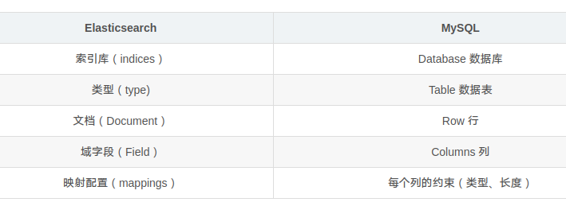

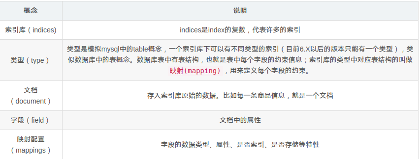


#### 倒排索引

首先根据从文档中搜集所有出现的分词，为每个分词建立对应的记录表，例如

| 分词  | id      |
| ----- | ------- |
| alice | [1,2,4] |
| is    | [3,6]   |
| girl  | [5]     |

这表代表，id为1,2,4的记录中，出现了分词 alice，那么对于 %alice% 的查询，只需要在原表中查询id为1,2,4的记录即可

原表如下

| id   | content               |
| ---- | --------------------- |
| 1    | alice are boy         |
| 2    | bob and alice are boy |
| 3    | bob is boy            |
| 4    | alice are god         |
| 5    | boo are girl          |
| 6    | boo is dog            |

不过对于分词表，肯定不能顺序遍历，否则效率太低，对于分词表再建立索引，然后使用索引定位分词表中的记录


#### 分词

​	分词就是把字符串文本按照规则提取关键字，对于拉丁语系，就按照标点符号和空格来分词，这显然不适用于中文，因为中文都是连在一起的，比如“吃了吗”，会被分为“吃”，“了”，“吗”，这并不符合我们的预期

​	对于中文文本，应当使用额外的分词方法，好在es为我们提供了可扩展的分词功能，我们可以安装中文分词插件来对中文进行分词

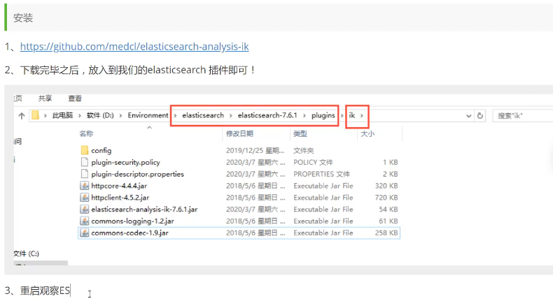

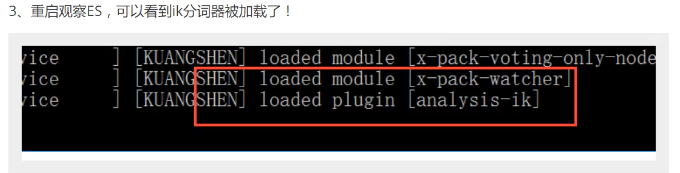

4.  也可以使用自带的插件命令行查看加载的插件

    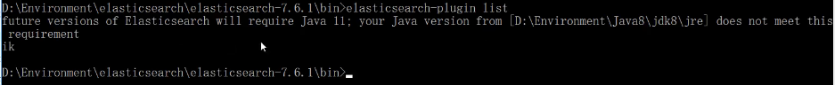

5.  打开 kibana 进行测试

    ik分词器两种分法， ik_smart 最少切分，ik_max_word 最小粒度切分

    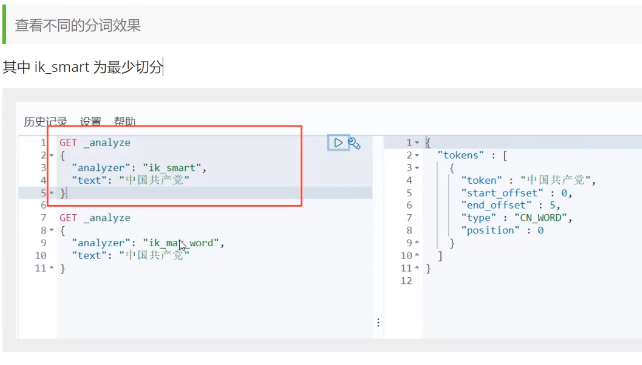

    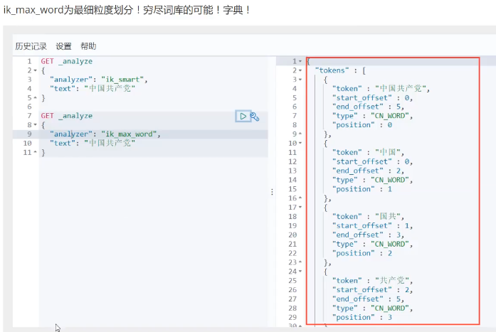

6.  如果要扩展自定的词语，在 `es/plugins/ik/config/IKAnalyser.cfg.xml` 中添加自定义的词语字典文件位置，词语字典为 `xxx.dic` ，其中每个词语占一行

7.  注意修改完插件配置后要重启 es，然后再次在 kibana 中测试分词效果


#### CRUD

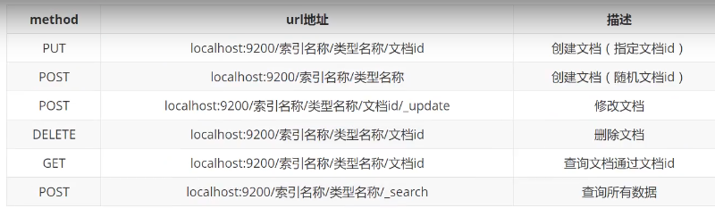

##### 添加记录

没有对应索引或者类型时，自动创建该索引或类型

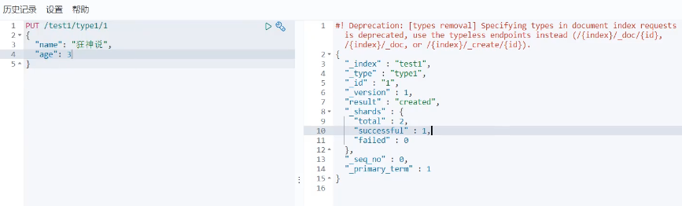

新版本中默认类型名为 _doc

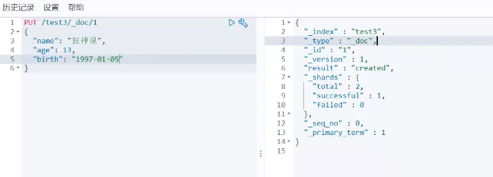

##### 创建索引

相当于建表

>   在创建表的时候，可以指定每个字段的类型，如果是 text，那么值会被分词器解析，如果是 keyword，那么值不会被分词器解析，直接就是整个的


##### 查看索引信息

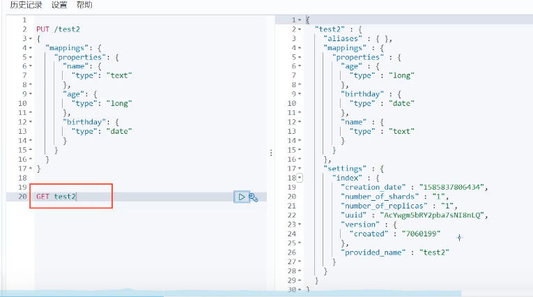

##### 查看各种信息

本质上 head 服务就是不断通过发送请求获取各种状态信息，然后展示到页面上

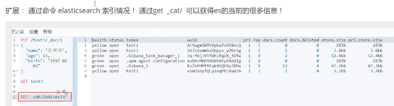

##### 修改记录

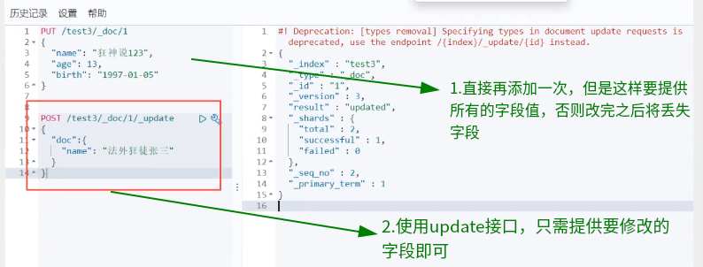

##### 删除


##### 查询记录-简单

`GET /索引/类型/记录id`  按照id查询

`GET /索引/类型/_search?q=name:alice` 按照字段精确查询


##### 查询记录-复杂

###### 精确查询

>   精确查询用 term 构建 query

term直接使用倒排索引查询，不进行分词，效率高


###### 模糊查询

>   模糊查询用 match、bool等构建 query

>   模糊查询都会先进行分词，然后再进行查询

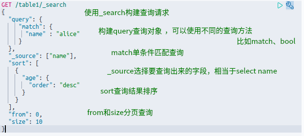

###### 多条件查询

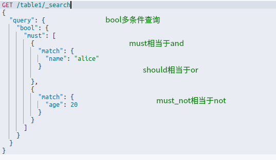

###### 高亮查询

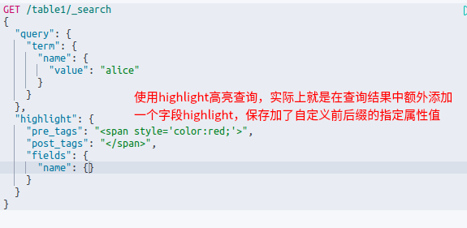


##### 查询结果

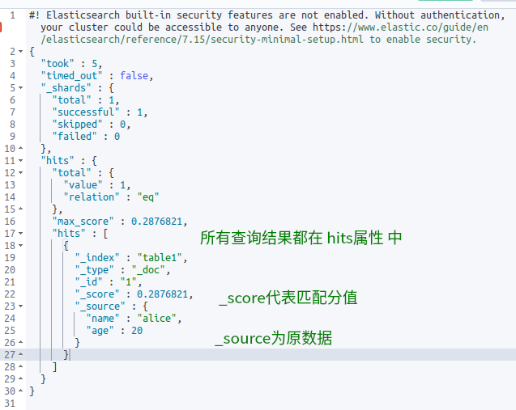


