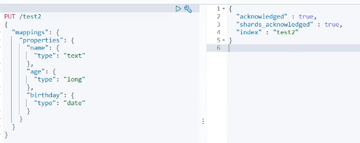

##### 安装

elasticsearch

下载安装包解压即可，也可直接下载 docker 镜像进行启动，需要修改配置文件，允许跨域访问，因为需要其他端口上的服务来获取到es的状态

elasticsearch-head

节点状态监控程序，实时显示集群中各个节点的数据状态

kibana

节点数据管理操作统计平台

##### 概念

##### 倒排索引

首先根据从文档中搜集所有出现的分词，为每个分词建立对应的记录表，例如

| 分词  | id      |
| ----- | ------- |
| alice | [1,2,4] |
| is    | [3,6]   |
| girl  | [5]     |

这表代表，id为1,2,4的记录中，出现了分词 alice，那么对于 %alice% 的查询，只需要在原表中查询id为1,2,4的记录即可

原表如下

| id   | content               |
| ---- | --------------------- |
| 1    | alice are boy         |
| 2    | bob and alice are boy |
| 3    | bob is boy            |
| 4    | alice are god         |
| 5    | boo are girl          |
| 6    | boo is dog            |

不过对于分词表，肯定不能顺序遍历，否则效率太低，对于分词表再建立索引，然后使用索引定位分词表中的记录

##### 分词

​	分词就是把字符串文本按照规则提取关键字，对于拉丁语系，就按照标点符号和空格来分词，这显然不适用于中文，因为中文都是连在一起的，比如“吃了吗”，会被分为“吃”，“了”，“吗”，这并不符合我们的预期

​	对于中文文本，应当使用额外的分词方法，好在es为我们提供了可扩展的分词功能，我们可以安装中文分词插件来对中文进行分词

4.  也可以使用自带的插件命令行查看加载的插件

    

5.  打开 kibana 进行测试

    ik分词器两种分法， ik_smart 最少切分，ik_max_word 最小粒度切分

    

    

6.  如果要扩展自定的词语，在 `es/plugins/ik/config/IKAnalyser.cfg.xml` 中添加自定义的词语字典文件位置，词语字典为 `xxx.dic` ，其中每个词语占一行

7.  注意修改完插件配置后要重启 es，然后再次在 kibana 中测试分词效果

##### CRUD

添加记录，没有对应索引或者类型时，自动创建该索引或类型

新版本中默认类型名为 _doc

创建索引，相当于建表

查看索引信息

查看各种信息，本质上 head 服务就是不断通过发送请求获取各种状态信息，然后展示到页面上

修改记录

删除

查询记录

`GET /索引/类型/记录id`  按照id查询

`GET /索引/类型/_search?q=name:alice` 按照字段精确查询

