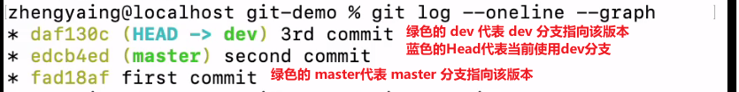

###### 概念

SVN: 集中式版本管理工具, 将所有版本内容存放到中心服务器上, 然后客户端仅仅保存一个版本内容到本地, 如果中心服务器宕机, 那么所有历史版本都将无法获取

Git : 分布式版本管理工具, 每个客户端都存放所有版本的内容, 可以看做所有客户端都是服务端, 可以很方便地进行历史版本操作

###### 文件结构

###### 本地文件结构

`git log` 查看commit到本地库的记录

`git log --pretty=online` 以一行的简洁方式查看commit到本地库的记录

`git reflog` 带步数地查看commit到本地库的记录

###### 本地回退

`git reset --hard 索引` 定位到指定的commit版本, 这里的索引通过 `git reflog` 查看

`git reset --mixed 索引` 定位到指定的commit版本, 这里的索引通过 `git reflog` 查看 , 工作区不回退

`git reset --soft 索引` 定位到指定的commit版本, 这里的索引通过 `git reflog` 查看 , 工作区和暂存区不回退

###### 本地版本操作

通过 `git add .` 将工作区保存到暂存区

使用 `git diff` 比较工作区和暂存区的文件差异

通过 `git commit` 将暂存区保存到本地库

使用 `git diff 索引号` 比较暂存区和本地库中指定版本的文件差异

###### 分支

通过 `git branch -v` 查看所有分支

`git branch 分支名` 创建新的分支

`checkout 分支名` 切换到分支

`checkout 远程库别名/远程库分支` 也可以切换到远程库的指定分支

###### 合并

`git merge 分支名` 将指定分支内容合并到当前分支中

`git merge 远程库别名/远程库分支` 也可以将远程库的指定分支合并到到当前分支

合并操作实际上就是

* 将指定分支中新增的文件添加到当前分支
* 将指定分支中与当前分支中相同的文件中地内容进行合并, 如果是在同一文件中同一位置上存在差异, 那么会产生冲突而无法合并成功

出现冲突, 会导致 `git merge` 失败, 在git bash 中显示为 (当前分支名|merging), 即正在合并的状态

此时就需要人为决定保留冲突中的哪一个部分, 然后手动修改冲突位置

修改完后只是将工作区中的内容进行了修改, 还需要将解决冲突后的内容提交到当前分支的本地仓库, 使用  `git add . && git commit` 将解决冲突后的内容提交到本地库

成功提交完毕后, 即自动完成合并, 退出 merging 状态

###### 远程仓库

`git remote -v` 查看所有远程仓库的别名

`git remote add 别名 远程库地址` 添加一个远程库地址别名, 这里的别名是设置给当前这个本地仓库的

`git push 远程库别名 要把本地库的哪个分支推送到该远程库` 如果远程库此时没有分支, 那么将自动在远程库创建分支并推送, 并且显示 `* [new branch]`

在 `git push` 之前, 需要先进行 `git pull` 将远程库的内容拉取到本地, 这是因为可能会差生冲突, 需要用户在本地完成整合后, 再将没有问题的结果推送到远程库

`git clone 远程库地址` 将远程库上的内容克隆到本地

clone操作实际上包括了三个步骤:

1. 初始化本地仓库
2. 将远程库内容下载到本地
3. 将该远程库地址添加为别名

###### 远程项目参与者

对于一个远程仓库, 所有用户都可以 clone ,但是只有项目参与者能够进行 push 操作将本地仓库的内容提交到远程仓库, 如果未成为项目的参与者, 在 push 的时候会失败

管理项目的参与者

1. 登录项目管理者的账户 ,进入该远程仓库, settings -> manager access -> invite numbers -> search user -> submit invitation, 就可以邀请其他用户成为该项目的参与者, 然后在邀请列表中复制邀请链接, 发送给被邀请者

2. 然后登录被邀请者的账号, 在地址栏中录入邀请连接, 即可加入项目

###### 操作远程仓库

`git fetch 远程库别名 远程库分支` 仅仅将远程库指定分支内容下载到本地, 不更新工作区

`git pull 远程库别名 远程库分支` 将指定远程库指定分支内容下载并且和当前分支合并, 相当于 `git fetch` + `git merge`

`git pull` 拉取过程中的合并操作可能产生冲突, 此时需要将拉取到本地的冲突文件手动修改, 然后 `git commit` 完成合并提交

###### fork功能

在 github 上, 可以通过 fork 复制一份别人的远程仓库到自己的账户下, 然后可以对自己的该仓库进行修改提交, 最后, 在 pull request 中对原项目提交修改请求, 远程库所有者所有者会收到 pull request 请求, 可以选择通过, 然后将该请求的修改内容提交到该远程仓库中

###### unrelated histories

如果本地仓库不是空的, 那么此时使用 `git clone` 或者 `git pull` 从远程仓库拉取内容时, 会因为 unrelated histories 而无法拉取成功, 因为本地仓库存在提交记录, 这些提交跟远程仓库的版本都是互不想干的, 所以导致无法拉取成功, 此时可以 `git pull --allow-unrelated-histories` 来忽略不相干检查, 直接将远程仓库内容拉取到本地

文件/快照/分支

每次提交都将文件保存为hash文件, 每次都生成新的hash文件, 原则就是不修改, 只新增, 这样就能保证数据不会错乱和丢失

快照文件不存真正的文件, 只存一个hash文件的清单, 快照文件同样不能修改只能新增, 快照就是版本

分支也不存真正的文件, 只是捡取几个快照, 组成一条版本链

###### Git对象

所有的对象都保存到 `.git/objects/` 中

* commit 就是快照, 指向当前版本的文件树

* tree 就是文件树, 指向多个具体的文件以及其他文件树, 代表当前版本的所有内容

* blob 就是具体的文件, 保存具体的数据

`git add` 的本质 : 

​		将工作区修改或者新增的文件生成 blob 文件, 保存到本地仓库, 在将工作区文件保存为 blob 之后, 也就是被 track 起来了, 那么就不怕数据丢失

`git commit` 的本质 : 

​		在本地仓库生成新的 tree 文件, 对于未修改的文件, 直接指向之前的 blob , 对于修改过的 blob, 指向新的 blob 文件, 然后生成一个新的 commit 文件, 指向该 tree 文件, 所以一个 commit 就相当于一个快照, 最后将当前分支头结点指向该 commit 快照

###### Git分支指针

分支的本质就是一个指针, 指向 `.git/objects/` 中某个 commit (快照)

分支的这个指针通过文件的形式保存到 `.git/refs/heads/` 中, 比如默认有一个 master 分支, 那么该文件夹下有一个文件 master, 这个文件仅仅保存了一个指针, 指向 objects 文件夹中的某个 commit , 使用 `cat` 命令可直接查看该指针内容

所以创建分支在 git 中消耗及其小, 仅仅就是创建一个存放指针的文件, 对比 svn, 会把所有的文件都复制一遍

使用 `git reflog` 查看所有的历史版本, 其中可以查看到各个分支指向的版本, 以及当前处于哪个分支

所以到这里, `merge` 的本质就是新建一个 `commit` , 同时包含两条分支的最新的版本内容, 然后将 HEAD 指针指向该版本

`merge` 有两种情况 

* `Fast-forward` 当前分支之后无提交, 那么以图的形式显示, 就不会有分叉, 仅仅是被合并分支前进了版本, 此时就不需要任何实际的合并操作, 只需要将当前分支头结点指向被合并分支头结点即可

* `no-fast-forward` 在产生分支后, 两个分支都做了新的提交, 此时在图上显示就是出现了分叉, 那么此时 `merge` 会在当前分支创建新的 commit , 该 commit 合并了两个分支的头结点内容 , 最后将当前分支头结点指向新的 commit 即可

  > 在这种情况中, 如果产生了冲突, 会暂时将冲突部分标记, 其余部分正常合并, 进入 merging 状态, 并将此时的文件状态同步到工作区, 那么只需要在工作区中手动对冲突标记部分进行修改, 然后重新 add 以及 commit 为新的版本即可退出 merging 生成新的 commit 并完成合并

  

  

分析 `git pull`, 本质上是 `git fetch + git merge` 

意思就是, 现将指定远程仓库指定分支的最新版本下载下来, 暂存起来, 然后将这个版本与当前所在版本进行合并操作, 生成新的版本( 也可能是 fast-forward 不生成新的版本 ), 最后将分支指针指向新的版本

