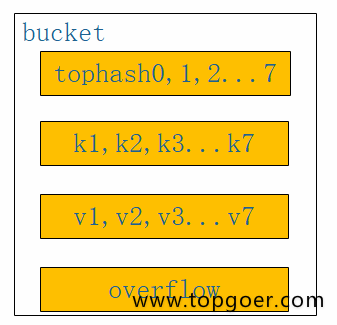
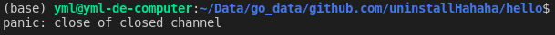
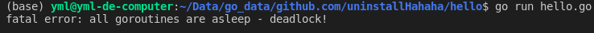
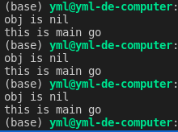

# Golang


<span style='color:red;'>??? 关键字也能当变量名，当然强烈不建议这样使用</span>


一个包中的方法和类型将被编译到一个文件中

>   ​	Go programs are organized into packages. A package is a collection of source files in the same directory that are compiled together. Functions, types, variables, and constants defined in one source file are visible to all other source files within the same package.


方法变量类型 -> package -> module( go mod )


一个模块包含一个或者多个包, 模块文件夹根目录的 `go.mod` 文件中声明了该模块的名称, 在其他地方导入该模块使用该名称

>   A repository contains one or more modules. A module is a collection of related Go packages that are released together. A Go repository typically contains only one module, located at the root of the repository. A file named `go.mod` there declares the module path: the import path prefix for all packages within the module. The module contains the packages in the directory containing its `go.mod` file as well as subdirectories of that directory, up to the next subdirectory containing another `go.mod` file (if any).


模块的命名不仅仅是标识该模块, 还应当可以指明到那里下载该模块, 比如 `golang.org/x/tools` 这个模块名称就指明了到哪里下载

>   Each module's path not only serves as an import path prefix for its packages, but also indicates where the `go` command should look to download it. For example, in order to download the module `golang.org/x/tools`, the `go` command would consult the repository indicated by `https://golang.org/x/tools` 


导入其他模块时, 如果要导入的是该模块文件夹中子文件夹的文件, 那么在模块名称后面直接接上路径, 比如 `github.com/google/go-cmp/cmp`, 其中 cmp 是这个模块中的子文件夹

导入内置标准库时不需要写模块名, 直接写子文件夹名称即可

>   A package's import path is its module path joined with its subdirectory within the module. For example, the module `github.com/google/go-cmp` contains a package in the directory `cmp/`. That package's import path is `github.com/google/go-cmp/cmp`. Packages in the standard library do not have a module path prefix.


#### Your first program

1.  ```sh
    mkdir hello
    cd hello
    # 初始化 go.mod 文件指定模块名
    go mod init example.com/user/hello
    ```

2.  创建入口程序

    ```go
    package main
    
    import "fmt"
    
    func main() {
    	fmt.Println("Hello, world.")
    }
    ```

3.  ```sh
    # go install 命令先编译原文件, 然后将编译结果二进制文件保存到 $HOME/go/bin/ 中
    go install example.com/user/hello
    ```

    install 安装到哪里由 go 的环境变量 GOPATH 和 GOBIN 来控制

    >   The install directory is controlled by the `GOPATH` and `GOBIN` . If `GOBIN` is set, binaries are installed to that directory. If `GOPATH` is set, binaries are installed to the `bin` subdirectory of the first directory in the `GOPATH` list. Otherwise, binaries are installed to the `bin` subdirectory of the default `GOPATH` (`$HOME/go` or `%USERPROFILE%\go`).

    通过以下命令设置 GOBIN

    ```sh
    go env -w GOBIN=/somewhere/else/bin
    ```

    如果想要取消之前设置的 GOBIN 值

    ```sh
    go env -u GOBIN
    ```


#### Importing packages from remote modules

1.  先import , 因为模块名就代表了下载地址

    ```go
    package main
    
    import (
    	"fmt"
    
    	"example.com/user/hello/morestrings"
    	"github.com/google/go-cmp/cmp"
    )
    
    func main() {
    	fmt.Println(morestrings.ReverseRunes("!oG ,olleH"))
    	fmt.Println(cmp.Diff("Hello World", "Hello Go"))
    }
    ```

2.  然后 `go mod tidy` , 会根据模块名下载缺失的模块, 到 `pkg/mod` 中, 这个路径由 `GOPATH` 指定, 同时会移除没有使用到的模块, go mod tidy下载可以同时保存多个版本的模块供不同的项目使用

3.  如果想要删除之前下载的模块 `go clean -modcache`


#### Test

1.  测试方法应当写到单独的 `xxx_test.go` 文件中

2.  测试方法签名应当为 `func TestXXX(t *testing.T)`

3.  常规下测试方法的逻辑都是, 先整一些测试输入与输出一一对应, 然后循环执行要测试的方法, 输入测试输入, 对比实际输出与期望输出, 如果不一样, 则调用 `t.Errorf("xxx")` 打印错误输出

4.  然后执行 `go test` 进行测试

>    You write a test by creating a file with a name ending in `_test.go` that contains functions named `TestXXX` with signature `func (t *testing.T)`. The test framework runs each such function; if the function calls a failure function such as `t.Error` or `t.Fail`, the test is considered to have failed.


#### 命名规范

首字母大写的方法可在包外使用

>   ​	In Go, a function whose name starts with a capital letter can be called by a function not in the same package. 


包名应当是一个简要的单词, 不要有下划线, 不要有大写, 否则用的时候不好打

>   By convention, packages are given lower case, single-word names; there should be no need for underscores or mixedCaps.


方法名别整太长, 倒不如直接写在注释里来的方便, 所以方法名尽量精炼

>   Another short example is `once.Do`; `once.Do(setup)` reads well and would not be improved by writing `once.DoOrWaitUntilDone(setup)`. Long names don't automatically make things more readable. A helpful doc comment can often be more valuable than an extra long name.


Go对字段不提供默认的 get 和 set 方法, 如果一个字段是小写的, 那么意味着在其他包中无法直接访问, 可以手动定义 get 和 set 方法, 但是注意 get 方法不要学 Java 用 get 开头, 应当直接把字段首字母大写作为 get 方法名(首字母大写的方法在包外可访问), 而 set 方法就正常的 setxxx 就行了

>   Go doesn't provide automatic support for getters and setters. There's nothing wrong with providing getters and setters yourself, and it's often appropriate to do so, but it's neither idiomatic nor necessary to put `Get` into the getter's name.  If you have a field called `owner` (lower case, unexported), the getter method should be called `Owner` (upper case, exported), not `GetOwner`. The use of upper-case names for export provides the hook to discriminate the field from the method. A setter function, if needed, will likely be called `SetOwner`.


要是命名得用多个单词, 不要学 python 用下划线, 而是应当使用 帕斯特 或者 驼峰

>    Finally, the convention in Go is to use `MixedCaps` or `mixedCaps` rather than underscores to write multiword names.


#### Semicolons

不要写分号, 解析器会自动加上分号, 唯一一点要注意的是, 控制语句后面的花括号不要写在下一行

>   One consequence of the semicolon insertion rules is that you cannot put the opening brace of a control structure (`if`, `for`, `switch`, or `select`) on the next line.  If you do, a semicolon will be inserted before the brace, which could cause unwanted effects.  Write them like this

not like this

```
if i < f()  // wrong!
{           // wrong!
    g()
}
```


#### control structures

###### for

```go
// Like a C for
for init; condition; post { }

// Like a C while
for condition { }

// Like a C for(;;)
for { }
```

​	<span style='color:cyan'>这是一种同 java 中 foreach 的实现，遍历中使用的 key 和 value 实际上是一个临时的变量，并不是数组中的元素，它们只是在迭代中被赋予数组中对应元素的值，所以对 key 或者 value 的修改并不会作用于原数组</span>

If you're looping over an array, slice, string, or map, or reading from a channel, a `range` clause can manage the loop.

```go
for key, value := range oldMap {
    newMap[key] = value
}
```

If you only need the first item in the range (the key or index), drop the second:

```go
for key := range m {
    if key.expired() {
        delete(m, key)
    }
}
```

If you only need the second item in the range (the value), use the *blank identifier*, an underscore, to discard the first:

```go
sum := 0
for _, value := range array {
    sum += value
}
```

range 也可以遍历 string, 直接得到 字符位置 和 类型为rune的utf-8编码值

>   For strings, the `range` does more work for you, breaking out individual Unicode code points by parsing the UTF-8. Erroneous encodings consume one byte and produce the replacement rune U+FFFD. (The name (with associated builtin type) `rune` is Go terminology for a single Unicode code point. See [the language specification](https://golang.google.cn/ref/spec#Rune_literals) for details.) The loop

```go
for pos, char := range "日本\x80語" { // \x80 is an illegal UTF-8 encoding
    fmt.Printf("character %#U starts at byte position %d\n", char, pos)
}
```


###### switch

```go
// as if-else-if-else
switch {
    case '0' <= c && c <= '9':
        return c - '0'
    case 'a' <= c && c <= 'f':
        return c - 'a' + 10
    case 'A' <= c && c <= 'F':
        return c - 'A' + 10
}
```

```go
// as switch
switch c {
    case ' ', '?', '&', '=', '#', '+', '%':
        return true
}
```

```go
// switch 里面的 break 默认结束 switch , 如果想要结束外层循环, 给外层循环加label
Loop:
	for n := 0; n < len(src); n += size {
		switch {
            case src[n] < sizeTwo: break Loop
		}
	}
```

```go
// type switch, 根据类型走不同的分支
var t interface{}
t = functionOfSomeType()
switch t := t.(type) {
default:
    fmt.Printf("unexpected type %T\n", t)     // %T prints whatever type t has
case bool:
    fmt.Printf("boolean %t\n", t)             // t has type bool
case int:
    fmt.Printf("integer %d\n", t)             // t has type int
case *bool:
    fmt.Printf("pointer to boolean %t\n", *t) // t has type *bool
case *int:
    fmt.Printf("pointer to integer %d\n", *t) // t has type *int
}
```


#### Function

​		Go语言中的函数传参都是值拷贝，当我们想要修改某个变量的时候，我们可以创建一个指向该变量地址的指针变量。传递数据使用指针，而无须拷贝数据。类型指针不能进行偏移和运算。Go语言中的指针操作非常简单，只需要记住两个符号：`&`（取地址）和`*`（根据地址取值）


###### Named result parameters 

具名返回参数默认在进入函数时初始化, 在函数中使用 `return` 时, 直接将其作为返回值 , 具名返回值不强制, 但是能够让代码更简洁

>   The return or result "parameters" of a Go function can be given names and used as regular variables, just like the incoming parameters. When named, they are initialized to the zero values for their types when the function begins; if the function executes a `return` statement with no arguments, the current values of the result parameters are used as the returned values.


###### Defer

<span style='color:cyan;'>这样理解，在 return 将要执行前，等等，先按照先进后出的顺序执行 defer 定义的内容，最后再 return，所以如果事先定义了返回的变量时，可以在 defer 中对要返回变量的值进行最后的修改</span>

```go
func main() {
	fmt.Println(doubleScore(0))
}

func doubleScore(source float32) (res float32) {
	defer func ()  {
		res = 100 //在defer中对res做最后的修改
	}()
	return source*2
	// 这里的返回相当于以下两句，defer调用在return语句之前
	// res = source*2
	// defer 在这里被调用
	// return
}
```

defer 语句 <span style='color:cyan;'>在当前函数</span> return 前执行，如果事先指名了返回变量，请将return语句看做两句, 一般用来关闭资源, 能够防止忘记关闭资源而且开启资源和关闭资源写在一起更加容易维护

>   Go's `defer` statement schedules a function call (the *deferred* function) to be run immediately before the function executing the `defer` returns.

defer 语句先进后出, 也就是先声明的 defer 会在最后执行, 后声明的 defer 会在第一个执行

>   Deferred functions are executed in LIFO order

defer 后面指定的函数中的变量会在实际执行时现场获得，所以如果想要保存在定义 defer 时某个变量的值，请使用闭包将其作为参数传递

<span style='color:cyan;'>请这样理解，把defer后面的内容抠出来放到实际的 return 语句前，如果给defer函数传递了参数，那么使用定义位置的值，否则在执行时现场获取值</span> 

```go
func test() {
    x, y := 10, 20

    defer func(i int) {
        println("defer:", i, y) // i通过参数保存了状态，而y在实际调用时获取
    }(x) // x 被复制

    x += 10
    y += 100
    println("x =", x, "y =", y)
}

func main() {
    test()
}
// output
// x = 20 y = 120
// defer: 10 120
```


#### Data

###### Allocation with `new`

`new(类名)`  为该类型申请一个实例的内存, 并初始化各个属性都为0, 然后返回该实例对应的内存地址

>   `new(T)` allocates zeroed storage for a new item of type `T` and returns its address, a value of type `*T`. In Go terminology, it returns a pointer to a newly allocated zero value of type `T`.

` return &File{fd, name, nil, 0}`

创建一个对象, 并且按照构造方法参数顺序指定各个属性值, 这种方式返回的不是地址, 所以应当在前面使用 `&` 获取到实例的地址 

>   The fields of a composite literal are laid out in order and must all be present

`return &File{fd: fd, name: name}`

也可以指定给部分属性初始化, 其他未指定的属性默认赋值0

>   However, by labeling the elements explicitly as *field*`:`*value* pairs, the initializers can appear in any order, with the missing ones left as their respective zero values. 

也可以使用这种方法初始化各种内置类型如数组, 切片, map

```go
a := [...]string   {Enone: "no error", Eio: "Eio", Einval: "invalid argument"}
s := []string      {Enone: "no error", Eio: "Eio", Einval: "invalid argument"}
m := map[int]string{Enone: "no error", Eio: "Eio", Einval: "invalid argument"}
```

>   Composite literals can also be created for arrays, slices, and maps, with the field labels being indices or map keys as appropriate


###### Allocation with `make` 

​		make 仅用于创建 slices, maps , channels , 返回的还是这三个引用类型本身

​		因为这三种数据结构必须在初始化内部字段后才能使用, 而使用 new 进行创建, 内部字段将默认初始化为 0 , 此时不能直接使用, 还需要初始化, 所以使用 make 可以更加方便地创建以上类型

>   It creates slices, maps, and channels only, and it returns an *initialized* (not *zeroed*) value of type `T` (not `*T`). The reason for the distinction is that these three types represent, under the covers, references to data structures that must be initialized before use. A slice, for example, is a three-item descriptor containing a pointer to the data (inside an array), the length, and the capacity, and until those items are initialized, the slice is `nil`. For slices, maps, and channels, `make` initializes the internal data structure and prepares the value for use.

```go
// 创建长度为10, 容量为100的切片
make([]int, 10, 100)
```


###### Arrays

<span style='color:cyan;'>数组是值类型，值类型，值类型</span>

*   go的数组是值类型, 把一个数组赋值给另外一个数组是复制各个元素
*   数组作为函数参数传递时, 接收方默认收到的是数组的copy, 也就是在函数中改变数组不会改变原数组
*   数组的长度也是类型的一部分, `[10]int` 和 `[20]int` 就是两个类型

>   There are major differences between the ways arrays work in Go and C. In Go,
>
>   -   Arrays are values. Assigning one array to another copies all the elements.
>
>   -   In particular, if you pass an array to a function, it will receive a *copy* of the array, not a pointer to it.
>
>   -   The size of an array is part of its type.  The types `[10]int` and `[20]int` are 
>
>       distinct.

一些创建数组的方式

```go
// 全局变量
var arr [3]int = [3]int{1, 2}
var arr1 = [3]int{1, 2}
var arr2 = [...]int{1, 2, 3}
var arr3 = [3]int{1: 10, 2: 20}
// 创建对象数组
var arr4 = [2]struct{
    name string
    age int32
    }{
        {"alice",20},{"ylive",21},
    }

func main() {
    // 局部变量
	ar := [5]int{}
    ar1 := [...]int{1,2,3}
    ar2 := [3]int{1:10, 2:20}
}
```

创建多维数组

```go
    // 全局
    var arr0 [5][3]int
    var arr1 [2][3]int = [...][3]int{{1, 2, 3}, {7, 8, 9}}
    // 局部
    a := [2][3]int{{1, 2, 3}, {4, 5, 6}}
    b := [...][2]int{{1, 1}, {2, 2}, {3, 3}} // 第 2 纬度不能用 "..."
```

如果要在函数中修改原数组, 请传递数组指针

>   The value property can be useful but also expensive; if you want C-like behavior and efficiency, you can pass a pointer to the array.

```go
func Sum(a *[3]float64) (sum float64) {
    for _, v := range *a {
        sum += v
    }
    return
}

array := [...]float64{7.0, 8.5, 9.1}
x := Sum(&array)  // Note the explicit address-of operator
```

但是这并不好, 请用切片

>   But even this style isn't idiomatic Go. Use slices instead.


###### [Slices](https://www.topgoer.com/go%E5%9F%BA%E7%A1%80/Slice%E5%BA%95%E5%B1%82%E5%AE%9E%E7%8E%B0.html)

需要说明，slice 并不是数组或数组指针。它通过内部指针和相关属性引用数组片段，以实现变长方案

slices变量的赋值就是复制地址, 改变slices的元素就是在改变指向数组的元素

>   Slices hold references to an underlying array, and if you assign one slice to another, both refer to the same array. If a function takes a slice argument, changes it makes to the elements of the slice will be visible to the caller, analogous to passing a pointer to the underlying array. 

切片数据结构

slices切片本质是一个结构体，保存了指向具体数组位置的信息

```go
type slice struct {
    array unsafe.Pointer // 指向数组某元素的指针
    len   int 
    cap   int
}
```

所以，可以从切片是一个对象，它有自己的内存地址，也可以从中获取到指向的数组元素地址

```go
// 原数组
ar := []int{1, 2, 3, 4, 5, 6}
// 切片
sli := ar[0:]
// 切片对象的地址   切片指向数组首元素的地址==原数组首元素地址
fmt.Println(unsafe.Pointer(&sli), &sli[0], &ar[0])
```

切片的创建

```go
// 非主流手动创建
sli := []int{}
sli1 := []int{1, 2, 3}
// 常规make,type, len, cap
sli2 := make([]int, 1, 3)
// 直接从数组中切片
ar := [5]int{1,2,3,4,5}
sli4 := ar[:]
```

手动创建一个 slice 对象，在 Go 的反射中就存在一个与之对应的数据结构 SliceHeader，我们可以用它来构造一个 slice

```go
    var o []byte
    sliceHeader := (*reflect.SliceHeader)((unsafe.Pointer(&o)))
    sliceHeader.Cap = length
    sliceHeader.Len = length
    sliceHeader.Data = uintptr(ptr)
```

slice如果是直接make出来的，那么len 和 cap 按照指定的值设置

slice如果是从数组中直接切出来的，那么len 是切出来的实际长度，而 cap 是从开始切的元素直至原数组最后一个元素之间的长度

遍历

```go
for index, value := range slice {
    fmt.Printf("inde : %v , value : %v\n", index, value)
}
```

resize切片

```go
    // 原数组
    ar := [3]int{1,2,3}
    // 切片
    sli := ar[1:2]
    // 在切片上再切片，实际上还是在原数组上切片
    sli1 := sli[0:2]
```

直接切片时限定 cap

通常直接切片方法为 arr[a:b], 表示左闭右开切片，这样的话，默认 cap 直接为原数组兜底

非常规直接切片方法为 arr[a: b: ​c​] , 表示取 [a,b) 切片，并且限定 cap 到 c 结束

```go
    ar := []int{1,2,3,4,5,6}
    // [2], len 1, cap 5
    sli := ar[1:2]
    // [1], len 1, cap 2
    sli1 := ar[:1:2]

    fmt.Println(len(sli), cap(sli))
    fmt.Println(len(sli1), cap(sli1))
```

nil切片

```go
// pointer 属性指向 nil， len=0, cap=0
var slice []int
```


nil 切片被用在很多标准库和内置函数中，描述一个不存在的切片的时候，就需要用到 nil 切片。比如函数在发生异常的时候，返回的切片就是 nil 切片。nil 切片的指针指向 nil。

空切片

```go
    silce := make( []int , 0 )
    slice := []int{ }
```


空切片就是没有元素的空集合，空切片和 nil 切片的区别在于，空切片指向的地址不是nil，指向的是一个内存地址，但是它没有分配任何内存空间，即底层元素包含0个元素。

切片扩容策略


​		如果切片的容量小于 1024 个元素，于是扩容的时候就翻倍增加容量。上面那个例子也验证了这一情况，总容量从原来的4个翻倍到现在的8个

​		一旦元素个数超过 1024 个元素，那么增长因子就变成 1.25 ，即每次增加原来容量的四分之一

​		注意：扩容扩大的容量都是针对原来的容量而言的，而不是针对原来数组的长度而言的


###### Two-dimensional slices

>   Go's arrays and slices are one-dimensional. To create the equivalent of a 2D array or slice, it is necessary to define an array-of-arrays or slice-of-slices, like this:

```go
type Transform [3][3]float64  // A 3x3 array, really an array of arrays.
type LinesOfText [][]byte     // A slice of byte slices.
```

因为切片的长度是可变的, 所以二维切片的元素长度也可以是不同的,

>   Because slices are variable-length, it is possible to have each inner slice be a different length. That can be a common situation, as in our `LinesOfText` example: each line has an independent length.

```go
text := LinesOfText{
	[]byte("Now is the time"),
	[]byte("for all good gophers"),
	[]byte("to bring some fun to the party."),
}
```

两种创建二维slice的方式:

*   先申请一个二维slice, 然后循环单独给每个元素申请一个slice, 这样的话, 每个slice类型的元素长度都是可变的
*   先申请一个二维slice, 然后循环将每个元素指向一个已经存在的slice

>   There are two ways to achieve this. One is to allocate each slice independently; the other is to allocate a single array and point the individual slices into it. Which to use depends on your application. If the slices might grow or shrink, they should be allocated independently to avoid overwriting the next line; if not, it can be more efficient to construct the object with a single allocation.

```go
// Allocate the top-level slice.
picture := make([][]uint8, YSize) // One row per unit of y.
// Loop over the rows, allocating the slice for each row.
for i := range picture {
	picture[i] = make([]uint8, XSize)
}
```

```go
// Allocate the top-level slice, the same as before.
picture := make([][]uint8, YSize) // One row per unit of y.
// Allocate one large slice to hold all the pixels.
pixels := make([]uint8, XSize*YSize) // Has type []uint8 even though picture is [][]uint8.
// Loop over the rows, slicing each row from the front of the remaining pixels slice.
// 每次循环指向一个已经存在的slice
for i := range picture {
	picture[i], pixels = pixels[:XSize], pixels[XSize:]
}
```


###### Map

*   map 是引用类型, 作为参数传递后, 改变其值就是在改变原 map 的值
*   map 的 key 可以是任何定义了 equality 操作的类型, 但是 slice就不行, 因为 slice不能 equlity操作
*   map 的链表使用尾插法，但是它不是线程安全的
*   <span style='color:cyan;'>直接使用for range遍历map时，返回的顺序是随机的每次都不一定一样</span>

>   The key can be of any type for which the equality operator is defined, such as integers, floating point and complex numbers, strings, pointers, interfaces (as long as the dynamic type supports equality), structs and arrays. Slices cannot be used as map keys, because equality is not defined on them. Like slices, maps hold references to an underlying data structure. If you pass a map to a function that changes the contents of the map, the changes will be visible in the caller.

```go
// 创建 map
var timeZone = map[string]int{
    "UTC":  0*60*60,
    "EST": -5*60*60,
    "CST": -6*60*60,
    "MST": -7*60*60,
    "PST": -8*60*60,
}
// 从 map 中取值
offset := timeZone["EST"]
```

从map 中取不存在的 key , 会返回 value 类型的默认零值, 比如 integer 返回 0, bool 返回false

>   An attempt to fetch a map value with a key that is not present in the map will return the zero value for the type of the entries in the map.  For instance, if the map contains integers, looking up a non-existent key will return `0`.

那么当取值到 0 时, 如何知道是这个 key 不存在呢, 还是本身 value 就是 0, 此时可以用两个变量接收 map 的取值, 第一个是接收到的 value , 第二个是bool类型, 该 key 是否存在于 map 中

>   For obvious reasons this is called the “comma ok” idiom. In this example, if `tz` is present, `seconds` will be set appropriately and `ok` will be true; if not, `seconds` will be set to zero and `ok` will be false.

```go
m := map[string]int{}
// 用两个变量接收map的取值
val, ok := m["age"]
if ok{
    fmt.Printf("value is %v", val)
}
```

删除 map 中的 (key,value) 可以直接调用内置函数 delete(map, key), 哪怕 key 不存在也没有问题也不会报错

>   To delete a map entry, use the `delete` built-in function, whose arguments are the map and the key to be deleted. It's safe to do this even if the key is already absent from the map.

```go
delete(timeZone, "PDT")  // Now on Standard Time
```

<span style='color:cyan;'>按照指定顺序遍历 map</span>

思想是使用切片放所有的 key ，然后按照目标顺序排序，最后遍历切片依次从map中取值

```go
 func main() {
    rand.Seed(time.Now().UnixNano()) //初始化随机数种子

    var scoreMap = make(map[string]int, 200)

    for i := 0; i < 100; i++ {
        key := fmt.Sprintf("stu%02d", i) //生成stu开头的字符串
        value := rand.Intn(100)          //生成0~99的随机整数
        scoreMap[key] = value
    }
    //取出map中的所有key存入切片keys
    var keys = make([]string, 0, 200)
    for key := range scoreMap {
        keys = append(keys, key)
    }
    //对切片进行排序
    sort.Strings(keys)
    //按照排序后的key遍历map
    for _, key := range keys {
        fmt.Println(key, scoreMap[key])
    }
}
```

<span style='color:cyan;'>[map数据结构](https://www.topgoer.com/go%E5%9F%BA%E7%A1%80/Map%E5%AE%9E%E7%8E%B0%E5%8E%9F%E7%90%86.html)</span>

实现原理即常规的 数组 + 链表 的实现方式

解决hash冲突的问题，使用拉链法，也就是链表的方式

​		数组中存放的元素是 bucket 对象，一个 bucket 对象同时存放 8 个 kv 对，以及指向下一个 bucket 的指针，以及这 8 个 key 的 hash 高八位用来快速判断目标 key 是否存在于该 bucket 中



​		在 bucket 中，所有的 key 连起来存放，所有的 value 连起来存放，为什么呢？假设 map[int64]int8，那么 key 占 8 个字节，value 占 1 个字节，如果 kv 连起来存放，它们长度不同也会内存对齐，使得 value 也占据 8 个字节，这就浪费了内存空间


<span style='color:orange;'>扩展：解决hash冲突的方法</span>

*   **开发定址法**：也就是说当我们存储一个key，value时，发现hashkey(key)的下标已经被别key占用，那我们在这个数组中空间中重新找一个没被占用的存储这个冲突的key，那么没被占用的有很多，找哪个好呢？常见的有线性探测法，线性补偿探测法，随机探测法
*   **线性探测** ：字面意思就是按照顺序来，从冲突的下标处开始往后探测，到达数组末尾时，从数组开始处探测，直到找到一个空位置存储这个key，当数组都找不到的情况下回扩容（事实上当数组容量快满的时候就会扩容了）；查找某一个key的时候，找到key对应的下标，比较key是否相等，如果相等直接取出来，否则按照顺寻探测直到碰到一个空位置，说明key不存在。
*   **拉链法** ：数组 + 链表


###### Append

Append内置函数用于给 slice 加上新元素

​		如果加上新元素后，超出了 slice 的 cap，那么重新按照二倍的长度重新申请一个底层数组，然后在该数组上追加，最后返回新的 slice 地址（扩容了），或者原 slice 地址（没扩容）

>   What `append` does is append the elements to the end of the slice and return the result.  The result needs to be returned because, as with our hand-written `Append`, the underlying array may change. 

```go
func append(slice []T, elements ...T) []T
```

```go
x := []int{1,2,3}
x = append(x, 4, 5, 6)
fmt.Println(x)
```

slice 拼接 slice 使用 ... 解包

>   But what if we wanted to do what our `Append` does and append a slice to a slice?  Easy: use `...` at the call site, just as we did in the call to `Output` above. 

```go
x := []int{1,2,3}
y := []int{4,5,6}
x = append(x, y...)
fmt.Println(x)
```


###### Constants

常量在编译时就被创建, 所以常量只能是基本类型, 比如 numbers, char, string, bool , 而且常量的定义只能是常量表达式, 不能调用其他包中的方法, 因为编译时不会加载其他包.

>   Constants in Go are just that—constant. They are created at compile time, even when defined as locals in functions, and can only be numbers, characters (runes), strings or booleans. Because of the compile-time restriction, the expressions that define them must be constant expressions, evaluatable by the compiler.  For instance, `1<<3` is a constant expression, while `math.Sin(math.Pi/4)` is not because the function call to `math.Sin` needs to happen at run time.


###### Variables

这里说的变量是全局变量, 定义在方法外边

>    Variables can be initialized just like constants but the initializer can be a general expression computed at run time.

```go
var (
    home   = os.Getenv("HOME")
    user   = os.Getenv("USER")
    gopath = os.Getenv("GOPATH")
)
```


###### The init function

init方法在当前文件中所有全局变量都初始化完成后自动执行, 相当于 python 包中的 init 文件, 一个go文件可以包含多个 init 函数, 从上到下依次执行

一般 init 方法用来检验全局变量的值

>   Finally, each source file can define its own niladic `init` function to set up whatever state is required.  (Actually each file can have multiple `init` functions.) And finally means finally: `init` is called after all the variable declarations in the package have evaluated their initializers, and those are evaluated only after all the imported packages have been initialized.

```go
func init() {
    if user == "" {
        log.Fatal("$USER not set")
    }
}
```


###### Pointers vs. Values

​	如果一个类型的方法接收实例的地址用来改变原实例内容

​	那么在调用的时候可以直接 `实例.方法()` 进行调用

​	编译器会自动传递该实例的地址作为参数 

​	而不需要手动取地址, 然后调用方法, 像这样一样 `(&实例).方法()` 

```go
// 首先有一个自定义类型 ByteSlice
type ByteSlice []byte
// 然后定义该类型的引用传递方法
func (p *ByteSlice) Write(data []byte) (n int, err error) {
    slice := *p
    // Again as above.
    *p = slice
    return len(data), nil
}
// 如果想要调用该方法, 直接通过实例调用即可, 无须手动 & 取地址
bs := ByteSlice{}
bs.Write(make([]byte, 0))
```


###### Interface

<span style='color:cyan;'>接口是一种类型，是一种类型，是一种类型</span>

接口类型变量能够存储所有实现了该接口的实例，接口代表一种规范，使用接口声明的变量，只能调用该接口中存在的方法

但是要注意，所有接口方法在实现类中必须都有值接收者方法的实现，这样才能算是实现了该接口

```go
// 接口定义
type animal interface {
	say(string) int
	eat(string) int
}
// 实现接口的类
type dog struct {
	name string
}

func (d dog) say(str string) int {
	fmt.Println(d.name, "say: ", str)
	return 1
}
func (d dog) eat(str string) int {
	fmt.Println(d.name, "eat: ", str)
	return 1
}
```

对于一个类型, 只要实现了某个接口的所有方法, 就被认为是实现了该接口, 无须显式书写实现哪个接口

```go
// 这是一个类型
type Sequence []int

// 实现了 sort.Interface 所有的方法, 就认为实现了该接口
// Methods required by sort.Interface.
func (s Sequence) Len() int {
    return len(s)
}
func (s Sequence) Less(i, j int) bool {
    return s[i] < s[j]
}
func (s Sequence) Swap(i, j int) {
    s[i], s[j] = s[j], s[i]
}
```

关于在父类中实现接口方法

​		接口中的方法要全部实现，但是不一定就是在实现类中直接实现，也可以在内嵌类中实现，就相当于在父类中实现也可以

接口的嵌套

```go
// Sayer 接口
type Sayer interface {
    say()
}

// Mover 接口
type Mover interface {
    move()
}

// 接口嵌套
type animal interface {
    Sayer
    Mover
}
```

空接口

空接口是指没有定义任何方法的接口。因此任何类型都实现了空接口。

空接口类型的变量可以存储任意类型的变量

```go
// 定义一个空接口x
var x interface{}
s := "pprof.cn"
x = s
fmt.Printf("type:%T value:%v\n", x, x)
i := 100
x = i
fmt.Printf("type:%T value:%v\n", x, x)
b := true
x = b
fmt.Printf("type:%T value:%v\n", x, x)
```

使用空接口作为函数参数可以接受任何类型参数

```go
// 空接口作为函数参数
func show(a interface{}) {
    fmt.Printf("type:%T value:%v\n", a, a)
}
```

使用空接口创建可保存任何类型的map

```go
// 空接口作为map值
var studentInfo = make(map[string]interface{})
studentInfo["name"] = "李白"
studentInfo["age"] = 18
studentInfo["married"] = false
fmt.Println(studentInfo)
```


###### type assertions

类型断言语法 `value.(typeName)` 

如果只用一个变量接收断言语句结果, 那么接收到的值是原变量的值,  如果类型断言失败, 程序直接 crash , 例如 `str := value.(string)`

如果用两个变量接收断言语句结果, 那么第一个返回值是被断言变量的值, 第二个是是否通过了类型断言, 例如 `str, ok := value.(string)`


###### string

字符串

实际上是个 byte 数组， 或者 rune 数组（包含中文），所以如果想要修改字符串，应当先转换为数组，对数组操作，最后再转回 string

```go
    // 字符串
    str := "hello 你好"
    // 转数组
    strarr:= []rune(str)
    // 操作数组
    strarr[0]='y'
    strarr = append(strarr, '!')
    // 转换回 string
    str = string(strarr)
    fmt.Println(str)   
```


###### struct

<span style='color:cyan;'>结构体中字段大写开头表示可公开访问，小写表示私有（仅在定义当前结构体的包中可访问）</span>

定义

```go
    type 类型名 struct {
        字段名 字段类型
        字段名 字段类型
        …
    }
	// 属性可写在一行，用逗号隔开
    type person1 struct {
        name, city string
        age        int8
    }
```

实例化

```go
    var 结构体实例 结构体类型
```

匿名结构体

```go
package main

import (
    "fmt"
)

func main() {
    // 匿名创建
    var user struct{Name string; Age int}
    user.Name = "pprof.cn"
    user.Age = 18
    fmt.Printf("%#v\n", user)
}
```

使用 new 实例化

```go
    var p2 = new(person)
    fmt.Printf("%T\n", p2)     //*main.person
    fmt.Printf("p2=%#v\n", p2) //p2=&main.person{name:"", city:"", age:0}
```

直接使用结构体指针访问内容

```go
var p2 = new(person)
p2.name = "测试"
p2.age = 18
p2.city = "北京"
fmt.Printf("p2=%#v\n", p2) //p2=&main.person{name:"测试", city:"北京", age:18}
```

使用 & 实例化

```go
p3 := &person{}
fmt.Printf("%T\n", p3)     //*main.person
fmt.Printf("p3=%#v\n", p3) //p3=&main.person{name:"", city:"", age:0}
p3.name = "博客"
p3.age = 30
p3.city = "成都"
fmt.Printf("p3=%#v\n", p3) //p3=&main.person{name:"博客", city:"成都", age:30}
```

p3.name = "博客"其实在底层是(*p3).name = "博客"，这是Go语言帮我们实现的语法糖

创建时初始化

```go
// 这里创建出来是 person 对象
p5 := person{
    name: "pprof.cn",
    city: "北京",
    age:  18,
}
//p5=main.person{name:"pprof.cn", city:"北京", age:18}
fmt.Printf("p5=%#v\n", p5) 

// 这里创建出来是 person 对象的指针
p6 := &person{
    name: "pprof.cn",
    city: "北京",
    age:  18,
}
//p6=&main.person{name:"pprof.cn", city:"北京", age:18}
fmt.Printf("p6=%#v\n", p6) 

// 两个对象都可以直接通过 .属性 来访问内容，因为go默认做了转换
```

初始化时省略key

```go
p8 := &person{
    "pprof.cn",
    "北京",
    18,
}
//p8=&main.person{name:"pprof.cn", city:"北京", age:18}
fmt.Printf("p8=%#v\n", p8) 
```

Go语言的结构体没有构造函数，我们可以自己实现。 

例如，下方的代码就实现了一个person的构造函数。 因为struct是值类型，如果结构体比较复杂的话，值拷贝性能开销会比较大，所以该构造函数返回的是结构体指针类型。

```go
// 自己实现构造函数
func newPerson(name, city string, age int8) *person {
    return &person{
        name: name,
        city: city,
        age:  age,
    }
}
// 调用构造函数
p9 := newPerson("pprof.cn", "测试", 90)
fmt.Printf("%#v\n", p9)
```

方法和接收者

就是给指定结构体设置成员方法

接收者类型可以是 `结构体类型` 或者 `结构体指针类型`，取决于该结构体是否巨大以及是否需要对结构体实例进行修改

```go
// 1.接收者变量：接收者中的参数变量名在命名时，官方建议使用接收者类型名的第一个小写字母，而不是self、this之类的命名。例如，Person类型的接收者变量应该命名为 p，Connector类型的接收者变量应该命名为c等。
// 2.接收者类型：接收者类型和参数类似，可以是指针类型和非指针类型。    
func (接收者变量 接收者类型) 方法名(参数列表) (返回参数) {
    函数体
}
```

使用方法和接收者扩展基本类型

```go
//MyInt 将int定义为自定义MyInt类型
type MyInt int

//SayHello 为MyInt添加一个SayHello的方法
func (m MyInt) SayHello() {
    fmt.Println("Hello, 我是一个int。")
}
func main() {
    var m1 MyInt
    m1.SayHello() //Hello, 我是一个int。
    m1 = 100
    fmt.Printf("%#v  %T\n", m1, m1) //100  main.MyInt
}
```

嵌套匿名结构体：继承的基础

```go
//Address 地址结构体
type Address struct {
    Name string
    City     string
}

//User 用户结构体
type User struct {
    Name    string
    Gender  string	// 这里相当于子类的字段，与父类字段重名时，优先使用子类字段
    *Address //匿名结构体，这里就相当于父类
}
func main() {
    var user2 User
    user2.City = "哈尔滨"	//可以直接访问匿名结构体（父类）的字段名
    // 创建一个子类实例
    u := &User{
        Name: "alice",
        Gender: "man",
        Address: &Address{
            Name: "sichuan",
            City: "cd",
        },
    }
}
```

Json序列化与反序列化

```go
import "encoding/json"
func main(){
    // 对象实例
    u := &User{
        name: "alice", // 小写开头的私有字段不能被 json 访问，所以不参与序列化
        Gender: "man",
        Address: &Address{
            Name: "sichuan",
            City: "cd",
        },
    }
    // 序列化
    data, _ := json.Marshal(u)
    fmt.Printf("%s\n", data)
    // 反序列化
    uu := &User{}
    json.Unmarshal(data, uu)
    fmt.Println(uu)
}
```


#### Unused imports and variables

导入了但是没有使用的包, 声明了但是没有使用的变量, 将会导致编译不通过

如果想要使得编译通过, 用 下划线 临时地接收它们, 使其可以编译通过, 实际开发中应当避免未使用的导入和声明

```go
package main

import (
    "fmt"
    "io"
    "log"
    "os"
)

var _ = fmt.Printf // For debugging; delete when done.
var _ io.Reader    // For debugging; delete when done.

func main() {
    fd, err := os.Open("test.go")
    if err != nil {
        log.Fatal(err)
    }
    // TODO: use fd.
    _ = fd
}
```

如果因为想要执行其 init 方法而想要导入某个包, 应当使用 下划线 重命名该导入的包, 这样就不会编译不通过

```go
import _ "net/http/pprof"
```


#### Goroutines

<span style='color:cyan;'>goroutine 只是由官方实现的超级"线程池"</span>

​		goroutine 是由Go运行时（runtime）自己的调度器调度的，这个调度器使用一个称为m:n调度的技术（复用/调度m个goroutine到n个OS线程）。 其一大特点是goroutine的调度是在用户态下完成的， 不涉及内核态与用户态之间的频繁切换。另一方面充分利用了多核的硬件资源，近似的把若干goroutine均分在物理线程上， 再加上本身goroutine的超轻量，以上种种保证了go调度方面的性能。

>    A goroutine has a simple model: it is a function executing concurrently with other goroutines in the same address space.  It is lightweight, costing little more than the allocation of stack space. And the stacks start small, so they are cheap, and grow by allocating (and freeing) heap storage as required.

在方法的调用语句前面加上 `go` 关键字就会开启一个 goroutine 执行这个方法调用, 也可以直接执行一个匿名方法, 就像是在命令行中后台运行了一条命令

>   Prefix a function or method call with the `go` keyword to run the call in a new goroutine. When the call completes, the goroutine exits, silently.  (The effect is similar to the Unix shell's `&` notation for running a command in the background.)

```go
go list.Sort()  // run list.Sort concurrently; don't wait for it.
```

```go
func Announce(message string, delay time.Duration) {
    go func() {
        time.Sleep(delay)
        fmt.Println(message)
    }()  // Note the parentheses - must call the function.
}
```


但是单单能开启一个 goroutine 去执行任务是不够的, 此时还不能知道这个 goroutine 执行到那里了, 任务是否执行完毕了, 那么就需要使用 channels

>   These examples aren't too practical because the functions have no way of signaling completion.  For that, we need channels.

goroutine 调度

`runtime.Gosched()`，用于让出CPU时间片，让出当前goroutine的执行权限，调度器安排其它等待的任务运行，并在下次某个时候从该位置恢复执行。这就像跑接力赛，A跑了一会碰到代码runtime.Gosched()就把接力棒交给B了，A歇着了，B继续跑。


`runtime.Goexit()`，调用此函数会立即使当前的goroutine的运行终止（终止协程），而其它的goroutine并不会受此影响。runtime.Goexit在终止当前goroutine前会先执行此goroutine的还未执行的defer语句。请注意千万别在主函数调用runtime.Goexit，因为会引发panic。


`runtime.GOMAXPROCS()`，用来设置可以并行计算的CPU核数最大值，并返回之前的值。

Go1.5版本之前，默认使用的是单核心执行。Go1.5版本之后，默认使用全部的CPU逻辑核心数。

它的取值是１～２５６。

最好在主函数在开始前设置它，因为设置它会停止当前程序的运行。

适合于CPU密集型、并行度比较高的情景。如果是IO密集型，CPU之间的切换也会带来性能的损失。


#### WaitGroup

使用 sync.WaitGroup 来实现goroutine的同步

```go
var wg sync.WaitGroup

func hello(i int) {
    defer wg.Done() // goroutine结束就登记-1
    fmt.Println("Hello Goroutine!", i)
}
func main() {

    for i := 0; i < 10; i++ {
        wg.Add(1) // 启动一个goroutine就登记+1
        go hello(i)
    }
    wg.Wait() // 等待所有登记的goroutine都结束
}
```


#### Channels

channels 通过 make 来创建, 引用类型

不指定 size 时, 默认 buffer 大小为0

通道是可以被垃圾回收机制回收的，它和关闭文件是不一样的，在结束操作之后关闭文件是必须要做的，但关闭通道不是必须的

>   Like maps, channels are allocated with `make`, and the resulting value acts as a reference to an underlying data structure. If an optional integer parameter is provided, it sets the buffer size for the channel. The default is zero, for an unbuffered or synchronous channel.

```go
ci := make(chan int)            // unbuffered channel of integers
cj := make(chan int, 0)         // unbuffered channel of integers
cs := make(chan *os.File, 100)  // buffered channel of pointers to Files
```

使用 `close()` 关闭通道

​		对于已经关闭的通道，不可以继续向里面发送数据，但是还是可以从中接收数据，此时如果通道中还有数据，那么按照队列顺序依次返回，反之如果通道中没有数据，那么直接跳过而不是使得当前 goroutine 进入阻塞

​		对于已经关闭的通道，再次关闭会引发 panic



<span style='color:cyan;'>因为通道使用不当导致无限阻塞进入死锁状态</span>

​		如果其他 goroutine 都已经关闭，而主 groutine 中还需要阻塞等待某个通道，那么会检测出此 deadlock 错误

​		如果一个 0 buffer 缓冲通道，主 goroutine 往里面发送数据而又没有其他 goroutine 接收的话，就会检测出 deadlock 错误



<span style='color:cyan;'>优雅地遍历通道值</span>

*   用两个变量接收通道值，第二个变量代表通道是否还有可以取出来的值，如果返回false代表不仅已经关闭，而且通道中无剩余元素
*   使用 for range 直接从通道取值，如果 通道关闭并且已经遍历完剩余元素 则自动退出 for range

<span style='color:cyan;'>用于 goroutine 通信</span>

不带 buffer 的 channel 能够实现两个 goroutine 的数据交流和同步执行, 比如

>   Unbuffered channels combine communication—the exchange of a value—with synchronization—guaranteeing that two calculations (goroutines) are in a known state.

```go
c := make(chan int)  // Allocate a channel.
// Start the sort in a goroutine; when it completes, signal on the channel.
go func() {
    list.Sort()
    c <- 1  // Send a signal; value does not matter.
}()
doSomethingForAWhile()
<-c   // Wait for sort to finish; discard sent value.
```

​	接收通道值的接收方会一直阻塞, 直到通道中出现值, 此时会将该值从通道中取出然后自身结束阻塞.

​	如果是不带 buffer 的通道, 那么发送方将会一直阻塞直到接收方收到值

​	如果是带 buffer 的通道, 那么发送方将会阻塞直到成功将值加入到通道, 这意味着如果通道已经满了, 那么发送方就得等了, 直到某个接收方从通道中接走一个值, 才能向通道中加入值

>   Receivers always block until there is data to receive. If the channel is unbuffered, the sender blocks until the receiver has received the value. If the channel has a buffer, the sender blocks only until the value has been copied to the buffer; if the buffer is full, this means waiting until some receiver has retrieved a value.

使用通道控制并发访问量

>   A buffered channel can be used like a semaphore, for instance to limit throughput.  In this example, incoming requests are passed to `handle`, which sends a value into the channel, processes the request, and then receives a value from the channel to ready the “semaphore” for the next consumer. The capacity of the channel buffer limits the number of simultaneous calls to `process`.

```go
var sem = make(chan int, MaxOutstanding)

// 4. 在每个 goroutine 处理请求时, 都加入到 sem 通道中, 如果 sem 已经满了, 则意味着当前请求需要等待其他请求处理完毕, 这样就实现了并发访问量的控制
func handle(r *Request) {
    sem <- 1    // Wait for active queue to drain.
    process(r)  // May take a long time.
    <-sem       // Done; enable next request to run.
}

// 1. 首先请求加入到 queue 通道中
func Serve(queue chan *Request) {
    // 2. 然后无限遍历从 queue 中取出请求
    for {
        req := <-queue
        // 3. 对于每个请求创建一个 goroutine 去执行
        go handle(req)  // Don't wait for handle to finish.
    }
}
```

虽然上面这个实现确实能够控制同时处理的访问并发量

但是只要请求一来, 就会直接创建一个 goroutine

尽管某一时刻只有限定数量的 goroutine 在执行, 但是这些 goroutine 总是会被创建出来而占用资源

如果同时来的请求非常多, 那么将会创建很多的 goroutine 而占用很多不必要的资源

>   This design has a problem, though: `Serve` creates a new goroutine for every incoming request, even though only `MaxOutstanding` of them can run at any moment. As a result, the program can consume unlimited resources if the requests come in too fast. We can address that deficiency by changing `Serve` to gate the creation of the goroutines.

所以, 应当这样改进一下

```go
func Serve(queue chan *Request) {
    for req := range queue {
        // 2. 不要直接让goroutine使用各个goroutine都直接可操作的 req 对象, 这样可能因为某个goroutine修改它而造成数据混乱, 所以应当让goroutine使用当前req对象的复制, 这份复制仅仅当前goroutine可操作, 这样就能保证数据不被意外修改
        req := req // Create new instance of req for the goroutine.
        // 1. 每来一个请求先加入通道, 加的进去才给它创建 goroutine , 这样就能避免创建多余的goroutine
        sem <- 1
        go func() {
            process(req)
            <-sem
        }()
    }
}
```


#### Select

使用 select 语法，同时操作多个 channel，可以是写数据，也可以是读数据，按照最先就绪的分支执行，如果同时有多个分支可以执行，随机选择其中一个执行

```go
    select {
        case <-chan1:
           // 如果chan1成功读到数据，则进行该case处理语句
        case chan2 <- 1:
           // 如果成功向chan2写入数据，则进行该case处理语句
        default:
           // 如果上面都没有成功，则进入default处理流程
    }
```


#### Panic

>   there is a built-in function `panic` that in effect creates a run-time error that will stop the program (but see the next section).  The function takes a single argument of arbitrary type—often a string—to be printed as the program dies.

手动调用内置函数 `panic()` 并给定任意类型参数使得程序中断, 一般给定的参数是字符串用来表明产生中断的原因


#### Recover

内置函数 recover 能够阻断因为 panic 造成的方法出栈, 也就是阻断程序因为 panic 的强制退出

引发 panic 后, 只有 defer 的语句会照常执行, 所以只能把 recover 放到 defer 中使用 

<span style='color:cyan;'>注： revocer 必须直接放到 defer 执行的函数中才能生效</span>

```go
// 错，直接在defer中调用 recover，不生效
defer recover() 
// 错，在defer的多层嵌套函数中调用 recover，不生效
defer func(){ func(){ recover() }() }() 
// 对，只能在 defer 调用的函数中直接调用 recover 才生效
defer func(){ recover() }()
```

>   A call to `recover` stops the unwinding and returns the argument passed to `panic`.  Because the only code that runs while unwinding is inside deferred functions, `recover` is only useful inside deferred functions.

```go
func safelyDo(work *Work) {
    // 在方法中其他操作都执行完后, 判断是否产生了 panic , 是则用 revocer 接收, 避免退出程序
    defer func() {
        if err := recover(); err != nil {
            log.Println("work failed:", err)
        }
    }()
    do(work)
}
```


#### Built-in functions

###### Close

*   close(c) 关闭通道
*   不能用来关闭仅接收的通道
*   向正在关闭的通道发送消息或者关闭正在关闭的通道会引发 panic
*   关闭指向nil的通道会引发panic
*   使用两个变量接收通道值时, 第二个参数为该通道是否已关闭

>   For a channel `c`, the built-in function `close(c)` records that no more values will be sent on the channel. It is an error if `c` is a receive-only channel. Sending to or closing a closed channel causes a [run-time panic](https://golang.google.cn/ref/spec#Run_time_panics). Closing the nil channel also causes a [run-time panic](https://golang.google.cn/ref/spec#Run_time_panics). After calling `close`, and after any previously sent values have been received, receive operations will return the zero value for the channel's type without blocking. The multi-valued [receive operation](https://golang.google.cn/ref/spec#Receive_operator) returns a received value along with an indication of whether the channel is closed.


###### Length and capacity

```excel
Call      Argument type    Result

len(s)    string type      string length in bytes
          [n]T, *[n]T      array length (== n)
          []T              slice length
          map[K]T          map length (number of defined keys)
          chan T           number of elements queued in channel buffer

cap(s)    [n]T, *[n]T      array length (== n)
          []T              slice capacity
          chan T           channel buffer capacity
```


###### Allocation

>   The built-in function `new` takes a type `T`, allocates storage for a [variable](https://golang.google.cn/ref/spec#Variables) of that type at run time, and returns a value of type `*T` [pointing](https://golang.google.cn/ref/spec#Pointer_types) to it. The variable is initialized as described in the section on [initial values](https://golang.google.cn/ref/spec#The_zero_value).

```go
type S struct { a int; b float64 }
new(S)
```


###### Making slices, maps and channels

>   The built-in function `make` takes a type `T`, which must be a slice, map or channel type, optionally followed by a type-specific list of expressions. It returns a value of type `T` (not `*T`). The memory is initialized as described in the section on [initial values](https://golang.google.cn/ref/spec#The_zero_value).

```go
Call             Type T     Result

make(T, n)       slice      slice of type T with length n and capacity n
make(T, n, m)    slice      slice of type T with length n and capacity m

make(T)          map        map of type T
make(T, n)       map        map of type T with initial space for approximately n elements

make(T)          channel    unbuffered channel of type T
make(T, n)       channel    buffered channel of type T, buffer size n
```


###### Appending to and copying slices

>   The built-in functions `append` and `copy` assist in common slice operations. For both functions, the result is independent of whether the memory referenced by the arguments overlaps.

append 时如果容量不足, 则对指向的数组扩容, 否则直接加在原数组上

>   If the capacity of `s` is not large enough to fit the additional values, `append` allocates a new, sufficiently large underlying array that fits both the existing slice elements and the additional values. Otherwise, `append` re-uses the underlying array.

```go
s0 := []int{0, 0}
s1 := append(s0, 2)                // append a single element     s1 == []int{0, 0, 2}
s2 := append(s1, 3, 5, 7)          // append multiple elements    s2 == []int{0, 0, 2, 3, 5, 7}
s3 := append(s2, s0...)            // append a slice              s3 == []int{0, 0, 2, 3, 5, 7, 0, 0}
s4 := append(s3[3:6], s3[2:]...)   // append overlapping slice    s4 == []int{3, 5, 7, 2, 3, 5, 7, 0, 0}

var t []interface{}
t = append(t, 42, 3.1415, "foo")   //                             t == []interface{}{42, 3.1415, "foo"}

var b []byte
b = append(b, "bar"...)            // append string contents      b == []byte{'b', 'a', 'r' }
```

copy 第一个参数是目的地, 第二个参数是原数组, 返回copy元素的数量

>   The function `copy` copies slice elements from a source `src` to a destination `dst` and returns the number of elements copied.

```go
var a = [...]int{0, 1, 2, 3, 4, 5, 6, 7}
var s = make([]int, 6)
var b = make([]byte, 5)
n1 := copy(s, a[0:])            // n1 == 6, s == []int{0, 1, 2, 3, 4, 5}
n2 := copy(s, s[2:])            // n2 == 4, s == []int{2, 3, 4, 5, 4, 5}
n3 := copy(b, "Hello, World!")  // n3 == 5, b == []byte("Hello")
```


#### Import

| Import declaration  | Local name of Sin |
| ------------------- | ----------------- |
| import   "lib/math" | math.Sin          |
| import m "lib/math" | m.Sin             |
| import . "lib/math" | Sin               |
| import _ "lib/math" |                   |


#### 自定义类型和类型别名

自定义类型是定义了一个全新的类型。我们可以基于内置的基本类型定义，其实也是定义struct的方法。例如

```go
// 自定义一个 myint 的类型
type myint int
// 定义结构体
type 类型名 struct {
    字段名 字段类型
    字段名 字段类型
    …
}
```

类型别名规定：TypeAlias只是Type的别名，本质上TypeAlias与Type是同一个类型，例如我们之前见过的rune和byte就是类型别名，他们的定义如下：

```go
type byte = uint8
type rune = int32
```

它们的区别

```go
//类型定义
type NewInt int

//类型别名
type MyInt = int

func main() {
    var a NewInt
    var b MyInt

    // 自定义的类型就是一个独立的类型
    fmt.Printf("type of a:%T\n", a) //type of a:main.NewInt
    // 类型别名在编译时会被还原为原类型名，只是用来方便阅读
    fmt.Printf("type of b:%T\n", b) //type of b:int
}
```


#### 内置包

##### os

###### os.Args

>   根据空格分割获取命令行参数

```go
package main

import (
	"fmt"
	"os"
)

func main() {
	fmt.Println(os.Args)
}
```


##### flag

> 用于解析命令行传递的标志位参数

> 使用flag解析的标志位参数支持格式:
>
> * xxx.exe -name=alice
> * xxx.exe -name alice
> * xxx.exe --name alice
> * xxx.exe --name=alice

```go
import (
	"flag"
	"fmt"
)

func main() {
    //先设置解析规则
    //第一个参数是标志位, 第二个参数是默认值, 第三个参数是当使用 xxx.exe --help 时给出的提示
    //返回值是对应类型的指针
	name := flag.String("name", "alice", "请输入name值")
    //然后执行解析
	flag.Parse()
	fmt.Println("name: ", *name)
}
```

使用--help显示提示


##### time

>    定时器，计时器，时间相关

一次性的定时器

```go
// 1.timer基本使用，一次性的定时器
timer1 := time.NewTimer(2 * time.Second)
fmt.Printf("t1:%v\n", time.Now())
t2 := <-timer1.C
fmt.Printf("t2:%v\n", t2)
```

中断定时器

```go
t := time.NewTimer(time.Second * 5)
// 中断定时器
t.Stop()
fmt.Println("timer stop...")
```

重新设置定时器时间

```go
t := time.NewTimer(time.Second * 5)
// 重置定时器
t.Reset(time.Second * 5)
<-t.C
fmt.Println("timer stop...")
```

多次执行的计时器

```go
	t := time.NewTicker(time.Second)
	i := 0
	for {
		if i == 5 {
			break
		}
		<-t.C
		i++
		fmt.Println("tick...")
	}

// 停止计时器
t.Stop()
```


##### sync

并发相关

*   sync.WaitGroup 等一等功能

    <span style='color:cyan;'>注：WaitGroup 在调用 Wait() 之后不能再调用 Add() 方法的</span>

    <span style='color:cyan;'>注：如果没有足够的 wg.Done() 去完成 wg.Add() 的个数，会检测出死锁错误</span>

* sync.Mutex 互斥锁 ，不能连续多次加锁

*   sync.RWMutex 读写锁 ，能连续多次拿读锁，其余不可以

    ```go
    var rwm sync.RWMutex
    // 连续拿读锁，没毛病
    rwm.RLock()
    rwm.RLock()
    rwm.RUnlock()
    rwm.RUnlock()
    ```

*   sync.Once 

​		该对象实例仅包含一个方法 Do(), 将要执行的方法传入该方法，将会总是只被执行一次，实现原理类似于双重判断的单例模式，内部使用一个布尔变量和锁变量来保证目标逻辑只被执行一次

例子：不加限制时，可能被初始化多次

```go
var wg sync.WaitGroup

// 未初始化对象，将要在方法中初始化
var obj []int
// 用来初始化对象的方法
func init_obj() {
	if obj == nil {
        // 结果发现本句会被多次打印，也就是会被多次初始化
        fmt.Println("obj is nil") 
		obj = make([]int, 0)
	}
    wg.Done()
}

func main() {
    wg.Add(5)
    // 多个 goroutine 同时进行初始化工作
    for i:=0;i<5;i++{
        go init_obj()
    }
    wg.Wait()

	fmt.Println("this is main go")
}
```

结果发现对象会被多次初始化


现在使用单次运行限制

```go
var wg sync.WaitGroup
var once sync.Once

// 未初始化对象，将要在方法中初始化
var obj []int
// 用来初始化对象的方法
func init_obj() {
    // 在初始化逻辑上加上单次执行的限制
    once.Do(func() {
        if obj == nil {
            // 结果发现本句会被多次打印，也就是会被多次初始化
            fmt.Println("obj is nil") 
            obj = make([]int, 0)
        }
    })
    wg.Done()
}

func main() {
    wg.Add(5)
    // 多个 goroutine 同时进行初始化工作
    for i:=0;i<5;i++{
        go init_obj()
    }
    wg.Wait()

	fmt.Println("this is main go")
}
```

结果就变得正确起来，像这样




*   sync.Map 并发安全的Map

    ​		开箱即用表示不用像内置的map一样使用make函数初始化就能直接使用。同时sync.Map内置了诸如Store、Load、LoadOrStore、Delete、Range等操作方法

    ```go
    // 直接创建使用，无需 make
    var m sync.Map
    // store 存kv，无视类型
    m.Store("alice", 12)
    m.Store(12, "yyy")
    // load 取值，返回第二个值为是否存在该key
    v, _ := m.Load(12)
    ```

*   sync.atomic 原子包，提供原子操作数据的方法

    不加锁的同步方法，意味着不需要阻塞，所有操作都是在用户态下进行，所以比加锁的同步方式更加高效

    ```go
    // 要进行操作的变量
    var x int32
    // 原子执行加一操作，注意需要传递指针
    atomic.AddInt32(&x, 1)
    ```

*   sync.Pool 

    对象池，向对象池中添加的元素，被取出一次后就失效，其所占位置将会在下一次 gc 时被清理，在这之前，再向对象池中添加的新元素，会复用之前已经离开对象池的对象的位置，这样就省去了重新为其分配内存的步骤，提高了效率

    对象池无内存大小上限限制，这就意味着无法对对象池中存放对象的个数进行控制

    ```go
    	p := sync.Pool{
    		// New 函数指定如果 pool 中不存在元素时调用 Get 的返回值
    		New: func() interface{} { return -1 },
    	}
    	// 向 pool 中添加元素
    	p.Put(1)
    	p.Put(true)
    	p.Put("alice")
    	// 从 pool 中获取元素
    	fmt.Println(p.Get())
    	fmt.Println(p.Get())
    	fmt.Println(p.Get())
    	// 由于对象池中之前只放入三个元素，所以在取完之后，将会调用New函数返回默认值
    	fmt.Println(p.Get())
    	fmt.Println(p.Get())
    ```

    


##### Json

```go
import "encoding/json"
func main(){
    // 对象实例
    u := &User{
        name: "alice", // 小写开头的私有字段不能被 json 访问，所以不参与序列化
        Gender: "man",
        Address: &Address{
            Name: "sichuan",
            City: "cd",
        },
    }
    // 序列化
    data, _ := json.Marshal(u)
    fmt.Printf("%s\n", data)
    // 反序列化
    uu := &User{}
    json.Unmarshal(data, uu)
    fmt.Println(uu)
}
```


##### [net](https://www.topgoer.com/%E7%BD%91%E7%BB%9C%E7%BC%96%E7%A8%8B/socket%E7%BC%96%E7%A8%8B/UDP%E7%BC%96%E7%A8%8B.html)

内置网络编程包，用来开启 tcp 服务器和 udp服务器，以及tcp客户端和udp客户端


##### TCP黏包问题

使用 net 内置包开启服务器和客户端，连续发送数据时，可能会收到这样的结果

```
收到client发来的数据： Hello, Hello. How are you?Hello, Hello. How are you?Hello, Hello. How are you?Hello, Hello. How are you?Hello, Hello. How are you?
```

本来是分多次连续发送的数据，最后却一次性收到多条消息连在一起，这就是tcp黏包，造成黏包的原因有：

1.  由Nagle算法造成的发送端的粘包：Nagle算法是一种改善网络传输效率的算法。简单来说就是当我们提交一段数据给TCP发送时，TCP并不立刻发送此段数据，而是等待一小段时间看看在等待期间是否还有要发送的数据，若有则会一次把这两段数据发送出去。    
2.  接收端接收不及时造成的接收端粘包：TCP会把接收到的数据存在自己的缓冲区中，然后通知应用层取数据。当应用层由于某些原因不能及时的把TCP的数据取出来，就会造成TCP缓冲区中存放了几段数据。

解决黏包的方法，既然不能阻止数据被缓存后批量发送，那么就在收到数据后，手动对数据拆分，使其恢复原样，那么如何？

这里可以自己定一个协议，作为包头加在数据上，比如使用四个字节表示当前包的数据大小，那么在收到数据后，只需要解析自定义包头，然后根据大小切分出实际的数据部分即可


##### [net/http](https://www.topgoer.com/%E7%BD%91%E7%BB%9C%E7%BC%96%E7%A8%8B/http%E7%BC%96%E7%A8%8B.html)

​		上面使用net包直接建立的 tcp 或者 udp 连接，都是较底层的服务方式，说白了就是只管数据能够在服务端和客户端之间进行交互即可，至于请求怎样被处理，响应怎样被封装，都需要自己实现

​		http协议实际上就是一种数据封装的格式，内置的 net/http 包中提供了创建 http 服务和客户端的接口，已经帮你实现了将请求封装为 http 请求格式的逻辑，以及将响应数据封装为 http 响应格式的逻辑


#### Go操作MYSQL

###### 基本操作

1. `go get -u github.com/go-sql-driver/mysql` 下载数据库连接驱动

2. 无论哪个数据库连接驱动, 都是实现了内置模块 database/sql 这个包里面的规范, 因此所有数据库连接驱动的使用方式都是相同的

3. 使用数据库连接驱动进行连接

4. 基本的CRUD

   ```go
   package main
   
   import (
   	"database/sql"
   	"fmt"
   
   	_ "github.com/go-sql-driver/mysql"
   )
   
   //数据库连接池对象
   var db *sql.DB
   
   //初始化时数据库连接池对象
   func initDB(dsn string) (err error) {
   	//创建数据库连接池实例
   	//database/sql 中规定了 Open 方法返回一个连接池对象的指针, 因此可直接使用该 db 进行数据操作, 无需手动维护连接池
   	db, err = sql.Open("mysql", dsn)
   	if err != nil {
   		return
   	}
   	//ping数据库, 来测试是否连接成功
   	err = db.Ping()
   	if err != nil {
   		return
   	}
   	//设置连接池最大连接数
   	db.SetMaxOpenConns(10)
   	//设连接池最大闲置连接数
   	db.SetMaxIdleConns(5)
   	return
   }
   
   type student struct {
   	id   int
   	name string
   	age  int
   }
   
   //封装CRUD方法
   func queryByID(id int) (stu student) {
   	sql := "select * from student where id=?"
   	row := db.QueryRow(sql, id)
   	//查询返回的row一定要执行 Scan 方法, 因为 Scan 方法中包含了将连接放回连接池的操作
   	err := row.Scan(&stu.id, &stu.name, &stu.age)
   	if err != nil {
   		fmt.Printf("scan failed : %v\n", err)
   		return
   	}
   	return
   }
   
   func queryRows() (stus []student) {
   	sql := "select * from student"
   	rows, err := db.Query(sql)
   	if err != nil {
   		fmt.Printf("query rows failed : %v\n", err)
   		return
   	}
   	//一定要记得关闭rows
   	defer rows.Close()
   	//遍历
   	for rows.Next() {
   		var stu student
   		rows.Scan(&stu.id, &stu.name, &stu.age)
   		stus = append(stus, stu)
   	}
   	return
   }
   
   func insertRow(stu student) (n int64) {
   	sql := `insert into student(name, age) values(?,?)`
   	res, err := db.Exec(sql, stu.name, stu.age)
   	if err != nil {
   		fmt.Printf("insert row failed : %v\n", err)
   		return
   	}
   	//插入操作可调该方法获取最新插入数据的id, 显然只适合id是int类型的情况
   	n, err = res.LastInsertId()
   	if err != nil {
   		fmt.Printf("get inserted id failed : %v\n", err)
   		return
   	}
   	return
   }
   
   func modifyRow(stu student) (n int64) {
   	sql := "update student set name=?,age=? where id=?"
   	res, err := db.Exec(sql, stu.name, stu.age, stu.id)
   	if err != nil {
   		fmt.Printf("update row failed : %v\n", err)
   		return
   	}
   	n, err = res.RowsAffected()
   	if err != nil {
   		fmt.Printf("get rows affected failed : %v\n", err)
   		return
   	}
   	return
   }
   
   func delRow(id int) (n int64) {
   	sql := `delete from student where id=?`
   	res, err := db.Exec(sql, id)
   	if err != nil {
   		fmt.Printf("delete failed : %v\n", err)
   		return
   	}
   	n, err = res.RowsAffected()
   	if err != nil {
   		fmt.Printf("get rows affected failed : %v\n", err)
   		return
   	}
   	return
   }
   
   func main() {
   	//init db
   	if err := initDB("root:123123@tcp(127.0.0.1:3306)/go_store"); err != nil {
   		fmt.Printf("connect db failed : %v\n", err)
   		return
   	}
   	//根据id查询记录
   	stu := queryByID(1)
   	fmt.Println("查询结果: ", stu)
   	//查所有
   	stus := queryRows()
   	for _, v := range stus {
   		fmt.Println(v)
   	}
   	// 插入
   	stu = student{name: "blice", age: 22}
   	res := insertRow(stu)
   	fmt.Println("插入数据的id是: ", res)
   	//更新
   	stu = student{id: 1, name: "ylice", age: 18}
   	n := modifyRow(stu)
   	fmt.Println("更新影响行数: ", n)
   	//删除
   	n = delRow(1)
   	fmt.Println("删除影响行数: ", n)
   }
   ```

   

###### 预处理操作

> ​	如果某个对数据库的操作会频繁执行, 可以考虑使用预处理, 就是先把带参数位置的 sql语句发给数据库, 生成预处理对象, 之后再执行该操作时直接传递参数, 这种情况下, 预处理的方式能够提高性能

```go
//使用预处理的方式操作数据库
func preInsertRow(stu student) (n int64) {
	sql := "insert into student(name,age) values(?,?)"
	stmt, err := db.Prepare(sql)
	if err != nil {
		fmt.Printf("prepare failed : %v\n", err)
		return
	}
	//记得关闭预处理对象
	defer stmt.Close()
	res, err := stmt.Exec(stu.name, stu.age)
	if err != nil {
		fmt.Printf("preInsert failed : %v\n", err)
		return
	}
	n, err = res.LastInsertId()
	if err != nil {
		fmt.Printf("get last insert id failed : %v\n", err)
		return
	}
	return
}
```

###### 事务操作

```go
//事务操作
func transactionDemo() {
	//开启事务
	tx, err := db.Begin()
	if err != nil {
		fmt.Printf("start transaction failed : %v\n", err)
		return
	}
	//执行多个语句
	sql1 := "update student set age=age-2 where id=?"
	sql2 := "update student set age=age+2 where id=?"
	_, err = tx.Exec(sql1, 2)
	if err != nil {
		fmt.Printf("sql1 exec failed : %v\n", err)
		//执行失败则回滚
		tx.Rollback()
		return
	}
	_, err = tx.Exec(sql2, 3)
	if err != nil {
		tx.Rollback()
		fmt.Printf("sql2 exec failed : %v\n", err)
		return
	}
	//都执行成功则提交
	err = tx.Commit()
	if err != nil {
		tx.Rollback()
		fmt.Printf("commit failed : %v\n", err)
		return
	}

}
```

###### 使用sqlx

> sqlx是内置包 sql 的升级版, 简化了查询操作的流程
>
> 也是git上一个项目


#### Go操作Redis

> 使用 go-redis 包, 也内置实现了连接池对象

https://www.liwenzhou.com/posts/Go/go_redis/


#### NSQ

> 使用Go开发的分布式消息队列

> 消息队列就是先把消息存起来, 之后再慢慢地异步执行

> 该消息队列系统的设计方案包括 :
>
> * **一个中心管理节点**, 用来记录当前消息队列中消息的数量和正在工作的工作节点的位置; 该中心管理节点对工作节点们实时进行心跳检测以保证正常工作; 消费者连接该中心节点, 获得实际消息存放在哪个工作节点上, 然后消费者再去实际的工作节点取数据.
>
> * **若干个工作节点**, 这些工作节点接收生产者发送过来的数据并保存, 在需要的时候返回给消费者
>
> * **一个可选的可视化服务**, 其实就是实时从中心管理节点读取数据并在web页面上展示
>
> 

一个工作节点 + 一个中心管理节点 + 可视化服务 的部署:

1. 下载NSQ, windows版本的就是一些 exe 文件

   

2. 首先在此处命令行中执行 `nsqlookupd.exe` 打开中心管理节点

3. 然后在此处命令行中执行 `nsqd --lookupd-tcp-address=127.0.0.1:4160` 开启一个工作节点并注册到中心管理节点上

4. 此时消息队列系统已经启动, 此时可以在命令行中执行 `nsqadmin --lookupd-http-address=127.0.0.1:4161` 开启可视化服务, 监听中心管理节点上的消息队列, 默认可视化界面开启在 `http://127.0.0.1:4171` 这里

5. 然后就到了使用 Go 操作 NSQ消息队列

6. 首先下这个 `go get -u github.com/nsqio/go-nsq` , 也可以直接从git上下载放到对应目录下

7. 然后创建生产者, 往消息队列发送消息

   ```go
   package main
   
   import (
   	"bufio"
   	"fmt"
   	"os"
   	"strings"
   
   	"github.com/nsqio/go-nsq"
   )
   
   // NSQ Producer Demo
   
   var producer *nsq.Producer
   
   // 初始化生产者
   func initProducer(str string) (err error) {
   	config := nsq.NewConfig()
   	producer, err = nsq.NewProducer(str, config)
   	if err != nil {
   		fmt.Printf("create producer failed, err:%v\n", err)
   		return err
   	}
   	return nil
   }
   
   func main() {
   	nsqAddress := "127.0.0.1:4150"
   	err := initProducer(nsqAddress)
   	if err != nil {
   		fmt.Printf("init producer failed, err:%v\n", err)
   		return
   	}
   
   	reader := bufio.NewReader(os.Stdin) // 从标准输入读取
   	for {
   		data, err := reader.ReadString('\n')
   		if err != nil {
   			fmt.Printf("read string from stdin failed, err:%v\n", err)
   			continue
   		}
   		data = strings.TrimSpace(data)
   		if strings.ToUpper(data) == "Q" { // 输入Q退出
   			break
   		}
   		// 向 'topic_demo' publish 数据
   		err = producer.Publish("topic_demo", []byte(data))
   		if err != nil {
   			fmt.Printf("publish msg to nsq failed, err:%v\n", err)
   			continue
   		}
   	}
   }
   ```

8. 编译执行生产者, 在控制台多次发送消息, 可在可视化界面中查看消息队列中保存的未发出的消息

   

9. 创建消费者, 用来接收消息队列中的消息

   ```go
   package main
   
   import (
   	"fmt"
   	"os"
   	"os/signal"
   	"syscall"
   	"time"
   
   	"github.com/nsqio/go-nsq"
   )
   
   // NSQ Consumer Demo
   
   // MyHandler 是一个消费者类型
   type MyHandler struct {
   	Title string
   }
   
   // HandleMessage 是需要实现的处理消息的方法
   func (m *MyHandler) HandleMessage(msg *nsq.Message) (err error) {
   	fmt.Printf("%s recv from %v, msg:%v\n", m.Title, msg.NSQDAddress, string(msg.Body))
   	return
   }
   
   // 初始化消费者
   func initConsumer(topic string, channel string, address string) (err error) {
   	config := nsq.NewConfig()
   	config.LookupdPollInterval = 15 * time.Second
   	c, err := nsq.NewConsumer(topic, channel, config)
   	if err != nil {
   		fmt.Printf("create consumer failed, err:%v\n", err)
   		return
   	}
   	consumer := &MyHandler{
   		Title: "沙河1号",
   	}
   	c.AddHandler(consumer)
   
   	// if err := c.ConnectToNSQD(address); err != nil { // 直接连NSQD
   	if err := c.ConnectToNSQLookupd(address); err != nil { // 通过lookupd查询
   		return err
   	}
   	return nil
   
   }
   
   func main() {
   	err := initConsumer("topic_demo", "first", "127.0.0.1:4161")
   	if err != nil {
   		fmt.Printf("init consumer failed, err:%v\n", err)
   		return
   	}
   	c := make(chan os.Signal)        // 定义一个信号的通道
   	signal.Notify(c, syscall.SIGINT) // 转发键盘中断信号到c
   	<-c                              // 阻塞
   }
   ```

10. 编译执行消费者, 可接收到从生产者中发出的消息


#### Context

> ​	如果想要手动实现使得一个 goroutine 在指定的时刻退出, 那么首先需要创建一个全局的 chan, 然后在 goroutine 中进行无限for循环, 在每一次循环时进行 select 判断直到能够从该 chan 中取的到值, 就退出该 for 循环即退出 goroutine, 这样做会使得每个人编出来的代码各种各样, 不利于程序的可读性.

> ​	为此, go官方推出了这种写法的规范, 即 context.

> ​	使用context来控制goroutine, 应当将 context 对象作为goroutine执行函数的参数传递 , 然后在函数内不断尝试获取 context.Done()

```go
package main

import (
	"context"
	"fmt"
	"sync"
	"time"
)

var wg sync.WaitGroup

func main() {
	//创建 context 实例
	//返回的第一个值是context实例, 调其Done方法会以只读的方式返回其内部维护的 chan
	//返回的第二个值是一个方法, 调用该方法会在其内部维护的 chan 中添加一个元素
	ctx, cancel := context.WithCancel(context.Background())
	wg.Add(1)
	go func(ctx context.Context) {
		defer wg.Done()
	FORLOOP:
		for {
			fmt.Println("goroutine print...")
			time.Sleep(time.Millisecond * 500)
			//在select中使用 ctx.Done() 接收context中chan里面的值, 收到值时就退出循环即实现了退出goroutine
			select {
			case <-ctx.Done():
				break FORLOOP
			default:
			}
		}
	}(ctx)
	time.Sleep(time.Second * 2)
	//调用cancel向chan中存值
	cancel()
	wg.Wait()
}
```

> context 包提供的四个with系列函数

```go
//返回一个普通的context, 提供cancel函数
func WithCancel(parent Context) (ctx Context, cancel CancelFunc)
//返回一个到指定时间自动通知的context, 也可手动调用cancel函数提前结束
func WithDeadline(parent Context, deadline time.Time) (Context, CancelFunc)
//返回一个指定时间后自动通知的context, 也可手动调用cancel函数提前结束
func WithTimeout(parent Context, timeout time.Duration) (Context, CancelFunc)
//WithValue函数和取消Context无关，它是为了生成一个绑定了一个键值对数据的Context，这个绑定的数据可以通过Context.Value方法访问到
func WithValue(parent Context, key, val interface{}) Context
```


#### go module

> go模块管理

> 使得自己的项目可以不用写在 GOPATH 目录的src下

> 项目中生成的 go.mod 文件用于记录项目直接引用的包

> 项目中生成的 go.sum 文件用于记录项目 直接 + 间接引用 的包

> go module 模块化的方式使得同一个包的多个版本可以共存用于不同的项目中

初始化go module项目

1. 在非 GOPATH 目录的地方新建文件夹并添加go文件, go文件中引用一些第三方的包
2. 在该目录命令行中 `set GO111MODULE=on` 打开 go module 功能
3. 在命令行中 `set GOPROXY=https://goproxy.cn` 设置下载包时使用的代理地址
4. 在命令行中 `go mod init` 初始化 `go.mod` 文件
5. 在命令行中 `go mod tidy` 检查项目使用到的所有包并更新 `go.mod` 文件以及生成 `go.sum` 文件
6. 在命令行中 `go mod download` 下载项目使用到的所有包到 GOPATH/pkg 中
7. 在命令行中 `go mod vendor` 将项目使用到的所有包复制到本目录下 `vendor` 文件夹中

之后添加使用到的第三方包时

1. `go mod tidy` 检测依赖更新
2. `go mod download` 下载新的依赖
3. `go mod vendor` 把新依赖搞到vendor目录中


#### tail 第三方包

> 持续读取文件变动


#### go ini 第三方包

> 读配置文件的


####  第三方包

> go 操作 kafka 的包


#### kafka

> 分布式消息队列

kafka架构

* 由多个 broker(节点) 组成, 每个 broker 分别存储消息
* 消息根据 topic 进行分组, 每个 topic 下的数据分成几部分保存到不同的 broker 上, 为的是提高并发
* 每个被分成分区的 topic 消息数据(被称为leader), 都会在其他的 broker 上进行备份(被称为fellower). 生产者发送消息和消费者接收消息总是直接与 leader 对接, fellower 只是一个备份的作用. 当某个 leader 所在节点出现故障时, 某一个 fellower 变成新的 leader进行工作
* 消费者通常被拆分为消费者组, 一个组是一个整体, 其中的组员不能读取相同的消息数据, 将消费者这样拆分的目的是提高读取消息的效率

消息存储机制

* 按照 `主题-分区号` 为文件夹名字, 存储到 server.properties 中配置的 log.dirs 路径中
* 在文件夹中, .index 存储同名的 log 文件中各条消息的起始位置
* 每当 log 文件大于 server.properties 中配置的 log.segment.bytes 大小时, 就使用当前已保存的消息条数加一为文件名, 创建 log 文件和对应的 index 文件
* 分文件存储是为了提高读取消息的速度, 读取消息时, 先根据消息的索引确定在哪个log 文件中存着, 然后根据对应的 index 文件确定消息在 log 文件中的起始位置, 然后直接打开文件去对应位置读取

消费者组分配主题分区机制

* 对于一个主题, 通常被分为多个分区; 对于一个消费者组, 通常包含多个消费者, 在一个消费者组对主题进行消费前, 会将该主题下的分区对消费者组成员进行分配, 也就是每个消费者会分配到几个分区去消费
* 消费者分配分区有两种策略
  1. 单张发牌式一个消费者一个分区直至发完, 会把所有订阅主题下的所有分区全都放到一块进行分配, 如果不同消费者订阅的主题不同, 那么某些消费者可能会分配到未订阅主题的分区
  2. 多张分牌式按照消费者个数一次性把所有分区进行分配 (默认的方式)

消费者读取位置存储机制

* 不指定消费者组名称时, 默认将新启动的消费者放到名为 consumer_group_随机数 的组中

* 消费者体现为消费者组, 组内成员不能多次读取同一个主题下的同一条数据, 那么就需要实时保存该消费者组对于某个主题当前消费到哪里了,

  这个当前消费位置被称为 offset

* kafka 0.9版本之前, 将 offset 以节点的形式存储到zookeeper的 consumer 节点下

* kafka 0.9版本及之后, 将 offset 存储到内置的 topic中, 名为 __consumer_offsets, 因为kafka将topic数据存储到本地, 所以就是将 offset 存储到本地

* 这个 __consumer_offsets 内置 topic 默认不可访问, 应当在 consumer.properties 文件中配置 `exclude.internal.topics=false` 之后才能访问

* 然后读这个 topic 的时候需要指定上一步中修改的配置文件

  

指定启动的消费者所在的消费者组名

1. 修改 consumer.properties 文件中的 group.id 属性

2. 使用该配置文件启动消费者

   

3. 使用该方式启动多个消费者会分到同一个消费者组, 对同一个主题进行订阅, 结果是多个消费者轮流接收到消息

ISR

* 每次生产者发送消息到 kafka , 都是 leader 先存好, 然后它的 fellower 跟着存好 
* 但是如果集群中 fellower 很多, 那么每次存储消息就要花费很长时间 
* 这个时候, 各个broker就根据各个 fellower 对存储消息的响应速度进行排名, 排名在前边的某些个就被赋予 ISR 会员资格 
* 每次存储消息时, 只要这些 ISR 会员都说 "我好了", 那么就认为本次消息存储完毕, 提高了存储的响应时间

ACK应答机制

* 生产者向kafka集群发送消息后, 怎样确认该消息是否发送成功呢, 这时候就需要 leader 站出来告诉生产者:"我好了"
* 但是同样的问题, 如果leader下的 fellower节点很多, 那岂不是响应的速度会很慢
* 于是 kafka 中有三种 ack的设置
  1. 0: 只要生产者发了消息, 就认为发成功了, 最快, 最不可靠
  2. 1: 只要 leader 存好了, 那么就返回 "我好了", 较快, 较不可靠, leader 炸了就完蛋
  3. -1: 得等到 leader 存好, 以及 ISR会员身份的 fellower存好, 才返回 "我好了", 最慢, 可靠性最高

它是如何骗消费者的 ( 如何保证消费者得到消息的一致性 )

* 如果在存消息的时候, 搞得各个 fellower 中存的消息个数都不一样, 也就是都没与 leader 完全同步, 比如 leader 存了10条, 两个fellower分别存了 8 , 9 条 
* 那么如果消费者此时在 leader 上读取到了第10条, 等着读取第11条呢, 然后 leader炸了, 这个时候某个 fellower 成为了 leader, 因为它们上面的消息都不全, 压根就没第10条,更别提第11条了
* 此时消费者来问, 我的第 11 条消息呢, 这个时候就尴尬了, 数组下标越界了
* 那么怎么处理这种情况呢, kafka就开始骗了, 总是取leader 和它的 fellower 中消息长度最短的长度, 告诉消费者, 我就这点消息, 你看着用吧, 实际上 leader 中的消息可能多的多.
* 这样做后, 即使 leader 炸了, fellower 成为 leader 时, 也不用怕给不了消费者消息的尴尬了.
* 但是如果上位的 fellower是存着 8 条消息的那个, 然后此时还存在一个 fellower有9条消息, 如果照常存消息和同步消息, 那么本来长度为9的那个 fellower 中消息下标就会跟当前这个只有8 条消息的leader 错位
* 如果很快这个原本有8条消息的 leader 炸了, 然后那个原本有9条消息的fellower上位了, 当消费者来要8条之后的消息时, 返回的消息将都是下标错位的.
* 所以新的 fellower 上位后, 还会告诉其他 fellower :"你们不能比我长", 凡是比当前leader 长的 fellower 中长出来的部分都切掉
* 这样做能够保证复杂情况下消费者得到的消息总是一致的, 但是就是赤裸裸的吞掉消息, 丢弃消息, 诈骗消费者.


跑 kafka

1. 先启动zookeeper, kafka的bin目录下自带一个 zookeeper, 其配置文件在 conf 目录下 , 使用zookeeper-server-start.bat 启动
2. 然后启动 bin 下的 kafka-server-start.bat, 配置文件同样在 conf 下, server.properties
3. 一个节点的kafka已经启动完毕

用kafka自带的命令行程序玩转kafka

1. 先把 zookeeper 跑起来

2. 执行 `kafka-server.start.bat` 文件开一个 kafka 的 broker(节点)

3. 修改 `server.properties ` 文件中 broker-id, listening-port, log.dirs 

4. 然后再次执行  `kafka-server.start.bat` 文件在本机另外一个端口上再开一个 broker

5. 此时本机运行了两个kafka 节点, 达到了玩耍的最低要求

6. 使用 `kafka-topics.bat` 文件来玩转 topic

7. `kafka-topics.bat --create --zookeeper localhost:2181 --replication-factor 1 --partitions 2 --topic mytopic` 创建一个被分区为两份, 有一个副本的主题, 叫 mytopic

8. `kafka-topics.bat --describe mytopic --zookeeper localhost:2181` 查看上步创建的 topic

   

9. 在两个broker配置的 log 文件存放目录下可查看文件的分区情况

   

   因为这里是在同一台机器上启动了两个 broker , 且把两个的 log 目录都配置到了同一个文件夹下, 所以这俩会出现在一块, 正常情况下它们应当出现在不同的服务器上


go使用sarama v1.19.0第三方包操作kafka

> v1.19.0版本之后在windows安装会报gcc未安装错误, 需要先安装gcc

1. 下载 `go get `


#### etcd

> 使用go开发的 key-value 存储服务

> 类似于zookeeper, 不同的是这个存储数据就是键值对, 没有树形节点的概念

> 适用场景: 
>
> * 配置中心  
> * 服务注册于发现
> * 分布式锁
> * 分库唯一id

> etcd 使用 Raft 协议保证数据一致性
>
> zookeeper 中使用 zad 协议保证数据一致性

> 为什么用 etcd 不用 zookeeper?
>
> * zookeeper操作复杂, 安装复杂, etcd就是go语言编译的可执行文件, 一键运行
> * zookeeper官方只提供 java 和 c 的api , etcd 本身即是go开发的支持go语言

##### 下载安装启动

1. git上下载

2. 解压, 直接运行 etcd.exe 启动服务

   

3. 运行 `etcdctl.exe --endpoints=http://localhost:2379 <命令> <值> [值]` 操作数据

   

> 操作数据的命令:
>
> * put 键 值
> * get 键
> * del 键

##### 使用go操作etcd

###### [put 和 get操作](http://www.topgoer.com/%E6%95%B0%E6%8D%AE%E5%BA%93%E6%93%8D%E4%BD%9C/go%E6%93%8D%E4%BD%9Cetcd/%E6%93%8D%E4%BD%9Cetcd.html#put%E5%92%8Cget%E6%93%8D%E4%BD%9C)

0. `go get go.etcd.io/etcd/clientv3`

1. 如果使用go mod构建, 忽略第一条, 使用如下步骤

   1. `go mod init`

   2. 手动在 `go.mod` 文件中添加, 因为 goproxy 上 etcd 包的路径名和 git 上的不同

      ```mod
      replace (
      	github.com/coreos/bbolt => go.etcd.io/bbolt v1.3.4
      	google.golang.org/grpc => google.golang.org/grpc v1.26.0
      )
      ```

   3. `go mod tidy`

   4. `go mod vendor`

2. 创建dome文件

   ```go
   package main
   
   import (
   	"context"
   	"fmt"
   	"time"
   
   	"go.etcd.io/etcd/clientv3"
   )
   
   // etcd client put/get demo
   // use etcd/clientv3
   
   func main() {
   	//创建客户端
   	cli, err := clientv3.New(clientv3.Config{
   		Endpoints:   []string{"127.0.0.1:2379"},
   		DialTimeout: 5 * time.Second,
   	})
   	if err != nil {
   		// handle error!
   		fmt.Printf("connect to etcd failed, err:%v\n", err)
   		return
   	}
   	fmt.Println("connect to etcd success")
   	//记得关闭客户端连接
   	defer cli.Close()
   	// put
   	//使用一秒钟的 context, 要么put先执行完, 要么一秒后执行put的goroutine关闭
   	ctx, cancel := context.WithTimeout(context.Background(), time.Second)
   	_, err = cli.Put(ctx, "name", "alice")
       //put操作完后, 直接释放该goroutine的资源, 不写也行
   	cancel()
   	if err != nil {
   		fmt.Printf("put to etcd failed, err:%v\n", err)
   		return
   	}
   	fmt.Println("put success!")
   	// get
   	ctx, cancel = context.WithTimeout(context.Background(), time.Second)
   	resp, err := cli.Get(ctx, "name")
   	cancel()
   	if err != nil {
   		fmt.Printf("get from etcd failed, err:%v\n", err)
   		return
   	}
   	//输出get到的数据
   	for _, ev := range resp.Kvs {
   		fmt.Printf("%s:%s\n", ev.Key, ev.Value)
   	}
   }
   ```

3. 编译执行

4. 在 etcdCli.exe 客户端中查看操作数据结果

   

###### [watch 监听数据](http://www.topgoer.com/%E6%95%B0%E6%8D%AE%E5%BA%93%E6%93%8D%E4%BD%9C/go%E6%93%8D%E4%BD%9Cetcd/%E6%93%8D%E4%BD%9Cetcd.html#watch%E6%93%8D%E4%BD%9C)


#### 查看数据类型

*   i.(type) 只能在 switch 中使用
*   reflext.TypeOf(i) 内置方法
*   fmt.Printf("%T", i) 格式化输出


#### 并发编程

*   互斥锁，完全互斥

    尝试获取锁，获取失败则阻塞，待到释放锁后，从等待列表中随机唤醒来执行

    ```go
    import "sync"
    var lock sync.Mutex
    lock.Lock() // 获取锁
    lock.UnLock() // 释放锁
    ```

*   读写互斥锁

    支持同时读读，不支持同时读写或者同时写写

    多读少写时提高并发

    ```go
    import "sync"
    var lock sync.RWMutex
    lock.Lock() // 获取写锁
    lock.UnLock() // 释放写锁
    lock.RLock() // 获取读锁
    lock.RUnLock() // 释放读锁
    ```

*   sync.atomic 无锁操作实现并发

*   使用 channel 实现并发控制


#### [GMP机制](https://segmentfault.com/a/1190000023869478#item-4)

GMP机制用来管理 goroutine 的运行和调度，好处在哪里呢？

如果是 python 的协程，它是多个协程对应一个操作系统线程，这个就是假的多线程，协程中的某个协程阻塞了，就会让出当前线程，那么其他协程也失去了执行权，就是假的并发，并不能提高性能

如果是 java 的线程，一个线程对应操作系统的一个线程，假设每个线程都执行一个任务，其中某个任务需要系统调用得进入阻塞，那么运行它的那个线程就得干等着了，一直等到它恢复运行，这期间的时间都被浪费掉了，所以性能不友好

GMP机制相当于一个中间商，告诉它要执行哪些任务，设置一下最大并发数（线程数量），其他的什么都不同操心，它会帮你把所有的任务都安排好，而且性能高。那么为什么性能高呢？虽然本质还是开了n个系统线程来执行任务，但是当某个任务阻塞时，它能自动切换到其他任务去执行，这就提高了很多性能

那么如何实现任务的同步呢？也就是怎样知道某个任务是否可以继续执行？

这里使用 channel 作为信号，一个任务进入阻塞时，同时可以将其添加到某个 channel 中，当指定的事件完成时，去该 channel 中设置值，同时把之前设置进来的任务重新放到任务队列中，那么就可以等着线程来执行它了

<span style='color:cyan;'>**组成部件**</span>

G ：goroutine 说白了就是要执行的任务，放到代码里就是一个方法的调用

M ：machine 说白了就是操作系统的线程，G定义了一个个的任务，实际上还是交给实际的操作系统线程来执行

P ：processor 说白了就是一个设置值，用来指定实际线程的并发度，由 GOMAXPROC 参数设定

<span style='color:cyan;'>**工作流程**</span>

​		首先有指定个数（GOMAXPROC）的 processor，它们的存在形式就是一个个的任务队列，这个队列被称为本地任务队列，规定一个 P 在某一时刻只能交给一个 M 来处理

​		当代码中使用 go 关键字启动 goroutine 时，构建 G 实例（任务），将其加入到其中某个任务队列中，如果所有本地任务队列任务数全满，则会将任务加入到一个全局任务队列中

​		然后查看当前队列是否已经有 M（线程）来接管了，如果有，那么对应的 M 会按照先入先出的方式从 P 中依次取出 G 来执行，否则新建或者唤醒一个 M 来接管当前这个 P，并按照顺序执行其中的任务，

​		因为一个 P 交给一个 M 接管，所以 P 的个数就是实际的线程并发个数

​		值得说明的是，main方法的执行也是创建一个 G，放到 P 中，等待 M 来执行


