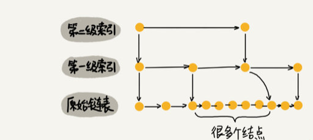
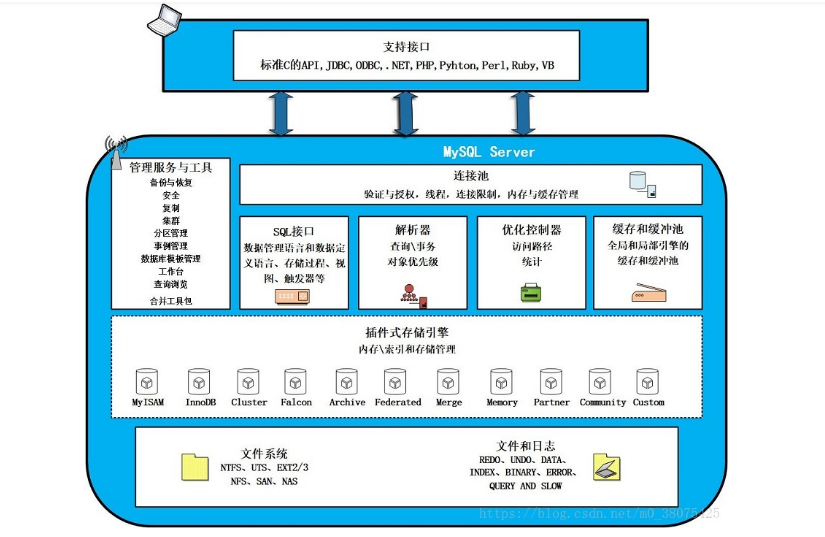

##### Java

###### java中的集合, 线程安全? 线程不安全?

*   线程安全：就是当多线程访问时，采用了加锁的机制；即当一个线程访问该类的某个数据时，会对这个数据进行保护，其他线程不能对其访问，直到该线程读取完之后，其他线程才可以使用。防止出现数据不一致或者数据被污染的情况 

*   线程不安全：就是不提供数据访问时的数据保护，多个线程能够同时操作某个数据，从而出现数据不一致或者数据污染的情况 

**Vector、HashTable、Properties是线程安全的；**

**ArrayList、LinkedList、HashSet、TreeSet、HashMap、TreeMap是线程不安全的**

​	 为了保证集合既是安全的而且效率高，Collections为我们提出了解决方案，把这些集合包装成线程安全的集合。
Collections提供了如下几个静态方法。 


###### Vector、ArrayList、LinkedList ?

1、Vector：
	Vector与ArrayList一样，也是通过数组实现的，不同的是它支持线程的同步，即某一时刻只有一个线程能够写Vector，避免多线程同时写而引起的不一致性，但实现同步需要很高的花费，因此，访问它比访问ArrayList慢。

2、ArrayList：
	a. 当操作是在一列数据的后面添加数据而不是在前面或者中间，并需要随机地访问其中的元素时，使用ArrayList性能比较好。
	b. ArrayList是最常用的List实现类，内部是通过数组实现的，它允许对元素进行快速随机访问。数组的缺点是每个元素之间不能有间隔，当数组大小不满足时需要增加存储能力，就要讲已经有数组的数据复制到新的存储空间中。当从ArrayList的中间位置插入或者删除元素时，需要对数组进行复制、移动、代价比较高。因此，它适合随机查找和遍历，不适合插入和删除。

3、LinkedList：
	a. 当对一列数据的前面或者中间执行添加或者删除操作时，并且按照顺序访问其中的元素时，要使用LinkedList。
	b. LinkedList是用链表结构存储数据的，很适合数据的动态插入和删除，随机访问和遍历速度比较慢。另外，他还提供了List接口中没有定义的方法，专门用于操作表头和表尾元素，可以当作堆栈、队列和双向队列使用。


###### HashTable、HashMap、HashSet ?

HashTable和HashMap采用的存储机制是一样的，不同的是：
1、HashMap：
	a. 采用数组方式存储key-value构成的Entry对象，无容量限制；
	b. 基于key hash查找Entry对象存放到数组的位置，对于hash冲突采用链表的方式去解决；
	c. 在插入元素时，可能会扩大数组的容量，在扩大容量时须要重新计算hash，并复制对象到新的数组中；
	d. 是非线程安全的；
	e. 遍历使用的是Iterator迭代器；

2、HashTable：
	a. 是线程安全的；
	b. 无论是key还是value都不允许有null值的存在；在HashTable中调用Put方法时，如果key为null，直接抛出NullPointerException异常；
	c. 遍历使用的是Enumeration列举；

3、HashSet：
	a. 基于HashMap实现，无容量限制；
	b. 是非线程安全的；
	c. 不保证数据的有序；


###### StringBuffer , StringBulider , String ? 

​	String 内部使用 final char 数组存放字符串数据, 如果要修改字符串, 那么只能重新申请一个 String对象, 所以如果涉及大量的字符串修改 , 字符串拼接的操作, String 类的效率会很低

​	StringBulider 内部使用 char 数组存放字符串数据, 字符串拼接时直接对原数组进行扩容, 这样就省去了创建对象的时间, 不足之处是对数组的操作不是线程安全的, 所以如果涉及大量的字符串修改, 拼接的操作, 还是这个好, 但是如果涉及多线程操作还是使用 StringBuffer

​	StringBuffer 内部实现同 StringBulider , 唯一不同的是操作都是线程安全的, 所以使用多线程执行大量拼接操作时选这个

​	相同情况下使用 StringBuilder 相比使用 StringBuffer 仅能获得 10%~15% 左右的性能提升，但却要冒多线程不安全的风险, 因此实际中更加推荐直接使用 StringBuffer


###### ***list*** 和 ***数组*** 之间的转换?

 ***数组*** 转 ***list*** 

​	`Array.asList(数组)` , 这种方法创建的Array对象指向原数组, 所以只能查改, 不能增删, 如果想要创建新的List对象 `new ArrayList<T>(Array.asList(数组))`

***list*** 转 ***数组***  

```java
List<String> list = new ArrayList<>();
String[] arr = new String[list.size()];
list.toArray(arr);
```


###### 数据库连接池 ?

​	建立数据库连接是很耗时的操作 , 首先得加载数据库驱动程序到内存中, 然后与数据库建立网络连接, 然后才能执行语句, 用完之后还得释放连接, 如果没有释放连接, 那么数据库的对应的连接资源就不会被释放, 从而造成内存泄露.

​	如果没有一个统一的连接管理机制, 那么每来一个请求, 都得走上面一套流程, 这极大降低了响应速度.

​	数据库连接池在系统初始化时创建一定数量的连接, 每次来请求就分配一个出去, 用完之后不释放连接, 而是等下一次请求再次分配出去, 这就省去了建立连接和释放连接的时间, 提高响应时间. 

​	数据库连接池应当设置最小连接数, 为了随时能够提供可用的连接以供请求使用, 这个初始创建的连接数应当根据访问的并发量而定. 同时连接池应当提供限制最大连接数功能, 防止过多的连接造成数据库内存不足而宕机.


###### HashMap?

​	本质就是一个数组, 数组元素是 `Entry<K,V>` 类型, Entry 是链表节点的结构, 能保存下一个元素的位置

​	存元素时 key > hash > indexofarr > 存到数组中对应位置 > 如果这个位置已经有元素了 > 就作为这个位置上元素的下一个链表节点 

​	所以总体的结构是 : 一个元素为链表的数组, 查找的时候先根据 key 算 hash, 然后换算成数组的index, 然后直接到这个位置取数据, 如果这个位置元素不止一个, 那么就只能遍历这个位置上的链表直到找到该元素.

​	当然, 应当尽量避免数组中元素成为链表的情况, 也就是多个 key 算出来的 index 一样, 这种情况就是 hash冲突, 应当选择好的 hash计算函数, 减少算出来 hash值是一样的情况.

​	综上, 因为是数组存储, 所以查找, 修改, 删除速度为 O(1), 效率很高, 除非hash冲突很多导致链表很长.


###### hashTable ?

线程安全版本的 hashMap , 数据结构同 hashMap

hashMap 允许null, hashTable 不允许 null


###### 多线程

***创建线程以及操作线程***

​	继承 Thread 或者实现 Runnable, 本质上 Thread 就是实现了 Runnable 的一个示例类

​	如果继承 Thread, 那么直接 new 该对象即可, 如果实现 Runnable, 那么需要将该对象示例作为参数传递给 new Thread(Runnable)

***Runnable方式有利于多线程数据共享***

​	所以, 使用 Runnable 方式创建的多个线程都是使用同一个 Runnable 对象, 此时这些个线程之间就共享同一份数据, 更加有利于多线程之间的数据共享, 但是同时也可能造成数据操作混乱, 此时应当结合同步代码块来完成

***线程的状态***

线程状态: 创建 , 就绪, 运行, 阻塞, 终止, 僵死(Z)

调用 start() 后进入就绪状态, 等待cpu分配时间片

调用 join() 强制让该线程插队运行

在线程的 run 方法里面调用 Thread.sleep(n) 使该线程暂时休眠n毫秒

调用 interrupt() 强制终止该线程

​	线程后台执行, 默认创建的线程都是前台执行, 也就是只要有一个前台线程没有执行完, java进程就不会结束, 可以调用 setDaemon() 设置线程为后台执行, 此时该线程不影响java进程的结束

setPriority(x) 设置线程优先级, 优先级越高越容易被先执行

Thread.yield() 当前线程让出cpu资源, 礼让其他同优先度线程, 但是可能因为再次被cpu选中执行而礼让无效

***synchronized代码块***

​	synchronized代码块接收一个对象作为参数(锁对象), 凡是使用同一个对象作为锁对象的, 不能同时执行这段代码, 这实现了多线程同步

`锁对象.wait()`  使得当前拥有该锁对象的线程让出cpu并且释放锁

`锁对象.notify()` 通知其他随机 某个 使用该锁对象的线程恢复到就绪状态, 但是当前线程不会立即让出cpu, 直至同步代码块执行完毕, 或者手动wait()让出cpu

`锁对象.notifyAll()`  通知其他所有使用该对象作为锁对象的线程恢复到就绪状态, 同样当前线程不会立即让出cpu除非执行完同步代码块, 或者手动wait()

###### 如果想要多个进程交替打印

​	可以使用 synchronized 代码块, 让这些线程同时锁一个对象, 然后在代码块中先打印, 然后 notify 其他线程后自己 wait


###### 虚拟内存?物理内存?共享内存?

物理内存: 实际分配给应用程序的内存大小 (RES)

虚拟内存: 应用程序所需内存的总大小, 就是假设应用程序已经把所有需要的数据都加载到内存了, 每次根据需要向物理内存中加载 (VIRT)

共享内存: 有些系统库是许多应用程序都需要用到的, 那么这些库在内存中加载一份就可以了, 然后各个应用去该地取. (SHR)


###### Java的多态?

​	java默认函数类型就是c++中的虚函数, 所以在子类中重写父类方法后, 创建的对象中的函数会动态绑定到子类中的实现, 即使使用父类型接收子对象, 其行为也是子对象的行为, 这就是多态.

​	如果不想要默认的虚函数动态绑定行为, 就在父类的函数上加 final , 意思就是子类不能重写这个函数.

​	c++中默认不动态绑定行为, 也就是默认不是多态, 如果想要使用动态绑定行为, 使用虚函数


###### 为什么重写hashcode()和equals()?

​	对象默认使用Object的hashcode和equals, 即比较内存地址是否相等

​	而实际开发中可能需要根据对象的某个属性来决定是否相等, 所以重写 hashcode 就是自定义实例的身份证, 在 hashSet 之类的容器中, 每次添加新元素会判断 hashcode是否相同, 此时使用自定义的 hashcode 方法就可以实现业务上的定制需求

​	equal 的行为应当与 hashcode 的比较结果相同, 否则会造成不可预料的错误


###### 公平锁和非公平锁?

***公平锁***: 各个线程尝试拿锁时直接进入拿锁队列, 如果自己是队头就拿到锁, 排队拿锁比较公平, 但是因为铁定每次都会切换线程而触发上下文切换而导致系统吞吐量较低

***非公平锁***: 各个线程直接尝试拿锁, 拿不到就自旋后再拿, 哪个能拿到锁完全是随机的, 所以不公平, 如果某线程能连续多次拿到锁, 那么就不用切换上下文, 省去一些时间, 但是可能某些线程会饿死


###### copyonwrite?

​	针对多线程情况下, 多读少写时 ***提高读写吞吐量*** 的解决方案. 

​	假设要操作的对象是 ArrayList, 那么它是线程不安全的, 此时如果使用读写锁, 那么读的时候不能写, 写的时候不能读

​	为了提高读写吞吐量, 可以使用 copyonwrite的方法, 写的时候复制一个数组副本, 先改这个副本, 然后再把副本复制回原数组, 这样就不必使用读写锁, 读线程读原数组, 写线程写副本数组, 此时只需使用 volatile 修饰原数组, 即当其发生变化时通知读线程 即可, 这种方法就能够提高读写吞吐量.


###### transient关键字

​	对象如果想要进行被传输, 需要实现序列化, 传输后接收方再反序列化还原对象

​	如果某字段使用 transient 关键字修饰, 那么在序列化的时候将直接以空值进行序列化, 也就是说, 在接收方反序列化后该字段将是空值

​	对于一些敏感字段, 比如银行卡密码, 要在网络上传输就是非常不安全的, 就需要使用 transient修饰, 使其不参与序列化, 也就避免了该字段的值在网络上传输被破解的风险


###### volatile关键字

​	在多线程的情况下, 对于共享变量, 也就是多个线程都可以访问的变量

​	其读写机制为, 各个线程将该变量复制一份到自己的线程数据段中, 然后读就直接从自己的数据段中直接读, 写就先更新自己的这份复制, 然后再写回共享变量的原位置. 

​	但是这就造成一个问题, 如果某个线程更新了共享变量, 然后更新回原内存, 但是此时其他使用该共享变量的线程并不知道该变量已经被修改, 因此还会使用它们自己内存段中的那份复制, 这就会造成多个线程之间数据不一致的问题.

​	使用 volatile 修饰的变量, 在某个线程修改其值后, 会强制清除其他线程数据段中该共享变量的缓存, 那么其他线程再次使用该变量时就只能再次从共享内存中复制一份出来, 此时复制出来的就是新值, 也就不会再造成数据的不一致.

​	这个 volatile 也就是实现了所谓的一个线程修改变量, 可以通知其他使用该变量的线程


###### 原子性操作

​	直接将值赋给变量的操作编译后是一句话, 就是原子操作

​	而 n++, n+=1 在编译后分别对应 取值, 加1, 赋值 三句, 就不是原子操作

​	非原子操作在单线程下没有问题, 但是在多线程下就会出大问题

​	所以应当保证非原子性操作在多线程的情况下也保持原子性操作的性质

1.  java.concurrent.atomic 包下的类型是对所有基本类型的原子性封装

    每种类型都提供各种原子性的操作方法, 直接使用这些类型就可以避免非原子性操作带来的意外

    比如, 这个 AtomicInteger

    

2.  可以使用 java.concurrent.locks.ReentrantLock 给非原子性操作加锁

    就像这样( 摘自源码中的文档 )

    >   注意: 
    >
    >   ​	可重入锁, 也就是一开始线程会拿锁, 拿到锁之后只要不主动释放, 这个锁就一直是自己的, 跟 synchronized 区别就是, 同步操作执行完后, 自动就释放了锁, 下次还想进来就还得抢锁

    

3.  reentrantlock 对比 reentrantreadwritelock

    reentrantlock 是有操作就加锁

    reentrantreadwritelock 分为读锁和写锁

    支持 ***读+读操作***, 不支持 读+写操作, 不支持 写+写操作

    因为这个 读+读操作, 对于读多写少的场景, 性能上就有很大的提升


##### Redis

###### redis 数据类型 ?

1. string
2. list , 这里是 linkedlist 结构
3. hash 字典 , 同 hashmap 结构
4. set , 同 hashSet , 无序不可为空不可重复列表
5. zset, 使用 key 作为排序标准的 hashMap 结构, 自动根据 key 进行排序, 直接就能用到排行榜功能上


###### redis 中 zset 的跳表实现?

https://blog.csdn.net/qq_38545713/article/details/105439688

跳表 : 能够二分查找的单链表.

​	在原链表中, 每隔几个节点就抽取一个节点, 当做索引节点, 从整个链表抽取出来的索引节点就组成了一条索引链表, 然后可以使用这种方法构建多级索引, 这样的话, 在查询的时候, 从最高级索引开始查询, 确定范围后到下一级索引中查, 直至最终查询到原链表, 就可以快速定位目标节点, 这样的索引查询原理上基本等同于二分查找, 所以效率非常高.



​	而且, hashmap的 value 本身就是 list 类型, 那么就可以使用 hashmap 建立索引, key 是索引节点, value 是该索引节点到下个索引节点之间的原链表节点.

​	因为查询的高效性, 所以这种数据结构在插入, 修改, 删除操作时依然高效, 其中删除操作时如果要删除的节点刚好是索引节点, 那么应当把索引节点一同删除, 那么就要注意极端情况下把索引删完了, 又退化成单链表, 所以要在插入节点的同时适当的也增加索引节点.	


###### Redis适用?

1. 数据库与客户端之间的缓存
2. 排行榜这种实时更新的数据, 自带 SortSet类型, 适合做排行
3. 计数器/ 访问限制 , 例如点赞数, 访问数, 也可记录请求次数, 然后限制访问频率
4. 消息队列, 利用自带的 List 实现发布/订阅模式
5. 好友关系, 利用自带的交集, 并集, 差集 功能, 直接获得共同好友
6. session 共享 , 在分布式服务中, 将用户登录的 session 保存到公共的 redis中,  各个服务器从 redis 中获取 session 进行登录验证


###### Redis不适合 ?

数据量很大且访问频率低, 那么这些数据保存到内存中就是浪费.


###### Redis优点 ?

1. 读写快
2. 数据类型丰富
3. 操作都是原子性
4. 应用方面广 , 缓存, 消息队列, 计数器, 记录session


###### redis 为什么快?

1. 内存存储
2. 单线程, 避免了线程切换的损失
3. 底层使用系统的 epoll 多路复用函数, 把耗时的 IO操作交给 多路复用函数处理, 用于处理请求的函数仅仅是把请求发送给 IO 多路复用程序 和 从IO多路复用程序接受IO操作的回调通知, 然后返回给客户端

* IO多路复用, 就是系统提供的调用, 用于实现非阻塞式的IO, 有三种实现, select, poll, epoll

  ​	其中 select 和 poll 检查 IO操作进度时都要遍历整个socket表, 而 epoll 使用回调的方式, 当IO操作进行响应时, 将结果保存到一个list中, epoll每次检查有没有IO操作结果时只需要遍历这个list即可, 所以epoll方式性能更高

  ​	redis 中处理客户端请求的只有一个线程, 如果使用同步阻塞IO机制, 那么就无法实现并发, 因为其他请求都得等前边的请求IO操作完成才能被处理,  所以必须使用IO多路复用机制, 它使用的是 epoll.


###### redis相比memcached有哪些优势？

* memcached所有的值均是简单的字符串，redis作为其替代者，支持更为丰富的数据类型
* redis的速度比memcached快
* redis 可以持久化其数据
* redis 有主从备份功能
* redis 一个 value 能有 1G, memcached 一个 value 最多 1M


###### redis的并发竞争问题如何解决?

​	Redis为单进程单线程模式，采用队列模式将并发访问变为串行访问。Redis本身没有锁的概念，Redis对于多个客户端连接并不存在竞争，但是在Jedis客户端对Redis进行并发访问时会发生连接超时、数据转换错误、阻塞、客户端关闭连接等问题，这些问题均是由于客户端连接混乱造成。对此有2种解决方法：

1. 客户端角度，为保证每个客户端间正常有序与Redis进行通信，对连接进行池化，同时对客户端读写Redis操作采用内部锁synchronized。
2. 服务器角度，利用setnx实现锁。

> 注：对于第一种，需要应用程序自己处理资源的同步，可以使用的方法比较通俗，可以使用synchronized也可以使用lock；第二种需要用到Redis的setnx命令，但是需要注意一些问题。


###### redis 可能出现的性能问题 ?

集群环境下, master节点进行数据落盘时, 主线程阻塞, 如果数据量过大, 会间断性暂停服务, 所以应当让从节点进行数据落盘, 主节点不要接手这档子事


###### redis实现分布式锁 ?

> ​	分布式锁是控制分布式系统或不同系统之间共同访问共享资源的一种锁实现，如果不同的系统或同一个系统的不同主机之间共享了某个资源时，往往需要互斥来防止彼此干扰来保证一致性。 

​	多个线程请求获取锁, 也就是使用 set命令( setnx + expire 版本的参数设置)设置同一个 key , 这个key就是所谓的锁, 谁能设置进去值, 就代表谁获得了锁, 其余的就是没获得锁, 该指令能够同时实现无则成功, 有则失败且带过期时间的 set 操作.

​	如果谁设置成功了, 那么就执行相关操作, 操作完了之后就 del 这个 key, 此时其他线程就可以设置上值了.

​	没设置成功的就开始轮询, 一直设置, 直到设置成功了, 就代表它获得了锁.


###### redis 分布式锁和 zookeeper 分布式锁 ?

​	zookeeper使用自带的临时节点功能来实现分布式锁, 每一个进程来申请获取锁时会创建一个临时节点, 该临时节点编号递增, 只有进程获取到的节点编号是所有编号中最小的时候才认定为获得了锁, 否则给前一个节点添加监听, 当前一个节点操作完之后, 会将前一个节点删除, 此时后一个节点就监听到了删除事件, 然后再判断自己是不是当前最小的编号, 是则代表获得了锁.

​	zookeeper 分布式锁优点是实现起来简单而且能保证高可用 , 缺点是创建和删除节点都会消耗性能, 所以面对高并发,大流量时效果不佳, 此时还是建议使用 redis实现分布式锁, 能够应对高并发.


###### redis 的 keys 命令?

不要在生产环境用 keys命令, 因为单线程特性, 会让 redis 服务阻塞可能造成宕机.

应该使用 scan 命令.


###### redis 实现队列 ?

​	就用自带的 list 类型的值 , 生产者队尾加, 消费者队首取

###### 如果要实现延时队列?

​	用自带的 zset, 生产者设置 score 为当前时间戳, value 为消息, 消费者取消息时用当前时间戳减去延时, 然后范围查询 zset 中 score 在延时之前的消息.


###### redis 的数据持久化机制?

​	自动定时将内存中的数据保存到硬盘上, 下次启动时从备份文件中恢复数据到内存.

* RDB模式: 默认模式, 每隔时间周期都开一个子进程, 把父进程内存中的数据保存到硬盘的临时文件上, 数据保存完成后, 临时文件替换上次的数据备份文件, 子进程退出.

* AOF模式 : 记录每次收到的指令, 下次启动时执行一遍记录的所有命令, 跟mysql的binlog一个道理, 执行命令后不会立即保存到AOF文件中, 而是先放到缓冲区中, 然后隔一定的时间再从缓冲区同步到硬盘上, 这个时间间隔可配置
  * always : 不等, 直接同步
  * everysec : 一秒同步一次, 一般用这个
  * no : 等着操作系统给你同步, 没啥用


###### 缓存雪崩

​	redis 同一时间大量key过期 , 也就意味着大量请求直接发送给底层数据库

​	解决方式

*   在底层数据库之上加锁机制
*   加一个消息队列
*   或者预处理过期时间, 加上微小的随机的时间差, 避免同一时间过期


###### 缓存穿透?

​	要查的数据在数据库里没有, 自然在缓存中也没有, 那么后面每次请求这个数据时都得走两次无用的查询, 最后得到的结果还是空

解决: 

*   要么直接把这些肯定不存在的数据汇总起来放到redis中, 设置为空, 直接来了就给它返回空, 注意如果这些键将来可能不是空, 那么在redis中存的时候应当加上失效时间, 否则以后这个key真的有值时就会出现数据不一致的错误
*   或者过滤请求, 把不合法的请求过滤掉, 比如id=-1


###### 缓存击穿?

​	要查的 key 在redis中没有(刚好过期了), 但是数据库中有, 如果此时大量请求该key ,那么数据库将承受巨大压力

解决:

*   设置 key 不过期
*   接口限流和熔断
*   加互斥锁 , 访问 redis之前尝试获取锁 , 拿到了就正常查询 , 否则自旋一下然后再尝试拿锁


###### redis 主从复制?

1. 从服务器向主服务器发送同步请求
2. 主服务器开始生成RDB文件, 并且从此时开始执行的写命令记录到缓冲区
3. 主服务器向从服务器发送生成的RDB文件
4. 从服务器接收RDB文件并同步到内存中
5. 主服务器把之前暂存到缓冲区的数据发送给从服务器
6. 从服务器同步这些缓冲区命令记录
7. 之后主服务器每次执行写操作, 都会发给从服务器让其执行一次


###### 缓存淘汰策略 ?

1. voaltail-lru : 设置了过期时间的里面选最近最少使用的淘汰
2. volatile-ttl : 设置了过期时间的里面选剩余有效期最短的淘汰
3. volatile-random : 设置了过期时间的里面随机选择淘汰
4. allkeys-random : 所有的缓存随机淘汰
5. allkeys-lru : 所有的缓存选最近最少使用淘汰
6. no-enviction : 不淘汰


###### lru 最近最少使用算法的实现 ?

为什么用链表实现, 因为链表删除中间元素和插入中间元素速度比数组快

1. 使用双向链表保存各缓存数据, 每次访问或更新时将目标元素提到链表首部, 超过缓存最大长度时删除链表尾部元素
2. 同时使用 map 存储链表中各个元素的位置, 使查询速度达到 O(1)


###### redis 删除过期键的策略 ?

* 定时删除, 只要一过期就删除, 缺点是消耗 cpu 资源
* 惰性删除, 获取的时候检查有没有过期, 有就删除, 然后更新, 缺点是过期了还占在内存里
* 定期删除, 定期处理过期数据


##### 网络

###### 长连接和短连接 ?

​	实质上说的是 TCP 连接的保持, 比如一个 web 页面要从服务器请求资源, 请求资源必定要建立 TCP 连接, 而一个页面中又有很多js,css,html文件, 如果每请求一个文件, 都要建立一个连接, 用完后释放, 那么就太消耗服务器资源了, 所以可以设置保持这个连接一段时间, 在这段时间内, 所有由这个客户端到服务器发起的请求都走这条连接, 就省去了不停创建和释放连接的时间, 这就是长连接


###### 长轮询和短轮询 ?

​	短轮询就是客户端无限循环向服务器发请求问结果, 然后服务器收到请求后就给出响应. 很消耗客户端和服务器资源.

​	长轮询就是客户端依然无限循环向服务器发请求问结果, 但是服务器收到请求后先看看要的数据有没有变化, 有的话就直接返回, 没有的话就暂时不给响应, 而是开一个线程监控这个数据的变换, 等到有变化或者到了预定的超时时间时, 才给客户端响应, 这样的话, 请求和响应的频率就下降了, 但是每来一个请求服务器都开一个线程监控变化也是很浪费服务器资源的.


###### ping的原理 ?

​	本质上, ping是操作系统内核的一个程序, 发起ping的发送方构建icmp数据包, 然后再包装一层IP首部, 最后发送到目标主机, 当目标主机收到数据包后, 解析到 IP 首部中 ***协议*** 是 icmp, 于是交给 icmp处理程序, icmp处理程序收到消息后,  构建一个固定大小的 icmp 包, 返回给发送方. 

​	ping 命令主要用来测试主机之间网络是否可达.

​	也可以在操作系统上设置忽略 icmp 类型的消息, 也就是收到 icmp 类型的数据包时不交给 icmp 处理程序处理, 那么也就不会给发送方返回消息包.

**ICMP** : 更确切地应该说是 ICMP 类型的消息, 包含了 ICMP类型的首部, 跟 TCP 和 UDP 是一个档次的协议. 加装了 IP首部的数据包可以通过网络传输到目的主机, 到达目的主机后, 操作系统根据 IP 首部中 ***协议*** 字段判断 IP 数据包部分应该交给 TCP处理程序, UDP处理程序 还是 ICMP处理程序来处理.


###### DNS 流程

1. 查查浏览器缓存
2. 查看操作系统缓存(hosts文件)
3. 问本地 DNS服务器要
4. 问 RootDNS服务器要, 给一个主域名DNS服务器, 比如要的是 .com 的, 那么给的就是管理所有 .com 的DNS地址
5. 问目标区域的主服务器地址要, 给一个目标域名注册到的 Name server服务器地址
6. 问 Name server 地址
7. 本地DNS缓存下
8. 浏览器缓存下


###### 如何使用 UDP 进行可靠传输 ?

​	UDP协议不建立连接, 没有滑动窗口, 最小窗口, 确认重传, 序号和确认号机制, 只管把数据发给目的主机就完了.

所以如果想使用 UDP 的情况下保证可靠传输, 应当在应用层实现以上功能.


###### HTTP1.0, 1.1 , 2.0 区别?

1.0 默认短连接, 仅支持 get , post , head 请求

1.1 默认长连接, 添加支持 put, delete, patch , 支持断点续传

2.0 多路复用, 降低开销, 基于二进制解析因此错误更少(1.x基于文本解析), 报头压缩, 节省带宽


##### 数据库

###### mysql架构 ?



1. 连接层 , 负责与客户端建立TCP连接, 实现用户认证, 数据加密等功能
2. 服务层 , 负责将收到的 sql 语句中的视图, 触发器之类的转换为sql查询, 生成执行计划, 优化执行计划, 然后看看缓存里有没有结果
3. 引擎层 , 接收服务层传下来的执行计划, 然后根据自身的存储规则执行, 不同的存储引擎实际上区别就在于存储数据的结构不同, 然后对应读取数据的方式也不同.
4. 存储层, 就是指最终保存到磁盘上的文件, 引擎层程序从这里读取和保存数据


###### 数据库设计三大范式 ?

1. 确保每一个字段都是不可再分的, 原子性的, 例如 地址 字段, 如果还有需求是 城市 字段, 那么 地址字段就不是原子性
2. 确保每一个字段都跟主键相关, 也就是一个表中所有数据都是一类数据, 不能说 学生信息表 里整一个 体重 字段
3. 确保每一个字段都跟主键直接相关, 也就是不能间接相关, 比如 学生成绩表, 用 学号 作为字段就跟主键直接相关, 但是再整一个 学生年龄 就不是直接相关.

