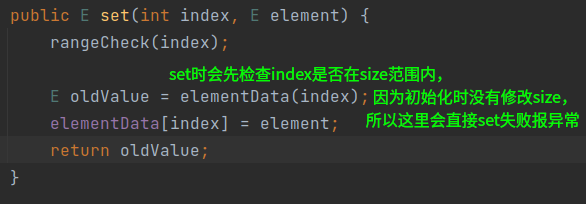
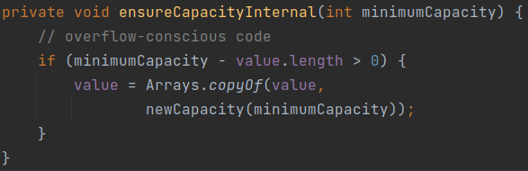
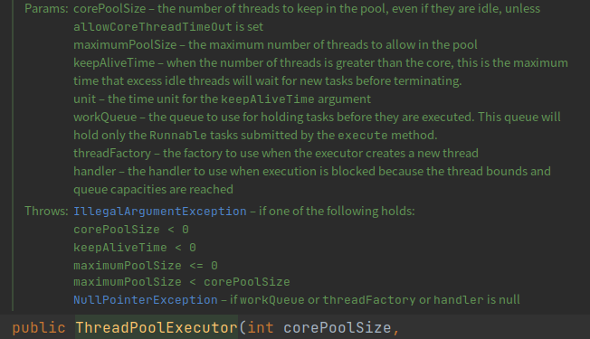
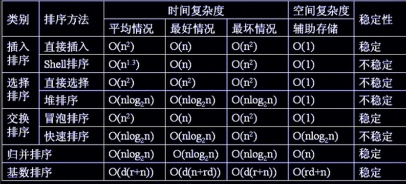

Java


###### java中的集合, 线程安全? 线程不安全?

*   线程安全：就是当多线程访问时，采用了加锁的机制；即当一个线程访问该类的某个数据时，会对这个数据进行保护，其他线程不能对其访问，直到该线程读取完之后，其他线程才可以使用。防止出现数据不一致或者数据被污染的情况 

*   线程不安全：就是不提供数据访问时的数据保护，多个线程能够同时操作某个数据，从而出现数据不一致或者数据污染的情况 

**Vector、HashTable、Properties是线程安全的；**

**ArrayList、LinkedList、HashSet、TreeSet、HashMap、TreeMap是线程不安全的**

Collections提供了如下几个静态方法，把这些线程不安全的集合包装成线程安全的集合，这些类型被称为 <span style='color:cyan;'>同步容器</span>，也就是简单地使用 synchronized 实现线程安全

但是这些方法返回的只不过是在原类型对象的所有方法上加了synchronized实现同步的对象, 所以效率不高


###### 同步容器一定线程安全吗？

>   总结同步容器只能保证单个操作同步，在进行复合操作时很容易造成数据不同步，而且对于读操作也进行同步，这会降低效率
>
>   所以，多线程下应当使用专门的 <span style='color:cyan;'>并发容器</span>，而不是 <span style='color:cyan;'>同步容器</span>

​		可以看到，Vector这样的同步容器的所有公有方法全都是synchronized的，也就是说，我们可以在多线程场景中放心的使用 <span style='color:cyan;'>单独</span> 这些方法，因为这些方法本身的确是线程安全的

​		但是，请注意上面这句话中，有一个比较关键的词：<span style='color:cyan;'>单独</span>

​		因为，虽然同步容器的所有方法都加了锁，但是对这些容器的 <span style='color:cyan;'>复合操作</span> 无法保证其线程安全性。需要客户端通过主动加锁来保证。

简单举一个例子，我们定义如下删除Vector中最后一个元素方法：

```java
public Object deleteLast(Vector v){
    // vector 提供的方法都是同步的，但是如果把这些方法组合到一起执行然后使用多线程，就会造成线程不安全
    int lastIndex  = v.size()-1;
    v.remove(lastIndex);
}
```

​		上面这个方法是一个复合方法，包括size(）和remove()，乍一看上去好像并没有什么问题，无论是size()方法还是remove()方法都是线程安全的，那么整个deleteLast方法应该也是线程安全的。

​		但是时，如果多线程调用该方法的过程中，remove方法有可能抛出ArrayIndexOutOfBoundsException。

​		同步容易由于对其所有方法都加了锁，这就导致多个线程访问同一个容器的时候，只能进行顺序访问，即使是不同的操作，也要排队，如get和add要排队执行。这就大大的降低了容器的并发能力

​		在并发场景中，建议直接使用java.util.concurent包中提供的容器类，这些被称为 <span style='color:cyan;'>并发容器</span>， 如果需要复合操作时，建议使用这些容器自身提供的复合方法


###### Vector、ArrayList、LinkedList ?

1、Vector：

​	<span style="color:cyan;">线程安全版本的</span> ArrayList

​	Vector与ArrayList一样，也是通过数组实现的，不同的是它是线程同步的, 但实现同步需要很高的花费，因此，访问它比访问ArrayList慢

​		扩容策略为原来的两倍


2、ArrayList：
	a. 当操作是在一列数据的后面添加数据而不是在前面或者中间，并需要随机地访问其中的元素时，使用ArrayList性能比较好。
	b. ArrayList是最常用的List实现类，内部是通过数组实现的，它允许对元素进行快速随机访问。数组的缺点是每个元素之间不能有间隔，当数组大小不满足时需要增加存储能力，就要讲已经有数组的数据复制到新的存储空间中。当从ArrayList的中间位置插入或者删除元素时，需要对数组进行复制、移动、代价比较高。因此，它适合随机查找和遍历，不适合插入和删除。

​		扩容策略为每次都是前一次的1.5倍


​	<span style='color:cyan;'>使用带参构造函数</span>进行指定长度的初始化时，仅仅是初始化了内部的 数组，而没有初始化内部字段 size，而且 set 时会先检查 index 是否符合 size，因此指定长度初始化后，访问 size() 仍然会得到0, 而且不能直接向指定位置 set 值




​		在指定位置插入元素时，使用 System.arraycopy, 将从目标位置开始到结束后面所有元素都向后复制一个位置，然后再将新元素插入到该位置


​		因为Arraylist 的插入和删除操作都是基于复制批量元素来实现的，所以不适合做队列，效率太低

​		而数组更加适合做队列，使用两个指针指向队头和队尾，通过移动指针来表示入队和出队

3、LinkedList：
	a. 当对一列数据的前面或者中间执行添加或者删除操作时，并且按照顺序访问其中的元素时，要使用LinkedList。
	b. LinkedList是用链表结构存储数据的，很适合数据的动态插入和删除，随机访问和遍历速度比较慢。另外，他还提供了List接口中没有定义的方法，专p门用于操作表头和表尾元素，可以当作堆栈、队列和双向队列使用。


###### HashTable、HashMap、HashSet ?

HashTable和HashMap采用的存储机制是一样的，不同的是：
1、HashMap：
	a. 采用数组方式存储key-value构成的Entry对象，无容量限制；
	b. 基于key hash查找Entry对象存放到数组的位置，对于hash冲突采用链表的方式去解决；
	c. 在插入元素时，可能会扩大数组的容量，在扩大容量时须要重新计算hash，并复制对象到新的数组中；
	d. 是非线程安全的；
	e. 遍历使用的是Iterator迭代器；

2、HashTable：
	a. <span style="color:cyan;">是线程安全的</span>；
	b. 无论是key还是value都不允许有null值的存在；在HashTable中调用Put方法时，如果key为null，直接抛出NullPointerException异常；
	c. 遍历使用的是Enumeration列举；

3、HashSet：

​	HashSet 本质就是有一个HashMap的字段, 因为 HashMap 的 key 不可以重复, 所以直接利用这个特性来存数据, 遍历的时候直接遍历该 HashMap 的 key , add 的时候调用 hashmap 的 put 方法, 它会返回之前该 key 对应的值, 如果不存在则返回 null , 那么此时就认为 add 成功, 否则认为 add 失败. 

​	a. 基于HashMap实现
​	b. 非线程安全
​	c. 不保证数据的有序, 因为 hashmap 的 key 是无序的


###### Properties?

​	java自带的读取 .Properties配置文件 的类, 继承自 HashTable, <span style="color:cyan">线程安全</span>

​	其他语言也各自有自己的配置文件格式, 比如 python的 .ini 文件


###### StringBuffer , StringBulider , String ? 

*   String


​	String 内部使用 final char 数组存放字符串数据, 如果要修改字符串, 那么只能重新申请一个 String对象, 所以如果涉及大量的字符串修改 , 字符串拼接的操作, String 类的效率会很低

final 关键字


*   StringBulider

​	StringBulider 内部使用 char 数组存放字符串数据



​	字符串拼接时先检查原数组是否足够, 否则重新申请足够长度的数组, 这样就省去了创建对象的时间, 不足之处是对数组的操作不是线程安全的, 所以如果涉及大量的字符串修改, 拼接的操作, 还是这个好, 但是如果涉及多线程操作还是使用 StringBuffer


*   StringBuffer


​	StringBuffer 内部重新了一系列操作方法为同步方法, 具体实现完全同 StringBulider , 唯一不同的是操作都是线程安全的, 所以使用多线程执行大量拼接操作时选这个

​	相同情况下使用 StringBuilder 相比使用 StringBuffer 仅能获得 10%~15% 左右的性能提升，但却要冒多线程不安全的风险, 因此实际中更加 <span style="color:cyan;">推荐直接使用 StringBuffer</span>


###### ***list*** 和 ***数组*** 之间的转换?

 ***数组*** 转 ***list*** 

​	`Array.asList(数组)` , 这种方法创建的Array对象指向原数组, 所以只能查改, 不能增删, 如果想要创建新的List对象 `new ArrayList<T>(Array.asList(数组))`

***list*** 转 ***数组***  

```java
List<String> list = new ArrayList<>();
String[] arr = new String[list.size()];
list.toArray(arr);
```


###### 队列容器

>   队列都来自于 Queue 接口

它们的API

| 功能 |  抛异常   |  返回值  |
| :--- | :-------: | :------: |
| 增   |  add(e)   | offer(e) |
| 删   | remove()  |  poll()  |
| 瞧   | element() |  peek()  |


-   如果想实现「普通队列 - 先进先出」的语义，就使用 LinkedList 或者 ArrayDeque 来实现；
-   如果想实现「优先队列」的语义，就使用 <span style='color:orange;'>PriorityQueue</span>，<span style='color:cyan;'>这个就是所谓的 [堆](https://mp.weixin.qq.com/s?__biz=MzAwNDA2OTM1Ng==&mid=2453144928&idx=2&sn=9381f2e2ac82013d7f6483a751597d1e&scene=21#wechat_redirect)</span> ,  这个堆是使用数组的形式来表达 大顶堆二叉树 或者 小顶堆二叉树，每次插入元素时自叶至根，逐渐上浮至合适位置 , 删除元素就是先直接删除该位置元素, 然后拿最后一个元素先顶上, 然后将顶上的这个元素逐渐下沉至合适位置
-   如果想实现「栈」的语义，就使用 ArrayDeque。

**那 ArrayDeque 和 LinkedList 的区别有哪些呢？**

1.  ArrayDeque 是一个可扩容的数组，LinkedList 是链表结构；
2.  ArrayDeque 里不可以存 null 值，但是 LinkedList 可以；
3.  ArrayDeque 在操作头尾端的增删操作时更高效，但是 LinkedList 只有在当要移除中间某个元素且已经找到了这个元素后的移除才是 O(1) 的；
4.  ArrayDeque 在内存使用方面更高效。

所以，只要不是必须要存 null 值，就选择 ArrayDeque 吧！

**那如果是一个很资深的面试官问你，什么情况下你要选择用 LinkedList 呢？**

-   答：Java 6 以前...因为 ArrayDeque 在 Java 6 之后才有的

**使用 ArrayDeque 作为栈**

虽然 Java 中有 Stack 这个类，但是呢，官方文档都说不让用了！


原因也很简单，因为 Vector 已经过被弃用了，而 Stack 是继承 Vector 的。

那么想实现 Stack 的语义，就用 ArrayDeque 吧：

```java
Deque<Integer> stack = new ArrayDeque<>();
```


###### Set容器


**HashSet**: 采用 Hashmap 的 key 来储存元素，主要特点是无序的，基本操作都是 O(1) 的时间复杂度，很快。

**LinkedHashSet**: 这个是一个 HashSet + LinkedList 的结构，特点就是既拥有了 O(1) 的时间复杂度，又能够保留插入的顺序。

**TreeSet**: 采用红黑树结构，特点是可以有序，可以用自然排序或者自定义比较器来排序；缺点就是查询速度没有 HashSet 快。

那每个 Set 的**底层实现**其实就是对应的 Map：

​		**数值放在 map 中的 key 上，value 上放了个 PRESENT，是一个静态的 Object，相当于 place holder，每个 key 都指向这个 object。**


###### 数据库连接池 ?

​	建立数据库连接是很耗时的操作 , 首先得加载数据库驱动程序到内存中, 然后与数据库建立网络连接, 然后才能执行语句, 用完之后还得释放连接, 如果没有释放连接, 那么数据库的对应的连接资源就不会被释放, 从而造成内存泄露.

​	如果没有一个统一的连接管理机制, 那么每来一个请求, 都得走上面一套流程, 这极大降低了响应速度.

​	数据库连接池在系统初始化时创建一定数量的连接, 每次来请求就分配一个出去, 用完之后不释放连接, 而是等下一次请求再次分配出去, 这就省去了建立连接和释放连接的时间, 提高响应时间. 

​	数据库连接池应当设置最小连接数, 为了随时能够提供可用的连接以供请求使用, 这个初始创建的连接数应当根据访问的并发量而定. 同时连接池应当提供限制最大连接数功能, 防止过多的连接造成数据库内存不足而宕机.


###### HashMap

​		本质就是一个数组, 数组元素是 `Entry<K,V>` 类型, Entry 是链表节点的结构, 能保存下一个元素的位置

​		存元素时 <span style='color:cyan;'>key > hash > indexofarr > 存到数组中对应位置 > 如果这个位置已经有元素了 > 就作为这个位置上元素的下一个链表节点 </span>

​		所以总体的结构是 : 一个元素为链表的数组, 查找的时候先根据 key 算 hash, 然后与数组的长度取余换算成在数组中的index, 然后直接到这个位置取数据, 如果这个位置元素不止一个, 那么就只能遍历这个位置上的链表直到找到该元素.

​		当然, 应当尽量避免数组中元素成为链表的情况, 也就是多个 key 算出来的 index 一样, 这种情况就是 hash冲突, 应当选择好的 hash计算函数, 减少算出来 hash值是一样的情况.

​		综上, 因为是数组存储, 所以查找, 修改, 删除速度为 O(1), 效率很高, 除非hash冲突很多导致链表很长.

​		1.8中计算hash的方法，取hash值前16位和后16位按位或，得到16位的结果，不用32位的原hash值可能是为了提高效率吧


###### HashMap容量

​		*元素的index = hash(key) & (length-1)*

​		在使用2的幂的数字的时候，Length-1的值是所有二进制位全为1（比如1111），这种情况下，index 的结果等同于 HashCode后几位的值

​		只要输入的HashCode本身分布均匀，Hash算法的结果就是均匀的, 这就<span style='color:orange;'>实现了均匀分布</span>

​		hash运算的过程其实就是对目标元素的Key进行hashcode，再对Map的容量进行取模，而JDK 的工程师为了提升取模的效率，使用位运算代替了取模运算，<span style='color:cyan;'>这就要求Map的容量一定得是2的幂</span>

​		而作为默认容量，太大和太小都不合适，所以16就作为一个比较合适的经验值被采用了

为了保证任何情况下Map的容量都是2的幂，HashMap在两个地方都做了限制

*   首先是，如果用户制定了初始容量，那么HashMap会计算出比该数大的第一个2的幂作为初始容量

*   另外，在扩容的时候，也是进行成倍的扩容，即4变成8，8变成16

    因为扩容后数组长度增加，所以要重新使用 key 的 hash 跟 新数组长度 取余 算所在位置

​		


###### <span style='color:cyan;'>Hashmap如何实现线程安全</span>

*   直接使用 HashTable , 本质上是把所有HashMap的方法都加上synchronized

*   使用 java.util.collections.synchronizedMap

    本质上是对用一个HashMap对象作为字段，同时包含一个 mutex 锁字段

    调用方法时用锁字段synchronized调用 hashmap 字段的对应方法

    

*   <span style='color:cyan;'>使用 java.util.concurrent.concurrentHashMap，这里面方法尽量减少了加synchronized的代码，只在关键的 put 操作时加synchronized，推荐用这个</span>

    ​		concurrentHashMap 是由 Segment 数组、HashEntry 组成，ConcurrentHashMap 采用了**分段锁**技术，每当一个线程占用锁访问一个 Segment 时，不会影响到其他的 Segment，就是说如果容量大小是16他的并发度就是16，可以同时允许16个线程操作16个Segment而且还是线程安全的

    ConcurrentHashMap在进行put操作的还是比较复杂的，大致可以分为以下步骤：

    1.  根据 key 计算出 hashcode 。
    2.  判断是否需要进行初始化。
    3.  即为当前 key 定位出的 Node，如果为空表示当前位置可以写入数据，利用 CAS 尝试写入，失败则自旋保证成功。
    4.  如果当前位置的 `hashcode == MOVED == -1`,则需要进行扩容。
    5.  如果都不满足，则利用 synchronized 锁写入数据。
    6.  如果数量大于 `TREEIFY_THRESHOLD` 则要转换为红黑树。


###### HashMap版本变化

*   1.7及之前，存储结构为 list+link

*   1.7 在链表中新增的元素会作为链表的头进行插入，称为<span style='color:cyan;'>头插法</span>

    ​		头插法在 resize 重新算 hash 时，多线程情况下可能因为 rehash 后元素倒置而产生链表环，使得程序陷入死循环，所以不可取

    ​		因此，1.8 在链表中新增的元素直接插入到链表的尾部，称为<span style='color:cyan;'>尾插法</span>，但是多线程时可能覆盖某些元素，尽管会造成数据错误，但是总比使得程序死循环强

    ​		所以，哪怕1.8用了尾插法，也不要尝试在多线程时直接使用 hashmap

*   1.8之后，存储结构为 <span style='color:cyan;'>list+link+tree</span>，list中元素是link或者tree，当该位置元素个数小于指定个数时，使用link存储，大于指定个数时，改为tree存储，为了能够提高查询效率，具体由 `MIN_TREEIFY_CAPACITY` 字段控制，默认是8

    


###### HashTable 

线程安全版本的 hashMap , 在其所有方法前面都加上一个 `synchronized`

hashMap 允许 key 或者 value 为 null, hashTable 不允许 key 或者 value 为 null

为什么Hashtable不允许null？

​	Hashtable采用安全失败机制，如果允许 value 为 null ，将无法判断是因为key不存在所以返回的 null 还是本来 value 就是 null

HashMap 的初始容量为：16，Hashtable 初始容量为：11

当现有容量大于总容量 * 负载因子时，HashMap 扩容规则为当前容量翻倍，Hashtable 扩容规则为当前容量翻倍 + 1

HashMap 中的 Iterator 迭代器是 fail-fast（快速失败） 的，而 Hashtable 的 Enumerator 不是 fail-safe（安全失败） 的


###### 安全失败和快速失败

<span style='color:cyan;'>快速失败</span>

​		在用迭代器遍历一个集合对象时，如果遍历过程中对集合对象的内容进行了修改（增加、删除、修改），则会抛出 Concurrent Modification Exception。

​		**原理：**迭代器在遍历时直接访问集合中的内容，并且在遍历过程中使用一个 modCount  变量。集合在被遍历期间如果内容发生变化，就会改变 modCount 的值。每当迭代器使用 hashNext()/next()  遍历下一个元素之前，都会检测 modCount 变量是否为 expectedmodCount 值，是的话就返回遍历；否则抛出异常，终止遍历。

​		**注意：**这里异常的抛出条件是检测到 **modCount != expectedmodCount** 这个条件。如果集合发生变化时修改 modCount 值刚好又设置为了 expectedmodCount 值，则异常不会抛出。因此，不能依赖于这个异常是否抛出而进行并发操作的编程，这个异常只建议用于检测并发修改的 bug。

​		**场景：**java.util 包下的集合类都是快速失败的，不能在多线程下发生并发修改（迭代过程中被修改）

<span style='color:cyan;'>安全失败</span>

​		采用安全失败机制的集合容器，在遍历时不是直接在集合内容上访问的，而是先复制原有集合内容，在拷贝的集合上进行遍历。

​		**原理：**由于迭代时是对原集合的拷贝进行遍历，所以在遍历过程中对原集合所作的修改并不能被迭代器检测到，所以不会触发 Concurrent Modification Exception。

​		缺点：基于拷贝内容的优点是避免了 Concurrent Modification Exception，但同样地，迭代器并不能访问到修改后的内容，即：迭代器遍历的是开始遍历那一刻拿到的集合拷贝，在遍历期间原集合发生的修改迭代器是不知道的。

​		**场景：**java.util.concurrent 包下的容器都是安全失败，可以在多线程下并发使用，并发修改。


###### 多线程

***创建线程以及操作线程***

​	继承 Thread 或者实现 Runnable, 本质上 Thread 就是实现了 Runnable 的一个示例类

​	如果继承 Thread, 那么直接 new 该对象即可, 如果实现 Runnable, 那么需要将该对象示例作为参数传递给 new Thread(Runnable)

***Runnable方式有利于多线程数据共享***

​	所以, 使用 Runnable 方式创建的多个线程都是使用同一个 Runnable 对象, 此时这些个线程之间就共享同一份数据, 更加有利于多线程之间的数据共享, 但是同时也可能造成数据操作混乱, 此时应当结合同步代码块来完成

***线程的状态***

线程状态: 创建 , 就绪, 运行, 阻塞, 终止, 僵死(Z)

调用 start() 后进入就绪状态, 等待cpu分配时间

调用 join() 强制让该线程插队运行, 并且等待该进程结束或者主动让出cpu, 在两个线程中互相让对方 join 可导致死锁

在线程的 run 方法里面调用 Thread.sleep(n) 使该线程暂时休眠n毫秒

调用 interrupt() 强制终止该线程

>   注意: interrupt方法仅仅是在当前线程中打了一个停止标记，并不是真的停止线程
>
>   *   this.interrupted()：测试当前线程是否已经中断，执行后具有将状态标志清除为false的功能
>
>   *   this.isInterrupted()：线程对象是否已经中断状态，但不清楚状态标志

守护线程, 线程后台执行, 默认创建的线程都是前台执行(用户线程), 也就是只要有一个前台线程没有执行完, java进程就不会结束, 可以调用 setDaemon() 设置线程为后台执行, 此时只要其他用户线程都结束了, 那么守护线程也会自动结束

setPriority(x) 设置线程优先级, 优先级越高越容易被先执行

Thread.yield() 当前线程让出cpu资源, 礼让其他同优先度线程, 但是可能因为再次被cpu选中执行而礼让无效

suspend() 暂停线程, 以及 resume() 继续线程, 但是不恰当的暂停可能导致公共资源被占用迟迟得不到释放而影响性能

Thread.currentThread() 获取到当前正在执行的线程实例


###### ***synchronized代码块***

>   wait , notify , notifyall 只能在 synchronized 代码块中使用
>
>   因为java语言只提供了一种锁的方式，就是 synchronized，而这三个方法就是指名对应给 synchronized 使用的

​	synchronized 是 Java 中唯一语言层面实现的多线程同步方法，其他的方法都是相当于自己写的包

​	synchronized代码块接收一个对象作为参数(锁对象), 凡是使用同一个对象作为锁对象的, 不能同时执行这段代码, 这实现了多线程同步

`锁对象.wait()`  使得当前拥有该锁对象的线程让出cpu并且<span style='color:cyan;'>释放锁</span>

`锁对象.notify()` 通知其他随机 某个 使用该锁对象的线程恢复到就绪状态, <span style='color:cyan;'>但是当前线程不会立即让出cpu, 直至同步代码块执行完毕, 或者手动wait()让出cpu</span>

`锁对象.notifyAll()`  通知其他所有使用该对象作为锁对象的线程恢复到就绪状态, <span style='color:cyan;'>同样当前线程不会立即让出cpu除非执行完同步代码块, 或者手动wait()</span>

注意，在synchronized代码块中，<span style='color:cyan;'>使用 sleep 不会释放锁，醒来后继续持有锁执行</span>


###### synchronized原理

​		synchronized会被编译为 monitorenter 和 monitorexit 字节码指令，依赖操作系统底层的互斥锁实现

​		当执行 monitorenter 指令时，线程试图获取锁也就是获取  monitor(monitor对象存在于每个Java对象的对象头中，synchronized  锁便是通过这种方式获取锁的，也是为什么Java中任意对象可以作为锁的原因)  的持有权。当计数器为0则可以成功获取，获取后将锁计数器设为1也就是加1。相应的在执行 monitorexit  指令后，将锁计数器设为0，表明锁被释放。

​		如果多个线程同时执行到 monitorenter 指令时，会进入 entrylist 队列尝试获取对象锁，成功获取到锁后锁计数加一并记录当前获得锁的线程

​		因为存在计数以及保存了当前持有锁的对象，synchronized 是可重入锁

​		如果在执行中调用了wait方法，那么该线程进入 waitlist 队列，待到其他线程调用 notify 或者 notifyall 时，重新回到 entrylist 参与锁的竞争

​		在 java 1.8 之前， synchronized 锁作为重量级锁而被诟病，java1.8 优化了 synchronized 锁机制，使其拥有了较好的性能，具体为：

​		先使用 **偏向锁** 优先同一线程然后再次获取锁，如果失败，就升级为 **CAS 轻量级锁**，如果失败就会短暂 **自旋**，防止线程被系统挂起。最后如果以上都失败才升级为 **重量级锁**。

​		所以是一步步升级上去的，最初也是通过很多轻量级的方式锁定的，这样就提高了 synchronized 锁的性能


###### 如果想要多个进程交替打印

​	可以使用 synchronized 代码块, 让这些线程同时锁一个对象, 然后在代码块中先打印, 然后 notify 其他线程后自己 wait


###### ThreadLocal

>   ThreadLocal的作用是让人人（线程们）吃上一碗饭（独立的变量）

​		一个对所有线程都可见的变量，如果直接拿来让多个线程操作，那么必然造成数据的不一致，而 ThreadLocal 类型变量会在各个线程中复制一份，线程操作该变量时操作的是自己线程本地的变量，这样每个线程就是在操作独立的变量，互不影响

​		可是如果想让每个线程都操作一份独立的变量，直接将该变量作为线程的内部字段不就行了？

​		行是行，但是问题在于，如果这个变量的类型很复杂而且需要繁琐的初始化过程 (比如jdbc的connection变量)，那么直接将其作为线程内部字段不是不是可以，而是很麻烦，需要在每个线程中都写一遍初始化 connection 的代码，此时如果使用 ThreadLocal 变量，那么只需要在公共位置初始化一次连接对象，然后在各个线程中直接使用，它们就自动的进行了复制且互相独立

​		<span style='color:cyan;'>ThreadLocal原理</span>

​		在 Thread 对象中，有一个 Map 类型（也就是key，value）的字段 <span style='color:cyan;'>ThreadLocalMap</span>，当在线程中使用外部的 Threadlocal 变量时，会自动以该变量名作为key，值作为value加入 Threadlocalmap中，此后对该变量的操作都将操作该本地位置

​		<span style='color:cyan;'>Threadlocal内存泄露</span>

​		如果使用的是线程池，那么线程在执行完当前任务后，将不会从内存中释放，理所当然的是该 Thread对象上的ThreadLocalMap 中的值也不会被清理，但是此时 ThreadLocalMap 中存的是上一次任务的值，显然已经是无用的值，因为它们不会被清理而且以后也不会被使用，所以随着线程执行不同的任务，ThreadLocalMap中无用的值会越来越多侵蚀内存

​		防止因为在线程池中使用 Threadlocal而造成内存泄露的方式是，每当执行完当前任务，就手动调用 Threadlocal 对象的 remove 方法清除掉本次任务使用的所有值

​		<span style='color:cyan;'>ThreadLocal的应用场景</span>

1.  为了避免重复的初始化对象代码，作为<span style='color:cyan;'>多重影分身之术</span>来使用，比如在多个线程中使用jdbc 的 connection对象
2.  因为该值存到了线程的本地栈中，所以一旦存上，之后该线程就可以在任意时刻访问到它，可以作为<span style='color:cyan;'>飞雷神之术</span>，先将要用到的数据存起来，然后在之后任意时刻访问它，这样就避免了某些参数需要在一连串的方法中传递的困扰

​	


###### 虚拟内存?物理内存?共享内存?

物理内存: 实际分配给应用程序的内存大小 (RES)

虚拟内存: 应用程序所需内存的总大小, 就是假设应用程序已经把所有需要的数据都加载到内存了, 每次根据需要向物理内存中加载 (VIRT)

共享内存: 有些系统库是许多应用程序都需要用到的, 那么这些库在内存中加载一份就可以了, 然后各个应用去该地取. (SHR)


###### Java的多态?

​	java默认函数类型就是c++中的虚函数, 所以在子类中重写父类方法后, 创建的对象中的函数会动态绑定到子类中的实现, 即使使用父类型接收子对象, 其行为也是子对象的行为, 这就是多态.

​	如果不想要默认的虚函数动态绑定行为, 就在父类的函数上加 final , 意思就是子类不能重写这个函数.

​	c++中默认不动态绑定行为, 也就是默认不是多态, 如果想要使用动态绑定行为, 使用虚函数


###### 为什么重写hashcode()和equals()?

​	对象默认使用 Object 的 hashcode 和 equals, 即 比较内存地址是否相等

​	而实际开发中可能需要根据对象的某个属性来决定是否相等, 比如要通过 id属性 判断相同与否进而 put 到 hashmap 中，所以重写 hashcode 就是自定义实例的身份证, 在 hashSet 之类的容器中, 每次添加新元素会判断 hashcode是否相同, 此时使用自定义的 hashcode 方法就可以实现业务上的定制需求

​	equal 的行为应当与 hashcode 的比较结果相同, 否则会造成不可预料的错误


###### copy on write?

​	针对多线程情况下, 多读少写时 ***提高读写吞吐量*** 的解决方案. 

​	假设要操作的对象是 ArrayList, 那么它是线程不安全的, 此时如果使用读写锁, 那么读的时候不能写, 写的时候不能读

​	为了提高读写吞吐量, 可以使用 copyonwrite的方法, 写的时候复制一个数组副本, 先改这个副本, 然后再把副本复制回原数组, 这样就不必使用读写锁, 读线程读原数组, 写线程写副本数组

​	此时只需使用 volatile 修饰原数组, 即当其发生变化时强制清除其他线程中该数组的缓存, 这样就能够即提高读写吞吐量又不会导致数据在多个线程中不一致.


###### transient关键字

​	对象如果想要进行被传输, 需要实现序列化, 传输后接收方再反序列化还原对象

​	如果某字段使用 transient 关键字修饰, 那么在序列化的时候将直接以空值进行序列化, 也就是说, 在接收方反序列化后该字段将是空值

​	对于一些敏感字段, 比如银行卡密码, 要在网络上传输就是非常不安全的, 就需要使用 transient修饰, 使其不参与序列化, 也就避免了该字段的值在网络上传输被破解的风险


###### volatile关键字

<span style='color:cyan;'>保证数据一致性</span>

​		在多线程的情况下, 对于共享变量, 也就是多个线程都可以访问的变量

​		copy on write，其读写机制为, 各个线程将该变量复制一份到自己的线程数据段中, 然后读就直接从自己的数据段中直接读, 写就先更新自己的这份复制, 然后再写回共享变量的原位置. 

​		但是这就造成一个问题, 如果某个线程更新了共享变量, 然后更新回原内存, 但是此时其他使用该共享变量的线程并不知道该变量已经被修改, 因此还会使用它们自己内存段中的那份复制, 这就会造成多个线程之间数据不一致的问题.

​		使用 volatile 修饰的变量, 在某个线程修改其值后, 会强制清除其他线程数据段中该共享变量的缓存, 那么其他线程再次使用该变量时就只能再次从共享内存中复制一份出来, 此时复制出来的就是新值, 也就不会再造成数据的不一致.

​		这个 volatile 也就是实现了所谓的一个线程修改变量, 可以通知其他使用该变量的线程

<span style='color:cyan;'>避免指令重排</span>

​		jvm编译代码为字节码，期间可能根据优化机制对指令先后顺序重新排列，使用 volatile 修饰的变量，相关操作不会被重排，这就避免了多线程下数据错乱的情况


###### 原子性操作

​	直接将值赋给变量的操作编译后是一句话, 就是原子操作

​	<span style='color:cyan;'>而 n++, n+=1 在编译后分别对应 取值, 加1, 赋值 三句, 就不是原子操作</span>

​	非原子操作在单线程下没有问题, 但是在多线程下就会出大问题

​	所以应当保证非原子性操作在多线程的情况下也保持原子性操作的性质

1.  java.concurrent.atomic 包下的类型是对所有基本类型的原子性封装

    每种类型都提供各种原子性的操作方法, 直接使用这些类型就可以避免非原子性操作带来的意外，这些类型都是使用的乐观锁机制（CAS）

    比如, 这个 AtomicInteger

    

2.  可以使用 java.concurrent.locks.ReentrantLock 给非原子性操作加锁

    就像这样( 摘自源码中的文档 )

    >   注意: 
    >
    >   ​	可重入锁, 也就是一开始线程会拿锁, 拿到锁之后只要不主动释放, 这个锁就一直是自己的, 此时还可以再次获取锁，那么也就需要对应的释放锁次数将锁完全释放

    

3.  reentrantlock 对比 reentrantreadwritelock

    reentrantlock 是有操作就加锁

    reentrantreadwritelock 分为读锁和写锁

    支持 ***读+读操作***, 不支持 读+写操作, 不支持 写+写操作

    因为这个 读+读操作, 对于读多写少的场景, 性能上就有很大的提升


###### 单例模式双重判断版本

​	在传统的 lazy式创建单例对象的方法中, 如果创建对象代码不是同步代码, 那么在多线程的情况下很可能创建多个实例出来, 但是如果加上同步, 又会陷入性能低下的境地

​	对于这种情况, 可以选择使用双重判断加同步的方式来创建实例

```java
class Single {
    private static volatile Single single;

    private Single() { super(); }

    public static Single getInstance() {
        // 第一次判断为空, 那么就获取锁
        if (single==null){
            synchronized (Single.class){
                // 拿到锁后再次判断是否为空
                // 为了检查在拿到锁之前其他线程是否已经创建了实例
                if(single==null){
                    single = new Single();
                }
            }
        }
        return single;
    }
}
```

另外，需要注意 uniqueInstance 采用 <span style='color:cyan;'>volatile</span> 关键字修饰也是很有必要。

​		uniqueInstance 采用 volatile 关键字修饰也是很有必要的， uniqueInstance = new Singleton(); 这段代码其实是分为三步执行：

1.  为 uniqueInstance 分配内存空间
2.  初始化 uniqueInstance
3.  将 uniqueInstance 指向分配的内存地址


​		但是由于 JVM 具有 <span style='color:cyan;'>指令重排</span> 的特性，执行顺序有可能变成  1->3->2。指令重排在单线程环境下不会出现问题，但是在多线程环境下会导致一个线程获得还没有初始化的实例。例如，线程 T1 执行了 1 和 3，此时 T2 调用 getUniqueInstance() 后发现 uniqueInstance 不为空，因此返回  uniqueInstance，但此时 uniqueInstance 还未被初始化。

​		使用 volatile 可以禁止 JVM 的指令重排，保证在多线程环境下也能正常运行。


###### 工厂模式

​	就是将一系列相同分类的对象的创建封装到一个工厂类中, 具体创建各类对象实例的方法由工厂类封装, 在使用的时候只需要创建工厂对象, 然后指定要哪个具体的类实例, 最后由工厂对象返回

​	本质点在于工厂类封装了一系列其他对象的创建逻辑, 一种对象在工厂中就相当于一条流水线, 然后想要哪个类的实例就直接告诉工厂就可以得到了


###### 策略模式

>   本质上就是用多个类对同一方法的不同实现来优化 if else 繁琐的情况，使得逻辑更清晰

**意图：**定义一系列的算法,把它们一个个封装起来, 并且使它们可相互替换。

**主要解决：**在有多种算法相似的情况下，使用 if...else 所带来的复杂和难以维护。

**何时使用：**一个系统有许多许多类，而区分它们的只是他们直接的行为。

**如何解决：**将这些算法封装成一个一个的类，任意地替换。

**关键代码：**实现同一个接口。

**应用实例：** 1、诸葛亮的锦囊妙计，每一个锦囊就是一个策略。 2、旅行的出游方式，选择骑自行车、坐汽车，每一种旅行方式都是一个策略。 3、JAVA AWT 中的 LayoutManager。

**优点：** 1、算法可以自由切换。 2、避免使用多重条件判断。 3、扩展性良好。

**缺点：** 1、策略类会增多。 2、所有策略类都需要对外暴露。

**使用场景：** 1、如果在一个系统里面有许多类，它们之间的区别仅在于它们的行为，那么使用策略模式可以动态地让一个对象在许多行为中选择一种行为。 2、一个系统需要动态地在几种算法中选择一种。 3、如果一个对象有很多的行为，如果不用恰当的模式，这些行为就只好使用多重的条件选择语句来实现。

**注意事项：**如果一个系统的策略多于四个，就需要考虑使用混合模式，解决策略类膨胀的问题。


​		将策略对象作为 context 类的字段，通过新建 context 类时给定不同的策略类实例来调用不同的方法实现

​		java1.8 的 map 结合 函数式接口可以更加方便地实现策略模式，使用判断条件作为 map 的 key，使用不同的实现方法作为 map 的 value

```java
// key 是判断条件， value 是方法类型
private Map<String, Function<String, String>> map = new HashMap<>();

// 首先对 map 初始化
public void checkResultDispatcherInit() {
        checkResultDispatcher.put("校验1", order -> String.format("对%s执行业务逻辑1", order));
        checkResultDispatcher.put("校验2", order -> String.format("对%s执行业务逻辑2", order));
        checkResultDispatcher.put("校验3", order -> String.format("对%s执行业务逻辑3", order));
        checkResultDispatcher.put("校验4", order -> String.format("对%s执行业务逻辑4", order));
        checkResultDispatcher.put("校验5", order -> String.format("对%s执行业务逻辑5", order));
        checkResultDispatcher.put("校验6", order -> String.format("对%s执行业务逻辑6", order));
        checkResultDispatcher.put("校验7", order -> String.format("对%s执行业务逻辑7", order));
        checkResultDispatcher.put("校验8", order -> String.format("对%s执行业务逻辑8", order));
        checkResultDispatcher.put("校验9", order -> String.format("对%s执行业务逻辑9", order));
}

// 然后根据条件选择执行不同的方法实现
public String getCheckResultSuper(String order) {
        //从逻辑分派Dispatcher中获得业务逻辑代码，result变量是一段lambda表达式
        Function<String, String> result = map.get(order);
        if (result != null) {
            //执行这段表达式获得String类型的结果
            return result.apply(order);
        }
        return "不在处理的逻辑中返回业务错误";
}
```


###### 模板模式

>   AQS 的设计思想就是模板模式，使用者只需要继承它，然后实现其中步骤的逻辑即可

**意图：**定义一个操作中的算法的骨架，而将一些步骤延迟到子类中。模板方法使得子类可以不改变一个算法的结构即可重定义该算法的某些特定步骤。

**主要解决：**一些方法通用，却在每一个子类都重新写了这一方法。

**何时使用：**有一些通用的方法。

**如何解决：**将这些通用算法抽象出来。

**关键代码：**在抽象类实现，其他步骤在子类实现。

1.  创建一个抽象类，它的模板方法被设置为 final, 模板中定义流程

    ```java
    // Game.java
    public abstract class Game {
       abstract void initialize();
       abstract void startPlay();
       abstract void endPlay();
     
       //模板
       public final void play(){
     
          //初始化游戏
          initialize();
          //开始游戏
          startPlay();
          //结束游戏
          endPlay();
       }
    }
    ```

2.  创建扩展了上述类的实体类，每一个实现类都可以对流程中步骤有不同的实现，但是总是要按照这个流程走

    ```java
    // Cricket.java
    public class Cricket extends Game {
     
       @Override
       void endPlay() {
          System.out.println("Cricket Game Finished!");
       }
     
       @Override
       void initialize() {
          System.out.println("Cricket Game Initialized! Start playing.");
       }
     
       @Override
       void startPlay() {
          System.out.println("Cricket Game Started. Enjoy the game!");
       }
    }
    ```

    ```java
    // Football.java
    public class Football extends Game {
     
       @Override
       void endPlay() {
          System.out.println("Football Game Finished!");
       }
     
       @Override
       void initialize() {
          System.out.println("Football Game Initialized! Start playing.");
       }
     
       @Override
       void startPlay() {
          System.out.println("Football Game Started. Enjoy the game!");
       }
    }
    
    ```

3.  使用 *Game* 的模板方法 play() 来演示游戏的定义方式。

    ```java
    public class TemplatePatternDemo {   public static void main(String[] args) {       Game game = new Cricket();      game.play();      System.out.println();      game = new Football();      game.play();         }}
    ```

    


###### 线程池的创建

​	线程池减少创建和销毁线程的消耗, 复用线程使得处理任务更加迅速, 而且能控制最大线程数量, 防止挤爆内存, 而且还有针对定时任务的线程池

​	内置共六种线程池, 如下图, 线程池统一通过 `Executors.newXXX()` 来创建

>   但是，《阿里巴巴Java开发手册》中强制线程池不允许使用 Executors 去创建，而是通过 ThreadPoolExecutor 的方式，这样的处理方式让写的同学更加明确线程池的运行规则，规避资源耗尽的风险

​	本质上这六种都是在创建 `ThreadPoolExecutor` 实例,  只不过调整了各个参数, 就相当于拿铁, 卡布奇诺之类的

​	当然也可以叫一个浓缩(`ThreadPoolExecutor`), 然后自己定制各个参数


*   <span style='color:cyan;'>FixedThreadPool</span>

    ​	固定线程数量的线程池, 其中的线程一开始就创建好, 然后也不会销毁, 如果某个线程发生意外, 那么立马会再创建新的补上

    ​	适合任务较重的情况

*   <span style='color:cyan;'>SingleThreadExecutor</span>

    ​	只有一个线程的线程池, 保证所有任务队列执行, 而且某个时间点只执行一个任务

    

*   <span style='color:cyan;'>CachedThreadPool</span>

    ​	线程个数 0~Integer.MAX_VALUE, 当前存在的线程会被复用, 线程隔一段时间不用就会被回收

    ​	适合每个任务都比较小的场景, 否则无限创建的线程将挤爆内存

*   <span style='color:cyan;'>ScheduledThreadPool</span>

    ​	该线程池里的线程用来执行定时任务或者周期任务

*   <span style='color:cyan;'>SingleThreadScheduledExecutor</span>

    ​	该线程池里的线程用来执行定时任务或者周期任务, 且只有一个线程

*   <span style='color:cyan;'>ForkJoinPool</span>

    ​	jdk1.7新加入的类型, 该线程池中的所有线程共同执行一个任务, 把任务拆分为多个子任务来并行执行, 提高原任务的执行速度


###### 线程池的使用

​		线程池对象可以通过调用 `execute()` 和 `submit()` 来执行任务，通过传入 `Runnable` 实例或者 `Callable` 实例指定任务

​		注意执行完任务后，要调用 `pool.shutdown()` 关闭线程池，不然如果设置了最小线程数，这些线程将会一直在运行而导致程序不能退出

*   **`execute()` 方法用于提交不需要返回值的任务**

    **所以无法判断任务是否被线程池执行成功与否**

*   **`submit()` 方法用于提交需要返回值的任务。**

    **线程池会返回一个 `Future` 类型的对象，通过这个 `Future` 对象可以判断任务是否执行成功**，并且可以通过 `Future` 的 `get()` 方法来获取返回值，`get()` 方法会阻塞当前线程直到任务完成，而使用 `get（long timeout，TimeUnit unit）` 方法则会阻塞当前线程一段时间后立即返回，这时候有可能任务没有执行完


​		`Runnable` 自Java 1.0以来一直存在，但 `Callable` 仅在Java 1.5中引入, 目的就是为了来处理 `Runnable` 不支持的用例。

*   **`Runnable`  接口**不会返回结果或抛出检查异常

    

*   但是 **`Callable` 接口** 可以

    

​		所以，如果任务不需要返回结果或抛出异常推荐使用 **`Runnable` 接口**，这样代码看起来会更加简洁。

工具类 `Executors` 可以实现 `Runnable` 对象和 `Callable` 对象之间的相互转换。（`Executors.callable（Runnable task`）或 `Executors.callable（Runnable task，Object resule）`）


###### 线程池的工作流程


任务执行过程中发生异常怎么处理？

>   ​		如果某个任务执行出现异常，那么执行任务的线程会被关闭，而不是继续接收其他任务。然后会启动一个新的线程来代替它。

说线程池中的线程创建时机？

>   1.  如果当前线程数少于 corePoolSize，那么提交任务的时候创建一个新的线程，并由这个线程执行这个任务；
>   2.  如果当前线程数已经达到 corePoolSize，那么将提交的任务添加到队列中，等待线程池中的线程去队列中取任务；
>   3.  如果队列已满，那么创建新的线程来执行任务，需要保证池中的线程数不会超过 maximumPoolSize，如果此时线程数超过了 maximumPoolSize，那么执行拒绝策略。


###### 线程池的参数




###### NIO

​	三个部分

*   selector : 就是开一个单独的线程轮询监听各个 channel 中是否发生了指定事件

*   channel : 相当于操作系统创建的 socket, 用于与客户端保持连接以及数据传输, 半双工

*   buffer : 通过 channel 传输的数据都会保存到 buffer中, 这个buffer用的内存位于jvm内存空间之外, 属于外挂内存, 服务器的读写数据都要先经过 buffer


​    本质思想就是操作系统中的 select 方式, 单独开一个线程轮询所有的 channel(socket), 每当收到感兴趣的事件, 就把数据写到该 channel 对应的 buffer中, 具体代码中的实现就是创建 selector , 然后注册监听 channel, 然后无线轮询问 selector 是否有就绪事件, 有的话就从所有的 channel 中轮询查出来是哪个 channel 来的消息, 最后进行处理.


###### Java线程安全

1.  互斥同步锁（悲观锁）

    *   synchronized 关键字是java语言层面支持的同步方法，同一时刻只能有一个线程进入同步代码
    *   reentrantLock 是一个利用synchronized封装的锁类，通过标识字段的状态来表示锁的状态

2.  非阻塞同步锁（乐观锁）

    ​		利用CAS（compare and swap）机器指令来实现锁的方式，不需要加锁，在更新数据时判断当前数据的状态是否等于之前记录的状态，等于则认为本次更新有效，否则认为本次操作无效，自旋指定时间后再次尝试更新

    ​		J.U.C 包中的 Atomic 类方法都是乐观锁机制


##### AQS

AQS 实现的部分有，

*   一个 state 值用来表示锁的状态，

*   一个链表结构的等待队列，

*   拿不到锁的线程进入等待队列进入 interrupt 状态，

*   位于等待队列中第一个的线程不 interrupt 而是自旋尝试获取锁，

*   前一个线程执行完毕后，去等待队列中找到下一个线程将其唤醒

我们需要实现的部分有，

*   尝试获取锁的逻辑，也就是改变 state 的值

*   尝试释放锁的逻辑，也就是改变 state 的值

>   ​		AQS 是 JUC 中提供的一个抽象类，提供了线程同步队列的功能，说白了就是有一个 state 变量，用来表示锁的状态，根据这个 state 计数值来判断是否可以获取锁
>
>   ​		当线程来获取锁时，首先原子修改这个 state 的值，如果修改成功则表示获取到了锁，否则表示没有获取到锁，进而把它加入到等待队列中，待到队列中前一个线程释放锁之后，进而可以获取锁来执行代码
>
>   ​		AQS 就是对以上内容进行了封装而已，在使用的时候，自定义的锁类只需要继承 AQS ，然后实现其中四个具体操作 state 状态的方法即可
>
>   ​		采用模板模式的设计思路，也就是整体的流程已经给定，只需要完成其中步骤的细节即可

继承 AQS 需要实现的四个方法


然后使用 acquire 方法实现自定义锁中的 lock 方法


加入到等待队列中后，如果自己是将要队伍中第一个，那么自旋随时尝试获取锁，否则安心把自己 interrupt 掉，等前面的执行完唤醒它


使用 release 方法实现自定义锁中的 unlock 方法


一个简单的自定义独占锁demo

```java
public class testExclusiveLock {

    public static void main(String[] args) {
        // 创建锁实例
        CustomQueue lock = new CustomQueue();
        // 主线程先拿锁执行
        lock.lock();
        for (int i = 0; i < 10; i++) {
            // 整10个子线程，它们的执行都需要先拿到锁，因为主线程一直持锁未释放，所以只有等到主线程释放锁后，它们才能依次执行
            // 因为不能直接拿到锁，所以会入等待队列，然后依次出队拿到锁执行
            new Thread(new Runnable() {
                @Override
                public void run() {
                    lock.lock();
                    System.out.println(Thread.currentThread().getName() + " is using the lock...");
                    lock.unlock();
                }
            }).start();
            try {
                sleep(100);
            } catch (InterruptedException e) {
                e.printStackTrace();
            }
        }

        System.out.println("Main is willing to release...");
        lock.unlock();
    }
}


// 自定义锁，继承AQS，因为是独享锁，只需实现 tryAcquire 和 tryRelease
class CustomQueue extends AbstractQueuedSynchronizer {
    @Override
    protected boolean tryAcquire(int arg) {
        if (compareAndSetState(0, 1)) {
            setExclusiveOwnerThread(Thread.currentThread());
            return true;
        }
        return false;
    }

    // 调用 acquire 实现 lock
    public void lock() {
        acquire(1);
    }

    // 调用 release 实现 unlock
    public void unlock() {
        release(0);
    }

    @Override
    protected boolean tryRelease(int arg) {
        setState(arg);
        setExclusiveOwnerThread(null);
        return true;
    }

}
```

执行结果


​		<span style='color:cyan;'>非公平锁和公平锁</span> 的实现唯一区别在于，公平锁先检查当前线程在等待队列中有没有前驱节点，如果有直接返回获取锁失败，而非公平锁直接不断自旋尝试修改 state 变量进而获取锁，以下是 Semaphore 中对两种锁的实现


​		CountDownLatch 也是基于 AQS 实现的同步工具，用于一个线程等待其他多个线程执行完毕的场景，比如在主线程中等待子线程都执行完毕

​		CountDownLatch是一次性的，计数器的值只能在构造方法中初始化一次，之后没有任何机制再次对其设置值，当CountDownLatch使用完毕后，它不能再次被使用。


##### ReentrantLock 和 synchronized 

ReentrantLock 和 synchronized 都是互斥锁，可重入锁

但是 ReentrantLock 比 synchronized 多一些功能：

*   ReentrantLock 可以选择中断等待，也就是如果获取锁失败就不再继续获取锁，进而转去做其他事情
*   ReentrantLock 可以选择是 公平锁 或者 非公平锁，synchronized 是个非公平锁且无法修改
*   ReentrantLock 可以通过 condition 限定哪些线程可以被唤醒来参与锁的竞争

**性能已不是选择标准**


##### 锁的总结

「**互斥锁、自旋锁、读写锁、乐观锁、悲观锁**」


###### 互斥锁与自旋锁：谁更轻松自如？

>   ​		互斥锁：（线程）来买东西（使用资源），如果别人（其他线程）正在买就直接回家，等到别人买完了，店主（操作系统）打电话通知你来买，如果别人花的时间很短，那倒不如不回家直接在这里等一会（自旋锁）
>
>   ​		自旋锁：（线程）来买东西（使用资源），如果别人（其他线程）正在买就就地等一会，待会可以直接轮到你，所以如果其他线程买东西的时间短的话，就地等一会的方法就很划算，反之如果别人要花很久，那还不如直接回家

​		最底层的两种就是「互斥锁和自旋锁」，有很多高级的锁都是基于它们实现的

​		互斥锁和自旋锁的区别在于对于加锁失败后的处理方式是不一样的：

-   **互斥锁**加锁失败后，线程会**释放 CPU** ，给其他线程；
-   **自旋锁**加锁失败后，线程会**忙等待**，直到它拿到锁；


​		互斥锁是一种「独占锁」，比如当线程 A 加锁成功后，此时互斥锁已经被线程 A 独占了，只要线程 A 没有释放手中的锁，线程 B 加锁就会失败，于是就会释放 CPU 让给其他线程，**既然线程 B 释放掉了 CPU，自然线程 B 加锁的代码就会被阻塞**。

​		**对于互斥锁加锁失败而阻塞的现象，是由操作系统内核实现的**。当加锁失败时，内核会将线程置为「睡眠」状态，等到锁被释放后，内核会在合适的时机唤醒线程，当这个线程成功获取到锁后，于是就可以继续执行。


​		这期间会有**两次线程上下文切换的成本**

-   当线程加锁失败时，内核会把线程的状态从「运行」状态设置为「睡眠」状态，然后把 CPU 切换给其他线程运行；
-   接着，当锁被释放时，之前「睡眠」状态的线程会变为「就绪」状态，然后内核会在合适的时间，把 CPU 切换给该线程运行。


​		上下切换的耗时大概在几十纳秒到几微秒之间，如果你锁住的代码执行时间比较短，那可能上下文切换的时间都比你锁住的代码执行时间还要长。

​		所以，**如果你能确定被锁住的代码执行时间很短，就不应该用互斥锁，而应该选用自旋锁，否则使用互斥锁。**

​		

​		自旋锁是通过 CPU 提供的 `CAS` 函数（*Compare And Swap*），在「用户态」完成加锁和解锁操作，不会主动产生线程上下文切换，所以相比互斥锁来说，会快一些，开销也小一些。

一般加锁的过程，包含两个步骤：

-   第一步，查看锁的状态，如果锁是空闲的，则执行第二步；
-   第二步，将锁设置为当前线程持有；


​		CAS 函数就把这两个步骤合并成一条硬件级指令，形成**原子指令**，这样就保证了这两个步骤是不可分割的，要么一次性执行完两个步骤，要么两个步骤都不执行。

​		使用自旋锁的时候，当发生多线程竞争锁的情况，加锁失败的线程会「忙等待」，直到它拿到锁。这里的「忙等待」可以用 `while` 循环等待实现，不过最好是使用 CPU 提供的 `PAUSE` 指令来实现「忙等待」，因为可以减少循环等待时的耗电量。

​		自旋锁是最比较简单的一种锁，一直自旋，利用 CPU 周期，直到锁可用。**需要注意，在单核 CPU 上，需要抢占式的调度器（即不断通过时钟中断一个线程，运行其他线程）。否则，自旋锁在单 CPU 上无法使用，因为一个自旋的线程永远不会放弃 CPU。**

​		自旋锁开销少，在多核系统下一般不会主动产生线程切换，适合异步、协程等在用户态切换请求的编程方式，但如果被锁住的代码执行时间过长，自旋的线程会长时间占用 CPU 资源，所以自旋的时间和被锁住的代码执行的时间是成「正比」的关系

​		自旋锁与互斥锁使用层面比较相似，但实现层面上完全不同：**当加锁失败时，互斥锁用「线程切换」来应对，自旋锁则用「忙等待」来应对**。

​		它俩是锁的最基本处理方式，更高级的锁都会选择其中一个来实现，比如读写锁既可以选择互斥锁实现，也可以基于自旋锁实现。


###### 读写锁：读和写还有优先级区分？ 

​		读写锁由「读锁」和「写锁」两部分构成，如果只读取共享资源用「读锁」加锁，如果要修改共享资源则用「写锁」加锁。

​		读写锁 可以同时读读，不可以 同时读写 或者 同时写写

​		

​		另外，根据实现的不同，读写锁可以分为「读优先锁」和「写优先锁」

读优先锁

​		读优先锁期望的是，读锁能被更多的线程持有，以便提高读线程的并发性，它的工作方式是：当读线程 A 先持有了读锁，写线程 B  在获取写锁的时候，会被阻塞，并且在阻塞过程中，后续来的读线程 C 仍然可以成功获取读锁，最后直到读线程 A 和 C 释放读锁后，写线程 B  才可以成功获取读锁。

​		读优先锁对于读线程并发性更好，但也不是没有问题。我们试想一下，如果一直有读线程获取读锁，那么写线程将永远获取不到写锁，这就造成了写线程「饥饿」的现象

写优先锁

​		而写优先锁是优先服务写线程，其工作方式是：当读线程 A 先持有了读锁，写线程 B 在获取写锁的时候，会被阻塞，并且在阻塞过程中，后续来的读线程 C 获取读锁时会失败，于是读线程 C 将被阻塞在获取读锁的操作，这样只要读线程 A 释放读锁后，写线程 B 就可以成功获取读锁。

​		写优先锁可以保证写线程不会饿死，但是如果一直有写线程获取写锁，读线程也会被「饿死」

​		

​		既然不管优先读锁还是写锁，对方可能会出现饿死问题，那么我们就不偏袒任何一方，搞个「公平读写锁」。

​		**公平读写锁比较简单的一种方式是：用队列把获取锁的线程排队，不管是写线程还是读线程都按照先进先出的原则加锁即可，这样读线程仍然可以并发，也不会出现「饥饿」的现象。**

互斥锁和自旋锁都是最基本的锁，读写锁可以根据场景来选择这两种锁其中的一个进行实现


###### 乐观锁与悲观锁：做事的心态有何不同？ 

​		前面提到的互斥锁、自旋锁、读写锁，都是属于悲观锁。

​		悲观锁做事比较悲观，它认为**多线程同时修改共享资源的概率比较高，于是很容易出现冲突，所以访问共享资源前，先要上锁**。

​		乐观锁做事比较乐观，它假定冲突的概率很低，它的工作方式是 CAS。另外，你会发现**乐观锁全程并没有加锁，所以它也叫无锁编程**

​		虽然重试的成本很高，但是冲突的概率足够低的话，还是可以接受的. 乐观锁虽然去除了加锁解锁的操作，但是一旦发生冲突，重试的成本非常高，所以**只有在冲突概率非常低，且加锁成本非常高的场景时，才考虑使用乐观锁。**

这里举一个场景例子：在线文档。

​		我们都知道在线文档可以同时多人编辑的，如果使用了悲观锁，那么只要有一个用户正在编辑文档，此时其他用户就无法打开相同的文档了，这用户体验当然不好了。

​		那实现多人同时编辑，实际上是用了乐观锁，它允许多个用户打开同一个文档进行编辑，编辑完提交之后才验证修改的内容是否有冲突。

服务端要怎么验证是否冲突了呢？通常方案如下：

-   由于发生冲突的概率比较低，所以先让用户编辑文档，但是浏览器在下载文档时会记录下服务端返回的文档版本号；
-   当用户提交修改时，发给服务端的请求会带上原始文档版本号，服务器收到后将它与当前版本号进行比较，如果版本号一致则修改成功，否则提交失败。


##### CAS的缺点

*   ABA 问题：

    ​		首先该变量是A，线程1记录下当前的值时A，然后换到线程2运行，线程2先把A改成B，然后又把B改回A，然后换到线程1运行，此时线程1想要修改变量值，使用CAS方法，判断变量还是等于上一次的A，那么认为可以修改，其实变量已经在这期间被修改过甚至修改了两次，这种问题存在但是一般不会影响对最终的结果

    ABA 问题解决方法：

    *   可以不仅仅记录上次的值，还记录一个版本号，每次修改版本号加一，这样就能检测到 ABA 情况
    *   同理也可以使用修改时时间戳作为辅助判断项

*   如果长时间CAS自旋都获得不到锁，那么对于cpu来说是不可忽视的开销

*   这种方法只能同时保证一个变量的原子性操作


##### 对象锁和类锁

对象锁

*   如果 sychronized 是加在类的普通方法上, 那么是对类实例进行加锁 , 也就是同一时刻同一个对象实例上该普通方法不能被多个线程调用, 但是此时其他线程可以调用该类中其他静态方法

类锁

*   如果 sychronized 加在类的 static 方法上, 那么是对类进行加锁, 也就是某时刻该静态方法不能被多个线程同时调用

因此, 加在普通方法上的 sychronized 和 加在静态方法上的是不相干的


##### 读锁和写锁

​	另外一种叫法就是 共享锁(读锁) 和 排他锁(写锁)

读锁: 可以同时多个线程获得读锁, 获得锁后只能读操作	ReentrantReadWriteLock	

写锁: 只能有一个线程获得写锁, 获得锁后可读写	ReentrantLock


##### 公平锁和非公平锁

***公平锁***: 各个线程尝试拿锁时直接进入拿锁队列, 如果自己是队头就拿到锁, 排队拿锁比较公平, 但是因为铁定每次都会切换线程而触发上下文切换而导致系统吞吐量较低

***非公平锁***: 各个线程直接尝试拿锁, 拿不到就自旋后再拿, 哪个能拿到锁完全是随机的, 所以不公平, 如果某线程能连续多次拿到锁, 那么就不用切换上下文, 省去一些时间, 但是可能某些线程会饿死


##### 可重入锁和不可重入锁

​		首先，使用的是互斥锁，也就是同一时间只能有一个线程持有锁，这通常需要定义一个锁对象，然后通过修改锁对象内的字段来判断当前是否可以获取锁

​		可以像这样实现

```java
public class Lock{  
    // 这个字段用来标识当前是否可以获取锁
    private boolean isLocked = false;
    // 同步方法获取锁，其实就是改变字段状态，保证了只能有一个线程获取锁成功
    public synchronized void lock()  
        throws InterruptedException{  
        while(isLocked){  
            wait();  
        }  
        isLocked = true;  
    }  
 	// 同步方法释放锁，其实也是改变字段状态，释放锁后通知其他线程苏醒继续获取锁
    public synchronized void unlock(){  
        isLocked = false;  
        notify();  
    }  
}  
```

​		这种锁的定义方法，假设一个线程获取到了锁，在它未调用unlock释放锁之前，任何一个线程包括它自己再次调用 lock 都不会获取锁成功而是会进入wait，那么，如果代码逻辑中出现了获取锁后不释放锁就直接再次获取锁的错误逻辑，那么程序会陷入死锁，任何线程都不能得以运行，这种锁就是不可重入锁

​		那么，一个线程获取到锁之后，如果它再次尝试获取锁还能获取到，那么就能避免死锁的产生，此时可以引用一个计数字段和当前持有锁的线程对象，如果请求锁的线程等于当前持有锁的线程，那么允许再次获取该锁，可以像这样实现：

```java
public class Lock{
    //标记是否已经被占有
    boolean isLocked = false;
    //记录当前占有该锁的线程
    Thread  lockedBy = null;
    //记录持有锁的线程获取该锁的次数
    int lockedCount = 0;
    //同步获取锁，如果被自己持有，则还可获取到该锁，同时次数加一
    public synchronized void lock() throws InterruptedException{
        Thread callingThread = Thread.currentThread();
        while(isLocked && lockedBy != callingThread){
            wait();
        }
        isLocked = true;
        lockedCount++;
        lockedBy = callingThread;
    }
    //同步释放锁，只有获取锁的线程才能释放锁，每次释放计数减一，直至为零，然后唤醒其他线程
    public synchronized void unlock(){
        if(Thread.curentThread() == this.lockedBy){
            lockedCount--;
            if(lockedCount == 0){
                isLocked = false;
                notify();
            }
        }
    }
}
```


##### 数据类型的自动装箱

*   可以使用数字常量直接初始化包装类型， 将会自动调用new创建对象， 称为自动装箱

    ```java
    Integer a = 3; 
    // 使用数字常量初始化包装类型， 将会自动调用new方法来装箱为对象，称为自动装箱
    ```

*   可以使用包装类型对象直接初始化基本类型对象，赋值后两个变量指向同一个地址，称为自动拆箱

    ```java
    Integer c = new Integer(3);
    int d = c; 
    // 可以直接将包装类型变量赋值给基本类型，为自动拆箱，此时两个变量指向地址相同
    ```

*   在自动装箱或者新建基本类型变量时， 如果数字在范围 -127~128内，那么将直接指向数字常量池中对应位置，不会申请新内存

    ```java
    Integer a = 3; 
    Integer b = 3; 
    // 如果数字常量在 -127~128 范围内，那么会直接指向数字常量池中对应位置，不会申请新的内存， 所以a==b
    ```

*   如果手动调用 new 创建包装类型，无论数字在哪个范围， 都会申请新的内存

    ```java
    Integer c = new Integer(3); 
    // 手动调用new新建包装类型实例，那么必然会申请新的内存
    ```
    
    


##### 同步方法和同步代码块

*   普通同步方法使用当前实例对象作为锁对象， 静态同步方法使用当前类做为锁对象

    同步代码块可以自己使用哪个作为锁对象， 即可以锁类，也可以锁实例

*   同步是非常消耗性能的做法，使用同步代码块同步尽量少的代码而不是使用同步方法同步整个方法的代码


##### Java多线程的通信方法

>   意思就是各个线程要可以有先后次序地运行， 而不是任由cpu的调度而执行

​	以下几种方法本质都是使用一个引用类型的变量作为中间介质，将其传给新建的线程作为其字段，然后根据该变量的状态实现线程的通信

*   使用同步方法

    ​	定义一个类，包含多个同步方法，创建一个实例，将它同时作为多个线程实例的字段进行传递， 然后在各个线程中分别调用该类的不同方法

    ​	此时因为每一个方法都是同步的，也就意味着在同一个实例中，不能同时调用多个同步方法，这样就实现了多个线程的同步，即线程通信

*   通过中介对象的状态

    ​	定义一个对象作为多个线程的共同字段进行传递，在线程中无限循环对该对象的某个状态进行判断来确定当前线程是否可以执行，从而实现线程的同步，即线程通信

*   使用wait/notify

    ​	同样使用一个对象实例作为多个线程的字段进行传递，然后使用wait和notify手动使线程进入阻塞或者唤醒其他线程，这样做的好处是当前无需执行的线程不需要无限循环来判断状态，节约了cpu


##### 避免死锁

产生死锁的条件

1.  互斥， 同一个资源同一时刻只能被一个线程访问
2.  请求与保持， 线程在请求其他资源时，保持持有的资源
3.  不剥夺，线程持有的资源不能被剥夺
4.  循环等待，多个线程循环等待资源

破坏以上之一条件

*   尽量避免在一个线程中对多个对象加锁
*   如果多个线程要对同样的多个对象加锁，尽量保持相同的加锁顺序
*   破坏不剥夺条件，即一个线程在未完全获取所需资源而等待剩余资源时，将其已经获取的资源隐式放入可用资源列表中，可供其他线程获取，待到该线程获取到剩余资源时，需要对之前获取的资源进行再次确认，如果已经被剥夺，则需要重新获取
*   可以使用<>定时锁，即定时释放的锁
*   产生死锁后使用死锁检测算法，使得某些线程让出资源从而解除死锁


##### print函数打印的是虚拟地址

​		因为站在程序的角度上看，它是不知道实际使用的物理地址的，它知道的仅仅是当前变量在分配给该程序的内存地址中的相对位置，当操作系统运行程序时，需要根据页表将变量的虚拟地址转换为物理地址来操作，这一过程对于程序来说是不可见的

​		因此，编程语言中的print函数打印的是变量的虚拟地址


##### 排序算法



###### 排序算法的稳定性

​		如果相同值的元素在排序之后仍然保持排序前的顺序，那么它是稳定排序

​		反之，如果相同值得元素在排序之后的顺序不能保证不变，那么它是不稳定排序

**稳定算法**：冒泡排序、插入排序、归并排序、基数排序
**不稳定算法** ：选择排序、快速排序、希尔排序、堆排序


###### 排序算法时间复杂度

<span style='color:cyan;'>冒泡，选择，插入</span> 三兄弟，时间复杂度 O(n^2)

<span style='color:cyan;'>堆排序，快速排序，归并排序</span>，时间复杂度 O(nlog2^n)， 差不多相当于 O(kn)，k是常数

<span style='color:cyan;'>基数排序</span>，时间复杂度 O(mn), m是元素的最高位数，是个常数

<span style='color:cyan;'>希尔排序</span>，作为插入排序的升级版，看运气，好的时候时间复杂度是 O(n^1.3), 坏的时候等于插入排序是 O(n^2)


注：也就是说 log2^n 部分随着 n 的增大而逐渐平稳，趋近于一个常数


###### 插入排序

​		每次循环保证左边部分序列是有序的，也就是每次多包含进来一个元素，将其插入到左边已经排序的序列，稳定的排序

```java
static void insert(int[] arr) {    
    for (int i = 0; i < arr.length; i++) {        
        for (int j = i; j > 0; j--) {            
            if (arr[j] < arr[j - 1]) swap(arr, j, j - 1);        
        }    
    }
}
```


###### 选择排序

​		每次循环从右边部分序列选择最小的元素作为左边序列的最大值，不稳定的排序

```java
static void select(int[] arr) {        
    for (int i = 0; i < arr.length; i++) {            
        for (int j = i; j < arr.length; j++) {                
            if (arr[j] < arr[i]) swap(arr, i, j);            
        }        
    }    
}
```


###### 冒泡排序

​		每次将左边部分最大元素交换到右边部分序列，左边部分序列长度不断缩小直至消失

​		只要在判断时使用仅大于，就可以保证排序结果中不打乱原数组中相等元素的相对位置，稳定的排序算法

```java
static void bubble(int[] arr) {        
    for (int i = 0; i < arr.length; i++) {            
        for (int j = 0; j < arr.length - i - 1; j++) {                
            if (arr[j] > arr[j + 1]) swap(arr, j, j + 1);            
        }        
    }    
}
```


###### 归并排序

​		使用分治的方法，对原数组进行切分，直至切分到子数组的长度为1或者2, 对子数组进行排序，然后逐级向上合并子数组直至恢复原数组长度。合并两个子数组时，使用一个额外的数组和两个指向子数组的指针，每次将较小的元素加入到额外的数组中，直至两个子数组都没有元素。

​		分治后合并时可以保证原先在左边的子数组中与右边数组中出现相同的元素时，总是先将左边的数组加入到合并后的数组中，这样就保证了原数组相同元素的先后顺序， 是稳定的排序

```java
// 归并排序
public class dac {

    // 入口方法
    void dodac(int[] arr) {
        dfs(arr, 0, arr.length - 1);
    }

    // 递归切分子数组，将排列好的子数组拼接为结果返回
    void dfs(int[] arr, int left, int right) {
        // 如果只有一个元素，直接返回
        if (left == right) return;
        // 如果有两个元素，将两个元素排列好然后返回
        if (left + 1 == right) {
            if (arr[left] > arr[right]) {
                int tmp = arr[left];
                arr[left] = arr[right];
                arr[right] = tmp;
            }
            return;
        }

        // 将左右两个子数组排列完成
        int mid = (right - left) / 2 + left;
        dfs(arr, left, mid - 1);
        dfs(arr, mid, right);

        // 将排列完成的两个子数组拼接到一个新数组中，然后使用新数组替换原数组
        int[] res = new int[right - left + 1];
        int i = left;
        int j = mid;
        int loc = 0;
        while (i != mid || j != right + 1) {
            if (i != mid && j != right + 1) {
                if (arr[i] < arr[j]) {
                    res[loc++] = arr[i++];
                } else {
                    res[loc++] = arr[j++];
                }
                continue;
            }
            if (i != mid) {
                res[loc++] = arr[i++];
            }
            if (j != right + 1) {
                res[loc++] = arr[j++];
            }
        }
        for (int t = 0; t < res.length; t++) {
            arr[left + t] = res[t];
        }
    }
}
```


###### 基数排序

​		首先创建10个队列，取所有元素同一位置上的值，从最低位开始（个位），将其放入对应编号的队列中（比如尾数为0,放到第0个队列中），然后将所有的元素按照队列的顺序出队回到原数组，此时原数组中元素已经按照各位值大小进行排列，然后再按照十位的值将各个元素放入队列，再次取出时所有元素已经按照最后两位进行了正确地排序，依次类推，直至达到元素中的最高位

​		基数排序是不比较的排序方式，使用空间换时间，时间复杂度为 O(mn) ，m是元素的最高位数，n是元素的个数

​		基数排序是稳定的排序

```java
static void radix(int[] arr) {
    // 先整10个队列
    List<LinkedList<Integer>> qs = new ArrayList<>();
    for (int i = 0; i < 10; i++) qs.add(new LinkedList<Integer>());

    int radix_num = 10;
    boolean ext = true;
    // 从最低位开始比较
    while (ext) {
        boolean find = false;
        // 把所有的元素都放到指定的队列中
        for (int j : arr) {
            if (j / radix_num > 0) find = true;
            qs.get(j % radix_num / (radix_num / 10)).add(j);
        }
        int loc = 0;
        // 把所有的元素从队列中取出覆盖原数组
        for (LinkedList<Integer> l : qs) {
            int size = l.size();
            for (int i = 0; i < size; i++) {
                arr[loc++] = l.poll();
            }
        }
        radix_num *= 10;
        ext = find;
    }
}
```


###### 希尔排序

​	本质上还是插入排序，不同点在于不循规蹈矩地从左往右生成排序结果，而是按照跨度选取部分元素进行插入排序，每次循环缩小跨度，然后对命中的元素进行排序，直至跨度为1，进行最后一次排序，结束

1.  原始数组

    

2.  第一次选取元素，然后排序

    

3.  第二次选取元素，然后排序

    

4.  第三次选取元素，然后排序

    

5.  上一次选取元素步长为1,则为最后一次操作，得到最终结果

    

    

```java
static void shell(int[] arr) {
    int step = arr.length / 2;
    while (step > 0) {
        // ### use insert function to sort the select sublist
        // iterate all sublist
        for (int start = 0; start < step; start++) {
            // sort sublist with insert function
            for (int loc = start; loc < arr.length; loc += step) {
                for (int cur = loc; cur > start; cur -= step) {
                    if (arr[cur] < arr[cur - step]) 
                        swap(arr, cur, cur - step);
                }
            }
        }
        // update step
        step /= 2;
    }
}
```


###### 快速排序

注意， 极端情况下，快排时间复杂度为 n^2，也就是每次选取的参照点刚好是最小值，例如对一个已经严格递增的序列进行从小到大的排序


###### 堆排序

基于生成树的排序方法


##### 基本类型缓存池

​		所以注意：基本类型的包装类型相当于直接缓存到了堆中，而不是在方法区单独进行缓存的，这里的缓存只是相当于在程序运行初期就预先创建一系列变量，然后接下来直接使用这些变量罢了

​		对于基本类型的包装类型，默认提供缓存池，实际上就是一个数组，事先存放好缓存范围内的对象

​		基础类型的包装类的缓存，Integer 默认缓存 -128 ~ 127 区间的值，Long 和 Short 也是缓存了这个区间的值，Byte  只能表示 -127 ~ 128 范围的值，全部缓存了，Character 缓存了 0 ~ 127 的值。Float 和 Double  没有缓存的意义。

​		比如，当使用 `valueof()` 创建 Integer的对象实例时，直接返回该数组中对应对象的指针，因为我们肯定不希望在每次使用到的时候，都重新在堆中创建一个新的对象


​		如图，IntergerCache 缓存类，实际上就是用一个数组存放缓存值


##### 字符串常量池

​		所以注意：字符串常量池才是 jvm机制中真正会单独分配到固定的内存，并且可以在 jvm 参数中配置其大小

​		基础类型包装类的缓存池使用一个数组进行缓存，而 String 类型，JVM 内部使用 HashTable 进行缓存，我们知道，HashTable 的结构是一个数组，数组中每个元素是一个链表。和我们平时使用的 HashTable 不同，JVM 内部的这个 HashTable  是不可以动态扩容的。

​		在 Java 6 中，String Pool 置于 PermGen Space 中，PermGen 有一个问题，那就是它是一个固定大小的区域，虽然我们可以通过 `-XX:MaxPermSize=N` 来设置永久代的空间大小，但是不管我们设置成多少，它终归是固定的。

​		所以，在 Java 6 中，我们应该尽量小心使用 String.intern() 方法，否则容易导致 OutOfMemoryError。

​		到了 Java 7，大佬们已经着手去掉 PermGen Space 了，首先，就是将 String Pool 移到了堆中。把 String Pool 放到堆中，即使堆的大小也是固定的，但是这个时候，对于应用调优工作，只需要调整堆大小就行了

​		在 Java 8 中，String Pool 依然还是在 Heap Space 中

​		插入的性能主要取决于链表的平均长度。当链表平均长度为 10 的时候，我们看到性能是几乎没有任何损失的。所以要根据自己的实际情况，考虑是否要设置 `-XX:StringTableSize=N`，还是使用默认值。

