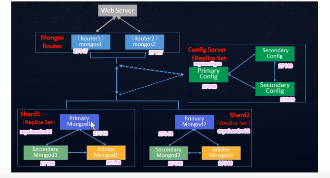

> nosql 数据库
>
> 面对高并发, 海量数据, 高可扩展性, 高可用性
>
> 面对读写频繁且数据量大的场景
>
> 库 (库) -> 集合 (表) -> 文档 (字段)

​	本质是 js 程序, 操作数据都是使用 js 语法, 其中的记录本质就是 json 对象, 因此随意随意扩展字段, 非关系型数据库, 更加接近高级语言面向对象特性, 省去了维护数据库的时间, 但是没有事务


###### 安装和启动服务

方式一

1. 下载 zip 解压
2. 在 bin 同级下新建 data\db ( 数据库存放位置 )
3. 在 bin 目录中的命令行中 `mongod --dbpath=..\data\db`
4. 启动默认端口为 27017
5. 可以将bin 目录配置到环境变量中

方式二:

1. 下载 zip 解压

2. 在 bin 同级下新建 data\db ( 数据库存放位置 )

3. 在解压目录中新建 config 文件夹, 在该文件夹中新建 mongod.conf

   ```yml
   #这个配置文件中不能有 Tab 
   storage:
   	dbPath: 设置数据库存放位置, 就使用第二步中创建的路径
   ```

   

4. 在 bin 目录命令行中 `mongod -f ../config/mongod.conf`  或者  `mongod --config ../config/mongod.conf`

如果是linux:

1. 下载 tgz 压缩包

2. `tar -xvf xxx.tgz` 解压

3. 移动解压后的文件夹到指定目录  `mv xxx /usr/local/mongodb`

4. 新建几个目录存数据和日志 `mkdir -p /mongodb/single/data/db` 和 `mkdir -p /mongodb/single/log`

5. 新建启动配置文件 `vi /mongodb/single/mongod.conf`

   ```yml
   #日志设置
   systemLog:
       destination: file
       path: "/mongodb/single/log/mongod.log"
       logAppend: true
   storage:
       dbPath: "/mongodb/single/db"
       #设置可通过日志恢复数据
       journal:
           enabled: true
   #设置为后台运行模式
   processManagement:
       fork : true
   ```

   

6. 启动数据库服务 `/usr/local/mongodb/bin/mongod -f /mongodb/single/mongod.conf`

7. 查看服务进程 `ps -ef |grep mongod`

8. 使用 compass 或者 shell 远程连接 , 如果连接不上, 检查 linux 的防火墙

   ```shell
   #查看防火墙状态
   systemctl status firewalld
   #临时关闭防火墙
   systemctl stop firewalld
   #禁用防火墙
   systemctl disable firewalld
   ```

   

9. 如果想关闭服务  直接`kill -2 进程号`

   或者

   ```shell
   #使用客户端连接到数据库
   mongo --port 27017
   #切换到admin库
   use admin
   #关闭服务
   db.shutdownServer()
   ```

   


###### shell 操作数据库

1. 在 bin 目录下 `mongo` , 默认连接本地的mongodb服务 , 或者加上参数连接远程的数据库 `mongo --host=127.0.0.1 --port=27017`

2. `show dbs` 显示所有库

3. `use 库名` 选择数据库, 没有则自动创建

4. `db` 查看当前使用的库

5. 自带三个库 

   1. admin  存放用户和权限相关信息
   2. local 这个库中的数据在集群环境时不会被复制,仅在本机存在
   3. config 在集群环境下, 保存数据分片信息

6. `db.dropDatabase()`  删除当前选择的库

7. `show collections` 显示当前库中所有的集合(表)

8. 创建集合

   1. `db.createCollection("集合名")`
   2. 直接创建文档就自动生成集合

9. 集合删除

   1. `db.collection.drop()`
   2. `db.集合名.drop()`

10. 插入文档

    1. `db.集合名.insert({"title":"title", "content":"这是content", "ctime":new Date(), "num": NumberInt(10), "state": null})`  插入一个

    2. `db.集合名.insertMany([{"title":"title", "content":"这是content", "ctime":new Date(), "num": NumberInt(10), "state": null}, {"title":"title", "content":"这是content", "ctime":new Date(), "num": NumberInt(10), "state": null}])`  插入多个

    3. 如果同时添加多条记录, 其中一条添加失败, 那么不会整个操作回滚, 所以可以使用 try catch 来插入

       ```
       try{
       db.集合名.insertMany([{"title":"title", "content":"这是content", "ctime":new Date(), "num": NumberInt(10), "state": null}, {"title":"title", "content":"这是content", "ctime":new Date(), "num": NumberInt(10), "state": null}])
       }catch(e){
       	print(e);
       }
       ```

       

11. 查找文档

    1. `db.集合名.find()`  查所有

    2. `db.集合名.find({ 字段名:值 })` 条件查询

    3. `db.集合名.find({ $and: [{字段1: 值}, {字段2: 值}] })` 多个条件and查询

    4. `db.集合名.find({ $or: [{字段1: 值}, {字段2: 值}] })` 多个条件or查询

    5. `db.集合名.findOne({ 字段名:值 })` 查一个

    6. `db.集合名.find( {}, { 字段名:1, 字段名:0 })` 

       只返回指定字段的查询 , 设置为 0 不显示, 设置为 1 显示

       如果指定查询的字段上都有索引, 那么就相当于只查了索引表, 而不根据索引进一步查询, 这样可以提高查询效率

    7. `db.集合名.find().limit(2)` limit查询

    8. `db.集合名.find().skip(2)` 跳过前n条进行查询

    9. `db.集合名.find().limit(2).skip(2)` limit➕skip实现分页查询

    10. `db.集合名.count({ 条件 })` 统计记录数

    11. `db.集合名.find().sort({ 字段1:1, 字段2:-1 })` 查询结果排序 , 1为按照该字段升序排列, -1 降序

    12. `db.集合名.find( {字段1: /正则表达式/} )` 正则匹配查询

    13. `查询语句.explain()`  返回内部的查询过程 (是否使用索引), 可以直接在 compass 中 explain查询 中查看

    14. 比较查询

        1. `db.集合名.find({ 字段名:{$gt: 值} })`  大于
        2. `db.集合名.find({ 字段名:{$lt: 值} })`  小于
        3. `db.集合名.find({ 字段名:{$gte: 值} })`  大于等于
        4. `db.集合名.find({ 字段名:{$lte: 值} })`  小于等于
        5. `db.集合名.find({ 字段名:{$ne: 值} })`  不等于

    15. `db.集合名.find({ 字段名:{$in: [值, 值]} })` in查询( 包含查询 )

    16. `db.集合名.find({ 字段名:{$nin: [值, 值]} })` no in查询( 不包含查询 )

12. 修改文档

    1. `db.集合名.update( {查询条件}, {字段1:值})` 覆盖修改,改完之后只剩下了 字段1 

    2. `db.集合名.update( {查询条件}, {$set:{字段1:值}} )` 正常的修改,只修改了给出的字段值

    3. `db.集合名.update( {查询条件}, {$set:{字段1:值}}, {multi:true} )` 

       默认只修改匹配的第一条记录, 设置第三个参数来同时匹配多条记录进行修改

    4. `db.集合名.update( {查询条件}, {$inc:{字段1:NumberInt(值)}} )`  使得某一字段在原有基础上增加或减少

13. 删除文档

    1. `db.集合名.remove({ 条件 })` 按条件删除
    2. `db.集合名.remove({})`  记录全删除

14. 索引

    > 索引就是字典的目录, 如果不加索引, 那么查询时就是一页页地翻字典, 加了索引就是先查目录, 然后再去对应位置查询, 默认使用 _id 升序的方式创建索引 

    

    1. 查看索引 `db.集合名.getIndexes()`
    2. 创建索引 `db.集合名.createIndex({ 字段1: 1, 字段2: -1 })` 使用一个或多个列创建索引, 1为升序, -1为降序
    3. 删除索引 `db.集合名.dropIndex({ 字段1: 1 })`  删除字段1升序的索引
    4. 删除所有索引 `db.集合名.dropIndexes()`


###### compass 操作数据库

1. 下载compass


###### java使用mongodb

> java中操作 MongoDB 可以使用 springData 提供的MongoDB连接包
>
> 如果是连接到副本集 , 只需要修改配置文件中mongodb的连接方式配置为 mongodb格式的uri


###### MongoDB 的高可用( 副本集 )

> mongodb的高可用 就是有多个机器同时提供数据库服务 , 它们将数据在每一个节点上都复制一份.
>
> 这些节点中提供写服务的节点被称为 主节点, 其他提供读服务的备胎节点就是 副本节点, 还有一个仲裁节点
>
> 当主节点跪了后, 由所有节点投票来产生新的主节点, 仲裁节点就是投一票的事, 没别的用, 它也当不了主节点,仲裁节点就是为了能够节省服务器的成本又想能够完成这个投票系统的产物
>
> 这个投票必须是某个节点获得了多于半数的票数且最高的票数才能上任主节点

***搭建一个高可用的架构***: ( 这里将几个节点部署到一个机器的不同端口上 )

1. 创建主节点的各个目录

   ```shell
   #新建主节点的日志目录和数据文件存放目录
   mkdir -p /mongodb/replica/myrs_27017/log
   mkdir -p /mongodb/replica/myrs_27017/data/db
   ```

   编辑 主节点的配置文件

   ```shell
   vim /mongodb/replica/myrs_27017/mongod.conf
   ```

   

   ```yml
   systemlog:
   	#设置日志输出到文件里
       destination: file
       #设置日志输出到的文件路径
       path: "/mongodb/replica/myrs_27017/log/mongod.log"
       #设置为追加日志模式
       logAppend: true
   storage:
       #数据文件存储目录
       dbPath: "/mongodb/replica/myrs_27017/data/db"
       journal:
           #设置可从日志恢复数据
           enabled: true
   processManagement:
       #设置为后台运行
       fork: true
       #设置将mongodb进程的进程号存到哪里
       pidFilePath: "/mongodb/replica/myrs_27017/log/mongod.pid"
   net:
       #设置使用哪个端口
       port: 27017
   replication:
       #设置该节点所在集群的名称, 这里设置该集群名称为 myrs
       replSetName: myrs
   ```

   

2. 启动主节点

   ```shell
   #先切换到mondodb的bin目录
   mongod -f /mongodb/replica/myrs_27017/mongod.conf
   ```

   

3. 使用以上两步使用另外两个端口 分别创建两个节点并启动

4. `ps -ef | grep mongo` 查看mongo进程, 此时有三个

5. 初始化主节点和副本集, 因为现在只是启动了三个服务, 所以要将它们关联起来

   1. 首先使用客户端连接主节点, 即27017端口

      ```shell
      /usr/local/mongodb/bin/mongo --port=27017
      ```

      

   2. 在连接成功之后的客户端中 执行初始化  `rs.initiate()` 这种不传配置参数的初始化将会使用默认的配置

   3. 执行完初始化后, 会返回一个初始化结果, 此时 命令行中显示的是 处于 `myrs:SECONDARY` 状态, 即副本节点, 然后按下 enter , 会变为 `myrs:PRIMARY` 即主节点

   4. 此时执行  `rs.conf()` 可查看配置信息 , `rs.status()` 查看群运行的状态 

   5.  执行 `rs.add("localhost:27018")` 拉副本节点入群
   
   6.  执行 `rs.add("localhost:27019", true)` 拉仲裁节点入群 , 第二个参数为是否指定该节点为仲裁节点


***使用上述创建的群***

1. 使用主节点搞点数据

   ```shell
   #使用客户端连接到主节点
   #创建一个库
   > use testdb
   #新建comment表并插入数据
   > db.comment.insert({"articleid":"10000", "content":"这是内容"})
   #查看刚才插入的数据
   > db.comment.fing()
   ```

   

2. 使用副本节点读取数据 ( 副本节点只可读 )

   ```shell
   #使用客户端连接到副本节点
   #此时因为该副本自身还没有确认自己是副本节点, 所以要先自己确认下
   >rs.slaveOk()
   
   #读取数据
   > show dbs
   > usr testdb
   > db.comment.find()
   
   #如果不想让本节点做为群里的副本节点了
   > rs.slaveOk(false)
   ```

   

3. 查看仲裁节点 ( 仲裁节点不存放业务数据, 即使使用了 rs.slaveOk() )

   ```shell
   #使用客户端连接到仲裁节点
   
   > rs.slaveOk()
   > show dbs #仲裁节点中只有存放配置信息的 local库
   ```
   
   


###### 测试高可用

> 以上述创建的群为基础

1. 干掉副本节点的进程

   ```shell
   > ps -ef | grep mongo
   > kill -2 <副本节点的进程号>
   ```

   

2. 使用主节点修改数据

3. 重启副本节点查看数据, 会发现数据已经被自动同步


1. 干掉主节点的进程
2. 10s之后, 按enter 发现它已变成了主节点


1. 干掉 仲裁节点 和 主节点
2. 发现副本节点不会成为主节点, 因为它目前最多得一票, 而群里有三人, 没有过半数, 所以它还是弟弟


1. 干掉 仲裁节点 和 副本节点
2. 发现主节点会降为 副本节点 , 因为没有了副本节点, 就无法提供读的服务, 所以要降为副本节点来提供基本的读服务
3. 此时这个群就是故障状态 , 只能读不能写


###### 使用compass连接到副本集

1. 新建连接时设置 Replica set name 和 Read preference 参数


###### mongodb 数据分片集群

> 将数据切分为多个分片存储到不同的服务器上
>
> 分片集群包含 :
>
> 1. 分片服务器 : 就是存数据的
> 2. 路由服务器 : 就是先把配置信息存到配置服务器中, 然后来请求时就读取配置服务器中的数据分布信息, 然后去对应的分片服务器上取数据
> 3. 配置服务器 : 存放数据的分布信息

分片➕副本集搞大了之后就是这样 :



搭一个:

1. 搭建两套分片副本集 并初始化 ( 6个节点 )

   > 使用以上搭建副本集的方式即可, 唯一不同的是需要在 配置文件中加入以下 作为分片的配置

   ```yml
   sharding:
       #设置本节点为分片角色
       clusterRole: shardsvr
   ```

   

2. 搭建配置服务器的副本集  并初始化( 3个节点 )

   > 与分片副本集中唯一不同的是配置文件中集群角色的不同
   >
   > 需要注意这里的副本集不需要仲裁者节点, 因为配置服务器不要求很高的配置, 所以多一个副本节点成本上也没多大问题

   ```yml
   sharding:
       #设置本节点为配置服务角色
       clusterRole: configsvr
   ```

   

3. 创建一个路由节点

   > 路由服务的启动用的是bin 下的 mongos

   1. 创建存放log的目录

      ```shell
      > mkdir -p /mongodb/cluster/mongos_27017/log
      ```

      

   2. 新建配置文件

      ```shell
      vi /mongodb/cluster/mongos_27017/mongos.conf
      ```

      

      ```yml
      #跟集群中其他节点唯一不同的是这一部分
      sharding:
          #设置 配置服务器副本集中各个节点 的地址
          configDB: <配置服务器副本集的名字>/<配置服务器节点1的地址:ip>,<配置服务器节点2的地址:ip>,<配置服务器节点3的地址:ip> 
      ```

      

   3. 启动路由器服务

      ```shell
      #先切换到 bin 目录下
      > mongos -f /mongodb/cluster/mongos_27017/mongos.conf
      ```

      > 如果启动失败, 可以去配置的 log 文件中查看启动日志哪里出了错

   4. 使用客户端登录路由服务 , 此时能读数据, 如果写数据就会报错 , 因为此时只是路由连上了配置 , 但是配置没有连上分片

   5. 使用命令把 两个分片副本集 也拉入群聊

      ```shell
      > sh.addShard("<分片副本集的名字>/<分片副本集节点1的地址:端口>,<分片副本集节点2的地址:端口>,<分片副本集节点3的地址:端口>")
      ```

      

   6. 使用  `sh.status()`  查看集群的状态

   7. 使用 `sh.enableSharding("库名")` 设置哪个库会被分片存储

      例如 `sh.enableSharding("testdb")`

   8. 使用 `sh.shardCollection("库名.表名", <key>)` 设置哪个表会被分片存储

      其中的 key 参数指定使用 哪些字段 和 什么分片方式 进行分片, 分片方式有 哈希 和 值范围 两种

      哈希分片就是算这个字段中值的哈希值, 然后根据这个哈希值进行分片 ( hashed )

      值范围分片就是直接那这个字段的值去切分范围进行分片 ( 1 或 -1 ) 

      ```shell
      #值范围的分片方式 默认数据小于64M时不会分片存储, 可通过如下设置该项
      > use config #切换到配置库
      > db.settings.save({_id:"chunksize", value:1}) #将这个值改为1M
      #现在数据达到1M就会分片存储
      ```

      例如 ` sh.shardCollection("testdb.comment", {"userid": "hashed"})`

      > 表的分片规则只能设置 根据一个字段进行分片

      

   9. 使用 `sh.status()` 查看刚才设置的分片规则

   10. 使用 路由服务器 插入测试数据

       ```shell
       > use testdb
       #插入1000条数据, 这些数据必须包含用作分片的字段, 否则会报错
       #这里使用的是js 的语法, 因为mongo的shell使用的语言是js
       > for(var i=0;i<1000;i++){db.comment.insert({_id:i+"", userid: "alice"+i})}
       > db.comment.count() 
       ```

       

   11. 分别再开两个客户端分别连接两个分片副本集的主节点, 查看它们存储的分片数据

       ```shell
       > show dbs
       > use testdb
       > db.comment.count()
       ```
       
       

4. 再创建一个路由节点 , 操作步骤完全同第一个节点的前 3步, 启动之后就可以使用 , 因为之前路由服务器1已经将配置信息存到了配置服务器中

5. 现在就有了两个路由对外提供全套服务

> 此时使用 compass 直接连接路由节点当成单机使用即可
>
> springData 连接采用 uri 的配置方式来同时连接多个路由服务器 , 会自动负载均衡使用配置的多个路由器


###### 角色和用户

单机环境下的使用

1. 首先开启单机数据库服务

2. 登录到该数据库

3. 创建一些用户

   ```shell
   #切换到admin库
   > use admin
   #创建root用户
   > db.createUser({user:"alice",pwd:"123",roles:["root"]})
   #创建只有对应库中用户管理权限的管理员
   > db.createUser({user:"userAdmin",pwd:"123",roles:[{role:"userAdminAnyDatabase",db:"admin"}]})
   #查看所有用户信息, 其实就是查看admin库中 名为system.users 的表
   > db.system.users.find()
   #删除用户
   > db.dropUser("userAdmin")
   #修改密码
   > db.changeUserPassword("userAdmin","1234")
   #登录验证测试
   > db.auth("alice","123")
   
   #创建普通用户
   > user testdb
   > db.createUser({user:"bobo",pwd:"123",roles:[{role:"readWrite", db:"testdb"}]})
   ```

   

4. 现在已经有了一些用户 , 只需要在数据库服务端开启登录验证即可

   1. 先干掉原来的数据库服务端 进程

   2. 然后以带登录认证的方式启动

      ```shell
      > mongod -f <配置文件路径> --auth
      ```

      或者直接修改配置文件, 加上如下

      ```yml
      security:
          #开启登录认证
          authorization: enabled
      ```
      
      

5. 然后使用客户端登录数据库

   ```shell
   #需要先登录, 否则无法使用
   > db.auth("alice","123")
   #如果要登录的用户只有某一个库的权限, 那么需要先切换到那个库, 然后再登录
   > use testdb
   > db.auth('bobo',"123")
   ```

   

6. 如果开启了登录认证, 那么使用springData 进行连接时 , 需要在配置文件中指定用户名和密码, compass里连接时也需要指定用户名和密码


在副本集上使用登录认证

1. 启动副本集中三个节点

2. 连接到主节点

3. 创建几个用户

4. 因为加了登录认证, 所以三个节点需要同一个key文件来标识它们是一伙的, 生成key文件可以使用任何方式, 这里使用 openssl的方式生成. 生成之后要设置权限 , 即文件所有者有读的权限, 然后将这个文件在各个节点上都放一份

   ```shell
   #生成key文件
   > openssl rand -base64 90 -but ./mongo.keyfile
   #设置可读权限
   > chmod 400 ./mongo.keyfile
   #看看生成的key文件
   > ll mongo.keyfile
   ```

   

5. 将这个文件复制一份在其他各个节点上

6. 在三个节点的配置文件中指定 keyfile 的路径

   ```yml
   security:
       #keyfile 路径
       keyFile: /mongodb/replica/myrs_27017/mongo.keyfile
       #开启登录认证
       authorization: enabled
   ```

   

7. 分别干掉三个节点服务的进程, 然后重新开启各个服务

8. 连接到主节点 , 现在就需要登录才能操作


分片集群使用登录认证:

1. 先登录路由节点创建几个用户, 然后干掉集群中的每一个节点
2. 完全同副本集的配置方式, 先创建一个 keyfile 文件, 然后将这个文件在集群中每一个节点上都放一份
3. 修改每个节点的配置文件 指定 keyfile 文件路径 , 同时开启登录认证
4. 重启整个集群中的每一个节点
5. 连接到路由节点, 现在就需要登录才能操作


