默认数据存储到 c:/ProgramData/MySQL/

一个库就是一个文件夹


#### 启动和停止

1. 命令行操作

> 启动 : `net start mysql57`
>
> 停止 : `net stop mysql57`

2. 服务列表点击操作


#### 命令

登录 `mysql [-h主机地址] [-P端口号] -u用户名 -p密码`

退出 `exit;`

直接执行sql并退出, 适合在脚本程序中使用 `mysql -u用户名 -p密码 库名 -e "sql语句";`

管理命令 `mysqladmin -u用户名 -p密码 <命令>;`

查看管理命令文档 `mysqladmin -u用户名 -p密码 --help` 

所有的库 `show databases;`

切换到库 `use [库名];`

查看所有表 `show tables;`

查看另外一个库中的表 `show tables from [库名];`

显示当前所在库名 `select database();`  

创建表 `create table 表名( 字段名 类型名, 字段名 类型名 );`

查看表属性 `desc 表名;`

查看数据库版本 `select version();`

单行注释 `#`开头或者`--`开头(--后面有一个空格)

多行注释 `/**/`


#### sql语言细分

> 所有的 sql 都应当以 ; 结尾, 在 navicat 中可以不加是因为它自动添加了, 在命令行中就必须得加上分号

###### dql : 数据查询

>  select 能 查字段, 查常量, 查表达式, 查函数

select 查表达式

> 形如 `select field*2 from table;`
>
> 形如 `select 100+90;`
>
> 如果 `select '100'+90;` , 那么会将字符串100转为数字,然后再加
>
> 如果 `select 'alice'+90;` , 转不成数字的字符串作为0, 然后再加
>
> 如果 `select null+90;` , 如果参与运算的某一方为 null , 直接返回 null

select 起别名

> 1. select 查询目标 as 别名 from 表名 
> 2. select 查询目标 别名 from 表名
> 3. 如果别名有特殊字符如空格, 使用 双引号 包裹别名

select 去重

> `select distinct 查询目标 from 表名;`

select 默认值查询

> `select ifnull(字段名, 默认值) as 别名 from 表名;` 当该字段的值为 null 时, 返回默认值

select 字段组合查询

> `select concat(字段1, 字段2) as 别名 from 表名;` 查得的数据为一列, 值为 字段1 和 字段2 的拼接
>
> concat 函数中只有有一个参数为 null , 那么就返回 null , 此时可以使用 ifnull 函数对值为 null 的返回默认值
>
> `select concat( 字段1, ifnull(字段2, 默认值) ) as 别名 from 表名;`

select 模糊查询

> `select * from 表名 where 字段 like '%a%';`
>
> % 通配零至多个字符
>
> _ 通配一个字符, 可以使用 \ 转会原意 , 比如查询第二个字符为 _ 的值 `select * from 表名 where field like '_\_%';`
>
> 或者也可以自定义转义符号, `select * from table where field like '_$_%' escape '$';`, 此处使用 $ 代替 \ 作为转义符号

select between查询

> `select * from table where field between x and y;` 左闭右闭之间查询, 包含 x 和 y, x 和 y 分别是左边界和右边界, 不要调换位置

select in查询

> `select * from table where field in(x,y,z);` 
>
> in中的值必须是同一种类型或者可转换为同一种类型
>
> in中的值是精确匹配, 通配符被当做普通字符处理

select is null 查询

> `select * from table where field is null;`
>
> 判断值是否为 null 时不能直接使用 = , 应当使用 is null 或者 is not null
>
> 或者也可以使用 `安全等于 <=> ` 来判断是否为 null , 但是可读性低, 不建议使用
>
> <=> 可判断普通值类型, 也可以判断 null
>
> `select * from table where field <=> null;`

select order by 查询

> order by 放到语句最后, limit 子句前面

> `select * from table order by field [desc|asc];` desc 降序, asc 升序, 默认升序
>
> `select * from table order by field1 asc,field2 desc;`order by 的字段可以同时有多个, 即从前到后依次 order by 排列
>
> `select *,expression from table order by expression;`order by 可以接表达式, 按表达式结果排序
>
> `select *,expression as allen from table order by allen;` order by 也可以接别名, 按照该别名对应的字段排序
>
> `select * from table order by length(field);` order by 也可以接函数 , 按照函数返回结果排序
>
> 

select 长度查询

> `select length(field) from table;` 使用 length 函数返回字符串类型值的长度

group by 查询

> `select 分组函数(field),field from table group by field;` 相当于先根据 field 进行分组, 然后再对其分别执行 分组函数, 最后有几组就返回几行结果
>
> `select 分组函数(field), field from table where 条件 group by field;` 如果要加条件, 条件应当在 表名 后面
>
> 支持使用别名

> `select 分组函数(field), field1, field2 from table group by field1,field2;` group by 后面可接多个字段, 相当于依次按照这些字段进行不断细分组

having 查询

> `select count(*), field from table group by field having count(*)>2;`  相当于先分组,  然后对各个分组执行 分组函数, 返回与分组个数相同条数的结果, 最后再对该结果进行筛选, 筛选条件为 having 子句规定的条件

> having 是对执行分组函数后才出现的字段进行筛选
>
> where 是对执行分组函数前就有的字段进行筛选

> 筛选条件支持使用别名


###### dml : 数据修改

insert

> `insert into table values(val, val, val, val);` 使用values关键字进行插入
>
> `insert into table values(val,val,val),(val,val,val);` 可以同时插入多条数据
>
> `insert into table values select field from table;` 插入的数据可以是子查询的结果

> `insert into table set column=val, column=val;` 使用set关键字进行插入

delete

> `delete from table where expression;` 删除n条记录

> `truncate table 表名;` 删除表中所有的记录, 效率高于delete

> delete 删除后再次插入数据的自增长值从断点处开始
>
> truncate 删除后再次插入数据的自增长值从1开始

> truncate 无返回值, 不会返回几行受影响
>
> delete 有返回值, 返回值为受影响行数

> truncate 删除不能回滚
>
> delete 删除可以回滚

###### ddl : 数据定义

库管理

> `create database basename;` 创建库, 如果库存在则报错
>
> `create database basename default charset utf8;` 创建库同时执行编码格式
>
> `create database if not exists basename;` 创建库, 如果库存在不会报错

> 没有修改库名的语句 , 如果想要修改库名可手动修改对应的文件夹名, 然后重启mysql服务

> `alter database basename character set value;` 修改库的字符集

> `drop database basename;` 删除库, 如果不存在则报错
>
> `drop database if exists basename;` 删除库, 如果不存在也不报错

表管理

```mysql
#创建表
create table [if not exists] tablename(
  column_name type,
  column_name type,
  column_name type
);
```


```mysql
#修改表

#修改列名
alter table 表名 change column 旧的列名 新的列名 新的列名类型;
#修改列的类型, 可以仅修改列的约束
alter table 表名 modify column 列名 新的类型 [列约束];
#添加列, 可以添加表级约束
alter table 表名 add column 新列名 列类型;
#删除列
alter table 表名 drop column 列名;
#删除主键
alter table 表名 drop primary key;
#删除索引
alter table 表名 drop index 索引名;
#删除外键
alter table 表名 drop foreign key 外键名;
#修改表名
alter table 表名 rename to 新表名;
```


```mysql
#删除表, 不存在则报错
drop table 表名;
#删除表, 不存在也不报错
drop table if exists 表名;
```


```mysql
#表复制

#仅仅复制表结构
create table 新表名 like 被复制的表名;

#同时复制表结构和表数据, 在此基础上加筛选条件可实现部分复制数据
create table 新表名 select * from 被复制的表名;
#在子查询中只返回部分字段可实现仅复制表的部分结构
create table 新表名 select 字段 from 被复制的表名;
```

###### tcl : 事务控制

> insert , update , delete 实际上自带了事务, 默认是自动提交

```mysql
#查看是否自动提交事务
show variables like 'autocommit';
```

> 如果想手动控制事务, 应当关闭默认设置的自动提交事务, 因为默认的自动提交事务一个语句就是一个事务会自动提交 , 就无法实现手动控制事务的开始和结束

```mysql
#设置关闭默认的事务提交, 仅对当前会话生效
set autocommit=0;
#开始事务, 不写也默认开始了
start transaction;
#事务的语句...
#设置保存点
savepoint 保存点名称;
#事务的语句...
#提交事务, 提交和回滚语句在直接操作数据库时没有意义, 该api应当结合应用程序然后在不同的情况下分别执行提交或回滚
commit;
#或者回滚事务
rollback;
#或者回滚到保存点
rollback to 保存点名称;
```

事务引发的并发问题

> 不可重复读 和 幻读 区别主要在于 
>
> 不可重复读 针对 update , 前后两次读取的值不同
>
> 幻读 针对 insert 和 delete 操作, 前后两次读取的记录数量不同
>
> 脏读 是第一次读到了将要被丢弃的数据

脏读

> 存在两个事务 t1, t2 , 如果 t1 先修改了数据但是未提交, 此时 t2 读取到 t1 修改的数据, 然后 t1 进行了回滚, 那么 t2 之前读取到的数据就是无效数据, 这种情况就是脏读

不可重复读

> 一个事务第一次读取到数据, 然后另外一个事务将其修改并提交, 当第一个事务再次读取该数据时, 发现数据已经被修改了, 这种是不可重复读

幻读

> 存在两个事务 t1 , t2 , 如果 t2 对数据进行了插入, 但是还没提交, 此时 t1 进行了查询, 结果自然是不包含 t2 插入的数据, 然后 t2 对数据提交, 当 t1 再次进行查询时 , 就能够查询到 t2 提交的数据, 此时的数据就和第一次查询到的数据条数不同, 导致第一次查询的数据就像是幻觉

设置隔离避免并发问题

> `select @@tx_isolation;` 查看当前隔离级别

> `set session transaction isolation level 隔离级别;` 设置隔离级别, 仅在当前会话有效
>
> `set global transaction isolation level 隔离级别;` 全局设置隔离级别, 对所有会话生效

> mysql 默认是 repeatable read
>
> oracle 默认是 read committed 

| <span style="white-space:nowrap;">隔离级别    \    问题 </span> | <span style="white-space:nowrap;">脏读</span> | <span style="white-space:nowrap;">不可重复读</span> | <span style="white-space:nowrap;">幻读 </span> | 隔离本质                                                     |
| ------------------------------------------------------------ | --------------------------------------------- | --------------------------------------------------- | ---------------------------------------------- | ------------------------------------------------------------ |
| read uncommitted                                             | ✖                                             | ✖                                                   | ✖                                              | 能够读取到未提交的更改                                       |
| read committed                                               | ✔                                             | ✖                                                   | ✖                                              | 只能读取到已经提交的更改                                     |
| repeatable read                                              | ✔                                             | ✔                                                   | ✖                                              | 保证在一个事务中, 每次查到的数据是一致的, 即使该数据已经被别的事物修改并提交<br />但是如果别的事务执行了插入记录, 那么还是会导致在第一个事务中每次读取到的数据不同 |
| serializable                                                 | ✔                                             | ✔                                                   | ✔                                              | 在一个事务对表的操作期间, 禁止其他任何事务对该表的增删改操作 , 其他事务的操作会进入阻塞状态 , 避免所有并发问题, 但性能低下 |

innodb锁机制

> 默认使用行锁, 即一个事务对一行记录进行操作时, 另外一个事务如果同样来操作这一行记录, 那么会陷入阻塞, 但是此时操作其他行记录不受影响
>
> myisam 中不支持行锁, 默认使用表锁, 使用了行锁的 innodb 在并发度上要优于使用表锁的 myisam

>  `show status like 'innodb_row_lock%';` 查看行锁的争用情况

行锁自动升级为表锁

> ​		如果一个事务对一行记录的操作中没有用到索引, 那么此时行锁会自动升级为表锁, 其他事务将无法操作该表中的任何记录, 在实际开发中应当避免这种情况的出现, 即尽量使用带索引的列作为筛选条件

间隙锁

> ​		如果一个事务对记录的操作使用了范围筛选条件, 那么innodb将会把符合该范围的记录全部加锁, 不管该记录是否存在, 那么此时其他事务将无法操作符合范围的任何数据, 即使该数据不存在, 所以在实际开发中应当避免这种情况的出现, 即尽量缩小范围筛选条件覆盖的范围


#### 内置函数


单行函数部分

> 传入一行数据返回一个值

----


###### 字符函数

length(str) 

> 返回字符串的字节长度, 中文GBK一个字占两个字节, UTF8一个字占三个字节

concat(str, str, ...)

> 返回拼接后的字符串

upper(str)

> 返回字符串全变大写

lower(str)

> 返回字符串全变小写

substr(str, pos)

> 索引从1开始 , 以 pos 为开头截取字符串结尾

substr(str, pos, len)

> 索引从1开始, 以 start 为开头截取 len 个长度的字符串

instr(str, substr)

> 索引从1开始, 返回 substr 在 str 中第一次出现的索引, 不存在则返回 0

trim(str)

> 去除两端空格

trim('x' from 'xxxxxxxxxxxxALICExxxxxxxxxxxx')

> 自定义去除两端的字符

lpad(str, len , prefix)

> 用 prefix 左填充 str 使其长度为 len

rpad(str, len, suffix)

> 用 suffix 右填充 str 使其长度为 len

replace(str, from, to)

> 用 from 替换 str 中的 to


###### 数学函数

round(n)

> 四舍五入

round(n, d)

> 保留小数点后 d 位进行四舍五入

ceil(x)

> 向上取整

floor(x)

> 向下取整

truncat(x, d)

> 直接保留小数点后 d 位

mod(x, y)  

> 取模 公式为 : x-x/y*y


###### 日期函数

> 日期类型本质就是一个有固定格式的字符串类型, 在 sql 中对日期进行比较时, 如果字符串满足默认的日期格式可直接比较

now()

> 返回系统当前日期时间

curdate()

> 返回系统当前日期

curtime()

> 返回系统当前时间

year(date)

> 返回对应日期的年
>
> `year(now())` 可以直接用函数返回值
>
> `year('2020-12-12')` 也可以用日期字符串

month(date)

> 返回对应日期的月对应的数字

monthname(date)

> 返回对应日期的月对应的英文名

str_to_date(str, fomatter)

> `str_to_date('2020-12-12', '%Y-%m-%d')` 按照给定的规则解析字符串为日期并返回

date_format(data, formatter)

> `date_formate(now(), '%Y年 %m月 %d日')` 按照给定的规则将日期转换为字符串并返回
>
> `date_format('2020%12&23', '%Y, %m, %d')` 也可以规定日期字符串来格式化, 给定的日期字符串中间的字符随意, 其实就是将原字符串中各个数字部分依次作为 ***年月日时分秒*** 

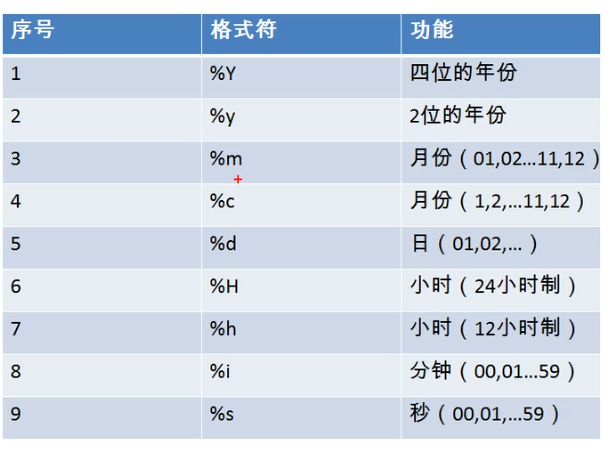

datediff( date1, date2 )

> `select datediff('2020-12-20','2020-12-10') as datediff;` 返回两个日期相差的天数


###### 其他函数

version()

> 返回 mysql 版本

database()

> 返回当前 use 的 database

user()

> 返回当前登录的用户


###### 流程控制函数

if(expr, expr1, expr2)

> `select if(10>5,'大','小');`expr 表达式返回的结果为true , 则返回 expr1 的结果, 否则返回 expr2 的结果

case 分支

> case 的 switch 用法
>
> ```mysql
> select 
> case 字段或表达式
> when 值 then 表达式或值
> when 值 then 表达式或值
> else 表达式或值(默认值)
> end as 别名(这个列名太长了建议使用别名)
> from 表名;
> ```
>
> case 的 多重if 用法
>
> ```mysql
> select
> case 
> when 条件 then 要显示的值或语句
> when 条件 then 要显示的值或语句
> else 要显示的值或语句
> end as 别名
> from 表名;
> ```
>
> 


分组函数部分

> 传入一组数据返回一个值

> 和分组函数一起查询的字段应当是 group by 后的字段, 比如 `select sum(field), field from table;` 只会返回一条数据, 这里单独查询的这个 field 就没有意义

----

###### 统计函数

sum()

> `select sum(field) from table;`
>
> 仅支持 数字型
>
> 忽略 null 值
>
> `select sum(distinct field) from table;` 先对该字段的值去重, 然后将结果 sum

avg()

> `select avg(field) from table`
>
> 仅支持 数字型
>
> 忽略 null 值, 且使用非 null 值的个数作为分母
>
> `select avg(distinct field) from table;` 先对该字段的值去重, 然后将结果 avg

max()

> `select max(field) from table`
>
> 支持 数字型, 字符型, 日期型 
>
> 忽略 null 值

min()

> `select min(field) from table`
>
> 支持 数字型, 字符型, 日期型
>
> 忽略 null 值

count(field)

> `select count(field) from table` 统计该字段不为 null 的个数
>
> 支持 数字型, 字符型, 日期型
>
> `select count(distinct field) from table;` 先对字段的值进行去重, 然后 count
>
> `select count(*) from table;` 统计表的记录个数, 使用所有列作为参照, 避免了 null 值不计数的影响
>
> `select count(1) from table;` 统计表的记录个数, 相当于先 select 1 from table, 然后获得的是与表记录数相同的全是1的一列, 再对该列进行 count , 同样能够避免 null 值时不计数的影响

> 效率问题:
>
> myisam 引擎下: count(*) 效率最高
>
> innodb 引擎下 : count(*) >= count(1) > count(field)


#### 多表查询

##### sql92语法

> sql92语法中连接查询使用逗号隔开多个目标表, 使用where子句设置连接条件
>
> sql92语法只支持内连接, 以下为内连接的不同使用方法

###### 等值连接

>  `select * from table,table where 连接条件;`  如果连接条件中涉及多个表中名称相同的字段, 使用 ***表名.字段*** 进行限定

> `select * from table as allen,table as allen where expression;` 可以为表起别名, 然后使用 ***别名.字段*** 对字段进行限定 ,
>
> 如果已经起了别名, 那么就无法再使用 原表名

###### 非等值连接

> 如果连接的匹配条件不是等值条件时则为非等值连接

###### 自连接

> 多次在同一张表中进行查询, 适用于 查询 员工及其上级 的情况

##### sql99语法

> sql99语法使用 `连接类型 join` 指定多表连接类型, 使用 `on` 设置连接条件, 连接条件和筛选条件分别使用不同的子句提高了可读性
>
> sql99语法相对于sql92语法支持更多种的连接方式
>
> `select fields from table1 allen1 连接类型 join table2 allen2 on 连接条件;`

###### 内连接

> `select fields from table1 allen1 [inner] join table2 allen2 on 连接条件; ` 内连接查询多表之间的交集部分, 功能同sql92规范中的多表查询

###### 左外连接

> `select fields from main_table allen1 left [outer] join table2 allen2 on 连接条件;` 
>
> 左外连接相当于将左边的表中数据全部保留, 在此基础上将匹配到的右边表的信息加到对应的记录中, 在右边表中未匹配到的记录则填充 null
>
> 左外连接中左边的表是主表

###### 右外连接

> `select fields from table allen1 right [outer] join main_table allen2 on 连接条件;`
>
> 右外连接右边的表是主表, 相当于保留右边表的所有记录
>
> 将左外连接的左右表交换则 等同于 交换前的右外连接

###### 全外连接

> `select fields from table1 allen1 full [outer] join table2 allen2 on 连接条件;`
>
> 全外连接相当于保留各个表中的所有记录, 为匹配的字段全部填充 null
>
> 全外连接 mysql 不支持, oracle 支持

###### 交叉连接

> `select fields from table1 allen1 cross table2 allen2 ;` 交叉连接就是笛卡尔积, 相当于没有连接条件的内连接


#### 子查询

> 一个 select 语句套在另外一个 select 语句中

select 子句可出现在 主 select 语句 中的位置:

* select 后面
* from 后面
* where 或 having 后面
* exists 后面

select 子句的分类:

* 标量子查询 : 查询结果为一行一列

  > 标量子查询的结果就相当于一个值, 一般用于条件判断

* 列子查询 : 查询结果为一列

  > 列子查询的结果就相当于一个相同类型的值集合, 一般用于 in , not in , any , some , all 后面

* 行子查询 : 查询结果为一行

  > 列子查询的结果相当于一条记录, 该记录包含多个不同类型的值, 一般用于条件判断
  >
  > `select * from table where (f1, f2)=( select f1,f2 from table )`
  >
  > 此时子查询返回的结果包含的字段应同与其进行比较的字段一一对应

* 表子查询 : 查询结果为一个表


#### 分页查询

> `select * from table limit offset, size;` offset设置起始条目的索引从0开始, size设置要显示的条目个数
>
> 如果不设置 offset , 则默认从第一条开始
>
> limit 子句在语句最后


#### union 查询

> `查询语句1  union  查询语句2;` 对多个查询语句的结果进行联合, 即取并集. 效果等同于多个查询条件同时使用 or.

> 如果需要同时对 多张表 进行查询 , 且多个查询都返回相同类型的多列数据时, 可以使用 union 查询来实现

> `查询语句1 union all 查询语句2;` 默认 union 查询会对多个表的查询结果进行去重, 可以使用 union all 查询保留重复数据


#### 类型

###### 整型

> 插入数据时如果溢出则置为临界值

```mysql
#不设置 unsigned 时, 默认为有符号
create table 表名(
	列名 int [unsigned], #(无符号)整型
  列名 int(长度) zerofill #这里设置的长度应当配合zerofill关键字使用, 为最终显示结果的长度, 如果数据未达到设置的长度, 则左零填充显示, 当设置了 zerofill 之后, 默认该字段为无符号
);
```

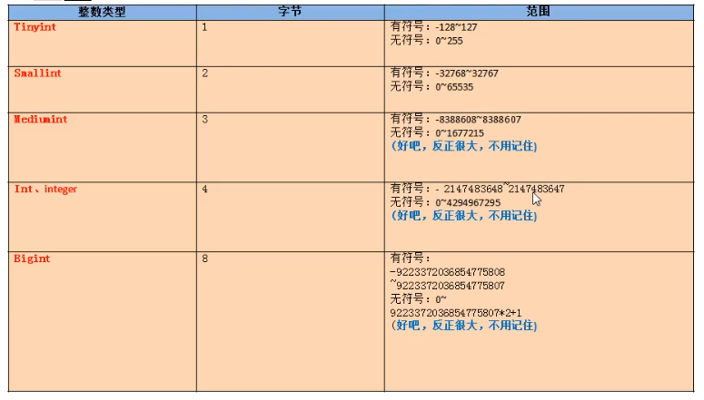

* tinyint	一个字节
* smallint    两个字节
* mediumint    三个字节
* int/integer    四个字节
* bigint    八个字节

###### 定点数( 高精度浮点数 )

> 精度较高的浮点数, 实际上范围和 double 一样

> dec 只是 decimal 的缩写

> m 为数字的总长度, d 为小数点后的长度, 下面浮点数同理

* dec( m, d ) 
* decimal( m , d )

###### 浮点数

* float( m, d ) 四个字节
* double( m, d ) 八个字节

###### 短文本

* char( m ) 固定m个字符的字符串, 即使数据不够长度也会占用对应长度的空间, 占用空间较大, 但是性能相对较高, 长度默认为1
* varchar( m ) 最多m个字符的可变字符串, 根据具体数据的长度来占用空间 , 长度设置不可省略

###### 长文本

###### 日期型

> 日期型的本质就是规定格式的字符串

> `show variables like 'time_zone';` 查询时区
>
> `set time_zone='+9:00';` 设置时区为东9区

* date 仅日期

* time 仅时间

* datetime 日期时间

  > 其实就是 `2020-12-12 12:12:12` 的字符串
  >
  > 日期范围为 1000 年 ~ 9999 年

* timestamp 时间戳

  > 其实就是 `20201212121212` 的字符串
  >
  > 当然插入数据的时候也可以使用 `2020-12-12 12:12:12`这样的格式
  >
  > 日期范围是 1970 年 ~ 2038 年
  >
  > 该类型会考虑时区的影响, 即如果先设置了时区为东9区, 此时系统时区为东8区, 此时使用 now() 对该字段进行插入, 那么会先获取系统时间, 然后根据系统时区和数据库时区的差别即东8区和东9区的差别对时间进行调整, 最后再执行插入

* year 仅年

###### 枚举型

* enum

  > 只能插入设置的值, 如果不在设置的值中且不能转换为设置的值的其中一个, 则报错

  ```mysql
  create table 表名(
  	列名 enum(val, val, val)
  );
  ```
  
  

###### set类型

> set 使用方式同 enum , 不同的是可以插入同时包含多个 set 集合值且以 逗号 分隔的字符串

```mysql
#设置set字段
create table etable(
	sf set('1','2','3')
);

#插入记录
insert into etable values('1'); #可以插入set中包含的单个值
insert into etable values('1,2'); #也可以插入set中包含的多个用逗号隔开后组成的字符串
```


#### 约束

> 设置组合主键 `constraint pk primary key (列名, 列名),`
>
> 设置组合唯一键 `constraint uq unique(列名, 列名),`

> `show variables like '%auto_increment%';` 查看关于自增长的系统设置
>
> `set auto_increment_increment=3;` 设置自增长的步长为 3 , mysql中不支持设置自增长的起始值, 但可以手动添加第一条记录的自增长列的值来实现自定义自增长起始值

列级约束

> 创建表时直接加在列定义后面的

```mysql
not null #非空, 默认可为空
default x #默认值
primary key #主键
unique #唯一, 可为空
auto_increment #自增, 一个表只能有一个自增列, 且该列应当有索引, 自增列的值类型应当是数值类型
#check(检查条件) #检查数据是否合法, mysql不支持
#references 关联表名(关联列名)#外键, mysql不支持
```

表级约束

> 创建表时统一使用 constraint 关键字定义在最后的

> 格式为 `[constraint 约束名] 约束类型(字段名);`

```mysql
create table student(
	id int,
  name varchar(20),
  gender char(1),
  seat int,
  age int,
  majorid int,
  
  #统一添加约束
  constraint pk primary key (id),
  constraint uq unique(seat),
  constraint fk_student_major foreign key(majorid) references major(id)
);
```


#### 视图

> 视图是虚拟的表, 数据库只保存视图的定义语句, 下次使用视图时 , 动态的根据定义语句生成虚拟表

> 使用视图可以仅返回给使用者部分字段和数据 , 提高数据的安全性

> 对视图的 数据修改 会使得 原表的数据 被修改

```mysql
#创建视图
create view 视图名
as 
查询语句;

#使用视图
select * from 视图名;

#视图修改
create or replace view 视图名
as 
查询语句;
#或
alter view 视图名
as
查询语句;

#删除视图
drop view 视图名,视图名...;

#查询视图结构
desc 视图名;
```


#### 变量

> `show global|[session] variables;` 查看全局/会话变量
>
> `show global|[session] variables like '%xxx%';` 查看满足匹配条件的系统/会话变量
>
> `select @@[global.]变量名;` 查看指定的[系统]变量
>
> `set global|[session] 变量名=值;`  设置全局/会话变量值
>
> `set @@global|[session].变量名=值;` 设置全局/会话变量值  

##### 系统变量

###### 全局变量

> 全局变量对所有会话生效, 但是服务重启后会失效

###### 会话变量

> 会话变量仅对当前会话生效

##### 自定义变量

###### 用户变量

> 仅对当前会话生效

> 类似于js不区分类型

```mysql
#声明并初始化
set @变量名=值;
#或
set @变量名:=值;
#或
select @变量名:=值;

#赋值, 同声明
set @变量名=值;
#或
set @变量名:=值;
#或
select @变量名:=值;
#或, 这里的字段应当是一个值
select 字段 into @变量名 from 表;

#查看变量值
select @变量名;

#使用变量, 使用变量时应当加上@
set @x=1;
set @y=2;
set @sum=@x+@y;
select @sum;
```

###### 局部变量

> 局部变量应当在 begin 和 end 块之间使用

> 强类型变量, 类型为字段支持的类型

```mysql
#声明
declare 变量名 类型;
declare 变量名 类型 default 值;

#赋值
set 变量名=值
set 变量名:=值
select @变量名:=值;
select 字段 into 变量名 from 表;

#使用
select 变量名;
```


#### 存储过程

> 提高代码重用性
>
> 减少连接服务器和编译语句的次数, 提高效率

###### 格式

```mysql
#设置语句结束标记, 使用此方式定义后, 语句应当使用该符号作为结束标记
#因为如果不设置自定义结束标记, 在录入存储过程中的语句时, 需要以分号结束, 那么会被认为输入结束, 从而提前结束存储过程的定义
#该定义仅在当前会话生效
delimiter $

#创建
#参数列表的构成: 参数模式 参数名 参数类型 
#参数模式: 
# in 该参数是输入参数
# out 该参数是返回值
# inout 该参数既需要传入值, 也作为返回值
#如果存储过程语句只有一句sql语句, 可以不写 begin 和 and 
#存储过程中的sql语句结尾必须加分号
create procedure 存储过程名(参数列表)
begin
	存储过程语句(sql语句)
end $

#调用存储过程
call 存储过程名(实参列表)$

#删除存储过程
drop procedure 存储过程名;

#查看存储过程信息
show create procedure 存储过程名;

#存储过程不能修改, 要修改就删了重建
```

###### 示例

带in参数的存储过程及其调用

1. 创建存储过程

   > 如果形参名和要查询的字段相同, 则在要查询的字段前面加上表名进行限定

   > 这个示例中使用到了局部变量的定义和使用, 同时使用到 if 函数对值进行判断

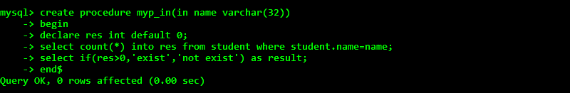

2. 调用该存储过程

   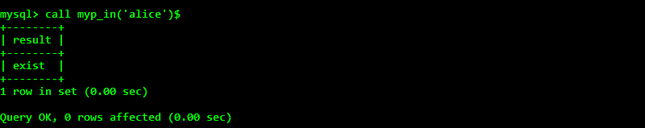

   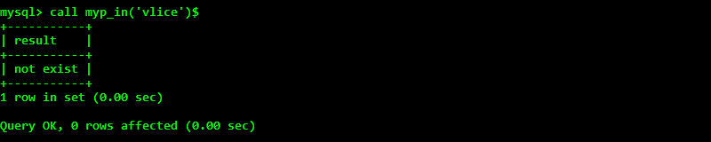

定义带out的存储过程并返回

1. 创建存储过程

   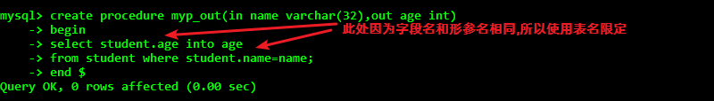

2. 定义变量接收存储过程的返回值

   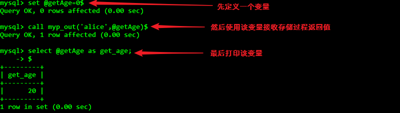

定义带inout参数的存储过程及调用

1. 定义存储过程

   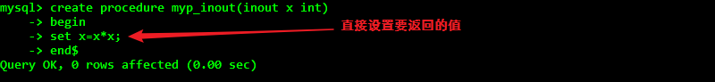

2. 定义变量传入存储过程并查看返回值

   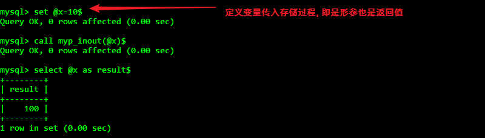


#### 函数

> 存储过程可以有 0 到多个返回值, 适合做批量插入和更新
>
> 函数有且仅有一个返回值, 适合做数据的处理

###### 格式

```mysql
#设置自定义结束标记
delimiter $

#创建函数
#参数列表: 参数名 参数类型
#函数体必须有 return 语句
#如果函数体只有一句, 可以省略 begin 和 end
create function 函数名(参数列表) returns 返回值类型
begin
	函数体
end $

#调用函数
#调用函数会打印函数语句中的所有打印, 并返回返回值
select 函数名(参数列表);

#查看函数定义
show create function 函数名;

#删除函数
drop function 函数名;
```

###### 示例

1. 创建函数

   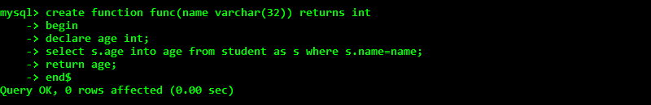

2. 调用函数

   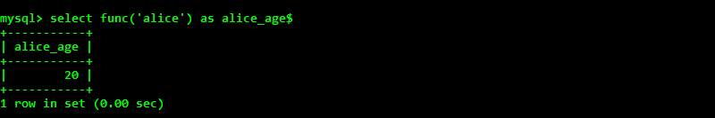


#### 流程控制

###### if函数

```mysql
#判断condition_, true则执行exp1并返回, false则执行exp2并返回
if(condition_, exp1, exp2)
```

###### if结构

```mysql
#只能用在 begin 和 end 中
if 条件 then expression;
elseif 条件 then expression;
else expression;
end if;
```

###### case结构

```mysql
#同之前的case结构
```

###### 循环

> 循环结构只能用于 begin 和 end 中 

> `iterate 循环标签名` 类似于 continue
>
> `leave 循环标签名` 类似于 break

```mysql
#while 循环
[标签:] while 循环条件 do
	循环体;
end while [标签];

#loop 循环
[标签:] loop
	循环体;
end loop [标签];

#repeat 循环, 类似于 do while
[标签:] repeat
	循环体;
until 结束循环的条件
end repeat [标签];
```


#### 触发器

> 触发器语句中自带 old 和 new 变量可直接使用, 这两个变量是整条记录, 通过 new.列名 来获取列值

```mysql
#创建触发器
create trigger trigger_name
before/after insert/update/delete
on table_name
[for each row] #行级触发器, 每当行数据发生变化时就会触发, mysql 只支持该类触发器, 所以在mysql中定义触发器必须加上该行
begin
	语句
end;

#查看触发器
show triggers;

#删除触发器
drop trigger trigger_name;
```


#### mysql日志

###### 错误日志

> `show variables like 'log_error%';` 查看错误日志存放位置

###### 二进制日志

> 二进制日志以二进制的形式存放数据操作过程中的 dml语句 和 ddl语句, 即所有对数据进行修改的记录, 在数据库出现问题时, 可根据二进制文件进行恢复, 在进行主从复制时, 也会使用二进制日志

二进制日志的格式

* STATEMENT 单纯存储dml语句和ddl语句, 但是如果语句中包含函数, 如now(), 那么就会造成主从不一致
* ROW  单纯存储变更的记录数据, 但是如果影响的行数很多, 那么就会验证影响主从复制的效率
* MIXED 默认模式, 语句中没有函数的时候记录语句, 包含函数时记录行数据, 但是如果包含系统变量, 又有可能导致主从不一致, 因为两边的系统变量可能不一致

开启二进制日志

> 二进制日志功能默认关闭, 需要手动修改 /usr/my.cnf( linux ) 配置文件来开启, 修改了配置文件之后要重启服务
>
> ```my.cnf
> #开启二进制日志, 并设置日志文件名称前缀为 mysqlbin
> log_bin=mysqlbin
> 
> #设置日志文件存储格式
> binlog_format=MIXED
> ```
>
> 

查看二进制日志文件

> 二进制日志文件默认存放在 mysql 的 数据目录下
>
> 先切换到 data 目录下, 然后 `mysqlbinlog [-vv] 日志文件名`, 如果是 row 格式存储的日志, 需要加上 -vv 参数

删除二进制日志文件

> 1. 先登录上 mysql , 然后执行 `Reset Master;` , 将会清除所有二进制日志文件
>
> 2. 先登录上 mysql , 然后执行 `purge master logs to 'mysqlbin.*******';`, 将会删除编号\*\*\*\*\*\*之前的所有二进制日志
>
> 3. 先登录上 mysql , 然后执行 `purge master logs before 'yyyy-mm-dd hh24:mi:ss';`, 将会删除指定时间之前的所有二进制日志
>
> 4. 在上述开启二进制日志的配置文件 my.cnf 中设置日志过期时间
>
>    ```my.cnf
>    #设置二进制日志过期时间为3天
>    --expire_logs_days=3
>    ```
>    
>    

###### 查询日志

> 记录所有操作的语句包含查询语句

开启

> 在 my.cnf 中配置
>
> ```my.cnf
> #设置开启, 1开启, 0关闭
> general_log=1
> #设置查询日志文件名, 不配置默认为host_name.log
> general_log_file=file_name
> ```
>
> 

查看查询日志

> 默认存储到 mysql 的数据目录下, 可直接打开查看

###### 慢查询日志

> 慢查询日志默认关闭
>
> 用 `show variables like '%slow_query_log%';`看看开了没
>
> 用 `show variables like 'long_query_time%';` 看看慢查询日志的时长标准

> 首先手动设置慢查询时长, 即当一个查询语句查询时间长于设置的时长时, 将会被认为是慢查询, 被计入慢查询日志
>
> ```my.cnf
> #开启慢查询日志, 1开启, 0关闭, 默认关闭
> slow_query_log=1
> #设置慢查询日志文件名
> slow_query_log_file=file_name.log
> #设置慢查询时长为10秒, 默认是10秒
> long_query_time=10
> ```
>
> 慢查询日志同样存储到 mysql 的数据目录下, 可直接打开查看


#### sql常用技巧

###### sql执行顺序

```mysql
#书写顺序
select distinct
from tableName
join tableName on joinExpression
where expression
group by filed
having groupExpression
order by DESC/ASC
limit n

#执行顺序
from tableName
on joinCondition
join joinTables
where Condition
group by fileds
having groupCondition
distinct
order by fileds
limit n
```

###### 正则查询

```mysql
select * from student where name regexp '正则表达式';
```


#### 数据库设计三大范式

*   每一列都不可再分, 比如详细地址最好分为省份和城市

*   每一列都应与主键相关

    比如订单表, 每个订单都有多个商品, 所以用订单号和商品号作为联合主键 

    此时如果在表中存商品信息就只跟 商品号 相关而不与 订单号 相关, 这就不符合规范

*   每一列都与主键直接相关

    比如在订单信息表, 主键为订单编号, 在其中存用户手机号就属于不符合这个规范
