#### mysql体系结构

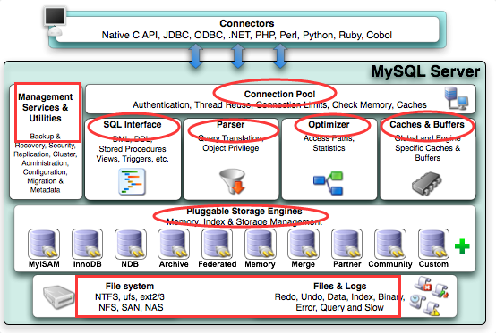

1. 连接层 , 负责与客户端建立TCP连接, 实现用户认证, 数据加密等功能
2. 服务层 , 负责将收到的 sql 语句中的视图, 触发器之类的转换为sql查询, 生成执行计划, 优化执行计划, 然后看看缓存里有没有结果
3. 引擎层 , 接收服务层传下来的执行计划, 然后根据自身的存储规则执行, 不同的存储引擎实际上区别就在于存储数据的结构不同, 然后对应读取数据的方式也不同.
4. 存储层, 就是指最终保存到磁盘上的文件, 引擎层程序从这里读取和保存数据


#### 存储引擎

<span style='color:cyan;'>mysql 5.5 及之后默认使用 innodb , 之前默认使用 myisam</span>

> ​	存储引擎是面向表的, 在同一个数据库中的不同表可以使用不同的存储引擎, 因此存储引擎又被称为 表类型
>
> ​	存储引擎其实就是如何管理数据的方式, mysql内置多种存储引擎, 可根据需求选择使用不同的存储引擎 , 同时存储引擎是插件式的, 可自行额外扩展

<span style='color:cyan;'>仅 innodb 支持事务</span>

```mysql
#查看存储引擎
show engines;

#指定表的存储引擎
create table table_name()engine=引擎名;
```

###### 存储引擎对比

* innodb 一张表对应两个文件, frm 表结构 , idb表数据和索引
* myisam 不支持事务外键, 因此效率比 innodb 高, 一张表对应三个文件, frm表结构, myi表索引, myd表数据，<span style='color:cyan;'>因为索引和数据分开文件存储，所以都是非聚簇索引</span>
* memory 数据存到内存中, 速度最快, 稳定性最差, 一张表对应一个文件 frm表结构, 为什么没人用, 因为出现的太晚了, nosql数据库已经盛行了
* merge 类型的表其实就相当多个 myisam 类型且数据结构完全相同的表的组合视图 , 因此 merge 表在定义时需要指定数据来自于哪些 myisam 表,  merge 表不存储数据, 数据还是来源于基表
* blackhole 表, 黑洞表, 不保存任何写入的数据, 适合做主备复制中的分发主库
* archive 表, 档案表, 只支持插入和查询, 即只能添加档案和查看档案, 不允许删除和修改, 适合记录日志和数据采集类应用
* csv 表, 普通的 excel 文件格式, 数据表保存的文件就是 csv 格式, 可以直接使用 excel 打开, 适合需要生成报表的项目, 项目处理逻辑中直接下载该文件即可

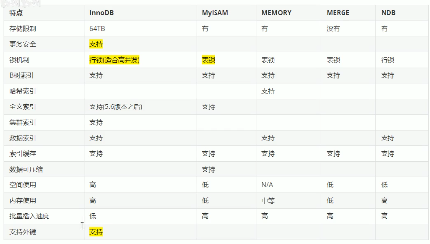

myisam和innodb对比

| 对比项                   | myisam                             | innodb                                   |
| ------------------------ | ---------------------------------- | ---------------------------------------- |
| 外键                     | 不支持                             | 支持(即使支持, 实际开发中也不会使用外键) |
| 事务                     | 不支持                             | 支持                                     |
| 锁                       | 表锁                               | 行锁, 适合高并发                         |
| 缓存                     | 只缓存索引, 不缓存真实数据         | 缓存整条数据                             |
| 特点                     | 高性能, 资源消耗少, 适合简单的业务 | 处理高并发, 支持事务, 资源消耗较大       |
| 是否默认安装             | 是                                 | 是                                       |
| 系统自带表是否使用该引擎 | 是                                 | 否                                       |


###### innodb读写数据原理

​		我们知道数据库的数据都是存放在磁盘中的，然而磁盘I/O的成本是很大的，如果每次读写数据都要访问磁盘，数据库的效率就会非常低。为了解决这个问题，InnoDB提供了 Buffer Pool 作为访问数据库数据的缓冲。

​		Buffer Pool 是位于内存的，包含了磁盘中部分数据页的映射

​		当需要读取数据时，InnoDB会首先尝试从Buffer  Pool中读取，读取不到的话就会从磁盘读取后放入Buffer Pool

​		当写入数据时，会先写入Buffer  Pool的页面，并把这样的页面标记为dirty，并放到专门的flush  list上，这些修改的数据页会在后续某个时刻被刷新到磁盘中（这一过程称为刷脏，由其他后台线程负责） 

​		这样设计的好处是可以把大量的磁盘I/O转成内存读写，并且把对一个页面的多次修改merge成一次I/O操作（刷脏一次刷入整个页面），避免每次读写操作都访问磁盘，从而大大提升了数据库的性能

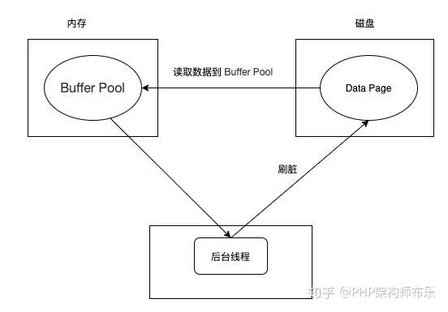

#### redolog数据持久化

>   ​		也就是说，在用户执行了submit并收到成功的返回后，之前所做的修改应当都能够保存到数据库中

###### redolog

​		通过前面的介绍，我们知道InnoDB使用 Buffer Pool 来提高读写的性能。但是 Buffer Pool  是在内存的，是易失性的，如果一个事务提交了事务后，MySQL突然宕机，且此时Buffer  Pool中修改的数据还没有刷新到磁盘中的话，就会导致数据的丢失，事务的持久性就无法保证。

​		为了解决这个问题，InnoDB引入了  redo log 来实现数据修改的持久化。当数据修改时，InnoDB除了修改Buffer Pool中的数据，还会在redo log  记录这次操作，并保证redo  log早于对应的页面落盘（一般在事务提交的时候），也就是常说的WAL。若MySQL突然宕机了且还没有把数据刷回磁盘，重启后，MySQL会通过已经写入磁盘的redo log来恢复没有被刷新到磁盘的数据页。

<span style='color:cyan;'>实现原理：redo log</span>

​		为了提高性能，和数据页类似，redo log 也包括两部分：一是内存中的日志缓冲(redo  log buffer)，该部分日志是易失性的；二是磁盘上的重做日志文件(redo log file)，该部分日志是持久的。redo  log是物理日志，记录的是数据库中物理页的情况 。

​		当数据发生修改时，InnoDB不仅会修改Buffer  Pool中的数据，也会在redo log buffer记录这次操作；当事务提交时，会对redo log buffer进行刷盘，记录到redo  log file中。如果MySQL宕机，重启时可以读取redo log  file中的数据，对数据库进行恢复。这样就不需要每次提交事务都实时进行刷脏了。

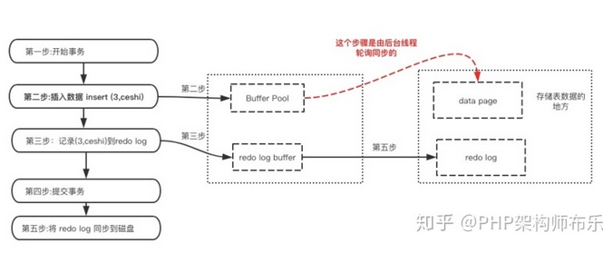

注意点：

-    写数据的过程：Buffer Pool -> redo log buffer -> redo log 

    ​		(其中 buffer pool落盘由单独的线程在随机时间完成)

-   redo日志比数据页先写回磁盘：事务提交的时候，会把redo log buffer写入redo log file，写入成功才算提交成功，而Buffer Pool的数据由后台线程在后续某个时刻写入磁盘。

-   刷脏的时候一定会保证对应的redo log已经落盘了，也即是所谓的WAL（预写式日志），否则会有数据丢失的可能性。


<span style='color:cyan;'>综上所述，innodb在执行dml时的步骤为</span>

1.  写 buffer pool
2.  写 redo log buffer
3.  待到用户 submit
4.  写 redo log buffer(内存) 到 redo log(硬盘)
5.  上一步成功submit调用则返回ok，否则返回失败，意思就是必须等到 redo log 记录完毕才算成功
6.  此时用户收到的反馈是所做修改已经保存，哪怕此时系统崩溃，硬盘上也保存了redo log， 待到下次 mysql 重启时，会先检查是否有需要 redo 的内容，有则 redo 这些内容，保证了数据的持久性


###### 二段提交

​		如果数据库同时开启了 binlog，那么显然需要保证 binlog 和 redolog 中的记录是一致的，所以此时就需要在commit给出ok前，把binlog和redolog都落盘，才算成功

​		考虑到可能会在写redolog和binlog两个步骤中间断电，那么就redolog 中记录状态，如果对应的binlog未保存成功，那么状态为 ***prepare***，意思就是该状态的redolog是无效的，如果对应的binlog已经保存成功，那么状态为 ***commit***，意思就是对应的binlog也保存成功，此记录有效

​		这里保证两种日志都保存成功的机制就是二段提交


#### <span style="color:cyan;">索引</span>

>   主键, 外键, 唯一键 自动生成索引

**适合建立索引的情况**

*   适合数据量大且查多改少的表
*   适合经常出现在where子句中的字段
*   需要 <span style='color:cyan;'>统计</span> 的字段建立索引，比如 count(), max()
*   需要 <span style='color:cyan;'>排序</span> 的字段建立索引，因为索引树自带排序功能
*   需要 <span style='color:cyan;'>分组</span> 的字段建立索引，因为要分组，得先排序，排序能用上索引会快很多

**不适合建立索引**

*   该字段频繁被修改，那么索引也要频跟着修改，不适合
*   该字段没有区分度，比如性别，真假
*   参与列运算的字段不适合，因为列运算使得索引失效

**tips**

> 在mysql 中, 所有库中所有表的索引都存放在 information_scheme 库中的 statistics 表中

###### 本质

索引的本质是使用树节点存放数据的结构，数据是 key-value 结构，key为建立索引的字段的值，<span style='color:cyan;'>value为其他列的所有值</span> 或 <span style='color:cyan;'>该行记录的id值</span>

索引也是表，存储到硬盘上，在加载数据时优先于原表加载到内存中


###### 索引操作

```mysql
#创建索引
create index index_name [using index_type] on 表名(列名[,列名...]);

#查看索引
#\G格式化输出结果
show index from 表名\G;

#删除索引
drop index index_name on 表名;
```


###### 聚簇索引和非聚簇索引

**聚簇索引**

*   默认的自增主键上的是聚簇索引, 因为主键是严格递增的, 且其索引值也是严格递增的, 此时记录的存放顺序就等同于索引的顺序
*   本质上就是树节点中 value 存放该行记录的所有其他值

**非聚簇索引**

*   数据的存放顺序一般不等同于索引的顺序, 比如对 字符串类型的 name 字段建立索引, 此时就需要按照 name 字段中字母的顺序建立索引, 索引的顺序应当类似于 abcde 这样 , 而实际的记录的排列顺序肯定不会是按照 name 字母的严格递增顺序排列 , 比如会出现 blice 在 alice 前面的情况 
*   本质就是 value 存储的是对应记录的 id 值

###### 回表

​		非聚簇索引中不存放该条记录的所有列值，那么使用到该索引且需要查询其他列的值时，需要根据该索引查得的 id 值，再去对应的 id 索引中查询其他列的值，这种第二次查询的索引的情况就是回表，显然，应当避免回表的情况，二次的查询会降低查询效率

###### 索引覆盖

​		但是，如果只需要查询id值或者有索引的该列值，那么就不需要第二次查询 id 索引树，比如 name 字段有索引，然后 `select id,name from user where name = 'alice'`，此时因为 where 中用到 name 字段，那么仅仅使用 name 索引就够了，因为它已经包含了 id 和 name 值

​		根据这个特点，可以考虑将 select 要查询的字段全部建立起组合索引，那么该索引树中就会包含要查询的所有列的值，此时不需要第二次回表就可以查询到所有所需的值，提高了查询效率

###### 索引下推

`select * from user where name='alice' and age=21;`

​		在mysql服务中，分为 service 层和引擎层，service 层就是常规意义上的服务层，用来写接口的业务逻辑

​		对于上面的请求，常规情况下，会根据 `name='alice'` 从引擎层获取筛选数据，然后在 service 层中对数据根据 age 属性值进行筛选，那么此时的响应速度就会比较慢

​		数据库默认开启索引下推，也就是直接在引擎层就根据 name 和 age 筛选完进行返回，那么就无需在 service 层中再进行筛选，直接就可以返回，那么就提高了查询效率

###### mysql索引特性

> 默认为主键, 唯一键创建索引, 默认自增的主键创建聚簇索引

###### 数据结构

> 索引是在存储引擎中实现的, 不同的存储引擎对索引的支持不同:
>
> 默认的存储引擎是 innodb, 其使用的默认索引是 B+tree 优化索引

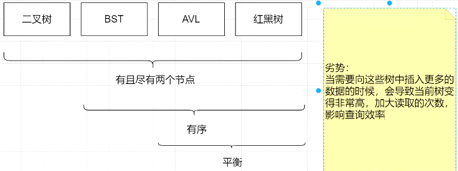

二叉树

> 使用二叉树将该列数据进行额外存储, 当对某元素进行搜索时, 对该二叉树遍历, 因为二叉树左子树小于根节点, 右子树大于根节点的特征, 能够提高搜索效率
>
> 但是如果该列数据单调递增或递减, 那么二叉树结构就会退化成链表结构, 无法实现效率的提升

平衡二叉树(BST)

> 因为二叉树退化为链表时影响查询效率, 将节点数据构造为平衡二叉树可避免这种情况
>
> 平衡二叉树指任何节点的两个子树的高度差最大为1

B树

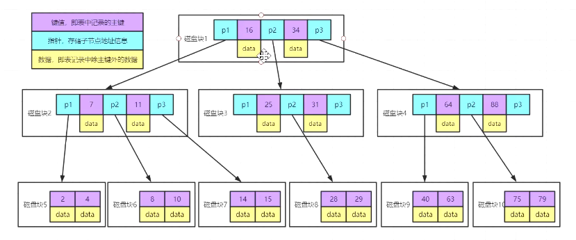

> balance-tree, 其实就是n叉平衡树结构, 一个节点保存至多n-1个值
>
> btree结构比二叉树结构深度较浅, 对于同样的数据查询能提高较二叉树好的效率
>
> b树中一个节点就是一个磁盘块, 节点上存储对应个数的数据库记录 和 子节点的指针, 磁盘块的大小是固定的, 所以如果记录条数较多, 那么b树的结构依然会很深


<span style='color:cyan;'>B+树</span>

>   B+树，叶子节点会冗余存储所有非叶子节点的数据

图中，绿色的是key的值，那么显然，key占用的空间越小，一个磁盘块就能存放更多的节点，那么同样深度的树就能存更多条记录，那么，在选择 key 时，应当尽量使其较小

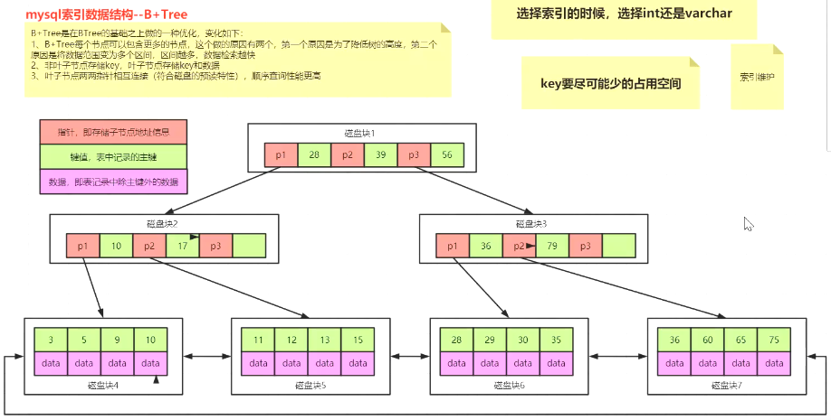

​	对于b树中依然会出现的树结构很深的问题

​	b+树不同的是各个父节点只存储当前记录的索引列的值 和 其子节点的地址, 而不存储记录的其他列数据, 将所有数据分段存储到最子级叶节点上

​	其实就相当于分段排好序的数组, 这样使得每个父节点能够存储的记录的数量就大大增加, 使得即使很浅的树结构也能存储大量数据

​	b+树的优点在于能够极大地减少树的深度，同时由于实际的记录数据存储在叶子节点上，所有的数据查询最终都要来到叶子节点，这就使得每次查询要走的路径长度是相同的，也就是查询效率稳定

<span style='color:cyan;'>innodb中使用三层B+树</span>

​		innodb默认使用 b+树, 深度为3的b+树就能存储 2kw条数据

​		一个节点是16k（innodb中的最小存储单位），非叶子节点只存索引值和指针，假设索引使用bigint（8字节），指针使用int6（6字节）

​		那么一个非叶子节点可以存放 `16*1024/(8+6)=1170` 个值

​		叶子节点存放具体的记录，假设一条记录大小1字节，那么一个叶子节点可以存放`16/1=16` 条记录

​		innodb中使用的b+树都是深度为3,那么总共可以存放 `1170 * 1170 * 16 = 21902400`（2kw）条数据


<span style='color:cyan;'>innodb中的B+优化树</span>

>   B+树中叶子节点链表是双向链表

​		innodb 使用优化的 b+tree , 就是在各个最子级叶节点中最后一个数据加上了下一个分段第一个元素的地址 , 就相当于元素为数组的链表, 为的是跨多个最子级叶节点的范围查询时能够效率高些


###### 前缀索引

​		如果要建立的索引的字段本身大小很大，比如 varchar(20)，占用20个字节，那么就会导致索引树存储能力下降，此时可以考虑截取该字段值的某一段前缀来建立索引，具体应当根据实际情况分析，当截取前边多少位时，能够获取较高的差异，那么就按照该位数来取前缀，建立索引

`select count(*) as c,name from user group by name order by c desc limit 10; `


###### 复合索引

> 可以同时为多个字段创建复合索引, 在查询时符合最左匹配原则, 即如果创建复合索引的字段顺序为 abc, 那么在查询时条件为 a, ab, abc 的都会使用到该索引, 但是 bc, c 的条件就不会使用到该索引, 且如果 条件为 ac , 那么使用到索引的仅为 a 字段.

复合索引结构

> 复合索引按照索引字段顺序依次建立连接的平衡树, 上一层树的子节点为下层数的根节点. 总体结构类似于 rpg 游戏中的技能系统, 法术->火系->火球术 , 每一个大的分支都是一颗子树. 这就是为什么筛选条件必须包含最顶级字段, 因为必须要从最顶级字段才能进入该树.


###### explain

`explain sql语句` 显示sql语句执行计划

<span style="color:cyan;">cyan颜色</span>字段代表需要关注的字段

| 执行计划字段                             | 情况                                                  | 描述                                                         |
| ---------------------------------------- | ----------------------------------------------------- | ------------------------------------------------------------ |
| <span style="color:cyan;">id</span>      | -                                                     | id相同的从上至下执行, id不同的从大到小执行, 一个数字代表一个独立的查询, 数字相同的视为同一趟查询, 子查询会增加独立的查询个数, 应当尽量避免子查询 |
| select_type                              | simple                                                | 简单查询, 数据仅来自于一个表, 不包含子查询或union查询        |
|                                          | primary                                               | 在包含子查询的sql中, 最外层的查询                            |
|                                          | derived                                               | from 后面的子查询, 会生成临时衍生表                          |
|                                          | subquery                                              | select 和 where 后面的子查询                                 |
|                                          | dependent subquery                                    | 查询结果作为父查询中 in 后面数据的子查询                     |
|                                          | uncacheable subquery                                  | 不可用缓存的子查询 , 即用到了变量的子查询                    |
|                                          | union                                                 | union查询中第二个查询语句                                    |
|                                          | union result                                          | 从多个union查询中获取最终union结果的查询过程                 |
| table                                    | -                                                     | 该查询的来源表                                               |
| <span style="color:cyan;">type</span>    | - ( 下列情况颜色越红, 性能越差, 越需要优化 )          | 查询类型, 应当至少建立索引优化到橙色情况                     |
|                                          | <span style="color:#ff4a4a;">all</span>               | <span style="color:#ff4a4a;">全表扫描, 性能最低, 亟需建索引</span> |
|                                          | <span style="color:orange;">index</span>              | 引用了索引但是没有使用索引进行筛选, 没能发挥出索引的作用, 需要对索引进行调整 |
|                                          | <span style="color:orange;">range</span>              | 使用到了范围查询                                             |
|                                          | system                                                | 查询的表里只有一行数据的查询                                 |
|                                          | const                                                 | 查询结果只有一条记录的查询                                   |
|                                          | eq_ref                                                | 使用唯一索引作为筛选条件的查询                               |
|                                          | ref                                                   | 使用非唯一索引作为筛选条件的查询                             |
|                                          | index_merge                                           | 在查询过程中使用了多个索引, 一般出现在包含 or 的查询中       |
|                                          | ref_or_null                                           | 查询过程中使用了 or , 且其中一种情况包含了xxx is null 的判断 |
|                                          | index_subquery                                        | 在子查询中使用了 索引 作为筛选条件                           |
|                                          | unique_subquery                                       | 在子查询中使用了 唯一索引 作为筛选条件                       |
| possible_keys                            | 索引名                                                | 可能会用到的索引 , 列出所有可能被使用到的索引                |
| key                                      | 索引名                                                | 实际被使用到的索引, 没用到索引时为 null                      |
| <span style="color:cyan;">key_len</span> | 值                                                    | 使用到的索引的长度, 该值越大越好, 使用到复合索引时, 不同情况下命中索引的长度会不同 |
| <span style="color:cyan;">rows</span>    | 实际扫描的表记录的行数                                | 扫描的行数越少越好                                           |
| <span style="color:cyan;">extra</span>   | 额外信息, 红色代表亟需优化                            | 该列显示不适合在其他列显示但内容十分重要的信息               |
|                                          | <span style="color:#ff4a4a;">using filesort</span>    | <span style="color:#ff4a4a;">order by 的字段没用到索引, 直接生猛地按照值排序, 此时性能低的令人发指, 应当在 order by的字段上建立索引</span> |
|                                          | <span style="color:#ff4a4a;">using temporary</span>   | <span style="color:#ff4a4a;">group by的字段没用到索引, 因为group by 内部会自动调用 order by , 所以该情况同上一种情况</span> |
|                                          | <span style="color:#ff4a4a;">using join buffer</span> | <span style="color:#ff4a4a;">使用了join连接, 但是连接字段没用上索引, 此时应当在连接字段建立索引. 如果是外连接, 那么应当在被连接的表相应字段上建立索引; 如果是内连接, 那么随便哪个表上对应字段建立索引 , mysql 会根据是否有索引来决定哪个表是被连接表</span> |
|                                          | impossible_where                                      | 瞎几把扯的 where 条件, 压根就不能匹配任何数据                |
|                                          | using index                                           | 用上了索引, 索引覆盖                                         |
|                                          | using index condition                                 | 用到了索引，索引下推                                         |
|                                          | using where                                           | where条件用上了索引                                          |
|                                          | select tables optimized away                          | 用到了内置的优化查询方式, 例如myisam中 count(*) 实际上是直接去事先存好的count表中查询 |


###### 索引优化策略

<span style="color:#69d;">关于单表查询</span>

* <span style="color:#ff4a4a;">范围查询</span>导致复合索引部分失效

  复合索引中, 如果某个索引的中字段被作为范围查询的条件, 那么该在该复合索引中该字段之后的字段索引都会失效, 例如建立 abc 的符合索引, 然后查询中使用 b 作为范围筛选条件, 那么该索引生效的部分仅为 ab , 因此如果某个字段可能作为范围查询字段 , <span style='color:cyan;'>在建立复合索引时应放到最后, 例如 金额, 时间</span>

* 筛选条件出现 <span style="color:#ff4a4a;">!=</span> 时, 涉及字段的索引失效

* 筛选条件出现 <span style="color:#ff4a4a;">is not null</span> 时, 涉及字段的索引失效

* <span style="color:#ff4a4a;">like 条件中 第一个字符不能确定时</span>, 涉及的索引失效, 例如 匹配值为 %a%

* <span style="color:#ff4a4a;">对索引列的任何操作</span>都会使索引失效, 例如 类型转换, 计算, 使用函数

  当出现需要 mysql 进行类型自动转换的时候, 索引失效. 例如 字段类型为 varchar , 而在sql给出的匹配值为 int 类型, 那么此时就需要 mysql 进行自动类型转换, 此时该字段上的索引就失效. `select * from table where name=123;`

<span style="color:#69d;">关于多表查询</span>

* 连接查询时, 应当保证被连接的表 (也就是 left join 中右边的表) 的连接字段被索引
* 连接查询时, 应当尽量保证发起连接的表 ( 也就是 left join 中左边的表 ) 是数据量相对较少的表, 因为该表不可避免地会进行全表扫描
* 连接查询时, 如果使用的是 inner join , 那么参与连接的两个表就随便哪个表的连接字段建立索引, 因为 mysql 会自动选用有索引的表作为被连接表
* 查询需要涉及多个表时, 尽量不要使用子查询, 要使用连接查询, 因为子查询会生成一条独立的查询, 极大的拖慢查询速度

<span style="color:#69d;">关于 order by</span>

> 为什么 order by 能够使用索引?
>
> 索引本身就是平衡n叉树结构, 从左到右自带排序属性 , 因此如果对一个有索引的字段进行 order by , 只需要 左序遍历或右序遍历 即可得到正确的排序结果, 无需使用其他算法单独对数据进行排序.

* <span style="color:#ff4a4a;">无过滤, 不索引</span> , 如果sql语句中没有 <span style='color:cyan;'>where 条件或者 limit 限制</span>, 直接使用 order by , 那么即使 order by 的字段有索引, 也不会使用. 例如, sql 语句为 where a order by b , 此时有复合索引 ab, sql 中对字段的使用顺序同复合索引顺序, 那么该索引会全部生效.
* <span style="color:#ff4a4a;">顺序错, 必排序</span> , 如果对多个字段 order by , 只要它们的顺序不同于存在的复合索引顺序, 就不能完全使用索引, 从顺序开始不匹配的字段开始, 就会 using filesort
* <span style="color:#ff4a4a;">方向反, 必排序</span> , 如果对多个字段进行不同方向 order by , 例如 order by a desc , b asc , 那么索引就会失效

* 如果避免不了 using filesort , 可以适当调整分配给 mysql 的内存, 进而使用 <span style="color:cyan;">单路排序方法</span> . 

  单路排序即首先得有足够放下所有 order by 记录的内存大小, 然后按照排序需求比如从小到大依次从数据库中读取对应记录, 然后依次存放到连续内存中, 最后直接从该段内存中取记录即为排序完成的记录. 

  mysql默认使用 <span style="color:cyan;">双路排序方法</span> , 双路排序方法即先把所有待排序的记录取到内存, 然后再使用排序算法对这些记录进行排序

  因为 单路排序方法 较 双路排序方法 需要更多的内存, 所以 mysql 会默认使用双路方法

<span style="color:#69d;">关于 group by</span>

* group by 的优化手段完全同 order by , 因为 group by 时会先执行一次 order by
* 不同的是, group by 在即使没有 where过滤条件 的情况下, 也可以用上索引

<span style="color:#69d;">关于 limit</span>

* 在使用 limit 查询分页数据时, 如果数据量很大, 那么 limit 查询的起始值就会很大, 如果此时还是 select * , 那么会严重影响查询效率

  因为数据库底层是先查询前 limit 条数据，然后丢弃，再往下数 n 条数据来返回，所以 limit 的起始位置直接决定了查询速度
  
  对于这种情况, 可以先查出对应记录数据的 id ,然后根据 id 查询记录的其他字段, 因为第一步中仅查询有索引的 id 字段, 所以在查询时会走索引, 能够大幅提高查询效率
  
  简而言之
  
  `where id>n limit m`

<span style="color:#69d;">关于可能同时存在多个筛选条件的不同组合</span>

* 如果查询时可能包含多个不同条件的不同组合情况, 比如常规的表格加筛选条件的页面, 此时如果有筛选条件就不会走索引进行查询

  对于该类页面关联的数据表, 建议按照各个字段挨个建立复合索引, 为的是在使用不同的条件组合进行筛选时, 都能走索引从而提高效率

  比如有四个查询条件 ABCD, 就建立四个复合索引, 分别是 ABCD, BCDA, CDAB, DABC

<span style="color:#69d;">如果实在用不上索引</span>

* 如果实在无法在筛选条件及上述子句中用上索引, 可以考虑 先 selec id , 然后根据 id 查询记录, 思路同 limit 优化, 不要 select * , 不要 select * , 不要 select *


###### 索引失效

*   当查询数据量大于总数据量20%时，数据库自动不再使用索引，改为全表扫描

    因为数据量覆盖范围太大，索引已经没有意义，还不如直接全表扫描来的快，比如只有性别字段，只有男女值，那么此时即使建立索引它也大概率不会使用索引

*   模糊查询时，如果第一个位置不能确定，索引失效

*   or 前后没有同时使用索引时，索引失效

*   最左匹配原则，组合索引必须从左到右作为条件筛选，从开始没有作为条件的位置起，索引不再生效

*   字符串类型的列作为条件进行筛选时，一定要加上双引号，否则会自动类型转换为整型而使得索引失效，相当于使用了函数，然后导致索引失效

    如varchar不加单引号的话可能会自动转换为int型，使索引无效，产生全表扫描。

*   使用 != 或者 not 或者 <> 时，索引失效

    如果是数字类型，可以 `val1<key or val1>key`，这样能用上索引

*   对索引字段的任何操作都会使得索引失效


###### 索引指南

假设 `表 user` 中 `字段 age` 有索引

*   有索引的字段单纯地出现在 select 后面时 或者 有索引的字段同时出现在 where 后时, 索引生效（索引覆盖）

    `select age from user;`

    `select age from user where age=20;`

    也就是上面两种，索引age都会生效

*   建立复合索引时，应该考虑到最左匹配原则，将最频繁查询的字段放到最左边，并且该列值的多样性越高，那么索引效果越好

*   建立复合索引 (c1,c2,c3) , 就相当于建立了三个索引 (c1), (c1,c2), (c1,c2,c3)


#### 查询截取分析

​	上述针对使用索引的优化手段能够提高查询效率, 但是实际生产中, 肯定不会对所有的查询 sql 进行优化 , 而是对查询频率最高的最影响效率的sql进行优化, 即优化 20% 的 sql , 覆盖 80% 的功能.

<span style='color:cyan;'>profile工具</span>

1.  `select @@have_profiling;` 查看当前数据库是否支持profile工具
2.  `set profiling=1;` 设置开启profiling, 只对当前会话有效
3.  `select @@profiling;` 查看profiling是否是开启状态
4.  `show profile;` 查看前面执行的一条语句的各个阶段具体耗时情况
5.  `show profiles;` 查看之前执行的各语句的耗时情况
6.  `show profile for query 查询id;` 查看某一语句执行时具体各个阶段的耗时情况

`show [global] status like 'Com_______';` 查看 [所有库的 / 当前库的] 各种语句的执行频次 (七个下划线进行模糊匹配)

`show [global] status like 'Innodb_rows_%';` 查看 innodb 类型表的各种语句的执行频次

`show processlist;` 查看当前所有连接的客户端

`explain sql语句;` 查看该sql语句的执行计划 , 即执行步骤

`show global status like 'Handler_read%';` 查看 会话/全局 索引使用情况

<span style="color:#69d;">通过慢查询日志</span>

> ​	一般的生产环境慢查询日志功能是关闭的, 只有在系统性能明显出现下降时, 开启一段时间慢查询日志, 记录下期间的慢查询sql, 然后针对这些 sql 进行优化

> ​	一般情况下生成的慢查询日志数量巨大, 仅靠人为分析是不现实的 , 此时应当借助其他分析工具, mysql 自带 mysqldumpslow 工具来分析慢查询日志, 使用该工具可查看 最慢的 查询次数最多的 sql 


#### 并发控制

###### 当前读和快照读

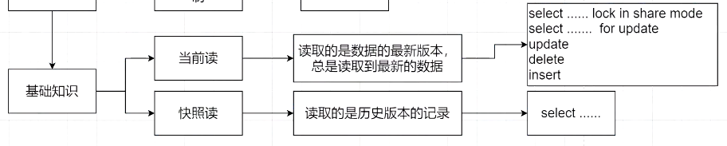

###### MVCC

多版本并发控制，实现隔离性质

提供不同版本的数据日志，在多个线程读写数据时，提高读写效率

使用 undo log日志文件来进行事务之间的隔离性，也就是实现不同的可见级别

通过三个机制实现MVCC机制

首先在数据表中，默认存在三个用户不可见的隐藏字段

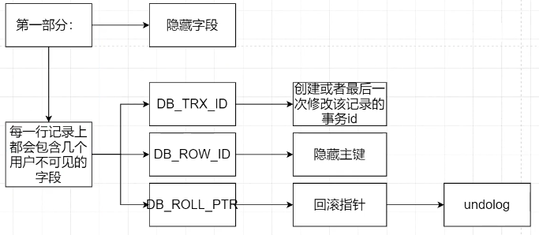

然后每次在事务中修改数据后，会生成一条 undo log日志记录，undo log 记录是链表的形式，形成记录链，可以用于后续的回滚操作，定位到某个历史记录

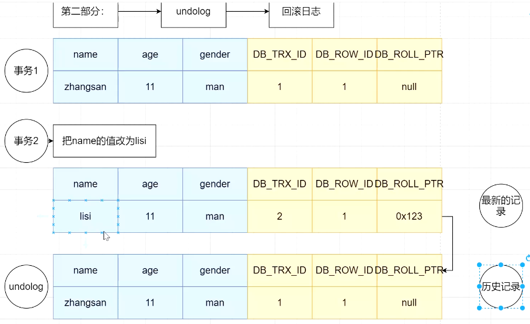

最后是 read view读视图，在事务中使用 select 进行读取操作时，会生成快照读视图文件，后续根据版本号（可见性算法）来判断当前 read view 中能够读取到的记录，来实现事务的隔离不同级别

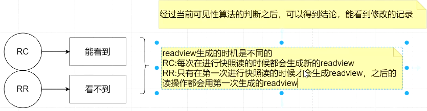

简单来说，就是看 select 的时间，如果已经在之前已经生成了读快照，那么就直接使用之前的读快照，如果之前没有，那么使用当前时点数据生成读快照，如果是写操作，那么直接修改真实数据(此时读快照中可能是旧的数据跟实际数据不同，实际数据已经被插入了新的数据)，并且按照修改后的数据生成新的读快照，那么在本次事务中，下一次读快照时，读取到的是新的读快照，就会发现跟前一次的数据量不同，这就是产生了幻读

所以总结来说，产生幻读的原因在于，在同一个事务中，先后使用了 ***当前读*** 和 ***可见读***

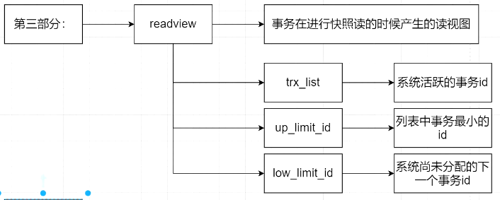


###### [间隙锁机制](https://www.cnblogs.com/howo/p/13282115.html)

mysql中，间隙锁机制的引入为了解决 RR(Repeatable Read) 隔离级别下的幻读问题

>   总结来说，产生幻读的原因在于，在同一个事务中，先后使用了 ***当前读*** 和 ***可见读***

第一次查询时使用 `for update` 给该表加上意向锁，那么其他事务在意向锁存在期间，如果 insert，会进入阻塞等待

`select * from user for update;`

这样其他事务都不能插入新的数据了，那么该事务就不会产生幻读了

***间隙锁生效的前提是要查询的条件属性有索引***

为了防止在同一个事务中前后两次 select  查询的结果不同（幻读），需要加锁限制第一次被查询的结果不能被其他事务修改

如果只在查询记录上加锁，那么无法阻止其他事务将其他记录 update 等于本记录，也无法阻止 insert 新的符合查询条件的记录

既然每次新加入数据都要对应加入索引，那么如果锁定了要查询的条件值前后的两个索引值的next指针，就能使得 insert 或者 update 对应记录时获取不到锁而阻塞，这样就避免了其他事务修改了第一个事务查询的结果

所以，间隙锁通过锁定查询值前后的范围来避免出现幻读，这意味着在间隙锁存在期间，查询值前后两个区间内的记录不能被修改，这也在一定程度上加大了加锁力度，降低了并发

例子

表 `user(id,name,age)`，`id主键索引`

存在数据 `(1,alice,20)` , `(3,blice,20)` , `(5,clice,20)`

那么存在间隙 `(-无穷,1], (1,3], (3,5], (5,+无穷]`

使用 `select * from user where id=x for update;` 来使用间隙锁机制

如果 x 的值在记录中存在，比如 x=3, 那么结果就 `只会产生行锁`，因为主键索引意味着值唯一，insert 或者 update 的记录会首先检查唯一性，如果不唯一直接失败，所以只需要锁定 x=3 这一行即可保证不会出现幻读

如果 x 的值在记录中不存在，比如 x = 2，那么结果就是 `会产生间隙锁`，锁定了 (1,3] 这个区间，在此期间其他 insert 或 update 中 id 与该区间相关的操作都无法执行

如果查询的列不是唯一索引而是 `普通索引`，那么无法保证其唯一性，在 x= 存在的值时，为了方式 insert 或者 update 的记录等于当前记录，所以需要同时锁定该记录左右两个区间

如果查询的列不存在索引，那么没有相关的索引表给它用来间隙锁定，就只能锁定全表，也就是 `间隙锁升级为表锁` , 这是很糟糕的情况要避免


#### 并发参数调整

* max_connections 最大连接数, 默认是151

  `show variables like 'max_connections'; ` 查看该参数的值

* back_log 最大积压连接数, 当达到最大连接数时, 会将连接暂存到 back_log 积压队列中, 如果积压队列也满了, 那么再连接会直接报错

  `show variables like 'back_log';` 查看该参数的值, 默认是 80

* table_open_cache 最大表缓存数量, 每查询一个表, 就需要打开一个表缓存, 该值应当是 `最大连接数*最多同时查询表的个数`

  `show variables like 'table_open_cache';`

* thread_cache_size 线程池数量, mysql服务端会缓存一些线程以备查询, 默认9个

  `show variables like 'thread_cache_size';`

* innodb_lock_wait_timeout 行锁的超时等待时间, 如果一个连接来查询时没有得到锁且等待该时间之后仍然得不到锁,就会返回给客户端错误, 默认50ms, 在需要快速响应的系统中该值应当设定的小一些

  `show variables like 'innodb_lock_wait_timeout';`
  
* 如果出现死锁, 可以先查看当前所有的连接, 然后定位造成死锁的连接, 将其关闭

  `show processlist;` 查看当前数据库开启的所有连接

  `kill 进程id;` 关闭连接, 进程id为上一步中查出来的id


#### 主从复制

> 主从复制中从机是从接入时间点开始读主机新增的日志, 接入时间点之前的日志从机都不会复制, 因此不要在从机接入之前就把要复制的库创建, 否则从机上没有该库也不会创建该库,在之后插入数据时会报错

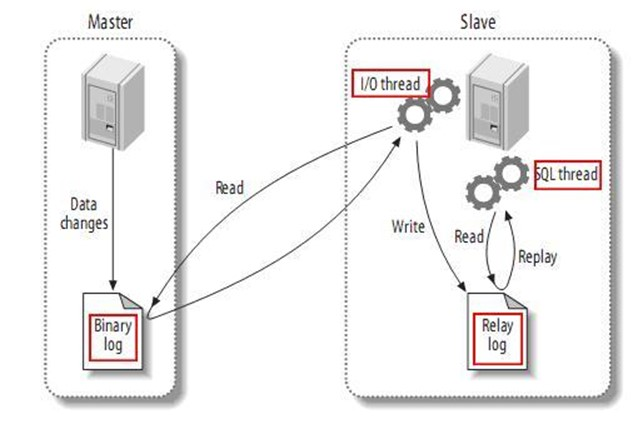

<span style="color:#69d;">主从复制的步骤</span>

1. 主库记录二进制文件
2. 从库读取二进制文件并将其存储到本机的 relay log 中
3. 从库开启线程检测 relay log 变化并实时执行改变的内容

<span style="color:#69d;">主从复制的搭建</span>

1. 准备两个机子

2. 在主机的 my.cnf 文件中配置, 然后重启服务

   ```my.cnf
   #这些配置在该节点下
   [mysqld]
   #设置节点id, 该id在集群中应当唯一
   server-id=1
   #设置开启二进制日志以及二进制文件名
   log-bin=mysqlbin
   #设置该节点的读写模式, 1只读, 0读写
   read-only=0
   #设置忽略的数据, 即不需要同步的库, mysql是系统库, 不要复制
   binlog-ignore-db=mysql
   #也可以设置仅复制的库
   binlog-do-db=需要复制的库名
   ```

3. 添加一个具有主从复制操作权限的用户并刷新权限列表

   ```shell
   mysql> grant replication slave on *.* to '用户名'@'允许哪些ip使用该用户登录(%代表所有)' identified by '密码';
   mysql> flush privileges;
   ```

4. 在主机上查看主节点状态

   ```shell
   mysql> show master status;
   ```

5. 在从节点 my.cnf 中配置

   ```my.cnf
   [mysqld]
   #设置节点id, 该id在集群中应当唯一
   server-id=2
   #设置开启二进制日志以及二进制文件名
   log-bin=mysqlbin
   ```

6. `systemctl restart mysql` 重启从机服务

7. 在从节点的 mysql 中执行

   > master_log_file 和 master_log_pos 来自于上一步中查看到的主机状态信息

   ```mysql
   mysql> change master to master_host='主机地址', master_user='主机中创建的用于主从复制的用户名', master_password='用户密码', master_log_file='mysqlbin.上一步中查到的主机状态中实际的log文件名', master_log_pos=上一步主机状态中查到的position值;
   ```

8. 在从节点中开启同步

   ```mysql
   mysql> start slave;
   ```

9. 查看从节点状态

   > 节点状态中查看 slave_io_running 和 slave_sql_running 两个参数为 yes 即为开启成功

   ```mysql
   mysql> show slave status\G;
   ```

10. 在主机中修改数据, 然后在从节点中查看验证同步结果

11. 如果要停止同步, 在从节点上执行

    ```mysql
    mysql> stop slave;
    ```

12. 如果要修改主机的地址, 在从机上执行

    ```mysql
    mysql> reset master;
    ```

    


#### 内置库

###### mysql

user表

> 存放mysql用户信息


#### 查询过程

查询先看缓存，未命中后查看索引（读取索引也要走磁盘io），未命中后访问磁盘读取数据，所以这里可以得知，无缓存无索引的情况下，总是会走磁盘io


#### ------------Questions------------

###### 中文乱码?

修改 my.cnf 文件, 添加 `character_set_server=utf8`, 然后重启服务

此时还需要对已经存在的库和表的字符集进行修改

修改库的字符集 `alter database 库名 character set 'utf8';`

修改表的字符集 `alter table 表名 convert to character set 'utf8';`

###### 不能远程登录?

用户的 host 设置为 localhost, 即只能本机使用该用户登录, 如果 host 的设置为 % , 那么代表允许所有ip地址使用该用户登录 , 

新建的用户默认 host 设置为 %

###### mysql查询缓存?

开启查询缓存 : 修改配置文件 my.cnf , 新增 `query_cache_type=1`, 然后重启服务

查询缓存原理 : 键值对方式存储 sql语句 和 查询结果, 因此只有 sql 完全一样才能命中缓存

myisam中缓存值存储的仅是数据的索引 , innodb中缓存存储的是整条数据

###### 如何提高插入大批量数据的效率?

* 主键顺序插入会提高效率
* 关闭唯一性校验能提高效率
* 关闭自动提交事务能提高效率
* 在一条insert中插入多条数据比使用多条insert插入效率高

###### 为什么复合索引是最左匹配原则?

复合索引相当对多个字段分层级依次建立连接的树结构, 最左边的字段为树的根节点, 只有从最左字段进入筛选才能进入该树, 就好像游戏里点技能得先进入 火系, 才能点 火系 的技能.

###### 高效地分页查询

​		在数据量小时，可以直接使用 `limit n,m` 来直接查询， 其中n是限制个数，m是offset

​		但是当数据量很大时，直接使用limit的查询方式就会很慢，此时借用主键先定位，然后再使用 limit 进行数量的限制

​		查询语句类似于 `select * from table where id>m limit n` , 因为主键自增的特性，数据库系统可以快速地使用二分查找的方式定位第一条符合条件的数据，然后根据限制数量直接取后面 n 条数据即可


###### 事物的四大特征 (AICD)

A：Atomicity 原子性，一个事物中的操作要么全部执行要么全部不执行，undo log

I：Isolation 隔离性，指的是控制一个事务对数据的修改在什么时间能够被其他事务看到，对应的概念为隔离级别，MVCC

C：Consistency 一致性，指的是随着时间的推移，数据总是保持正确的状态，比如转账业务中的余额控制，其他三个特征实现后，该特征就已经实现了

D：Durability 持久性，指的是一旦执行了事务的submit，之前所做的所有操作都不能丢失，都要保证保存到数据库中，redo log


###### date，datetime，timestamp

*   date 只能表示到天，也就是 年-月-日，无时间限制

*   datetime 表示到秒，也就是 年-月-日-时-分-秒，实际上就是一个数值，底层使用8个字节来存储，无时间限制

    

*   timestamp 表示到秒，会根据mysql设置中time_zone将输入的日期转换为世界标准日期来存储，含义是指格林威治时间1970年01月01日00时00分00秒(北京时间1970年01月01日08时00分00秒)起至某一时间点的总秒数，底层是4个字节，最大值是2的31次方减1，也就是2147483647，转换成北京时间就是2038-01-19 11:14:07

    

综上，如果考虑在多个时区部署分布式服务器想要同步时间的话，请使用 timestamp，同时要注意其时间范围的限制


#### mycat-数据库中间件

> 阿里开源项目, 前身是Cobar 

> 数据库中间件, 连接 java 应用程序 和 数据库

使用了 mycat 之后 , java 程序与 mycat 对接, 不再直连数据库, 通过 mycat 对数据库进行连接 , 能够方便实现

* 读写分离 : 无需在 java 程序中进行读写分离的逻辑 , 该部分逻辑在 mycat 中实现
* 数据分片 : mycat 可对多个分片的数据源进行整合 , 统一分配给 java 程序
* 多数据源整合 : mycat 同时支持多种数据源


#### 分库分表问题

分类：垂直拆分 和 水平拆分

###### 垂直分库分表

垂直分库

​		类似于微服务的拆分，将关联度低的业务拆分为多个模块，划分为多个数据库，如果后端服务是微服务的话，大致思想是一个微服务模块对应一个数据库，这个数据库中包含这个微服务所需的所有表，应当尽量避免跨数据库查询的情况

垂直分表

​		从列的角度对表进行拆分，将不常用的或者数据长度较大的字段单独划分到一个表中，那么原表中剩下的就是常用到的字段，且占用空间不会太大，因为 Mysql 底层使用数据页存储表记录，过长的表记录会导致跨页的情况发生，造成额外的性能开销，所以这种按列拆分的方式能够使得内存中一次性加载更多的数据，提高查询性能

垂直拆分的缺点：

*   没有解决单表数据量大的问题
*   如果涉及跨数据库的表连接查询，那么 join 是不好用的，只能在业务逻辑中分多次查询然后手动 join 数据
*   存在分布式事务的控制问题，也就是一个事务涉及多个不同数据库中的操作，那么就要保证不同数据库表操作要么都完成，要么都回滚，这是个麻烦的问题


###### 水平分库分表

​		将数据表按行切片，使用多个库保存不同分段的切片数据，降低单个数据表的数据量，建议不要库内分表，因为这样虽然能够减轻单个表的数据压力，但是本质上还是使用一台服务器去处理请求，不能减轻数据库的访存压力

水平拆分的缺点：

*   跨分片的事务难以实现
*   跨库的 join 操作性能极差
*   数据扩展难度极大


###### 分库数据分配策略

1.  根据数据范围

    ​		比如根据 用户id范围 或者 时间范围，分别存到不同的数据库

    ​		对于使用时间范围进行分库的策略，天然具有冷热数据分离的特点，因为早期数据会被分到一个数据库，近期数据会被分到一个数据库，但是同时可能造成热点数据库压力过大的情况

    ​		这种方式容易水平扩展，也就是相当于一个数据库灌满数据后，直接再接一个新的数据库接收新的数据，旧数据也不涉及数据迁移的问题

2.  根据数值取模

    ​		可以选择某个字段比如 ID，将其对数据库数量取模，得到所在库，但是后期扩展数据库时，这样的方式会导致大量数据的迁移，所以这里可以考虑使用一致性hash的方式来解决

    ​		这种方式可以使得数据的分布比较均匀，而且不存在热点数据全都集中在少数数据库上的情况

    ​		但是，如果查询的时候不带上分库的时候用来计算所在位置的字段(ID)，那么就只能依次在四个库中查找，极大地降低性能


###### 分库分表的麻烦问题

事务一致性问题

*   分布式事务，因为涉及到多个表多个库，那么事务的执行必须同时考虑到多个表多个库，这将延长事务的执行时间，增加维护的难度
*   最终一致性，对于性能要求高而数据一致性要求不高的系统来说，可以采用事务补偿的方式，不再一旦发生错误就回滚，而是时候根据日志文件对账数据，然后再重新修正数据

跨表跨库join问题

​		要避免跨表跨库join 的情况发生，因为它很难处理，有下面几种解决方法

*   使用全局表，对于不常改变的而且数据量不大的表，在每个数据库中都保存完整的一份，也就是说，这些表不分库分表，然后查这些表时就不需要 join了
*   字段冗余，这是一种反惯例的做法，将可能需要 join 查询的表中的字段在其他表中冗余保存，这样就不要 join 查询了，但是这样又会带来更多的问题
*   手动 "join"，先查一个表，然后再查一个表，然后手动连接结果
*   水平分片的时候，如果可以，事先就将有关联的表中有关联的数据都存到一个数据库中，那么就只要在本数据库中 join 即可


###### 分库分表时ID键的生成策略

<span style='color:cyan;'>UUID方式</span>

​		UUID，最简单的本地生成方式，但是会占用较大的空间，而且主键索引会有效率问题

<span style='color:cyan;'>全局自增ID表方式</span>

​		使用单独的一张表来记录当前的全局自增id，每次新增数据时，都先去全局id表添加一条数据，然后获取到最新的自增id作为本次数据的id，注意这里要使用 myisam引擎，因为它是表锁，所以就不会出现高并发时同时取到多个相同id的情况

<span style='color:cyan;'>扩展全局自增ID表方式</span>

​		但是上述方法强依赖保存全局id 的数据库，一旦该数据库完蛋，整个系统就完蛋，所以改进方案可以是同时设置多个全局id数据库，每个库从不同的起始值开始，用相同的步长新增下一个id

​		例如一个数据库生成1,3,5,7....这样的id，另外一个数据库生成2,4,6,8...这样的id

​		当一个id生成节点完蛋时，可以转向其他的id生成节点获取id

<span style='color:cyan;'>预存ID服务方式（美团Leaf）</span>

​		虽然上述方案提高了id生成业务的可用性，但是如果面对高并发，还是需要通过堆机器数据量来应对，否则单个节点将面临大流量

​		美团leaf算法就是在全局id数据库与后台服务之间加了一层服务，专门用来从全局id数据库那里批量获取id，然后分配给后台服务使用，因为一次性取一批id回来，所以就可以极大地降低全局id数据库的压力

​		同时也能在id批量获取服务处预备足量的id，哪怕全局id数据库完蛋了，预存的id也能够支撑系统正常运行一段时间


#### count系列-面试问题

count(*) 数据库做了优化，不再取出每一行然后统计，效率最高

count(1) 相当于建立了等同于记录数的只有1的行，然后计数，约等于 count(*)

count(id) 把所有id都读取到 server 层，然后计数，慢

count(字段) 把该字段读取到 server 层，然后过滤掉非null，然后计数，最慢

`count(字段)<count(主键 id)<count(1)≈count(*)，所以我建议你，尽量使用 count(*)`

###### count(*) 效率问题

count所有数据效率问题必然是存在的，可以考虑

*   独立表存总量
*   redis存总量，涉及到数据一致性问题
*   分库分表，涉及到如何问题

###### count(*) where 效率问题

sql执行先过 where，然后数据量就会下来，count(*) 就不会出现效率问题了，所以应当把控 where 效率，那么把控 where 效率就是相关索引问题

*   存在多个条件，根据业务将查询频率高的字段作为复合索引的最左字段
*   注意时间是范围查询，那么需要放到复合索引的最后一个字段，因为范围查询之后的字段会失效
*   多个查询条件根据重要程度排序为 abcd，建立abcd，bcd，cd三个索引，因为这样无论带哪个条件查询，都能走索引
*   考虑使用前缀索引，提高索引容量

###### Sql语句优化问题

*   减少子查询，化子查询为连接查询，注意被链接字段要有索引
*   替换 != 为 <n or >n
*   优化 select * 为 select a,b,c 查询的字段够用就行，尽量索引覆盖


#### [limit优化-面试问题](https://www.cnblogs.com/dreamroute/p/11118581.html)

面临的问题主要有两个

1.  `select * from table limit n,m;` 在所有数据中分页慢
2.  `select * from table where a=x limit n,m;` 带筛选条件的分页慢


###### 全数据limit查询

<span style='color:cyan;'>通过order by id利用索引</span>

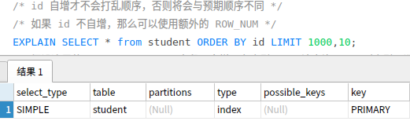

因为用到了 order by ，所以能直接利用到索引，而且使用的是主索引树，直接能够返回整条记录，但是，但是，但是，如果id不是自增，而是uuid之类的，那么返回的顺序将不是插入顺序，与预期顺序不同

<span style='color:cyan;'>自建自增索引列row_num</span>

考虑到id不自增的情况，可以自建自增带索引的一列 row_num, 然后使用利用该列进行 order by，因为该列自增，所以能够保证查询到的结果顺序同插入时的顺序

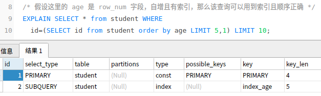

<span style='color:red;'>注意</span>，超出覆盖索引时，哪怕 order by 了带索引的字段，order by limit 时也会全表扫描，如下图，所以应当使用子查询定位当前页中第一条的id位置，然后向后推一页

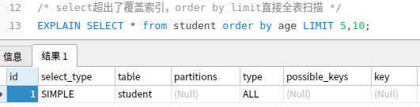


###### 带筛选的limit查询

>   其实给足 where 条件复合索引，就已经能够优化带 where 的limit查询了

*   <del>分表做法</del>

    >   将要查询的字段单独跟 ID 组成一个小表，先根据小表查询出对应 ID，然后根据 ID 查找其他字段
    >
    >   分表做法只适用于百万以下，以上的话还是会很慢

    小表 t(id, condition)

    原表 table(id, xxx, yyy, zzz, condition)

    先 `select id from t where condition=x limit n,m;`，
    
    然后用上一步骤结果 `select * from table where id=(id);`


#### [MySQL的COUNT是怎么执行的](https://mp.weixin.qq.com/s?__biz=MzIxNTQ3NDMzMw==&mid=2247486071&idx=1&sn=7160fc85721f27177d7aeabfe92aa991&chksm=97968385a0e10a93432d02b9a9535176ea437d4689cab54412fb6ec0a8c5d1a0c9fdd3d47496&scene=132#wechat_redirect)

<span style='color:cyan;'>前置知识一</span>

主键索引树是聚簇索引，叶子节点存放id和整条记录值；其他索引（二级索引）是非聚簇索引，叶子节点只存放该列值以及对应id。所以同样大小的叶子节点，二级索引能够存下更多的记录

<span style='color:cyan;'>前置知识二</span>

mysql的service层与存储引擎的交互过程

以这个句子为例 `SELECT * FROM t WHERE key1 > 70 AND common_field != 'a';`， 且假设 key1字段 上有二级索引

1.  优化器认为 `key1>70` 这个条件能更方便地利用到索引，索引从该条件开始对数据进行筛选

2.  首先 service层向存储引擎要 `(70,+无穷]` 范围内第一条记录

3.  存储引擎根据 key1二级索引查找到对应的第一条记录的id，然后拿着这个id回到主索引树中查找整条记录，最后将查找到的整条记录返回给service层

4.  service层判断第二个条件 `common_field != 'a'` 是否满足，是则返回给客户端，否则向存储引擎要下一条记录，直到存储引擎没有记录可以返回

5.  注意到源码，`handler::ha_index_next` 便是server层向存储引擎要下一条记录的接口，可以看到该方法有一千多行代码，包括多版本控制，加锁判断，格式转换等复杂逻辑

    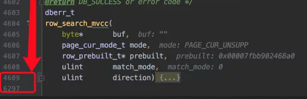

6.  所以可以得知这里是非常消耗性能的


<span style='color:cyan;'>count函数的执行过程</span>

1.  优化器选择使用哪个索引能够最快，其中二级索引因为叶子节点只保存id和列值而能够保存更多的记录数，所以会优先选择使用二级索引，假设最终选定要使用的二级索引为 key
2.  首先 service层向存储引擎要符合条件的第一条记录，注意因为只需要统计数量，所以存储引擎会直接返回二级索引的叶子值，不需要回表
3.  service层维护一个 count 变量，拿到记录后，计算调用count函数时给定的表达式，如果为null，则认为该条记录无效，否则 count++，如果是 count(*)，那么表达式直接记为 0(int类型),也就是总不为 null，所以所有行记录都有效
4.  对比 count(1)，判断表达式为 1(包装类型)，所以要稍微慢于 count(*)
5.  对比 count(id)，因为id在任何一个索引树中都存在，所以优化器会选择一个占用空间最小的索引来完成这个工作，所以 count(id) 效率实际上是不稳定的
6.  对比 count(字段)，如果该字段没有二级索引，那么只能遍历每一条记录，然后判断表达式是否null，效率最低


想要改进一下?

我们知道，InnoDB的记录都是存储在数据页中的（页面大小默认为16KB），而每个数据页的`Page Header`部分都有一个统计当前页面中记录数量的属性`PAGE_N_RECS`。那有的同学说了：在执行COUNT函数的时候直接去把各个页面的这个`PAGE_N_RECS`属性加起来不就好了么？

答案是：<span style='color:cyan;'>行不通的！</span>**对于普通的SELECT语句来说，每次查询都要从记录的版本链上找到可见的版本才算是读到了记录；对于加了FOR UPDATE或LOCK IN SHARE MODE后缀的SELECT语句来说，每次查询都要给记录添加合适的锁**。所以这个读取每一条记录的过程（就是上边给出的row_search_mvcc函数）在InnoDB的目前实现中是无法跳过的，InnoDB还是得老老实实的读一条记录，返给server层一条记录。


#### [MySQL的limit是怎么执行的](https://mp.weixin.qq.com/s?__biz=MzIxNTQ3NDMzMw==&mid=2247486044&idx=1&sn=499e047f7181969017f59b86abbc2c17&chksm=979683aea0e10ab8420c442b0a04487a523cf09ee7242cd5f23e0a2a294713d360ddccbc4c07&scene=132#wechat_redirect)

前置知识

service层和存储引擎的交互过程，同上

对于查询 `SELECT * FROM t ORDER BY key1 LIMIT 5000, 1;` ，其中 key1 字段包含二级索引

你以为的查询方案是，直接使用 key1 的二级索引定位到第5000条记录，然后向后数一条返回

但实际上如果使用二级索引的话，mysql 的查询方案是，呆呆地先问存储引擎要一条记录，存储引擎会先然后再看是否符合limit序号，这其中就涉及一次回表，不断循环获取下一条数据直至达到符合 limit 范围

可以看到，如果 `limit 5000,1` 那么将带来前面5000次无意义的回表，所以优化器并不会选择使用二级索引来完成查询，而是使用全表扫描

这个问题属于MySQL天然的实现缺陷，可以通过子查询的方式来优化，使其能够有效利用二级索引和主键索引 `select * from t ,(select id from t order by key1 limit 5000,1) as b where a.id=b.id;`

这种方式中，子查询由于是索引覆盖，不涉及回表，优化器会认为使用二级索引比全表扫描来的快，从而使用二级索引完成查询


#### 数据库设计三大范式 ?

1. 确保每一个字段都是不可再分的, 原子性的, 例如 地址 字段, 如果还有需求是 城市 字段, 那么 地址字段就不是原子性
2. 确保每一个字段都跟主键相关, 也就是一个表中所有数据都是一类数据, 不能说 学生信息表 里整一个 商品名称 字段, 这就跟主键完全无关
3. 确保每一个字段都跟主键直接相关, 也就是不能间接相关, 比如 学生成绩表, 用 学号 作为字段就跟主键直接相关, 但是再整一个 学生年龄 就不是直接相关.

