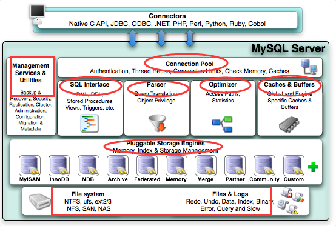
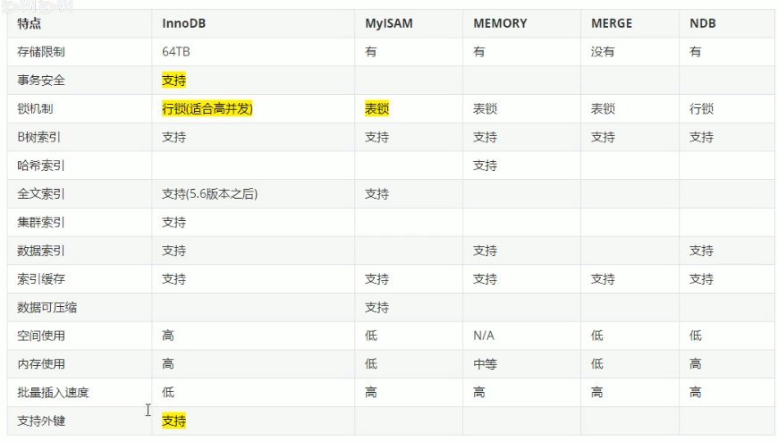
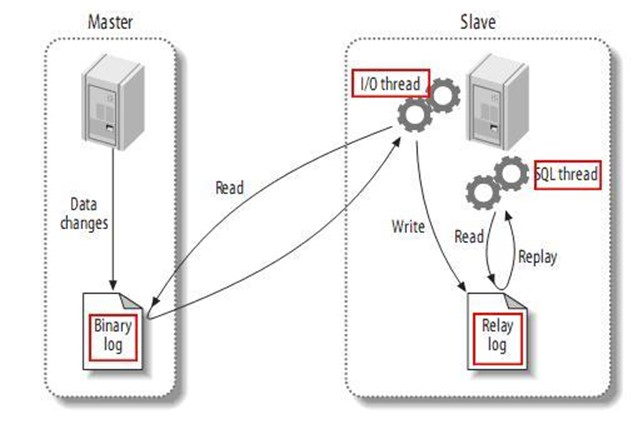

#### mysql体系结构



1. 连接层 , 负责与客户端建立TCP连接, 实现用户认证, 数据加密等功能
2. 服务层 , 负责将收到的 sql 语句中的视图, 触发器之类的转换为sql查询, 生成执行计划, 优化执行计划, 然后看看缓存里有没有结果
3. 引擎层 , 接收服务层传下来的执行计划, 然后根据自身的存储规则执行, 不同的存储引擎实际上区别就在于存储数据的结构不同, 然后对应读取数据的方式也不同.
4. 存储层, 就是指最终保存到磁盘上的文件, 引擎层程序从这里读取和保存数据


#### 存储引擎

> ​	mysql 5.5 及之后默认使用 innodb , 之前默认使用 myisam
>
> ​	存储引擎是面向表的, 在同一个数据库中的不同表可以使用不同的存储引擎, 因此存储引擎又被称为 表类型
>
> ​	存储引擎其实就是如何管理数据的方式, mysql内置多种存储引擎, 可根据需求选择使用不同的存储引擎 , 同时存储引擎是插件式的, 可自行额外扩展
>
> 仅 innodb 支持事务

```mysql
#查看存储引擎
show engines;

#指定表的存储引擎
create table table_name()engine=引擎名;
```

存储引擎对比

* innodb 一张表对应两个文件, frm 表结构 , idb表数据和索引
* myisam 不支持事务外键, 因此效率比 innodb 高, 一张表对应三个文件, frm表结构, myi表索引, myd表数据
* memory 数据存到内存中, 速度最快, 稳定性最差, 一张表对应一个文件 frm表结构, 为什么没人用, 因为出现的太晚了, nosql数据库已经盛行了
* merge 类型的表其实就相当多个 myisam 类型且数据结构完全相同的表的组合视图 , 因此 merge 表在定义时需要指定数据来自于哪些 myisam 表,  merge 表不存储数据, 数据还是来源于基表
* blackhole 表, 黑洞表, 不保存任何写入的数据, 适合做主备复制中的分发主库
* archive 表, 档案表, 只支持插入和查询, 即只能添加档案和查看档案, 不允许删除和修改, 适合记录日志和数据采集类应用
* csv 表, 普通的 excel 文件格式, 数据表保存的文件就是 csv 格式, 可以直接使用 excel 打开, 适合需要生成报表的项目, 项目处理逻辑中直接下载该文件即可



myisam和innodb对比

| 对比项                   | myisam                             | innodb                                   |
| ------------------------ | ---------------------------------- | ---------------------------------------- |
| 外键                     | 不支持                             | 支持(即使支持, 实际开发中也不会使用外键) |
| 事务                     | 不支持                             | 支持                                     |
| 锁                       | 表锁                               | 行锁, 适合高并发                         |
| 缓存                     | 只缓存索引, 不缓存真实数据         | 缓存整条数据                             |
| 特点                     | 高性能, 资源消耗少, 适合简单的业务 | 处理高并发, 支持事务, 资源消耗较大       |
| 是否默认安装             | 是                                 | 是                                       |
| 系统自带表是否使用该引擎 | 是                                 | 否                                       |


#### <span style="color:cyan;">索引</span>

> 主键, 外键, 唯一键 自动生成索引

> 适合数据量大且查询频率高的表
>
> 适合经常出现在where子句中的字段
>
> 索引个数要适当, 因为会降低 dml 效率

> 在mysql 中, 所有库中所有表的索引都存放在 information_scheme 库中的 statistics 表中

###### 聚簇索引和非聚簇索引

> **聚簇索引**: 数据的存放顺序同索引的存放顺序, 默认的自增主键上的是聚簇索引, 因为主键是严格递增的, 且其索引值也是严格递增的, 此时记录的存放顺序就等同于索引的顺序, 因为记录的存放顺序很难实现多个字段同时像主键这样严格递增, 所以一个表只能有一个聚簇索引
>
> **非聚簇索引**: 数据的存放顺序一般不等同于索引的顺序, 比如对 字符串类型的 name 字段建立索引, 此时就需要按照 name 字段中字母的顺序建立索引, 索引的顺序应当类似于 abcde 这样 , 而实际的记录的排列顺序肯定不会是按照 name 字母的严格递增顺序排列 , 比如会出现 blice 在 alice 前面的情况 , 所以索引就需要存储的是对应记录的地址, 那么此时索引的顺序就不同于实际数据的顺序, 这种就是非聚簇索引

###### mysql索引特性

> 默认为主键, 唯一键创建索引, 默认自增的主键创建聚簇索引

###### 数据结构

> 索引其实就是一张表, 也要占用空间, 而且当数据修改时 , 需要更新索引数据 , 这就降低了修改数据的效率

> 索引是在存储引擎中实现的, 不同的存储引擎对索引的支持不同:
>
> 默认的存储引擎是 innodb, 其使用的默认索引是 b+tree 优化索引

二叉树

> 使用二叉树将该列数据进行额外存储, 当对某元素进行搜索时, 对该二叉树遍历, 因为二叉树左子树小于根节点, 右子树大于根节点的特征, 能够提高搜索效率
>
> 但是如果该列数据单调递增或递减, 那么二叉树结构就会退化成链表结构, 无法实现效率的提升

平衡二叉树

> 因为二叉树退化为链表时影响查询效率, 将节点数据构造为平衡二叉树可避免这种情况
>
> 平衡二叉树指任何节点的两个子树的高度差最大为1

b树

> balance-tree, 其实就是n叉平衡树结构, 一个节点保存至多n-1个值
>
> btree结构比二叉树结构深度较浅, 对于同样的数据查询能提高较二叉树好的效率
>
> b树中一个节点就是一个磁盘块, 节点上存储对应个数的数据库记录 和 子节点的指针, 磁盘块的大小是固定的, 所以如果记录条数较多, 那么b树的结构依然会很深

b+树

> 对于b树中依然会出现的树结构很深的问题
>
> b+树不同的是各个父节点只存储当前记录的索引列的值 和 其子节点的地址, 而不存储记录的其他列数据, 将所有数据分段存储到最子级叶节点上
>
> 其实就相当于分段排好序的数组, 这样使得每个父节点能够存储的记录的数量就大大增加, 使得即使很浅的树结构也能存储大量数据
>
> b+树的优点在于能够极大地减少树的深度，同时由于实际的记录数据存储在叶子节点上，所有的数据查询最终都要来到叶子节点，这就使得每次查询要走的路径长度是相同的，也就是查询效率的稳定
>
> innodb默认使用 b+树, 深度为3的b+树就能存储 10亿条数据

innodb中的b+优化树

> innodb使用优化的b+tree, 就是在各个最子级叶节点中最后一个数据加上了下一个分段第一个元素的地址 , 就相当于元素为数组的链表, 为的是跨多个最子级叶节点的范围查询时能够效率高些


###### 索引操作

```mysql
#创建索引
create index index_name [using index_type] on 表名(列名[,列名...]);

#查看索引
#\G格式化输出结果
show index from 表名\G;

#删除索引
drop index index_name on 表名;
```

###### 复合索引

> 可以同时为多个字段创建复合索引, 在查询时符合最左匹配原则, 即如果创建复合索引的字段顺序为 abc, 那么在查询时条件为 a, ab, abc 的都会使用到该索引, 但是 bc, c 的条件就不会使用到该索引, 且如果 条件为 ac , 那么使用到索引的仅为 a 字段.

复合索引结构

> 复合索引按照索引字段顺序依次建立连接的平衡树, 上一层树的子节点为下层数的根节点. 总体结构类似于 rpg 游戏中的技能系统, 法术->火系->火球术 , 每一个大的分支都是一颗子树. 这就是为什么筛选条件必须包含最顶级字段, 因为必须要从最顶级字段才能进入该树.


###### explain

`explain sql语句` 显示sql语句执行计划

<span style="color:cyan;">cyan颜色</span>字段代表需要关注的字段

| 执行计划字段                             | 情况                                                  | 描述                                                         |
| ---------------------------------------- | ----------------------------------------------------- | ------------------------------------------------------------ |
| <span style="color:cyan;">id</span>      | -                                                     | id相同的从上至下执行, id不同的从大到小执行, 一个数字代表一个独立的查询, 数字相同的视为同一趟查询, 子查询会增加独立的查询个数, 应当尽量避免子查询 |
| select_type                              | simple                                                | 简单查询, 数据仅来自于一个表, 不包含子查询或union查询        |
|                                          | primary                                               | 在包含子查询的sql中, 最外层的查询                            |
|                                          | derived                                               | from 后面的子查询, 会生成临时衍生表                          |
|                                          | subquery                                              | select 和 where 后面的子查询                                 |
|                                          | dependent subquery                                    | 查询结果作为父查询中 in 后面数据的子查询                     |
|                                          | uncacheable subquery                                  | 不可用缓存的子查询 , 即用到了变量的子查询                    |
|                                          | union                                                 | union查询中第二个查询语句                                    |
|                                          | union result                                          | 从多个union查询中获取最终union结果的查询过程                 |
| table                                    | -                                                     | 该查询的来源表                                               |
| <span style="color:cyan;">type</span>    | - ( 下列情况颜色越红, 性能越差, 越需要优化 )          | 查询类型, 应当至少建立索引优化到橙色情况                     |
|                                          | <span style="color:#ff4a4a;">all</span>               | <span style="color:#ff4a4a;">全表扫描, 性能最低, 亟需建索引</span> |
|                                          | <span style="color:orange;">index</span>              | 引用了索引但是没有使用索引进行筛选, 没能发挥出索引的作用, 需要对索引进行调整 |
|                                          | <span style="color:orange;">range</span>              | 使用到了范围查询                                             |
|                                          | system                                                | 查询的表里只有一行数据的查询                                 |
|                                          | const                                                 | 查询结果只有一条记录的查询                                   |
|                                          | eq_ref                                                | 使用唯一索引作为筛选条件的查询                               |
|                                          | ref                                                   | 使用非唯一索引作为筛选条件的查询                             |
|                                          | index_merge                                           | 在查询过程中使用了多个索引, 一般出现在包含 or 的查询中       |
|                                          | ref_or_null                                           | 查询过程中使用了 or , 且其中一种情况包含了xxx is null 的判断 |
|                                          | index_subquery                                        | 在子查询中使用了 索引 作为筛选条件                           |
|                                          | unique_subquery                                       | 在子查询中使用了 唯一索引 作为筛选条件                       |
| possible_keys                            | 索引名                                                | 可能会用到的索引 , 列出所有可能被使用到的索引                |
| key                                      | 索引名                                                | 实际被使用到的索引, 没用到索引时为 null                      |
| <span style="color:cyan;">key_len</span> | 值                                                    | 使用到的索引的长度, 该值越大越好, 使用到复合索引时, 不同情况下命中索引的长度会不同 |
| <span style="color:cyan;">rows</span>    | 实际扫描的表记录的行数                                | 扫描的行数越少越好                                           |
| <span style="color:cyan;">extra</span>   | 额外信息, 红色代表亟需优化                            | 该列显示不适合在其他列显示但内容十分重要的信息               |
|                                          | <span style="color:#ff4a4a;">using filesort</span>    | <span style="color:#ff4a4a;">order by 的字段没用到索引, 直接生猛地按照值排序, 此时性能低的令人发指, 应当在 order by的字段上建立索引</span> |
|                                          | <span style="color:#ff4a4a;">using temporary</span>   | <span style="color:#ff4a4a;">group by的字段没用到索引, 因为group by 内部会自动调用 order by , 所以该情况同上一种情况</span> |
|                                          | <span style="color:#ff4a4a;">using join buffer</span> | <span style="color:#ff4a4a;">使用了join连接, 但是连接字段没用上索引, 此时应当在连接字段建立索引. 如果是外连接, 那么应当在被连接的表相应字段上建立索引; 如果是内连接, 那么随便哪个表上对应字段建立索引 , mysql 会根据是否有索引来决定哪个表是被连接表</span> |
|                                          | impossible_where                                      | 瞎几把扯的 where 条件, 压根就不能匹配任何数据                |
|                                          | using index                                           | 用上了索引, 效率还不错                                       |
|                                          | using where                                           | where条件用上了索引, 效率还不错                              |
|                                          | select tables optimized away                          | 用到了内置的优化查询方式, 例如myisam中 count(*) 实际上是直接去事先存好的count表中查询 |


###### 索引优化策略

<span style="color:#69d;">关于单表查询</span>

* <span style="color:#ff4a4a;">范围查询</span>导致复合索引部分失效

  复合索引中, 如果某个索引的中字段被作为范围查询的条件, 那么该在该复合索引中该字段之后的字段索引都会失效, 例如建立 abc 的符合索引, 然后查询中使用 b 作为范围筛选条件, 那么该索引生效的部分仅为 ab , 因此如果某个字段可能作为范围查询字段 , 在建立复合索引时应放到最后, 例如 金额, 时间

* 筛选条件出现 <span style="color:#ff4a4a;">!=</span> 时, 涉及字段的索引失效

* 筛选条件出现 <span style="color:#ff4a4a;">is not null</span> 时, 涉及字段的索引失效

* <span style="color:#ff4a4a;">like 条件中 第一个字符不能确定时</span>, 涉及的索引失效, 例如 匹配值为 %a%

* <span style="color:#ff4a4a;">对索引列的任何操作</span>都会使索引失效, 例如 类型转换, 计算, 使用函数

  当出现需要 mysql 进行类型自动转换的时候, 索引失效. 例如 字段类型为 varchar , 而在sql给出的匹配值为 int 类型, 那么此时就需要 mysql 进行自动类型转换, 此时该字段上的索引就失效. `select * from table where name=123;`

<span style="color:#69d;">关于多表查询</span>

* 连接查询时, 应当保证被连接的表 (也就是 left join 中右边的表) 的连接字段被索引
* 连接查询时, 应当尽量保证发起连接的表 ( 也就是 left join 中左边的表 ) 是数据量相对较少的表, 因为该表不可避免地会进行全表扫描
* 连接查询时, 如果使用的是 inner join , 那么参与连接的两个表就随便哪个表的连接字段建立索引, 因为 mysql 会自动选用有索引的表作为被连接表
* 查询需要涉及多个表时, 尽量不要使用子查询, 要使用连接查询, 因为子查询会生成一条独立的查询, 极大的拖慢查询速度

<span style="color:#69d;">关于 order by</span>

> 为什么 order by 能够使用索引?
>
> 索引本身就是平衡n叉树结构, 从左到右自带排序属性 , 因此如果对一个有索引的字段进行 order by , 只需要 左序遍历或右序遍历 即可得到正确的排序结果, 无需使用其他算法单独对数据进行排序.

* <span style="color:#ff4a4a;">无过滤, 不索引</span> , 如果sql语句中没有 where 条件或者 limit 限制, 直接使用 order by , 那么即使 order by 的字段有索引, 也不会使用. 例如, sql 语句为 where a order by b , 此时有复合索引 ab, sql 中对字段的使用顺序同复合索引顺序, 那么该索引会全部生效.
* <span style="color:#ff4a4a;">顺序错, 必排序</span> , 如果对多个字段 order by , 只要它们的顺序不同于存在的复合索引顺序, 就不能完全使用索引, 从顺序开始不匹配的字段开始, 就会 using filesort
* <span style="color:#ff4a4a;">方向反, 必排序</span> , 如果对多个字段进行不同方向 order by , 例如 order by a desc , b asc , 那么索引就会失效

* 如果避免不了 using filesort , 可以适当调整分配给 mysql 的内存, 进而使用 <span style="color:cyan;">单路排序方法</span> . 

  单路排序即首先得有足够放下所有 order by 记录的内存大小, 然后按照排序需求比如从小到大依次从数据库中读取对应记录, 然后依次存放到连续内存中, 最后直接从该段内存中取记录即为排序完成的记录. 

  mysql默认使用 <span style="color:cyan;">双路排序方法</span> , 双路排序方法即先把所有待排序的记录取到内存, 然后再使用排序算法对这些记录进行排序

  因为 单路排序方法 较 双路排序方法 需要更多的内存, 所以 mysql 会默认使用双路方法

<span style="color:#69d;">关于 group by</span>

* group by 的优化手段完全同 order by , 因为 group by 时会先执行一次 order by
* 不同的是, group by 在即使没有 where过滤条件 的情况下, 也可以用上索引

<span style="color:#69d;">关于 limit</span>

* 在使用 limit 查询分页数据时, 如果数据量很大, 那么 limit 查询的起始值就会很大, 如果此时还是 select * , 那么会严重影响查询效率

  对于这种情况, 可以先查出对应记录数据的 id ,然后根据 id 查询记录的其他字段, 因为第一步中仅查询有索引的 id 字段, 所以在查询时会走索引, 能够大幅提高查询效率

<span style="color:#69d;">关于可能同时存在多个筛选条件的不同组合</span>

* 如果查询时可能包含多个不同条件的不同组合情况, 比如常规的表格加筛选条件的页面, 此时如果有筛选条件就不会走索引进行查询

  对于该类页面关联的数据表, 建议按照各个字段挨个建立复合索引, 为的是在使用不同的条件组合进行筛选时, 都能走索引从而提高效率

  比如有四个查询条件 ABCD, 就建立四个复合索引, 分别是 ABCD, BCDA, CDAB, DABC

<span style="color:#69d;">如果实在用不上索引</span>

* 如果实在无法在筛选条件及上述子句中用上索引, 可以考虑 先 selec id , 然后根据 id 查询记录, 思路同 limit 优化, 不要 select * , 不要 select * , 不要 select *


#### 查询截取分析

​	上述针对使用索引的优化手段能够提高查询效率, 但是实际生产中, 肯定不会对所有的查询 sql 进行优化 , 而是对查询频率最高的最影响效率的sql进行优化, 即优化 20% 的 sql , 覆盖 80% 的功能.

`show [global] status like 'Com_______';` 查看 [所有库的 / 当前库的] 各种语句的执行频次 (七个下划线进行模糊匹配)

`show [global] status like 'Innodb_rows_%';` 查看 innodb 类型表的各种语句的执行频次

`show processlist;` 查看当前所有连接的客户端

`explain sql语句;` 查看该sql语句的执行计划 , 即执行步骤

`show profile;` 分析sql

`select @@have_profiling;` 查看当前数据库是否支持profile工具

`select @@profiling;` 查看profiling是否是开启状态

`set profiling=1;` 设置开启profiling, 只对当前会话有效

`show profiles;` 查看之前执行的各语句的耗时情况

`show profile for query 查询id;` 查看某一语句执行时具体各个阶段的耗时情况

`show global status like 'Handler_read%';` 查看 会话/全局 索引使用情况

<span style="color:#69d;">通过慢查询日志</span>

> ​	一般的生产环境慢查询日志功能是关闭的, 只有在系统性能明显出现下降时, 开启一段时间慢查询日志, 记录下期间的慢查询sql, 然后针对这些 sql 进行优化

> ​	一般情况下生成的慢查询日志数量巨大, 仅靠人为分析是不现实的 , 此时应当借助其他分析工具, mysql 自带 mysqldumpslow 工具来分析慢查询日志, 使用该工具可查看 最慢的 查询次数最多的 sql 


#### 并发参数调整

* max_connections 最大连接数, 默认是151

  `show variables like 'max_connections'; ` 查看该参数的值

* back_log 最大积压连接数, 当达到最大连接数时, 会将连接暂存到 back_log 积压队列中, 如果积压队列也满了, 那么再连接会直接报错

  `show variables like 'back_log';` 查看该参数的值, 默认是 80

* table_open_cache 最大表缓存数量, 每查询一个表, 就需要打开一个表缓存, 该值应当是 `最大连接数*最多同时查询表的个数`

  `show variables like 'table_open_cache';`

* thread_cache_size 线程池数量, mysql服务端会缓存一些线程以备查询, 默认9个

  `show variables like 'thread_cache_size';`

* innodb_lock_wait_timeout 行锁的超时等待时间, 如果一个连接来查询时没有得到锁且等待该时间之后仍然得不到锁,就会返回给客户端错误, 默认50ms, 在需要快速响应的系统中该值应当设定的小一些

  `show variables like 'innodb_lock_wait_timeout';`
  
* 如果出现死锁, 可以先查看当前所有的连接, 然后定位造成死锁的连接, 将其关闭

  `show processlist;` 查看当前数据库开启的所有连接

  `kill 进程id;` 关闭连接, 进程id为上一步中查出来的id


#### 主从复制

> 主从复制中从机是从接入时间点开始读主机新增的日志, 接入时间点之前的日志从机都不会复制, 因此不要在从机接入之前就把要复制的库创建, 否则从机上没有该库也不会创建该库,在之后插入数据时会报错



<span style="color:#69d;">主从复制的步骤</span>

1. 主库记录二进制文件
2. 从库读取二进制文件并将其存储到本机的 relay log 中
3. 从库开启线程检测 relay log 变化并实时执行改变的内容

<span style="color:#69d;">主从复制的搭建</span>

1. 准备两个机子

2. 在主机的 my.cnf 文件中配置, 然后重启服务

   ```my.cnf
   #这些配置在该节点下
   [mysqld]
   #设置节点id, 该id在集群中应当唯一
   server-id=1
   #设置开启二进制日志以及二进制文件名
   log-bin=mysqlbin
   #设置该节点的读写模式, 1只读, 0读写
   read-only=0
   #设置忽略的数据, 即不需要同步的库, mysql是系统库, 不要复制
   binlog-ignore-db=mysql
   #也可以设置仅复制的库
   binlog-do-db=需要复制的库名
   ```

3. 添加一个具有主从复制操作权限的用户并刷新权限列表

   ```shell
   mysql> grant replication slave on *.* to '用户名'@'允许哪些ip使用该用户登录(%代表所有)' identified by '密码';
   mysql> flush privileges;
   ```

4. 在主机上查看主节点状态

   ```shell
   mysql> show master status;
   ```

5. 在从节点 my.cnf 中配置

   ```my.cnf
   [mysqld]
   #设置节点id, 该id在集群中应当唯一
   server-id=2
   #设置开启二进制日志以及二进制文件名
   log-bin=mysqlbin
   ```

6. `systemctl restart mysql` 重启从机服务

7. 在从节点的 mysql 中执行

   > master_log_file 和 master_log_pos 来自于上一步中查看到的主机状态信息

   ```mysql
   mysql> change master to master_host='主机地址', master_user='主机中创建的用于主从复制的用户名', master_password='用户密码', master_log_file='mysqlbin.上一步中查到的主机状态中实际的log文件名', master_log_pos=上一步主机状态中查到的position值;
   ```

8. 在从节点中开启同步

   ```mysql
   mysql> start slave;
   ```

9. 查看从节点状态

   > 节点状态中查看 slave_io_running 和 slave_sql_running 两个参数为 yes 即为开启成功

   ```mysql
   mysql> show slave status\G;
   ```

10. 在主机中修改数据, 然后在从节点中查看验证同步结果

11. 如果要停止同步, 在从节点上执行

    ```mysql
    mysql> stop slave;
    ```

12. 如果要修改主机的地址, 在从机上执行

    ```mysql
    mysql> reset master;
    ```

    


#### 内置库

###### mysql

user表

> 存放mysql用户信息


#### mysql常见问题

###### 中文乱码?

修改 my.cnf 文件, 添加 `character_set_server=utf8`, 然后重启服务

此时还需要对已经存在的库和表的字符集进行修改

修改库的字符集 `alter database 库名 character set 'utf8';`

修改表的字符集 `alter table 表名 convert to character set 'utf8';`

###### 不能远程登录?

用户的 host 设置为 localhost, 即只能本机使用该用户登录, 如果 host 的设置为 % , 那么代表允许所有ip地址使用该用户登录 , 

新建的用户默认 host 设置为 %

###### mysql查询缓存?

开启查询缓存 : 修改配置文件 my.cnf , 新增 `query_cache_type=1`, 然后重启服务

查询缓存原理 : 键值对方式存储 sql语句 和 查询结果, 因此只有 sql 完全一样才能命中缓存

myisam中缓存值存储的仅是数据的索引 , innodb中缓存存储的是整条数据

###### 如何提高插入大批量数据的效率?

* 主键顺序插入会提高效率
* 关闭唯一性校验能提高效率
* 关闭自动提交事务能提高效率
* 在一条insert中插入多条数据比使用多条insert插入效率高

###### 为什么复合索引是最左匹配原则?

复合索引相当对多个字段分层级依次建立连接的树结构, 最左边的字段为树的根节点, 只有从最左字段进入筛选才能进入该树, 就好像游戏里点技能得先进入 火系, 才能点 火系 的技能.

###### 高效地分页查询

​		在数据量小时，可以直接使用 `limit n,m` 来直接查询， 其中n是限制个数，m是offset

​		但是当数据量很大时，直接使用limit的查询方式就会很慢，此时借用主键先定位，然后再使用 limit 进行数量的限制

​		查询语句类似于 `select * from table where id>m limit n` , 因为主键自增的特性，数据库系统可以快速地使用二分查找的方式定位第一条符合条件的数据，然后根据限制数量直接取后面 n 条数据即可


#### mycat

> 阿里开源项目, 前身是Cobar 

> 数据库中间件, 连接 java 应用程序 和 数据库

使用了 mycat 之后 , java 程序与 mycat 对接, 不再直连数据库, 通过 mycat 对数据库进行连接 , 能够方便实现

* 读写分离 : 无需在 java 程序中进行读写分离的逻辑 , 该部分逻辑在 mycat 中实现
* 数据分片 : mycat 可对多个分片的数据源进行整合 , 统一分配给 java 程序
* 多数据源整合 : mycat 同时支持多种数据源


#### 数据库设计三大范式 ?

1. 确保每一个字段都是不可再分的, 原子性的, 例如 地址 字段, 如果还有需求是 城市 字段, 那么 地址字段就不是原子性
2. 确保每一个字段都跟主键相关, 也就是一个表中所有数据都是一类数据, 不能说 学生信息表 里整一个 商品名称 字段, 这就跟主键完全无关
3. 确保每一个字段都跟主键直接相关, 也就是不能间接相关, 比如 学生成绩表, 用 学号 作为字段就跟主键直接相关, 但是再整一个 学生年龄 就不是直接相关.

