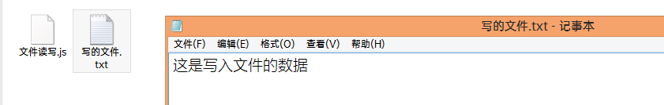
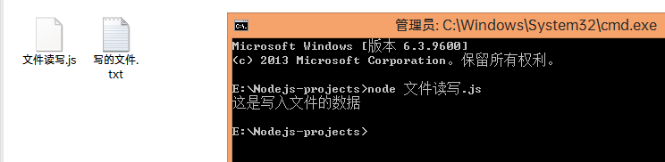
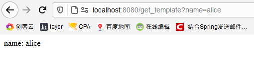
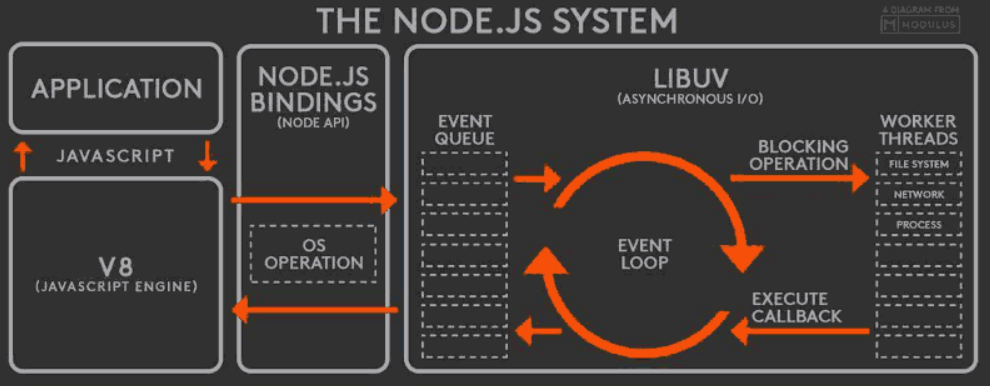
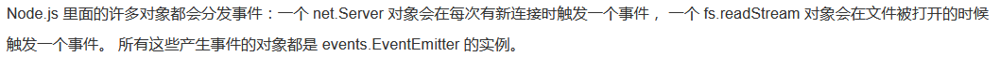
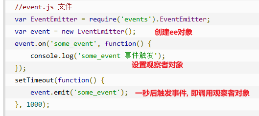

-----------------Nodejs----------------

> nvm : nodejs的版本管理工具, 相当于 anaconda 对于 python , 可以同时配置多套运行环境
>
> 如果是 windows 就使用 nvm-windows, https://github.com/coreybutler/nvm-windows/releases
>
> `nvm -v` 查看版本
>
> `nvm list` 列出当前管理的所有nodejs版本
>
> `nvm use 版本号` 切换到指定版本的nodejs, 前提是得已经安装
>
> `nvm install latest` 安装最新版本的nodejs
>
> `nvm install 版本号` 安装指定版本的nodejs
>
> `nvm uninstall 版本号` 卸载指定版本的nodejs

> nodejs 服务不同于传统的web服务容器比如 apache , 传统的只能处理静态资源请求, 对于动态请求交由web应用程序处理. nodejs 能够处理所有的动态和静态请求

> express 是 nodejs 的web框架

> nodejs 实际上就是在 js 的语法的基础上实现了一套功能, 其中包括开启服务

> 在 nodejs 官网中可以看到各个模块, 有些模块是 全局模块 , 有些是独立模块, 全局模块的api在使用时不需要手动导入, 独立模块在使用前应当先 require 导入

> nodejs 是 非阻塞io 的 , 单线程的

> npm : https://www.npmjs.com nodejs 的扩展库管理工具, 可以使用npm命令下载管理第三方库, 下载的库会保存到当前文件夹中的 node_modules 文件夹中, 第三方库直接在 js 中导入然后使用即可
>
> cnpm 是使用国内镜像的npm, 下载速度快
>
> 1. `npm install -g cnpm --registry=https://registry.npm.taobao.org`
> 2. 使用 cnpm 命令代替 npm 命令

> nodejs 是 commonjs规范 的实现
>
> ecma 是 js 基础语法的规范, 也就相当于 js 语言的制定者 
>
> commonjs 是扩展 js 的语法规范, 增加了 js 网络通信和文件操作,模块规范等适合开发大型程序的api.
>
> nodejs 就是实现了 commonjs 给定的这些api
>
> settimeout, setinterval 是浏览器为了方便开发者实现的api, 浏览器在执行这两个方法时会转化成为 js 代码来执行

> vs code 中 nodejs 代码提示插件 node snippets


#### 内置对象

__filename : 当前 js文件 的完整路径

__dirname : 当前正在 js文件 所在的目录路径


#### fs模块

> 文件操作模块

###### 写文件

```js
// 导入fs模块
const fs = require('fs')

// 写文件 fs.writeFile(file, data[, options], callback)
fs.writeFile('./写的文件.txt', '这是写入文件的数据', (e)=>{
    if(e){
        console.log('文件写入错误')
    }else{
        console.log('文件写入成功')
    } 
})
```

`node 文件写入.js` 执行, 生成写入的文件



###### 读文件

```js
// 导入fs模块
const fs = require('fs')
//读文件  fs.readFile(path[, options], callback)
fs.readFile('./写的文件.txt', 'utf8', (err, data)=>{
    if(err){
        console.log('读取失败')
    }else{
        console.log(data)
    }
})
```

`node 文件读写.js` 读取文件



###### 使用流读写文件

> 使用流读写文件会分块进行, 适用于大文件的读写

```js
const fs = require('fs')

var rs = fs.createReadStream('./被读取的文件.txt')
var ws = fs.createWriteStream('./使用流写入的文件.txt')

// 读取文件, 分块读取
var count = 0
rs.on('data', (chunk) => {
    count++;
})

rs.on('end', () => {
    console.log('读取完毕, 读取了' + count + '次')
})


//写入文件
ws.write('这是写入的文件')
//标记文件写入完毕
ws.end()
//监听写入完毕事件
ws.on('finish', () => {
    console.log('写入完毕')
})
```

###### 使用流复制文件

> 通过调用读取流的 pipe 方法直接写入到写入流指定的路径

```js
//直接将读取流读取到的数据写入到另外一个文件中 ( 大文件复制 )
//定义读取流和写入流的路径, 直接使用 pipe 方法即可实现文件复制
rs.pipe(ws)
```


#### path模块

###### 路径拼接

```js
const path = require('path')

path.join([...paths])
```


#### Http模块

> 用于创建服务和启动服务

###### 处理基本请求

> 包括创建服务以及启动服务, 对路径的简单解析 , 返回字符串和页面

```js
const http = require('http')
const fs = require('fs')
const path = require('path')

// 创建 server 
var server = http.createServer()

// 监听 request 事件
server.on('request', (req, res) => {
    // 获取前端的请求路径
    url = req.url
    console.log(url)
    if (url === '/index') {
        // 页面保存在该js文件同级目录下的pages文件夹中
        filePath = path.join(__dirname, 'pages', 'index.html')
        fs.readFile(filePath, (err, data) => {
            if (err) {
                res.end('读取页面错误')
            } else {
                res.end(data)
            }
        })
    }
    else {
        // 设置响应头, 指定返回数据使用什么编码以及如何来解析
        res.setHeader('Content-type', 'text/html;charset=utf-8')
        // 设置数据
        res.write('404 not found!')
        // 返回响应
        res.end()
    }

})

// 启动服务
server.listen(8080, () => {
    console.log('服务器已经启动...')
})
```

​	

###### 处理静态资源

> 其实就是 apache 之流的服务器干的事

​	当浏览器从服务器获取一个页面时 , 如果该页面中包含了其他静态资源, 那么浏览器会根据其路径分别发送请求来获取对应的静态资源.

​	而静态资源的路径没有在上面的路径匹配规则中包含, 所以对静态资源的访问都会返回 404页面.

​	如果想要服务器可以返回静态资源, 应当对这些静态资源分别配置路径及对应的文件.

​	但是静态资源往往数量很大, 这样实现显然是不现实的.

​	因此可以在服务端单独指定一个文件夹用来存放静态资源, 当前端的请求路径以该静态资源文件夹的名字开头时, 就使用该文件夹的路径动态拼接出来要返回的资源路径. 

​	当实现了动态拼接静态资源路径并返回文件时, 该服务器就已经具备了静态资源的处理能力 , 但是此时默认返回的所有类型的资源的 mime-type 都是 text/plain, 浏览器一律按普通文本处理. 

​	此时就应当根据返回文件的后缀在 response 响应头中设置对应的 content-type, 该功能可以借助 npm 上的第三方库 mime 来实现

> `npm install mime`
>
> 导入mime模块 `const mime = require('mime')`
>
> 使用api获取对应的mime-type  `var ext = mime.getType(filePath)`

```js
const http = require('http')
const fs = require('fs')
const path = require('path')
// 解析不同文件类型的mime-type
const mime = require('mime')

// 创建 server 
var server = http.createServer()

// 监听 request 事件
server.on('request', (req, res) => {
    // 获取前端的请求路径
    url = req.url
    console.log('请求路径: ' + url)
    if (url === '/index') {
        filePath = path.join(__dirname, 'pages', 'index.html')
        fs.readFile(filePath, (err, data) => {
            if (err) {
                res.end('读取页面错误')
            } else {
                res.end(data)
            }
        })
    } else if (url.startsWith('/static')) {
        // 返回静态资源
        var filePath = path.join(__dirname, url)
        console.log('静态资源路径 : ' + filePath)
        fs.readFile(filePath, (err, data) => {
            if (err) {
                res.end('404 资源不存在')
            } else {
                res.setHeader('Content-type', mime.getExtension(url))
                res.end(data)
            }
        })
    }
    else {
        // 设置响应头, 指定返回数据使用什么编码以及如何来解析
        res.setHeader('Content-type', 'text/html;charset=utf-8')
        // 设置数据
        res.write('404 not found!')
        // 返回响应
        res.end()
    }

})

// 启动服务
server.listen(8080, () => {
    console.log('服务器已经启动...')
})
```

##### request

> 在官方文档中是 HTTP -> IncomingMessage

###### 常用字段

req.method     请求方法

req.headers    美化后请求头

req.rawHeaders    原始请求头 

req.httpVesion   HTTP请求的版本号

req.url    请求路径


##### response

> 在官方文档中是 HTTP -> ServerResponse

###### 常用字段和方法		

| 方法  或  字段                                               | 作用                                                         |
| ------------------------------------------------------------ | ------------------------------------------------------------ |
| res.setHeaders()                                             | 设置响应头                                                   |
| res.statusCode = 404                                         | 设置响应状态码                                               |
| res.statusMessage = 'error'                                  | 设置响应状态码对应的消息                                     |
| res.writeHead( 400, 'not found', { 'Content-type' : 'text/plain' } ) | 一次性设置响应状态码, 状态码对应消息, 响应头数据             |
| res.write()                                                  | 设置响应数据                                                 |
| res.end()                                                    | 通知服务器, 本次响应已经完成, 每次响应都应当被调用,可直接添加参数为响应数据 |


#### url模块

> 提供解析请求 url 的方法, 能够获取到 get 请求的参数 , url.parse(req.url, true).query

#### queryString模块

> 提供将查询字符串 ( 类似于 name=alice&age=18 ) 转换为 对象的方法
>
> var queryObj = queryString.parse( str )


#### 解析请求参数以及重定向

> 重定向的本质就是设置了响应码为 302, 浏览器解析为跳转动作从而跳转
>
> 服务器本身无法控制客户端浏览器进行跳转, 但是可以设置响应码为 302 , 并设置响应头中 Location 属性值告诉浏览器该跳转了. 

```js
const http = require('http')
const fs = require('fs')
const path = require('path')
const url = require('url')
const mime = require('mime')

// 创建server并启动
http.createServer().on('request', (req, res) => {

    // 给res添加一个通用的用于返回静态资源的方法
    res.render = function (filePath) {
        fs.readFile(filePath, (err, data) => {
            if (err) {
                throw err
            }
            res.setHeader('Content-type', mime.getExtension(filePath))
            res.end(data)
        })
    }

    //静态资源
    if (req.url.startsWith('/static')) {
        res.render(path.join(__dirname, req.url))
    }

    //首页
    if (req.url === '/' || req.url === '/index') {
        res.render(path.join(__dirname, 'pages', 'index.html'))
    }

    //重定向去的页面
    if (req.url === '/second') {
        res.render(path.join(__dirname, 'pages', 'second_page.html'))
    }

    //接收get参数并跳转页面
    if (req.url.startsWith('/redirect')) {
        //获取get请求参数组成的对象
        var queryObj = url.parse(req.url, true).query
        //设置响应码302 和 Location 告诉浏览器要跳转到哪里去
        res.writeHead(302, 'request redirected...', { 'Location': '/second' })
        res.end()
    }
    
    //接收post参数并跳转返回解析后的post参数
    if(req.url.startsWith('/postReq')){
        //post传递参数时, 浏览器会将请求体分块传递过来(类型为Buffer)
        //每次传递过来一个数据块时, 触发req的监听事件 data
        //将每次传递过来的数据保存起来
        var bufferArr = []
        req.on('data', (chunk)=>{
            bufferArr.push(chunk)
        })
        //当浏览器将所有的请求体发送完毕时, 触发req的end事件
        req.on('end',()=>{
            //获取请求体数据, 此时为查询字符串
            var postBody = Buffer.concat(bufferArr).toString('utf-8')
            console.log(postBody)
            //将查询字符串转换为对象
            var postBodyObj = querystring.parse(postBody)
            //返回获取到的post参数
            res.end(JSON.stringify(postBodyObj))
        })
    }


}).listen(8080, () => {
    console.log('server is running on :  localhost:8080')
})
```


#### npm

> npm 本身就是一个 nodejs 的命令行程序
>
> 实现的功能无非就是将本地的文件打包上传到 npm 服务器, 根据包的url 从npm服务器上下载对应的文件到本地.

> 全局安装包 , 就是把包下载到 nodejs 所在路径, 仅代表该模块可以在命令行中使用
>
> 局部安装包 , 就是把包下载到当前目录下的 node_modules 中, 如果程序要使用该模块, 一定要本地安装才行

> 一个 nodejs 中带着一个 npm

> `npm install npm@latest -g` 更新npm到最新版本

> `npm install 包名@版本号`  安装指定版本

> `npm install 包名`  安装包

> `npm uninstall 包名` 卸载包

###### package.json

> 当前包的描述文件, 用来记录当前包的各项信息, 只有有了该文件, 才能作为 npm 包进行上传

> `npm init`  初始化一个 package.json 文件
> 
>`npm init -y`  按照默认设置一步生成 package.json 文件

> package.json 所在文件夹名称不能包含大写或中文

###### package-lock.json

> 该文件保存当前项目直接依赖包和间接依赖包的详细信息, 包括下载地址
>
> 而package.json中仅保存直接依赖包及其版本, 并不包含详细信息
>
> 在有 package-lock.json 的情况下, 使用 `npm install` 安装所有依赖包时可直接获取到所有需要下载的包及其地址, 能够极大提高下载效率


#### underscore

> 一个类似于 jquery的 js 方法库, 封装了很多常用方法, 可提高开发效率
>
> `npm install underscore` 
>
> _ 为 underscore 对象, 相当于 $ 是 jquery 对象

###### 解析模板

> var str = _.template( htmlStr)( data ) 
>
> 将 data 填充到 htmlStr 模板中返回, 其中 _.template() 方法返回一个方法, 调用该方法传入模板数据可返回填充数据后的页面数据

```js
const http = require('http')
const fs = require('fs')
const path = require('path')
const url = require('url')
const mime = require('mime')
const querystring = require('querystring')
const _ = require('underscore')

// 创建server并启动
http.createServer().on('request', (req, res) => {

    // 给res添加一个通用的用于返回静态资源和页面的方法
    res.render = function (filePath, templateData) {
        fs.readFile(filePath, (err, data) => {
            if (err) {
                throw err
            }
            // 如果传递了模板数据, 那么就加载数据到模板中
            if (templateData) {
                data = _.template(data.toString('utf-8'))(templateData)
            }
            res.setHeader('Content-type', mime.getExtension(filePath))
            res.end(data)
        })
    }

    // 返回使用数据渲染的动态模板页面
    // get 传递参数 name , 返回页面中展示传递的参数值
    if (req.url.startsWith('/get_template')) {
        var queryObj = url.parse(req.url, true).query
        res.render(path.join(__dirname, 'templates', 'show_name.html'), queryObj)
    }


}).listen(8080, () => {
    console.log('server is running on :  localhost:8080')
})
```

```html
<!-- 模板文件 -->
<!DOCTYPE html>
<html lang="en">
<head>
    <meta charset="UTF-8">
    <meta name="viewport" content="width=device-width, initial-scale=1.0">
    <title>展示传递的name属性</title>
</head>
<body>
    name: <%= name %>
</body>
</html>
```




#### require导入模块

> require 同步加载模块

> require可以加载: 
>
> 1. 内置模块  require('模块名')
>
> 2. 第三方模块   require('模块名')
>
> 3. js/json/node 文件    require('文件路径')
>
>    node后缀的文件就是c/c++编写的代码 
>
>    json 文件导入后直接就是 json 对象, 且无需在 json 文件中 exports   

> require 加载第三方模块时, 会从当前目录开始向上依次查找 node_modules 文件夹中是否有该第三方模块

> require加载模块后会进行缓存, 下一次优先使用缓存

> require加载模块时会将模块内容执行一遍, 读缓存时不会执行

> require加载的模块会打包成为一个 Module 类型的对象

###### 导出和导入

1. 被导入方使用 module.exports = xxx 来定义导入方接收到的数据

   ```js
   //被导入方  b.js
   module.exports.name = 'alice'
   module.exports.age = 22
   ```

2. 导入方使用变量接收导入的结果, 即为被导入方通过 exports 定义的内容

   ```js
   //导入方 a.js
   var b = require('./b.js')
   console.log(b.name)
   console.log(b.age)
   ```

   


#### Buffer

> js 中没有提供用于读取或者操作二进制数据流的机制, 因此无法实现对文件的读写操作
>
> nodejs 引入了 Buffer 类型, 可以使用 Buffer 对象进行文件流的操作, Buffer 就相当于水桶, 每次存储一定量的水进行传输, 分多次将较大的数据进行传递.

> Buffer 对象大小在被创建之后就是固定的, 无法修改

> Buffer 中使用二进制存储数据, 打印显示时使用十六进制显示


#### supervisor

> 自动重新部署 nodejs 服务的第三方工具

1. `npm install -g supervisor`

2. 使用 supervisor 命令代替 node 命令启动服务

   `supervisor xxx.js`


#### 使用mongodb

1. `npm install mongodb`

2. 基本使用方式

   ```js
   //导包
   const { MongoClient } = require('mongodb')
   
   //数据库地址
   const url = 'mongodb://127.0.0.1:27017/'
   
   //创建连接客户端
   var client = new MongoClient(url, { useUnifiedTopology: true })
   
   //定义连接回调函数
   client.connect((err) => {
       if (err) {
           console.log('连接失败' + err)
           return
       }
       console.log('连接成功')
       //连接到名称为student的库
       let db = client.db('student')
   
       //1.查找数据
       db.collection('student').find({}).toArray((err, res) => {
           console.log(res)
           //关闭连接, 实际上是关闭当前开启的与数据库的交互窗口, 如果不关闭, 运行程序后就会进入mongodb操作状态不会自动退出
           client.close()
       })
   
       //2. 添加数据
       db.collection('student').insertOne({name:'vlice', age:25}, (err,res)=>{
           if(err){
               console.log('增加数据失败')
               return
           }
           console.log(`新增的数据id为: ${res.insertedId}`)
           client.close()
       })
   
       //3. 差量更新 ( 只更新部分字段,也就是传入新数据时使用 $set )
       db.collection('student').update({name: 'vlice'}, {$set:{name:'vvvlice'}}, (err,res)=>{
           if(err){
               console.log('更新失败')
               return
           }
           console.log('更新成功')
           client.close()
       })
   
       //4. 删除一条 ( 只删除符合条件的第一条数据 )
       db.collection('student').deleteOne({'name':'vvvlice'},(err,res)=>{
           if(err){
               console.log('删除失败')
               return
           }
           console.log('删除一条成功')
           client.close()
       })
   
       //4.1 删除多条 ( 符合条件的数据全删除 )
       db.collection('student').deleteMany({'name':'vvvlice'},(err,res)=>{
           if(err){
               console.log('删除失败')
               return
           }
           console.log('删除多条成功')
           client.close()
       })
   })
   ```

3. 如果在nodejs服务接口中使用, 应当使用直连方式创建连接客户端以确保请求接口都会创建新的可供使用的连接

   ```js
   const { MongoClient } = require('mongodb')
   //数据库地址
   const url = 'mongodb://127.0.0.1:27017/'
   
   //如果是在服务的接口中操作数据库, 应当使用MongoClient.connect()创建连接客户端使得每次接受请求都会生成新的客户端
   MongoClient.connect(url, { useUnifiedTopology: true }, (err, client) => {
       const db = client.db('student')
       db.collection('student').find({}).toArray((err,res)=>{
           console.log('直连方式获取数据成功: ')
           console.log(res)
           client.close()
       })
   })
   ```

   


#### NodeJs 事件循环

> nodejs 事件循环机制类似于观察者模式

nodejs基于单线程执行, 能够处理并发的原因在于其事件循环机制

​		主线程每次从 <span style='color:cyan;'>event队列</span> 中取出一项来处理, 当客户端发来请求时, 对于 IO操作, 直接调用操作系统 epoll 系统调用, 同时为该事件生成对应的主题以及绑定对应的观察者回调函数 , 当执行完 IO 操作后, 触发观察者回调函数, 然后将该请求加入到 <span style='color:cyan;'>event 队列</span> 中, 因为主线程会不断从 event 队列中取出任务执行, 所以这就实现了在不阻塞主线程的情况下, 同时处理多个 IO 请求的功能

单线程的优势在于

* 进程内全程无线程切换, 减少了很多进程切换的时间损耗
* 对于 IO 密集型场景十分契合, 能够以很高的效率处理并发
* 单线程写代码简单, 无需考虑线程同步的问题

缺点在于

* 对于计算密集型场景不适合, 只能等到执行完一个请求后才能执行接下来的请求
* 无法利用多核机器的优势
* 但凡有一个处理请求的过程中抛错, 会导致整个服务直接完蛋


#### NodeJs 运行机制

1. v8解析js代码
2. 解析完后的代码调用 node API
3. 通过 libev 库系统调用 epoll, 形成 event 队列
4. 主线程循环执行队列 event
5. 最后通过v8将处理结果返回给用户




#### NodeJs EventEmitter

nodejs中事件回调都是基于 EventEmitter 对象实现的, 该对象实际上就是观察者模式的具体实现



`EventEmitter 对象` 提供 `on('事件名', 回调函数)`, `emit('事件名')`  等 api 用来绑定和触发事件

​		本质上当我们调用 `fs.readFileSync('filename', callback)` 时, 会创建一个<span style='color:cyan;'>观察者主题(事件名)</span>, 包含 `isTrigger 属性`, 同时创建对应的观察者对象, 将这些对象设置到 <span style='color:cyan;'>观察者主题</span> 中, 当读取完成 时, 触发该事件, 也就是将观察者中的 `isTrigger` 设置为 true , 然后遍历执行观察者对象中的触发逻辑, 而我们定义的 callback, 将会被设置到 <span style='color:cyan;'>观察者主题</span> 的观察者对象列表中, 待到事件触发时被调用




