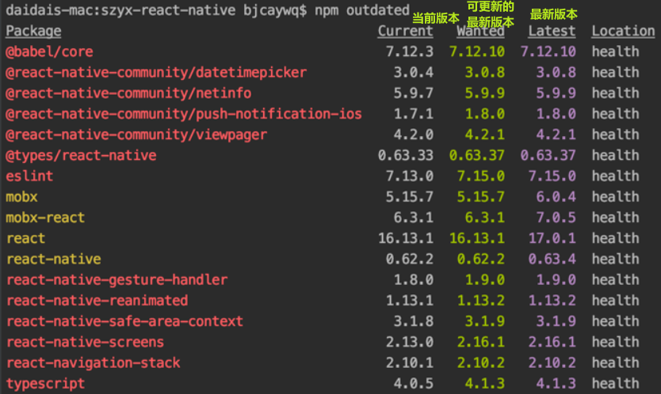

npm : node package management

`npm init` 在当前目录下初始化一个 `package.json` 文件, 用来描述当前包信息, 库依赖信息

第三方库的版本号为 `[^|~]x.y.z` , 这里面的包版本描述一般只是用作限制, 并不代表真实的版本号, 真实的版本号在 `package.lock.json` 文件中记录

x大版本, 一般涉及极大的变更, 不向下兼容

y功能版本, 一般涉及功能的更新, 向下兼容

z, bug修复版本

^ 代表可更新功能版本, ~ 代表仅可更新bug修复版本

`npm outdated` 列出所有可更新的包

`npm update <package> [-g]` 将 本地包(全局包) 更新到最新兼容版本

也可使用 `npm-check` 更新包, `npm -g i npm-check`