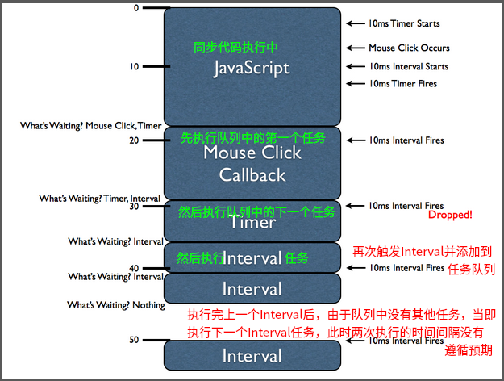

# Promise


js 中函数实际上是对象

#### 基本使用

> promise 即许诺, 我帮你做一个任务, 这个任务是异步的, 并且我会记录下这个任务的执行结果状态( 成功或失败 ), 同时记录下这个任务执行结束后返回的值
>
> 待到调用 then 函数时, 你要告诉我之前那个异步任务成功和失败后分别执行什么操作 , 然后我根据你给我的操作和实际的任务执行的结果状态执行对应的操作
>
> 这种执行异步任务的方式使得 任务执行后的回调函数可以在任何时间定义, 相较于使用纯回调函数时只能在执行任务前就定义好回调函数的情况, 就显得很灵活
>
> then 函数返回一个新的 promise 对象, 其实 then 函数就是使用回调函数中的操作作为任务新建一个 promise 对象, 然后返回这个新的 promise 对象 , 所以可以使用链式编程的方式继续调用 then 函数实现多个异步任务的顺序执行
>
> 可以使用 then 函数多次绑定不同的操作, 当状态改变时会调用所有绑定的对应状态的操作
>
> 如果在 promise 执行的任务中抛出了异常, 那么该 promise 状态会变成 rejected, 执行onRejected 方法
>
> 在 then 函数链式调用的最后调用一个 catch 函数, 可以捕获上面链式调用执行任务的所有异常, 这个特性叫做异常传透 , 实际上在 then 函数中没有指定 onRejected 函数时, 默认设置的 onRejected 函数的实现是  reason=>{throw reason} , 如果想要阻断异常的传透, 只需要手动指定 onRejected 函数为 reason=>{}
>
> 如果想要阻断调用链, 只需要指定回调函数的操作为 return new Promise(()=>{}) , 返回一个pending状态的 promise 对象, 那么就不会调用任何回调函数

```js
//基本用法
const p = new Promise((res, rej)=>{
    //给Promise对象一个异步任务, 并且告知什么情况下算是成功, 什么情况下算是失败
    setTimeout(()=>{
    	const time = Date.now()
    	if(time%2 === 1){
            //指定成功的情况, 即调用 res 函数
            //实际上就是把这个 promise 对象内的状态属性变为 resolved, 然后把这个成功的结果值存到 promise 对象内的结果值属性
            res("异步任务执行成功,时间是:"+time)
        }else{
            //指定失败的情况, 即调用 rej 函数
            //实际上就是把对象内的状态属性变为 rejected, 然后把失败的结果存到对象内的结果值属性
            rej("异步任务执行失败,时间是:"+time)
        }    
    },1000)
})
//调用该promise实例对象的 then 方法指定成功和失败的回调函数
//当异步任务执行完成后 , 看看执行结果状态是什么, 然后根据状态执行不同的回调函数
//如果执行then时(绑定回调函数时)还没有得到任务执行的结果, 那么将回调函数保存为该promise 对象的属性, 待到任务执行完毕(状态改变)时, 判断是否保存了回调函数, 是则执行回调函数, 否则将状态和数据保存起来
p.then(
	value=>{
        console.log(value)
    },
    reason=>{
        console.log(reason)
    }
)
```

对于多个异步任务的顺序执行的场景, 可以使用 async 和 await 更好的处理

async函数返回 Promise对象

```js
//将多个顺序执行的异步任务封装到一个函数中, 并且指定该函数为 async 类型
async function dododo(){
    //do1, do2, do3 都返回 promise 对象, 执行异步任务
    //使用 await 关键字指定等一等 do1, do2, do3, 那么在执行这三个方法时, 都会等到 promise 中的任务执行完才会往下执行下面的代码, 把 async 和 await 关键字去掉, 就完全是常规的顺序编程, 进一步提高了可读性
    const res1 = await do1()
    const res2 = await do2()
    try{
    	const res3 = await do3()    
    	console.log(res3)
    }catch(err){
        console.log(err)
    }    
}
```

#### API

**Promise.resolve(val)**  返回一个状态为 resolved 且值为 val 的 promise 对象

**Promise.reject(val)**  返回一个状态为 rejected 且值为 val 的 promise 对象

**Promise.all( [p1,p2] )** 

​	接收一个promise类型的对象数组为参数 

​	返回一个 promise 对象 

​	只有参数数组中所有的 promise 都执行成功, 返回的 promise 对象状态才为 成功, 此时数据是参数对象数组的返回值组成的数组 ; 

​	如果参数数组中任意一个 promise 执行失败, 那么 返回的 promise 对象状态为失败, 此时数据是数组中失败的 promise 的返回值

**Promise.race( [p1,p2] )**

​	接收一个 promise 类型的对象数组为参数

​	返回一个 promise 对象

​	将数组中第一个执行完成的状态和结果作为 最终返回的 promise 的状态和结果


#### 自定义 promise 

```js
(function(window){
    //定义Promise函数对象(类), js中定义一个类就是定义一个函数对象
    function Promise(excutor){
        //定义Promise类的成员属性
        const that = this
        that.state = 'pending'
        that.data = undefined
        that.callbacks = []
        //定义Promise对象上的resolve方法
        function resolve(value){
            if(that.state!='pending') return
            that.state = 'resolved'
            that.data = value
            if(that.callbacks.length>0){
                setTimeout(()=>{
                	that.callbacks.forEach(callbackobj=>{
                    	callbackobj.onResolved(value)
                	})  
                })
            }
        }
        //定义Promise对象上的reject方法
        function reject(reason){
            if(that.state!='pending') return
            that.state = 'rejected'
            that.data = reason
            if(that.callbacks.length>0){
                setTimeout(()=>{
			       that.callbacks.forEach(callbackobj=>{
			   		  callbackobj.onRejected(reason)
                	})
                }) 
            }
        }
        try{
            excutor(resolve, reject)
        }catch(err){
            reject(err)
        }
    }
    //定义Promise原型对象上的then方法
    Promise.prototype.then = function(onResolved, onRejected){
        //参数类型检查,检查实参是否是函数类型
        onResolved = typeof onResolved === 'function' ? onResolved : value=>value
        onRejected = typeof onRejected === 'function' ? onRejected : reason=>{throw reason}
        
        const that = this
        //返回一个新的Promise实例
        return new Promise((resolve, reject)=>{
            
            function handle(callback){
                try{
                    const result = callback(that.data)
                    if(result instanceof Promise){
                        result.then(resolve, reject)
                    }else{
                        resolve(result)   
                    }
                }
                catch(err){
                    reject(err)
                }  	
            }
            
	    	if(that.state==='pending'){
            	that.callbacks.push({
                    resolve(value){
                        handle(onResolved)
                    }, 
                    reject(reason){
                        handle(onRejected)
                    }
                })
        	}else{
            	if(that.state==='resolved') {
                    setTimeout(()=>{
                        handle(onResolved)
                	})    
            	}
            	if(that.state==='rejected') {
                	setTimeout(()=>{
                        handle(onRejected)
                	})    
            	}
        	}
        })
    }
    //定义Promise原型对象上的then方法
    Promise.prototype.catch = function(onRejected){
        return this.then(undefined, onRejected)
    }
    Promise.resolve = function(value){
        return new Promise((resolve, reject)=>{
            if(value instanceof Promise){
            	value.then(resolve, reject)
        	}else{
                resolve(value)
            }
        })
    }
    Promise.reject = function(reason){
        return new Promise((resolve, reject)=>{
            reject(reason)
        })
    }
    Promise.all = function(promises){
        let values = new Array(promises.length)
        let count = 0
        return new Promise((resolve, reject)=>{
            promises.forEach((p, index)=>{
                p.then(val=>{
                    count++
                    values[index] = val //返回的结果数组元素应当和传入的参数数组顺序一致
                    if(count===promises.length){
                        resolve(values)
                    }
                },reason=>{
                  reject(reason)
                })
            })
        })
    }
    Promise.race = function(promises){
        return new Promise((resolve, reject)=>{
            promises.forEach(p=>{
                p.then(val=>{
                    resolve(val)
                },reason=>{
                    reject(reason)
                })
            })
        })
    }
    //将Promise类挂到window对象上,使其可以直接调用
    window.Promise = Promise
})(window)
```


#### js宏队列和微队列

js引擎 **单线程执行** js 代码.

首先会把 **栈中的方法**(同步方法) 按照顺序执行完成. 

然后 js引擎中的 **定时器管理模块** 将各种异步函数按照类型和执行的顺序先后放到 **宏队列** 和 **微队列** 中. 

然后先按照顺序执行 **微队列中的函数**, 

全部执行完成后, 按照顺序执行 **宏队列中的函数**. 在执行每一个宏队列中的任务之前, 都要先 **检查微队列** 中是否有任务, 有则优先执行微队列中的任务

> 宏队列类型的异步函数 : dom事件回调, ajax回调, 定时器回调
>
> 微队列类型的异步函数 : promise回调, mutation回调

new Promise 时传入的操作会放到 **同步队列** 中立即执行, Promise的then和catch中设置的回调函数才会放到微队列中执行


#### 同步任务，宏任务和微任务

<span style='color:cyan;'>js引擎执行代码的顺序</span>

1.  先把过一遍所有代码，把其中的同步代码直接执行，把异步代码分别加入到宏队列和微队列中
2.  执行完所有同步代码后（也就是扫过一遍代码后），从宏队列中取队头的一个任务准备执行
3.  在该宏任务执行之前，扫描当前微任务队列中是否有任务，有的话，先把微任务全部执行完，再执行当前这个宏任务
4.  当然在执行宏任务的过程中，可能还会向微任务队列中添加微任务，后面添加进来的微任务，会在执行下一个宏任务之前全部执行

<span style='color:cyan;'>宏任务和微任务</span>

-   宏任务:常见的定时器,用户交互事件等等. settimeout 的延时时间是指，多久后将其添加到宏任务队列中

    （宏任务就是特定的这些个任务,没什么特殊含义）

-   微任务:`Promise`相关任务,`MutationObserver`等（一样，`只是一种称呼而已！！！`）

<span style='font-size:24px;font-weight:bolder;color:cyan;'>原则一</span>

​		万物皆从全局上下文准备退出，全局的同步代码运行结束的这个时机开始，也就是说，所有的异步任务都是在同步任务执行完之后再执行

​		比如，在同步代码中执行非常耗时的操作，而使用 settimeout定义一个等待时间很短的操作，哪怕同步代码中执行的时间再长，它们也会先于settimeout的代码执行

```js
// 异步任务，哪怕等待时间是0,也得等下面同步任务执行完毕后才能执行
setTimeout(() => {
	console.log('this is time out print...')
}, 0);
// 非常耗时的同步任务
for (var i = 0; i < 1000000000; i++) {
	if (i % 200000 == 0) console.log('this is check point...' + i)
}
```

看到结果


<span style='font-size:24px;font-weight:bolder;color:cyan;'>原则二</span>

​		保证每次执行一个宏任务之前，会等待至当前微任务队列中任务全部执行完毕

​		比如同期有一个宏任务和微任务，哪怕宏任务立即可执行，也会等待微任务执行完毕后再执行

```js
// 异步任务，哪怕等待时间是0,也得等下面微队列任务执行完毕后才能执行
setTimeout(() => {
	console.log('this is time out print...')
}, 0);
new Promise((res,rej)=>{
	for(i=0;i<5000000;i++) res('micro task finish...')
}).then(res=>{console.log(res)}) // then的逻辑加入微任务队列，它无论如何都会比同期的宏任务队列先执行
```

可以看到，等了微任务好久至其执行完毕，宏任务才执行


#### setInterval的误差问题



​		因为任务队列先进先出，所以Interval任务得排队执行，可能造成连续的Interval任务入队，也就引发了连续的Interval任务执行

​		因为本质是：interval并不关心当前执行的是什么，它们将不加区别地排队，即使这意味着回调之间的时间间隔将被牺牲

<span style='color:cyan;'>解决方案</span>

1.  每次都使用settimeout开始下一次的计时，计算本次的时间误差，然后在settimeout的时间中进行修正

    ```js
     var count = count2 = 0;
     var runTime,runTime2;
     var startTime,startTime2 = performance.now();//获取当前时间
     
     //普通任务-对比
     setInterval(function(){
         runTime2 = performance.now();
         ++count2;    
         console.log("普通任务",count2 + ' --- 延时：' + (runTime2 - (startTime2 + count2 * 1000)) + ' 毫秒');
     }, 1000);
     
     //动态计算时长
     function func(){
      runTime = performance.now();
         ++count;
         let time = (runTime - (startTime + count * 1000));
         console.log("优化任务",count2 + ' --- 延时：' + time +' 毫秒'); 
         //动态修正定时时间
         t = setTimeout(func,1000 - time);
     }
     startTime = performance.now();
     var t = setTimeout(func , 1000);
     
     //耗时任务
     setInterval(function(){
         let i = 0;
         while(++i < 100000000);
     }, 0);
    ```

2.  直接开多线程使用 web worker

    ​		Web Worker 的作用，就是**为 JavaScript 创造多线程环境**，允许主线程创建 Worker 线程，将一些任务分配给后者运行

    ​		在主线程运行的同时，Worker 线程在后台运行，两者互不干扰。等到 Worker 线程完成计算任务，再把结果返回给主线程。这样的好处是，一些计算密集型或高延迟的任务，被 Worker 线程负担了，主线程（通常负责 UI 交互）就会很流畅，不会被阻塞或拖慢

```js
   <!-- index.html -->
   <html>
   <meta charset="utf-8">
   <body>
   <script type="text/javascript">
   var count = 0;
   var runTime;
    
   //performance.now()相对Date.now()精度更高，并且不会受系统程序堵塞的影响。
   //API：https://developer.mozilla.org/zh-CN/docs/Web/API/Performance/now
   var startTime = performance.now(); //获取当前时间 
   
   //普通任务-对比测试
   setInterval(function(){
       runTime = performance.now();
       ++count;    
       console.log("普通任务",count + ' --- 普通任务延时：' + (runTime - (startTime + 1000))+' 毫秒');
       startTime = performance.now();
   }, 1000);
   
   //耗时任务
   setInterval(function(){
       let i = 0;
       while(i++ < 100000000);
   }, 0);
   
   // worker 解决方案
   let worker = new Worker('worker.js');
   </script>
   </body>
   </html>
```

```js
   // worker.js
   var count = 0;
   var runTime;
   var startTime = performance.now();
   setInterval(function(){
       runTime = performance.now();
       ++count;    
       console.log("worker任务",count + ' --- 延时：' + (runTime - (startTime + 1000))+' 毫秒');
       startTime = performance.now();
   }, 1000);
```

