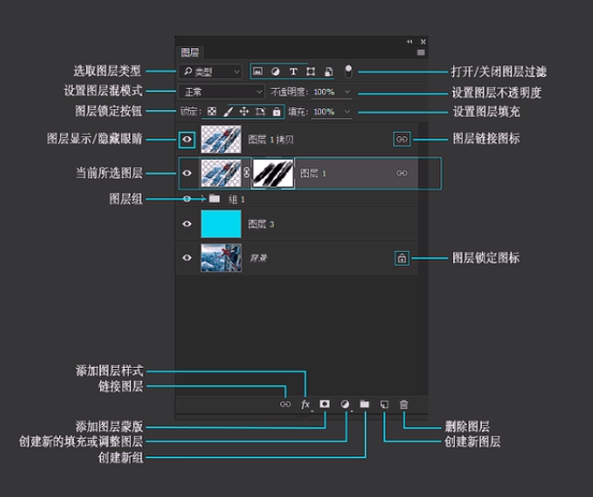
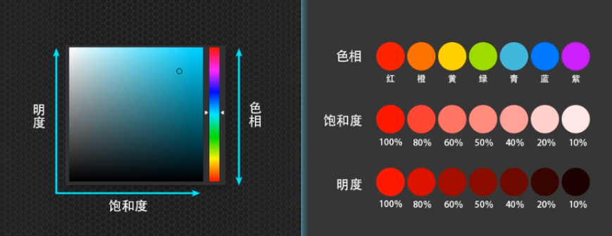
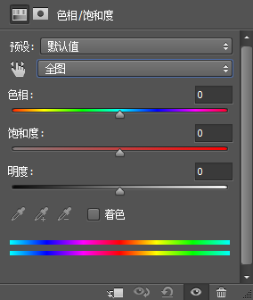
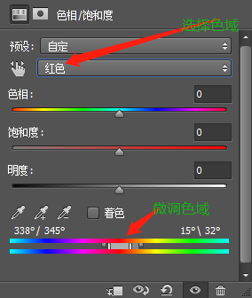
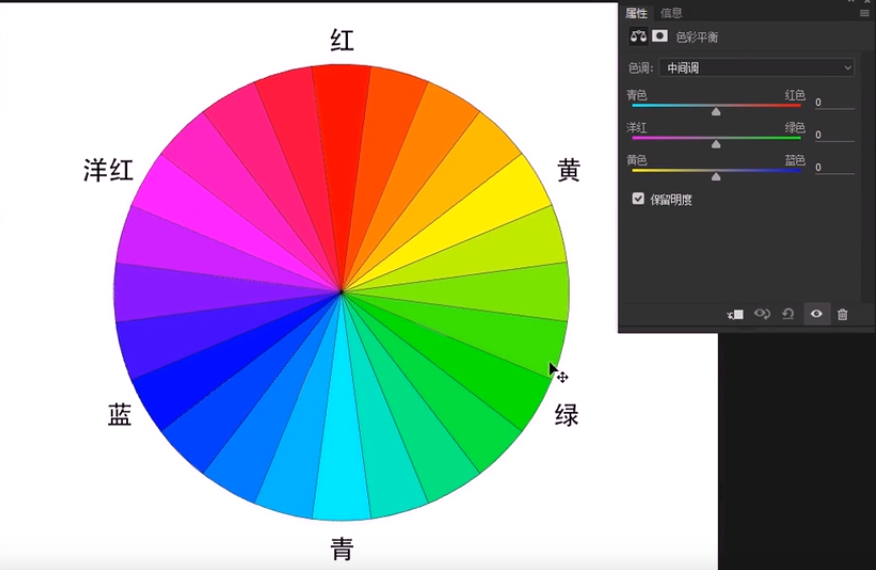
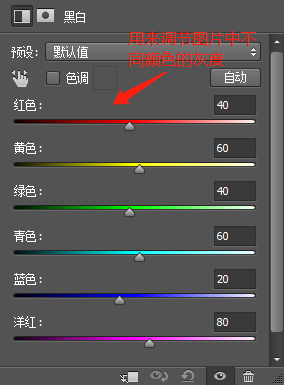
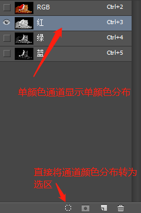
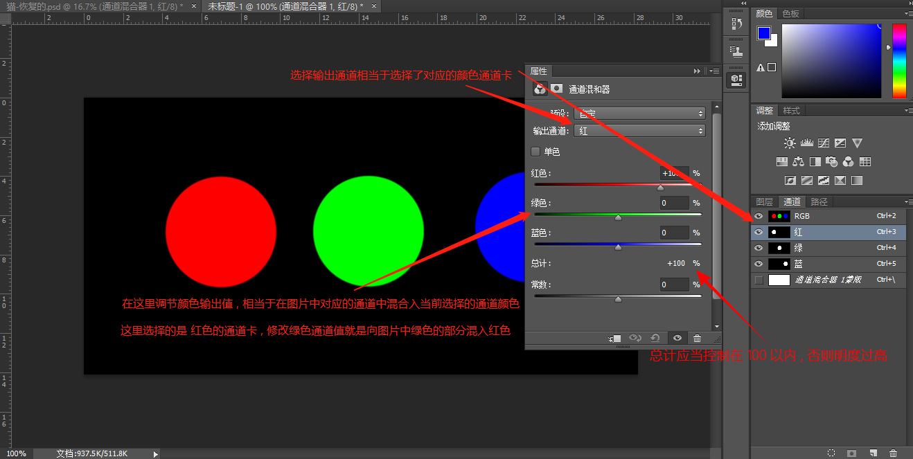
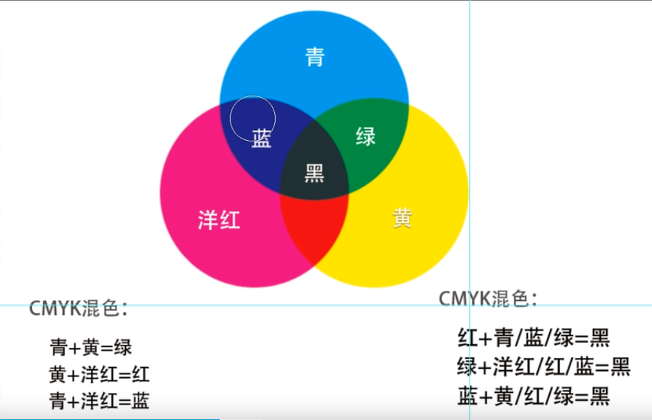
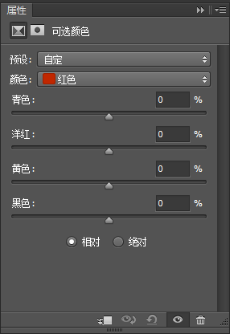

## Ps

### 下载地址

软件链接：https://pan.baidu.com/s/1c4ORnlVGZJ0Yov36RFl2UA 提取码：gray

激活补丁 : 直接覆盖到ps安装目录的根目录即可

### 对ps进行初次使用的设置

1. 编辑 -> 首选项 -> 暂存盘 -> 设置暂存盘 -> 在该菜单中点击 性能 -> 设置内存使用 -> 在该菜单中点击 界面 -> 可以设置软件主题

## 常用操作

* ***对图层操作之前需要点击解锁按钮进行图层解锁***
* ***在ps中的数值单位设置都需要打字设定 ,比如 像素***
* ***视图拖放***: alt + 滚轮
* ***视图拖动***: 按住空格进行拖动
* ***在同一个窗口打开多个图片*** : 文件 -> 置入嵌入对象 或者 直接打开多个图片 , 然后拖动图层到另外一个图片的标签上
* ***新建画布*** : 文件 -> 新建 -> 设置宽高 -> 设置分辨率
* ***填充前景颜色*** : alt+delete
* ***填充背景颜色*** : ctrl+delete
* ***保存*** : 文件 -> 另存为
* ***单独显示某个图层*** : 按住alt点击图层列表中的某一个图层前的眼睛按钮
* ***选择工具栏工具组下的其他工具*** : 右键工具按钮选择工具组下的其他工具
* ***调出变换控件*** : 选中目标图层 , 按ctrl + t
* ***图层多选*** : 按住ctrl点击图层列表中图层的文字进行多选图层 , 在进行移动或变换操作时会一并操作
* ***图层分组*** : 图层多选后, 点击图层列表右下角的新建组
* ***撤回操作到某个步骤***: 在 *历史记录* 面板恢复
* ***复制图层***: ctrl+j
* ***删除图层***: delete 
* ***新建图层***: 图层面板下边的新建按钮
* ***调整图层顺序***: 图层在图层列表中的顺序即为图层实际顺序
* ***撤回一步***: ctrl+z
* ***拆分图层***: 先使用框选工具选区 , 然后ctrl+shift+j
* ***撤销选中***: ctrl+d
* ***恢复图片初始状态*** : F12
* ***显示标尺与否***: 菜单栏 -> 视图 -> 标尺  或 ctrl+R
* ***设置参考线***: 通过拖动标尺来设置参考线 或 菜单栏 -> 视图 -> 新建参考线 -> 设置参考线方向和高度 -> 确定
* ***切换参考线是否隐藏***: ctrl+h
* ***清除参考线***: 菜单栏 -> 视图 -> 清除参考线
* ***对变换控件的非规则矩形变化***: 按住ctrl鼠标拖动进行形变
* ***反向选区*** : ctrl+shift+i
* ***删除选区*** : 选区后按delete直接删除选区像素
* ***前景色背景色切换***: x
* ***盖印可见图层*** : 将所有可见的图层合并生成一个新的图层
* ***栅格化图层*** : 将特殊图层( 如文字 )转化为像素显示的图层
* ***载入图层内容选区*** : 按住ctrl点击图层卡的缩略图
* ***图片去色*** : ctrl+shift+u

> 保存格式
>
> psd : ps专属格式 ,保存图层 , 方便再次编辑
>
> jpg : 常规的图片格式
>
> png : 不会自动填充背景 , 可保存透明背景
>
> tiff : 不经压缩的格式 , 一般用于喷绘写真, 印刷场合

> 分辨率设置
>
> 一般显示器或设备 : 72ppi
>
> 图像需要印刷 : 300ppi
>
> 海报高清写真 : 96-200ppi
>
> 大型喷绘 : 25-50ppi

## 工具栏工具

* 每一个工具栏中的工具都对应着相应的属性设置栏

### 移动工具组 (工具栏)

##### 属性设置

* 自动选择 : 在点击的时候是否自动选中图层 , 选择时按住ctrl键进行反向操作
* 图层/组 : 设置移动的是图层还是组
* 显示变换控件 : 在选中图层后 , 是否显示缩放旋转框
  * 变换控件的缩放: ps2019之前的版本为 , 按住shift进行缩放会等比例缩放 , 2019默认等比例缩放 , 缩放完成后 , 双击或者点击属性栏中的✔来确定缩放
* 对齐方式 : 在选中多个图层时可以使用

##### 操作指南

* 在对图层进行移动时 , 需要先在图层列表中选择相应图层	
  * 设置了 *自动选择* 后, 无需事先切换图层

### 矩形选框工具组 (工具栏)

#### 矩形选框工具

##### 相关概念

选区: 选中一块区域只对其进行操作

羽化效果 : 虚化边缘

##### 属性设置

新选区 : 框出的区域为新的选区

添加到选区 : 框出的区域将添加到之前选中的选区 , 或者按住shift进行选区

从选区减去 : 框出的区域将从已经选择的选区中去除 , 或者按住alt进行选区

与选区交叉 : 新的选区和旧的选区交叉的部分为选中结果 , 或者按住alt+shift选区

羽化 : 设置羽化大小

样式 : 设置选区样式

##### 操作指南

* 按住shift进行画正方形框
* 取消选区 : 在选区上右键 -> 取消选择 , 或者直接 ctrl+d
* 使用选区生成图层 : 右键选区 -> 通过拷贝的图层 , 或者直接 ctrl+j
* 变换选区 : 在选区右键 -> 变换选区

#### 椭圆选框工具

##### 操作指南

* 按住alt中心向四周画圆
* 按住shift画正圆

### 套索工具组(工具栏)

#### 套索工具

##### 操作指南

* 自由的选框工具

#### 多边形套索工具

##### 操作指南

* 多边形的选框工具
* 按delete删除连接点
* 在绘制过程中按住alt临时变为套索工具

#### 磁性套索工具

##### 属性设置

* 宽度 : 用于识别色差的宽度
* 对比度 : 用于识别色差的对比度
* 频率 : 自动加点的频率

##### 操作指南

* 根据色差自适应的选框工具
* 鼠标点击手动添加节点
* 绘制过程中按住alt临时切换为 多边形套索/套索 工具 , 点击加点为多边形套索 , 按住拖动为套索工具

### 快速选择工具和魔棒工具(工具栏)

#### 快速选择工具

##### 属性设置

* 笔触大小 : 按住alt , 拖动鼠标右键调节
* 减选 : 按住alt, 变为减选模式
* 对所有图层取样 : 设置是否将图层看为一个整体进行框选 , 一般都开启这个选项
* 自动勾选 : 是否自动圆滑边缘
* 选择主体 : 点击根据算法识别图片中的主题并框选
* 选择并遮住(调整边缘) : 选中主体并进入框选微调界面
  * 视图 : 选择使用什么底色 , 一般选用黑底或白底 
  * 平滑 : 设置抗锯齿度
  * 羽化 : 设置虚化度
  * 对比度 : 设置边缘的对比度
  * 移动边缘 : 设置框选的整体大小
  * 净化颜色 : 净化边缘的杂色
  * 输出到 : 设置图像微调后的输出形式
  * 调整边缘画笔工具 : 对边缘根据色差进行再次微调 , 适用于头发区域的选择

##### 操作指南

* 直接使用点选进行区域的选择

#### 魔棒工具

##### 相关概念

* 魔棒工具根据同一颜色进行区域选择 , 可用于选择纯色切色差较小的背景

##### 属性设置

* 容差 : 设置魔棒选区颜色的范围 , 容许颜色差别的大小
* 加选区 : 按住shift进行加选
* 减选区 : 按住alt进行减选
* 连续 : 选区是否连续 , 一般设置为连续
* 取样点 : 设置使用哪些点的颜色作为容差的计算点 , 一般选择取样点

##### 操作指南

* 一般使用魔棒选择纯色背景 , 然后通过反选进行主体的选择

> 多个选区工具可同时使用

### 裁剪和切片工具(工具栏)

#### 裁剪工具

##### 属性设置

* 比例 : 设置裁剪框的比例
* 拉直 : 选中拉直后 , 在图片中设置一条直线为底线 , 图片会以该底线为水平线进行裁剪
* 网格 : 设置裁剪辅助线
* 删除裁剪的像素 : 是否完全删除被裁剪掉的部分
* 内容识别(2019特有功能) : 使用裁剪扩充图片出现透明背景时 , 自动根据图片填充透明部分 , 其实就是复制图像边缘部分

##### 操作指南

* 按住 shift 进行固定原比例的裁剪
* 按住 alt 进行中心缩放裁剪
* 双击确认裁剪
* 裁剪功能也可扩展图片

#### 透视裁剪工具

##### 属性设置

* 宽和高 : 设置裁剪结果的宽和高

##### 操作指南

* 通过绘制四边形进行裁剪 , 并且将裁剪结果拉伸成为矩形

#### 切片工具

##### 相关概念

* 对于不方便使用的图片 , 可切片为多个图片来进行操作
* 切片操作一般配合标尺使用 , 菜单栏 -> 视图 -> 标尺 来打开标尺

##### 属性设置

##### 操作指南

* 通过在图片上绘制矩形将图片切片为多个图片
* 选择多个切片 : 按住 ctrl 选择第一个切片 , 然后按住 shift 进行多选
* 组合切片 : 在多选切片后 , 右键 -> 组合切片
* 给切片添加url : 选中切片工具 , 右键切片 -> 编辑切片选项 -> 设置url -> 生成的web页面中该切片会带有url
* 点击 菜单栏 -> 视图 -> 清除切片 来清除切片
* 标尺配合切片的操作 : 按住标尺拖动到图片上设置参考线 , 选择切片工具 , 点击属性设置栏中的 *基于参考线的切片* 来根据设置的参考线自动切片 , 可选择移动工具来修改已设置的参考线 , 通过 ctrl+h 设置是否隐藏参考线 , 视图 -> 清除参考线 来清除参考线
* 切片完成后 , 文件 -> 导出 -> 存储为web所用格式 -> 选择导出格式为jpeg -> 存储 -> 选择位置, 选择保存为html和图像 -> 保存 , 会在目标位置生成 一个网页 和 一个 images 文件夹 , 网页为预览整张图的网页 , 文件夹中存放切片后的各个图片

#### 切片选择工具

##### 操作指南 

* 对已有切片进行选择

### 图框工具(2019工具栏) / 剪切蒙版

##### 相关概念

* 2019ps中的图框工具相当于剪切蒙版功能

* 剪切蒙版 : 图层A置于图层B上 , 此时可以使用A创建剪切蒙版 , 那么A会按照B的大小进行剪切并覆盖到B上 , 相当于给B蒙上一层
* 剪切蒙版的创建 : 在图层列表安排图层顺序 , 在蒙版图层上 右键 -> 创建剪切蒙版 , 或者 按住alt, 点击图层列表中的图层开启剪切蒙版
* 剪切蒙版的应用 : 适合用于做贴图 

##### 属性设置

* 设置图框形状

##### 操作指南

* 直接框选区域制作剪切蒙版

### 吸管工具组(工具栏)

#### 吸管工具

##### 操作指南

* 点击吸取颜色到前景色

#### 颜色取样器工具

##### 操作指南

* 点击获取目标颜色信息
* 按住alt , 点选取样点对其删除

#### 标尺工具

##### 属性设置

* 属性区显示的是测量的结果
* 修改测量结果的单位 : 菜单栏 -> 编辑 -> 首选项 -> 单位与标尺 -> 设置标尺单位
* 使用测量比例 : 是否使用图像与实际的比例来计算实际的比例显示为测量结果
* 设置测量比例 : 菜单栏 -> 图像 ->  分析 -> 设置测量比例 -> 自定

##### 操作指南

* 点击拖动生成线条来测量目标长度
* 按住alt点击已存在的线条端点拉取生成第二条线段 , 可测量角度

#### 注释工具

##### 操作指南

* 用于团队开发时的注释

#### 计数工具

##### 操作指南

* 用于计数的标记

### 污点修复工具组(工具栏)

#### 污点修复工具画笔

##### 属性设置

* 大小 : 调节笔触的大小 , 或者按住alt, 使用鼠标右键缩放 
* 模式 
  * 正常 : 常规的融合计算周围的颜色平均值 , 一般使用这个模式
  * 替换 : 直接使用周围颜色进行替换
* 类型
  * 内容识别 : 常规的去除斑点 , 一般使用这个类型
  * 创建纹理 : 去除斑点后根据周围来创建纹理
  * 近似匹配 : 匹配近似的区域进行填充

##### 操作指南

* 点击去除斑点 , 原理是识别周围区域并计算平均值填充到斑点区域 , 会失去纹理
* 一般都是在原图上新建一个空白图层 , 然后在这个空白图层上进行斑点去除操作 , 然后通过关闭这个空白图层来对比修图前后

#### 修复画笔工具

##### 属性设置

* 源 : 设置使用取样还是直接使用预设的图案
* 对齐 : 在不同的地方进行修复时 , 是否继续按照已修复的图案进行修复

##### 操作指南

* 按住alt点击取样然后修复到目标区域 , 可控制的污点修复工具 , 适用于使用污点修复画笔自动填充效果不理想的情况
* 修复目标位置按照取样点及其周围来修复

#### 修补工具

##### 属性设置

* 源/目标 : 设置修补移动方式

##### 操作指南

* 绘制自定义区域为要修补的区域 , 然后拖动该区域到目标区域实现目标区域对源区域的替换 , 就是带套索的修复画笔工具
* 该工具不能在空白图层上操作 , 一般是复制原图备份 , 然后进行操作

#### 内容感知移动工具

##### 属性设置

* 模式
  * 移动 : 直接将目标区域进行移动
  * 扩展 : 复制目标区域
* 结构 : 设置移动之后的保留边缘度 , 越大保留越完整
* 颜色 : 设置移动后的颜色融合度
* 投影时变换 : 是否在移动之后显示变换框

##### 操作指南

* 框选区域进行拖动

#### 红眼工具

##### 操作指南

* 框选进行去红眼

### 画笔工具组(工具栏)

#### 画笔工具

##### 相关概念

##### 属性设置

* 复位笔触设置 : 右键历史笔触的按钮 
* 笔触大小 : 按住 alt , 使用右键调节大小
* 笔触硬度 : 画出来的点的虚化度 , 硬度越高 , 边缘虚化越低
* 画笔选择 : 设置不同形状的画笔 , 可以外部导入
* 不透明度 : 设置不透明度 , 图层自身也可设置不透明度
* 流量 : 在使用鼠标的情况下 , 等于不透明度
* 对称 : 开启对称绘画
* 画笔设置
  * 间距 : 每个点之间的间距

##### 操作指南

* 按住shift可画水平直线

#### 铅笔工具

##### 属性设置

* 硬度 : 硬度的设置在铅笔工具中无效 , 画出的线条边缘像素不会带有颜色过渡效果 , 而画笔工具的硬度100时 , 画出的线条边缘像素会带有颜色过渡效果
* 自动抹除 : 在图片中前景色上使用背景色

#### 颜色替换工具

##### 属性设置

* 模式
  * 色相 : 使用目标颜色的色相进行替换
  * 颜色 : 使用目标颜色的颜色进行替换
  * 饱和度 : 使用目标颜色的饱和度进行替换
  * 明度 : 使用目标颜色的明度进行替换
* 容差 : 在图片中取样颜色的容差
* 取样连续 : 取样点跟随鼠标不断变化
* 取样一次 : 只使用鼠标点下的位置作为取样
* 背景色取样 : 仅替换图片中为背景色的区域

##### 操作指南

* 在前景色中选取颜色 , 直接在图片中涂抹进行颜色替换

#### 混合器画笔工具

##### 操作指南

* 选取前景色 , 在图片上进行涂抹 , 会将前景色混合到图片中的颜色

### 仿制图章工具组(工具栏)

#### *仿制图章工具*

##### 属性设置

* 仿制源 : 可同时使用5个仿制源点
* 硬度 : 设置复制后图像的虚化效果
* 对齐 : 设置是否多次复制操作是连续的图像

##### 操作指南

* 按住alt点击取样 , 然后在图片上涂抹来根据取样点进行图像复制
* 建议新建空白图层 ,在该图层上进行仿制操作
* 可以用以去水印

#### 图案图章工具

##### 属性设置

* 图案设置 : 设置涂抹时使用的图案
* 印象派效果 : 将图案中的颜色混合到一起作为图案

### 历史记录画笔工具组(工具栏)

#### 历史记录画笔工具

##### 相关概念

* 在历史操作记录面板中可以撤销完整的操作 , 而使用历史记录画笔可以根据需求只撤销部分图片中的操作

##### 操作指南

* 选择历史记录画笔 , 在图片中进行涂抹撤销
* 在历史操作记录面板中 , 默认使用图片原状态作为恢复快照 , 可以通过点击该面板下的 创建新快照 按钮使得指定的图片状态作为恢复快照

#### 历史记录艺术画笔工具

##### 操作指南

* 涂抹进行带颜色混合扩散效果地恢复图片 , 类似于水彩画的效果

### 橡皮擦工具组(菜单栏)

#### 橡皮擦工具

##### 属性设置

* 抹到历史记录 : 是否使用橡皮擦进行历史记录的还原

##### 操作指南

* 在锁定的图层上使用橡皮擦 , 将使用背景色
* 在未锁定的图层上使用橡皮擦 , 将会删除图层的像素
* 橡皮擦只能擦掉当前选中的图层内容

#### 背景橡皮擦工具

##### 操作指南

* 使用颜色取样进行涂抹擦除的橡皮擦 , 一般用于人物发丝或树枝的处理 

#### 魔术橡皮擦工具

##### 操作指南

* 设置颜色容差值 , 在图片中点选取样点 , 会根据取样点和容差一键擦除符合条件的区域

### 渐变工具组(工具栏)

#### 渐变工具

##### 属性设置

* 渐变颜色
  * 设置内置的渐变颜色
  * 点击渐变颜色条进入渐变编辑器
* 渐变样式 : 渐变样式设置
* 透明区域 : 是否启用透明渐变

##### 操作指南

* 选择渐变样式 , 在图片上拉取渐变轴线生成渐变
* 按住shift拉取直线

#### 油漆桶工具

##### 操作指南

* 点击填充 , 也可填充图案

### 模糊工具组(工具栏)

#### 模糊工具

* 涂抹进行模糊

#### 锐化工具

* 涂抹进行锐化

#### 涂抹工具

* 涂抹以进行颜色的涂抹

### 加深工具组(工具栏)

#### 加深工具

##### 属性设置

* 范围 : 设置加深的范围 , 分为 阴影 , 中间区 和 高光
* 曝光度 : 一般设置在10%以内

##### 操作指南

* 涂抹以加深

#### 减淡工具

* 使用同加深工具

#### 海绵工具

* 设置模式 , 涂抹生效

### 钢笔工具组(工具栏)

#### *钢笔工具*

##### 属性设置

* 形状

  * 填充 : 设置对形状的填充形式
  * 描边 : 设置描边样式

  * 自动添加/删除 : 是否开启鼠标置于线条和锚点上的点击添加/删除操作

* 路径

  * 

##### 操作指南

* 形状模式	
  * 通过在图片上设置锚点来连接成为形状 , 形状会生成在一个单独的形状图层上
  * 按住ctrl对已有锚点进行修改
  * 鼠标置于已有线条上可添加锚点
  * 点击已有锚点可删除锚点
  * 在锚点失去焦点时 , 通过按住ctrl框选已有形状来激活锚点
* 路径模式
  * 通过来图片上设置锚点来生成路径 , 路径可在 路径 的选项卡中查看
  * 按住鼠标拖动可生成贝塞尔曲线的锚点
  * 按住alt点击贝塞尔锚点收回弯曲 , 下一个锚点将会生成直线 , 否则默认补全贝塞尔曲线的另外一半
  * 对于已经存在的直线锚点 , 可通过按住alt并鼠标拖动来使其变成曲线 , 或者切换到 转换点工具 进行拖动转换
  * 在路径选项卡中双击已存在路径对路径进行保存
  * 在路径选项卡中选中一个路径 , 然后点击该面板下的 **将路径作为选区** 按钮 , 可将路径转换为选区
  * 在路径中被选中的点为实心点 , 未选中的点为空心点
  * 按delete删除选中的锚点
  * 按住ctrl可框选路径 , 然后按 ctrl+enter 直接转换为选区
  * 路径模式是全手动的选区抠图方式 , 可以实现精度更高的抠图
  * 钢笔的优势在于能够绘制自由贝塞尔曲线

#### 自由钢笔工具

##### 属性设置

* 磁性的 : 是否开启磁性

##### 操作指南

* 类似于套索工具 , 自由在图片上绘制 , 然后根据线条生成路径
* 在开启磁性设置后 , 就类似于磁性套索工具 ,不同的是生成的是路径而不是选区

### 文字工具组(工具栏)

#### 横排文字工具

##### 操作指南

* 正在输入状态的文字 , 按住ctrl显示变换框 , 同时按住shift保持比例
* 安装第三方字体 : 直接安装 ttf 到电脑 , 或者 复制 ttf 到`c:/windows/fonts/`下

#### 横排文字蒙版工具

##### 操作指南

* 输入文字确定后成为选区 , 使用选区完成其他操作

### 路径选择工具组(工具栏)

#### 路径选择工具

##### 操作指南

* 用于操作钢笔工具绘制的路径或形状
* 在钢笔工具下 , 按住ctrl+alt会切换为该工具

#### 直接选择工具

* 该工具就是在钢笔工具下按住ctrl时切换的工具

### 矩形工具组(工具栏)

#### 矩形工具

##### 属性设置

* 像素模式 : 绘制的形状不生成在单独的形状图层中 , 直接添加到当前图层中
* 对齐边缘 : 如果开启了参考线或者网格 , 对形状进行绘制时 , 会自动吸附到参考线或网格上

##### 操作指南

* 绘制的形状会生成在一个单独的形状图层上
* 双击形状图层的缩略图 , 可带预览的改变颜色
* 按住shift画正方形

#### 自定义形状工具

##### 操作指南

* 可以使用钢笔工具绘制形状保存为自定义形状
  1. 使用钢笔工具绘制形状
  2. 按住ctrl框选整个形状
  3. 菜单栏 -> 编辑 -> 定义自定形状 -> 保存
  4. 直接在自定义形状中使用

### 抓手工具组(工具栏)

#### 抓手工具

##### 属性设置

* 滚动所有窗口 : 开启多张图片时 , 在其中一张图片进行拖动时 , 其他图片也会同时被拖动

##### 操作指南

* 就是在其他工具中 , 按住空格时切换的工具

#### 旋转视图工具

* 拖动以旋转视图

### 放大镜工具(工具栏)

* 其他工具下 , 按住alt滚动滚轮时切换为该工具
* 关闭 细微缩放 时 , 框选图像区域快速缩放到合适的程度

### 快速蒙版模式(工具栏)

##### 属性设置

* 设置快速蒙版模式下 , 画笔涂抹区域的颜色 : 双击 **快速蒙版按钮** , 设置蒙版颜色
* 设置画笔涂抹区域为选区还是非选区 : 双击 **快速蒙版按钮** , 选择 被蒙版区域/所选区域
* 快速蒙版模式下 , 前景色为黑色时是透明度为100的蒙版 , 前景色为白色时是透明度为0的蒙版 , 前景色为彩色/灰色时带透明度的蒙版
* 画笔的硬度影响了选区的羽化效果

##### 操作指南

* 

1. 点击按钮开启快速蒙版模式
2. 切换到画笔工具
3. 在图片上涂抹形成区域
4. 点击按钮关闭快速蒙版模式
5. 涂抹的区域变为选区
6. 使用选区完成其他操作

* 快速蒙版模式本质上是在图片中绘制带颜色区域 , 然后将其转换为选区 , 所以对区域的绘制 , 可以不局限于画笔工具
* **快速蒙版模式的优势在于可以使用不规则的画笔打造不规则的选区**

## 图层(面板)

* 链接图层 : 选中多个图层 , 点击链接按钮进行链接 , 被链接的图层相当于一个图层
* 创建图层 : 直接点击按钮在当前图层上方创建图层 , 按住ctrl点击按钮在当前图层下方创建图层

> 非普通图层不能进行部分操作 , 可右键 -> 栅格化图层使其变为普通图层

> 对于文字层 , 可以右键 -> 转换为形状 , 使其变为形状层 , 从而可以使用钢笔工具等对其形状自定义编辑

> 在普通图层卡上右键 -> 转换为智能对象 , 可以避免该图层因放大而造成变模糊

>  图层锁定时扩大画布大小会填充颜色 , 不锁定时扩大画布大小填充透明区域

## 图层蒙版(功能)

* 图层蒙版一般用于图片合成 , 例如换天

##### 操作指南

* 1. 选中一个图层
  2. 点击图层面板下的 **添加图层蒙版** 按钮
  3. 此时会生成一个该图层的蒙版
  4. 选中该蒙版
  5. 使用黑色画笔在蒙版中涂抹 , 黑色区域在原图层中对应的区域会被隐藏
  6. 使用白色画笔在蒙版中涂抹 , 白色区域在原图层中对应的区域会被显示
* 画笔的硬度决定了隐藏部分边缘的虚化效果
* 画笔的不透明度决定了隐藏部分的不透明度
* 蒙版层用于调色层可实现部分图片调色效果
* 按住alt点击蒙版层可在主窗口查看蒙版
* 选中蒙版按 ctrl+i 反向蒙版
* 右键蒙版层 , 选择 **调整蒙版** 可对蒙版进行微调
* 蒙版上的黑色为隐藏区 , 白色为显示区 , 不管用什么工具 , 只要能编辑蒙版上的黑白区 , 就可以实现蒙版的功能
* 按住ctrl , 点击 **创建蒙版按钮** 可创建矢量蒙版 , 矢量蒙版识别路径, 根据路径进行显示

## 小太极(图层面板按钮)

* 用于创建调整图层

#### <u>填充层分组</u>

* **纯色** : 直接创建一个带颜色的图层 
  * 双击图层缩略图快捷换色
* **渐变** : 直接创建一个带渐变的图层
* **图案** : 直接创建一个带图案的图层

#### <u>明暗层分组</u>

* **亮度**/**对比度** : 创建一个亮度对比度调节层 , ***调节能力有限***
* **色阶** : 用以调节图片色阶分布的调节层 , ***高级的亮度和对比度调节方法***
  * 在色阶调节面板中 , 对rgb的调节 ,  ***一般使用自动***  , 会根据图片中的颜色自动分析出rgb问题并进行修改
  * 在色阶调节面板中 ,  ***色阶直方图*** 中显示的是本图片中从黑场到白场的所有 ***色阶分布*** , 通过调整 黑场/灰场/白场 **滑块** 对色阶分布进行自定义 , 即 ***黑场滑块以左的色阶全部显示为纯黑*** , ***白场滑块以右的色阶全部显示为纯白***
  * 通过调节色阶分布滑块来调整图片的 ***明暗细节分布***
  * 在调节 黑场和白场区时 , 灰场会 ***自动随之变化*** 
  * 在色阶调节面板中 , 可以设置输出的色阶 , 会对图片中不属于输出色阶的颜色进行压暗或者提亮调节
  * 可以使用 ***多个色阶调节层及蒙版*** 来实现对一张图片中不同部分的针对性调节
  * 根据 ***色阶直方图*** , 可以发现图片的 ***色阶问题*** , 如 ***黑场缺失*** , ***白场缺失*** , ***色阶分布失衡*** , 从而做出修改
* **曲线** : 用以调节明暗的调节层 , ***比色阶更高级的调节方法***
  * 跟色阶不同的是 , 色阶在进行黑场白场的调节时 , 整个图片的所有色阶都会随之改变 , 色阶之间的比例关系还是不会发生变化 , 而使用曲线可以 ***针对某一个色阶进行调节*** 而不影响其他的色阶 ( 不可避免的是会因为过渡而对其他色阶产生的微量影响 ) 
  * 在曲线的直方图中 , 横轴是输入的色阶值 , 也就是图片中原本的色阶分布 , 竖轴是输出的色阶值 , 也就是修改后的色阶分布
  * 在曲线调整面板中 , 点击下方 ***只应用到此图层按钮*** 可设置曲线调节层只影响其下一层图层 , 否则将会影响其下所有图层 , 色阶中也有此按钮
* **曝光度** : 调节曝光度的调节层 , 曝光度调节白场 , 位移调节黑场 , 灰场校正调节灰场

#### <u>*调色层分组*</u>

**相关概念**

* **拾色器**

  

**操作指南**

* **自然饱和度** 

  * 自然饱和度 : 根据图片的实际情况来对饱和度进行调节 , 更适合照片的调节
  * 饱和度 : 单纯地调节图片的饱和度 

* **色相/饱和度**

  * 通过调节 色相 , 饱和度 来调节图片中的颜色 , 通过调节 明度 来调节图片中的明度

    

  * 可以在面板上方选择只改变图片中指定的色域 , 例如 红色 , 然后通过面板下方的影响色域滑块进行微调

    

  * 色相调整的原理是旋转整个色相盘 , 选中色域进行调整的原理是只旋转选中色域

* **色彩平衡**

  * 色彩平衡提供了对不同色调的针对性调节 , 使用色相盘中对立的三对颜色进行调节
  
    
  
  * 色彩平衡的特点在于能够根据 ***色调(也就是明度): 中间凋/阴影/高光*** 进行色彩的调节

> **色相/饱和度** 和 **色相平衡** 的区别在于 : 色相/饱和度 是对色相盘进行旋转 (色相比例不发生变化) , 色相平衡 是对色相盘的圆心偏移( 色相比例的变化 )

* **黑白**

  * 黑白调节层的功能是将图片中的色相去除 , 也就是将所有颜色归到拾色器的 ***竖轴*** 上

    

  * 可以设置黑白层将图片背景压暗至黑色 , 然后利用色差进行抠图

* **照片滤镜**

  * 滤镜层

* **通道混合器( 最适合复杂的发丝抠图 ) **

  **相关概念**

  * 开启通道面板 : 菜单栏 -> 窗口 -> 通道

  * 设置通道颜色模式 : 菜单栏 -> 图像 -> 模式 -> RGB颜色

  * 单颜色通道卡中 , 白色代表存在通道颜色 , 黑色代表不存在通道颜色 , 颜色越白 , 通道颜色越多

    

  * 可以通过向 ***单颜色通道卡*** 中添加白色来给图片添加颜色

  **操作指南**

  * 添加通道混合器来调整颜色通道

    

  * 通道的混合总计应当控制在100以内 ,否则会明度过高

  * 在通道混合中调节 常数 可以对整个图片中混入当前通道颜色

  * ***使用单颜色通道卡可以获取比其他方式更有效的针对发丝的抠图***

    1. 在三个单通道中选择一个发丝与背景色反差最大的通道
    2. 右键复制该通道卡
    3. 菜单栏 -> 图像 -> 调整 -> 色阶 
    4. 在色阶面板中调大 黑场和白场 的范围使得反差增大
    5. 在通道卡中使用 将通道作为选区
    6. 回到原图层 , 此时选区为背景 , 切换到选区工具右键 反向选区 或 直接ctrl+shift+i
    7. 复制选区 ctrl+j , 发丝部分抠图成功

* **颜色查找**

  * 在颜色查找面板中直接使用列表中预设的颜色配置( 第三方厂商提供的配置方案 )来修改图片显示效果

#### <u>反相组</u>

* **反相**
  * 原理是互补色对调
  * 反相功能一般用于蒙版上 , 选中蒙版 -> 菜单栏 -> 图像 -> 调整 -> 反相 , 使得蒙版反相 , 或者直接选中蒙版按 ctrl+i进行反相
* **色调分离**
  * 将图片中色调的渐变分为指定个数的色阶 , 色阶数越多 , 渐变越自然
  * 一般用于做背景
* **阈值**
  * 添加阈值层 , 图像变为仅包含纯黑和纯白 , 通过调整阈值来设定以哪个值作为黑白的分界线 , 低于该值都显示为白色 , 高于该值都显示为黑色
* **渐变映射**
  * 渐变映射层将图片中的颜色全部替换为渐变色中包含的颜色 , 具体原理是识别图片中的高光区/中间调区/阴影区 , 然后将这些区分别对应渐变中的颜色来进行替换
  * 可以使用渐变映射图片来 ***辨别*** 图片中的 高光区/中间调/阴影区
  * 可以使用该功能来对图片进行调色 , 预设渐变中提供了很多选择

> RGB 与 CMYK
>
> * ps中设置图片的颜色格式 
>   * 在创建图片的时候选择颜色格式
>   * 打开图片后 , 菜单栏 -> 图像 -> 模式 -> 选择颜色格式
>
> RGB : 显示色盘 , 基色是 红,绿,蓝
>
> CMYK : 打印色盘 , 基色是 青色 , 洋红 , 黄色 , 黑色 , 因为打印场景不适合打印很鲜艳的rgb基色 , 所以选用混合色作为基色
>
> 

* **可选颜色 **

  * 在颜色选择中选择一种颜色 , 然后在下方基色调整中调整对当前选中颜色的混合 . 例如选择红色 , 在下方选择减去洋红 , 那么图片中红色区域会变为黄色

     

  * 可选颜色功能 与 通道混合器 的区别在于 : 通道混合器中选择的颜色为源 , 调整的通道为目标 , 可选颜色中选择的颜色是目标 , 调整的通道为源

  * 可选颜色功能 与 通道混合器 都是进行颜色的混合

  * 可选颜色可用于提升图片的色相饱和度 , 做出来的效果更加自然

## 混合模式 

> 混合模式用于设置两个相邻图层中颜色产生的效果
>
> 混合模式涉及两个图层 , 下方图层上的颜色成为 基色 , 上方图层上的颜色成为 混合色 , 产生的结果为 结果色
>
> 混合模式应当设置在上方图层上

### ***基础组***

----

* 正常 : 图层之间正常地叠加
* 溶解 : 该图层上图像边缘呈现颗粒状的溶解效果 , 类似于磨砂

### ***变暗组***

----

* 变暗 :
  * 取更暗的保留 
  * 原理是 取三基色数值 , 每个数值都取两个中较低的那一个然后使用这三个数值作为结果色
  * 适合做 ***投影部分的抠图***
* 正片叠底 : 
  * 计算原理是 `基色*混合色/255`  
  * 适合做 ***投影效果***, 影子下方的内容颜色更加真实
* 颜色加深 : 
  * 混合后暗部更暗 , 对比加强 
  * 比正片叠底更暗  
  * 计算公式是 `(基色+混合色-255)*255/混合色` ,  如果 基色+混合色 小于 255 , 直接返回0 
  * 适合做 ***双重曝光效果(也就是一个图片中的主体作为轮廓 , 中间填充另外一张图片中的内容)***
* 线性加深 : 
  * 比颜色加深更暗 
  * 公式是 `基色 + 混合色 - 255` , 如果 基色+混合色 小于 255 或 基色和混合色其中一个为0 , 直接返回0 
* 深色 : 
  * 取 R+G+B 中较小的作为结果
  * 与变暗不同的是不会取各个通道上的较大然后生成新的颜色

### ***变亮组***

----

* 变亮 : 

  * 三基色取较大者保存生成新颜色

* 滤色 :

  * 将混合色图片中的黑色部分全部去除 , 剩余颜色混合到基色上 , 自然提亮基色

  * 适合做 ***光晕效果***

    > 光效混合层的制作 : 
    >
    > 1. 在基色图层上新建黑色底的图层 , 设置为 滤色 模式
    > 2. 选中基色图层 , 菜单栏 -> 滤镜 -> 渲染 -> 镜头光晕 -> 选择光晕类型 -> 设置亮度 -> 确定

* 颜色减淡 : 
  * 提亮基色 , 提亮效果比滤色模式更亮
  * 公式 `基色+(混合色*基色)/(255-混合色)`
  * 适合做 ***灯光效果***
* 线性减淡(添加) : 
  * 提亮基色 , 比颜色减淡提亮效果更亮
  * 公式 `基色+混合色`
* 浅色 : 
  * 取 R+G+B 中较大的作为结果
  * 不会产生新的颜色

### ***叠加组***

----

* 叠加 : 
  * 压暗暗区 , 提亮亮区
  * 公式 `如果基色>128,结果色=255-(255-混合色)*(255-基色)/128`  , `如果基色<128, 结果色=混合色*基色/128` , `如果基色=128, 结果色=混合色`
  * 适合做 ***局部对比增强*** , 就是新建叠加图层 , 使用画笔在要加强的地方画亮色, 在要压暗的地方画暗色
* 柔光模式 : 
  * 设置为柔光模式的图层应当只包含纯白到纯黑之间的颜色 , 作用到基色的效果为 , 以128为阈值 , 低于128的部分压暗 , 高于128的部分提亮
  * 一般用于 ***人物照片的阴影处理***
  * 快速创建一个适合于柔光模式的图层 : 按住alt点击创建图层 , 选择模式-> 柔光 , 勾选填充中性灰 , 确定 , 创建出来的图层将会是柔光模式且填充色为128
  * 对柔光层的调节 : 添加小于128的颜色压暗 , 添加大于128的颜色提亮 , 一般使用 ***加深/减淡工具 和 画笔工具*** 来配合
  * 柔光模式层也可使用彩色 , 这样将会给基色层添加彩色 , 但是一般柔光层都会用于阴影的处理 , 所以一般柔光层选用黑白灰
* 强光 :
  * 加强版的柔光 , 压暗更暗 , 提亮更亮
  * 适合做 ***强对比效果***
  * 强光层的中性色也为128的灰色
* 亮光 : 
  * 加强版的强光模式
  * 中性色也为128的灰色
* 线性光 : 
  * 线性提亮和压暗 , 强度弱于亮光
  * 中性色为128的灰色
  * 适合做 ***人物的质感提升( 也就是将人物中的毛孔等细节加强 )***
  * ***使用线性光实现人物质感提升*** : 
    1. ctrl+j 复制原图层
    2. 选择复制图层 , 菜单栏 -> 滤镜 -> 其他 -> 高反差保留 -> 设置反差像素保留值为0.6 -> 确定 , 此时复制图层中人物毛孔发丝等细节会被高反差保留成为亮色 , 而皮肤等一般区域会保存为中性灰
    3. 设置复制图层为 线性光 , 此时毛孔发丝等细节将会加强道到原图上 , 从而增强原图质感
* 点光 : 
  * 高于128的混合色替换比它暗的基色 , 取亮者
  * 低于128的混合色替换比它亮的基色 , 取暗者
  * 128不替换
  * 白色或黑色的混合色直接替换基色
* 实色混合 : 
  * 取基色和混合色的RGB值分别相加 , 如果某一位相加大于255 , 返回255 , 小于255 , 返回0
  * 所以此模式混合后只会有8中颜色 , RGBCMY和黑白

### *差值组*

----

> 调节层的中性色可通过按住alt新建对应图层查看

* 差值 : 
  * 每个通道值之差 , 产生新颜色
* 排除 : 
  * `(混合色+基色)-混合色*基色/128`
  * 产生效果类似于差值 , 但是对比度较差值低
* 减去 : 
  * 各通道基色减混合色 , 负值为0
  * 混合色越亮 , 结果色越暗 , 混合色越暗 , 结果色变暗程度越低
* 划分 :
  * `(基色/混合色)*255`
  * 基色>=混合色 , 结果色为白色
  * 基色 < 混合色 , 结果色为加深基色
  * 混合色为白色 , 结果色为基色
  * 混合色为黑色 , 结果色为白色

### *调色组*

----

* 色相 : 
  * 使用 ***基色的明度和饱和度*** 以及 ***混合色的色相*** 作为结果色
* 饱和度 :
  * 使用 ***基色的明度和色相*** 以及 ***混合色的饱和度*** 作为结果色
* 明度 : 
  * 使用 ***基色的饱和度和色相*** 以及 ***混合色的明度*** 作为结果色
* 颜色 :
  * 使用 ***基色的明度***以及 ***混合色的色相和饱和度***作为结果色

## 图层样式(图层面板按钮)

> 点击图层面板下方的样式按钮 或者 直接双击图层卡 打开样式窗口

> 带样式的图层卡后面会有一个 fx 的标志 , 可以直接拖动这个 fx 移动该样式到其他图层 , 也可右键图层卡复制粘贴样式到其他图层

> 图层样式的原理是 在当前图层上添加一个样式图层
>
> 对于包含样式的图层 , 可以在该图层卡中的 **效果** 上右键 -> 创建样式图层 , 可以将样式图层具象化单独操作

> 在用到多个阴影的设置时 , 建议 使用全局光 来使得效果统一

### 样式

* 内置样式 , 可新建样式

### 混合选项

* 常规混合 : 
  * 同图层选项卡中设置混合模式
  * 不透明度 : 控制真个内容包括样式的不透明度
* 高级混合 : 
  * 填充不透明度 : 只控制内容的不透明度 而不控制样式
  * 通道 : 设置是否显示对应的颜色通道
  * 挖空 : 
    * 设置当前图层的填充不透明度为0时, 当前图层有像素的范围将会完全没有像素
    * 将当前图层之下的图层中当前图层中有像素的范围中的像素去除 
    * 设置为浅挖空时 , 只会挖空当前组 , 设置为深挖空时, 会一直挖到底
  * 将内部效果混合成组 : 将样式和内容合成一组 , 在使用填充不透明度时也会影响到样式
  * 将剪切图层混合成组 : 选中该项后 , 使用填充不透明度时也会影响剪切蒙版效果
  * 透明形状图层 : 是否将样式作用于透明底板上
  * 图层蒙版隐藏效果 : 是否将样式作用于使用图层蒙版编辑的区域
  * 矢量蒙版隐藏效果 : 是否将样式作用于使用矢量蒙版编辑的区域
* 混合颜色带 :
  * 设置目标颜色 , 设置该颜色的显示范围 , 不在设置范围内的部分将不会显示

### 斜面和浮雕...

### 描边...

### 内阴影...

### 内发光...

### 光泽...

### 颜色叠加...

### 渐变叠加...

### 图案叠加...

### 外发光...

### 投影...

## 菜单栏

### *文件*

----

### *编辑*

----

* 合并拷贝 : 实现对多个图层的拷贝 , 先使用选区工具将要拷贝的图层框选起来 , 然后使用合并拷贝 , 会将这些图层合并到一个图层中 , 并拷贝
* 内容识别缩放 : 设置在缩放图片时保护指定的内容不受缩放的影响
  1. 使用选区工具选中要保护比例的内容 , 菜单栏 -> 选择 -> 存储选区
  2. 菜单栏  -> 编辑 -> 内容识别缩放 -> 选择保护刚才存储的选区 -> 使用自由变换框缩放图片 , 此时被保护的内容将不受缩放影响
* 操控变形 : 使用标记点固定图片中部分内容 , 拖动自由位置使图片内容变形
* 透视变形 : 用于使用透视构图的图片上进行变形 , 例如正方体的图片
  1. 设置透视面
  2. 拖动以变形
* 自由变换 : 显示自由变换框 , 右键可使用更多变换选项
* 自动对齐图层 和 自动混合图层  : 将多个图层拼接或合成为一个图层 , 要求多个图层符合拼接条件

### *图像*

----

#### 模式组

 设置图片的显示模式

* 位图 : 仅以黑色像素和白色像素构成整张图的印刷模式 , 用于只有黑色颜料时对图片的印刷 , 通过黑色像素点的疏密程度来体现层次 , 图片要转换为位图模式要先转换为灰度模式 , 该模式现已用不到
* 灰度 : 包含纯白到纯黑之间的256个颜色用于纯粹的黑白图片模式 .
* 双色调模式 : 支持从单色调至四色调配色的印刷模式 , 同时支持对特定区域油墨量的设置 , 需要先转换为灰度模式才能切换到此模式
* 索引颜色 : 适用于gif图 , 最多支持256种颜色的模式
* RGB颜色 : 最常用的用于电子设备显示的模式 , 最多支持1kw+种颜色
* CMYK颜色 : 最常用于印刷的基色比RGB较暗淡的模式
* Lab模式 : 色彩最丰富的颜色模式 , L(明度) , a(从红到绿) , b(从黄到蓝)
* 多通道 : 可以同时使用多个专色通道( 只存储一种颜色的通道 )的印刷模式
* 8位/16位/32位 : 设置颜色丰富度
* 颜色表 : 索引模式下的颜色表设置 , 内置的颜色表方案可做火焰效果

#### 调整组

对图片做出即时的不可二次修改的功能同调节层的调整

* 阴影/高光 : 对图片中的阴影和高光进行针对性调节
* HDR色调 : HDR调整
* 去色 : 快捷的去色功能
* 匹配颜色 : 使用一个图层中的颜色作为另外一个图层的滤镜 , 使得两个图层的颜色风格匹配
* 替换颜色 : 替换图片中的指定颜色到另外一个颜色 , 适合做 ***背景替换***
* 色调均化 : 将色调均匀分布调整 , 适用于 ***黑白照的色调调整***

#### 自动组

* 自动色调 : 自动调色调
* 自动对比度 : 自动调节对比度
* 自动颜色 : 自动调节图片的颜色风格

#### 裁剪组

* 裁剪 : 选区情况下使用 , 裁剪至只剩选区
* 显示全部 : 显示全部有像素的地方

#### 复制组

* 应用图像 : 复制当前图层 , 然后设置复制出来图层的混合模式

#### 分析组

* 设置测量比例 : 设置使用标尺工具时的测量比例
* 选择数据点 : 自定义在 测量记录 面板中显示的数据项
* 置入比例标记 : 在图片中添加标尺比例表

### *图层*

----

即为图层面板中提供的功能

### *文字*

----

即为文字工具中提供的功能

### *选择*

----

选区功能和选择图层相关功能

* 色彩范围 : 根据设定的色彩来进行选区
* 焦点区域 : 自动识别图片主体
* 调整蒙版 : 对蒙版进行微调
  * 蒙版 : 黑白显示板
* 修改 : 对选区进行微调
* 变换选区 : 使用自由变换框操作选区框

### *滤镜*

----

* 转换为智能滤镜 : 转换为可二次编辑的滤镜
* 滤镜库 : 滤镜库
* 自适应广角 : 用于校正使用广角镜头照片产生的畸变
* Camera Raw 滤镜 : 专门用于图片调色的滤镜
* 镜头校正 : 通用的镜头校正功能
* 消失点 : 用以透视面的图片合成 , 适合做 ***广告牌***
  1. 按住ctrl选中要加入透视面的图片 , ctrl+c复制图片
  2. 切换到带透视面的图片 ,  菜单栏  -> 滤镜 -> 消失点
  3. 新建透视面
  4. 按ctrl+v将图片粘贴进来
  5. 拖动图片会自动合成入透视面中
* 液化 : 画面自由扭曲效果
* 模糊 : 
  * 表面模糊 : 根据阈值调节范围的模糊 , 适用于 ***人物磨皮***
  * 动感模糊 : 带方向的模糊 , 适用于 ***制造动效***
  * 径向模糊 : 径向方向的模糊 , 适用于 ***从尾部观察的运动***
  * 特殊模糊 : 适合做 ***反光内容的去除***
  * 高斯模糊 : 最常用的模糊效果
* 油画 : 油画效果
* 扭曲 :
  * 波浪 : 适合做 ***水面效果***
  * 波纹 : 适合做 ***海面效果***

