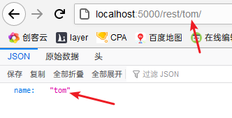

Flask

> 微型的 python web 服务框架

> pip install flask

> flask 项目中的所有配置都基于 flask 实例 , 因为整个服务都是 app.run() 运行起来的 

#### 基本使用

1. 在pycharm中新建flask项目

2. run

3. run函数中可加参数

   ```python
   app.run(debug=True) #开启调试模式, 此时修改代码会自动重启服务, 并且如果报错可以在页面上输入PIN码后直接调试
   # host='0.0.0.0' 设置谁可以访问该服务
   # port=8000 设置服务开启的端口
   ```

#### 准备项目结构

> 项目自带 template 和 static 文件夹 和 app.py

1. 将app.py改名为 manage.py
2. 在项目根目录创建App文件夹, 将template 和 static 移动进去, 然后在该文件夹中新建 models.py 和 views.py 文件
3. 将原 app.py 中的接口方法剪切到 views.py 中, 并使用懒加载的方式定义接口
4. 在 App 文件夹中 __ init __.py 中通过调用 views.py中加载接口的方法并传递 app 实例为参数来初始化接口
5. 在 manage.py 中添加调用 __ init __.py 中调用 views.py 中加载接口方法的方法
6. 所以改造后总的结构就是  运行 manage.py -> 调用了 __ init __.py 中的 create_app() -> 调用了 views.py中的初始化接口方法 init_api(app)

总之改造完之后的三个文件分别如下

```python
# manage.py
from flask import Flask
from flask_script import Manager
from App import create_app

#调用__init__.py中的方法
manager = create_app()

if __name__ == '__main__':
    manager.run()
```

```python
# __init__.py
from App.views import init_api
#调用views.py中创建接口的方法并传入flask实例
def create_app():
    app = Flask(__name__)
    manager = Manager(app=app)
    init_api(app)
    return manager
```

```python
# views.py
#在方法中定义方法, 即为懒加载的方式, 能够避免循环import
def init_api(app):
    @app.route('/')
    def hello_world():
        return 'Hello World!'
```


#### 使用模板

> 使用 flask 中的 render_template() 来渲染模板

> flask 默认的模板路径是 flask实例所在目录同级的 templates 文件夹, 可在 flask 源码的 __ init __ 方法中查看到对该路径的默认配置
>
> 可在创建 flask实例时指定模板路径 app = Flask(__  name __ , template _folder = ' 实际的模板文件夹路径 ')
>
> 也可以在创建蓝图时指定 template_folder 属性

1. 在 templates 文件夹中新建html文件, 在html 中使用 {{ xxx }} 动态加载数据

2. 在接口中使用 render_template() 来渲染

   ```python
   from flask import Blueprint, render_template
   
   blue = Blueprint('blue', __name__)
   
   @blue.route('/')
   def index():
       #渲染模板, 要返回的数据直接以关键字参数传递
       return render_template('index.html', msg='内容')
   ```

   


-----------------------------------------------------------------------扩展库----------------------------------------------------------------------------

#### flask-script

> pip install flask-script

> 该插件定义了启动服务的命令中的一系列参数

1. 改造原来的启动服务文件

   ```python
   from flask import Flask
   #导入Manager
   from flask_script import Manager
   
   app = Flask(__name__)
   #使用Flask实例构建Manger
   manager = Manager(app=app)
   
   @app.route('/')
   def hello_world():
       return 'Hello World!'
   
   #启动服务不再使用app.run(), 改为使用 manager.run()
   if __name__ == '__main__':
       # app.run()
       manager.run()
   ```

2. 此时启动该服务的命令就可以加参数

   `python app.py runserver` 启动服务

   `python app.py runserver -p 8000 -h 0.0.0.0` 指定主机和端口启动服务

   `python app.py runserver -d` 调试模式启动服务

   `python app.py runserver -r` 自动重新加载模式启动服务

   `python app.py runserver --threaded` 多线程模式启动服务,可提高性能

   


#### flask-blueprint

> 路由规划

> pip install flask-blueprint

> 在创建蓝图时可以设置参数, template_folder( 模板路径 ) , static_folder( 静态资源路径 ) , url_prefix( 该蓝图中路径的统一前缀, 用于模块划分 ) 等属性

在上述 准备项目结构 完成的情况下:

1. views.py 中定义接口不再使用 flask 自带的方式, 而使用 blueprint 的方式定义接口

   ```python
   from flask import Blueprint
   #创建蓝图实例
   blue = Blueprint('blue', __name__)
   #定义该蓝图实例下的接口
   @blue.route('/')
   def index():
       return 'index'
   ```

2. 在 __ init __.py 中不再调用 views.py 中懒加载定义接口的方法, 而是直接在 flask实例上注册蓝图实例

   ```python
   from flask_script import Manager
   #导入蓝图实例
   from App.views import blue
   
   def create_app():
       app = Flask(__name__)
       #注册蓝图实例
       app.register_blueprint(blueprint=blue)
       manager = Manager(app=app)
       return manager
   ```

3. 然后可以将 views.py 转化为 python package, 然后在该文件夹中新建不同的文件分不同模块创建不同的蓝图实例, 然后将这些蓝图实例分别注册到 flask 实例上


#### flask-sqlalchemy

> sqlalchemy 针对 flask 定制的版本
>
> 提供对数据库的ORM操作

> `pip install flask-sqlalchemy`

>  执行 `python manage.py db upgrade` 实际上就是在执行最新的迁移文件中的 upgrade 方法
>
> 而迁移文件中还有一个方法 downgrade , 以此类推, 还可以执行 `python manage.py db downgrade` 撤回生成的表

###### 基本构建

1. 在 App/__ init __.py中初始化 SQlAlchemy实例及数据表
2. 在 models.py 中创建 SqlAlchemy 实例并定义模型
3. 在接口中添加执行创建数据表的接口
4. 调用生成数据表的接口, 会在 App目录下生成 sqlite.db 数据库文件
5. 使用 database 连接该文件, 查看数据表
6. 为了使得项目结构规范, 在 App 中新建 ext_init.py 文件用以初始化各种扩展库, 应当把各种扩展库的初始化都集中到这个文件中整合成为一个方法, 然后在 App/__ init __.py 中一次调用

```python
### App/__init__.py
from flask import Flask
from flask_script import Manager

from App.ext_init import init_ext
from App.views import blue, init_api


# 初始化 APP模块
def create_app():
    # 创建 flask实例
    app = Flask(__name__)

    # 初始化接口
    init_api(app)

    # SqlALCHEMY 配置
    # 数据库uri格式: 数据库+驱动//用户名:密码@主机:端口/库名
    app.config['SQLALCHEMY_DATABASE_URI'] = 'sqlite:///sqlite.db'
    app.config['SQLALCHEMY_TRACK_MODIFICATIONS'] = False

    # 使用flask实例初始化各种扩展库, 目前已存在 sqlAlchemy
    init_ext(app)

    # 初始化manager对象
    manager = Manager(app=app)

    # 返回manager对象用以启动服务
    return manager
```

```python
### models.py

from App.ext_init import models


# 创建模型
class User(models.Model):
    id = models.Column(models.Integer, primary_key=True)
    username = models.Column(models.String(16))
```

```python
### views.py

from flask import Blueprint, render_template

from App.models import models

blue = Blueprint('blue', __name__)


# 测试接口
@blue.route('/')
def index():
    return render_template('index.html', msg="内容")


# 使用 SqlAlchemy实例创建数据表接口
@blue.route('/create_db/')
def create_db():
    models.create_all()
    return '创建成功'
```

```python
### ext_init.py
# 该文件使用 flask实例 统一初始化各种扩展库

from flask_sqlalchemy import SQLAlchemy

# 创建SQLAlchemy实例
models = SQLAlchemy()


# 初始化SQLAlchemy实例及数据模型
def init_ext(app):
    # 使用flask实例初始化SQLAlchemy实例
    models.init_app(app)
```

7. 此时 sqlalchemy 已经配置完成, 接下来写接口测试 ORM 操作

   ```python
   # 测试 ORM 操作
   @blue.route('/add_user/')
   def add_user():
       user = User()
       user.username = 'alice'
       # ORM 之保存
       models.session.add(user)
       models.session.commit()
       return '添加成功'
   ```

8. 可扩展删除数据表的接口

   ```python
   # 删除 SqlAlchemy实例上数据表的接口
   @blue.route('/drop_db/')
   def drop_db():
       models.drop_all()
       return '删除成功'
   ```

9. 此时对 ORM操作的引入已经完成, 但是 App/__ init __ .py 中还存在关于 sqlalchemy的配置数据, 应当将这些配置数据单独保存到一个文件中, 在App中新建 settings.py 用来存放所有的配置属性 , 然后在 App/ __ init __.py 中引用

   ```python
   # settings.py
   # 直接使用类的方式定义配置
   class Development:
       # SqlALCHEMY 配置
       # 数据库uri格式: 数据库+驱动//用户名:密码@主机:端口/库名
       # mysql的格式就是: mysql+pymysql://用户名:密码@localhost:3306/库名
       SQLALCHEMY_DATABASE_URI = 'sqlite:///sqlite.db'
       SQLALCHEMY_TRACK_MODIFICATIONS = False
   ```

   ```python
   # 使用from_object的方式从类中加载配置
   app.config.from_object(Development)
   ```

10. 此时如果想要修改数据表, 需要手动执行 drop_all() 然后重新 create_all()

    可以使用 flask-Migrate 插件使得可以命令行更新数据表

    > `pip install flask-migrate`

11. 在 ext_init.py 中初始化 Migrate实例

12. 在 App/ __ init __ .py 中给 manager 添加 Migrate指令集

    ```python
    ### ext_init.py
    # 该文件使用 flask实例 统一初始化各种扩展库
    from flask_migrate import Migrate
    from flask_sqlalchemy import SQLAlchemy
    
    # 创建SQLAlchemy实例
    models = SQLAlchemy()
    # 创建flask-migrate实例
    migrate = Migrate()
    
    
    # 初始化SQLAlchemy实例及数据模型
    def init_ext(app):
        # 使用flask实例初始化SQLAlchemy实例
        models.init_app(app)
        # 使用flask实例和sqlAlchemy实例初始化flask-migrate实例
        migrate.init_app(app, models)
    ```

    ```python
    ### App/__init__.py
    ...
    # 初始化manager对象
    manager = Manager(app=app)
    
    # 给manager对象添加 migrate 指令集
    manager.add_command('db', MigrateCommand)
    ...
    ```

13. 先调用 drop_all() 将所有存在的表删除

14. 然后 `python manage.py db init` ( 第一次使用该指令集之前需要执行 init 初始化生成迁移文件目录 )

15. 然后 `python manage.py db migrate` 生成迁移文件

16. 然后 `python manage.py db upgrade` 将迁移文件内容生成数据表到数据库中

17. 连接数据库查看迁移生成的表

###### orm api

```python
# 查询
# 类名.query.xxx
# xxx 可以是:
# xxx 的所有操作都是 BaseQuery 的父类 query 中的方法, BaseQuery 的 __str__方法为返回当前查询的sql语句
# all() 所有, 返回 list, 其他的接口都返回 BaseQuery类型, 所以如果all()了,那么就不能继续链式调用了
# first() 第一个
# get_or_404(id) 根据id返回值或者404错误
# get(id) 根据id返回值或者None
# filter(类名.属性名.__运算符方法名__('xxx'))
	### 查询等于 filter(类名.属性名.__eq__('xxx'))
    ### 查询小于 filter(类名.属性名.__lt__('xxx'))
    ### 查询包含 filter(类名.属性名.contains('xxx'))
    ### 查询开头 filter(类名.属性名.startwith('xxx'))
    ### 模糊查询 filter(类名.属性名.like('xxx'))
    ### 组合条件 filter(and_(条件1, 条件2))
    ### 组合条件 filter(or_(条件1, 条件2))
    ### 组合条件 filter(not_(条件))
# filter(类名.属性名 数学运算符 值)
# filter_by(属性名 = 值)
# offset(n) 偏移n开始查, offset+limit 分页
# limit(n) 限制查询数目
# order_by('属性 或 -属性') 根据属性正反序排序 , 必须在 offset 和 limit 前使用


# 添加一个
@model_blue.route('/add_user/')
def add_user():
    user = User()
    user.username = 'alice'
    models.session.add(user)
    models.session.commit()
    return 'model op : add user success'


# 添加一组
@model_blue.route('/add_users/')
def add_users():
    users = []
    for i in range(10):
        user = User()
        user.username = 'alice %s' % i
        users.append(user)
    models.session.add_all(users)
    models.session.commit()
    return 'model op : add users success'


# 更新一个
@model_blue.route('/update_user/')
def update_user():
    user = User.query.first()
    user.username = 'vlice'
    models.session.add(user)
    models.session.commit()
    return 'model op : update user success'

# 删除一个
@model_blue.route('/del_user/')
def del_user():
    user = User.query.first()
    models.session.delete(user)
    models.session.commit()
    return 'model op : del user success'
```

###### 模型相关

模型字段属性

```python
# 该模型为 Student的外键模型
class Grade(models.Model):
    g_id = models.Column(models.Integer, primary_key=True, autoincrement=True)
    g_name = models.Column(models.String(16))


# 创建模型, 该模型为模型属性示例
class Student(models.Model):
    # 生成表的名字
    __tablename__ = 'student'
    # 主键, 自增
    id = models.Column(models.Integer, primary_key=True, autoincrement=True)
    # 唯一
    s_name = models.Column(models.String(16), unique=True)
    # 可为空
    s_des = models.Column(models.String(100), nullable=True)
    # 时间类型, 默认当前时间
    s_time = models.Column(models.DateTime, nullable=False, default=datetime.utcnow)
    # 定义外键
    s_grade = models.Column(models.Integer, models.ForeignKey(Grade.g_id))
```

模型继承

> 模型存在继承时 , 会将所有子模型的属性都融合到父模型中, 这样显然不符合逾期要求
>
> 在基模型中添加 \__abstract__=True 字段, 在生成数据表时将不会生成该基模型的数据表, 而是独立生成各个子模型, 这样就实现了模型继承

###### 数据库连接池设置

> 数据库连接池的设置可以在 flask 实例中设置, 也就是在 settings.py 中设置
>
>  `SQLALCHEMY_POOL_SIZE` 最多开几个连接
>
>  `SQLALCHEMY_POOL_TIMEOUT` 连接多久连接不上就报超时
>
>  `SQLALCHEMY_POOL_RECYCLE` 连接多久不用就回收


#### views

> 即接口, 通过注解的方式定义接口

###### 接口相关

> 先在路径中添加参数位置 , 然后在参数中按照参数名字接收

```python
# 接收参数, 默认转化为 string类型
@blue.route('/<con>/')
def get_param_def(con):
    return render_template('index.html', msg=con)


# 可限定类型 int, float, string(默认), uuid, path, any(a,b) 只接受列出的值
# 接收参数, 并指定接收参数的类型, 不是这个类型的请求不接受
@blue.route('/<int:con>/')
def get_param(con):
    return render_template('index.html', msg=con)


# 一个方法可以加多个路径装饰器
@blue.route('/get_var/<int:con>/')
@blue.route('/get_var/<string:con>/')
def get_var(con):
    return render_template('index.html', msg=con)


# 默认只支持 get, head, options 请求
# 通过设置 methods 指定支持的请求方式
@blue.route('/methods/', methods=['GET', 'POST', 'DELETE'])
def methods():
    return '支持多种方式的请求'


# 重定向
@blue.route('/redirect/')
def red():
    # 硬编码的路径
    # return redirect('/')
    # 使用 url_for() 反向解析的方式指定路径, 格式为: 蓝图实例名.方法名
    # url_for() 方法同样适用于页面中的地址指定
    # return redirect(url_for('blue.index'))
    # 使用反向解析并传递参数, 直接在参数列表中以关键字参数的方式传参数
    return redirect(url_for('blue.get_var', con=123))
```


###### Request

> 直接导包使用
>
> request.args GET请求的参数
>
> request.form POST, PUT, PATCH请求的参数

```python
from flask import Blueprint, render_template, redirect, url_for, request

# request, 直接导包使用, 该对象属性值不能修改
@blue.route('/get_request/')
def get_request():
    return request.host
```


###### Response

> 可返回 字符串
>
> 可返回 (字符串, 状态码)
>
> 可返回 Response(字符串, 状态码)
>
> 可返回 make_response(字符串, 状态码)
>
> 可返回 abort(错误状态码) 直接返回错误码, 同时可配合 @blue.errorhandler(错误码) 进行错误页面的定制

```python
# 返回 response
@blue.route('/get_response/')
def get_response():
    response = make_response('this is response', 201)
    return response


# 返回 response
@blue.route('/get_response_res/')
def get_response_res():
    response = Response('this is response', 201)
    return response


# 直接返回错误码
@blue.route('/get_error_code/')
def get_error_code():
    return abort(403)


# 定制错误页面
# blue.errorhandler 仅适用于该蓝图实例
# app.errorhandler 可适用于整个项目
@blue.errorhandler(403)
def page_for_403(e):
    return "啊哦 403 没有登录"
```


#### 会话技术

###### cookies

> 浏览器本身不支持中文的 cookies
>
> 如果设置的是中文cookie , 那么flask 会自动中文进行转换, 在获取cookie的时候再自动转换回来

在 response 中设置 cookies

```python
# 设置 cookies
@blue.route('/set_cookies/')
def set_cookies():
    response = Response("设置 cookies 成功")
    response.set_cookie('name', 'alice')
    return response
```

在 request 中获取 cookies

```python
# 获取 cookies
@blue.route('/get_cookies/')
def get_cookies():
    name = request.cookies.get('name') or ''
    return '获取到cookie的值为:%s' % name
```


###### session

> 直接导包使用 session

> session应当存在于服务器上, 但是flask没有内置的 orm 模块, 而存到内容中又不太安全
>
> 所以 flask 对 session进行 序列化, base64, zlib压缩 的一系列操作, 然后将处理后的数据和其原数据对应的hash值一同传给前端, 保存到cookies中
>
> 下次前端发送请求给服务端时, 服务端首先对cookies 中存的 session值进行hash值比对, 确保数据未被篡改, 然后解析出 session 数据
>
> 综上所述, flask 中将 session值存到 cookies 中

首先应当设置 SECRET_KEY

```python
# 因为此处使用的是 app.config.from_object(Development) 加载配置, 所以可以直接将 secret key设置到配置对象中
# 开发环境配置, 该文件中应当包含多套环境配置, 以满足不同的需求
class Development:
    # SqlALCHEMY 配置
    # 数据库uri格式: 数据库+驱动//用户名:密码@主机:端口/库名
    # mysql的格式就是: mysql+pymysql://用户名:密码@localhost:3306/库名
    SQLALCHEMY_DATABASE_URI = 'sqlite:///sqlite.db'
    SQLALCHEMY_TRACK_MODIFICATIONS = False

    # 设置session, 值随便写点什么
    SECRET_KEY = 'suibianxiedianshenme'
```

设置 session

```python
# 设置 session
@blue.route('/set_session/')
def set_session():
    session['name'] = 'alice'
    return '设置 session 成功'
```

获取 session

```python
# 获取 session
@blue.route('/get_session/')
def get_session():
    return '获取到的 session值为: %s' % session.get('name')
```


使用 flask-session 插件将 session 存储到服务端

> `pip install flask-session`

1. 在 settings.py 中配置 SESSION_TYPE

   更多配置参照官方文档 https://flask-session.readthedocs.io/en/latest/, 直接在 settings.py 中加配置字段

   ```python
   # 开发环境配置, 该文件中应当包含多套环境配置, 以满足不同的需求
   class Development:
       # SqlALCHEMY 配置
       # 数据库uri格式: 数据库+驱动//用户名:密码@主机:端口/库名
       # mysql的格式就是: mysql+pymysql://用户名:密码@localhost:3306/库名
       SQLALCHEMY_DATABASE_URI = 'sqlite:///sqlite.db'
       SQLALCHEMY_TRACK_MODIFICATIONS = False
   
       # 设置session
       SECRET_KEY = 'suibianxiedianshenme'
       # 设置session 存到 redis 中
       SESSION_TYPE = 'redis'
   ```

2. 在 ext_init.py 中初始化 flask-session 插件

   ```python
   # 该文件使用 flask实例 统一初始化各种扩展库
   from flask_migrate import Migrate
   from flask_session import Session
   from flask_sqlalchemy import SQLAlchemy
   
   # 创建SQLAlchemy实例
   models = SQLAlchemy()
   # 创建flask-migrate实例
   migrate = Migrate()
   
   
   # 初始化SQLAlchemy实例及数据模型
   def init_ext(app):
       # 使用flask实例初始化SQLAlchemy实例
       models.init_app(app)
       # 使用flask实例和sqlAlchemy实例初始化flask-migrate实例
       migrate.init_app(app, models)
   
       # 初始化 flask-session
       Session(app)
   ```

3. 此时按照原来的方式操作 session 时, 会自动保存到 redis 中


#### Template

> flask 模板引擎使用 jinja2, 是 django模板引擎的改造版

> 在模板中使用静态资源也可以使用 url_for() 
>
> < link  rel='stylesheet' href="{{ url_for('static', filename='css/index.css') }}" >
>
> 等同于
>
> < link  rel='stylesheet' href="/static/css/index.css" >
>
> 静态资源的检索位置可以在 创建 flask实例 或者 蓝图实例 时指定

###### 基本

```html
<!-- for -->
<!-- for 中可直接使用迭代器 loop,获取迭代信息 -->

<li>{{ loop.index }}-{{ student }}</li>


<!-- if -->
<!-- if中支持使用 == 判断相等, django中只能使用 ifequal -->

<h1>if判断</h1>

```

###### block

```html
<!--父模板挖坑-->


```

```html
<!--子模板继承并填坑-->


{{ super() }} <!--保留父模板中该坑原有的内容-->
<h1>子模板填坑内容</h1>

```

###### include

```html
<!--包含页面-->

```

###### macro

> 定义一个生成 html 的方法, 该方法可在该页面中其他地方调用直接生成 html

```html
<!--定义生成 html 的方法-->

<h1>方法定义的html内容:{{name}}</h1>


<!--一般将所有的macro写到一个单独的文件中,然后在使用的地方导入-->

<!--在页面其他地方调用该方法生成html-->
{{ hello('alice') }}
{{ hello('blice') }}
{{ hello('vlice') }}
```

###### filter

> 使用格式为 : {{ 变量|过滤器|过滤器... }}
>
> 过滤器数量过多, 可查看官方文档


#### flask-bootstrap

> `pip install flask-bootstrap`

1. 在 ext_init.py 中初始化该插件

   ```python
   from flask_bootstrap import Bootstrap
   ...
   # 初始化 flask-bootstrap
   Bootstrap(app)
   ```

2. 自己的页面继承 bootstrap/base.html , 然后在 boostrap官网上 copy 页面控件到自己的页面中填 base.html 中留的坑

   ```html
   <!-- 这是一个使用了 bootstrap 的导航栏的例子 -->
   <!-- 注意填坑的时候不要把原有的内容覆盖掉 -->
   
   
   
       {{ super() }}
   
       <nav class="navbar navbar-default">
           <div class="container-fluid">
               <!-- Brand and toggle get grouped for better mobile display -->
               <div class="navbar-header">
                   <button type="button" class="navbar-toggle collapsed" data-toggle="collapse"
                           data-target="#bs-example-navbar-collapse-1" aria-expanded="false">
                       <span class="sr-only">Toggle navigation</span>
                       <span class="icon-bar"></span>
                       <span class="icon-bar"></span>
                       <span class="icon-bar"></span>
                   </button>
                   <a class="navbar-brand" href="#">Brand</a>
               </div>
   
               <!-- Collect the nav links, forms, and other content for toggling -->
               <div class="collapse navbar-collapse" id="bs-example-navbar-collapse-1">
                   <ul class="nav navbar-nav">
                       <li class="active"><a href="#">Link <span class="sr-only">(current)</span></a></li>
                       <li><a href="#">Link</a></li>
                       <li class="dropdown">
                           <a href="#" class="dropdown-toggle" data-toggle="dropdown" role="button" aria-haspopup="true"
                              aria-expanded="false">Dropdown <span class="caret"></span></a>
                           <ul class="dropdown-menu">
                               <li><a href="#">Action</a></li>
                               <li><a href="#">Another action</a></li>
                               <li><a href="#">Something else here</a></li>
                               <li role="separator" class="divider"></li>
                               <li><a href="#">Separated link</a></li>
                               <li role="separator" class="divider"></li>
                               <li><a href="#">One more separated link</a></li>
                           </ul>
                       </li>
                   </ul>
                   <form class="navbar-form navbar-left">
                       <div class="form-group">
                           <input type="text" class="form-control" placeholder="Search">
                       </div>
                       <button type="submit" class="btn btn-default">Submit</button>
                   </form>
                   <ul class="nav navbar-nav navbar-right">
                       <li><a href="#">Link</a></li>
                       <li class="dropdown">
                           <a href="#" class="dropdown-toggle" data-toggle="dropdown" role="button" aria-haspopup="true"
                              aria-expanded="false">Dropdown <span class="caret"></span></a>
                           <ul class="dropdown-menu">
                               <li><a href="#">Action</a></li>
                               <li><a href="#">Another action</a></li>
                               <li><a href="#">Something else here</a></li>
                               <li role="separator" class="divider"></li>
                               <li><a href="#">Separated link</a></li>
                           </ul>
                       </li>
                   </ul>
               </div><!-- /.navbar-collapse -->
           </div><!-- /.container-fluid -->
       </nav>
   
   ```

   


#### flask-debugtoolbar

> 就是 django 中的 debugtoolbar

> `pip install flask-debugtoolbar`

1. 在 ext_init.py 中初始化

   ```python
   # 初始化 flask-DebugToolbar
   DebugToolbarExtension(app)
   ```

2. 在 settings.py 中配置 SCRET_KEY, 如果前面已经配置了, 那么就不用再配置了

3. 注意 flask 配置应当打开调试模式 , 在settings.py 中设置

   ```python
   # 开启调试模式
   DEBUG = True
   ```

   


   

####    flask-caching

> 缓存接口返回数据

> `pip install flask-caching`

1. 在 ext_init.py 中初始化

   ```python
   # 创建flask-cache实例
   cache = Cache(config={'CACHE_TYPE': 'simple'})
   
   # 初始化各种插件实例
   def init_ext(app):
       ...
       # 初始化 flask-cache
       cache.init_app(app)
   ```

   CACHE_TYPE配置

   

   其他配置见官网文档 http://www.pythondoc.com/flask-cache/index.html

2. 在接口上使用缓存的装饰器

   ```python
   # 使用缓存
   @blue.route('/index_with_cache/')
   @cache.cached(timeout=60)
   def index_with_cache():
       print('cache接口')  # 使用了cache的接口只会在第一次执行方法中的内容,之后会使用缓存
       return '使用了flask-caching的接口'
   ```

   

#### flask-mail

> 发邮件的插件

> `pip install flask-mail`

1. 在 ext_init.py 中初始化插件

   ```python
   # 创建flask-mail实例
   mail = Mail()
   
   # 初始化各种插件
   def init_ext(app):
    	...
       # 初始化 flask-mail
       mail.init_app(app)
   ```

2. 在 settings.py 中设置 mail

   ```python
   	...
       # 设置 flask-mail
       MAIL_SERVER = 'smtp.163.com'  # 163邮箱域名
       MAIL_PORT = 25  # 163 邮箱服务器端口
       MAIL_USERNAME = 'z2234261505@163.com' # 发送者账号
       MAIL_PASSWORD = 'IFKMTWLYEIBJDPXV'  # 这个就是生成的授权码
       MAIL_DEFAULT_SENDER = MAIL_USERNAME
   ```

3. 发送邮件

   ```python
   from flask import Blueprint
   from flask_mail import Message
   from App.ext_init import mail
   
   eBlue = Blueprint('eBlue', __name__)
   
   @eBlue.route('/send_email/')
   def send_email():
       msg = Message("这是标题",
                     sender="z2234261505@163.com",
                     recipients=["z2234261505@163.com"])
       msg.body = '这是正文'
       mail.send(msg)
       return '发送成功'
   ```

   


#### flask-restful

> `pip install flask-restful`

###### 基本使用

1. 在 ext_init.py 中初始化

   ```python
   # 初始化 flask-restful实例
   api = Api()
   # 初始化各种插件
   def init_ext(app):
       ...
       # 初始化 flask-restful
       api.init_app(app)
   ```

2. 在 views 中创建类视图, 继承 flask-restful 的 Resource 并定义请求处理方法

   ```python
   from flask_restful import Resource
   
   
   # 使用 flask-restful 定义的类视图
   class RestView(Resource):
       # 接收参数
       def get(self, name):
           return {'name': name}
   ```

3. 在 views/ \__init__.py 中给 api 实例注册路由

   ```python
   def init_api(app):
       ...
       # 在 flask-restful 实例上注册路由
       # 路由中设置参数的方式同flask
       api.add_resource(RestView, '/rest/<string:name>/')
   ```

4. 访问测试

   

   

###### 数据序列化

> 未经序列化的对象无法直接返回
>
> 
>
> 
>
> 所以如果要返回对象, 应当首先将对象序列化转换为 json 字符串

1. 创建序列化规则

   ```python
   # 定义序列化规则
   # user对象的序列化规则
   user_fields = {
       'id': fields.Integer,
       'username': fields.String
   }
   # 要返回对象的序列化规则, 返回的对象中包含了user对象, 所以使用Nested来级联user的规则
   res_fields = {
       'state': fields.Integer,
       'msg': fields.String,
       'data': fields.Nested(user_fields)
   }
   ```

2. 使用该规则对返回数据序列化

   ```python
   	# 未经序列化的对象数据无法直接传输
       # 使用marshal_with装饰器设置序列化规则用以序列化返回的数据
       @marshal_with(res_fields)
       def post(self, name):
           user = User()
           user.username = 'alice'
           user.id = 1
           res = {
               'state': 200,
               'msg': 'post success',
               'data': user
           }
           return res
   ```

3. 访问测试

   

4. 如果返回的对象中包含list, 那么使用 field.List( field.xxx ) 来定义序列化规则

   ```python
   # 定义序列化规则
   # user对象的序列化规则
   user_fields = {
       'id': fields.Integer,
       'username': fields.String
   }
   # 返回的数据中包含list数据的序列化规则
   list_res_fields = {
       'msg': fields.String,
       'data': fields.List(fields.Nested(user_fields))
   }
   
   # 使用 flask-restful 定义的类视图
   class RestView(Resource):
       # 如果返回的数据包含list, 那么使用field.List() 来定义序列化规则
       @marshal_with(list_res_fields)
       def put(self, name):
           user_list = []
           for i in range(10):
               user = User()
               user.username = 'alice' + str(i)
               user_list.append(user)
           list_res = {
               'msg': 'ok',
               'data': user_list
           }
           return list_res
   ```

   此时返回的结果为

    

###### 扩展的abort

> flask-restful 中的 abort 扩展了 flask 中的 abort, 可定义错误提示
> 调用 abort 时传递的关键字参数都会作为错误提示的 key 和 value 返回

```python
    # flask-restful 中的 abort 扩展了 flask 中的 abort, 可定义错误提示
    # 调用 abort 时传递的关键字参数都会作为错误提示的 key 和 value 返回
    def patch(self, name):
        # abort(错误码, 错误提示)
        abort(400, msg='自定义的错误提示1', message='自定义的错误提示2')
```


#### hook函数

> hook函数可以使用 @app.函数名 来全局定义, 也可以使用 @blue.函数名 单个定义在蓝图实例上

> hook函数包括:
>
> * before_first_request：在处理第一个请求前运行。
> * before_request：在每次请求前运行(视图函数执行前)。
> * after_request：如果没有未处理的异常抛出，在每次请求后运行(视图函数执行后)。
> * teardown_request：在每次请求后运行，即使有未处理的异常抛出。


#### 内置对象*4

###### [request](#request)

###### [session](#session)

###### g

> 保存数据为全局, 在一个 hook 函数中保存数据, 然后在另外一个接口中获取该数据

> g 中的数据也可以在模板中 {{ g.xxx }} 来使用

```python
from flask import Blueprint, g

# 使用 g 保存全局数据示例
gBlue = Blueprint('gBlue', __name__, url_prefix='/g')


# 在 hook 函数中保存数据到 g 中
@gBlue.before_request
def set_g():
    g.msg = 'global data'


# 在其他接口中使用 g 中保存的数据
@gBlue.route('/get_g/')
def get_g():
    return 'get g data: %s' % g.msg
```

###### config

> 就是 flask 实例的所有配置

> 在模板中通过 {{ config }} 获取

> 在服务器代码中通过 current_app.config 获取, 在 app.run() 之后才能获取到
>
> ```python
> # 获取 config 数据
> @gBlue.route('/get_config/')
> def get_config():
>     config = current_app.config
>     for key in config.keys():
>         print(key + ' = ' + str(config[key]))
>     return 'get config'
> ```


#### 工具

###### 密码加密

> 直接使用 flask 自带的加密工具

```python
from werkzeug.security import generate_password_hash


# 使用hash加密的方式加密密码
def password_secret(password):
    return generate_password_hash(password)

# 使用hash解密的方式验证密码
def check_password(password, truepass):
    return check_password_hash(password, truepass)
```

###### 消息闪现

> 适用于登录失败时给页面提示
>
> 实际上就是一次性的 session

1. 后台接口

   ```python
   # 假设这是一个登录接口
   @fBlue.route('/show_flash/', methods=['GET', 'POST'])
   def show_flash():
       # 返回登录页面
       if request.method == 'GET':
           return render_template('flash_notice.html')
       # 接收登录请求并返回登录失败的消息
       if request.method == 'POST':
           flash('登录失败')
           return redirect(url_for('fBlue.show_flash'))
   ```

2. 前端展示 flashed 

   ```python
   <!-- 显示后台保存的登录失败的消息 -->
   
       <span>{{ msg }}</span>
   
   <!-- 提交登录请求的表单 -->
   <form action="{{ url_for('fBlue.show_flash') }}" method="POST">
       <button type="submit">登录</button>
   </form>
   ```

   

###### 发送短信

> 可以使用 网易云信 等平台


