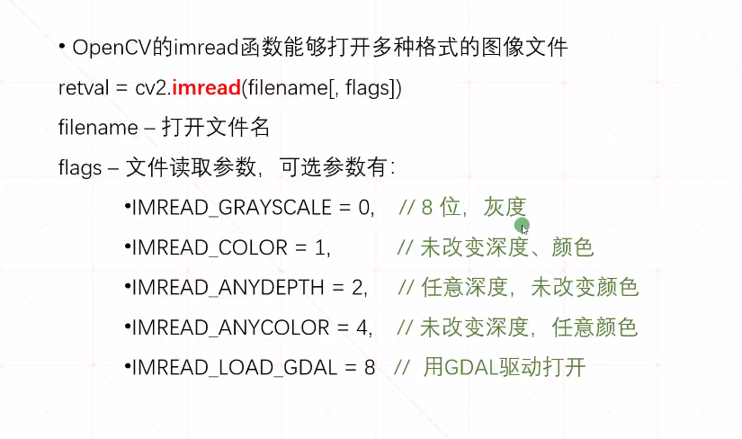

# Python 3.6.5

> pycharm 中 ctrl+P 查看函数参数

pip : 包管理工具

pip list : 列出目前有的包

pip install <package_Name>[==version] 安装包

pip uninstall <package_Name> 卸载包

pip freeze > <file_Name.txt> 输出目前有的包信息到文件中

pip install -r <file_Name.txt> 通过包信息文件安装包

python -m pip install --upgrade pip 升级pip


> **缩进严格**

> pip属于python自带的包管理工具
>
> ​	直接在命令行中使用pip安装包将安装到python的全局包环境下
>
> Anaconda, virtualenv 等属于第三方的python包环境管理工具
>
> ​	直接在命令行中使用conda安装包将安装到Anaconda的包环境中


## 内存机制

* 对于变量 , 如果两个变量的值一样且值在内置范围之内 , 那么它们在内存中的地址一样 , 即使没有经过引用赋值操作

  ```python
  name = 'alice'
  name1= 'alice'
  #因为赋值一样, name和name1使用同一段地址
  ```

* 使用 input函数 多次输入相同内容给不同变量 ,它们的地址不同


## 常用函数

### help函数

`help(print)` 查看print函数的帮助信息

### type函数

`type(xxx)`返回数据类型

### isinstance函数

`isinstance(变量,类型)` 返回某变量是否是某类型

### print函数

* `print(a,b,c)` a,b,c中间添加空格依次输出
* sep修改默认的分割字符 , `print(a,b,c,sep='#')`
* `print('abc \n abc')` 默认换行符为 \n
* 加r原样输出不转义 `print(r'xxx')`
* 格式化输出 `print('%s, %s, %s' % (a, b, c))`

### input函数

* `input()` 接受输入并返回输入值
* `input('请输入: ')` 带提示的输入
* 返回值为字符串

### id函数

* `id(xxx)` 返回变量xxx的地址

### bin函数

* `bin(xxx)`返回xxx的二进制数 , 以0b开头

* 负数的二进制数为  其正数的二进制数按位取反然后加1,使用-0b做为前缀标识
* 八进制以 0o 开头
* 十六进制以 0x 开头
* 使用 `int(xxx)` 可将其他进制的数转换为十进制
* 八进制转二进制 , 直接一位转三位二进制 ; 十六进制转二进制 , 直接一位转四位二进制

### range函数

* `range(a, b)` 返回从a开始, 到b为止的包含a, 不包含b的整数序列
* `range(a)` 返回从0开始 , 到a为止 , 包含0, 不包含a的整数序列

### max函数

* `max(<列表>)` 返回列表中的最大值

### sorted函数

* `sorted(<列表>)` 默认升序排列 , 设置参数 reverse = True 为降序 

### enumerate函数

* `enumerate(<可迭代变量>)` 枚举化可迭代变量

  ```python
  #对其迭代可返回 下标和值
  for index,value in enumerate([1,2,3]):
      pass
  ```


### locals函数

* `locals()` 用于函数中 , 返回该函数的成员变量和成员函数 , 返回字典类型值

### globals函数

* `globals()` 用于全局中 , 返回全局变量和函数的字典类型值

### sleep函数

```python
import time
#主线程休眠
time.sleep(2)
```

### map函数

```python
#遍历可迭代对象并使用给定的函数对其每一项进行操作
l1=[1,2,3]
map(lambda x:x+1,l1) #遍历l1, 执行完后l1中的元素都会加一
```

### reduce函数

```python
#导入模块
from functools import reduce
#每次取可迭代对象中的 两项元素 并根据给定的函数对其操作然后逐项往后推移操作
t1 = (1,2,3)
#此处返回值为各项累加结果
res = reduce(lambda x,y : x+y , t1)
```

### filter函数

```python
list1 = [1,2,3,4,5]
filter(lambda x : x>10, list1) #返回大于10的值
```

### sorted函数

```python
list1 = [2,3,1,5,6]
sorted(list1, key = lambda x : x) #升序排序
```

### dir函数

```python
#返回对象中的所有成员
dir(对象实例)
```

### ord函数

```python
#字符转unicode码返回,可转汉字
ord('A')
```


## 常用模块

### random

```python
import random
random.randint(1,10) #返回1~10之间包含1和10的整数
#返回0~1之间的随机数
random.random()
#返回1~10之间包含两端步长为2的整数随机数
random.randrange(1,10,2)
#返回可迭代对象中随机的一项
list1 = [1,2,3,4,5]
random.choice(list1)
#对可迭代对象洗牌后返回
random.shuffle(list1)
```

### os

```python
import os

os.path.isabs('路径') #判断是否是绝对路径
os.path.dirname(__file__) #获取当前文件所在路径
os.path.abspath('相对路径') #相对路径转绝对路径
os.path.split('文件路径') #将文件路径分割成 文件路径 和 文件名
os.path.splitpath('文件路径') #将文件路径分割成 文件路径加文件名 和 文件扩展名
os.path.getsize('文件路径') #获取文件大小(字节)
os.path.join('路径','路径','文件名'...) #拼接路径
os.path.exists('路径') #判断是否存在

os.getcwd() #获取当前工作路径
os.listdir('路径') #返回路径下的所有文件夹和文件名称
os.mkdir('路径') #创建目录, 存在则报错
os.rmdir('路径') #删除目录, 只能删除空目录 
os.removedirs('路径') #删除多个目录, 只能删除多层的空目录
os.remove('文件路径') #删除文件
os.chdir('路径') #切换当前工作路径

```

### sys

```python
import sys

#获取对指定地址的引用个数(有多少个引用指向该地址)
sys.getrefcount(x)
#返回当前所有的source root路径
sys.path
#返回当前python版本
sys.version
#返回在执行py文件时传入的参数列表
sys.argv
```

### inspect

```python
import inspect
#返回该类的搜索顺序(当调用一个父类方法时,优先使用哪个父类中的方法)
inspect.getmro(类名)
```

### time

```python
import time

#返回当前时间戳
time.time()
#线程休眠3s
time.sleep(3)
#将时间戳转为字符串
time.ctime(时间戳)
#将时间戳转为元组格式
time.localtime(时间戳)
#将元组格式转为时间戳
time.mktime(元组格式时间)
#格式化时间
time.strftime('%Y-%m-%d %H:%M:%S'[,时间戳或元组格式])
#字符串时间转元组格式
time.strptime('2020/02/21', '%Y/%m/%d')
```

### datetime

```python

import datetime

#返回时间对象
datetime.time
#返回日期对象
datetime.date
#返回当前系统时间
now = datetime.datetime.now()
#返回时间差用于时间的推算
timedel = datetime.timedelta(hours=2)
#使用时间差推算时间,返回推算后的时间
restime = now - timedel
```

### hashlib

```python
import hashlib
#加密类库
#md5 sha1 sha256为单向加密, 单向加密对比加密后的结果来判断
#base64为可逆加密

#使用不同的加密方式进行加密
mes = "要加密的内容"
#返回md5加密对象
md5 = hashlib.md5(mes.encode('utf-8'))
#从md5加密对象中获取十六进制的加密结果
md5.hexdigest()
```

----

### numpy

> 多维数组和矩阵运算函数库包

```python
#约定俗成的别名为np
import numpy as np

#对于第三方包在pycharm的Documentation中有使用说明
#多维数组
np.ndarray
#轴的数量
np.ndarray.ndim
#维度
np.ndarray.shape
#所有元素数量
np.ndarray.size
#元素数据类型
np.ndarray.dtype
#元素的字节数
np.ndarray.itemsize
#数组的真实物理地址
np.ndarray.data
```

### Matplotlib

> python中的绘图库, 可以和numpy结合使用来实现 matlab的功能

### segyio*

> python中用于读取SEG-Y文件的包 , 可以使用它从SEG-Y文件中读取道头和数据
>
> SEG-Y文件 : 地震勘探数据文件
>
> segyio+numpy+matplotlib 可以实现SEG-Y记录浏览器


### 第三方

1. 先下载第三方包

   1. 使用pip

      ```cmd
      >pip install pillow
      ```

   2. (如果使用的是idea提供的python环境)在idea中导入file->settings->当前项目->project interpreter->点击+安装第三方包

2. import

3. 使用


## 注释

* 单行注释 #
* 多行注释 ''' ''' 三引号


## 变量类型

> 弱类型 
>
> 命名建议下划线
>
> 没有常量关键字 , 建议命名为全大写

### #可变类型和不可变类型

* 不可变类型 : 对象指向的地址上的值不可改变 , 对对象进行修改时, 重新分配内存空间
  * int , float , str , tuple
* 可变类型 : 对象指向地址的值可以改变
  * dict , list


### 字符串

* 使用 ''' ''' 三引号定义的字符串保持原样

* 强转为字符串 `str(xxx)`

* format函数 , 使用 { } 占位

  ```python
  print('一共有{}只'.format(5))
  ```

* `'a' in 'abc'` 使用 in关键字 判断是否存在子串 , 返回bool

* `'a' not in 'abc'` 使用 not in关键字判断是否存在子串 , 返回bool

* `'名字是%s' % name` 使用%格式化字符串

* `r'abc \t'` 加r不使用转义

* `'abc'[0]` 使用[]获取字符

* `'xxxxx'[start: end: 方向和步长]`

  * `'abcdef'[0:5]` 获取范围内的字符, 包前不包后
  * `'abcdef'[3:] 或 'abcdef'[:4]` 获取范围内字符 , 最后一位的标为-1, 往前以此类推
  * `'xxxxxxxx'[::-1]` 倒序输出 , 最后的 :-1 表示反方向 , 此时前边 : 左右的两个数字应当为反方向

**字符串内置函数**

* ***编码和解码***

  > 对于非英文的语言, 在传输的过程需要进行编码和解码操作 , utf-8标准包含了所有语言的编码规则 , 所以使用utf-8格式进行编码和解码
  * `'xxx'.encode('utf-8')` 编码
  * `'xxx'.decode('utf-8')` 解码
  * 在python3.0以后 , 默认编码和解码中的参数为utf-8 

* ***使用分隔符连接字符串***

  ```python
  res = '-'.join('abc')
  #返回的res为 a-b-c
  ```

### 列表

```python
#列表
names = ['a','b','c']
#空的列表
l2 = []
#使用下标
names[0]
names[-1]
#获取长度
len(names)
#使用循环
for i in names:
    print(i)
#使用 in 关键字
'a' in names
#删除元素, 删完长度实时变化, 不要边删除边遍历
del names[1]
#删除第一个匹配的元素 , 正常返回none , 找不到抛异常
names.remove('a')
#删除最后一个元素 , 返回该元素
names.pop()
#删除指定元素 , 返回该元素
names.pop(2)
#清空列表
names.clear()
#混合类型的列表
list1 = ['a', 'b', 'c', 1, 2, 3]
#列表的截取
list1[1:3]
list1[-3:-1]
list1[::-1]
#追加元素
list1.append('zhangsan')
#追加列表
list1.extend(['e', 'f', 'g'])
#合并列表
list1 + names
#插入元素
list1.insert(1, 'lisi')
#使用*
multilist = [1,2]*3 #返回 [1,2,1,2,1,2]
#强转为list , 可迭代类型才能转换
list(range(1,10))
#翻转列表
names.reverse()
#列表自带的升序排序
names.sort()
#列表自带的降序排序
names.sort(reverse=True)
#统计次数
names.count('a')
#拆包列表
*[1,2,3] #拆解为三个数 1 2 3
```

### 元组

```python
#元组中的内容不可修改

#空元祖
tp1 = ()
#一个元素的元组
tp2 = (1,)
#强转为tuple
tuple([1,2,3])
#下标查询元素
tp2[1]
tp2[-1]
tp2[::-1]
#最大值最小值
max(tp2)
min(tp2)
#求和
sum(tp2)
#长度
len(tp2)
#统计
tp2.count('a')
#返回指定元素的下标
tp2.index('a')
#拆包
t1,t2,t3 = (1,2,3)
#匹配拆包 , 装拆包符号为 * 
t1,*t2,t3 = (1,2,3,4,5) #结果为t1=1 , t2=[2.3.4] , t3=5
a,*b = (1,) #结果为 a = 1 , b = []
#拆包列表
print(*[1,2,3]) #打印结果为 1 2 3
#使用 +
tp3 = (1,2)+(3,4)
#使用 *
tp3 = (1,2)*3
```

### 字典

```python
#dict is map

#empty dict
dict1 = {}
dict1 = dict() # list() , tuple()
#normal dict
dict1 = { 'id':'adsjflj12kjk','name':'alice' }
#force transform to dict
dict1 = [('name','alice'),('age',18)]
#add or modify 
dict1['id'] = 'dafdf1l'
#get value
dict1['id'] #would throw error
dict1.get('id'[,'abcs']) #would return none , could set default value with the second attribute,recommand!
#delete element
del dict1['id']
#pop an element , return the value ; if the key not exsits , return default value
dict1.pop('id'[,default])
#randomly pop an element
dict1.popitem()
#clear dict
dict1.clear()

#foreach in dict
for key in dict1:
    key #key
    dict1[key] #value
#dict`s function
#get all keys&values
dict1.items() # return [(x,x),(x,x)...]
#使用拆包进行遍历
for key,value in dict1.items():
    pass
#get all keys
dict1.keys()
#get all values
dict1.values()
# use 'in' judge key
'id' in dict1

#update dict1 by dict2
dict1.update(dict2)

#generate a dict ,by using a list`s items be its keys ,and the dict`s values are 'None'
#if set the default value , the values of dict would all be the default value
list1=[1,2,3]
dict.fromkeys(list1[,default]) #return is { 1:None , 2:None, 3:None }
```

### 集合

```python
#无序的不重复的数组

#create set
s1 = set() #can only use 'set' function to create a empty set
s1 = {1,2,3}

#使用set去重
list1=[1,1,2,2,3]
set(list1)

#add element
s1.add('abc')
#add elements
t1 = (1,2)
s1.update(t1)

#delete element
s1.remove('a') #would throw error
s1.pop() #pop the frist one 
s1.clear() #clear
s1.discard('a') #would not throw error if the element not exists

# use 'in' and 'not in'
'a' in s1

#use ==
set1 = {1,2,3}
set2 = {1,2,3}
set1 == set2 # return True
#use -
set1-set2 # 返回差集
set1.difference(set2) # 使用差集函数
#use &
set1 & set2 # 返回交集
set1.intersection(set2) # 使用交集函数
#use |
set1 | set2 # 返回并集
set1.union(set2) # 使用并集函数
#使用 ^ 求对称差集 , 即两个列表中的不同元素
set1 ^ set2
set.symmetric_difference(set2) #使用对称差集函数

```


## 关键字

### 查看所有关键字

```python
import keyword
print(keyword.kwlist)
```

### pass

* 可以作为在应当有语句的位置的占位语句

  ```python
  if <条件>:
      <语句>
  else:
      pass #在else下应当包含语句, 如果不写语句, 可以使用pass占位, 否则报错
  ```

* 相当于continue

  ```python
  for i in range(10):
      pass #相当于continue
  ```

### break

* break

### continue

* continue

### global

* 如果在函数中修改 不可变类型的全局变量 , 需要先使用 global 关键字在函数中声明

  ```python
  #不可变类型的全局变量  int float str tuple
  name  = 'alice'
  
  #在函数中修改不可变类型的全局变量
  def add():
      global name
      name = 'vlice'
  ```

  


## 运算符

### 算数运算符

* `a ** b` a的b次方
* `a // b` a除b取整
* 字符串使用 * 时 , `'a' * 5 返回 'aaaaa'`

### 逻辑运算符

* `is` 判断两个变量地址是否相同
* `and` 逻辑与
* `or` 逻辑或
* `not` 逻辑非
* `&` 按位与
* `|` 按位或
* `~` 按位非
* `^` 按位异或 , 相同为0 , 不同为1
* `<<` 左移 , 补1 , 相当于乘以2的移动位数次方
* `>>` 右移 , 补与原第一位相同的值 , 相当于除以2的移动位数次方然后取整

### 三目运算

* `结果1 if 表达式 else 结果2` 表达式为真执行结果1 , 表达式为假执行结果2

### * 和 **

* *为拆装包符号 , 当作用于可迭代变量前时 , 执行拆包的操作 , 当作用于拆解后的值前时 ,执行装包操作
* **同理为两层拆装包符号 , 作用于字典类型前


### 运算符重载


## 条件语句

### if

* ```python
  if <条件>:
      <执行内容>
  elif <条件>:
      <执行内容>
  else:
      <执行内容>
  ```

* 条件为 0 , '' , None 时, 返回false

### for

* ```python
  for <变量名> in 集合:
      <语句>
  ```

* ```python
  for <变量名> in 集合:
      <语句>
  else: #执行完for会执行else中的语句, 在for主体语句中使用 break 也会跳过该分支
      <语句>
  ```

### while

* ```python
  while <条件>:
      <语句>
  ```


## 函数

> python中没有函数的重载 (即函数名相同,形参不同的方法,后面的会覆盖前面的)

* 定义

  ```python
  #定义格式
  #形参不需要写类型
  def 函数名([参数...]):
      函数体
      
  #输出函数地址
  print(函数名)
  ```

* 可变参数

  ```python
  #定义, 使用的是匹配拆装包原理, 实参被封装到元组中
  #可变参数只能在最后 , *相当于设置形参为元组
  def add([name,]*args):
      pass
  ```

* 关键字参数( 带默认值的参数 )

  ```python
  def add(a,b=10,c=5):
      pass
  
  #使用关键字传参
  add(1,c=10)
  ```

* 字典参数

  ```python
  #定义 , 使用**设置形参为字典类型 , 相当于两次的装包
  def add(**args):
      pass
  
  #使用, 传参时要传成对的值
  add(a=1, b=2, c=3)
  
  #使用 , 或者传参传拆包后的字典 , **只能用在字典变量之前
  dict1 = { '1':'a', '2':'b', '3':'c' }
  add(**dict1)
  ```

* 返回值

  ```python
  def add():
      #返回多个值相当于返回一个元组
      return 1,2,3
  
  #接收返回值时可直接使用多个变量进行拆包接收
  x, y, z = add()
  ```

* 内部函数

  ```python
  #内部函数修改外部函数的不可变类型变量时要先使用 nonlocal 声明
  def add():
      n = 100
      def add1():
          nonlocal n
          n = 1000
      #将内部函数返回
      return add1
                  
  #调用外部函数返回的 使用其外部函数中变量的内部函数 , 这个过程称为 闭包
add()()
  
  #闭包的作用 : 如果内部函数使用了外部函数的成员变量 , 那么返回的内部函数对象将包含外部函数中变量的值 , 就相当于保存了状态
  ```
  
* 匿名函数

  ```python
  #使用lambda定义匿名函数, 执行逻辑只有一句, 且该句代码的结果为返回值
  #lambda 参数1,参数2... : 逻辑
  #lambda语句返回function类型
  
  #在max函数中使用匿名函数
  list1 = [{'a':10,'b':2},{'a':21,'b':2},{'a':101,'b':2},{'a':1,'b':2}]
  #key接收一个function
  #使用lambda语句设置参数key
  max(list1, key = lambda x : x['a'])
  
  
  
  ```


## 装饰器

* 用于扩展函数的功能 , 相当于 aop

* ```python
  #装饰器函数要求:
  #1. 形参为函数类型
  #2. 包含内部函数, 且在内部函数调用形参函数, 且在内部函数使用外部函数的成员变量
  #3. 返回内部函数
  
  #定义装饰器
  #相当于将原函数传入, 然后返回增强后的函数
  def dec(fun):
      a = 100
      #在内部函数上使用可变参数使其可满足不同原函数的普通参数需求
      #在内部函数上使用两层的拆装包参数使其可满足不同原函数的关键字参数需求
      def aopfun(*args,**kwargs):
          a = 200
          fun(*args,**kwargs)
          print("已增强原fun函数")
      return aopfun
  
  #使用装饰器, 设置使用装饰器的名字
  #在定义该使用装饰器的方法时, 会调用装饰器函数, 然后将返回的增强后的函数赋值给当前函数
  #可同时使用多个装饰器, 离原函数近的装饰器先执行, 如下dec先执行
  #@dec1
  @dec
  def orgFun():
      print('这是函数原本的功能')
      
  #调用增强后的方法
  #因为原函数经装饰后已经是装饰器的内部函数, 所以调用原函数就是在调内部函数
  #如果原函数包含参数, 那么装饰器内部函数也应包含相同的参数列表, 在内部函数上使用*和**参数使其可满足不同的参数需求
  orgFun()
  ```

* 带参数的装饰器

  ```python
  #定义带参数的装饰器
  def outer(a):
      def dec(fun):
          def aopFun(*args, **kwargs):
              fun(*args, **kwargs)
              print('增强的内容,装饰器参数为{}'.format(a))
          return aopFun
      return dec
  
  #使用带参装饰器
  @outer(a=10)
  def orgFun():
      print('原函数逻辑')
  ```


## 文件操作

* 打开文件和读写

  ```python
  #打开方式 r , w , rb , wb , a
  stream = open(文件路径[,'rt'|'rb']) #返回读文件流
  str = stream.read() #读取内容
  stream.readable() #判断是否可读
  stream.readline() #读取一行
  stream.readlines() #读取所有行到列表
  
  stream = open(文件名[,'wt'|'wb']) #返回写文件流
  stream.write('内容') #覆盖写内容
  stream.writelines(可迭代) #多句覆盖写
  
  stream.name #获取流对应的文件路径
  
  stream.close() #使用完要关闭流
  
  #使用with句式可自动释放资源
  with open(...) as xxx:
      pass
  ```

* 复制粘贴移动删除

  ```python
  #复制粘贴
  #对于文件, 直接先读后写
  
  #对于文件夹, 使用os模块下的方法
  import os
  path = os.path.dirname(__file__) #获取当前文件所在目录
  path = os.path.join('aa.jpg') #拼接文件路径
  ```

  


## 异常

* 异常处理

```python
try:
    pass
#Exception 为异常的基类
except [具体的错误类型(如ValueError),不写则为处理所有异常]:
    pass
#使用Exception as err接收具体的错误原因
except Exception as err:
    print('错误是:',err)
finally:
    pass


#如果没有异常就进else
#在try中使用return, 那么else将不可达
try:
    pass
except:
    pass
else:
    pass
```

* 手动抛异常

```python
raise Exception('这是手动抛的异常')
```


## 推导式

*列表推导式*

```python
#格式 [表达式 for 变量 in 旧列表] 或者 [表达式 for 变量 in 旧列表 if 条件]
#使用调条件过滤列表元素 ,然后使用表达式处理过滤出来的元素 ,最后返回为新列表的元素
#相当于遍历过滤和处理
#表达式部分可以使用三目表达式来实现对不同元素的不同操作

#去除列表中名字长度小于3的元素生成为新列表
names = ['alice', 'he', 'la', 'vlice','clice']
new_names = [name for name in names if len(name)>3]
```

*集合推导式*

```python
#格式 {表达式 for 变量 in 旧列表} 或者 {表达式 for 变量 in 旧列表 if 条件}
```

*字典推导式*

```python
#格式 {表达式 for 变量 in 旧列表} 或者 {表达式 for 变量 in 旧列表 if 条件}
#表达式使用 键:值 的格式

#使用字典推导式将键值交换
dict1 = {'a':1,'b':2,'c':3}
new_dict = {val:key for key:value in dict1.items()}
```


## 生成器

> 对于推导式生成列表的方式 , 需要一次性把所有元素都存到内存中 , 如果目标列表很大, 那么将浪费很多内存
>
> 使用生成器生成列表 , 可以边循环边计算 , 避免因目标列表过长而造成内存占用 

**生成器**

```python
# 1.使用推导式获取对应的生成器
#格式 (表达式 for 变量 in 旧列表 [if 条件])
g = (x for x in range(10))

# 2.使用函数和 yield字段 获取生成器
#在调用g的next方法时执行该方法, 并将 yield字段的值 作为元素返回
def func():
    n=0
    while True:
       n+=1
       #使用yield关键字将字段定义为生成器输出元素
       yield n
    #如果生成器函数有return, 那么return的内容将作为生成超出范围时的返回值
    return '生成结束'
g = func()
    

#使用生成器
g.__next__() #生成下一个元素 , 超出范围时抛异常
next(g) #生成下一个元素 , 超出范围时抛异常
```

**生成器的send方法**

```python
#定义生成器函数
def func():
    n=0
    while True:
        n+=1
        recive = yield n
        print("接收到来自send的值为:",revice)
    return '生成结束' 
        
#获取生成器
g  = func()
#使用send方法在获取到列表元素后给函数内返回值, 注意第一次使用send方法要返回None
#send方法会在获取下一个元素之后给函数内返回值
n1 = g.send(None) 
n2 = g.send('这是在接收到n的值之后返回给recive的值')
```

**使用生成器制造交替执行的协程**

```python
#任务1的函数
def func1():
    for i in range(1,11):
        print('这是任务1搬砖, 正在搬第{}块'.format(i))
        yield None
        
#任务2的函数
def func2():
    for i in range(1,11):
        print('这是任务2听歌, 正在听第{}首'.format(i))
        yield None

#使用生成器交替执行
g1 = func1()
g2 = func2()
while True:
    #处理完成任务时(超出范围时)抛出的异常
	try:
    	g1.__next__()
    	g2.__next__()
	except:
    	break
```


## 可迭代

```python
#可迭代的对象 : 生成器 , 集合, 列表, 元组 ,字典, 字符串

#判断是否可迭代
from collections import Iterable
isinstance(x, Iterable)

#迭代器
#可以被next()调用并返回下一个值的对象称为迭代器
#列表之辈可迭代, 但不是迭代器
#将可迭代强转为迭代器
iter(<可迭代对象>)
```


## 对象

* 可动态添加属性和方法

### 封装

```python
#class <类名>[(父类)]:
#   类成员
    
class Person:
    #直接在类中定义的是静态属性
    attr = '这是静态属性,成员属性应当在__init__中使用self.xxx的形式来定义'
    #私有属性,以__开头, 实际上是把属性名改为 _Person__name
	__name = ''
    
    #手动设置get和set方法
    def getName(self):
        return self.__name
    def setName(self, name):
        self.__name = name
    #使用装饰器设置get和set方法
    #其实就是使用装饰器使这两个方法可以像成员属性一样调用,方法名和私有属性名相同
    @property
    def name(self):
        #这个方法相当于get方法 ,在使用时直接: 实例.属性
        return self.__name
    @name.setter
    def name(self, name):
        #这个相当于set方法 ,在使用时直接: 实例.属性=xxx
        self.__name = name
    
    
    #魔术方法__new__
    def __new__(cls, *args , **kwargs):
        print('在实例化对象时调用, 默认在该方法中调用__init__方法,一般不重写该方法')
        #返回的是实例的地址
        return super.__new__(cls)
    
    #魔术方法__init__
	def __init__(self):
        print('无参构造方法')    
	def __init__(self,name,age):
        print('有参构造方法,参数是{0}和{1}'.format(name,age)) 
        
	#魔术方法__call__
    def __call__(cls, *args , **kwargs):
        print('把对象当做函数调用时执行, 格式: 对象实例()')
    
    #魔术方法__del__
    def __del__(self, *args , **kwargs):
        print('使用del操作该对象实例时 或 回收实例时 执行, 一般不需要重写')
        
    #魔术方法__str__
    def __str__(self):
        return '就是java中的toString, 把实例当字符串打印时调用'
    
    
    #定义成员方法
   def eat(self[,参数...]):
    #self就是this
       pass
    
    #定义类方法(同静态方法,唯一不同的是形参), cls就是本类,原则上当本类作为对象来调用比较符合逻辑时, 使用类方法
    @classmethod
   def classFun(cls):
    	#可以访问本类中的静态属性
        cls.attr
    	pass
    
    #定义静态方法
    #静态方法本身和类没什么关系, 相当于一个独立的方法, 只是托管在类中的名称空间中, 便于维护和调用
    #静态方法不可访问本类中的静态属性
    @staticmethod
    def staticFun():
        pass

#创建对象
p1 = Person()

#调用__call__
p1()
```

### 继承

```python
class Person:
    def __init__(self):
        print('父类的构造方法')
                
class Student(Person):
    def __init__(self):
        #为了避免菱形继承情况下, 祖父类的构造函数被多次调用, 应当使用super调用父类的构造方法
        #传入参数为(本类名, self)
        super(Student, self).__init__()
        print('子类的构造方法')
        
#多继承
class A:
    pass
class B:
    pass
#c多继承a和b, 当a和b中存在同名方法时,优先使用a中的方法
class C(A,B):
    pass
#返回C的搜索顺序(广度优先)
C.__mro__
        
  
#可通过查看__base__来获取类的父类们
C.__base__
#查看是否存在继承关系
issubclass(C,B)
```

### 多态

```python
#因为弱类型,所以没有严格的多态,使用isinstance(obj,cls)函数判断对象来实现多态
```

## 单例

```python
class Singleton:
    #私有实例对象
    __instance = None
    #重写用于在创建实例时分配内存的__new__方法,使其不每次都重新申请内存
    def __new__(cls):
        if __instance == None:
            __instance = object.__new__(cls)
            return cls.__instance
        else:
            return cls.__instance
```


## 模块

* 一个.py文件就是一个模块
* 在导入模块时会加载所有被导入模块的内容

### 主文件

```python
# 1. 使用import 导入
import 模块名
模块名.xxx

# 2. 使用 from 导入部分, 使用时直接使用
from 模块名 import 模块部分

# 3. 使用 * 导入所有部分
from 模块名 import *

```

### 被导入模块

```python
#可在被导入模块限制使用 * 导入时的内容
__all__=['内容名','内容名'...]

#可以通过判断_name__来使其导入时不执行
#__name__为当前执行的主py文件, 如果是自身, 那么为__main__
if __name__ == '__main__':
    #要避免在被导入时执行的内容

```


## 包(python package)

* 用于存放py文件

```python
#普通导入
from 包名.模块名 import 内容名

#导入同一个包下的模块 
from .模块名 import 内容

```

### `__init__.py` 文件

```python
#当前包被导入时执行该文件

#在该文件中定义的方法和类可通过如下来访问 
import 包名
包名.内容

#在该文件中定义的__all__可指定使用*导入该包时包含的内容
__all__=['模块'] #此时使用 from 包名 import * 导入的即为此处指定的模块

```


## 正则

```python
#正则模块
import re

#正则搜索所有, 以列表返回, 匹配失败返回none
re.findall('正则字符串','目标字符串')

#正则搜索, 包含即可匹配, 匹配失败返回none
res = re.search('正则字符串','目标字符串')

#正则替换, 使用正则搜索内容进行替换
#第二个参数可以是函数
res = re.sub(r'正则字符串','要替换为的字符串', '目标字符串')

#正则切割, 使用正则在字符串中取到的内容为切割点
res = re.split(r'[,:]','java:100,python:200') #使用,或:进行切割

#正则匹配, 匹配失败返回none
re.match('正则字符串','目标字符串') 

#返回匹配到的位置
res.span()
#返回匹配结果中分组的内容
res.group(n)

```

> 范围内匹配单个字符 : [a-z] [0-9] [a-zA-Z]

> *匹配任意字符,个数大于等于0 , 跟在 [ ] 后面表示匹配符合范围的多个字符
>
> +匹配任意字符,个数大于等于1, 跟在 [ ] 后面表示匹配符合范围的多个字符
>
> ?匹配任意字符,个数为0次或1次, 跟在 [ ] 后面表示匹配符合范围的多个字符
>
> *,+,?,{} 默认是贪婪模式, 在它们后面加上?使用非贪婪模式
>
> . 匹配任意单个字符

> {个数} 用在其他匹配后面 , 表示匹配指定位数的该类型匹配
>
> {m,n} 匹配大于等于m次 和 小于等于n次

> ^ 开头
>
> $ 结尾

> 在使用包含 \ 的匹配时 , 应当在正则字符串前加 r 关闭转义以防止转义字符带来的干扰
>
> \d 等价于[0-9] , 匹配任意单个数字
>
> \D 等价于[ ^\d] , 匹配任意单个非数字
>
> \s , 匹配任意单个空格
>
> \S , 匹配任意单个非空格
>
> \w , 匹配任意单个字符 , 等价于[a-zA-Z0-9_]
>
> \W , 匹配任意单个非字符
>
> \b , 匹配单词之间的间隔

> | , 或者
>
> () , 整体分组,一般结合 | 使用 , 例子 (163 | 126 | qq) , 或者163,或者126,或者qq
>
> 对比 [] : [] 为单个元素的分组 , ()为整体的分组

```python
import re
#()分组的使用
#匹配电话号码
phone = '010-12345678'
#一个()为一个分组, 使用group(n)单独获取分组的内容, 分组下标从1开始
res = re.match(r'(\d{3}|\d{4})-(\d{8})',phone)
#返回的是 010
res.group(1)
#返回的是 12345678
res.group(2)
```

> \数字 , 引用已经定义好的分组 , 表示该位置内容应当和被引用分组内容一致

```python
#使用 \数字 匹配标签
msg = '<h1>abc</abc>'
#后面标签内的\1表示该位置内容应当和()中第一个分组中的内容一致
res = re.match(r'<(\w+)>(.+)</\1>')
```

> ?P=< name> 和 (?P=name) , 对分组命名与引用

```python
msg = '<h1>abc</abc>'
#?P=<name> 对分组命名 , (?P=name) 引用分组,相当于\数字
res = re.match(r'<(?P=<g1>\w+)>(.+)</(?P=g1)>')
```


## 多任务

### 多进程

* linux中通过调用系统函数 fork 来创建进程, 可通过调用os模块中的fork函数来实现
* Windows中通过引入multiprocessing模块, 然后调用Process类来创建进程
* 多进程执行任务可获得更多的cpu时间片, 从而提高程序运行速度
* 多进程操作全局变量时, 每个进程各复制一份进行操作互不影响
* 进程由cpu调度

```python
#Windows下创建进程
from multiprocessing import Process
from time import sleep

def task1():
    while True:
        print('这是任务1')
        sleep(1)
def task2():
    while True:
        print('这是任务2')
        sleep(1)
        
#开两个进程来执行这两个方法
#target设置执行的方法
#name设置进程的名字
#args设置执行方法的参数
#kwargs设置执行方法的参数
p1 = Process(target=task1)
p2 = Process(target=task2)
#p1.run()只是执行任务,并不创建进程
#p1.terminate()终止任务
p1.start()
p2.start()
```

#### 自定义进程

```python
from multiprocessing import Process
#自定义进程继承Process
class MyProcess(Process):
    #重写__init__方法
    def __init__(self,name):
        super().__init__(self,name=name)
        
    #重写run方法, 调用start时执行该方法
    def run(self):
        while True:
            print("{}进程正在执行".format(self.name))
            
#创建自定义进程实例,并执行
p = MyProcess('进程一')
p.start()
```

#### 进程池

> 进程池使用给定个数的进程, 对任务队列依次执行, 执行任务模式分为 阻塞式和非阻塞式

##### 非阻塞式(异步进程)

```python
#导入进程池
from multiprocessing import Pool

#进程执行任务函数
def task(name):
    return ('{}任务正在执行'.format(name))
    
#进程执行完毕回调函数
def callBack(arg):
    print(arg)

#创建一个容量为5的进程池
p = Pool(5)
tasks = ['1号','2号','3号','4号','5号','6号','7号']
for(t in tasks):
    #添加任务到队列, 方式是异步, 进程池会使用已有的进程对其进行顺序处理
    #阻塞式调用apply方法, 无回调函数, 一般不使用这种方式
    p.apply_async(task, args=(t,), callback=callBack)
#完成任务队列的添加
p.close()
#进程池插队主线程开始执行
p.join()

print('主线程在进程池中任务执行完毕后打印的内容')
    
```

#### 进程间的通信

##### 队列

> 阻塞式以队列结构存放数据的类

```python
from multiprocessing import Queue

#创建队列, 容量为5
q = Queue(5)

#返回队列当前长度
q.qsize()
#返回队列是否为空
q.empty()
#返回队列是否已满
q.full()

#入队
#超过队列长度时会进入阻塞, 可设置阻塞超时时间, 超过则会抛异常
q.put('A')
q.put('A')
q.put('A')
q.put('A')
q.put('A')
q.put('A', timeout=2)

#出队
#队列为空时则会阻塞, 可设置阻塞超时时间, 超时则抛异常
q.get()
q.get()
q.get()
q.get()
q.get()
q.get(timeout=2)
```

##### 使用队列进行进程通信

```python
from multiprocessing import Queue
from multiprocessing import Process
from time import sleep

#进程1的下载任务
def download(q):
    images = ['1.jpg','2.jpg','3.jpg']
    for image in images:
        print('正在下载{}'.format(image))
        q.put(image)
        sleep(0.5)
 
#进程2的显示任务
def showfile(q):
    while True:
        try:
        	print('{}已经下载完成'.format(q.get(timeout=5))
		except:
            break
              
if __name__ == '__main__':
    q = Queue(5)
	#两个进程使用同一个队列进行数据的通信              
    p1 = Process(target=download,args=(q,))
	p2 = Process(target=showfile,args=(q,))
	#开启p1并插队主进程              
    p1.start()
	p1.join()       
	#开启p2并插队主进程              
    p2.start()
	p2.join()              
	print('全部任务已完成')              
```


### 多线程

> 线程的状态 : 准备 , 就绪 , 运行 , 阻塞 , 结束
>
> 线程默认加同步锁 , 称为 GIL(全局解释器锁) , 当计算率超过某一值时 , 自动释放同步锁 , 所以计算密集型操作不建议使用线程而是使用进程 , 对于 IO 操作等耗时操作建议使用线程 
>
> 多线程的优势体现在可以将io等耗时操作与主线程并行执行, 使得程序体验度更好
>
> 多线程的运算效率需要配合多核处理器才能体现
>
> 通常多线程不是为了提高运行效率 , 而是为了提高资源的使用率

```python
#线程执行函数
def download(n):
    images = ['1.jpg','2.jpg','3.jpg','4.jpg','5.jpg']
    for i in images:
        print('{}已下载完成'.format(i))
        sleep(n)
        
#创建线程
t = threading.Thread(target=download,args=(1,))
#开启线程, 线程进入就绪状态
t.start()
```

#### 手动使用同步锁

```python
import threading
import time

#创建同步锁
lock = threading.Lock()

def func:
    #获取同步锁然后执行逻辑, 如果获取不到锁就阻塞至获取到锁
    lock.acquire()
    ...
    lock.release()
    
t = threading.Thread(target=func)
t.start()
```

#### 生产者和消费者: 线程间的通信

```python
from threading import Thread
from queue import Queue

#其实就是使用queue进行通信
q = Queue()

def produce(q):
    for i in range(10):
    	print('生产者生产了:{}号'.format(i))
        q.put(i)
    q.put(None)
    q.task_done()
    
def consume(q):
    while True:
        res = q.get()
        if res != None:
        	print('消费者消费了:{}号'.format(res))
        else:
            break
     q.task_done()
    
t1 = Thread(target=produce,args=(q,))
t2 = Thread(target=consume,args=(q,))

t1.start()
t2.start()
t1.join()
t2.join()
```

### 多协程

> 协程相当于在线程中将任务再次细分为几个部分, 当某一协程在执行耗时操作时就切换到其他协程进行操作, 从而提高cpu的利用率

1. 使用生成器实现多协程

    ```python
    
    #三个用于生成器的方法中均有耗时操作, 所以需要使用生成器手动轮流调用以保证cpu的利用率
    def task1:
        for i in range(3):
            print('A'+str(i))
            yield
            sleep(0.1)
            
    def task2:
        for i in range(3):
            print('B'+str(i))
            yield
            sleep(0.1)
            
    def task3:
        for i in range(3):
            print('C'+str(i))
            yield
            sleep(0.1)
            
    if __name__ == '__main__':
        #创建生成器
        g1 = task1()
        g2 = task2()
        g3 = task3()
        
        #轮流执行三个生成器
        while True:
            try:
                next(g1)
                next(g2)
                next(g3)
            except:
                break
    ```

2. 使用第三方 greenlet 实现协程

    > greenlet 对生成器进行封装, 简化使用协程的操作

    ```python
    #三个用于生成器的方法中不再需要使用yield, 但是要在方法中手动调用switch函数来指定切换到哪个协程
    def task1:
        for i in range(3):
            print('A'+str(i))
            g1.switch(g2)
            sleep(0.1)
            
    def task2:
        for i in range(3):
            print('B'+str(i))
            g2.switch(g3)
            sleep(0.1)
            
    def task3:
        for i in range(3):
            print('C'+str(i))
            g3.switch(g1)
            sleep(0.1) 
            
    if __name__ == '__main__':
        #创建greenlet对象, 实际上是对生成器封装后的对象
        g1 = greenlet(task1)
        g2 = greenlet(task2)
        g3 = greenlet(task3)
     
    	#从g1对象开始执行
        g1.run()
    ```

3. 使用第三方 gevent 实现协程

    ```python
    #使用gevent将不再需要在某一协程执行耗时操作时手动switch到另外一个协程, 而是自动切换到其他协程, 待到合适时再自动切换回来, 但是对于耗时操作的定义, 需要使用monkey进行重新定义
    from gevent import monkey
    
    #将任务函数中的耗时操作如sleep重新定义为gevent可识别的形式,使得其自动切换协程机制可正常使用
    monkey.patch_all()
    
    def task1:
        for i in range(3):
            print('A'+str(i))
            sleep(0.1)
            
    def task2:
        for i in range(3):
            print('B'+str(i))
            sleep(0.1)
            
    def task3:
        for i in range(3):
            print('C'+str(i))
            sleep(0.1) 
            
    if __name__ == '__main__':
        #创建gevent对象, 实际上是对生成器封装后的对象
        g1 = gevent.spawn(task1)
        g2 = gevent.spawn(task2)
        g3 = gevent.spawn(task3)
     
    	#将三个协程插队主线程
    	g1.join()
        g2.join()
        g3.join()
    ```


----

# Python -> 图像与模式识别


###### 环境准备

* Anaconda python包管理和环境管理工具	https://mirrors.tuna.tsinghua.edu.cn/anaconda/archive/

  * PyTorch     https://pytorch.org/

    > 选择版本, 复制安装指令 
    >
    > 在 Anaconda Prompt 中输入该指令将PyTorch安装到Anaconda中

  * matplotlib 

    >  在 Anaconda Prompt 中输入 conda install matplotlib

  * opencv 3.4.2.16 : 开源的图像处理库 

    > 在Anaconda Prompt里输入conda install opencv

  * tqdm

    > 在Anaconda Prompt里输入conda install tqdm

* CUDA    https://www.nvidia.cn/

  > nvcc -V 验证安装结果
  >
  > nvidia-smi 查看gpu使用情况

* PyCharm

  > 在创建项目时 选择使用 Anaconda 中创建的虚拟环境 , 其中包含了Anaconda中下载好的包环境


###### opencv

> 读取图片的颜色顺序为bgr

```python
#OpenCV的imread函数能够打开多种格式的图像文件
retval	= cv2.imread(filename[, flags])
#filename – 打开文件名
#flags – 文件读取参数，可选参数有：
#IMREAD_GRAYSCALE = 0,       // 8 位，灰度
#IMREAD_COLOR = 1,           // 未改变深度、颜色
#IMREAD_ANYDEPTH = 2,     // 任意深度，未改变颜色
#IMREAD_ANYCOLOR = 4,    // 未改变深度，任意颜色
#IMREAD_LOAD_GDAL = 8   //  用GDAL驱动打开

#OpenCV的imshow函数可以弹出一个图像显示窗口
None = cv2.imshow(winname, mat)
#winname – 窗口名称
#mat – 要显示的图像对象
#在OpenCV中winname用来标记和管理窗口，用winname可以访问或者设置窗口的基本参数。
#OpenCV中的窗口管理函数有：namedWindow、destroyWindow、destroyAllWindows、getWindowImageRect、getWindowProperty、moveWindow、resizeWindow、setWindowTitle等

```

> matplotlib显示图片按照rgb的颜色顺序

