> 在pycharm的工具栏 -> tools -> HTTP client -> test restful web service 中提供有模拟发送请求的功能

> `pip install xxx -i https://pypi.douban.com/simple`

> github -> python -> see topic -> thefuck  控制台命令纠错提示工具

> 网站流量统计可以使用 百度统计, 友盟统计 等

> 在项目根目录下 `pip freeze > requirements.txt` 导出依赖列表


# Django(1.11)

> 基于python的服务器框架
>
> Django1.11.x + python2.7

> debug模式开关在settings.py中

#### 项目搭建

> MTV模式(其实就是mvc) : M-model 模型 , T-template 页面模板 , V-view 视图,就是控制器

1. **安装Django包** `>pip install Django==1.11`

2. 在命令行中 `>django-admin startproject 项目名`  或者 直接在pycharm中**创建项目**

3. 进入创建的项目, 在命令行中 `>python manage.py startapp App`  **创建名为App的模块**文件夹( 这个名字随意, 以下中使用App指代这个文件夹 )

4. 在settings中添加这个App文件夹为项目的Apps之一

   ```python
   #在这里注册的Apps, 其下的模板文件都会被自动识别
   INSTALLED_APPS = {
   	#原有的一些apps...
   	#添加App到其中
   	'App',
   }
   ```

5. **启动服务** `>python manage.py runserver [使用哪个端口]`

6. 在pycharm中打开项目时要打开包含manage.py的文件夹

7. 在pycharm中配置项目解释器环境

8. 可在settings中配置ALLOWED_HOSTS 哪些主机可以访问该服务 , 设置为 ["*"] 为所有主机都可以访问

9. 可在项目的settings.py配置文件中配置语言为中文 ( zh-hans )

10. 可在settings.py配置文件中配置时区为中国 ( Asia/Shanghai )

11. 可以使用 `python manage.py migrate` 将django初始自带的十几张表迁移到数据库中 , 这样在启动服务时就不会再报没有迁移数据表的警告


#### 项目下的urls.py配置文件

> 用于配置访问路径, 相当于servlet , 自带了一个 admin/ , 用于进入django管理页面 

**创建一个访问路径**

1. 在urls.py中添加访问路径

   ```python
   #创建访问路径hello/ , 对应的处理函数为views.py中的hello函数 
   #需要导入views.py ,  from App import views
   url(r'^hello/', views.hello),
   ```

2. 在 views.py 中添加接口处理函数hello

   ```python
   #导包
   from django.http import HttpResponse
   
   #默认第一个函数是request类型的对象
   def hello(request):
   	return HttpResponse("<h1>返回的内容</h1>")
   ```

3. 修改完以上django服务器会自动更新部署

4. 到浏览器访问 hello/ 路径查看返回的结果

5. 如果需要返回模板 , 使用render 函数

   1. 创建template文件夹并标记为模板文件夹, 在其中创建index.html模板文件
   2. 定义接口函数

   ```python
   def hello(request):
   	return render(request , 'index.html')
   ```

   

#### 页面跳转之反向解析

> 相当于给这个模块和访问路径起别名, 然后可以在 html 中通过 url 指令使用这个别名
>
> 这样做的好处就是如果实际的访问路径改变了, 也不会影响使用别名对其进行访问, 也就是此时并不需要修改相关的html访问路径

1. 首先在总的 urls.py 中设置子 urls 的 namespace

   ```python
   urlpatterns = [
       #设置 namespace属性, 注意 django2.0 以后在使用namespace时需要将第一个参数改为tuple类型, 该tuple的第二个值是 app_name
       url(r'^app/', include(('App.app_urls', 'baseApp'), namespace='App')),
   ]
   ```

2. 然后在子 urls 中设置具体访问路径的 name 属性

   ```python
   urlpatterns = [
       #设置 name 属性, 也就是这个访问路径的别名
       url(r'^hello/', views.hello, name='sayHello'),
   ]
   ```

3. 可以在 a 标签中使用 url 来解析指定该 namespace 和 name 以指向指定页面

   ```html
   <!-- 使用 url 'namespace:name' 的格式来指定访问的路径 -->
   <a  href="">反向解析指定路径</a>
   <!-- 如果这个接口需要参数 那么直接在后面加,使用空格隔开 -->
   <a  href="">反向解析指定路径</a>
   <!-- 接口参数也可以使用关键字来指定 -->
   <a  href="">反向解析指定路径</a>
   ```


#### CSRF

> django 自带的防止跨站访问的模块
>
> 可以通过注释掉settings.py 中的 csrf 模块来关闭此功能
>
> 默认开启, 开启状态下项目中前端发送的post请求中必须加上 csrf_token 字段
>
> 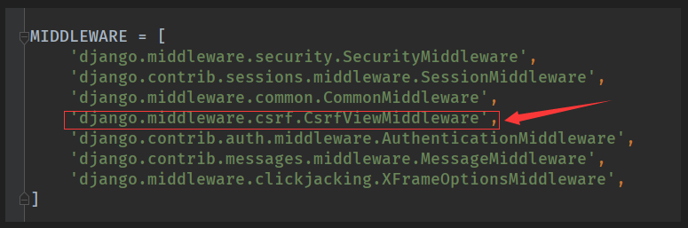
>
> ```html
> <!-- csrf开启状态下, 发送post请求的form必须加上csrd_token表单值 -->
> <form method='post' action=''>
>      <!--该指令会自动生成一个hidden的值为csrf_token值的input-->
> </form>
> ```

csrf模块会为本项目中的所有页面都生成一个 csrf_token , 发送请求时必须带上本页面的 csrf_token才给予访问, 否则会返回 403禁止访问


#### 接口传参

1. 如果是普通get传参 ?name=alice&age=18 , 那么在接口中直接使用 req 对象来获取对应的参数

   ```python
   def add_student(req):
       s = Student()
       #使用 req.GET.get('xxx') 来获取get请求的参数
       #这里的GET 方法不仅可以获取 get 请求的参数, 也可以获取 post 请求的参数
       s.s_name = req.GET.get('name')
       s.s_age = req.GET.get('age')
       s.save()
       return HttpResponse('添加成功')
   ```

2. 如果是 restful 的请求 , 先在路由解析规则中设置对应的参数, 然后在接口中直接使用形参接收

   ```python
   urlpatterns = [
       #设置restful的路径接收几个参数
       url(r'^addStudent/(\w+)/(\w+)$', views.add_student),
   ]
   ```

   ```python
   #直接使用形参接收
   def add_student(req, name, age):
       s = Student()
       s.s_name = name
       s.s_age = age
       s.save()
       return HttpResponse('添加成功')
   ```

   或者在路由设置中直接指定参数对应关系

   ```python
   urlpatterns = [
       #直接指定对应的参数
       url(r'^addStudent/(?P<age>\w+)/(?P<name>\w+)$', views.add_student),
   ]
   ```

3. 如果请求数据是 json 类型, 那么使用 req.body 获取请求数据, 然后json解析下

   ```python
   def index(request):
       json_str = request.body
       json_str = json_str.decode()  # python3.6及以上不用这一句代码
       dict_data = json.loads(json_str)  # loads把str转换为dict，dumps把dict转换为str
       id = dict_data.get("id")
       pid = dict_data.get("pid")
       return HttpResponse("获得数据 %s %s"%(id,pid))
   ```

   


#### 接口默认参数req

> 该对象是 django 框架根据请求封装的 request 对象, 其中包含如下属性
>
> 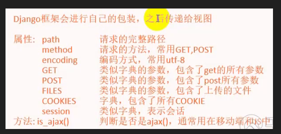

1. GET属性 

   > 通过该属性既可以获得 get请求的参数, 也可以获得 post 请求的参数
   >
   > 该属性值是一个类字典的结构, 通过 `req.GET.get('key')` 获取值
   >
   > 与字典不同的是该数据的 key 可以重复, 对应相同key的value会被放到一个数组中, 通过 `req.GET.getlist('key')` 获取该数组

2. META属性

   > 访问者的所有元信息


#### 接口返回对象HttpResponse

> 接口返回的对象为 HttpResponse , 使用 render() 返回页面的本质也是返回 HttpResponse
>
> 该对象包含如下属性和方法, 可以手动指定对象的各个属性:
>
> 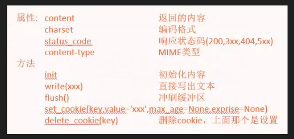
>
> MIME 表明文件的类型 , 浏览器通过区分该类型来使用不同的程序打开该文件

1. 自定义返回的 HttpResponse对象的属性

   ```python
   def get_response(req):
       res = HttpResponse()
       res.status_code = 404
       res.content = "返回的内容"
       return res
   ```

2. HttpResponse的子类 HttpResponseRedirect

   > 用于重定向
   >
   > 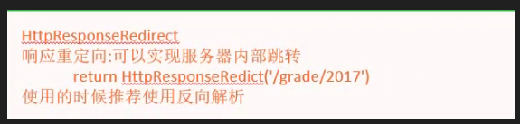

   

   ```python
   from django.urls import reverse
   def get_response(req):
       #使用反向解析函数解析namespace:name为绝对路径
       url = reverse('App:sayHello')
       #重定向到指定路径
       return HttpResponseRedirect(url)
   	#或者直接使用 redirect(url) , 本质也是调用HttpResponseRedirect
       #return redirect(url)
   ```

3. HttpResponse的子类 JsonResponse

   > 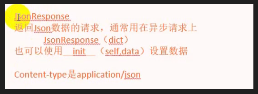

   

   ```python
   def get_response(req):
       data = {
           'name': 'alice',
           'age': 18
       }
       return JsonResponse(data=data)
   ```

   


#### 使用Cookie

> cookie不能存中文

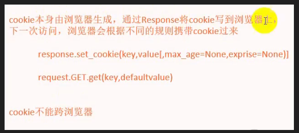

> response.delete_cookie( key ) 删除cookie


#### 使用session

> session 是存到服务器上的 用户标识
>
> session 可以存中文
>
> 一般的框架将session存放到服务器的内存中, 但是如果是分布式系统, 那么就无法实现session共享
>
> django将 session 存到名为 django_session 的数据表中
>
> 默认过期时间是14天
>
> session的值是base64编码后存储的

> 在实现登录时可以将 **返回登录页面** 和 **进行登录操作** 在一个接口中通过判断请求类型是 get 还是 post 来实现

1. 设置session和获取session

   ```python
   def set_session(req):
       #设置session
       req.session['name'] = 'alice'
       #获取session
       s_name = req.session.get('name')
       #删除session, 不会真正将session表中的数据删除, 所以会造成垃圾数据的残留
       #del req.session['name']
       #同时删除session和cookie, 建议退出登录使用该方法
       #req.session.flush()
       return render(req, 'showSession.html', {'name': s_name})
   ```

2. 可在数据库表中查看到存储的session

   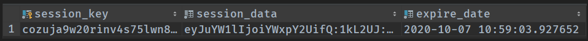

> session实现用户认证的过程:
>
> 1. 客户端发来请求
> 2. 服务端生成 session 并保存
> 3. 服务端将 session 的 key 做为 cookie 返回给客户端
> 4. 客户端保存 session 的 key 为 cookie
> 5. 待到下次客户端请求服务端时会携带cookie中保存的 sessionId
> 6. 服务端将请求中的 sessionId 与本地保存的 session 对比, 如果存在且没有过期, 那么通过用户认证


#### 使用token

> token 认证实现的本质就是 cookie+session, 不同的是整个流程是自己手动实现的
>
> token 认证方式适用于客户端不支持 cookies 的情况

1. 客户端发送登录请求
2. 服务端生成唯一的 token 并缓存
3. 服务端将 token 作为返回的 json 数据的属性进行返回
4. 客户端将接受到的 json数据中的 token属性保存
5. 待到客户端下次发起请求时手动带上保存的 token
6. 服务端接收到 token后根据缓存进行验证是否已经登录过


#### T-Templates 模板的使用

1. 在App下创建templates 文件夹 , 在该文件夹中存放模板html文件 , 因为App已经在settings中注册为APPS之一 , 所以这个templates下的文件可以被django识别到

2. templates也可直接创建在项目根目录下作为全局模板 , 即和manager同级

   因为模板可以继承, 所以 **推荐** 使用这种方式

   此时这个文件夹不属于任何一个APP , 想要django识别它里面的模板文件, 需要在settings下的TEMPLATES中配置

   ```
   TEMPLATES = {
   	'DIRS' : [
   		#配置这个文件夹为模板的文件夹, 这里使用地址拼接函数, BASE_DIR代表项目根目录	
   		os.path.join(BASE_DIR, 'templates'),
   	]
   }
   ```

3. 在templates右键 -> mark as -> template folder , 这样pycharm就会把这个文件夹识别为模板文件夹, 从而在其他地方写代码时会给出这个文件夹的提示

**注**: app模板和共用模板命名重复时, 优先使用共用模板


#### 关于 startapp 指令

就是 python manage.py startapp xxx

> 在django项目中, 默认的主访问地址配置文件为与项目同名文件夹下的urls配置文件
>
> 但是如果所有模块的接口都写在这个文件中 , 将会十分臃肿
>
> 使用这条命令创建一个名为xxx的模块文件结构

其实这个就是项目的分模块开发, 用户模块, 订单模块......

1. 使用该命令创建多个模块
2. 在settings中的APPS中配置上这些模块
3. 在每个模块中创建各自的urls文件
4. 在每个模块中创建各自的views接口处理函数文件
5. 在主urls配置文件中将请求路径分配给不同模块

> ```python
> #导包
> from django.conf.urls import url,include
> 
> #这里是主urls , 现在已经使用该命令创建了两个模块 App 和 Two 
> #在这里配置请求分配给两个模块
> urlpatterns = [
> url(r'^app/',include('App.urls')),
> url(r'^two/',include('two.urls')),
> ]
> ```
>

**注** : 分模块后可能报错找不到第二个模块下的html文件, 此时可以将多个模块的 templates 目录都添加到 settings 配置文件的 DIRS 下


#### ORM 对象关系映射

数据处理的操作数据库解耦, 只需要操作数据即可自动实现对数据库的操作, 不必关心sql是怎么写的 , 更不用关心用的是什么数据库


##### 对接数据库

> django中默认使用sqlite数据库 , 但是在实际生产中不会使用这个数据库
>
> django中对数据库的操作使用了ORM技术
>
> 在django中,  直接定义models就可自动实现数据库表的定义, 不需要手动操作数据库

1. 在某个模块下的 models.py 中添加模型类 , 需要继承django的model类

   ```python
   from django.db import models
   
   class Student(models.Model):
       #定义属性
   	s_name = models.CharField(max_length=16)
   	s_age = models.IntegerField(default=1)
       
       #可以通过写classmethod来对属性进行校验和初始化对象
       @classmethod
       def create(cls, s_name, s_age=20):
           return cls(s_name=s_name, s_age=s_age)
   ```

2. 在项目根目录控制台中使用 `python manage.py makemigrations` 将实体类生成迁移信息

   完事后会在对应模块文件夹下的migrations文件夹下创建该模块中models中配置的实体类对象的信息 

   这个信息中将会自动包含ID属性

3. 在项目根目录控制台中使用 `python manage.py migrate` 将上一步生成的迁移信息迁移到数据库中

4. 在pycharm的database窗口中刷新查看迁移进去的表, 表名为 模块名_表名

###### ADD 

   添加一个 add_student 的访问路径及接口函数

   ```python
   def add_student(request):
   	student = Student()
   	student.s_name = 'jerry'
   	student.save()
   	
   	return HttpResponse("添加成功")
   ```

   ###### FINDALL

   1. 写模板

      ```html
      <!--students.html-->
      <ul>
          
          	<li>{{ s.s_name }}</li>
          
      </ul>
      ```

   2. 写接口

      ```python
      def find_all(request):
          #查列表
      	stus = Student.objects.all()
      	#设置传给页面的数据
          data = {
              'stus': stus
          }
          #返回使用数据的模板
          return render(request, 'students.html', data)
      	#返回的数据可以直接使用 local函数 将当前作用域的变量封装成 dict 类型的数据
      	#return render(request, 'students.html', context=local())
      ```

###### UPDATE

   1. 写接口
   
      ```python
      def update_stu(request):
      	#查一条 , pk是指主键 , 即ID
      	s = Student.objects.get(pk=2)
      	#改数据
      	s.s_name='jack'
      	#修改回去
      	s.save()	
      ```

###### DELETE

1. 写接口
   
   ```python
      def delete_student(request):
      	#查一条 , pk是指主键 , 即ID
      	s = Student.objects.get(pk=2)
      	#删除
      	s.delete()
   ```
   


**使用mysql数据库**

1. 在settings中配置连接到mysql数据库

   ```python
   DATABASES = {
   	'default':{
   		'ENGINE' : 'django.db.backends.mysql',
   		#数据库名
   		'NAME' : 'Test',
   		'USER' : 'root',
   		'PASSWORD' : '123123',
   		'HOST' : '127.0.0.1',
   		'PORT' : '3306',
   	}
   }
   ```

   2. 在控制台安装mysql的驱动包 `pip install pymysql`

   3. 编辑项目中项目同名文件夹下的__ init __.py 文件, 使得安装的这个pymysql伪装成为MySQLdb , 因为使用迁移命令它只认MySQLdb

      ```python
      import pymysql
      pymysql.install_as_MySQLdb() 
      ```

   4. 先后执行 `python manage.py makemigrations` 和 `python manage.py migrate` 将实体类迁移到配置的mysql数据库中生成数据表

   5. 到mysql数据库中查看迁移结果 , 可直接在pycharm中的database中连接查看

   6. 使用以上的增删改查操作测试数据库


#### 在django shell 中调试项目

1. 在项目根目录的控制台中使用 `python manage.py shell` 打开项目的django shell

2. 在该shell中可以直接写代码调试本项目

   如

   ```shell
   > from Two.models import Student
   > stus = Student.objects.all()
   > for s in stus:
   	print(s.s_name)
   ...
   ```

   


#### 模型迁移

> python manage.py migrate
>
> python manage.py makemigrations

##### 迁移步骤

1. 执行迁移时, 首先根据 models.py 在项目的 migrations目录 下检查迁移文件中已有的模型, 生成新的迁移文件
2. 然后根据新的迁移文件生成对应的数据表
3. 然后在 django_migration 表中生成迁移文件的执行记录, 在该表中存在记录的迁移文件在进行迁移时不会再次执行

##### 如果想删除某个模型

1. 删除对应的迁移文件
2. 删除对应的数据表
3. 删除 django_migration表 中的迁移文件执行记录


#### 模型类中的数据约束

1. 字段

   * 字段命名不允许包含连续的下划线 , 因为两个下划线代表筛选条件
   * CharField  字符串
   * TextField 大文本字段(超过4000使用)
   * IntegerField 整数
   * DecimalField 十进制浮点数(高精度)
   * FloatField float浮点数
   * BooleanField 布尔
   * NullBooleanField 支持null,true,false三种
   * DateField 日期类型
   * TimeField 时间
   * DateTimeField 日期时间
   * FileField 文件(存的是路径)
   * ImageField 图片(加了检校的文件)

2. 字段属性设置( 参数设置 )

   * null 是否可为null
   * blank 是否可空白(表单验证)
   * db_colume 字段名(默认为属性名)
   * db_index 是否为该字段创建索引
   * default 默认值
   * primary_key 是否主键
   * unique 是否唯一
   * auto_now_add 是否自动填入当前时间

3. 外键

   ```python
   class Student(models.Model){
   	#使用Grade模型类作为外键, 默认使用Grade的ID
   	s_grade = models.ForeignKey(Grade)
   }
   ```

   获取外键对应的数据

   ```python
   def get_grade(request):
   	s = Student.objects.get(pk=1)
   	#直接通过student对象获取其外键关联的garde数据对象
   	grade = s.s_grade
   	#g_name是Grade类的属性
   	return HttpResponse(grade.g_name)
   ```

   ```python
   #获取一对多的外键数据
   def get_stus(request):
   	#获取grade对象
   	grade = Grade.objects.get(pk=1)
   	#根据这个grade对象获取其对应的多个student类型的对象
   	#这里的student_set为其外键对应的类型为student的集合, 格式 : 模型类小写_set
   	stus = grade.student_set.all()
   	...
   ```

4. ```python
   class Student(models.Model):
   	class Meta:
   		#设置表名为Stu
   		db_table = 'Stu'
           #设置排列规则, 这里是按id降序
           ordering = ['-id']
   ```

   


#### 模型操作对象objects

> **objects** : 这个objects是模型的隐性属性 , 自动生成 , 相当于 objects = models.Manager()
>
> 如果手动在模型类中定义了这个属性, 那么就不会自动定义这个objects

> **查询的缓存机制** : 使用查询操作时 , 并不会立即查数据库 , 只有在操作结果集时 ,才会真的去查询

* filter 过滤

  ```python
  #使用大于18的筛选条件对s_age进行筛选 , __后面跟条件 
  #可以链式编程 , 因为这些函数返回的类型是 django.db.models.query.QuerySet
  stus = Student.objects.filter(s_age__gt=18).filter(s_age__lt=60)
  ```

* exclude 排除

* get 查一个 , 查不到抛异常, 查到了多个抛异常

* all 查所有

* save 添加

* delete 删除

* create 创建对象

* count 统计数量

  ```python
  #使用在查询返回的结果上
  n = User.objects.filter(u_name = 'alice').count()
  ```

* exists 判断是否存在 , 同样用在查询返回的结果上

* [n:m] 限制查询结果集 , 相当于sql中的limit , 左闭右开 , 下标不能是复数

  ```
  #使用limit查询 , 查前五条
  Student.onjects.all()[0:5]
  ```

* 条件查询 where

  * pk 主键查询

  属性名__运算符 = 值 , 用作以上语句的参数部分 

  运算符 : 

  * gt 

  * lt , 

  * gte , 

  * lte , 

  * in , 

  * contains (sql中的like) ,  icontains (不区分大小写)

  * startwith ,  istartwith(不区分大小写)

  * endwith ,  iendwith(不区分大小写)

  * isnull , isnotnull

  * year , mouth , day , week_day ,hour , second , minute  : 用作时间类型的查询条件

    ```python
    #对时间字段进行筛选 , 但是这里默认使用东一区的时间来查询
    #想要正常查询需要到setttings里面关闭时区功能 , 改为 USE_TZ = False
    stus = Student.onjects.all(birthday__year=2019)
    ```

  连接查询 : 模型__ 属性 __条件 = 值

  * ```python
    #Grade和Student模型类 , grade的id是student中grade的外键
    #查询包含学生jack的班级
    grades = Grade.objects.filter(student__s_name=jack)
    ```

  聚合函数

  * 使用aggregate()函数返回聚合函数的值

  * Avg

  * Count

  * Max

  * Min

  * Sum

    ```python
    #返回最大的s_age的值
    Student.objects.aggregate(Max('s_age'))
    ```

  F函数 , 用于返回某个属性的值

  * 用于两个属性的比较

    ```python
    #数据模型 , Company{name , girl_num , boy_num}
    #查询条件 : 查询girl_num比boy_num多的Company , 而且还得多15个以上
    cs = Company.objects.filter(girl_num__gt=F(boy_num)+15)
    ```

  Q对象 , 逻辑链接多个查询条件 , 与链式调用效果一样

  * & 与 , | 或 ,  ~非

    ```python
    #Q函数连接两个条件
    cs = Company.objects.filter(Q(girl_num=10) & Q(boy_num=20))
    ```


#### 模型关系

1. 1:1

   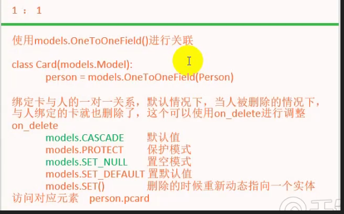

```python
#定义模型
class Person(models.Model):
    name = models.CharField(max_length=16)
    p_sex = models.BooleanField(default=False)

class ID_Card(models.Model):
    id_num = models.CharField(max_length=16, unique=True)
    person = models.OneToOneField(Person, null=True, on_delete=models.PROTECT)
    #默认的 on_delete 为级联删除, 即删除person中的数据时, ID_Card中的关联数据也会被删除
    #设置为PROTECT, 当删除person中的数据时, 如果 ID_Card中存在关联数据则不会删除成功而且报错
    #设置为 models.SET_NULL则删除person 中的数据时, 级联数据自动置为空
```

```python
#绑定一对一关系, 直接将模型的一对一属性设置为对应的对象
person = Person.objects.last()
card = Card.objects.last()
card.person = person
card.save()
```

通过级联关系获取数据

```python
#通过身份证获取对应的人的信息
def get_person_by_id_card():
    idcard = ID_Card.objects.last() #获取身份证对象
    person = idcard.id_person #获取对应的人的对象
    name = person.name  #直接获取其属性值
    return HttpResponse(name)
#通过人获取对应的身份证信息
def get_idcard_by_person():
    person = Person.objects.last() #获取人的对象
    idcard = person.idcard #虽然没有在人的模型中定义, 但是可以直接通过属性获取对应的id_card, 属于隐藏属性
    return HttpResponse(idcard.id_num)
```

2. 1:N

> 使用上述的外键

3. M:N

> 多对多一般不使用这个, 一般都是自己手动维护

```python
# 1. 创建多对多的模型
class Custom(models.Model):
    c_name = models.CharField(max_length=16)
    
class Goods(models.Model):
    g_name = models.CharField(max_length=16)
    g_custom = ManyToManyField(Custom)
```

```python
# 2. 迁移模型后会生成三个表, Custom, Goods , custom_g_goods
# custom_g_goods 为关联关系表, 使用 custom的id 和 goods的id作为组合主键
```

```python
# 3. 操作关联关系数据记录
def add_to_cart(req):
    custom = Custom.objects.last()
    goods = Goods.objects.last()
    
    #通过操作从表的对象操作关联关系
    goods.g_custom.add(custom) #添加一条关联关系
    goods.g_custom.remove(custom) #删除一条关联关系
    goods.g_custom.clear() #清空关联关系
    goods.g_custom.set([custom, custom, custom]) #添加一组关联关系
    goods.g_custom.all() #获取所有关联的数据
    #通过操作主表的对象操作关联关系
    custom.goods_set.add(goods)
    custom.goods_set.remove(goods)
    custom.goods_set.set([goods, goods, goods])
    custom.goods_set.clear()
    custom.goods_set.all()
    
    return HttpResponse("")
```


#### 模型使用继承

```python
# 1. 定义存在继承关系的模型
class Animal(models.Model):
    a_name = models.CharField(max_length=16)
    #想要使用继承, 但是不想父类生成数据表, 就在父类中添加Meta子类设置为 abstract
    class Meta:
        abstract = True
    
class Cat(Animal):
    c_eat = models.CharField(max_length=16)
    
class Dog(Animal):
    d_legs = models.IntegerField(default=4)
```


#### 数据表反向生成模型

1. 在数据库中创建库, 创建表

2. 在 django 项目的 settings 中配置 连接到数据库

3. 使用命令 `python manage.py inspectdb` 直接反向输出模型, 然后复制生成的模型代码到 models.py中

   或者

   直接先删除 models.py , 然后使用命令 `python manage.py inspectdb > App/models.py` 重定向输出为模型文件

4. 生成的模型中包含 manage=False 的元信息属性, 即该模型不被迁移功能所管理 , 就是当执行迁移命令时, 不会迁移该模型生成数据表


#### template模板

> 接口中render函数使用的模板数据是dict类型的, 也就是调用 render 函数时传入的第三个参数

##### 点

1. 调用对象中的属性
2. 调用对象中的函数
3. 充当列表索引 `students.0.s_name`
4. 充当字典的key 

##### 代码标签

直接在里面写python代码

###### 循环

```django
#for里的empty

	<li>{{ s.s_name }}</li>
	
	<h1>列表无内容</h1>

```

for循环中可用的属性

* forloop.counter 从1开始的元素下标
* forloop.counter0 从0开始的元素下标
* forloop.first 是否是第一个
* forloop.last 是否是最后一个

###### 注释

> 这些注释不会翻译成html注释

* 单行 `{# 内容 #}`

* 多行

  ```django
  
  	内容
  
  ```

###### 乘除

```django

```

###### 整除

```django
{# 常用在if中 #}
{# 这个是整除2 #}

```

###### 等值判断

```django





```

###### 过滤器(管道操作)

```django
{#格式#}
{{ var|过滤器 }}

{#加减#}
{{ 值|add:值 }}

{# 大小写 #}
{{ 值|lower }}
{{ 值|upper }}

{{# 连接 #}}
{{ students|join '=' }}

{{# 默认值 #}}
{{ 变量|default 值 }}

{{# 格式化 #}}
{{ 日期值|date:'y-m-d' }}

{{# 把字符串当成html来渲染 #}}
{{ 值|safe }}
```

###### 插槽 和 继承

```django
{# 基页面中挖坑 base.html #}


```

```django
{# 继承了及页面, 然后填了坑 #}



	{# 填坑时默认覆盖原来的内容, 如果想要追加, 使用block.super #}
	{{ block.super }}
	内容...


{# 如果使用了 extends 继承了其他页面, 那么只能填坑, 在坑之外的地方写的内容不生效 #}
```

###### 页面包含

能用 block + extends 的就不要使用include , 性能低

```django
{# include包含其他页面 #}

```


#### 静态资源

> 该方式只能在 debugg 模式下使用

1. 在项目根目录, 即 manage.py 所在的路径下新建 static文件夹, 在该文件夹中放静态资源, css, js, img...

2. 在 settings.py 中设置静态资源路径

   ```python
   STATICFILES_DIRS = [
       os.path.join(BASE_DIR, 'static'),
   ]
   ```

3. 在页面中使用静态资源

   ``` html
   1.先加载静态资源路径
   
   2.然后使用该路径下的 css 文件
   <link rel="stylesheet" href=""
   ```

   


#### 自定义错误页面

1. 直接在项目的公用 templates 文件夹中创建对应的 404.html 500.html ....页面即可
2. 注意404之类的错误页面是在关闭了 debug 模式后才会出现
3. 注意修改项目中的 html 页面服务器不会自动变更修改, 只有在修改了 python 代码后才会自动重启变更修改, 所以单纯修改了页面后, 需要手动重启服务


#### 文件上传

1. html中使用 form

   ```html
   <form action="" method="post" enctype="multipart/form-data">
       
       <input type="file" name="icon">
       <input type="submit" value="上传">
   </form>
   ```

2. 接口中获取文件数据

   ```python
   def upload_file(req):
       icon = req.FILES.get("icon")
       #文件保存到项目下
       with open("../static/img/icon.jpg","wb") as save_file:
           for part in icon.chunks():
               save_file.write(part)
               save_file.flush()
               
       return HttpResponse("文件上传成功")
   ```

   或者

   1. 在 static 下创建 upload 文件夹

   2. 在 settings.py 中指定 MEDIA_ROOT 

      ```python
      MEDIA_ROOT = os.path.join(BASE_DIR, 'static/upload')
      ```

   3. 创建模型, 其中包含类型为图片的字段

      ```python
      class User(models.Model):
          u_name = models.CharField(max_length=16)
          u_icon = models.ImageField(upload_to='icons')
          #文件存储路径为 [MEDIA_DIR]/icons/
          #路径配置可以使用年月日 upload_to='%Y/icons', 生成的路径为[MEDIA_DIR]/2020/icons/
          #linux中bug,如果一个文件夹中的子文件超过65535个, 那么这个文件夹就会打不开, 所以使用年月日对文件夹归类是较好的实践方法
      ```

   4. pip 中安装 pillow `pip install pillow -i https://pypi.douban.com/simple`

   5. 接口中保存模型对象数据记录

      ```python
      def save_user_with_icon(req):
          username = req.POST.get("name")
          icon = req.FILES.get("icon")
          user = User()
          user.u_name = username
          user.u_icon = icon
          user.save()
          return HttpResponse("上传成功")
      ```

   6. 此时在前端提交上传图片的表单, 在成功添加模型记录的同时, 会将文件保存至 settings.py 中配置的 MEDIA_ROOT 路径下, 数据库中保存图片路径

   7. 前端需要使用图片时, 接口返回图片的路径, 前端使用该路径加载

      ```python
      def mine(req):
          username = req.GET.get("name")
          user = 	User.objects.get(u_name=username)
          icon_url = "/static/upload/" + user.u_icon.url #获取图片路径作为数据传回前端
          return HttpResponse("获取头像成功")
      ```

      


#### 使用缓存

> django内置了缓存机制

##### 数据表缓存

1. 创建缓存表 `python manage.py createcachetable [table_name]`

2. 在settings.py 中配置缓存表

   ```python
   CACHES = {
       'default': {
           'BACKEND': 'django.core.cache.backends.db.DatabaseCache',
           'LOCATION': '缓存表名',
           'TIMEOUT': '60',
           'OPTIONS': {
               'MAX_ENTRIES': '300',
           },
           'KEY_PREFIX': 'rock',
           'VERSION': '1',
       }
   }
   ```

3. 在接口中使用缓存

   ```python
   #直接加上注解, 其中参数设置的是过期时间, 即可自动将返回的视图进行缓存
   @cache_page(60)
   def index(req):
       data = {
           'name': 'alice'
       }
       return render(req, 'index.html', context= data)
   ```

   

##### 内存数据库

> 使用 redis

1. pip 安装 `django-redis` 和 `django-redis-cache`

2. 在 settings.py 中配置使用 redis

   ```python
   CACHES = {
       'default': {
           'BACKEND': 'django_redis.cache.RedisCache',
           'LOCATION': 'redis://127.0.0.1:6379/1',
           'OPTIONS': {
               'CLIENT_CLASS': 'django_redis.client.DefaultClient',
           }
       }
   }
   ```

3. 同上在接口中直接使用 `@cache_page(60)` 注解即可


#### 中间件

> 中间件就相当于拦截器
>
> 其实就是面向切面编程, 对请求的各个步骤进行拦截和处理, 比如登录验证, 流量统计, 异常处理
>
> 中间件对所有的请求都生效, 所以如果想要针对某个接口进行控制, 使用 req.path 进行路径判断
>
> 每一个中间件都有固定的几个切点处理方法:
>
> * process_request , 请求从客户端到接口的期间
> * process_view
> * process_template_response
> * process_response
> * process_exception , 返回异常且客户端未收到异常时触发

1. 在项目根目录下创建 middleware 文件夹用于存放中间件文件

2. 在该文件夹中创建 testMiddleware.py 中间件文件

   ```python
   #继承django 的中间件基类MiddlewareMixin   
   class testMiddleware(MiddlewareMixin):   
       #接口收到请求前触发
       def process_request(self, req):
           print(req.META.get('REMOTE_ADDR'))
           
   	#客户端收到异常之前触发
       def process_exception(self, req, exception):
           print(req, exception)
   ```

3. 在settings.py 中配置中间件

   ```python
   MIDDLEWARE = [
       #在这个列表中配置的中间件, 在前面的先执行
       #如果在一个中间件中直接返回了, 那么后面的就不会执行了
       'middleware.testMiddleware.testMiddleware',
]
   ```
   
   


#### 分页

##### 分页器

1. 使用分页器获取要返回的当前页的数据

   ```python
   def get_students(req):
       page = int(req.GET.get('page',1))
       per_page = int(req.GET.get('per_page',10))
       students = Student.objects.all()
       paginator = Paginator(students, per_page)
       #数据量总数
       paginator.count
       #页面总数
       paginator.num_pages
       #页码列表
       paginator.page_range
       #page_object 当前页对象包含 
       #object_list 当前页上的所有数据对象
       #number 当前页的页码
       #paginator 当前page关联的paginator对象
       #has_next() 是否有上一页
       #next_page_number() 下一页的页码
       #len() 当前页的数据个数
       #等多个属性和方法,可实现前端的分页器
       page_object = paginator.page(page)
       data = {
           'page_object': page_object
       }
       return render(req, 'students.html', context=data)
   ```

   

#### 验证码

> 使用 pillow
>
> pip install Pillow

1. ```python
   import random
   from io import BytesIO
   
   from PIL import Image, ImageFont
   from PIL.ImageDraw import ImageDraw
   
   
   def get_code(req):
       # 创建image画布
       image = Image.new(mode='RGB', size=(200, 100), color=get_random_color())
   
       # 在画布上创建画笔
       imagedraw = ImageDraw(image, mode='RGB')
   
       # 创建字体, 这里使用的字体为项目中的字体文件, 通过在 settings.py中配置字体文件路径来引用
       font = ImageFont.truetype(settings.FONT_DIR, size=60)
   
       # 使用画笔在画布上写文字
       for i in range(4):
           color_text = get_random_color()
           text = get_random_char()
           imagedraw.text(xy=(50 * i, 0), text=text, fill=color_text, font=font)
   
       # 使用画笔在画布上画点
       for i in range(10000):
           xy = (random.randrange(201), random.randrange(101))
           color = get_random_color()
           imagedraw.point(xy=xy, fill=color)
   
       # 生成线
       for i in range(10):
           color = get_random_color()
           xy = (random.randrange(201), random.randrange(101),
                 random.randrange(201), random.randrange(101))
           imagedraw.line(xy=xy, fill=color, width=2)
   
       # 创建内存io流
       fp = BytesIO()
   
       # 将画布以png格式保存到io流中
       image.save(fp, 'png')
   
       # 返回io流中的数据, 并指定 mime类型为 image/png,否则前端会以字符串的方式解析图片
       return HttpResponse(fp.getvalue(), content_type='image/png')
   
   
   # 随机生成颜色
   def get_random_color():
       return random.randrange(256), random.randrange(256), random.randrange(256)
   
   
   # 随机生成字符
   def get_random_char():
       base = '1234567890' \
              'qwertyuiopasdfghjklzxcvbnm' \
              'QWERTYUIOPASDFGHJKLZXCVBNM'
       return random.choice(base)
   
   
   ```

2. 应当将上一步中使用到的字体文件保存到项目下, 然后在settings 中配置字体文件的路径并引用该路径.

   当然不在settings中配置, 直接写字体文件的路径也可以, 只不过这样做会失去动态配置性


#### 富文本插件

> pip install django-tinymce
>
> 文档: http://tinymce.ax-z.cn/quick-start.php

1. 在settings 中设置 tinymce

   ```python
   #在INSTALLED_APP下添加
   INSTALLED_APP = [
       'tinymce'
   ]
   
   #添加tinymce的默认设置
   TINYMCE_DEFAULT_CONFIG = {
       'theme': 'advanced',
       'width': 800,
       'height': 600
   }
   ```

2. 创建包含富文本字段的模型类

   ```python
   from tinymce.models import HTMLField
   
   class Blog(models.Model):
       b_content = HTMLField()
       
   #创建完成后要迁移模型
   #HTMLField 继承自 TextField
   #实际上生成的数据表中富文本字段就是 text 类型, 使用 html 的格式存储
   ```

3. 在页面中使用富文本域

   ```html
   <!DOCTYPE html>
   <html lang="en">
   <head>
       <meta charset="UTF-8">
       <title>编辑blog</title>
       {#这个加载的是python运行环境中 site-package下的资源#}
       <script type="text/javascript" src="/static/tinymce/tinymce.min.js"></script>
       <script type="text/javascript">
           {#初始化tinymce控件#}
           tinymce.init({
               selector: '#tinydemo',
               language: 'zh_CN',
           });
       </script>
   </head>
   <body>
   <form method='post' action="">
       
       <textarea name="content" id="tinydemo"></textarea>
       <button>
           提交
       </button>
   </form>
   
   </body>
   </html>
   ```

4. 接口保存富文本内容

   ```python
   # 富文本编辑页面
   def edit_blog(req):
       if req.method == 'GET':
           return render(req, 'editBlog.html')
       elif req.method == 'POST':
           content = req.POST.get('content')
           print(content)
           blog = Blog()
           blog.b_content = content
           blog.save()
           return HttpResponse('编辑成功')
   ```

   


#### django-debug-toolbar

> 在前端的模板页面显示当前服务的调试信息

> pip install django-debug-toolbar

1. 在 settings 中设置

   ```python
   #在INSTALLED_APPS 中添加
   'debug_toolbar'
   
   #在 MIDDLEWARE 中最前面添加
   'debug_toolbar.middleware.DebugToolbarMiddleware'
   
   #添加可看到该调试页面的主机
   INTERNAL_IPS = ('127.0.0.1', 'localhost')
   ```

2. 在总 urls 中添加

   ```python
   import 项目名.settings
   
   if settings.DEBUG:
       import debug_toolbar
       urlpatterns = [
           url(r'^__debug__/', include(debug_toolbar.urls)),
       ] + urlpatterns
   ```

3. 开启服务, 访问页面, 此时页面上会出现调试信息的bar


#### 部署

> 使用 uwsgi 和 nginx

> pip install uwsgi


#### 返回Json数据

1. 使用 JsonResponse

   ```python
   from django.http import JsonResponse
   
   def index(req):
       data = {
           'name': 'alice',
           'age': 18
       }
       return JsonResponse(data=data)
   ```

   


#### class based view

> 常规的接口都是以方法的形式写在 view.py中的
>
> django 同时提供使用类的方式来写接口, 通过在类中定义 get , post , put ... 等方法来实现对某一个接口不同请求方式的处理, 这种方式称为 cbv
>
> cbv 适合搭配 restful 风格接口来实现

###### 基本使用

1. 编写接口类

   ```python
   class Book(View):
       #处理对该接口的get方式请求
       def get(self, req):
           return HttpResponse('get return')
   	#处理对该接口的post方式请求
       def post(self, req):
           return HttpResponse('post return')
   	#处理对该接口的put方式请求
       def put(self, req):
           return HttpResponse('put return')
       #未定义的请求方式在请求时会被返回 405 method not allowed 错误
   ```

2. 在路由文件中配置该类为接口类

   ```python
   from django.conf.urls import url
   from cbv.views import Book
   
   urlpatterns = [
       #调用 as_view 方法将该类作为接口类
       url(r'^helloCbv', Book.as_view())
   ]
   ```

3. 使用 postman 等请求工具, 对该接口发送不同的请求方式的请求验证接口

   在测试时应当关掉 settings 中的 csrf 选项, 否则 post请求会不通过

###### 使用TemplateView

1. 创建要返回的 template 页面文件

2. 创建继承自 TemplateView 的类视图

   ```python
   class TemplateView(TemplateView):
       #给 template_name 赋值, 即可指定get请求方式返回的页面
       template_name = 'templatePage.html'
   ```

3. 添加路由

   ```python
   from django.conf.urls import url
   from cbv.views import Book, TemplateView
   
   urlpatterns = [
       url(r'^cbvTemplate', TemplateView.as_view()),
   ]
   ```

4. 访问对应的url进行测试

###### 使用ListView

> 没啥用

1. 创建模型, 准备数据, 下面将使用该模型对应的数据表中的所有数据作为列表展示

2. 创建类视图继承自 ListView , 设置 要返回的页面 和 页面中要展示为列表的模型的数据

   ```python
   class BookList(ListView):
       template_name = 'listTemplate.html'
       model = Book
   ```

3. 设置路由

4. 创建要返回的包含列表的页面, 其中使用 object_list 作为遍历对象

   ```html
   <ul>
       
       <li>{{ book.b_name }}</li>
       
   </ul>
   ```

   


#### django后台管理

> django内置后台管理系统, 提供对项目中数据表数据的管理功能
>
> `localhost:8000/admin` 访问
>
> 创建管理员用户 `python manage.py createsuperuser`

###### 添加自己的数据表到后台管理系统

1. 在数据表所在模块下的 admin.py 中注册数据表

   ```python
   from django.contrib import admin
   # Register your models here.
   from App.models import Student, Blog
   
   admin.site.register(Student)
   admin.site.register(Blog)
   ```

2. 数据记录在后台管理系统中显示的名字为模型中 toString方法 的返回值, 可通过重写 __ str __ 方法自定义显示方式

   ```python
   class Blog(models.Model):
       b_content = HTMLField()
   	#重写 toString 方法
       def __str__(self):
           return self.b_content
   ```

   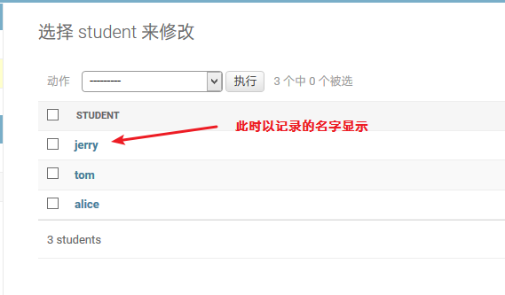

###### 定制后台管理系统页面中的功能

> 默认的后台管理系统只提供基本crud功能
>
> 可通过继承管理类来定制页面中的功能

1. 在 admin.py 中创建管理类继承 admin.ModelAdmin, 并在该类中自定义页面功能

   ```python
   class StudentAdmin(admin.ModelAdmin):
       list_display = ['s_name', 's_age']
       list_filter = ['s_age']
       search_fields = ['s_name']
       list_per_page = 3
   ```

   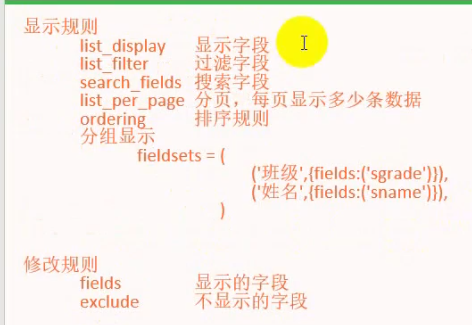

2. 注册模型时使用自己创建的管理类

   ```python
   admin.site.register(Student, StudentAdmin)
   ```

   此时页面会变成这样

   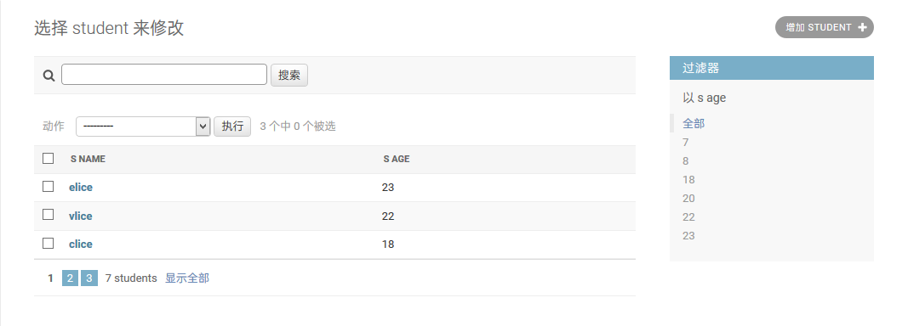


#### django-rest-framework

> pip install djangorestframework
>
> 然后记得在 settings.py 中的 INSTALLED_APPS 中添加 'rest_framework'

> 功能为根据模型自动生成所有请求类型的接口, 并生成可视化的接口展示页面

###### model to api & view

1. 创建模型

   ```python
   from django.db import models
   
   #Book模型
   class Book(models.Model):
       b_name = models.CharField(max_length=16)
       b_price = models.IntegerField(default=1)
   ```

2. 创建序列化器

   ```python
   #在该模块下创建 serializers.py 文件用于存放所有的序列化器, 一个模型对应一个序列化器
   from rest_framework import serializers
   from restframework.models.Book import Book
   
   #Book模型对应的序列化器
   class BookSerializer(serializers.HyperlinkedModelSerializer):
       class Meta:
           model = Book
           fields = ('url', 'b_name', 'b_price') #这里加的url字段会使得页面中可以点击某一条数据进入详情界面
   ```

3. 创建类视图 (接口)

   ```python
   from rest_framework import viewsets
   
   # Create your views here.
   from restframework.models.Book import Book
   from restframework.serializers import BookSerializer
   
   #Book模型对应的类视图
   class BookViewSet(viewsets.ModelViewSet):
       queryset = Book.objects.all()
       serializer_class = BookSerializer
   ```

4. 在项目的总urls.py 中添加路由

   ```python
   from rest_framework.routers import DefaultRouter
   
   from restframework.views import BookViewSet
   #创建一个默认路由
   router = DefaultRouter()
   #给路由添加类视图
   router.register(r'rest_book', BookViewSet)
   #将路由添加到urlpatterns中
   urlpatterns = [
       url(r'rest/', include((router.urls, 'rest'), namespace='rest'))
   ]
   ```

5. 访问 localhost:8000/rest/ 测试可视化接口页面


###### 序列化

> 使用 Json返回数据时, 数据应当是字典类型, 其中字典的值应当是序列化后的值, 如果某个值未经过序列化, 那么在访问该接口时会报错TypeError
>
> 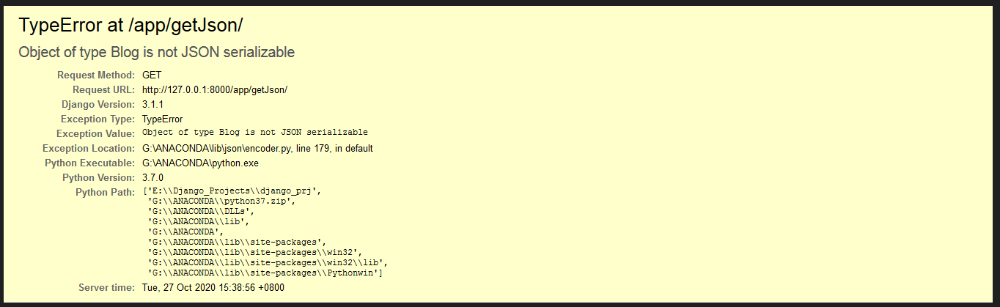
>
> 所以如果某个值为对象, 那么应当手动将该对象序列化

> rest framework 提供了序列化的工具

1. 创建模型

   ```python
   from django.db import models
   #创建模型, 要记得迁移
   class Student(models.Model):
       s_name = models.CharField(max_length=32)
       s_age = models.IntegerField(default=18)
   ```

2. 创建对应的继承自 modelSerializer 的序列化器

   ```python
   from rest_framework import serializers
   #该序列化器可将模型进行序列化
   class StudentSerializer(serializers.ModelSerializer):
       class Meta:
           model = Student
           fields = ('s_name', 's_age')
   ```

3. 在接口中使用序列化器

   ```python
   # 测试序列化工具的类视图
   class StudentView(View):
       def post(self, req):
           student = Student()
           student.s_name = req.POST.get('s_name')
           student.s_age = req.POST.get('s_age')
           student.save()
           #使用模型的实例来创建序列化器, 然后可获取到序列化后的数据, 并将其作为 json 数据返回
           student_ser = StudentSerializer(instance=student)
           return JsonResponse(data=student_ser.data)
   ```

4. 访问测试

   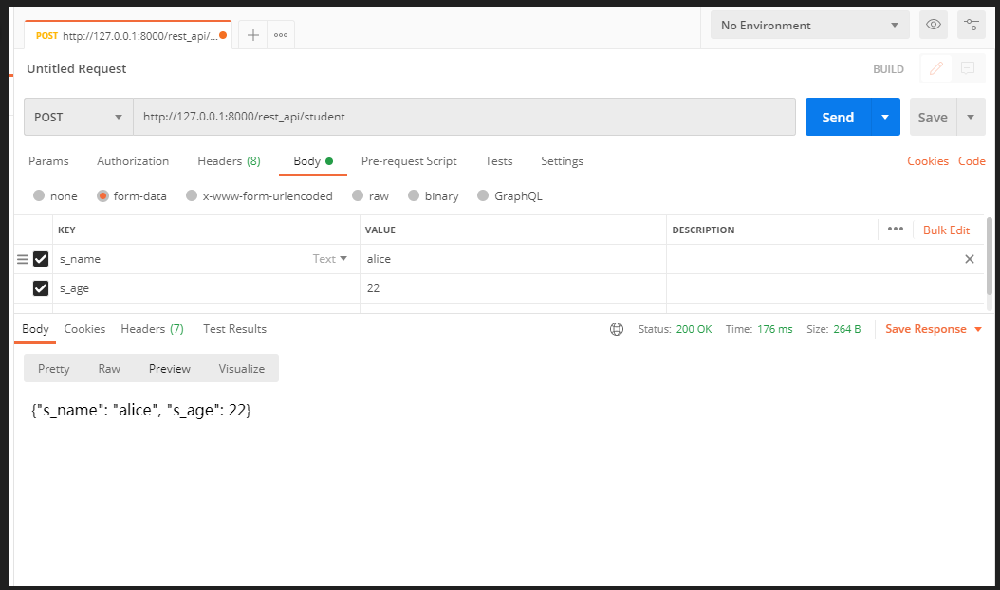


###### rest framework中的双R

> rest framework对 django 中的双R进行了封装
>
> 对于 fbv 的接口, 需要在原方法上加上 @api_view(http_method_names=['GET', 'POST'])
>
> 对于 cbv 的接口, 需要类视图继承 APIView 


###### 请求方式自由组合的接口

> 如果类视图继承自 viewsets.ModelViewSet , 那么将会支持所有请求类型
>
> 但是如果一个模型要实现只支持部分请求类型, 那么可以使用自由组合的方式来实现该类视图
>
> 在 rf 中, 将不同的请求方式接口拆分为多个功能类, 如果想要仅支持部分请求方式, 只需手动继承部分功能类即可, ModelViewSet 实际上就是继承了所有的功能类
>
> 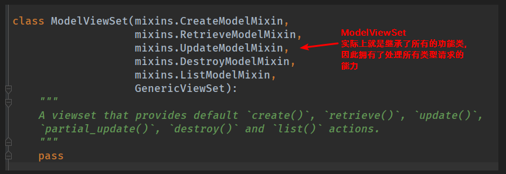
>
> 因此 , 我们可以自己指定要继承哪些功能类, 从而开放部分接口
>
> 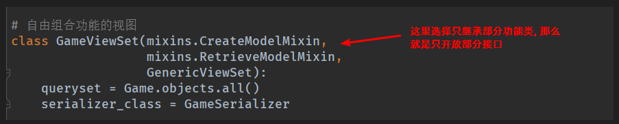
>
> 此时, 页面显示为
>
> 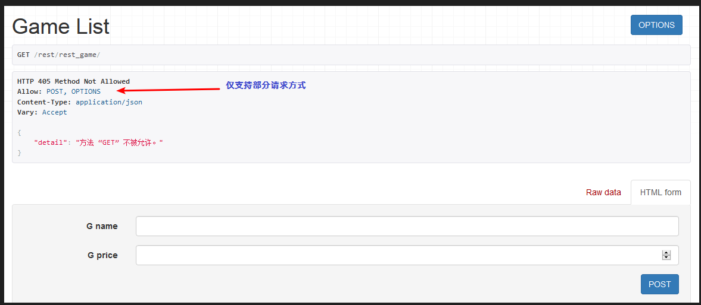

实现自由组合的接口与 model to api & view 中唯一不同的操作就是自己的 viewset 类不再继承 ModelViewset , 而是自己选择继承 mixins 中的功能类


###### 登录认证和权限认证

> 前后端分离的项目推荐使用 auth3 的认证模式, 即使用 token 的验证方式.
>
> 前端发送登录请求, 如果登录成功, 那么后端生成并返回的用户 token, 一般是保存到redis中, 前端保存该 token , 待到下次请求时带上该 token , 后端验证该 token 是否在 redis 中存在从而进行登录认证.

> rest framework 中的 APIView 中内置了 登录认证和权限认证
>
> 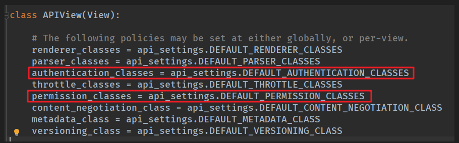
>
> 其中通过设置两个认证类来实现登录认证和权限认证
>
> 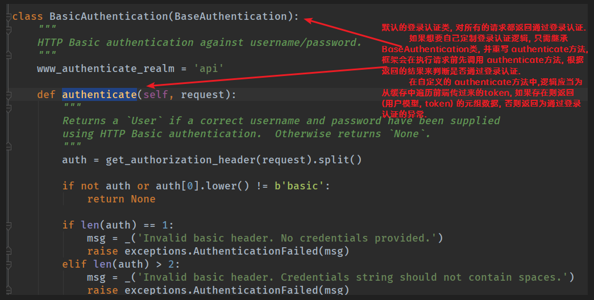
>
> 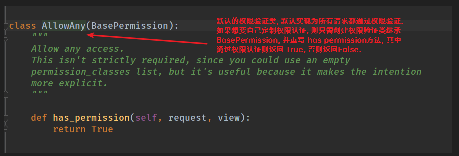
>
> 所以当我们的类视图继承了 APIView时, 就已经使用它内置的默认登录认证和权限认证

如果要定制登录认证功能和权限认证功能:

1. 创建登录认证类 继承 BaseAuthentication, 并重写 authenticate 方法

2. 创建权限认证类 继承 BasePermission , 并重写 has_permission 方法

3. 在要登录认证和权限认证的类视图中使用自定义的登录认证类和权限认证类

   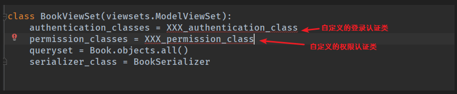


#### celery

> `pip install -U celery[redis] `
>
> `pip install celery`

> 执行异步任务的工具

> 需要结合消息队列容器使用, 这里使用 redis

###### 基本使用

1. 随便找个地方创建一个python文件, 写celery任务

   ```python
   from celery import Celery
   
   #创建一个celery任务队列, 指定使用redis作为任务容器
   app = Celery("tasks", broker='redis://localhost:6379/1')
   #指定该任务队列要执行的任务
   @app.task
   def add(a, b):
       sleep(5)
       return a + b
   ```

2. 在该文件所在的目录下的命令行中使用 `celery -A tasks worker --loglevel=info` 启动任务队列

   注意要先把 redis 启动起来

3. 然后在该文件中使用 celery 执行该任务

   ```python
   #还是这个文件
   if __name__=='__main__':
       print(add.delay(4, 6))
   ```

4. 执行该文件 , 会发现控制台立即打印一个uuid , 该字符串为 celery执行该任务的唯一标识, 后续可以使用该唯一标识查看该任务的执行结果.

###### 在django中使用

1. 在django 的直属文件夹下创建 celery.py 文件, 用来写 celery 的配置

   ```python
   import os
   from celery import Celery
   
   os.environ.setdefault('DJANGO_SETTINGS_MODULE', '项目名.settings')
   app = Celery('项目名')
   app.config_from_object('django.conf:settings', namespace='CELERY')
   app.autodiscover_tasks()
   
   @app.task(bind=True)
   def debug_task(self):
       print(f'Request: {self.request!r}')
   ```

2. 在项目直属文件夹中的 __ init __.py 中导入 celery

   ```python
   from .celery import app as celery_app
   __all__ = ['celery_app']
   ```

3. 在 settings.py 中添加celery配置

   ```python
   # 任务容器地址
   CELERY_BROKER_URL = 'redis://localhost:6379/1'
   CELERY_ACCEPT_CONTENT = ['json']
   CELERY_TASK_SERIALIZER = 'json'
   # 任务的结果存在哪里, 这里设置的是存到 django-celery-results的数据表中
   CELERY_RESULT_BACKEND = 'django-db'
   ```

4. `pip install django-celery-results`  用来存放异步任务运行的结果

   在 settings.py 的 INSTALLED_APPS 中添加该模块

   ```python
   #添加该模块, 实际上这个模块就是一个迁移文件, 包含一张名为 django-celery-results的数据表, 在celery中配置的 django-db就会将任务运行结果存放到该表中
   INSTALL_APPS = [
       'django-celery-results'
   ]
   ```

   并使用两条迁移命令迁移生成 django-celery-results 数据表

5. 在要使用异步任务的模块文件夹中分别创建 tasks.py 文件, 写异步任务

   ```python
   #tasks.py
   from celery import shared_task
   
   @shared_task
   def add(a, b):
       sleep(5)
       return a+b
   ```

6. 在要使用异步任务的接口中调用异步任务

   ```python
   #views.py
   def index(req):
       result = add.delay(3, 4)
       return HttpResponse(result)
   ```

7. 在项目根目录的命令行中 `celery -A 项目名 worker --loglevel=info` 启动异步任务队列

8. 启动 django项目, 访问使用了异步任务的接口测试返回结果, 并在 django-celery-results 数据表中查看任务运行结果


