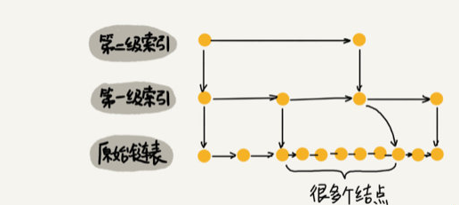

### Redis

##### Redis配置

1. 将解压出来的文件夹下的 `redis.conf `文件 拷贝到 Redis安装完成的文件夹下与 `bin` 文件夹同级
2. 如果想使得自定义的配置文件生效, 则在启动服务时应加上配置文件路径 ` ./bin/redis-server ./redis.conf`
3. 配置项
   1. daemonize yes  设置为守护进程运行模式
   2. bind 127.0.0.1   设置访问地址为本机, 仅限本机可访问本服务器, 注释掉则清除访问限制
   3. port 6379     设置访问的端口
   4. database 16 设置为可支持同时使用16个数据库
   5. save <second> <changes>  设置在second时间内,如果修改次数达到changes,则持久化数据
   6. dbfilename dump.rdb  设置本地持久化文件的名称
   7. dir ./  设置本地持久化文件的存放位置( 默认当前目录 )
   8. requirepass xxxxxx  设置连接到redis服务器的密码 , 设置密码后应使用 `AUTH <password>`命令来连接
   9. maxclients 10000 设置同一时间的最大客户端连接数
   10. maxmemory <bytes>  设置最大内存使用量, 超过时会删除快过期的key上的数据

##### 服务端的操作

* 服务端的关闭
  * 直接杀进程(数据丢失)
    1. 查询pid `ps -ef | grep -i redis`
    2. 关闭进程 `kill -9 <pid>`
  * 数据保存,正常关闭
    1. 在客户端执行 `shutdown`

##### 客户端的使用

1. 连接服务端`./redis-cli [-h host] [-p port] -a password`
   * -h host 默认为本机
   * -p port 为连接端口, 默认为6379
   * -a password 为连接密码
2. `keys <pattern>`  按照模式查询
   1. `keys *` 查询所有键
   2. `keys ?` ?代表一个字符
3. `set <key> <value>`  设置键值对, 覆盖, 无视类型
4. 删除key `del[key...]`,  返回删除成功的数目
5. 获取序列化之后的值 `dump <key>` ( key会被序列化后存到硬盘上 )
6. 是否存在 `exists <key>` , 存在则返回1,否则返回0
7. 设置key的过期时间 `expire <key> <seconds>`
   * 存放限时活动的信息
   * 网站定时更新的数据
   * 手机验证码
   * 限制网站访问频率
8. 返回key的剩余生存时间 `ttl <key>`,  -1为永久,-2为无效. 默认为永久
9. 移除过期时间,设置key为永久 `persist <key>`
10. 切换数据库 `select <number>` , 切换到number下标的数据库
11. 从当前数据库中随机返回一个key `random <key>`
12. 重命名key `rename <oldname> <newname>`
13. 移动key到另一个数据库 `move <key> <ind>`  , 移动key到下标为ind的数据库中
14. 获得key的类型 `type <key>`
15. `flushdb` 清空数据库


### Redis数据类型

* 单个键最大512M

* 使用命名规范来建立数据关联性

  * 统一的规范: user:123:password

* ***数据类型***

  

#### *string*

  * 二进制安全: 数据传输过程中无编码和解码的操作, 不会出错
  
  * `setnx key value`  只有key不存在的时候才赋值
  
      返回修改值的个数, 可用于分布式锁
  
  * `set key value` 赋值
  
  * `get key` 获取字符串类型的值, 如果值不是字符串类型, 返回错误
  
  * `getrange key start end`  获取范围内的子字符串, 包括头尾
  
  * `getset key value` 赋值, 如果之前存在,返回之前的值, 不存在则返回nil
  
  * `strlen key` 获取字符串长度
  
  * `append key value` 字符串拼接
  
  * `incr key` 值自增1, 如果不存在则先初始化为0再自增
  
  * `incrby key num` 值自增num
  
  * `decr key` 值自减1
  
  * `decrby key num` 值自减num
  
  * 应用场景
    1. 字符串存储
    2. 图片存储
    3. 计数器


#### *hash ( 对象 )*

  * `hset key field value` 赋值( 键, 属性, 值 )

  * `hmset key field value [field1 value1 ...]` 同时存储一个对象的多个属性

  * `hget key field` 取值 ( 键, 属性 )

  * `hmget key field [field1 ...] ` 同时取一个对象中多个属性的值

  * `hgetall key`  获取一个对象中所有属性的值

  * `hkeys key` 获取对象中所有的键

  * `hlen key`  获取对象中键的数量

  * `hdel key field [field1 ...]` 删除一个对象中的一个或多个属性, 属性删完后对象就会被释放

  * `del key` 直接删除对象

  * `hsetnx key field value`  属性不存在时赋值

  * `hincrby key field num` 对象整型属性自增num

  * `hincrbyfloat key field num` 对象浮点数属性自增num

  * `hexists key field`  查看对象是否存在属性, R1&0

  * 应用场景:
    1. 存储对象
    2. 因为存储的对象都是放到一块， 所以可以使用命名来标识每条数据的身份， 比如要存 user 类型的信息， 那么可以存为一个对象， 名字为 `user:id:828383`, 然后设置该对象的各个属性
    3. 注意 hash 对象的 value 值都是字符串类型 ，不能对象嵌套
    4. 存购物车数据， key 是 `cart:userID:itemID`, value 使用多个字段存放该用户该商品的名字， 数量， 图片等信息
    
* 数据结构

    ***ziplist***

    在同时满足以下两个条件时，使用 ziplist 存储，为了“时间”换“空间”

    

    ​		ziplist, 使用 entry 节点存储 key 和 value，每个key和value都独占一个entry，每个entry的长度可以不同

    

    ​		其中，entry的数据结构为

    

    ***hashmap***

    超过以上两个条件时，使用标准的 hashmap 数据结构，使用拉链法解决hash冲突

    ​		使用渐进式的方式进行 rehash，保存两个 hash 数组，每次使用第二个作为第一个的扩容数组

    ​		当第一个数组达到扩容条件时，开始渐进式扩容，即每次查询的同时顺便将数据复制到第二个数组中，直至所有数据被迁移，是为了防止一次性的rehash迁移造成cpu繁忙而停止服务

    ​		迁移完毕后，交换两个数组的位置，再将第二个数组作为预备扩容数组


#### *list( linkedlist)*

  * `lpush key value [value1...]`  将一个或多个数值插入到列表头部( 往左侧添加 )
  * `rpush key value [value2...]`  将一个或多个数值插入到列表的尾部( 往右侧添加 ) 
  * `lpushx key value` 将一个值插入到已存在的列表 *头部*, 如果列表不存在, 操作无效
  * `rpushx key value` 将一个值插入到已存在的列表 *尾部* , 如果列表不存在, 操作无效
  * `llen key` 返回列表长度
  * `lindex key index` 返回下标为index的值
  * `lrange key start end`  返回范围内的数值 ( -1为最后一个元素, -2位倒数第二个元素, 以此类推 )
  * `lpop key` 左一出栈
  * `rpop key` 右一出栈
  * `blpop key1 [key2...] timeout` 待到key中有数据时左一出栈,  或者超时退出
  * `brpop key1 [key2...] timeout` 待到key中有数据时右一出栈,  或者超时退出
  * `ltrim key start end` 修剪list只剩区间内元素
  * `lset key index value` 修改key中下标为index的值为value
  * `linsert key <before|after> word value` 在key中的word元素的<前|后>插入value
  * `rpoplpush from to` 从from列表中右出栈一个元素作为to列表的左进栈元素, 返回值为被操作的元素 , 使用 `rpoplpush l1 l1` 实现循环列表
  * 应用场景:
    1. 对大量的数据进行增减操作
    2. 使用范围返回命令实现分页功能
    3. 使用右出左进函数和两个任务列表来实现任务队列功能


  #### set

  * 无序不可重复的string集合
  * `sadd key val1 [val2...]` 添加
  * `scard key` 集合大小
  * `smembers key` 返回所有元素
  * `sismember key val` 判断是否存在val ( 1&0 )
  * `srandmember key [count]` 返回一个或count个随机的元素
  * `srem key member1 [member2...]` 从key中删除一个或多个元素
  * `spop key [count]` 从key中随机删除一个或多个元素并返回
  * `smov key1 key2 val` 将key1中的val移动到key2中
  * `sdiff s1 [s2]` 返回s1和s2的差集
  * `sinter s1 [s2]` 返回s1和s2的交集
  * `sunion s1 [s2]` 返回s1和s2的并集
  * `sdiffstore target key1 key2` 返回key1和key2的差集并保存在target中
  * `sinterstore target s1 s2` 返回s1和s2的交集并保存在target中
  * `sunionstore target s1 s2` 返回s1和s2的交集并保存在target中
  * 应用场景
    * 两个集合的差集,并集和交集
        1. 共同关注, 共同喜好, 共同好友
        
        2. 利用唯一性, 统计访问网络的独立IP
        
        3. 抽奖， 参与抽奖的用户加入到 set 中， 然后使用 `srandmember key count` 随机返回 n 个中奖用户
        
        4. 记录点赞数，每一条朋友圈对应一个 set ，使用 `like:{消息ID}` 命名
        
            其他用户点赞时加入对应set `sadd like:{消息ID} {用户ID}`
        
            取消点赞时从该set中删除对应元素 `srem like:{消息ID} {用户ID}`
        
        5. 共同关注和可能认识的人
        
            把每个人的关注列表各自保存为一个 set
        
            对两个set取交集， 就是两个人的共同关注
        
            对两个set取差集的结果，可以作为可能认识的人进行推荐


#### zset

* 有序不可重复的string集合
* 根据元素的score值( double类型 ) 来进行排序
* `zadd key score1 val1 [score2 val2...]` 添加元素 (要score和val对应 )
* `zcard key` 返回元素个数
* `zrange key start end` 返回范围内的元素( 根据score从小到大排序 ) 
* `zcount key min max` 返回score在[min,max]内的元素
* `zrank key member` 返回key中member的索引
* `zrevrange key start end` 从大到小返回范围内的元素
* `zrem key val1 [val2...]` 从key中删除元素
* `zremrangebyrank key start end` 从排名区间内删除元素( 第一名是0 )
* `zremrangebyscore key min max` 根据score的大小删除范围内的元素
* 应用场景
    1. 排行榜
    
    2. 时间线
    
    3. 使用score作为任务队列的权重( 优先度 )
    
    4. 1小时最热门
    
        使用 `hot:{当前小时的时间戳}` 作为zset的key， 然后使用帖子的ID作为 member， 使用点击数作为 score
    
        每次某个帖子被点击， 就增加当前小时的zset中对应记录的 score
    
        最后直接使用 `zrevrange hot:{当前小时的时间戳} 0 10` 获取1小时最热门排行榜前十条


### Redis发布订阅

* publish(发布) -> channel(频道) -> client(客户端)
* 命令 ( 以下命令执行在客户端中 )
    * `subscribe channel [channel2...]`  订阅频道 ( 频道名称随便写 )
    * `publish channel message` 向channel中发送message
    * `unsubscribe channel [channel2...]` 取消订阅
    * `psubscribe pattern [pattern2...]` 根据模式订阅频道
    * `punsubscribe pattern [pattern2...]` 根据模式退订频道
* 应用场景:
    * 博客, 公众号
    * 实时聊天系统


### Redis 多数据库

* 命令
    * `select index` 切换数据库
    * `move key index` 将key移动到索引为index的数据库中
    * `flushdb`  清空当前库
    * `flushall` 清空所有库
* 缓存预热: 在项目上线前清空redis数据库, 然后访问一遍系统, 使数据加载到redis数据库中。


### Redis事务

>   没有回滚功能

* `multi` 开始录入事务队列
* `exec` 执行事务队列
* `discard` 放弃当前事务队列

```shell
#使用事务队列实现转账功能

#事务队列开始
>multi
ok
#将操作放入事务队列中
>get account:a
queued
>get account:b
queued
>decrby account:a 50
queued
>incrby account:b 50
queued
#执行
>exec
```

* 事务执行中, 如果命令执行报错, 其他命令会正常执行 ( 运行时错误 )

* 事务执行中, 如果命令本身出错, 整个事务都不会执行 ( 语法错误 )

* `watch key [key2...]` 监视key, 如果在监视状态下开启事务, 在事务未执行时key被其他客户端修改, 那么这个事务不会执行成功, 会返回nil. 在开启监视后, 如果exec或者discard先被执行, 则监视自动取消. ( 监视的有效期为一个事务 )

    可以利用 watch 来实现真正的事物

* `unwatch` 取消对所有key的监视

* 应用场景
    1. 商品秒杀
    2. 转账


### Redis数据淘汰策略

>   配置文件 redis.conf 

* 当数据达到配置的最大内存使用量时, 会根据淘汰策略进行淘汰

    如果没有设置, 则报错out of memory

* `maxmemory 512G`设置最大内存 

淘汰策略

*   从设置了过期时间的key中选最近最少使用数据淘汰
*   从设置了过期时间的key中选最近访问频率最少的数据淘汰
*   从设置了过期时间的key中选最先将要过期的淘汰
*   从设置了过期时间的key中随机淘汰
*   从所有key中选最近最少使用
*   从所有key中选最近访问频率最少
*   从所有key中随机选


### Redis持久化 

>   保存为本地文件

RDB方式: 默认的持久化方法, 持久化数据为二进制文件dump.rdb

* 快照产生条件:
    1. 正常关闭 `shutdown`
    2. 到达策略安排的操作次数 `save 900 1`, 即900 sec 之内至少操作一次数据
    
* 优点: 存储速度快, 还原速度快

* 缺点: 照快照时候会占用内存, 小内存机器不适合

    如果是非正常关闭 或者刚好未达到设置的保存时间间隔, 必丢数据 


```
# By default Redis asynchronously dumps the dataset on disk. This mode is
# good enough in many applications, but an issue with the Redis process or
# a power outage may result into a few minutes of writes lost (depending on
# the configured save points).
```

>   RDB方式备份中间有空档, 非正常退出redis必丢这期间写的数据, 可以使用AOF方式实时记录数据操作


AOF方式: 将操作的命令保存到 appendonly.aof 文件中, 使用保存的命令恢复数据

* 优点: 能保证数据不丢失
* 缺点: 会占用过多的硬盘空间
* 配置文件:
    * `appendonly yes`  启用aof
    * `appendfsync always`  收到命令就持久化
    * `appendfsync everysec` 每秒都做持久化
    * `appendfsync no` 完全依赖os, 性能最好, 但是持久化没保证


### *在JAVA中使用Redis*

1. 在项目中引入jedis的jar包 ( 也可使用pom直接引入 ) ( jedis相当于一个客户端 )

2. 在redis服务端的防火墙中开启6379端口  ( 同时注意在redis的启动设置中设置为其他ip可访问 )

   ```shell
   #查看当前防火墙开放的端口
   >firewall-cmd --list-ports
   #开启6379端口
   >firewall-cmd --zone=public --add-port=6379/tcp --permanent
   #重启防火墙使设置生效
   >firewall-cmd --reload
   ```

   

3. 在java中使用jedis连接redis服务器

   ```java
   public void main(){
       //redis服务器地址
       String host = "xxx.xxx.xxx.xxx";
       //redis服务器端口号
       int port = 6379;
       Jedis jedis = new Jedis( host, port );
       //输入密码
       jedis.auth("******");
       
       //测试是否连接成功, 打印出PANG则为连接成功
       System.out.printf( jedis.ping() );
       
       //记得关闭连接
       jedis.close();
   }
   ```

   

4. jedis的API ( 在redis中的命令与jedis实例的方法一一对应 )

   ```java
   //例子
   //测试string的操作
   @Test
   public void t1(){
       Jedis jedis = new Jedis("xxx.xxx.xxx.xxx", 6379);
       jedis.auth("******");
       
       jedis.set("strName", "这是一个字符串");
       System.out.printl(jedis.get("strName"));
       
       jedis.close();
   }
   ```

   开发实例: 使用redis减轻数据库的访问压力

   ```java
   //需求 : 先从redis中查询, 如果查询到则返回数据, 未查询到则从数据库中查询并存在redis中
   @Test
   public void t2(){
       Jedis jedis = new Jedis("xxx.xxx.xxx.xxx",6379);
       jedis.auth("******");
       
       //要查询的key
       String key = "name";
       
       if(jedis.exists(key)){
           //从redis中查到了
           System.out.printl(jedis.get(key));
       }else{
           //没从redis中查到
           //从数据库中查询
           //...
           String result = "zhangsan";
           //存到redis中
           jedis.set("name",result);
       }
       
       jedis.close();
   }
   
   ```
   
   

### *在java中使用redis连接池*

>   连接池:  统一管理和释放连接

#### *redis连接池的使用*

```java
public void main(){
    //设置连接池配置对象
    JedisPoolConfig poolConfig = new JedisPoolConfig();
    poolConfig.setMaxTotal(5);  //设置最大同时连接数
    poolConfig.setMaxIdle(1);  //设置没人连接的时候保留几个连接, 最大空闲数
    
    //新建池子对象
    JedisPool pool = new JedisPool(poolConfig, "xxx.xxx.xxx.xxx", 6379);
    
    //从池子中拿连接
    Jedis jedis = pool.getResouce();
    jedis.auth("******");
    
    //测试连接
    System.out.printl(jedis.ping());
}
```

##### *封装jedis连接池的工具类*

```java
public class JedisPoolUtil{
    
    private static final JedisPool pool;
    
    static//静态块, 只加载一次
    {
        JedisPoolConfig poolConfig = new JedisPoolConfig();
        poolConfig.setMaxTotal(5);
        poolConfig.setMaxIdle(1);
        //其他配置...
        pool = new JedisPool(poolConfig, "xxx.xxx.xxx.xxx",6379);
    }
    
    //获取连接
    public static Jedis getJedis(){
        Jedis jedis = pool.getResource();
        jedis.auth("******");
        return jedis;
    }
    //关闭连接
    public static void close(Jedis jedis){
        jedis.close();
        return;
    }
}
```

### *在springmvc中使用Redis*

>   使用spring-data整合的redis工具类 

>    该jar包整合了包括连接池管理在内及其他关于redis数据存取的操作

>   由于jedis中对hash类型也就是对象类型的操作中都是用map类型在操作, 代码实现比较繁琐且重复, 所以要对jedis基础方法再封装

1. 引入jedis基础包和spring家的工具包

   `jedis` 和 `spring-data-redis`

2. 在对象上添加可序列化标记

   ```java
   //实现可序列化的接口(空接口,只是一个标记)
   public class Uesr implements Serializable{
   	//添加序列化id (鼠标右键User添加)
       private static final long serialVersionUID = .......;
   }
   ```

   

3. 编写spring-data-redis的配置文件

   ```xml
   <!--连接池子配置对象-->
   <bean id="jedisPoolConfig" class="redis.clients.jedis.JedisPoolConfig">
   	<!--配置最大连接数-->
       <property name="maxTotal" value="50"></property>
       <!--配置最大空闲数-->
       <property name="maxIdle" value="5"></property>
       <!--...其他配置, 也可通过配置参数文件和el表达式的方法加载进来-->
   </bean>
   
   <!--配置连接工厂对象 (其实就是连接池对象, 这里叫工厂罢了)-->
   <bean id="jedisConnectionFactory" class="org.spring.data.redis.connection.jedis.jedisConnectionFactory">
       <!--redis地址(默认本机)-->
       <property name="hostname" value="xxx.xxx.xxx.xxx"></property>
        <!--端口(默认6379)-->
       <property name="port" value="6379"></property>
       <!--密码(必填)-->
       <property name="password" value="******"></property>
       <!--自定义连接池子配置对象,就上边那个(默认为默认配置的配置对象)-->
       <property name="poolConfig" ref="jedisPoolConfig">
   </bean>    
   
   <!--配置使用以上池子对象的模板对象( 其实就是将redis基础对象中的方法整合之后的对象 )-->
   	<bean id="redisTemplate" class="org.springframework.data.redis.core.RedisTemplate">
           <!--将上面的配置完的池子对象传给模板对象,使模板对象完成初始化-->
           <!--不同的客户端配置不同的池子对象(如jedis和jredis等)-->
           <property name="connectionFactory" ref="jedisConnectionFactory">       </property>    	
       </bean>
   ```

   

4. 配置完成, 使用spring家的jedis工具包


#### *string类型的操作*

   ```java
   //测试关于string类型的操作
   //mvc中的实现层
   public class UserServiceImpl implements UserService{
       //spingmvc中的自动类型初始化
       //传入的泛型为 <键, 值> 类型
       @Autowired
       RedisTemplate<String , String> redisTemplate;
       
       //实现接口
       //通过key在redis中查询字符串类型, 查到则返回, 没查到则存到数据库中查, 并存到redis中
       @Override
       public String getString(String key){
           //通过模板获得一个关于String类型的操作对象
           ValueOperations<String,String> op = redisTemplate.opsForValue(); 
           
           //判断key是否存在
           if(redisTemplate.hasKey(key)){
               return op.get(key);
           }else{
               //数据中查询...
               String result = "数据库中查出来的字符串";
               op.set(key, result);
               return result;
           }
       }
   }
   ```

   > *由于RedisTemplate在对数据进行存储的时候默认给key和value前都加序列化标志字符串, 而且使用的是jdk的序列化方法, 给操作带来不便. 所以应当在配置文件中对RedisTemplate对象的序列化方法属性进行自定义配置*
   >
   > ↓  ↓  ↓  ↓  ↓

```xml
<bean id="redisTemplate" class="org.springframework.data.redis.core.RedisTemplate">
    <property name="connectionFactory" ref="jedisConnectionFactory"></property>
    
    <!--配置序列化方法-->
    <property name="keySerializer">
        <bean class="org.springframework.data.redis.serializer.StringRedisSerializer"/>
    </property>
    <property name="valueSerializer">
        <bean class="org.springframework.data.redis.serializer.StringRedisSerializer"/>
    </property>
    <property name="hashKeySerializer">
        <bean class="org.springframework.data.redis.serializer.StringRedisSerializer"/>
    </property>
    <property name="hashValueSerializer">
        <bean class="org.springframework.data.redis.serializer.StringRedisSerializer"/>
    </property>

</bean>
```

>   **!!! 在RedisTemplate实例中, 不能通过set函数的重载方法直接设置key的有效期, 会设置失败, 应当先创建key然后使用 expire()函数 单独设置有效期.**

>   **!!! 在RedisTemplate实例中的方法是通用方法, 在opsForXXX()实例中的方法是特定数据类型的方法**

> ##### 案例: 限制用户的登录失败频率
>
> #### 需求: 用户最多在2分钟内登录失败5次, 否则限制登录一小时


#### *hash类型的操作*

* redisTemplate中对hash的存储方式与手动存储hash对象不同

  redisTemplate引入表的概念, 使用一个user对象, 在其中添加多条键值对为多条数据, 每条数据中row为行号, hashkey为user对象的id, value为user对象中其他所有属性的序列化值, 为一个字符串.

  传统的对于对象的存储, 一条记录为一个对象实例, 该hash类型的键值对为该实例的所有属性和值一一对应, 所以传统的存储方式无表的概念.

  ```java
  @overrite
  public void addUser(User u){
      //使用redisTemplate来对对象进行存储
      //参数列表: 
      //key: 在redis中存储的key( 表名 )
      //hashkey: 在redis中值的条目的id,( 每条数据的id )
      //value: 每条数据的值 ( 数据条目数据 )
      User u = new User();
      //设置u的属性值
      //...
      redisTemplate.opsForHash().put("user", u.getId(), u);
  }
  
  
  //数据读取
  @overrite
  public User selectById(string id){
   	//判断是否存在
      //(该表下的该数据是否存在)
      if(redisTemplate.opsForHash().hasKey("user",id)){
      	 User u = (User)redisTemplate.opsForHash().get("user",id)
           return u;
      }else{
          //不存在则存储
          User u = new User();
          //从数据库中查询...
          //存到redis中
          redisTemplate.opsForHash().put("user", u.getId(),u);
      }
  }
  ```

  

  

#### *对redisTemplate.opsForHash()关于泛型的优化*

>   使用resource绑定HashOpertions类型的对象为redisTemplate.opsForHash()返回的对象

  ```java
  public class UserServiceImpl implements UserService{
      
      //根据类型从配置文件中进行对象的初始化
      //会自动根据配置文件中的配置来绑定对象
      @Autowired
      RedisTemplate<String,String> redisTemplate;
      
      //会根据名称来绑定,这里名称为redisTemplate,会从配置文件中匹配名称为redisTemplate的bean实例
      //然后绑定到redisTemplate对象中类型为HashOperations的属性, 从而完成初始化对象的操作.
      //这里设置了该对象的泛型为User, 则在使用该对象的时候,会使用User作为泛型类型来操作, 从而使得不需要再进行类型转换
      @Resource(name="redisTemplate")
      HashOperations<String, Integer,User> hashOperation;
      
      //同理可对string类型的操作对象进行泛型的优化
      @Resource(name="redisTemplate")
      ValueOperations<String,String> stringOps;
      
      @override
      public void getUser(String id){
          
          //此处不需要再进行强制类型转换
          //这步相当于redisTemplate.opsForHash().get("user",id);
          //如果直接使用上面那种方式, 则还需要进行强制类型转换, 因为会返回Object类型的数据
          User u = hashOperation.get("user", id);
      }
  }
  ```


  #### List类型的操作

  ```java
  public class UsersImpl{
      
      @Autowired
      RedisTemplate<String,String> redisTemplate;
      
      //自定义绑定泛型
      @Resource(name="redisTemplate")
      ListOperations<String, String> listOps;
      
      
      //模板中关于list的API与原生的命令大同小异
      //...
  }
  ```


### Redis 高可用

>   数据冗余

* 实际开发中, 只有一台redis服务器是不够的的
* 实现高可用和高并发: 
  * 垂直扩展( 提升单机实力 )
  * 水平扩展( 使用集群 )


#### Redis 主从模式

主从模式就是数据冗余, 每个节点都存一样的数据

>   ​	sentinel 通过定时向 master发送心跳检测 来确认其状态, 当超过设置的间隔没有收到回应时, 则认为 master 已经完蛋
>
>   ​	此时如果 sentinel 集群中多数都认为 master 已经完蛋, 那么就进行重新故障迁移, 也就是选新的 master 出来


* 一主多从, 读写分离, 提高并发, 但是, 主宕机时会导致崩盘
* 为了防 止master 完蛋时崩盘, 需要使用 sentinal 监控集群状态
* 主从配置: 
  * 主数据库不需要配置
  
  * 从服务器启动时使用命令 
  
      `./bin.redis-server ./redis.conf --port 6380 --slaveof 127.0.0.1 6379` 
  
      ( 此时从服务器使用端口6380. 主服务器也在本机, 使用端口6379 )
  
  * `slaveof on one`  使用该命令取消作为从服务器
  
  * `slaveof <ip> <port>` 使用该命令成为从服务器


### Redis-cluster 集群

>   数据分片

>   ​	redis-cluster 是 redis3.0 以后才有的功能
>
>   ​	这种方式是 redis 的分布式部署方法, 数据分片存储在每个节点, 存储数据时使用 key 的 hash 余以 总槽数, 得到该 key 应当存到哪个节点上
>
>   ​	每个分片节点都应当有从节点, 用来备份主节点的数据, 这样才能在实现分布式的前提下保持高可用

* 特点:
  * 所有节点互连, 二进制传输数据
  * 客户端与redis直连, 客户端连接任意一个节点即可
  * 每个节点只存自己的数据
  * 因为master的投票机制, 所以集群中master节点应为奇数个, 而且至少3台主机, 同时一个主机至少配置一个从机, 所以集群至少需要3主3备
* 容错性:
  * 当其他master节点对某个节点有超过半数的访问超时时, 认定该节点为fail状态
  * 当某个master故障, 且该master没有slave, 记为集群fail状态
  * 当超过半数的master故障, 记为集群fail状态

> 真集群: 真正部署在不同的服务器上

> 假集群: 所有节点部署在同一个服务器的不同端口

#### redis集群部署

```shell
> #创建6个redis服务器的文件夹
> #将配置文件拷贝到各个文件夹下
> #修改配置文件
# protected-mode no 设置保护模式为关闭(可通过其他地址来访问redis服务器)
# port xxxx 修改端口号
# daemonize yes 后台运行模式
# pidfile /var/run/redis-xxxx.pid  修改pid进程文件名
# logfile ..... 修改日志文件名
# dir .... 修改数据文件存放地址
# cluster-enabled yes 启用集群
# cluster-config-file xxxx.conf 集群配置文件
# cluster-node-timeout 设置集群节点访问超时时间
> #将redis服务端拷贝到各个文件夹下
> #启动各个服务器节点
# 查看各个节点是否启动成功
> ps -ef | grep -i redis
# 会出现各个节点的进程 , 以[cluster]结尾

#使用redis-trib.rb工具创建集群
#该文件在解压目录的src文件夹下 

### 为了方便操作, 将该文件复制到 /usr/local/bin/ 中, 就可直接访问此命令
### 这个文件夹相当于Windows中的环境变量, 当在其他地方执行命令的时候, 会从此文件夹中查找并执行

#使用命令创建集群
> redis-trib.rb create--replicas 1 <ip>:<port> [<ip>:<port>...]

#如果报错 ruby:没有那个文件或目录, 是因为没有安装ruby (因为这个工具是用ruby实现的)
#安装ruby
> yum -y install ruby ruby-devel rubygems rpm-build
> gem install redis
# 此时会报错 需要ruby版本至少是2.2.2
# 因为Centos默认支持安装ruby到2.0.0, 所以需要先安装 rvm, 在把 ruby 版本提升
# 安装 rvm
> gpg --keyserver hkp://keys.gunpg.net --recv-keys 409B6B1796C275462A1703113804BB82D39DC0E37D2BAF1CF37B13E2069D6956105BD0E739499BDB
> curl -sSL https://get.rvm.io | bash -s stable
> find / -name rvm -print
> source /usr/local/rvm/scripts/rvm
> rvm list known #查看当前rvm库中已知的ruby版本

# 使用rvm对ruby进行版本升级
> rvm install 2.4.5
# 使用一个ruby版本
> rvm use 2.4.5
# 设置默认的ruby版本
> rvm use 2.4.5 --default
#查看ruby版本
> ruby --version

#安装redis
> gem install redis

#使用redis-trib.rb创建集群 (主从关系由工具来自己分配)
> redis-trib.rb create--replicas 1 <ip>:<port> [<ip>:<port>...]
# ...输出启动完的主从配置
# 提示进行配置
# 使用以上配置? yes

#完成集群的创建
```


#### 关于以上redis集群的测试

> 启动集群事项:
>
> 1. 依次启动配置好的各个节点服务器
> 2. 创建集群的命令只要执行过一次就无需再次执行

> 为了方便测试: 可将redis-cli也复制到 /usr/local/bin/ 文件夹下


1. 连接客户端到集群 ( 连接到一个节点即可 )

   ```shell
   > redis-cli -h xxx.xxx.xxx.xxx -c -p xxxx #-c表示连接到集群
   #如果配置文件中bind指定了ip地址, 那么-h参数不可省略
   
   #查看当前连接的节点的信息
   > info replication
   #查看当前连接的节点所在集群的所有节点的信息
   > cluster nodes
   #返回所有节点的信息
   #其中包含每个节点的ID, 集群通过节点ID实现对每个节点的辨识
   ```

   

2. 在该节点下对key进行存储

   ( 显示被重定向到另外一个节点 )

3. 在存储数据节点的从节点中查询数据 ( 通过查看集群信息来获取主从信息 )

   ```shell
   #先退出当前节点
   > quit
   #登录到目标从节点
   > redis-cli [各个参数]
   #查询数据 (假设这个key是name)
   > get name
   #会显示被重定向到存储这个数据的节点
   ```
   
   


#### 设置redis集群可由外部ip访问

>   来自其他ip的java程序的请求, 也就是设置系统的端口防火墙

1. 开放端口 ( 以下命令只能在Centos7以上执行 )

   ```shell
   #查看已经开放的端口
   > firewall-cmd --list-ports
   #开启端口
   > firewall-cmd --zone=public --add-port=<port>/tcp --permanent
   #重启防火墙使设置生效
   > firewall-cmd --reload
   ```

   

2. ***java连接集群示例***

   ```java
   public static void main(){
       //创建一个HostAndPort类型的set对象用来初始化 JedisCluster 对象, 该set对象存放集群中各个节点的ip和port信息
       Set<HostAndPort> nodes = new HashSet<HostAndPort>();
       node.add(new HostAndPort("xxx.xxx.xxx.xxx",xxxx));
       //...
           //把所有的节点信息存放到nodes中
       //...
       
       //使用nodes创建JedisCluster对象
       JedisCluster jedisCluster = new JedisCluster(nodes);
       //使用集群对象来操作数据 ( 该集群对象是单例的 )
       jedisCluster.set("name","zhangsan");
       jedisCluster.get("name");
   }
   ```

   


#### 分片集群使用一致性哈希

​	通常情况下，通过哈希算法，每个key可以寻址对应服务器，假设发过来的请求为key01，计算公式为hash(key01)%3

​	但是如果集群中某个分片节点完蛋了，而且没有替补，那么此时集群中机器数量会变化，从而每个 key 应当所在的分片也全都会变化，此时就需要对全体 key 重新安放到正确的位置，这对于集群性能来说是毁灭性的操作

​	一致性哈希也是使用了取模运算，但是和传统的取摸运算不同，一致性哈希算法是对2^32 - 1进行取模运算

​	即使这些数据均匀，但是数据的活跃度不同，存放热点数据多的节点访问量非常大，就很容易的达到CPU瓶颈。一致性哈希算法即将整个哈希值空间组织成一个虚拟的圆环---哈希环


​	在寻址的过程就只需要两步

-   将key作为参数执行c-hash计算出哈希值，确定key在环的位置
-   从这个位置沿着哈希环顺时针走，遇到的第一个节点即key对应的节点

​		这样各个 key 的对应位置就不受机器数的影响， 每次计算出来 key 的hash 在环上所在位置后，顺时针找到第一个节点即为它应在的节点，如果某个节点down掉，那么只需要重新迁移少部分数据即可，而不需要迁移所有数据，这就提高了集群容灾时的性能


### Redis相关问题

###### redis 数据类型 

1. string

    ​	string的二进制安全 : 即不会将某些字符进行转义, 存的是什么, 读出来的就是什么, 不会像c把\\0作为字符串的结尾来解析

    ​	单个值最大能存 512M

    

2. list , 这里是 linkedlist 结构

3. hash 字典 , 同 hashmap 结构

4. set , 同 hashSet , 无序不可为空不可重复列表

5. zset, 使用 key 作为排序标准的 hashMap 结构, 自动根据 key 进行排序, 直接就能用到排行榜功能上

6. HyperLogLog

    ​	使用了固定大小用来统计不重复数据个数的类型, 该类型不存储实际数据, 只记录目前为止输入的数据去重后大概的个数, 一个 HyperLogLog 值占用空间 12k

    ​	适用于根据ip统计日活跃量之类的需求, 假设日活跃有10w, 也就是对应10w个独立的ip, 如果只是为了统计个数, 那么使用set把它们全部保存下来就太浪费内存了,  所以可以使用 HyperLogLog 来粗略统计个数

    *   `pfadd <key> <value>`  添加元素
    *   `pfcount <key>  [key...]` 返回目前位置大概有多少个不同的值, 如果给的是多个key,那么返回使用多个 key 进行统计去重的结果
    *   `pfmerge <destkey> <key> [key...]` 将多个key中的值合并统计到一个key中


######  redis 中 zset 的跳表实现

https://blog.csdn.net/qq_38545713/article/details/105439688

跳表 : 能够二分查找的单链表.

​	在原链表中, 每隔几个节点就抽取一个节点, 当做索引节点, 从整个链表抽取出来的索引节点就组成了一条索引链表, 然后可以使用这种方法构建多级索引, 这样的话, 在查询的时候, 从最高级索引开始查询, 确定范围后到下一级索引中查, 直至最终查询到原链表, 就可以快速定位目标节点, 这样的索引查询原理上基本等同于二分查找, 所以效率非常高.



​	而且, hashmap的 value 本身就是 list 类型, 那么就可以使用 hashmap 建立索引, key 是索引节点, value 是该索引节点到下个索引节点之间的原链表节点.

​	因为查询的高效性, 所以这种数据结构在插入, 修改, 删除操作时依然高效, 其中删除操作时如果要删除的节点刚好是索引节点, 那么应当把索引节点一同删除, 那么就要注意极端情况下把索引删完了, 又退化成单链表, 所以要在插入节点的同时适当的也增加索引节点.	


###### 为什么用跳表而不是用平衡树

*   同样的查询效率，跳表的实现比平衡树要简单得多，那么为什么还要使用平衡树
*   在涉及增加和删除节点的操作时，平衡树设计复杂的调整子树逻辑，而跳表只需要简单地改变指针的指向即可
*   在做范围查找时，平衡树得先遍历然后找范围，而跳表直接遍历到目标位置，然后依次向下遍历至第一个不符合范围的节点即可，可见对于范围查找跳表比平衡树简单


###### Redis适用?

1. 数据库与客户端之间的缓存
2. 排行榜这种实时更新的数据, 自带 SortSet类型, 适合做排行
3. 计数器/ 访问限制 , 例如点赞数, 访问数, 也可记录请求次数, 然后限制访问频率
4. 消息队列, 利用自带的 List 实现发布/订阅模式
5. 好友关系, 利用自带的交集, 并集, 差集 功能, 直接获得共同好友
6. session 共享 , 在分布式服务中, 将用户登录的 session 保存到公共的 redis中,  各个服务器从 redis 中获取 session 进行登录验证


###### Redis不适合 ?

数据量很大且访问频率低, 那么这些数据保存到内存中就是浪费.


###### Redis排行榜?

​	使用zset作为排行榜的数据类型, 自动去重, 自动排序, 按照 score 从小到大排列, 所以要注意排名越高的 score越小

​	每次有新用户进入排行榜时, 加入 zset , 更新分数时直接更新即可, 要前一百, 那么直接 range 查询


###### Redis优点 ?

1. 读写快
2. 数据类型丰富
3. 操作都是原子性
4. 应用方面广 , 缓存, 消息队列, 计数器, 记录session


###### redis 为什么快?

1. 内存存储
2. 单线程, 避免了线程切换的损失
3. 底层使用系统的 epoll 多路复用函数, 把耗时的 IO操作交给 多路复用函数处理, 用于处理请求的函数仅仅是把请求发送给 IO 多路复用程序 和 从IO多路复用程序接受IO操作的回调通知, 然后返回给客户端

* <span style='color:cyan;'>IO多路复用</span>, 就是系统提供的调用, 用于实现非阻塞式的IO, 有三种实现, select, poll, epoll

    ​	其中 select 和 poll 检查 IO操作进度时都要遍历整个socket表, 而 epoll 使用回调的方式, 当IO操作进行响应时, 将结果保存到一个list中, epoll每次检查有没有IO操作结果时只需要遍历这个list即可, 所以epoll方式性能更高

    ​	redis 中处理客户端请求的只有一个线程, 如果使用同步阻塞IO机制, 那么就无法实现并发, 因为其他请求都得等前边的请求IO操作完成才能被处理,  所以必须使用IO多路复用机制, 它使用的是 epoll.


###### redis相比memcached有哪些优势？

* memcached所有的值均是简单的字符串，redis作为其替代者，支持更为丰富的数据类型
* redis的速度比memcached快
* redis 可以持久化其数据
* redis 有主从备份功能
* redis 一个 value 能有 1G, memcached 一个 value 最多 1M


###### redis的并发竞争问题如何解决?

​	Redis为单进程单线程模式，采用队列模式将并发访问变为串行访问。Redis本身没有锁的概念，Redis对于多个客户端连接并不存在竞争，但是在Jedis客户端对Redis进行并发访问时会发生连接超时、数据转换错误、阻塞、客户端关闭连接等问题，这些问题均是由于客户端连接混乱造成。对此有2种解决方法：

1. 客户端角度，为保证每个客户端间正常有序与Redis进行通信，对连接进行池化，同时对客户端读写Redis操作采用内部锁synchronized。
2. 服务器角度，利用setnx实现锁。

> 注：对于第一种，需要应用程序自己处理资源的同步，可以使用的方法比较通俗，可以使用synchronized也可以使用lock；第二种需要用到Redis的setnx命令，但是需要注意一些问题。


###### redis 性能问题 ?

​		集群环境下, master节点进行数据落盘时, 主线程阻塞, 如果数据量过大, 会间断性暂停服务, 所以应当让从节点进行数据落盘, 主节点不要接手这档子事

​		如果数据比较重要，某个Slave开启AOF备份数据，策略设置为每秒同步一次

​		为了主从复制的速度和连接的稳定性，Master和Slave最好在同一个局域网内

​		为了 Master 的稳定性，主从复制不要用图状结构，用单向链表结构更稳定，即主从关系为：Master <– Slave1 <– Slave2 <– Slave3…，这样的结构也方便解决单点故障问题，实现 Slave 对 Master 的替换，也即，如果 Master 挂了，可以立马启用 Slave1 做 Master，其他不变


###### redis实现分布式锁 ?

> ​	分布式锁是控制分布式系统或不同系统之间共同访问共享资源的一种锁实现，如果不同的系统或同一个系统的不同主机之间共享了某个资源时，往往需要互斥来防止彼此干扰来保证一致性。 

​	多个线程请求获取锁, 也就是使用 set命令( setnx + expire 版本的参数设置)设置同一个 key , 这个key就是所谓的锁, 谁能设置进去值, 就代表谁获得了锁, 其余的就是没获得锁, 该指令能够同时实现无则成功, 有则失败且带过期时间的 set 操作.

​	如果谁设置成功了, 那么就执行相关操作, 操作完了之后就 del 这个 key, 此时其他线程就可以设置上值了.

​	没设置成功的就开始轮询, 一直设置, 直到设置成功了, 就代表它获得了锁.


###### redis 分布式锁和 zookeeper 分布式锁 ?

​	zookeeper使用自带的临时节点功能来实现分布式锁, 每一个进程来申请获取锁时会创建一个临时节点, 该临时节点编号递增, 只有进程获取到的节点编号是所有编号中最小的时候才认定为获得了锁, 否则给前一个节点添加监听, 当前一个节点操作完之后, 会将前一个节点删除, 此时后一个节点就监听到了删除事件, 然后再判断自己是不是当前最小的编号, 是则代表获得了锁.

​	zookeeper 分布式锁优点是实现起来简单而且能保证高可用 , 缺点是创建和删除节点都会消耗性能, 所以面对高并发,大流量时效果不佳, 此时还是建议使用 redis实现分布式锁, 能够应对高并发.


###### redis 的 keys 命令?

不要在生产环境用 keys命令, 因为单线程特性, 会让 redis 服务阻塞可能造成宕机.

应该使用 scan 命令.

keys 是全表线性遍历, 一次性遍历全表后再返回, 所以很耗时

scan 每次遍历一部分数据, 然后就返回当前批次的数据以及遍历到的位置, 然后客户端使用游标再次 scan, 因为每次遍历的数据较少, 所以不会很耗时


###### redis 实现队列 ?

​	就用自带的 list 类型的值 , 生产者队尾加, 消费者队首取

###### 如果要实现延时队列?

​	用自带的 zset, 生产者设置 score 为当前时间戳, value 为消息, 消费者取消息时用当前时间戳减去延时, 然后范围查询 zset 中 score 在延时之前的消息.


###### redis 的数据持久化机制?

​	自动定时将内存中的数据保存到硬盘上, 下次启动时从备份文件中恢复数据到内存.

* RDB模式: 默认模式, 每隔时间周期都开一个子进程, 把父进程内存中的数据保存到硬盘的临时文件上, 数据保存完成后, 临时文件替换上次的数据备份文件, 子进程退出.

* AOF模式 : 记录每次收到的指令, 下次启动时执行一遍记录的所有命令, 跟mysql的binlog一个道理, 执行命令后不会立即保存到AOF文件中, 而是先放到缓冲区中, 然后隔一定的时间再从缓冲区同步到硬盘上, 这个时间间隔可配置
    * always : 不等, 直接同步
    * everysec : 一秒同步一次, 一般用这个
    * no : 等着操作系统给你同步, 没啥用


###### 缓存雪崩

​	redis 同一时间大量key过期 , 也就意味着大量请求直接发送给底层数据库

​	解决方式

*   在底层数据库之上加锁机制
*   加一个消息队列
*   或者预处理过期时间, 加上微小的随机的时间差, 避免同一时间过期


###### 缓存穿透

​	要查的数据在数据库里没有, 自然在缓存中也没有, 那么后面每次请求这个数据时都得走两次无用的查询, 最后得到的结果还是空

解决: 

*   要么直接把这些肯定不存在的数据汇总起来放到redis中, 设置为空, 直接来了就给它返回空

    注意如果这些键将来可能不是空, 那么在redis中存的时候应当加上失效时间, 否则以后这个key真的有值时就会出现数据不一致的错误

*   或者过滤请求, 把不合法的请求过滤掉, 比如id=-1，此处可以使用 布隆过滤器 过滤掉不合法的请求


###### 缓存击穿

​	要查的 key 在redis中没有(刚好过期了), 但是数据库中有, 如果此时大量请求该key ,那么数据库将承受巨大压力

解决:

*   设置 key 不过期
*   接口限流和熔断
*   加互斥锁 , 访问 redis之前尝试获取锁 , 拿到了就正常查询 , 否则自旋一下然后再尝试拿锁


###### 热点key问题

* ***热点key问题***  :  如果某个key访问热度很高, 那么在它失效的时候 , 会产生大量的线程来构建缓存, 从而造成系统崩溃.
* ***解决方法***  :  
    1. 使用锁的机制
    2. 不设置缓存失效时间, 定时更新缓存


###### 数据一致性如何保证

1. 实时同步: 在redis中查不到就去数据库查, 然后保存到redis中. 更新数据时, 先更新数据库, 然后将缓存设置为过期. ( 先更新数据库, 后更新redis )

> spring-boot中提供数据一致性的注解, 相当于自己写的判断数据是否在redis中存在, 存在则返回,不存在则查询的逻辑
>
> @Cacheable: 查询
>
> @CachePut: 更新 , 会从数据库中查询数据
>
> @CacheEvict: 删除
>
> @Caching: 组合用法

2. 异步队列: 对于并发量很高的, 采用异步队列, 可采用kafka等消息中间件来实现. 
    * 原理: redis中正常进行数据的更新, 然后将更新操作做成消息队列, 发送给数据库, 数据库依次执行任务队列( 先更新redis, 后更新数据库 )

3. 使用阿里同步工具canal
    * 原理: 数据库自带主从同步机制, 即为主负责修改, 从负责查询. 主数据库中产生修改时, 会产生日志文件, 从数据库接收日志文件做相应的修改, 实现主从一致. canal模拟自己是一个从数据库, 向主数据库中发送dump协议, 实时接收主数据库的修改日志, 然后解析日志, 将操作在redis中执行.
4. 使用UDF自定义函数方式 ( 数据库自带的触发器功能 )
    * 原理: 通过自定义触发器来同步redis中的数据
5. 使用定时任务
    * 实现: 每天定时将redis中的数据同步到数据库中


###### 缓存并发竞争问题

​		当多个客户端同时修改同一个 key 时，可能因为网络原因造成本应当先达到的请求在后面达到，所以会造成数据的错乱

​		解决这个问题可以使用分布式锁，每个客户端要修改值之前，先尝试获取分布式锁，获取到后再进行修改，这里可以使用 zookeeper 来实现


###### redis 主从复制?

1. 从服务器向主服务器发送同步请求
2. 主服务器开始生成RDB文件, 并且从此时开始执行的写命令记录到缓冲区
3. 主服务器向从服务器发送生成的RDB文件
4. 从服务器接收RDB文件并同步到内存中
5. 主服务器把之前暂存到缓冲区的数据发送给从服务器
6. 从服务器同步这些缓冲区命令记录
7. 之后主服务器每次执行写操作, 都会发给从服务器让其执行一次


###### 缓存淘汰策略 ?

1. voaltail-lru : 设置了过期时间的里面选最近最少使用的淘汰
2. volatile-ttl : 设置了过期时间的里面选剩余有效期最短的淘汰
3. volatile-random : 设置了过期时间的里面随机选择淘汰
4. allkeys-random : 所有的缓存随机淘汰
5. allkeys-lru : 所有的缓存选最近最少使用淘汰
6. no-enviction : 不淘汰


###### lru 最近最少使用算法的实现 ?

为什么用链表实现, 因为链表删除中间元素和插入中间元素速度比数组快

1. 使用双向链表保存各缓存数据, 每次访问或更新时将目标元素提到链表首部, 超过缓存最大长度时删除链表尾部元素
2. 同时使用 map 存储链表中各个元素的位置, 使查询速度达到 O(1)


###### redis 删除过期键的策略 ?

* 过期删除, 只要一过期就删除, 缺点是消耗 cpu 资源
* 惰性删除, 获取的时候检查有没有过期, 有就直接更新, 缺点是过期了还占在内存里
* 定时删除, 定期处理过期数据


###### boolean filter

​	布隆过滤器，不存储实际数据， 只用来记录数据的存在状态

*   用来实现大批量数据的去重工作

​	redis不自带该功能 , 需要以插件的形式加载使用

boolean filter 的优点

​	假设要获取有10亿条数据去重后的结果, 可以如下几种方法 

	1. 新建一张表, 依次从原表中取出记录先判断是否存在于结果表中, 否则加入结果表, 这种方法即需要一个额外的表, 而且每次遍历都很消耗性能, 因此内存和性能都极不友好
	2. 使用redis 的set, 直接保存原数据, 这种方式省去了遍历的性能消耗, 但是要把巨量数据在内存中保存, 内存极不友好
	3. 使用 boolean filter , 直接可以判断出某条记录是否为重复数据, 不需要随着数据量增长而增长的额外空间, 且查找效率为 o(1)

*   可用来存放数据的存在与否状态

    比如在系统启动时将缓存手动加载到 redis中， 然后再加载到 布隆过滤器 中 

    当请求来到时，首先经过布隆过滤器，查看该数据是否在 redis 中存在 

    是则去 redis 中取数据， 否则直接返回数据不存在

    这样的话就请求就不用直接打给 redis， 减轻了 redis 的访问压力， 防止缓存穿透或者缓存击穿

实现原理

1.  首先获取一段固定长度的内存, 存储连续的二进制位
2.  然后设置几个 hash 函数
3.  遍历原数据中的记录, 分别使用几个 hash 函数计算得到几个 结果, 使用几个结果分别对连续的二进制位取余, 得到几个落在二进制位中的数 
4.  在二进制位相应位置查看是否该位置全部都已经为1, 如果全部已经为1, 则认为该记录是重复数据, 不再保存, 否则认为之前未保存该记录, 将对应的二进制为全部设置为 1
5.  boolean filter 的本质思想就是 hashmap, 先用hashmap 将数据都保存下来, 然后对新数据查看是否已经保存过 
6.  当然, 如果恰好某个记录和之前某个记录计算得到的余数相等, 那么会误判, 认为该记录是重复记录, 因此同时使用多个 hash 函数以及尽量使得二进制位长度更长可以减少误判的概率
7.  此外, 这种方法虽然可能过滤掉一些并不重复的元素, 但是可以完全确保已经存在的元素不会再次被保存.
8.  以上特性决定了 boolean filter 的方法可以用在对去重精度要求不高的场景, 比如过滤掉曾经给用户推送过的新闻和商品, 只需要给每个用户分配一段固定长度的二进制位存储空间即可使用该方法实现过滤


###### redis事务?

​	redis中单条命令都是原子性的, 但是没有事务

​	multi / exec / discard 只是用来批量执行命令, 即使其中某行命令出错也不会回滚, 甚至不会中断, 会一直执行到最后一行, 所以redis中不存在事务


