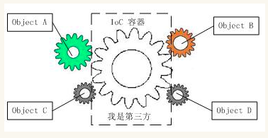

## Spring

spring干的事: 本质上就是 <span style='color:cyan;'>单例工厂模式</span> , 通过配置文件告诉它待会需要哪些类实例, spring于是在开始时就创建好这些实例, 用的时候就直接返回给用户.

> 新建的骨架项目webapp比普通项目多webapp文件夹

> 使用jdbc操作数据库时第一步的注册驱动实际上是导入jar包

> `pom.xml` 中的 `<packaging>jar</packaging>` 属性是设置将项目自动打包成jar包

> resources文件夹下的文件, 在项目打包后会成为项目根路径下的文件

> 在service层和dao层不应该定义类内成员属性并在方法内对其修改, 因为使用spring后生成的对象是单例的

* 程序的耦合: 程序之间的依赖关系

	1. 类之间的依赖
	2. 方法之间的依赖
* 解耦: 降低程序间的依赖, 应当编译器不依赖, 运行时依赖

1. 使用反射来创建对象, 而不是使用 new 关键字
2. 通过读取配置文件来获取要创建的类的全限定类名


### IOC

spring的IOC通过读取配置文件, 然后反射的方式创建对象实例


#### 问题

在三层架构中, 使用new创建dao层对象和使用new创建service层对象的方式就带来了极高的耦合性, 不符合设计标准

#### 解决思路

1. 使用bean工厂
2. 提供包含bean信息的配置文件
3. 在工厂中使用反射的方式加载配置文件创建对象


​	使用常规的new方法创建对象构建系统, 就像是手表里面的齿轮, 环环相扣, 牵一发而动全身, 十分难以维护


​	如果能有一个统一的管理中心, 管理所有的对象, 那么只需要在使用的时候声明就可以, 就不再需要使用 new , 从而避免了环环相扣的情况



​	spring就是IOC的实现, 只需要事先声明要管理哪些对象, 然后在使用它们时使用注解声明即可


#### 单例bean工厂类

* 使用 **static** 代码块在加载类的时候就读取 **配置文件**, 并且通过 **反射** 的方式创建对象
* 将初始化创建的bean对象存到工厂内一个成员属性中, 称之为 **容器**
* 对外提供获取bean实例的接口, 从 **容器** 中返回对象, 则实现了 **单例模式**
* 由此引出IOC的概念↓ ↓ ↓ ↓ ↓


#### IOC控制反转

>   控制转移 , 只是解决程序间的依赖关系 , 别无他用

主动new --> 被动被注入 , 也就是控制权反转过来了

* 不再直接使用new的方式, app不再完全依赖于要创建的目标类
* 使用bean工厂类的方式获取实例, 创建目标实例的控制权交给bean工厂, 即为控制转移
* 使用bean工厂会降低程序的耦合性, 使得app不再严重依赖其他类 (至少不会在编译的时候就报错,而是在运行时报错)


#### 使用spring进行IOC

1. 导入spring的jar包

```xml
<dependencies>
	<dependency>
    	<groupId>org.springframework</groupId>
        <artifactId>spring-context</artifactId>
        <version>5.0.2.RELEASE</version>
    </dependency>
</dependencies>
```

> 在idea中打开右侧的`maven projects` 标签, 选择项目, 点击工具栏的依赖关系视图可查看该项目的 依赖包关系 视图

2. 在 `resources` 文件夹下创建 `bean.xml` 配置文件 ( 名字随意 )
3. 给配置文件添加约束
4. 在配置文件中添加对 bean 的配置

```xml
<bean id="accountService" class="全限定类名"></bean>
<bean id="accountDao" class="全限定类名"></bean>
```

5. 在要用的bean实例的地方 获取spring的IOC容器, 并从容器中获取对应的实例

```java
public void main(){
    //获取容器对象, 这里从根路径读取bean.xml 配置文件
    ApplicationContext ac = new ClassPathXmlApplicationContext("bean.xml");
    //通过id获取对象 (两种方式, 强转和参数重载)
    IAccountService as = (IAccountService)ac.getBean("accountService");
    IAccountDao adao = ac.getBean("accountDao",IAccountDao.class);
}
```

> **关于读取配置文件并返回 容器对象 的常用实现类**
>
> ClassPathXmlApplicationContext 用于加载类路径下的配置文件
>
> FileSystemXmlApplicationContext 用于加载硬盘上任意位置的配置文件(必须要有访问权限)
>
> AnnotationConfigApplicationContext 用于读取注解创建容器

> **关于管理容器的两个工厂类接口**
>
> **ApplicationContext**  单例模式适用 (一般适用这个, 会根据配置文件自动选择适使用单例还是多例)
>
> 直接创建对象模式, 即加载完配置文件, 就创建容器并且将bean对象实例创建出来保存到容器中
>
> BeanFactory  多例模式适用
>
> 延时创建对象模式, 加载完配置文件, 只创建容器, 在调用getBean时才创建对象并存到容器中


#### bean配置文件中的三种配置方式 

>   ( spring创建对象的三种方式 )

* 使用默认构造函数来创建对象, 要求类必须有默认构造函数

```xml
<bean id="AccountService" class="类的全限定类名"></bean>
```

* 使用普通工厂中的方法创建对象 ( 使用某个类中的方法创建对象, 并存入容器中 )

  要求有一个工厂类, 这个类可能存在于jar包中, 该类提供一个方法, 返回另外一个类的实例, 目的是获取这个返回的类型的实例并存到容器中

```xml
<!-- 首先要调用工厂类的方法, 就要先实例化这个工厂对象 -->
<bean id="instanceFactory" class="工厂类的全限定类名"></bean>
<!-- factory-bean属性指定要使用哪个对象作为工厂类(值为工厂对象的id), factory-method指定使用工厂对象中的哪个方法来获取目标对象实例 -->
<bean id="accountService" factory-bean="instanceFactory"
      factory-method="getAccountService"></bean>
```

* 使用普通工厂中的静态方法创建对象 ( 与第二种不同的是无需提供工厂类的实例, 因为使用的是静态方法 )

```xml
<bean id="accountService" class="包含静态方法的工厂类的全限定类名"
      factory-method="getAccountService"></bean>
```


#### 设置bean的作用范围 

>   ( bean对象的生成模式,存在方式 )

通过设置bean标签的 `scope` 属性,  常用单例和多例模式

* singleton	单例( 默认 )

* prototype    多例

* request 作用于web应用的请求范围

* session  作用于web应用的会话范围

* global-session  作用于集群环境的会话范围, 如果不是集群环境, 这个属性就是session

  ( 用于集群中不同服务器上的登录验证码对象的共享 )

  ( 验证码对象被容器管理并生成, 共享给整个集群使用 )


> bean标签的 `init-method` 属性指定在对象创建的时候调用的方法, 此方法应存在于bean类中
>
> bean标签的 `destroy-method` 属性指定在对象销毁的时候调用的方法, 此方法应存在于bean类中


#### bean对象的生命周期

* 单例的对象
  * 随着容器的创建而创建, 随着容器的销毁而销毁
* 多例的对象
  * 在使用对象的时候才创建, 在长时间不使用时由 Java 的 垃圾回收机制回收


#### bean对象注入的三种方式 

>   ( 自动绑定的三种方式 )

* **( 一般不用 )使用构造函数进行自动绑定**, 使用 bean标签内部的 标签 `constructor-arg` 来指定创建对象时的属性值

  标签中的属性: 

  * type  用于指定要初始化数据的属性的类型, 
  * index 用于指定要初始化数据的属性的索引下标, 第一个参数是0
  * name 用于指定要初始化数据的属性的名字, 通常使用这个
  * value 指定初始化的值, 基本类型和String类型
  * ref  用于指定其他的在容器中的bean类型数据 

  要通过构造函数自动绑定的类

  ```java
  public class accountService{
      private String name;
      private int age;
      private Date birthday;
      public accountService(String name, int age,Date birthday){
          this.name = name;
          this.age = age;
          this.birthday = birthday;
      }
  }
  ```

  配置文件中使用构造函数实现注入

  ```xml
  <!--创建一个日期对象存入容器-->
  <bean id="now" class="java.util.Date"></bean>
  
  <bean id="accountService" class="全类名">
      <counstructor-arg name="name" value="xxx"></counstructor-arg>
      <counstructor-arg name="age" value="18"></counstructor-arg>
      <!--使用ref引用其他bean对象-->
      <counstructor-arg name="birthday" ref="now"></counstructor-arg>
  </bean>
  ```

  **优点**

  * 在获取对象的时候, 只有提供初始属性值才能创建成功

  **缺点**

  * 改变了创建对象的方式, 如果在实例化对象时 用不到初始参数也必须提供

* **使用set方法注入 ( 常用的方法 )**

  * 只需在目标类中提供set方法即可
  * 使用写在bean标签内的 `property` 标签
  * 标签属性:
    * name  类中set方法名去掉 `set` 后并且将第一个字母变为小写的名字, 与类中的成员属性名字无关, 只与set方法的名字有关
    * value 属性值
    * ref  引用其他的bean

  ```xml
  <bean id="accountService" class="全类名">
      <property name="name" value="test"></property>
      <property name="age" value="18"></property>
      <property name="birthday" value="now"></property>
  </bean>
  ```

  **特点**

  * 在property标签中给出的值会赋给对象, 但是无法实现限定某个属性必须赋初值


* **使用set的方式同时使用类型标签的方法给对象集合类型的属性赋初值**

  * 在 property 标签中使用 list, array, map, set标签
  * 其中给list结构集合注入数据的标签通用
  * 给map结构集合注入数据的标签通用

  ```xml
  <bean id="accountService" class="...">
  	<property name="myArray">
          <!--数组类型-->
      	<array>
          	<value>aaa</value>
              <value>bbb</value>
              <value>ccc</value>
          </array>
      </property>
      
      <property name="myList">
          <!--链表类型-->
      	<list>
          	<value>aaa</value>
              <value>bbb</value>
              <value>ccc</value>
          </list>
      </property>
      
      <property name="mySet">
          <!--set类型-->
      	<set>
          	<value>aaa</value>
              <value>bbb</value>
              <value>ccc</value>
          </set>
      </property>
      
      <property name="myMap">
          <!--map类型-->
      	<map>
              <entry key="a" value="1"></entry>
              <entry key="b" value="2"></entry>
              <entry key="c" value="3"></entry>
          </map>
      </property>
      
      <property name="myProp">
          <!--properties类型-->
      	<props>
              <!--键值对-->
          	<prop key="p1">123</prop>
              <prop key="p2">456</prop>
              <prop key="p3">789</prop>
          </props>
      </property>
      
  </bean>
  ```

  

#### 基于注解的IOC配置

>   使用注解代替xml配置文件

1. 在目标类上加注解
2. 确认已经导入spring-aop的jar包
3. 修改spring的配置文件, 添加扫描注解范围 `beans.xml`
```xml
<!--这里使用context标签,应当使用context的约束和命名空间, 在spring文档中搜索xmlns:context-->
<context:component-scan base-package="目标类的包"></context:component-scan>
```

4. 使用解析配置文件的方式实现对象的绑定


* **创建对象到容器中( 存 )** = bean (四个注解使用方式和作用完全相同, 名字不同是为了区分不同的层)
	
	* **@Component** , value用于指定id， 不写默认为类名且首字母为小写
	* **@Controller** , 表现层
	* **@Service**  , 服务层
	* **@Repository** , dao层
	
* **给对象注入数据(初始化属性)( 取 )** = property
	
	> 以下三个只能实现其他bean类型的注入, 不能实现对基本类型和String类型的注入
	* **@Autowired** 自动注入 , 先从容器中寻找类型匹配的bean对象, 如果唯一则注入, 如果不唯一则按照变量名并且根据bean的id匹配 
	* **@Qualifier** 在用于类成员变量注入时, 不能单独使用, 需要结合Autowired使用, 传入属性 value,按照这个值进行id匹配, 此时不再由变量名进行id匹配. 用于给方法的参数进行注入时可以单独使用
	* **@Resource**  使用属性name对容器进行id匹配, 可以单独使用
> 集合类型只能通过xml文件实现

	> 用于注入基本类型和String类型
	
	* @Value , 注入基本类型和String类型, 属性为value指定数据的值, 可以使用spEL( spring中的el表达式 )

> springEL : ${表达式}, 写在spring的配置文件或注解中


* **改变对象的作用范围( 单例和多例 )**

  * **@Scope( value="singleton" )**  =  scope

    设置作用范围,用于类上, 默认单例

* **设置生命周期函数**

  * **@PostConstruct**

    设置为初始化方法 , 用于类的方法上  

  * **@PreDestroy**

    设置为销毁方法, 用于类的方法上


#### 案例

##### 1. 使用spring和dbutils实现数据存储案例 ( 纯xml实现 )

1. 导入jar包
   * spring-context
   * commons-dbutils
   * mysql-connector-java
   * c3p0  连接池
   * junit
2. 创建数据库和表 account{id,name,money}
3. 创建dao层接口和实现类, service层接口和实现类
4. 在每个实现类中加上类成员属性的set方法, 以便可以被spring容器管理
5. 实现dao层实现类中的逻辑

```java
class AccountDaoImpl implements IAccountDao{
    private QueryRunner runner;
    
    public void setRunner(QueryRunner runner){
        this.runner =  runner;
    }
    
    @Override
    public List<Account> findAllAccount(){
        try{
            return runner.query("select * from account",
                                new BeanListHandler<Account>(Account.class));
        }catch(Exception e){
            throw new RuntimeException(e);
        }
    }
    
     @Override
    public Account findAccountById(int accountId){
        try{
            return runner.query("select * from account where id = ?",
                                new BeanHandler<Account>(Account.class), accountId);
        }catch(Exception e){
            throw new RuntimeException(e);
        }
    }
    
     @Override
    public void saveAccount(Account account){
        try{
            return runner.update("insert into account(name, money) values(?,?)",
                                account.getName(), account.getMoney());
        }catch(Exception e){
            throw new RuntimeException(e);
        }
    }
    
     @Override
    public void updateAccount(Account account){
        try{
            return runner.update("update account set name=?,money=? where id=?",
                 account.getName(), account.getMoney(), account.getId());
        }catch(Exception e){
            throw new RuntimeException(e);
        }
    }
    
     @Override
    public void findAllAccount(int accountId){
        try{
            return runner.update("delete from account where id=?",
                                accountId);
        }catch(Exception e){
            throw new RuntimeException(e);
        }
    }
}
```

6. 在resources目录下新建spring的配置文件 `beans.xml`

7. 添加xml配置约束
8. 配置容器中管理的对象

```xml
<!--自上而下相互依赖-->
<!--配置service-->
<bean id="acocuntService" class="全类名">
	<!--注入dao对象, 这个类中用到了dao类-->
    <property name="accountDao" ref="accountDao"></property>
</bean>

<!--配置dao对象-->
<bean id="accountDao" class="...">
	<!--注入QueryRunner对象-->
    <property name="runner" ref="runner"></property>
</bean>

<!--配置QueryRunner对象, 为了防止多个线程同时进行查询而造成的数据干扰,应设置为多例模式-->
<bean id="runner" class="org.apche.commons.dbutils.QueryRunner" scope="prototype">
	<!--注入数据源对象-->
    <constructor-arg name="ds" ref="dataSource"></constructor-arg>
</bean>

<!--配置数据源对象-->
<bean id="dataSource" class="com.mchange.v2.c3p0.ComboPooledDataSource">
	<!--设置连接池属性-->
    <property name="driverClass" value="com.mysql.jdbc.Driver"></property>
    <property name="jdbcUrl" value="jdbc:mysql://localhost:3306/数据库名"></property>
    <property name="user" value="root"></property>
    <property name="password" value="1234"></property>
</bean>
```

9. 测试接口 , 新建一个类, 右键generate 测试方法

```java
@Test
public void test(){
	//获取容器
    ApplicationContext ac = new ClassPathXmlApplicationContext("beans.xml");
    //获取业务层对象
    IAccountService as = ac.getBean("accountService", IAccountService.class);
    //执行方法
    List<Account> accounts = as.findAllAccount();
}
```


> 如果导入的jar包没有及时更新到项目中, 右键项目名-> maven -> 更新jar包


##### 2. 使用注解的方式改造上述案例 ( 但是还要使用xml )

1. 将bean的命名空间和约束 改为context

2. 将bean中的各个层的类bean删掉, 但是要留下 queryrunner和datasource的bean, 因为要实现自动注入数据, 就需要被容器管理的对象

3. 同时添加context标签设置注解的扫描范围

   ```xml
   <context:component-scan base-package="包名"></context:component-scan>
   ```

   

4. 给各个层中的实现类上加注解, 使其被容器管理

5. 删除实现类中的set方法, 同时给类中成员属性加上自动绑定的注解 

   ( 使用配置文件加property的方式才需要set方法 )


##### 3. 完全使用注解取代xml配置文件

1. 在上步的基础上

2. 新建 `config` 包, 在包中新建 `configuration` 的类 ( 名字都随意 )

3. 使用类注解 `@Configuration` 使得该类变为配置类

4. 使用类注解 `@ComponentScan("com.itcast")` 设置扫描注解的范围

5. 使用方法注解 `@Bean` 使得方法的返回值作为一个bean存入到容器中

   * 属性 `name`: 指定存入bean对象 的id, 不写时默认为方法的名字

   ```java
   //如果此类作为创建AnnotationConfigApplicationContext对象的参数,那么@Configuration可写可不写
   @Configuration
   @ComponentScan("com.itcast")
   public class Configuration{
       
       //带参数的方法中的参数相当于配置文件中的ref属性, spring会使用Autowired的方法去容器中匹配参数, 先根据类型再根据名称匹配, 
       //使用@Scope改变作用范围
       //创建QueryRunner对象
       @Bean(name="runner")
       @Scope("prototype")
       public QueryRunner createQueryRunner(DataSource dataSource){
           return new QueryRunner(dataSource);
       }
       //创建DataSource对象
       @Bean(name="dataSource")
       public DataSource createDataSource(){
           try{
               ComboPooledDataSource ds = new ComboPooledDataSource();
               ds.setDriverClass("com.mysql.jdbc.Driver");
               ds.setJdbcUrl("jdbc:mysql//localhost:3306/数据库名字");
               ds.setUser("root");
               ds.setPassword("1234");
           }catch(Exception e){
               throw new runtimeException(e);
           }
       }
   }
   ```

   

6. 在获取容器的时候使用 ApplicationContext 的另外一个实现类 `AnnotationConfigApplicationContext` 

```java
@Test
public void test(){
    //获取容器, 传入参数为带了@Configuration的配置类的字节码
    ApplicationContext ac = 
        new AnnotationConfigApplicationContext(Configuration.class);
    //获取对象
    ac.getBean("accountService");
}
```


> Class<?> a; 表示带泛型的字节码类型的变量a, 获得字节码类型使用 `某个类.class`


#### 同时使用多个配置文件

##### 多种方法:  ( 推荐使用@Import的方式 )

* 在创建`AnnotationConfigApplicationContext` 对象时传入多个配置类的字节码 ( 不推荐 )
* 在创建`AnnotationConfigApplicationContext` 对象时只传入 **主配置类** 的字节码, 然后再主配置文件的注解扫描范围中加上 **子配置类** 所在的位置, 然后再 **子配置类** 中加上 `@Configuration` 注解使得该类被解析为配置类
* 在创建 `AnnotationConfigApplicationContext` 对象时只传入 **主配置类** 的字节码, 然后在主配置类上使用类上注解 `@Import(子配置类的字节码...)` , 此时子配置类上不再需要 `@Configuration`


##### 使用@PropertySource将参数配置文件中的数据存储到容器中

1. 在上述的基础上 

   

2. 在 `resources` 文件夹下 新建 `jdbcConfig.properties` 配置文件, 并将连接池属性值写到文件中

   ```properties
   jdbc.driver=com.mysql.jdbc.Driver
   jdbc.jdbcUrl=jdbc:mysql//localhost:3306/数据库名字
   jdbc.user=root
   jdbc.password=1234
   ```

   

3. 在主配置类`Configuration`  中使用 `@PropertySource` 加载参数配置文件 

   * 属性 `value` : 指定要加载的参数配置文件的名称和路径, 可以使用关键字 `classpath`

   ```java
   @Configuration
   @ComponentScan("...")
   @Import(JdbcConfig.class)
   //因为放在 resources 目录下的配置文件在 编译后会出现在 target/classes文件夹下, 所以这里的位置应当写类路径下, classpath代表 编译后的classes文件夹
   @PropertySource("classpath:jdbcConfig.properties")
   public class Configuration{
       ...
   }
   ```

   

   > 在java项目中, src/main 文件夹下的文件 , 在编译后会出现在target/classes 文件夹下

   

4. 将连接池的属性值抽取为类内成员属性, 并且使用 `@Value("...")` 自动注入数据

   ```java
   @Configuration
   public class JdbcConfig{
       
       //使用spring的el表达式, 会从容器中匹配数据并绑定, 因为主配置文件已经加载了参数配置文件, 所以参数数据都已经存在于容器中
       @Value("${jdbc.driver}")
       private String driver;
       @Value("${jdbc.url}")
       private String url;
       @Value("${jdbc.username}")
       private String username;
       @Value("${jdbc.password}")
       private String password;
       
       //其他配置...
       
       //返回dataSource对象的方法
       @Bean(name="dataSource")
       public DataSource createDataSource(){
            try{
               ComboPooledDataSource ds = new ComboPooledDataSource();
               ds.setDriverClass(driver);
               ds.setJdbcUrl(url);
               ds.setUser(username);
               ds.setPassword(password);
           }catch(Exception e){
               throw new runtimeException(e);
           }
       }
   }
   ```

   

***综上, 考虑复杂性, 使用注解加xml配置文件的方式最方便***


#### 在junit中使用Spring

**问题** : 单纯使用junit的@Test在执行方法时不会加载spring配置文件并加载容器, 所以写在测试类中的 带@Autowired的容器变量不会自动绑定数据

```java
public class Test{
    //junit与spring没有关联, 所以这个注解不会生效, ac不会被注入数据, 在@Test方法中使用也不可行
    @Autowired
    ApplicationContext ac;
    
    @Test
    public void t1(){
        //...
    }
}
```

**解决** :

1. 导入整合的jar包 `spring-test`
2. 在测试类上使用`@RunWith` ,使其在运行测试方法时使用spring提供的main方法 ( 加载容器 )
3. 在测试类上使用 `@ContextConfiguration` , 指定要加载的配置文件位置( 使用classpath关键字 ) 或者 配置类的字节码
   * `classes` 属性 指定配置类
   * `location` 属性 指定xml配置文件的位置 ( 使用classpath关键字 ) `location="classpath:beans.xml"`

```java
@RunWith(SpringJUint4ClassRunner.class)
@ContextConfiguration(classes=Configuration.class)
public class Test{
    //此时已经实现了自动注入数据
    @AutoWired
    ApplicationContext ac;
    //...
}
```

4. 此时在运行测试方法前就已经加载了容器, 可以通过自动绑定的方式实现数据注入

> ***在使用spring 5以上的版本时, 对应的junit的版本应该在4.12以上***


> 服务器在启动时, 会创建线程池, 以保证运行时的效率. 在对一个线程操作完后 , 会将线程返回池中,而不是关闭.


TODO : 使用线程 ThreadLocal 与连接进行绑定的方式, 实现在业务层对事务的控制, 一个根据数据源管理连接的类, 一个对连接进行提交回滚操作的类( 建立在转账的案例上 )...... 


## 动态代理 

代理对象可在原类方法上对方法进行无侵入的扩展, 通过调用代理对象实现对原类方法的增强 

代理还可以提供对原接口的保护 , 提供给用户的是代理实例

动态代理使用反射的方法实现

静态代理直接写死编译到 .class文件中

#### Java接口动态代理  

* 经销商和生产厂商实现同一个接口 
* 使用JDK官方提供的Proxy类下的newProxyInstance方法获取一个代理对象

```java
//背景:
//用于实现代理的共同接口 IProduct{sale() & afterSale()}
//生产厂家对象: Product im IProduct
public void static main(){

    final Product product = new Product();
    
	//使用Proxy下的方法获取一个代理对象
    //参数一: 被代理对象的类加载器
    //参数二: 被代理对象的接口
    //参数三: 代理对象对原方法进行扩展的操作
	IProduct productProxy = (IProduct) Proxy.newProxyInstance(
    	product.getClass().getClassLoader(),
    	product.getClass().getInterfaces(),
    	new InvocationHandler(){
            //执行被代理对象的任何接口方法都会经过该方法
            //参数一: 当前代理对象
            //参数二: 当前执行的方法
            //参数三: 当前执行方法所需的参数
    		@Override
    		public Object invoke(Object proxy, 
                         Method method, Object[] args)throws Throwable{
        		//对原方法进行扩展的代码...
                //参数: 执行哪个对象的这个方法, 传入的参数是什么
       			return method.invoke(product, args); 
    		}
	});
    
    //调用代理对象的方法
    productProxy.sale(...);
        
}
```


#### cglib子类动态代理

1. 引入jar包 `cglib`, 然后确认 asm 包已经被引入
2. 使用cglib库中的Enhancer对象下的create方法创建代理对象

```java
//背景: 以上述为基础
//将IProduct接口删除
//Product不再实现该接口

public static void main(){
    
    final Product product;
    
    //参数一: 被代理对象的字节码
    //参数二: 处理方法对象, 应传入一个Callback类型的对象, 通常传入为该类型子类的MethodInterceptor类型的对象
    Product cglibProductProxy = (Product) Enhancer.create(product.getClass(),new MethodInterceptor(){
        //所有被代理对象的任何方法都会经过此方法
        //参数一: 代理对象
        //参数二: 执行的方法
        //参数三: 方法的参数
        //参数四: MethodProxy类型的代理对象
        //返回值: 使用method执行方法的返回值作为返回值即可
        @Override
        public Object intercept(
            Object proxy, Method method, 
            Object[] args,MethodProxy methodProxy)throws Throwable{
            //对原方法进行增强的代码...
            return method.invoke(product, args);
        }
    });
    
    //此时可以调用代理对象的方法
    cglibProductProxy.sale();
}
```


#### 动态代理在spring中的应用

* 使用 `连接池+连接与线程绑定+服务器线程机制+线程在用完后会直接放回池中而不是关闭,从而导致我们还需要手动清除线程上的连接绑定的问题`  的情况下, 使用动态代理对线程绑定连接的方法进行增强

* 解决乱码

    使用request对象的方法获取数据出现的乱码问题, 使用动态代理对其各个方法进行增强, 从而省去每次都写重复的转码代码 

* 用户验证

* 事物控制


TODO : 创建service的工厂类, 提供返回  *service代理对象*  的方法, 并且在该代理对象中实现对service方法的  *事务控制*  , 通过注解配置使得使用service对象的地方  **自动注入代理对象** , 从而实现  *业务层控制事务*  且  *无需*  写过多的事务控制代码...


## AOP

* 通过动态代理的方式, 将重复代码整理到一起管理, 对目标方法进行统一的增强, 从而精简代码

* Joinpoint 连接点: 在程序中被拦截的点, 就是程序中的方法. 在基于接口实现的动态代理中, 连接点就是接口中的方法

* Pointcut 切入点: 指在程序中被增强的方法. 通过判断可以实现被代理类中的方法直接按照原本的方式执行而不增强, 那么这个方法就不是切入点.

* Advice 增强/通知:  在方法被拦截后做的事情就是通知( 增强 )

  通知的类型:

  * 前置通知, 在原方法执行前做的操作
  * 后置通知, 在原方法执行后做的操作
  * 异常通知
  * 最终通知  
  * 环绕通知

  ```java
  //这个是动态代理对象中对原方法增强的方法
  @Override   //整个invoke方法, 被称为环绕通知, 在环绕通知中需要有原方法的调用
  public Object invoke(Object proxy, Method method, Object[] args)throws Throwable{
      Object rtValue = null;
      try{
          //一些操作, 被称为前置通知
          rtValue = method.invoke(accountService, args);
          //一些操作, 被称为后置通知
      }catch(Exception e){
          //异常处理, 被称为异常通知
      }finally{
      	//最终处理, 被称为最终通知
      }
  }
  ```

  * Introduction 引介:  一种特殊的通知, 在不修改类代码的前提下, 引介可以在运行期为类动态地添加一些方法和字段
  * Target 目标对象:  被代理对象
  * Weaving 织入:  使用动态代理对象对原类进行增强的过程称为 织入
  * Proxy 代理: 产生的代理对象
  * Aspect 切面: 要增强的操作处在原方法的位置称为 切面


#### 使用AOP的方式进行开发的思路

***a.开发阶段***

1. 完成业务代码
2. 抽取公共代码, 制作通知( 增强方法 )
3. 通过配置处理切入点和通知的位置关系 和 逻辑关系, 即切面.

b.运行阶段

1. spring容器读取配置文件, 在对应的切入点创建代理对象, 将通知织入到业务代码中, 生成完整的逻辑代码.


#### spring-aop中实现aop的原理

​		如果被代理的目标类实现了一个或多个自定义的接口，那么就会使用 JDK 动态代理，如果没有实现任何接口，会使用 CGLIB 实现代理，如果设置了 proxy-target-class="true"，那么都会使用 CGLIB。

​		JDK 动态代理基于接口，所以只有接口中的方法会被增强，而 CGLIB 基于类继承，需要注意就是如果方法使用了 final 修饰，或者是 private 方法，是不能被增强的。


#### spring1.2起使用的配置方式

>   ​		这节我们将介绍 Spring 1.2 中的配置，这是最古老的配置，但是由于 Spring  提供了很好的向后兼容
>
>   ​		使用配置文件的方式进行配置
>
>    	基于Java自带的 proxy 包中的动态代理方法实现的 aop，所以需要被增强对象实现接口

###### 使用 Advice 进行增强

>   直接配置 Advice 作为增强的方法将会对目标类的所有方法不加以区分都进行增强

1.  首先准备 `接口` 和 `实现类`， 目的是对该实现类进行增强

2.  实现 spring-aop 包中的 MethodBeforeAdvice 来定义 Advice，在Advice中定义各种通知

    

3.  在配置文件中指定使用Advice增强指定类

    

4.  最后用一下看看

    

###### 使用 Advisor 进行增强

>   在配置文件中创建一个 Advisor bean ，可以实现只对目标类中指定方法的增强

1.  配置文件这样写

    

###### 使用 AutoProxy 自动增强

>   ​		直接使用 ProxyFactoryBean 创建的代理对象必须指名对哪个类进行代理，所以需要一个类创建一个 ProxyFactoryBean bean对象，这样很不方便
>
>   ​		使用 AutoProxy 可以根据给定的正则规则，对匹配的所有类进行增强

1.  配置文件这样写

    

2.  然后用一下看看

    

###### 使用 DefaultAdvisorAutoProxyCreator

>   ​		创建该 bean 后，默认使得其他所有的 advice bean 生效，所以只需要在advice bean中定义匹配范围即可

1.  配置文件这样写

    

2.  用一下看看

    

    


#### 使用spring的aop( xml )

1. 导入jar包
   * spring-context
   * aspectjweaver
2. 新建业务层接口 及其 实现类

```java
//java/com/itcast/service/
public interface IAccountService{
    void findAll();
    void update(int i);
    int delete();
}

//java/com/itcast/service/impl/
public class AccountService implements IAccountService{
    void findAll(){ sout("查询方法...");}
    void update(int i){ sout("更新方法..."+i);}
    int delete(){ sout("删除方法..."); return 0;}
}
```

3. 新建log工具类, 该类中的方法将作为原serivce类方法的增强

```java
//java/com/itcast/utils/logutil
public class logutil{
    public void printlog(){
        sout("日志打印...");
    }
}
```

4. 在resources文件夹中新建 配置文件 `beans.xml`

```xml
<!--先要导入bean和aop的约束, 从官方文档中copy-->

<!--配置ioc, 把service对象配置到容器中-->
<bean id="accountService" class="...impl"></bean>

<!--配置aop-->
<!--1.把做为通知的类也配置到容器中-->
<bean id="logger" class="..."></bean>
<!--2.使用aop:config标签配置aop-->
<!--
	3.使用aop:aspect标签配置切面, 一个切面就对应一个包含用于增强其他类方法的方法的类
	id: 唯一标识
	ref:作为通知的类的bean的id
-->
<!--
	4.使用对应的标签配置作为通知的方法和类型 (这里使用logutil类中的printLog方法作为前置通知)
	method: 指定使用哪个方法作为通知
	pointcut: 指定切入点表达式, 确定给哪些方法进行增强
	切入点表达式:
		execution(表达式)	
	表达式: 
		访问修饰符 返回值 包名.包名..类名.方法名(参数列表)
	例: execution(public void com.itcast.service.impl.AccountServiceImpl.findAll())
-->
<aop:config>
	<aop:aspect id="logAdvice" ref="logger">
    	<aop:before method="printLog" 
                    pointcut="execution(public void com.itcast.service.impl.AccountServiceImpl.findAll())"></aop:before>
    </aop:aspect>
</aop:config>
<!---->
<!---->
```

5. 测试aop的织入

```java
public static void main(){
    //获取容器...
    //获取对象...
    //执行方法...
    //此时直接执行对象中的方法就会加上增强的部分
}
```

6. 关于切入点表达式 ( aspectj包实现对其解析 )

*  全通配写法: * * .. * . *(..)

* 访问修饰符可省略

* 返回值可以使用 * 表示任何类型的返回值

* 包名可以使用 * 表示任意包, 有几级包,就要写几个 * , 之间要用 . 隔开

* 包名可以使用 .. 表示当前包和当前包及其子包

* 类名和方法名都可以使用 * 表示任意类 和 方法 

* 参数列表直接写类型名, 基本类型直接写, 引用类型写 包名.类名

* 参数列表可以使用 *  表示任意类型, 但是要有参数

* 参数列表可以使用 .. 表示有无参数均可, 有参数时任意类型都可

*  **实际开发中 , 一般切到service业务层下, 通配该层下的所有方法**
  * \* com.itcast.service.impl. * . * (..)

7. 四种常用的通知类型 ( 以下通知可同时并列配置在一个 aop:aspect 下, 增强的位置同动态代理中的位置)

* aop:before	前置
* aop:before-returning    后置
* aop:after-throwing    异常
* aop:after    最终    

8. 使用 aop:pointcut 定义切入点表达式并 使用 pointcut-ref属性 在 通知定义中使用

```xml
<aop:before method="printLog" pointcut-ref="pt1"></aop:before>
<!--表达式定义, 如果这个标签写在 aop:aspect内, 那么只能在此切面中使用, 如果写在外面(必须写在切面标签之前), 那么所有切面都可以使用-->
<aop:pointcut id="pt1" expression="execution(.......)"></aop:pointcut>
```

9. 环绕通知的使用 ( 其实就是相当于自己使用创建动态代理对象的方式实现增强 )

   1. 使用aop:around配置环绕通知的方法

   ```xml
   <aop:around method="roundPrint" pointcut-ref="pt1"></aop:around>
   ```

   2. 自定义环绕通知的方法

   ```java
   //在写环绕通知的方法时, 可以在使用ProceedingJoinPoint类型的参数
   //这个参数由spring提供, 执行参数的proceed()方法就相当于明确调用切入点原方法, 等同于动态代理中的method.invoke()
   //参数的getArgs()方法可以获取原方法中的参数列表
   public Object roundPrint(ProceedingJoinPoint pjp){
       Object trValue = null;
       try{
           //...前置通知
           Object[] args = pjp.getArgs();
           trValue = pjp.proceed(args);
           //...后置通知
           return trValue;
       }catch(Throwable t){//这里必须使用Throwable类型来捕获
           //...异常通知
       }finally{
       	//...最终通知
       }
   }
   ```

   


#### 使用spring的AOP( 注解 )  

> **注意: 使用注解的方式时, (后置通知|异常通知) 和 最终通知的顺序会颠倒, spring本身存在的问题, 可以通过使用环绕通知来避免这个问题**

1. 在切面类及其方法上使用注解

   ```java
   @Component("logger")
   @Aspect //使其称为一个切面类
   public class logutil{
       
       //定义表达式
       @Pointcut("execution(......)")
       private void pt1(){}
       
       //引用表达式
       @Before("pt1()")  //注意导包使用aspectj
       public void beforePrint(){...}
       @AfterThrowing("pt1()")
       public void afterThrowingPrint(){...}
       @AfterReturning("pt1()")
       public void afterReturningPrint(){...}
       @After("pt1()")
       public void afterPrint(){...}
       @Around("pt1()")
       public Object aroundPrint(){...}
   }
   ```

   

2. 在spring的配置文件中添加对aop的注解支持开启

   ```xml
   <aop:aspectj-autoproxy></aop:aspectj-autoproxy>
   ```

   

#### 完全不使用xml的方式实现aop

* 在配置类上加上注解 `@EnableAspectJAutoProxy`, 开启对aop注解的支持


#### AOP的应用场景 

>   对于重复代码只写一次,交给动态代理自动调用

* 记录日志
* 判断登录状态
* 判断权限


## spring中使用jdbcTemplate

* jdbcTemplate实际上就是对jdbc进行了再次的封装的一个类

* 使用:

  1. 导包

     * spring-context
     * spring-jdbc
     * spring-tx 事务管理
     * mysql-connector-java 基础的数据库连接

  2. 创建数据库, 创建一张表 account{ id, name, money} 

  3. 创建实体类

  4. 进行测试

     ```java
     public static void main(){
         //创建数据源(连接池)
         //之前使用的是c3p0连接池
         //这里使用DriverManagerDataSource, 是spring内置的一个连接池对象
         DriverManagerDataSource ds = new DriverManagerDataSource();
         ds.setDriverClassName("com.mysql.jdbc.Driver");
         ds.setUrl("jdbc:mysql://localhost:3306/数据库名");
         ds.setUsername("root");
         ds.setPassword("1234");
         
         //创建模板对象
         JdbcTemplate jt = new JdbcTemplate(ds);
         //执行sql
         jt.execute("sql语句");
     }
     ```

     

  5. 新建spring配置文件, 使用ioc容器管理数据源对象和jdbctemplate对象
  
     ```xml
     <beans>
     
         <bean id="jdbcTemplate" class="jdbcTemplate全名">
             <property name="dataSource" ref="dataSource"></property>
         </bean>
         
         <bean id="dataSource" class="DriverManagerDataSource全名">
             <property name="driverClassName" value="..."></property>
             <!--其余三项配置-->
         </bean>
         
     </beans>
     ```

     
  
  6. 修改测试为读取spring配置文件获取对象 以及 **jdbcTemplate的CRUD操作**
  
     ```java
     public static void main(){
         //获取容器...
         //获取对象...
         //执行方法...
         //增, 删, 改
         jt.update("sql,使用?在参数位置", args);
         //查询 , 使用query方法, 
         //该方法有很多参数重载,
         //对于我们的需求: 提供sql和参数列表, 得到list类型的结果, 
         //可以对这些方法重载进行筛选
         //最终得到两个方法的重载, 一个是接收数组类型的参数列表, 一个是接收可变参数的参数列表
         //由于 可变参数是在jdk1.5之后才支持的, 所以这两个方法重载功能上没有区别,区别仅在于支持的jdk版本不同, 这里选用可变参数的版本
         //jt.query(sql, 实现RowMapper接口的类, args..);
         List<Account> accounts = jt.query("sql", new RowMapper(){
             @Override
             ...(rs){
                 //这个方法实现对rs操作后返回一个account对象, spring会自动将所有结果封装到一个数组中
                 Account ac = new Account();
                 ac.setId(rs.getInt("ID"));
                 ac.setName(rs.getString("Name"));
                 ac.setMoney(rs.getInt("money"));
                 return ac;
             }
         },args..);
         //同时在spring中提供BeanPropertyRowMapper<T>对象, 它实现了RowMapper接口, 只要提供要转换的实体的字节码, 就可以将数据封装到对象中, 推荐使用这种
         List<Account> accounts = jt.query("sql", 
                          new BeanPropertyRowMapper<Account>(Account.class),args..);
         //对于查询一条数据, 同样推荐使用BeanPropertyRowMapper的方法, 只需取结果数组的第一个
         
         
         //查询一行一列(使用聚合函数: count之类)
         //第二个参数是返回值的类型的字节码
         Long count = jt.queryForObject(
             "select count(*) from account where money>?", Long.class, 1000f);
            
     }
     ```

     
  
  7. 创建dao接口及其实现, 将jdbcTemplate应用于dao层
  
  8. 实际开发中, dao层的类不止一个, 其中每个类中都要有一个jdbcTemplate对象为类成员属性 和 它的set方法, 而且该成员属性还要在spring的配置文件中使用property进行注入, 这样就造成了很多重复的代码, 如下
  
     ```java
     public class AccountDao implements IAccountDao{
         //每个dao实现类中都要这些
         private JdbcTemplate jt;
         public void setJdbcTemplate(JdbcTemplate jt){
             this.jt = jt;
         }
         
         //...其他接口
     }
     ```
  
     
  
     ```xml
     <bean id="accountDao" class="...">
     	<property name="jt" ref="jdbcTemplate"></property>
     </bean>
     
     <bean id="jdbcTemplate" class="...">
         <property name="dataSource" ref="dataSource"></property>
     </bean>
     ```
  
     
  
  9. 将dao层实现类中关于jdbcTemplate成员属性的代码抽取到另外一个类中, 所有dao层的类都继承这个类, 从而这些dao层的实现类中都有了jdbcTemplate成员属性

     ```java
     //这个类提供dao层中的重复代码, 供其他dao类进行继承
     class JdbcDaoSupport{
         private JdbcTemplate jt;
         public void setJdbcTemplate(JdbcTemplate jt){
             this.jt = jt;
         }
     }
     ```
  
     
  
     ```java
     //那么dao层类就应当是这样
     public class AccountDao extends JdbcDaoSupport implements IAccontDao{
         //...其他接口方法
     }
     ```
  
     
  
  10. 同时, 可将JdbcDaoSupport进行改造, 使得给dao层的类提供dataSource对象即可
  
      ```java
      class JdbcDaoSupport{
          private JdbcTemplate jt;
          public void setJdbcTemplate(JdbcTemplate jt){
              this.jt = jt;
          }
          
          //添加根据dataSource初始化jdbcTemplate对象, 使得只要给dao类提供dataSource对象即可同时实现对jdbcTemplate的初始化
          //因为使用配置文件中的property属性, spring在初始化对象时, 会调用该属性的set方法, 所以在调用该方法后, 会实现对jdbcTemplate的初始化
          public void setDataSource(DataSource dataSource){
              if(this.jt==null){
                  return new JdbcTemplate(dataSource);
              }else{
               	return this.jt;
              }
          }
      }
      ```

      同时对dao类的配置 不再需要传入jdbcTemplate属性, 只需要传入dataSource属性即可

      ```xml
      <bean id="accountDao" class="...">
      	<property name="dataSource" ref="dataSource"></property>
      </bean>
      
      <!--不再需要在配置文件中配置jdbcTemplate对象-->
      ```
  
      
  
  11. **以上的JdbcDaoSupport类在spring包中已经存在, 现在只需要删除 自己写的这个JdbcDaoSupport类, 导入spring包中的 `org.springframework.jdbc.core.support.JdbcDaoSupport` 即可使用**
  
  12. 总结: 对于dao层的实现类, 只需要继承 `JdbcDaoSupport` , 然后在类中写接口方法即可. 对于配置文件, 只需要配置 `dataSource` 对象, 同时将该对象作为参数赋给实现了上述接口的类即可.
  
  
  
  **如果使用上述方式继承了spring的JdbcDaoSupport类, 那么就不能再dao类中定义一个jdbcTemplate并且使用@Autowired自动注入.**
  
  ***如果不使用上述继承的方式, 那么可以使用常规的注解自动注入的方式***


使用spring的aop,将自定义的事务管理方法设置为切面方法......


如果使用注解的方式将自定义的事务管理方法设置为切面方法, 那么需要注意spring本身存在的调用顺序的bug, 应当使用环绕通知


## spring事务管理

#### xml方式

* javaee 中的事务控制应当在业务层
* spring提供事务控制的一组接口, 在spring-tx 中包含
* spring中的事务也是基于aop实现的


1. 导包

   * spring-tx
   * spring-context
   * spring-jdbc
   * mysql-connector-java
   * aspectjweaver

2. 在spring配置文件中添加事务管理的约束( tx ), 在文档主页选择 Data Access , 搜索xmlns:tx

3. 在spring配置文件中, 对事务管理器及其aop进行配置  

   ```xml
   <!--配置事务管理器对象-->
   <!--这里是管理直接配置数据源的事务, 所以选择dataSourceTransactionManager, 如果是管理hibernate,那么应该使用hibernateTransactionManager类, 这两个类都实现了接口PlatformTransactionManager-->
   <bean id="transactionManager" class="DataSourceTransactionManager全类名">
   	<property id="dataSource" ref="dataSource"></property>
   </bean>
   
   <!--配置事务的通知-->
   <!--这里实际上就是配置一个事务管理器对象-->
   <!-- id: 唯一标识 -->
   <!--  transaction-manager: 使用哪个对象作为事务管理器 -->
   <tx:advice id="txAdvice" transaction-manager="transactionManager">
   	<!--配置事务属性-->
       <tx:attributes>
           <!--对业务层中名字是transfer的方法进行单独的事务属性配置-->
           <!--
   	属性:
   		isolation: 隔离级别, 默认DEFAULT,表示使用数据库的默认隔离级别
   		propagation: 事务的传播行为, 默认为REQUIRED, 表示一定有事务,增删改方法选这个, 查询方法选择 SUPPORTS
   		read-only: 是否只读, 查询方法设置为true, 默认为false, 表示可读写
   		timeout: 事务超时时间, 默认为-1,表示永不超时, 指定数值以秒为单位
   		rollback-for: 用于指定一个异常, 只有产生该异常时才回滚, 产生其他异常不回滚, 无默认值
   		no-rollback-for: 用于指定一个异常, 只有产生该异常时不回滚,产生其他异常时回滚,无默认值
   		-->
       	<tx:method name="transfer" propagation="REQUIRED" read-only="false"/>
           <!--可以使用通配符匹配方法-->
           <!--写在下面的会覆盖上面的-->
           <!--使用通配符时为了配置生效, 要保证业务层方法的命名规范-->
           <!--以下两行配置在业务层方法命名规范的情况下可以覆盖全需求-->
           <tx:method name="*" propagation="REQUIRED" read-only="false"/>
           <tx:method name="find*" propagation="SUPPORTS" read-only="true"/>
       </tx:attributes>
   </tx:advice>
   
   
   <aop:config>
       <!--在aop配置中配置一个切入点表达式-->
   	<aop:pointcut id="pt1" 
                expression="execution(* com.itheima.service.*.*(..))"></aop:pointcut>
       <!--将切入点表达式应用到事务管理器中(建立联系)-->
       <aop:advisor advice-ref="txAdvice" pointcut-ref="pt1">
   </aop:config>
   ```

   

4. 测试业务层的方法是否事务控制成功


#### 注解方式

1. 在spring配置文件中配置事务管理器

   ```xml
   <!--配置事务管理器对象-->
   <bean id="transactionManager" class="DataSourceTransactionManager全类名">
   	<property name="dataSource" ref="dataSource"></property>
   </bean>
   
   <!--开启对事务管理注解的支持-->
   <tx:annotation-driven transaction-manager="transactionManager"></tx:annotation-driven>
   ```

   

2. 在需要事务支持的类( 业务层的类 )上加上 `@Transactional` 注解, 使其方法被事务管理

   ```java
   @Service("accountService")
   //事务的属性可以进行配置 ,也可以不配置直接使用全默认 @Transactional
   //该注解可以使用在方法上, 用于给方法指定特定的属性
   @Transactional(propagation= Propagation.SUPPORTS, readonly=true)
   public class AccountService{
       //此方法包含对数据的增删改, 配置此方法执行的事务属性为 必须有事务, 可读可写
       @Transactioal(propagation=Propagation.REQUIRED, readonly=false)
       public void transfer(){
           //...
       }
   }
   ```

   

3. 对业务层的类方法进行测试


#### 纯注解方式

1. 新建事务管理配置类, 添加返回PlatFormTransactionManager对象的方法, 并使用@Bean使其加入到容器中, 然后在主配置文件中导入这个事务管理配置类
2. 测试事务管理


> spring5,该版本基于jdk1.8编写 , 所以低版本的jdk无法使用

> spring5,该版本tomcat要求8.5及以上

> jdk1.8比1.7在反射创建对象时的效率有显著的提升


## BeanFacotry 和 FactoryBean

###### BeanFactory

​		BeanFacotry 是最顶层的 ioc 容器接口， 提供了用于存放 beanDefination 和 beanmap 的字段，spring ioc 初始化实际上就是在初始化一个 BeanFactory 类型的对象，然后把这个对象称作 上下文，并读取配置，将指定的类初始化实例保存到该 上下文 对象中，待到使用这些类实例时，直接从 上下文 对象中取出

一句代码使用spring


BeanFactory 家族


ApplicationContext 家族


###### Factorybean

`org.springframework.bean.factory.FactoryBean`

>   直接把工厂类用作 bean 的定义

​		Factorybean是一个接口，包含getObect()方法，使用该方法获取其他对象的实例，所以实现了该类型的类为工厂类

​		IOC容器默认通过反射的方式创建bean，在某些情况下，实例化Bean过程比较复杂，如果按照传统的方式，则需要在<bean>中提供大量的配置信息。配置方式的灵活性是受限的，这时采用编码的方式可能会得到一个简单的方案。

​		Spring为此提供了一个 `org.springframework.bean.factory.FactoryBean` 的工厂类接口，用户可以通过实现该接口定制实例化Bean的逻辑。FactoryBean接口对于Spring框架来说占用重要的地位，Spring自身就提供了70多个FactoryBean的实现

​		如果使用 Factorybean 来创建其他 bean， 那么肯定首先得有一个 Factorybean 实例，所以该工厂类也应当交给 IOC容器 来管理，当用户通过 Factorybean 的 bean id 获取实例时，实际上返回的是 getObject() 方法的返回值，如果要获取FactoryBean对象，请在 `id` 前面加一个 `&` 符号来获取

1.  创建工厂对象，继承 FactoryBean，实现 getObject() 方法
2.  直接在xml配置文件中，将工厂类当做普通类使用来定义 bean， 此时该bean默认返回的值为 getObject() 的返回值


###### 通过 `工厂类` 来创建 bean

1.  可以通过 静态方法 创建

    ```xml
    <bean id="clientService"
        class="examples.ClientService"
        factory-method="createInstance"/>
    ```

    ```java
    public class ClientService {
        private static ClientService clientService = new ClientService();
        private ClientService() {}
    
        // 静态方法
        public static ClientService createInstance() {
            return clientService;
        }
    }
    ```

2.  也可以通过工厂的实例方法创建

    ```xml
    <bean id="serviceLocator" class="examples.DefaultServiceLocator">
        <!-- 这个是工厂实例 -->
    </bean>
    
    <!-- factory-bean 设置工厂实例 -->
    <!-- factory-method 设置使用工厂实例中的哪个方法来获取bean实例 -->
    <bean id="clientService"
        factory-bean="serviceLocator"
        factory-method="createClientServiceInstance"/>
    
    <bean id="accountService"
        factory-bean="serviceLocator"
        factory-method="createAccountServiceInstance"/>
    ```


## BeanDefination

Bean 是什么, Bean 在代码层面上可以简单认为是 BeanDefinition 的实例

IOC容器 就是存放 BeabName 和 BeanDefination 对应关系的 map

BeanDefinition 中保存了我们的 Bean 信息，比如这个 Bean 指向的是哪个类、是否是单例的、是否懒加载、这个 Bean 依赖了哪些 Bean 等等

```java
public interface BeanDefinition extends AttributeAccessor, BeanMetadataElement {

   // 我们可以看到，默认只提供 sington 和 prototype 两种，
   // 很多读者可能知道还有 request, session, globalSession, application, websocket 这几种，
   // 不过，它们属于基于 web 的扩展。
   String SCOPE_SINGLETON = ConfigurableBeanFactory.SCOPE_SINGLETON;
   String SCOPE_PROTOTYPE = ConfigurableBeanFactory.SCOPE_PROTOTYPE;

   // 比较不重要，直接跳过吧
   int ROLE_APPLICATION = 0;
   int ROLE_SUPPORT = 1;
   int ROLE_INFRASTRUCTURE = 2;

   // 设置父 Bean，这里涉及到 bean 继承，不是 java 继承。请参见附录的详细介绍
   // 一句话就是：继承父 Bean 的配置信息而已
   void setParentName(String parentName);

   // 获取父 Bean
   String getParentName();

   // 设置 Bean 的类名称，将来是要通过反射来生成实例的
   void setBeanClassName(String beanClassName);

   // 获取 Bean 的类名称
   String getBeanClassName();


   // 设置 bean 的 scope
   void setScope(String scope);

   String getScope();

   // 设置是否懒加载
   void setLazyInit(boolean lazyInit);

   boolean isLazyInit();

   // 设置该 Bean 依赖的所有的 Bean，注意，这里的依赖不是指属性依赖(如 @Autowire 标记的)，
   // 是 depends-on="" 属性设置的值。
   void setDependsOn(String... dependsOn);

   // 返回该 Bean 的所有依赖
   String[] getDependsOn();

   // 设置该 Bean 是否可以注入到其他 Bean 中，只对根据类型注入有效，
   // 如果根据名称注入，即使这边设置了 false，也是可以的
   void setAutowireCandidate(boolean autowireCandidate);

   // 该 Bean 是否可以注入到其他 Bean 中
   boolean isAutowireCandidate();

   // 主要的。同一接口的多个实现，如果不指定名字的话，Spring 会优先选择设置 primary 为 true 的 bean
   void setPrimary(boolean primary);

   // 是否是 primary 的
   boolean isPrimary();

   // 如果该 Bean 采用工厂方法生成，指定工厂名称。对工厂不熟悉的读者，请参加附录
   // 一句话就是：有些实例不是用反射生成的，而是用工厂模式生成的
   void setFactoryBeanName(String factoryBeanName);
   // 获取工厂名称
   String getFactoryBeanName();
   // 指定工厂类中的 工厂方法名称
   void setFactoryMethodName(String factoryMethodName);
   // 获取工厂类中的 工厂方法名称
   String getFactoryMethodName();

   // 构造器参数
   ConstructorArgumentValues getConstructorArgumentValues();

   // Bean 中的属性值，后面给 bean 注入属性值的时候会说到
   MutablePropertyValues getPropertyValues();

   // 是否 singleton
   boolean isSingleton();

   // 是否 prototype
   boolean isPrototype();

   // 如果这个 Bean 是被设置为 abstract，那么不能实例化，
   // 常用于作为 父bean 用于继承，其实也很少用......
   boolean isAbstract();

   int getRole();
   String getDescription();
   String getResourceDescription();
   BeanDefinition getOriginatingBeanDefinition();
}
```

BeanDefinition 的覆盖问题

​		BeanDefinition 的覆盖问题可能会有开发者碰到这个坑，就是在配置文件中定义 bean 时使用了相同的 id 或  name

​		默认情况下，allowBeanDefinitionOverriding 属性为  null，如果在同一配置文件中重复了，会抛错，但是如果不是同一配置文件中，会发生覆盖


## spring容器初始化

```java
@Override
public void refresh() throws BeansException, IllegalStateException {
   // 来个锁，不然 refresh() 还没结束，你又来个启动或销毁容器的操作，那不就乱套了嘛
   synchronized (this.startupShutdownMonitor) {

      // 准备工作，记录下容器的启动时间、标记“已启动”状态、处理配置文件中的占位符
      prepareRefresh();

      // 这步比较关键，这步完成后，配置文件就会解析成一个个 Bean 定义，
      // 注册到 BeanFactory 中，
      // 当然，这里说的 Bean 还没有初始化，只是配置信息都提取出来了，
      // 注册也只是将这些信息都保存到了注册中心
      // (说到底核心是一个 beanName-> beanDefinition 的 map)
      ConfigurableListableBeanFactory beanFactory = obtainFreshBeanFactory();

      // 设置 BeanFactory 的类加载器
      // 添加几个 BeanPostProcessor，手动注册几个特殊的 bean
      prepareBeanFactory(beanFactory);

      try {
         // 【 Bean 如果实现了接口 BeanFactoryPostProcessor，
         // 那么在容器初始化以后，
         // Spring 会负责调用里面的 postProcessBeanFactory 方法。】
         // 到这里的时候，所有的 Bean 都加载、注册完成了，但是都还没有初始化
         postProcessBeanFactory(beanFactory);
         // 调用 BeanFactoryPostProcessor实现类的 postProcessBeanFactory方法
         invokeBeanFactoryPostProcessors(beanFactory);          

         // 注册 BeanPostProcessor 的实现类
         // 此接口两个方法: 
         // postProcessBeforeInitialization 和 postProcessAfterInitialization
         // 两个方法分别在 Bean 初始化之前和初始化之后得到执行。
         // 这里仅仅是注册，之后会看到回调这两方法的时机
         registerBeanPostProcessors(beanFactory);

         // 初始化当前 ApplicationContext 的 MessageSource
         initMessageSource();

         // 初始化当前 ApplicationContext 的事件广播器
         initApplicationEventMulticaster();

         // 从方法名就可以知道，典型的模板方法(钩子方法)，不展开说
         // 具体的子类可以在这里初始化一些特殊的 Bean
         //（在初始化 singleton beans 之前）
         onRefresh();

         // 注册事件监听器，监听器需要实现 ApplicationListener 接口
         registerListeners();

         // 初始化所有的 singleton beans
         //（lazy-init 的除外）
         finishBeanFactoryInitialization(beanFactory);

         // 最后，广播事件，ApplicationContext 初始化完成，不展开
         finishRefresh();
      }

      catch (BeansException ex) {
         if (logger.isWarnEnabled()) {
            logger.warn("Exception encountered during context initialization - " +
                  "cancelling refresh attempt: " + ex);
         }

       
         // 销毁已经初始化的 singleton 的 Beans，以免有些 bean 会一直占用资源
         destroyBeans();

         // Reset 'active' flag.
         cancelRefresh(ex);

         // 把异常往外抛
         throw ex;
      }

      finally {
         // Reset common introspection caches in Spring's core, since we
         // might not ever need metadata for singleton beans anymore...
         resetCommonCaches();
      }
   }
}
```


## 初始化Bean后的钩子函数

>   有四种写法来定义 Bean 初始化后的回调函数

1.  ```xml
    <!-- xml 设置 -->
    <bean id="exampleInitBean" class="examples.ExampleBean" init-method="init"/>
    ```

2.  ```java
    public class AnotherExampleBean implements InitializingBean {
    // 实现接口并定义方法
        public void afterPropertiesSet() {
            // do some initialization work
        }
    }
    ```

3.  ```java
    // 使用注解
    @Bean(initMethod = "init")
    public Foo foo() {
        return new Foo();
    }
    ```

4.  ```java
    // 使用注解
    @PostConstruct
    public void init() {
    
    }
    ```


## 销毁Bean后的钩子函数

>   有四种方法定义销毁 Bean 后的钩子函数

1.  ```xml
    <bean id="exampleInitBean" class="examples.ExampleBean" destroy-method="cleanup"/>
    ```

2.  ```java
    public class AnotherExampleBean implements DisposableBean {
    
        public void destroy() {
            // do some destruction work (like releasing pooled connections)
        }
    }
    ```

3.  ```java
    @Bean(destroyMethod = "cleanup")
    public Bar bar() {
        return new Bar();
    }
    ```

4.  ```java
    @PreDestroy
    public void cleanup() {
    
    }
    ```


## BeanFactoryPostProcessor

>   ​		BeanFactoryPostProcessor 同样为一个接口，用来对 beanFactory 进行增强
>
>   ​		与BeanPostProcessor 不同的是，BeanFactoryPostProcessor 在 bean 实例化之前对 beanFactory 进行增强，而 BeanPostProcessor 在 bean 实例化后，对bean实例进行增强

>   ​		BeanFactoryPostProcessor 的作用范围同样是全局，即对所有的 beanFactory 生效，不过实际应用中一般只开启一个 beanFactory（ApplicationContext）就足够了

使用自定义的BeanFactoryPostProcessor

1.  写类来实现 BeanFactoryPostProcessor 接口

    

    其中包含一个函数，入参为 beanFactory，既然都能拿到 beanFactory 了，那么就意味着可以对任何 beanDefination ，beanNames 进行任意修改

    

2.  在配置文件中设置使用自定义的 BeanFactoryPostProcessor

    

3.  启动容器验证 BeanFactoryPostProcessor 的执行时机，是在所有的 bean 实例化之前进行的，因此结论就是 BeanFactoryPostProcessor 用来在实例化 bean 之前对 beanFactory 进行增强，<span style='color:cyan;'>不过它是一次性执行的</span>


## BeanPostProcessor


>   ​		BeanPostProcessor 就是 spring 初始化时上图的这个步骤中注册的东西，注册说白了就是把配置文件中设置的 BeanPostProcessor 解析出来保存下来
>
>   ​		但是在这个步骤中仅仅是注册，而不会调用，待到真正实例化对象时，才会调用

>   ​		BeanPostProcessor 为初始化 bean 时的增强, BeanPostProcessor 的作用范围为其他所有bean，所以如果想要针对某些 bean的初始化进行增强，请在实现的方法中先判断 beanName

使用自定义的 BeanPostProcessor

1.  先实现 BeanPostProcessor 接口

    

    其中包含两个方法

    

    

    分别是 前置处理逻辑 和 后置处理逻辑

2.  然后在配置文件中使用

    

3.  被 BeanPostProcessor 增强的对象，会分别在 init-method 的前后调用 BeanPostProcessor 中的前置和后置方法，所以结果是

    

    


