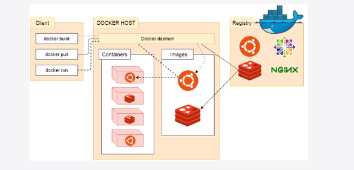

### Docker

<span style="color:cyan;">常规虚拟化技术( 云服务器原理 ) </span>

​		在多台计算机硬件上直接安装一个Hypervisor( 虚拟化管理程序 ), 使得这些计算机成为一个统一的整体, 然后由这个Hypervisor来对整个硬件系统进行分配, 划分出一个个的独立的硬件区域, 然后在这些独立的硬件区域上再安装操作系统, 也就是将这些独立的硬件区域进行出售.


* 系统结构: 

​		最底层是硬件资源 , 上面是每个机器的操作系统, 往上是虚拟化管理程序, 往上是一个个独立的硬件区域 , 在硬件区域上安装独立的操作系统


* 缺点: 

​		由虚拟化管理程序划分的硬件区域是相互独立的, 它们之间不能硬件资源共享, 所以总是不可避免地会造成硬件资源的浪费, 同时也可能造成某一区域的内存溢出( 内存不够用 )等问题

<span style="color:cyan;">Docker( 也属于虚拟化技术 ) </span>

​		在每个机器的操作系统上安装Docker, 然后在Docker上运行程序, 这些程序可以使用所有底层机器的资源, 就不会造成资源浪费或内存溢出( 内存不够用 )的问题

优点 :

* 使得运行的程序可以使用所有底层机器的硬件资源
* 运行比传统的虚拟化技术更快, 因为无需在独立的硬件区域再启动一个完整的操作系统

* 使用docker就不再需要在linux手动安装软件 , 并手动下载一层又一层该软件所需的依赖来支持该软件, 只需要使用镜像就可以解决所有问题


#### Docker引擎和架构

> 其实就是程序的结构

* 客户端/服务端的c/s结构 

* 服务端是一个运行于操作系统的后台守护进程, 服务端负责维护当前操作的镜像, 以及创建的容器

* 使用客户端 ( docker命令行工具 ) 来通过命令请求服务端对其中的镜像或容器或容器中的应用程序进行操作

* 可以通过docker命令行工具来拉取  **官方镜像** ( 容器模板,也就是类 ) 到本地的服务端来创建 **容器** ( 也就是实例 ), 同时这里可以使用继承镜像来同时使一个 容器 拥有多个 镜像 中的内容

* 当使用客户端请求服务端拉取一个镜像时, 服务端 会从仓库中 ( 如果请求的是官方的镜像, 那么就是官方仓库 )拉取镜像到服务端本地, 然后再根据本地的镜像对本地的容器进行操作

* 这个创建出来的容器由 服务端 来维护, 可以同时运行一个或多个程序

  

* docker容器中的应用程序来自于docker官方的仓库

* 在一个docker容器中同时开多个nginx之类的服务器, 就可以实现负载均衡

* 虚拟机里不可以运行虚拟机, docker中可以运行docker


#### Docker的数据存储

* 假如在Docker的容器中安装了一个ubuntu的操作系统 , 那么不建议在该操作系统中直接进行数据的存储, 而是使用宿主机( 运行Docker的机器 ) 上的 **数据卷文件** 或者 **绑定宿主机上的目录** 来进行数据存储 , 这样使得docker上运行的程序使用的是宿主机上的数据 , 实现了容器中不同程序之前的数据共享, 同时提高了数据的存储效率, 就相当于直接在宿主机上进行的数据操作 .   


#### Docker的仓库

* 包括 官方仓库( https://hub.docker.com ) 和 私有仓库

> docker会在原操作系统上虚拟出一个网卡供运行在docker上的程序联网


#### ubuntu安装docker

> docker必须安装在64位的系统上

1. `curl -fsSL get.docker.com -o get-docker.sh`  从官网获取下载docker的脚本
2. `sh get-docker.sh --mirror Aliyun`  设置镜像为aliyun并执行脚本安装docker
3. `docker version`  测试安装结果

> 配置镜像加速器 ( 默认使用官方镜像仓库,速度慢 )

* 适用于 ubuntu16.04+ , Debian 8+ , CentOS 7

  1. 在 `/etc/docker/daemon.json` 中加入如下, 如果该文件不存在则新建

  ```json
  {
      "registry-mirrors" : [
          "https://registry.docker-cn.com"
      ]
  }
  ```

  2.  `systemctl restart docker`  重启服务使得设置生效
  3.  `docker pull tomcat` 测试下载速度  ( `docker pull tomcat:9-jre8` 拉取指定版本 )
  4.  `docker images` 列出下载的镜像
  5.  `docker run -p 8080:8080 tomcat` 在指定端口启动tomcat
  6.  在浏览器使用url访问测试


#### Docker镜像

* 拉取镜像

  ```shell
  docker pull [选项] [仓库地址[:端口号]/]仓库名(软件名)[:标签(软件版本)]
  ```

1. 拉取一个ubuntu的镜像在docker中 `docker pull ubuntu:16.04`

2. 查看拉取结果 `docker images`

3. 启动docker中的ubuntu容器

   ```shell
   #反斜杠代表这是多行命令, 这句按完enter后继续在下一行输入命令
   # run 启动一个容器
   # -i 交互式的启动 (就是将主线程交给这个启动的容器)
   # -t 终端式的启动 
   # 启动一个容器相当于创建了一个实例,这里的实例占用的是硬盘的空间来存储数据, 在退出该容器时不会删除该实例, 还可以通过查看所有容器命令查看的到, 使用 --rm 来设置退出容器时即删除容器实例避免浪费硬盘空间
   docker run -it --rm \
   #启动ubuntu16.04 下的bash程序, bash是liunx下处理shell的程序
   ubuntu:16.04 \
   bash
   
   #然后会变成如下, 其中这串字符串就是docker中的ubuntu的机器名, 此时已登录到docker中的ubuntu
   root@346e223ae27:/#
   
   
   #输入 exit 或者使用 ctrl+D 来退出
   ```


* ***虚悬镜像*** : 在对某个镜像进行更新后, 新的镜像会占用原老版本镜像的名字和标签, 那么老版本镜像会失去名字和标签, 在使用 `docker images` 进行查看时 , 名字和标签都会显示为 <none> ,  这就被称为 **虚悬镜像** , 此时因为有新版本镜像的存在 ,  该虚悬镜像不再必要 , 使用 `docker image prune` 删除虚悬镜像

* **删除本地镜像**  :  `docker image rm <镜像ID>`  或者  `docker image rm ubuntu:18.04` (指定镜像名和标签)

  或者 `docker rmi <镜像ID|镜像名:标签>`


#### Docker容器

> 每个容器之间都是独立的, 称为 沙盒机制, 沙箱机制, 隔离机制, 因为这一点的存在, 可以实现高可用, 一个坏了不会影响其他的使用

* `docker ps` ***查看正在运行***的容器 , 当前运行的容器会显示在这里

* `docker ps -a`  ***查看所有***容器

* `docker rm <容器id(从上一条命令中查)>`  ***删除***指定的容器

* `docker container prune` ***删除所有***处于终止状态的容器

* 容器的名字 `NAMES` , 通过查看容器列表信息可得, 如果启动容器时不指定, 那么这个名字是随机的

* `docker run -p 8080:8080 --name tomcat tomcat` 指定***容器名字***并启动容器

* `docker restart <容器ID|容器名字>`  ***重新启动***容器, 容器之前被创建过, 而且没有正在运行, 使用该命令来重启容器

* `docker stop <容器ID|容器名字>` ***停止***正在运行的容器

* `docker run -p 8080:8080 --name tomcat -d tomcat` 使用参数`-d` 以***守护进程***的状态来运行容器 , 这样就不会占用shell命令窗口的主线程, 返回的是开启容器的完整ID ( 在`docker ps`中查看的ID是容器完整ID的前12位 )

* `docker exec -it <容器id|容器名字> bash` 以交互的方式***进入***容器

  


#### Dockerfile

Dockerfile 相当于 docker 脚本文件, Dockerfile 可实现镜像的定制

* 将部署好项目的ubuntu镜像打包成自定义的镜像, 然后就可以在任何装有docker的机器上直接部署该镜像来部署项目, 一次镜像构建, 任何地方使用
* dockerfile是文本文件, 由一条条的指令构成, 每一条指令构建一层
* 查看tomcat官方的dockerfile文件 , 会发现层层依赖至debian( linux内核 ), 也就是说tomcat的镜像中使用了linux的镜像


> `docker exec -it <容器id> bash`  启动已经存在的容器, 相当于run, 只是该容器已经在容器列表中存在


<span style="color:cyan;">使用修改过的tomcat为例, 定制镜像</span>

1. `docker pull tomcat` 拉取tomcat的镜像

   > 手动定制 镜像内容 ( 如果使用下面dockerfile文件中执行命令的方式就不需要手动定制 )

   1. `docker run -p 8080:8080 tomcat ` 启动tomcat容器 

   2. `docker exec -it <容器id> bash`  因为每个容器启动时都是独立的沙箱,  如果仍然使用run命令来开启tomcat, 由于沙箱机制, 将会新开启一个tomcat , 所以应当使用exec命令启动上一步已经开启过的tomcat . 这里使用bash命令来交互式地启动tomcat, 就相当于在tomcat的根目录下执行开启了bash交互窗口 .

   3. 在当前开启的tomcat下的bash交互窗口中, 对tomcat进行修改 ( 将index.jsp进行修改, 使用echo追加 )

      > 因为镜像包中只有必要的程序, 所以在该bash中, ll命令 , vi命令都没有

2. 在 `/usr/local/docker/tomcat/` 下新建并编辑定制镜像的配置 `Dockerfile`

```dockerfile
#from指定基础镜像, 也就是父类, 要继承于该镜像
From tomcat
#要执行的shell命令
#workdir 切换工作路径 ,相当于 cd 命令
WORKDIR /usr/local/tomcat/webapps/ROOT/
#RUN 后面接完整的要执行的shell命令
RUN rm -rf *
RUN echo "hello docker" > /usr/local/tomcat/webapps/ROOT/index.html
```

3. 使用该dockerfile文件构建镜像

   在使用build命令构建镜像时, 客户端会将这个传入的上下文路径打包压缩发送给服务端 ,这个路径中应当包含创建镜像所需的文件 , 然后服务端会接收解压并使用这套文件来创建镜像 . 如果把这个路径设置为ubuntu系统的根路径 , 那么客户端会将整个系统都打包发给服务端(几个G) , 所以这个路径中应当只包含创建镜像所需的文件 . 在dockerfile中使用文件操作时, 设置文件的路径应当仅限于本上下文.

```shell
#docker build -t 镜像名[:标签名] 创建镜像所需材料的上下文路径(存放创建镜像所需文件的文件夹)
#build命令用于构建镜像
docker build -t myShop .
```

4. 使用 `docker images` 查看构建的镜像

   1. 使用 `docker run -it --rm myShop bash` 进入myshop的bash交互页面, 发现进入后所在位置为 /usr/local/tomcat/webapps/ROOT/ , 因为工作路径在dockerfile文件中被修改过了
   2. 使用 `ls -al` 查看在dockerfile中所作的操作是否在新镜像中生效

   3. 使用 `docker image prune`  删除存在的虚悬镜像( 如果有的话 ) , 删除之前需要先删除使用该镜像的容器

5. 使用 `docker run -p 8080:8080 myShop` 启动自制的镜像 , 通过浏览器查看结果

   

> 使用docker build构建镜像时 , 新版本也会使旧版本变为虚悬镜像
>
> 同时 ,如果存在旧版本, 构建新版本失败, 那么新版本会变成虚悬镜像


#### dockerfile指令

> 每一条指令是一个单独的分层, 它们的上下文环境是不同的, 所以不能 使用 `RUN cd xxx` 命令来切换工作目录 
>
> 而应当使用 `WORKDIR xxx` 指令

* ###### RUN 执行shell命令

  * 每一条RUN指令在执行时都会启动一个容器, 该条指令执行完后自动把容器关闭 , 所以如果RUN指令中出错的话, 会在后台留下一个容器.
  * 如果在RUN执行指令中出现类似于 选择 yes/no 的交互动作, 由于无法进行操作 , 会直接报错

* ###### FROM 继承镜像

* ###### WORKDIR 切换工作目录

* ###### COPY 拷贝文件

* ###### ADD 自动解压缩并删除压缩包, 同时源路径可以是url的拷贝文件功能 ( 不推荐使用,除非真的要自动解压并删除压缩包 )

* ###### EXPOSE 暴露端口

* ###### CMD 容器启动时执行的命令

* ###### ENV 设置环境变量

  * 源路径可以是url
  * 如果要拷贝的文件是gzip, bzip2, xz 的压缩包, 那么会自动解压到目标位置并删除压缩包

  ```dockerfile
  #使用tomcat
  FROM tomcat
  #切换工作目录
  WORKDIR /usr/local/tomcat/webapps/ROOT/
  #删除内容, 防止解压过程出现询问是否覆盖之类的而导致解压失败
  RUN rm -rf *
  #第一个参数是上下文中的文件 第二个参数是拷贝到哪里,这里设置的是tomcat镜像中的路径
  COPY myshop.zip .
  #执行解压
  RUN unzip myshop.zip
  #删除压缩包
  RUN rm -rf myshop.zip
  #还原原本的工作空间
  WORKDIR /usr/local/tomcat
  ```


<span style="color:cyan;">以tomcat镜像为例解读 dockerfile 及其启动过程</span>

* 在docker通过镜像启动容器时, 会先找到该镜像对应的dockerfile文件 ,然后文件中寻找 CMD 指令和 EXPOSE 指令来执行, CMD 指令就相当于shell脚本 , EXPOSE 指令指定了启动的该进程向外暴露哪个端口
* 在tomcat的dockerfile中, 就存在 `CMD ["catelina.sh","run"]` 指令, 也就是传入 "run" 参数来启动catalina.sh 这个文件 , 也就启动了tomcat服务器. 
* 每一个启动的容器其实就是一个独立的程序 , 而启动的tomcat就相当于一个独立的服务器, 所以需要指定这个服务器上使用哪个端口来暴露服务, 也就是设置 EXPOSE 来指定的端口, 在tomcat的dockerfile中就存在 `EXPOSE 8080` 来暴露8080端口 .
* 在启动tomcat的命令 `docker run -p 8080:8080 tomcat` 中
  *  -p 代表要指定宿主机上的哪个端口和tomcat的哪个端口映射 , 这里设置了8080:8080, 即为设置 使用宿主机上的 8080端口映射 tomcat 服务器上的8080端口, 也就是当访问宿主机的8080端口时, 会访问到tomcat服务器上的8080端口. 
  *  如果将 -p 改为 -P , 那么将使用宿主机上的随机端口来映射 tomcat服务器上的8080端口 , 至于使用的是哪个端口 ,可以通过 `docker ps -a` 查看容器的 PORT 属性来知晓 .


#### Docker数据卷

* 数据卷是存在于宿主机上的可供多个容器使用的文件目录 , 也就是单独的数据 , 充当程序中的数据部分 .

* 如果直接在容器中操作数据而不使用数据卷 ,那么在容器销毁时, 相应的数据也会被删除 . 

* 在实践中强烈建议将数据存储到数据卷中, 既能够实现容器间数据的共享, 又能保证数据的安全

    

<span style="color:cyan;">加载数据卷的方式运行tomcat</span>

1. 在 `/usr/local/docker/tomcat/` 下创建 文件夹 `ROOT` , 并在文件夹中新建 自定义内容的 `index.html`

2. 使用 `-v` 将该文件夹作为数据卷挂载( 使用数据卷目录下的内容来放到目标位置文件夹下 ) 到tomcat容器中的 ROOT 目录

   ```shell
   #-v 后接数据卷的使用 
   #使用哪个目录做为数据卷:将该数据卷挂载(使用数据卷目录下的内容来放到目标位置文件夹下)到容器中的哪个目录上
   #启动后, 使用-it的终端交互方式查看数据卷使用结果
   docker run -p 8080:8080 --name tomcat -d -v /usr/local/docker/tomcat/ROOT:/usr/local/tomcat/webapps/ROOT tomcat
   ```

3. 通过浏览器查看数据卷的使用结果


<span style="color:cyan;">使用数据卷部署mysql</span>

1. `docker pull mysql:5.7.22` 拉取mysql镜像 ( 不要拉取lasted版本, 因为lasted版本是8,使用方式完全不同 )

2. 使用数据卷来运行docker中的mysql 

   ```shell
   #使用-e设置参数, 这里设置的是root用户的密码
   docker run -p 3306:3306 --name mysql \
   #先不使用数据卷的方式来挂载配置文件, 因为此时宿主机上没有这些配置文件, 这个配置文件不会自动生成, 所以需要下面步骤从容器中复制
   #-v /usr/local/docker/mysql/conf:/etc/mysql \
   #如果指定的数据卷目录不存在,则会自动创建, 这两个目录在启动mysql时, 内容会自动生成
   -v /usr/local/docker/mysql/logs:/var/log/mysql \
   -v /usr/local/docker/mysql/data:/var/lib/mysql \
   -e MYSQL_ROOT_PASSWORD=123123 \
   -d mysql:5.7.22
   ```

   * 修改 `mysqld.cnf` 中的 `bind_address` 参数开放访问
   * 使用sql文件导入数据出错且因为该文件大小大于mysql默认支持的最大传输数据大小时
     1. 将 `/etc/mysql/conf.d/mysqldump.cnf`( 这是个配置文件的模板文件 ) 中的 `mzx_allowed_packet    =16M` 追加到 `/etc/mysql/mysql.conf.d/mysqld.cnf` 中 ( 可以将这个16M这个值设置大一些 )
     2. 重启mysql的容器 `docker restart mysql` 

3. 此时使用的是docker中的mysql中的配置文件来启动的mysql, 而且该配置文件已经配置完成

4. 将docker中mysql的配置文件复制到宿主机作为数据卷

   ```shell
   #将名为mysql的容器内的/etc/mysql文件夹复制到当前文件夹
   docker cp mysql:/etc/mysql .
   ```

5. 再次使用第二步中的命令并且放开注释掉的-v参数 , 也就是使用配置数据卷打开mysql测试数据库, 此时使用的就是宿主机上的配置文件来打开的mysql


#### 容器运行的日志

* `docker logs [-f] <容器名字>` [跟踪]显示容器运行时生成的日志

   


### Docker compose

* 对docker容器集群进行管理的项目, 定义和运行多个docker容器
* 使用 `docker-compose.yml` 来定义一组相关的容器为一个项目 ( 例如nginx + tomcat + mysql ), 其中每个容器被称为 服务
* compose的默认管理对象是 项目 
* docker-compose 只是帮你使用配置文件的方式批量的启动容器, 所以要启动什么容器还得事先在docker中安装好


#### 安装

1. ```shell
   #直接从docker compose 的github上下载到本地 ( 注意下载前先从官网看看最新版本然后修改这个地址再下载 ) , 直接从官网下载然后手动放到指定目录也可
   curl -L https://github.com/docker/compose/releases/download/1.22.0/docker-compose-`uname -s`-`uname -m` > /usr/local/bin/docker-compose
   ```

2. 切换到 docker-compose 所在的目录 也就是 `usr/local/bin`

3. 添加执行该文件的权限 `chmod +x docker-compose`

4. 使用 `docker-compose version`  查看安装结果 ( 因为放在了bin文件夹下所以该命令可在任意位置执行 )


#### 使用

1. 在 `/usr/local/docker/tomcat/` 下新建编辑文件 `docker-compose.yml`

   ```yaml
   #设置yml文件的版本
   version: '3'
   #设置docker compose要管理的容器(服务)
   services:
   #注意前面一定是两个空格, 而不能使用制表符, 这是yml文件的格式
   #设置服务的名字, 随便写
     tomcat:
       #设置该服务的启动方式, 设置为 always 则会开机自启
       restart: always
       #设置该服务使用的镜像
       image: tomcat
       #设置容器的名字
       container_name: tomcat
       #设置启动容器使用的端口
       ports:
         - 8080:8080
       #设置使用的数据卷
       volumes:
         - /usr/local/docker/tomcat/ROOT:/usr/local/tomcat/webapps/ROOT
         
     #设置启动mysql容器
     mysql:
       restart: always
       image: mysql:5.7.22
       container_name: mysql-compose
       ports:
         - 3306:3306
       #设置环境变量
       environment:
         TZ: Asia/Shanghai
         MYSQL_ROOT_PASSWORD: 123123
       #初始化配置(相当于配置文件中那些)
       command:
         --character-set-server=utf8mb4
         --collation-server=utf8mb4_general_ci
         --explicit_defaults_for_timestamp=true
         --lower_case_table_names=1
         --max_allowed_packet=128M
         --sql-mode="STRICT_TRANS_TABLES,NO_AUTO_CREATE_USER,NO_ENGINE_SUBSTITUTION,NO_ZERO_DATE,ERROR_FOR_DIVISION_BY_ZERO"
       #设置数据卷, 这里使用的是定义的全局volumes
       volumes:
         - mysql-data:/var/lib/mysql
         
   #设置全局的volumes, 可以在服务中使用这些目录
   volumes:
     #这个路径在设置mysql的数据卷时被使用, 这样不指明设置宿主机上的目录, 会使用docker默认存放数据的目录 /var/lib/docker/volumes/myshop_mysql-data , 这个目录名是根据服务名生成的, 这个路径下的数据卷被docker所管理
     #此时可以通过 docker volume ls 查看所有被docker管理的数据卷(也就是存放在默认数据卷目录下的数据卷)
     mysql-data:
   ```

2. 在当前目录下( 配置文件存在的目录 ), 执行 `docker-compose up`  来启动配置的容器们

3. `docker-compose up -d` 后台启动

4. `docker-compose logs [-f] tomcat`  [追踪]查看名为tomcat的服务的日志

5. `docker-compose down` 关闭所有容器并删除

