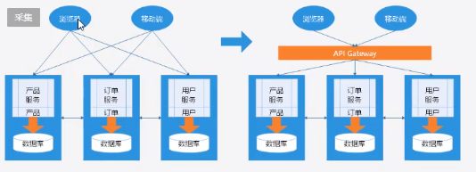
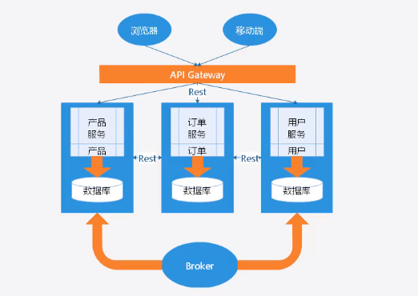

### **CAP** 定理

> 在一个分布式系统中, 以下三个特点只能同时满足两个

* 一致性: 不同数据库的数据一致性
* 可用性: 服务一直可用
* 分区容错性: 当某一节点出现错误时, 系统仍然能对外提供一致和可用的服务

---- *必须要保证**一致性*** ----


### gitlab + nexus + registry 项目案例

> gitlab 代码托管
>
> nexus 依赖托管
>
> registry 镜像托管

1. 在gitlab中创建项目, 在本地文件夹中拉取该项目, 将自己的项目复制到该项目中, 在项目根目录使用 tortoisegit 的 add功能全选将添加进来的文件都加入git管理, 然后使用 push功能提交

2. 在gitlab中查看确认提交的代码 

3. 在要部署项目的机器上使用 `git clone 项目地址` 将项目克隆到本地

4. 如果没有经过ssh秘钥验证 , 使用 `ssh-keygen -t rsa -C "邮箱地址"` 来生成秘钥, 会提示秘钥目录, 进入该目录, 复制秘钥内容, 将秘钥添加到gitlab中

5. 配置maven的nexus私服地址

6. 进入项目目录, 使用 `mvn package -Dmaven.test.skip=true`  命令对项目进行打包, 会发现下载依赖包经过nexus私服

   1. 没有maven的话

   2. 下载maven的压缩包

   3. 解压

   4. 配置环境变量 `vi /etc/profile` 使得mvn命令可以在任何位置运行

      ```profile
      #在两个if块中间添加以下
      
      #maven的安装位置
      export MAVEN_HOME=/usr/local/apache-maven-3.5.3
      export PATH=$MAVEN_HOME/bin:$PATH:$HOME/bin
      ```

   5. maven运行要java的支持 , 如果没有jdk , 安装jdk

   6. 下载jdk压缩包

   7. 解压

   8. 配置环境变量 `vi /etc/profile` 使得java命令可以在任何位置运行

      ```profile
      #在两个if块中间添加如下
      
      export JAVA_HOME=/usr/local/jdk1.8.0_152
      export JRE_HOME=/usr/local/jdk1.8.0_152/jre
      export CLASSPATH=$CLASSPATH:$JAVA_HOME/lib:$JAVA_HOME/jre/lib
      #在path中添加jdk和jre的路径(中间使用 : 分隔)
      export PATH=$JAVA_HOME/bin:$JAVA_HOME/jre/bin:$MAVEN_HOME/bin:$PATH:$HOME/bin
      ```

   9. `source /etc/profile` 重新加载环境变量

   10. `java -version` 和 `mvn -v` 来测试安装结果

7. 在idea中设置使用git

   1. file->settings->git->设置git安装路径下的git.exe文件
   2. 在项目上右键->git->add添加->commit提交, 提交的时候可以设置不检查 TODO 列表来提高提交速度

8. 使用 docker-compose 部署数据库 并修改项目中连接数据库设置, 注意修改过的项目要更新并重新使用mvn打包

9. 打包项目成为一个镜像并上传

   1. 将项目的 `target/myshop-1.0.0-SNAPSHOT/` 下的内容( 要部署在tomcat中的文件 ) `tar -zcvf myshop.tar.gz .` 压缩并将压缩包放到 构建镜像配置文件的同级目录下

   2. 创建 镜像构建文件 Dockerfile

      ```dockerfile
      FROM tomcat
      
      WORKDIR /usr/local/tomcat/webapps/ROOT
      
      RUN rm -rf *
      
      ADD myshop.tar.gz /usr/local/tomcat/webapps/ROOT
      
      RUN rm -rf myshop.tar.gz
      
      WORKDIR /usr/local/tomcat
      ```

   3. `docker build -t <nexus私服地址>:5000/myshop .` 构建并绑定镜像到私服

   4. `docker push <nexus私服地址>:5000/myshop` 推送镜像到私服

   5. 在registry的前端页面查看上传的镜像  

10. 在另外一台机器上使用docker-compose拉取私服上的镜像运行( 得先在这台机器上配置registry ) ( 一次构建,到处运行 )

    ```yml
    version: '3.1'
    services: 
      myshop:
        restart: always
        image: <registry地址>:5000/myshop
        container_name: myshop
        ports: 
          - 8080:8080
    ```

11. `docker-compose up -d` 运行myshop容器

12. 在浏览器访问myshop测试


### 微服务架构

<span style="color:cyan;">在使用微服务的架构时 </span>

* 需要进行分库 , 即不同模块服务使用包含其对应的数据表的数据库 

  例如 用户服务使用的数据库中包含用户表, 而 订单服务使用的数据库中就包含订单表

* 对于会产生大数据量的数据表, 需要采用分表 ( mysql单表存储量不得超过1kw )

  比如订单表会存储大量数据, 那么需要将订单表分表为 order_0,order_1,order_2...order_9, 然后将订单id设置为long类型( 其中应该包含时间戳和随机数以保证id唯一 ) , 使用订单id的最后一位来决定该条数据存储在哪个分表中, 在查询的时候, 根据id的最后一位去相应编号的分表中查询


#### 用户如何访问后台的微服务们?

* 如何实现在多个微服务分别部署在不同的服务器上的情况下, 用户身份验证问题( 登录 ) ?

* 如何使得当某个后台微服务需要更新时, 不会使用户要访问的前端不需要更新的问题 ( 如果前端是Android,那么每次当有微服务更新,都要下载安装新的apk ) ?

  

在前端和后台微服务之间插入一个网关服务, 由这个服务来提供身份验证功能和请求分发功能

 

* 缺点: 
  1. 单点故障问题, 网关服务炸了, 整个系统就炸了
  2. 性能瓶颈问题, 网关服务的性能限制着整个系统的性能


#### 这些微服务之间如何通信?

* 同步调用 ( 一致性高, 性能低, 会产生阻塞, 从而单点故障 )
  * REST   :  就是 http调用, 用于对外部的服务的调用 , 因为外部服务通常有防火墙, 而http请求是通过json字符串发送请求的, 而字符串能穿透 防火墙, 所以可以使用rest的方式来调用
  * RPC ( Thrift, Dubbo )    :  远程过程调用 
* 异步调用 ( 一致性低, 性能高, 这种模式称为 生产者和消费者模式 )



##### 将发送请求的服务器称为生产者( 生产订单 ), 将处理请求的服务器称为消费者 ( 处理订单 ), 

##### 它们之前的生产和消费是异步的,

##### 然后在它们中间添加一个 称为 Broker的服务器, 这个服务器称为 消息队列服务器, 

##### 生产者发送消息到Broker, 然后Broker保存这些消息, 并在消费者性能允许的情况下将消息发送给消费者进行处理, 

##### 即使消费者炸了, 那么Broker也会存储下新的消息, 等待消费者恢复后再发送给消费者进行处理, 从而可以保证数据的一致性

##### 当然了, 如果不要求严格的数据一致性 ( 比如日志 ), 也可以不使用这个 Broker服务器, 此时可以使用 Kafka( 最快的消息队列插件 ), 带有Broker服务器的消息队列插件有 activemq和rabbitmq


#### 网关服务器如何调用负载均衡配置下的微服务们?

* 负载均衡条件下, 一个服务会部署在多台服务器上, 网关服务器如何知道这些服务器地址?
* 负载均衡条件下, 如果一台微服务器炸了, 网关服务器又如何知道它炸了?
* 负载均衡条件下, 如果一个服务要添加机器来应对高并发, 网关服务器又如何知道新来的这个服务器的地址?

##### 此时在架构中添加一台 注册中心服务器( 婚介中心 ), 

##### 所有微服务器都在 注册中心 上注册信息, 并使用心跳监测( ping )来与注册中心保持连接以确认是否炸了,

##### 当网关服务器请求服务时, 先去注册中心问问要的服务在哪里, 注册中心会返回相关信息 , 然后网关服务器就开心地拿着这个信息去访问 微服务.

##### 通常使用的注册中心有这个几个:  zookeeper, Eureka, Consul


> ps: 如果想要解决网关服务器带来的性能瓶颈问题, 可以在网关服务器之上再加一个负载均衡服务器, 然后网关服务器进行扩展, 同时也要注意对注册中心的扩展


#### 单点故障问题怎么解决?

* 假设有一个节点称为主节点 , 在它之下有几个从节点, 主节点就是一个单点服务, 当这个单点出现故障时, 它下面的从节点也就不能正常运行, 此时在主节点同级上添加一个备用节点, 这个备用节点通过定时ping主节点并接收到来自主节点的ack响应包来确认主节点运行状态
* 当备用节点接收不到主节点返回的ack响应包时, 就认为主节点故障, 然后连接上从节点成为主节点进行工作
* 但是如果仅仅是因为网络波动而导致主节点没有返回响应包, 备用节点也会作为主节点而上线, 那么此时就有了两个主节点, 会发生数据混乱问题
* 此时引入 zookeeper 节点注册中心, 将主节点和备用节点们在zookeeper中注册, 生成节点列表, 然后zookeeper发动节点选举, 选举出一个节点作为主节点, 而对于其他没被选上的节点, 就采用分布式锁的技术来阻塞其运行, 同时zookeeper会定时检测所管节点们的运行状态
* 如果当前的主节点故障, 那么zookeeper会将这个节点从节点列表中删除, 然后发动选举再选出来一个主节点, 当故障节点恢复后, 重新注册到zookeeper中
* zookeeper 作为***节点注册和管理中心*** ,通过  ***分布式锁***  的技术来实现每个时刻仅会有一个主节点的效果
* 但是zookeeper故障了就没辙了


# SpringCloud

* 因为是分布式开发, 所以每个模块都是一个独立的工程
* 使用maven做依赖管理, 创建一个maven项目作为公共的父级依赖项目

##### 统一的依赖管理项目

1. 创建一个文件夹 hello , 用于存放所有的工程, 使用IDEA打开该文件夹, 在该文件夹下创建目录 , hello-maven, 为公共的依赖父项目, 在hello-maven目录下新建  `pom.xml`  文件

   ```xml
   <?xml version="1.0" encoding="UTF-8"?>
   <project xmlns="http://maven.apache.org/POM/4.0.0" xmlns:xsi="http://www.w3.org/2001/XMLSchema-instance"
            xsi:schemaLocation="http://maven.apache.org/POM/4.0.0 http://maven.apache.org/xsd/maven-4.0.0.xsd">
       <modelVersion>4.0.0</modelVersion>
   
       <parent>
           <groupId>org.springframework.boot</groupId>
           <artifactId>spring-boot-starter-parent</artifactId>
           <version>2.0.3.RELEASE</version>
       </parent>
   
       <groupId>com.funtl</groupId>
       <artifactId>hello-spring-cloud-dependencies</artifactId>
       <version>1.0.0-SNAPSHOT</version>
       <packaging>pom</packaging>
   
       <name>hello-spring-cloud-dependencies</name>
       <url>http://www.funtl.com</url>
       <inceptionYear>2018-Now</inceptionYear>
   
       <properties>
           <!-- Environment Settings -->
           <java.version>1.8</java.version>
           <project.build.sourceEncoding>UTF-8</project.build.sourceEncoding>
           <project.reporting.outputEncoding>UTF-8</project.reporting.outputEncoding>
   
           <!-- Spring Settings -->
           <spring-cloud.version>Finchley.RELEASE</spring-cloud.version>
       </properties>
   
       <dependencyManagement>
           <dependencies>
               <dependency>
                   <groupId>org.springframework.cloud</groupId>
                   <artifactId>spring-cloud-dependencies</artifactId>
                   <version>${spring-cloud.version}</version>
                   <type>pom</type>
                   <scope>import</scope>
               </dependency>
           </dependencies>
       </dependencyManagement>
   
       <build>
           <plugins>
               <!-- Compiler 插件, 设定 JDK 版本 -->
               <plugin>
                   <groupId>org.apache.maven.plugins</groupId>
                   <artifactId>maven-compiler-plugin</artifactId>
                   <configuration>
                       <showWarnings>true</showWarnings>
                   </configuration>
               </plugin>
   
               <!-- 打包 jar 文件时，配置 manifest 文件，加入 lib 包的 jar 依赖 -->
               <plugin>
                   <groupId>org.apache.maven.plugins</groupId>
                   <artifactId>maven-jar-plugin</artifactId>
                   <configuration>
                       <archive>
                           <addMavenDescriptor>false</addMavenDescriptor>
                       </archive>
                   </configuration>
                   <executions>
                       <execution>
                           <configuration>
                               <archive>
                                   <manifest>
                                       <!-- Add directory entries -->
                                       <addDefaultImplementationEntries>true</addDefaultImplementationEntries>
                                       <addDefaultSpecificationEntries>true</addDefaultSpecificationEntries>
                                       <addClasspath>true</addClasspath>
                                   </manifest>
                               </archive>
                           </configuration>
                       </execution>
                   </executions>
               </plugin>
   
               <!-- resource -->
               <plugin>
                   <groupId>org.apache.maven.plugins</groupId>
                   <artifactId>maven-resources-plugin</artifactId>
               </plugin>
   
               <!-- install -->
               <plugin>
                   <groupId>org.apache.maven.plugins</groupId>
                   <artifactId>maven-install-plugin</artifactId>
               </plugin>
   
               <!-- clean -->
               <plugin>
                   <groupId>org.apache.maven.plugins</groupId>
                   <artifactId>maven-clean-plugin</artifactId>
               </plugin>
   
               <!-- ant -->
               <plugin>
                   <groupId>org.apache.maven.plugins</groupId>
                   <artifactId>maven-antrun-plugin</artifactId>
               </plugin>
   
               <!-- dependency -->
               <plugin>
                   <groupId>org.apache.maven.plugins</groupId>
                   <artifactId>maven-dependency-plugin</artifactId>
               </plugin>
           </plugins>
   
           <pluginManagement>
               <plugins>
                   <!-- Java Document Generate -->
                   <plugin>
                       <groupId>org.apache.maven.plugins</groupId>
                       <artifactId>maven-javadoc-plugin</artifactId>
                       <executions>
                           <execution>
                               <phase>prepare-package</phase>
                               <goals>
                                   <goal>jar</goal>
                               </goals>
                           </execution>
                       </executions>
                   </plugin>
   
                   <!-- YUI Compressor (CSS/JS压缩) -->
                   <plugin>
                       <groupId>net.alchim31.maven</groupId>
                       <artifactId>yuicompressor-maven-plugin</artifactId>
                       <version>1.5.1</version>
                       <executions>
                           <execution>
                               <phase>prepare-package</phase>
                               <goals>
                                   <goal>compress</goal>
                               </goals>
                           </execution>
                       </executions>
                       <configuration>
                           <encoding>UTF-8</encoding>
                           <jswarn>false</jswarn>
                           <nosuffix>true</nosuffix>
                           <linebreakpos>30000</linebreakpos>
                           <force>true</force>
                           <includes>
                               <include>**/*.js</include>
                               <include>**/*.css</include>
                           </includes>
                           <excludes>
                               <exclude>**/*.min.js</exclude>
                               <exclude>**/*.min.css</exclude>
                           </excludes>
                       </configuration>
                   </plugin>
               </plugins>
           </pluginManagement>
   
           <!-- 资源文件配置 -->
           <resources>
               <resource>
                   <directory>src/main/java</directory>
                   <excludes>
                       <exclude>**/*.java</exclude>
                   </excludes>
               </resource>
               <resource>
                   <directory>src/main/resources</directory>
               </resource>
           </resources>
       </build>
   
       <repositories>
           <repository>
               <id>aliyun-repos</id>
               <name>Aliyun Repository</name>
               <url>http://maven.aliyun.com/nexus/content/groups/public</url>
               <releases>
                   <enabled>true</enabled>
               </releases>
               <snapshots>
                   <enabled>false</enabled>
               </snapshots>
           </repository>
   
           <repository>
               <id>sonatype-repos</id>
               <name>Sonatype Repository</name>
               <url>https://oss.sonatype.org/content/groups/public</url>
               <releases>
                   <enabled>true</enabled>
               </releases>
               <snapshots>
                   <enabled>false</enabled>
               </snapshots>
           </repository>
           <repository>
               <id>sonatype-repos-s</id>
               <name>Sonatype Repository</name>
               <url>https://oss.sonatype.org/content/repositories/snapshots</url>
               <releases>
                   <enabled>false</enabled>
               </releases>
               <snapshots>
                   <enabled>true</enabled>
               </snapshots>
           </repository>
   
           <repository>
               <id>spring-snapshots</id>
               <name>Spring Snapshots</name>
               <url>https://repo.spring.io/snapshot</url>
               <snapshots>
                   <enabled>true</enabled>
               </snapshots>
           </repository>
           <repository>
               <id>spring-milestones</id>
               <name>Spring Milestones</name>
               <url>https://repo.spring.io/milestone</url>
               <snapshots>
                   <enabled>false</enabled>
               </snapshots>
           </repository>
       </repositories>
   
       <pluginRepositories>
           <pluginRepository>
               <id>aliyun-repos</id>
               <name>Aliyun Repository</name>
               <url>http://maven.aliyun.com/nexus/content/groups/public</url>
               <releases>
                   <enabled>true</enabled>
               </releases>
               <snapshots>
                   <enabled>false</enabled>
               </snapshots>
           </pluginRepository>
       </pluginRepositories>
   </project>
   ```

2. 在maven project选项卡中将这个pom文件添加进去

##### spring cloud 的服务注册于发现中心 Eureka ( 作用等于zookeeper )

3. 在主文件夹下创建一个新的目录 hello-eureka, 用于存放服务注册与发现中心, 在该文件夹下创建pom.xml文件

   ```xml
   <?xml version="1.0" encoding="UTF-8"?>
   <project xmlns="http://maven.apache.org/POM/4.0.0" xmlns:xsi="http://www.w3.org/2001/XMLSchema-instance"
            xsi:schemaLocation="http://maven.apache.org/POM/4.0.0 http://maven.apache.org/xsd/maven-4.0.0.xsd">
       <modelVersion>4.0.0</modelVersion>
   
       <parent>
           <groupId>com.funtl</groupId>
           <artifactId>hello-spring-cloud-dependencies</artifactId>
           <version>1.0.0-SNAPSHOT</version>
           <relativePath>../hello-spring-cloud-dependencies/pom.xml</relativePath>
       </parent>
   
       <artifactId>hello-spring-cloud-eureka</artifactId>
       <packaging>jar</packaging>
   
       <name>hello-spring-cloud-eureka</name>
       <url>http://www.funtl.com</url>
       <inceptionYear>2018-Now</inceptionYear>
   
       <dependencies>
           <!-- Spring Boot Begin -->
           <dependency>
               <groupId>org.springframework.boot</groupId>
               <artifactId>spring-boot-starter-test</artifactId>
               <scope>test</scope>
           </dependency>
           <!-- Spring Boot End -->
   
           <!-- Spring Cloud Begin -->
           <dependency>
               <groupId>org.springframework.cloud</groupId>
               <artifactId>spring-cloud-starter-netflix-eureka-server</artifactId>
           </dependency>
           <!-- Spring Cloud End -->
       </dependencies>
   
       <build>
           <plugins>
               <plugin>
                   <groupId>org.springframework.boot</groupId>
                   <artifactId>spring-boot-maven-plugin</artifactId>
                   <configuration>
                       <mainClass>com.funtl.hello.spring.cloud.eureka.EurekaApplication</mainClass>
                   </configuration>
               </plugin>
           </plugins>
       </build>
   </project>
   ```

4. 在maven poject中添加该pom文件

5. 在hello-eureka目录下创建目录 `src/main/java` , 在 `main` 下创建 `resources` 目录, 右键 mark directory as 使它们成为对应的文件夹

6. 在 `resources` 下创建 `application.yml`

   ```yml
   spring:
     application:
     #配置服务的名字, 用作在eureka中的名字
       name: hello-eureka
       
   server:
     port: 8761
     
   eureka:
     instance:
       hostname: localhost
     client:
     #设置是否将自己注册到eureka, 如果是eureka集群的话, 需要设置为true,将eureka注册到eureka, 从而可以同步注册节点信息 , 如果只有一台eureka, 那么设置为false
       registerWithEureka: false
     #设置是否从eureka获取注册信息, 如果是集群, 设置为true,来实现eureka服务端节点之间的注册信息同步, 如果只有一台eureka, 设置为false  
       fetchRegistry: false
     #配置eureka服务器的地址
     #如果是eureka集群, defaultzone要设置为: eureka地址1,eureka地址2,...(中间用,分割来实现多个eureka服务节点相互注册)
       serviceUrl:
        defaultZone: http://${eureka.instance.hostname}:${server.port}/eureka/
   ```

   

7. 在 `java` 下创建包 `com.itheima.hello.eureka` , 在该包下创建springboot的入口类 `EurekaApplication`

   ```java
   //开启eureka的注解
   @EnableEurekaServer
   @SpringBootApplication
   public class EurekaApplication{
       public static void main(String[] args){
           SpringApplication.run(EurekaApplication.class, args);
       }
   }
   ```

8. 右键运行该项目的main方法来启动eureka的服务端 , 注意pom配置中的mainClass配置路径应和main方法路径一致( mainClass属性指定当把这个项目打包成jar , 使用java -jar命令运行时使用哪个方法做为入口 )

9. 在浏览器访问 本地下pom文件中配置的端口(8761), 查看spring eureka管理界面

   ##### spring cloud 创建服务提供者

10. 在主文件下创建目录 `hello-service-admin` ( 提供admin服务的服务提供者项目 )

11. 在该目录下创建 pom.xml 文件

    ```xml
    <?xml version="1.0" encoding="UTF-8"?>
    <project xmlns="http://maven.apache.org/POM/4.0.0" xmlns:xsi="http://www.w3.org/2001/XMLSchema-instance"
             xsi:schemaLocation="http://maven.apache.org/POM/4.0.0 http://maven.apache.org/xsd/maven-4.0.0.xsd">
        <modelVersion>4.0.0</modelVersion>
    
        <parent>
            <groupId>com.funtl</groupId>
            <artifactId>hello-spring-cloud-dependencies</artifactId>
            <version>1.0.0-SNAPSHOT</version>
            <relativePath>../hello-spring-cloud-dependencies/pom.xml</relativePath>
        </parent>
    
        <artifactId>hello-spring-cloud-service-admin</artifactId>
        <packaging>jar</packaging>
    
        <name>hello-spring-cloud-service-admin</name>
        <url>http://www.funtl.com</url>
        <inceptionYear>2018-Now</inceptionYear>
    
        <dependencies>
            <!-- Spring Boot Begin -->
            <dependency>
                <groupId>org.springframework.boot</groupId>
                <artifactId>spring-boot-starter-test</artifactId>
                <scope>test</scope>
            </dependency>
            <!-- Spring Boot End -->
    
            <!-- Spring Cloud Begin -->
            <dependency>
                <groupId>org.springframework.cloud</groupId>
                <artifactId>spring-cloud-starter-netflix-eureka-server</artifactId>
            </dependency>
            <!-- Spring Cloud End -->
        </dependencies>
    
        <build>
            <plugins>
                <plugin>
                    <groupId>org.springframework.boot</groupId>
                    <artifactId>spring-boot-maven-plugin</artifactId>
                    <configuration>
                        <mainClass>com.funtl.hello.spring.cloud.service.admin.ServiceAdminApplication</mainClass>
                    </configuration>
                </plugin>
            </plugins>
        </build>
    </project>
    ```

12. 在maven project中添加该pom以进行maven托管

13. 创建目录 `src/main/java` ,  创建目录 `src/main/resources` , 标记它们为source和resource 

14. 在 `java` 下创建包 `com.itheima.hello.sevice.admin` , 在该包下创建 `ServiceAdminApplication` 类

    ```java
    //开启eureka客户端的注解
    @EnableEurekaClient
    @SpringBootApplication
    public class ServiceAdminApplication{
        public static void main(String[] args){
            SpringApplication.run(ServiceAdminApplication.class, args);
        }
    }
    ```

15. 在 `resources` 下编辑配置文件 `application.yml`

    ```yml
    #配置应用名称
    spring:
      application:
        name: hello-service-admin
    
    #这个服务开在哪个端口上
    server: 
      port: 8762
      
    #配置服务端的地址
    eureka:
      client:
        serviceUrl:
         defaultZone: http://localhost:8761/eureka/
    ```

16. 启动main方法 , idea会提示是否打开 run dashboard 来统一管理所有的 eureka 应用 , yes, 然后就可以在 run dashboard 窗口右键启动 eureka 应用 , 应当先启动服务端  

17. 在eureka 的服务端的网页中查看新注册进来的提供者

18. 在 `java` 下的包中创建一个目录 `controller` , 在该目录中添加controller 类来通过restApi的方式提供服务

    ```java
    @RestController
    public class AdminControlle{
        
        //自动注入配置文件中的server.port属性
        @Value("${server.port}")
        private String port;
        
        @RequestMapping("hi")
        public String sayHello(String message){
            return String.format(
                "your message is %s, your port is %s", message, port);
        }
    }
    ```

19. 重启这个服务提供者, 在浏览器中测试接口

    ##### spring cloud 创建服务消费者 ( 使用ribbon方式, 即http的方式 )  

20. 在主文件夹中创建 `hello-web-admin-ribbon` 文件夹, 添加并编辑 pom.xml 文件

    ```xml
    <?xml version="1.0" encoding="UTF-8"?>
    <project xmlns="http://maven.apache.org/POM/4.0.0" xmlns:xsi="http://www.w3.org/2001/XMLSchema-instance"
             xsi:schemaLocation="http://maven.apache.org/POM/4.0.0 http://maven.apache.org/xsd/maven-4.0.0.xsd">
        <modelVersion>4.0.0</modelVersion>
    
        <parent>
            <groupId>com.funtl</groupId>
            <artifactId>hello-spring-cloud-dependencies</artifactId>
            <version>1.0.0-SNAPSHOT</version>
            <relativePath>../hello-spring-cloud-dependencies/pom.xml</relativePath>
        </parent>
    
        <artifactId>hello-spring-cloud-web-admin-ribbon</artifactId>
        <packaging>jar</packaging>
    
        <name>hello-spring-cloud-web-admin-ribbon</name>
        <url>http://www.funtl.com</url>
        <inceptionYear>2018-Now</inceptionYear>
    
        <dependencies>
            <!-- Spring Boot Begin -->
            <dependency>
                <groupId>org.springframework.boot</groupId>
                <artifactId>spring-boot-starter-web</artifactId>
            </dependency>
            <dependency>
                <groupId>org.springframework.boot</groupId>
                <artifactId>spring-boot-starter-tomcat</artifactId>
            </dependency>
            <dependency>
                <groupId>org.springframework.boot</groupId>
                <artifactId>spring-boot-starter-thymeleaf</artifactId>
            </dependency>
            <dependency>
                <groupId>org.springframework.boot</groupId>
                <artifactId>spring-boot-starter-actuator</artifactId>
            </dependency>
            <dependency>
                <groupId>org.springframework.boot</groupId>
                <artifactId>spring-boot-starter-test</artifactId>
                <scope>test</scope>
            </dependency>
            <!-- Spring Boot End -->
    
            <!-- Spring Cloud Begin -->
            <dependency>
                <groupId>org.springframework.cloud</groupId>
                <artifactId>spring-cloud-starter-netflix-eureka-server</artifactId>
            </dependency>
            <dependency>
                <groupId>org.springframework.cloud</groupId>
                <artifactId>spring-cloud-starter-netflix-ribbon</artifactId>
            </dependency>
            <!-- Spring Cloud End -->
    
            <!-- 解决 thymeleaf 模板引擎一定要执行严格的 html5 格式校验问题 -->
            <dependency>
                <groupId>net.sourceforge.nekohtml</groupId>
                <artifactId>nekohtml</artifactId>
            </dependency>
        </dependencies>
    
        <build>
            <plugins>
                <plugin>
                    <groupId>org.springframework.boot</groupId>
                    <artifactId>spring-boot-maven-plugin</artifactId>
                    <configuration>
                        <mainClass>com.funtl.hello.spring.cloud.web.admin.ribbon.WebAdminRibbonApplication</mainClass>
                    </configuration>
                </plugin>
            </plugins>
        </build>
    </project>
    ```

21. 如提供者中手动构建项目结构

22. 编辑主类 `WebAdminRibbonApplication `

    ```java
    @SpringBootApplication
    //开启消费者注解
    @EnableDiscoveryClient
    public class WebAdminRibbonApplication {
        public static void main(String[] args) {
            SpringApplication.run(WebAdminRibbonApplication.class, args);
        }
    }
    ```

23. 编辑配置文件 `application.yml` 

    ```yml
    spring:
      application:
        name: hello-spring-cloud-web-admin-ribbon
      thymeleaf:
        cache: false
        mode: LEGACYHTML5
        encoding: UTF-8
        servlet:
          content-type: text/html
    
    server:
      port: 8764
    
    eureka:
      client:
        serviceUrl:
          defaultZone: http://localhost:8761/eureka/
    ```

24. 在java下包中创建一个目录 `config` , 用于存放配置类, 在其中创建类 `RestTemplateConfiguration`

    ```java
    //springboot的配置类
    @Configuration
    public class RestTemplateConfiguration {
    
        //配置bean标签
        @Bean
        //设置这个bean使用负载均衡策略
        @LoadBalanced
        public RestTemplate restTemplate() {
            return new RestTemplate();
        }
    }
    ```

25. 此时只启动了一台服务提供者, 再多开几个服务提供者来实现负载均衡

26. idea任务栏 -> run -> edit configurations -> 选择服务提供者那个服务 -> 右上角取消 single instance only ->ok

27. 修改服务提供者配置文件中的端口并启动服务提供者 , 就可以按照此方法启动多个服务提供者

28. 在 `java` 中的包下创建一个目录 `service` , 其中的service类远程调用提供者的rest接口

29. 在 `service` 中创建  `AdminService` , 这个service远程调用提供者的接口

    ```java
    @Service
    public class AdminService{
        
        //自动注入用于rest请求的resttemplate对象
        @Autowired
        private RestTemplate restTemplate;
        
        public String sayHello(String message){
            //使用rest的方式进行请求
            //直接写要请求的应用名, eureka会自动根据负载均衡找到相应的ip和port
            return restTemplate.getForObject(
                "http://hello-service-admin/hi?message="+message);
        }
        
    }
    ```

30. 在 `java` 文件夹下创建 `controller` 文件夹, 用于调用service层

31. 在 `controller` 中创建 `AdminController`

    ```java
    @RestController
    public class AdminController {
    
        @Autowired
        private AdminService adminService;
    
        @RequestMapping(value = "hi", method = RequestMethod.GET)
        public String sayHi(@RequestParam String message) {
            return adminService.sayHi(message);
        }
    }
    ```

32. 启动消费者的main方法来启动消费者

33. 在浏览器访问消费者的接口, 测试负载均衡调用效果

    ##### 创建消费者 - Feign 方式 - 包含了ribbon方式, 默认实现负载均衡, 实际开发中使用这个

35. 在主项目文件夹中创建 hello-web-admin-feign文件夹

35. 创建pom.xml并将其添加到maven project管理中

    ```xml
    <?xml version="1.0" encoding="UTF-8"?>
    <project xmlns="http://maven.apache.org/POM/4.0.0" xmlns:xsi="http://www.w3.org/2001/XMLSchema-instance"
             xsi:schemaLocation="http://maven.apache.org/POM/4.0.0 http://maven.apache.org/xsd/maven-4.0.0.xsd">
        <modelVersion>4.0.0</modelVersion>
    
        <parent>
            <groupId>com.funtl</groupId>
            <artifactId>hello-spring-cloud-dependencies</artifactId>
            <version>1.0.0-SNAPSHOT</version>
            <relativePath>../hello-spring-cloud-dependencies/pom.xml</relativePath>
        </parent>
    
        <artifactId>hello-spring-cloud-web-admin-feign</artifactId>
        <packaging>jar</packaging>
    
        <name>hello-spring-cloud-web-admin-feign</name>
        <url>http://www.funtl.com</url>
        <inceptionYear>2018-Now</inceptionYear>
    
        <dependencies>
            <!-- Spring Boot Begin -->
            <dependency>
                <groupId>org.springframework.boot</groupId>
                <artifactId>spring-boot-starter-web</artifactId>
            </dependency>
            <dependency>
                <groupId>org.springframework.boot</groupId>
                <artifactId>spring-boot-starter-tomcat</artifactId>
            </dependency>
            <dependency>
                <groupId>org.springframework.boot</groupId>
                <artifactId>spring-boot-starter-thymeleaf</artifactId>
            </dependency>
            <dependency>
                <groupId>org.springframework.boot</groupId>
                <artifactId>spring-boot-starter-actuator</artifactId>
            </dependency>
            <dependency>
                <groupId>org.springframework.boot</groupId>
                <artifactId>spring-boot-starter-test</artifactId>
                <scope>test</scope>
            </dependency>
            <!-- Spring Boot End -->
    
            <!-- Spring Cloud Begin -->
            <dependency>
                <groupId>org.springframework.cloud</groupId>
                <artifactId>spring-cloud-starter-netflix-eureka-server</artifactId>
            </dependency>
            <dependency>
                <groupId>org.springframework.cloud</groupId>
                <artifactId>spring-cloud-starter-openfeign</artifactId>
            </dependency>
            <!-- Spring Cloud End -->
    
            <!-- 解决 thymeleaf 模板引擎一定要执行严格的 html5 格式校验问题 -->
            <dependency>
                <groupId>net.sourceforge.nekohtml</groupId>
                <artifactId>nekohtml</artifactId>
            </dependency>
        </dependencies>
    
        <build>
            <plugins>
                <plugin>
                    <groupId>org.springframework.boot</groupId>
                    <artifactId>spring-boot-maven-plugin</artifactId>
                    <configuration>
                        <mainClass>com.funtl.hello.spring.cloud.web.admin.feign.WebAdminFeignApplication</mainClass>
                    </configuration>
                </plugin>
            </plugins>
        </build>
    </project>
    ```

36. 如上构建项目目录, 在main方法的类上添加 `@EnableFeignClients` 来开启feign模式

    ```java
    @SpringBootApplication
    @EnableDiscoveryClient
    @EnableFeignClients
    public class WebAdminFeignApplication {
        public static void main(String[] args) {
            SpringApplication.run(WebAdminFeignApplication.class, args);
        }
    }
    ```

37. 配置 application.yml 文件

    ```yml
    spring:
      application:
        name: hello-spring-cloud-web-admin-feign
      thymeleaf:
        cache: false
        mode: LEGACYHTML5
        encoding: UTF-8
        servlet:
          content-type: text/html
    
    server:
      port: 8765
    
    eureka:
      client:
        serviceUrl:
          defaultZone: http://localhost:8761/eureka/
    ```

38. 创建service层, 新建service接口, 用于远程调用提供者

    ```java
    //使用该注解指定远程调用哪个提供者
    @FeignClient(value = "hello-spring-cloud-service-admin")
    public interface AdminService {
    
        //设置访问路径, 指定这个方法远程调用的是提供者的哪个restAPI
        @RequestMapping(value = "hi", method = RequestMethod.GET)
        public String sayHi(@RequestParam(value = "message") String message);
    }
    ```

39. 创建controller, 用于调用上一步中的service层

    ```java
    @RestController
    public class AdminController {
    
        //直接注入, 正常使用
        @Autowired
        private AdminService adminService;
    
        @RequestMapping(value = "hi", method = RequestMethod.GET)
        public String sayHi(@RequestParam String message) { //注意这里必须使用requestparam来匹配参数
            return adminService.sayHi(message);
        }
    }
    ```

40. 启动main方法来开启feign模式的消费者

41. 使用浏览器测试接口效果和负载均衡效果

    ##### 使用熔断器防止服务因高并发而雪崩

    ##### 1. ribbon方式使用熔断器

42. 在ribbon模式的消费者项目的pom中添加熔断器依赖

    ```xml
    <dependency>
        <groupId>org.springframework.cloud</groupId>
        <artifactId>spring-cloud-starter-netflix-hystrix</artifactId>
    </dependency>
    ```

43. 在application类中添加注解支持熔断器

    ```java
    @SpringBootApplication
    @EnableDiscoveryClient
    //该注解开启熔断器支持
    @EnableHystrix
    public class WebAdminRibbonApplication {
        public static void main(String[] args) {
            SpringApplication.run(WebAdminRibbonApplication.class, args);
        }
    }
    ```

44. 在要进行远程调用接口的service类上添加熔断操作

    ```java
    @Service
    public class AdminService {
    
        @Autowired
        private RestTemplate restTemplate;
    
        //这个方法中会对远程接口进行调用
        //添加HystrixCommand指定访问提供者失败时执行哪个方法
        @HystrixCommand(fallbackMethod = "hiError")
        public String sayHi(String message) {
            return restTemplate.getForObject("http://HELLO-SPRING-CLOUD-SERVICE-ADMIN/hi?message=" + message, String.class);
        }
    
        //访问提供者失败时执行的方法, 这个方法应和接口方法有相同的参数
        public String hiError(String message) {
            return "Hi，your message is :\"" + message + "\" but request error.";
        }
    }
    ```

45. 关闭提供者, 使用浏览器访问消费者接口, 测试执行熔断方法结果

    ##### 2. feign中使用熔断, 自带熔断

46. 在feign消费者的主配置文件中开启熔断

    ```yml
    feign:
      hystrix:
        enabled: true
    ```

47. 在调用远程接口的service接口中指定熔断器类

    ```java
    //在feignclient注解中添加 fallback 属性来指定使用哪个类作为该接口的熔断器
    @FeignClient(value = "hello-spring-cloud-service-admin", fallback = AdminServiceHystrix.class)
    public interface AdminService {
    
        @RequestMapping(value = "hi", method = RequestMethod.GET)
        public String sayHi(@RequestParam(value = "message") String message);
    }
    ```

48. 创建熔断器类实现service接口, 实现哪个方法即作为哪个方法的熔断器操作方法

    ```java
    //注意要将该类加入spring容器管理
    @Component
    public class AdminServiceHystrix implements AdminService {
    
        //实现了service接口中sayHi方法, 则作为该方法的熔断器方法
        @Override
        public String sayHi(String message) {
            return "Hi，your message is :\"" + message + "\" but request error.";
        }
    }
    ```

49. 关闭提供者, 在浏览器访问feign消费者测试熔断方法

    ##### 使用熔断器仪表盘来监控熔断情况 , ribbon和feign配置方式一样

50. 在pom中添加依赖

    ```xml
    <dependency>
        <groupId>org.springframework.cloud</groupId>
        <artifactId>spring-cloud-starter-netflix-hystrix-dashboard</artifactId>
    </dependency>
    ```

51. 在application上添加开启仪表盘注解

    ```java
    @SpringBootApplication
    @EnableDiscoveryClient
    @EnableHystrix
    //开启仪表盘
    @EnableHystrixDashboard
    public class WebAdminRibbonApplication {
        public static void main(String[] args) {
            SpringApplication.run(WebAdminRibbonApplication.class, args);
        }
    }
    ```

52. 如果是springboot2.x , 还需要再添加一个仪表盘的配置类, 在service文件夹同级下新建config文件夹, 新建配置类

    ```java
    //标明为配置类
    @Configuration
    public class HystrixDashboardConfiguration {
    
        //返回一个servlet对象到容器中, 也就是配置了一个servlet, 使用对应的路径访问 
        @Bean
        public ServletRegistrationBean getServlet() {
            //新建servlet
            HystrixMetricsStreamServlet streamServlet = new HystrixMetricsStreamServlet();
            //新建servlet注册类对象
            ServletRegistrationBean registrationBean = new ServletRegistrationBean(streamServlet);
            //设置servlet属性 , loadonstartup
            registrationBean.setLoadOnStartup(1);
            //设置servlet属性 , url
            registrationBean.addUrlMappings("/hystrix.stream");
            //设置servlet属性 , servlet名字
            registrationBean.setName("HystrixMetricsStreamServlet");
            return registrationBean;
        }
    }
    ```

53. 重启该消费者服务, 在浏览器访问 `http://localhost:8764/hystrix`  测试仪表盘页面

54. 在监听的地址中填 `http://localhost:8764/hystrix.stream` , 设置title ( 该监听的名字, 随便写 ), 开始监听

55. 进入监听页面

56. 在监听的消费者中触发熔断, 观察监听页面的数据变化

    

    ##### 使用Zuul作为架构中的同一访问的网关, 用户请求这个网关, 由这个网关来项各个微服务分发请求

58. 在主文件夹下新建文件夹 `hello-zuul` , 这个文件夹就是api网关项目

58. 新建并编辑pom.xml文件, 并将pom添加到maven project中进行管理

    ```xml
    <?xml version="1.0" encoding="UTF-8"?>
    <project xmlns="http://maven.apache.org/POM/4.0.0" xmlns:xsi="http://www.w3.org/2001/XMLSchema-instance"
             xsi:schemaLocation="http://maven.apache.org/POM/4.0.0 http://maven.apache.org/xsd/maven-4.0.0.xsd">
        <modelVersion>4.0.0</modelVersion>
    
        <parent>
            <groupId>com.funtl</groupId>
            <artifactId>hello-spring-cloud-dependencies</artifactId>
            <version>1.0.0-SNAPSHOT</version>
            <relativePath>../hello-spring-cloud-dependencies/pom.xml</relativePath>
        </parent>
    
        <artifactId>hello-spring-cloud-zuul</artifactId>
        <packaging>jar</packaging>
    
        <name>hello-spring-cloud-zuul</name>
        <url>http://www.funtl.com</url>
        <inceptionYear>2018-Now</inceptionYear>
    
        <dependencies>
            <!-- Spring Boot Begin -->
            <dependency>
                <groupId>org.springframework.boot</groupId>
                <artifactId>spring-boot-starter-web</artifactId>
            </dependency>
            <dependency>
                <groupId>org.springframework.boot</groupId>
                <artifactId>spring-boot-starter-tomcat</artifactId>
            </dependency>
            <dependency>
                <groupId>org.springframework.boot</groupId>
                <artifactId>spring-boot-starter-actuator</artifactId>
            </dependency>
            <dependency>
                <groupId>org.springframework.boot</groupId>
                <artifactId>spring-boot-starter-test</artifactId>
                <scope>test</scope>
            </dependency>
            <!-- Spring Boot End -->
    
            <!-- Spring Cloud Begin -->
            <dependency>
                <groupId>org.springframework.cloud</groupId>
                <artifactId>spring-cloud-starter-netflix-eureka-server</artifactId>
            </dependency>
            <dependency>
                <groupId>org.springframework.cloud</groupId>
                <artifactId>spring-cloud-starter-netflix-zuul</artifactId>
            </dependency>
            <!-- Spring Cloud End -->
        </dependencies>
    
        <build>
            <plugins>
                <plugin>
                    <groupId>org.springframework.boot</groupId>
                    <artifactId>spring-boot-maven-plugin</artifactId>
                    <configuration>
                        <mainClass>com.funtl.hello.spring.cloud.zuul.ZuulApplication</mainClass>
                    </configuration>
                </plugin>
            </plugins>
        </build>
    </project>
    ```

59. 按照如上创建目录结构

60. 编辑入口类

    ```java
    @SpringBootApplication
    @EnableEurekaClient
    //开启zuul功能
    @EnableZuulProxy
    public class ZuulApplication {
        public static void main(String[] args) {
            SpringApplication.run(ZuulApplication.class, args);
        }
    }
    ```

61. 编辑配置文件 `application.properties`

    ```properties
    spring:
      application:
        name: hello-spring-cloud-zuul
    
    server:
      port: 8769
    
    eureka:
      client:
        serviceUrl:
          defaultZone: http://localhost:8761/eureka/
    
    zuul:
      routes:
        api-a:
        #配置/api/a/**的请求都给hello-spring-cloud-web-admin-ribbon服务来处理, 这里的服务的名字是该服务中配置的应用名称
          path: /api/a/**
          serviceId: hello-spring-cloud-web-admin-ribbon
        api-b:
        #配置/api/b/**的请求都给hello-spring-cloud-web-admin-feign服务来处理
          path: /api/b/**
          serviceId: hello-spring-cloud-web-admin-feign
    ```

62. 开启eureka服务, 开启提供者服务, 开启两个消费者服务, 开启本zuul服务

63. 在浏览器中使用开启zuul的端口 加上zuul中配置的 /api/a/**, 来访问目标的微服务, 从而实现从一个地址访问不同的微服务

64. 配置网关分发请求调用失败后的操作

65. 在java的包下创建文件夹 `provider` 用于存放对于不同的微服务调用失败时的处理方法, 在zuul中配置的每一个微服务地址都应当有一个provider类与之对应 ( 一个微服务一个失败回调类 )

66. 在provider文件夹中创建一个类 WebAdminFeignFallbackProvider 来定义对微服务 web-admin-feign调用失败时的处理方法

    ```java
    /**
     * 路由 hello-spring-cloud-web-admin-feign 失败时的回调
     * <p>Title: WebAdminFeignFallbackProvider</p>
     */
    //实现该接口以成为一个provider
    @Component
    public class WebAdminFeignFallbackProvider implements FallbackProvider {
    
        @Override
        public String getRoute() {
            // 返回ServiceId，也就是在配置文件中配置的微服务的名字,如果需要所有调用都支持回退，则 return "*" 或 return null
            return "hello-spring-cloud-web-admin-feign";
        }
    
        /**
         * 如果请求服务失败，则返回指定的信息给调用者
         * @param route
         * @param cause
         * @return
         */
        @Override
        public ClientHttpResponse fallbackResponse(String route, Throwable cause) {
            return new ClientHttpResponse() {
                /**
                 * 网关向 api 服务请求失败了，但是消费者客户端向网关发起的请求是成功的，
                 * 不应该把 api 的 404,500 等问题抛给客户端
                 * 网关和 api 服务集群对于客户端来说是黑盒
                 * 给用户返回200码和提示信息来提高用户体验
                 * @return
                 * @throws IOException
                 */
                @Override
                public HttpStatus getStatusCode() throws IOException {
                    return HttpStatus.OK;
                }
    
                @Override
                public int getRawStatusCode() throws IOException {
                    return HttpStatus.OK.value();
                }
    
                @Override
                public String getStatusText() throws IOException {
                    return HttpStatus.OK.getReasonPhrase();
                }
    
                @Override
                public void close() {
    
                }
    
                @Override
                public InputStream getBody() throws IOException {
                    ObjectMapper objectMapper = new ObjectMapper();
                    Map<String, Object> map = new HashMap<>();
                    map.put("status", 200);
                    map.put("message", "无法连接，请检查您的网络");
                    return new ByteArrayInputStream(objectMapper.writeValueAsString(map).getBytes("UTF-8"));
                }
    
                @Override
                public HttpHeaders getHeaders() {
                    HttpHeaders headers = new HttpHeaders();
                    // 和 getBody 中的内容编码一致
                    headers.setContentType(MediaType.APPLICATION_JSON_UTF8);
                    return headers;
                }
            };
        }
    }
    ```

67. 重新启动zuul网关服务, 访问该网关服务, 如果访问出错, 则会返回以上定义的内容

    ##### 使用zuul提供的过滤器功能 ( 登录验证 )

68. 在包下新建过滤器文件夹, 在其中新建过滤器类 , 使其继承 `ZuulFilter` 类并在类上增加 `@Component` 注解就可以使用服务过滤功能

    ```java
    @Component
    public class LoginFilter extends ZuulFilter {
    
        private static final Logger logger = LoggerFactory.getLogger(LoginFilter.class);
    
        /**
         * 配置过滤时机，有四种不同生命周期的过滤器类型
         * 1. pre：路由之前
         * 2. routing：路由之时
         * 3. post：路由之后
         * 4. error：发送错误调用
         * @return
         */
        @Override
        public String filterType() {
            return "pre";
        }
    
        /**
         * 配置过滤的顺序
         * 当有多个过滤器时, 这个返回值越小越优先执行
         * @return
         */
        @Override
        public int filterOrder() {
            return 0;
        }
    
        /**
         * 配置是否需要过滤：true/需要，false/不需要
         * 本来就是为了实现过滤, 这里肯定要返回true啊
         * @return
         */
        @Override
        public boolean shouldFilter() {
            return true;
        }
    
        /**
         * 过滤器的具体业务代码
         * @return
         * @throws ZuulException
         */
        @Override
        public Object run() throws ZuulException {
            //获取请求上下文
            RequestContext context = RequestContext.getCurrentContext();
            //获取request对象
            HttpServletRequest request = context.getRequest();
            //验证请求对象中的参数, 验证登录
            String token = request.getParameter("token");
            if (token == null) {
                logger.warn("Token is empty");
                //取消response的返回
                context.setSendZuulResponse(false);
                //设置response的返回码
                context.setResponseStatusCode(401);
                try {
                    //手动返回response
                    context.getResponse().getWriter().write("Token is empty");
                } catch (IOException e) {
                }
            }
            return null;
        }
    }
    ```

69. 重启zuul网关服务, 测试不带登录参数的被拦截效果


### 使用分布式配置中心 spring cloud config ( 实际上就是将所有微服务中的application.yml配置文件放到一个服务器上来管理 )

* spring cloud config 分为服务端( 存放所有的配置文件 ) 和 客户端 ( 读取配置文件 )

#### 配置服务端

1. 在主项目中新建文件夹 hello-config

2. 新建编辑并管理 pom 文件

   ```xml
   <?xml version="1.0" encoding="UTF-8"?>
   <project xmlns="http://maven.apache.org/POM/4.0.0" xmlns:xsi="http://www.w3.org/2001/XMLSchema-instance"
            xsi:schemaLocation="http://maven.apache.org/POM/4.0.0 http://maven.apache.org/xsd/maven-4.0.0.xsd">
       <modelVersion>4.0.0</modelVersion>
   
       <parent>
           <groupId>com.funtl</groupId>
           <artifactId>hello-spring-cloud-dependencies</artifactId>
           <version>1.0.0-SNAPSHOT</version>
           <relativePath>../hello-spring-cloud-dependencies/pom.xml</relativePath>
       </parent>
   
       <artifactId>hello-spring-cloud-config</artifactId>
       <packaging>jar</packaging>
   
       <name>hello-spring-cloud-config</name>
       <url>http://www.funtl.com</url>
       <inceptionYear>2018-Now</inceptionYear>
   
       <dependencies>
           <!-- Spring Boot Begin -->
           <dependency>
               <groupId>org.springframework.boot</groupId>
               <artifactId>spring-boot-starter-web</artifactId>
           </dependency>
           <dependency>
               <groupId>org.springframework.boot</groupId>
               <artifactId>spring-boot-starter-tomcat</artifactId>
           </dependency>
           <dependency>
               <groupId>org.springframework.boot</groupId>
               <artifactId>spring-boot-starter-actuator</artifactId>
           </dependency>
           <dependency>
               <groupId>org.springframework.boot</groupId>
               <artifactId>spring-boot-starter-test</artifactId>
               <scope>test</scope>
           </dependency>
           <!-- Spring Boot End -->
   
           <!-- Spring Cloud Begin -->
           <dependency>
               <groupId>org.springframework.cloud</groupId>
               <artifactId>spring-cloud-config-server</artifactId>
           </dependency>
           <dependency>
               <groupId>org.springframework.cloud</groupId>
               <artifactId>spring-cloud-starter-netflix-eureka-server</artifactId>
           </dependency>
           <!-- Spring Cloud End -->
       </dependencies>
   
       <build>
           <plugins>
               <plugin>
                   <groupId>org.springframework.boot</groupId>
                   <artifactId>spring-boot-maven-plugin</artifactId>
                   <configuration>
                       <mainClass>com.funtl.hello.spring.cloud.config.ConfigApplication</mainClass>
                   </configuration>
               </plugin>
           </plugins>
       </build>
   </project>
   ```

3. 开启config服务端

   ```java
   @SpringBootApplication
   //开启config的服务端功能
   @EnableConfigServer
   //以提供者的身份注册到eureka中
   @EnableEurekaClient
   public class ConfigApplication {
       public static void main(String[] args) {
           SpringApplication.run(ConfigApplication.class, args);
       }
   }
   ```

4. 配置application.yml

   ```yml
   spring:
     application:
       name: hello-spring-cloud-config
     cloud:
     #设置spring-cloud-config
       config:
       #设置使用这个git项目中的哪个分支, 这里使用master分支(主线)
         label: master
         #设置将配置文件存到哪里
         server:
         #设置存到git上
           git:
           #设置git仓库地址, 也就是在git中新建的项目的地址
           #如果是gitlab上的项目, 这个地址后应当存在一个.git后缀
             uri: https://github.com/topsale/spring-cloud-config
             #设置项目下的文件夹, 将配置文件存放到这个文件夹中
             search-paths: respo
             #设置登录名和密码
             username:
             password:
   
   #服务提供者的端口为8888不能改, 如果想要修改启动端口, 在resources下新建文件bootstrap.properties, 在其中添加配置 server.port=xxxx
   #bootstrap.properties也同application.yml一样为springboot默认加载的配置文件
   server:
     port: 8888
   
   #所有服务都放到eureka中, 由eureka实现高可用
   eureka:
     client:
       serviceUrl:
         defaultZone: http://localhost:8761/eureka/
   ```

5. 把这个存放配置文件的项目从git上拉取到本地, 然后向其中上传一个随意其他服务的配置文件并重命名( 区分配置文件是哪个项目的和哪个版本的 )

   ##### 配置文件命名规则

   * 一般配置文件有三个版本 , 开发环境 ( dev ) , 测试环境 ( test ) , 生产环境 ( prod )
   * 配置文件命名应当符合 <项目名>-<版本名(dev,test,prod)>

6. 启动config的服务端, 在浏览器访问 `http://localhost:8888/<配置文件名中的项目名>/<配置文件名中的版本名(如dev)>/<分支名(如master)>`  测试服务端的使用情况

#### 配置客户端 ( 使用云配置 )

1. 在要使用config服务端上配置文件的服务中添加config客户端的依赖包

   ```xml
   <dependency>
       <groupId>org.springframework.cloud</groupId>
       <artifactId>spring-cloud-starter-config</artifactId>
   </dependency>
   ```

2. 入库类不需要改

3. 配置application.yml

   ```yml
   #最佳实践: 如果如下使用了云配置, 则在本配置文件中只配置如下, 然后在云配置文件中设置其他配置项
   
   spring:
     application:
       name: hello-spring-cloud-config-client
     cloud:
     #设置使用spring-cloud-config
       config:
       #设置config的服务端地址
       #配置服务器的默认端口为 8888，如果修改了默认端口，则客户端项目就不能在 application.yml 或 application.properties 中配置 spring.cloud.config.uri，必须在 bootstrap.yml 或是 bootstrap.properties 中配置，原因是 bootstrap 开头的配置文件会被优先加载和配置，切记。
         uri: http://localhost:8888
         #设置使用的配置文件名中的项目名( 配置文件名除去配置版本的部分 )
         name: config-client
         #设置使用哪个分支
         label: master
         #设置使用哪个配置版本
         profile: dev
   ```

4. 启动使用了云配置的服务, 测试云配置文件的使用情况

   ##### 使用启动jar的命令加参数来指定使用哪一款配置启动

5. 在resources下整多个不同配置版本的配置文件, 根据配置文件名来区分版本 , 如web-admin-feign-dev , 其中使用profile属性指定对应的不同的云配置

6. 将项目使用 mvn package 打包成 jar

7. 在启动jar的时候指定参数来使用对应的配置文件 `java -jar web-admin-feign-1.0.0-SNAPSHOT.jar --spring.profiles.active=prod` , 这里指定的是prod版本的


> 刷新idea中的run dashboard, 会自动解析所有项目的pom文件, 然后根据其中配置的mainclass来寻找程序入口, 如果是springboot项目, 则会将该项目刷新到run dashboard中的spring boot项目列表中


### 使用zipkin来进行服务的调用链路追踪 ( 跟踪服务之间的调用过程 )

#### 服务端创建

1. 在主项目下新建文件夹 , hello-zipkin 为zipkin的服务端项目

2. 新建编辑并管理pom文件

   ```xml
   <?xml version="1.0" encoding="UTF-8"?>
   <project xmlns="http://maven.apache.org/POM/4.0.0" xmlns:xsi="http://www.w3.org/2001/XMLSchema-instance"
            xsi:schemaLocation="http://maven.apache.org/POM/4.0.0 http://maven.apache.org/xsd/maven-4.0.0.xsd">
       <modelVersion>4.0.0</modelVersion>
   
       <parent>
           <groupId>com.funtl</groupId>
           <artifactId>hello-spring-cloud-dependencies</artifactId>
           <version>1.0.0-SNAPSHOT</version>
           <relativePath>../hello-spring-cloud-dependencies/pom.xml</relativePath>
       </parent>
   
       <artifactId>hello-spring-cloud-zipkin</artifactId>
       <packaging>jar</packaging>
   
       <name>hello-spring-cloud-zipkin</name>
       <url>http://www.funtl.com</url>
       <inceptionYear>2018-Now</inceptionYear>
   
       <dependencies>
           <!-- Spring Boot Begin -->
           <dependency>
               <groupId>org.springframework.boot</groupId>
               <artifactId>spring-boot-starter-web</artifactId>
           </dependency>
           <dependency>
               <groupId>org.springframework.boot</groupId>
               <artifactId>spring-boot-starter-tomcat</artifactId>
           </dependency>
           <dependency>
               <groupId>org.springframework.boot</groupId>
               <artifactId>spring-boot-starter-actuator</artifactId>
           </dependency>
           <dependency>
               <groupId>org.springframework.boot</groupId>
               <artifactId>spring-boot-starter-test</artifactId>
               <scope>test</scope>
           </dependency>
           <!-- Spring Boot End -->
   
           <!-- Spring Cloud Begin -->
           <dependency>
               <groupId>io.zipkin.java</groupId>
               <artifactId>zipkin</artifactId>
               <version>2.10.1</version>
           </dependency>
           <dependency>
               <groupId>io.zipkin.java</groupId>
               <artifactId>zipkin-server</artifactId>
               <version>2.10.1</version>
           </dependency>
           <dependency>
               <groupId>io.zipkin.java</groupId>
               <artifactId>zipkin-autoconfigure-ui</artifactId>
               <version>2.10.1</version>
           </dependency>
           <dependency>
               <groupId>org.springframework.cloud</groupId>
               <artifactId>spring-cloud-starter-netflix-eureka-server</artifactId>
               <version>2.10.1</version>
           </dependency>
           <!-- Spring Cloud End -->
       </dependencies>
   
       <build>
           <plugins>
               <plugin>
                   <groupId>org.springframework.boot</groupId>
                   <artifactId>spring-boot-maven-plugin</artifactId>
                   <configuration>
                       <mainClass>com.funtl.hello.spring.cloud.zipkin.ZipKinApplication</mainClass>
                   </configuration>
               </plugin>
           </plugins>
       </build>
   </project>
   ```

3. 在入口类中添加开启zipkin服务端功能

   ```java
   @SpringBootApplication
   @EnableEurekaClient
   //开启zipkin服务端功能
   @EnableZipkinServer
   public class ZipKinApplication {
       public static void main(String[] args) {
           SpringApplication.run(ZipKinApplication.class, args);
       }
   }
   ```

4. 编辑application.yml配置文件

   ```yml
   spring:
     application:
       name: hello-spring-cloud-zipkin
   
   server:
     port: 9411
   
   eureka:
     client:
       serviceUrl:
         defaultZone: http://localhost:8761/eureka/
         
   management:
     metrics:
       web:
         server:
           auto-time-requests: false
   ```

#### 客户端使用 ( 被追踪的服务, 应当除了公共依赖服务以外都需要被追踪 )

1. 添加依赖

   ```xml
   <dependency>
       <groupId>org.springframework.cloud</groupId>
       <artifactId>spring-cloud-starter-zipkin</artifactId>
   </dependency>
   ```

2. 配置zipkin服务端地址在application.yml中

   ```yml
   spring:
     zipkin:
       base-url: http://localhost:9411
   ```

3. 按照依赖顺序启动所有服务, 在浏览器访问服务端地址来追踪请求 , 这里地址是 `http://localhost:9411/`


### 使用spring boot admin 来监控各个微服务的状态

#### 服务端创建

1. 在主文件夹下创建 hello-admin 文件夹, 作为服务状态监控中心的服务端

2. 新建编辑并管理pom文件

   ```xml
   <?xml version="1.0" encoding="UTF-8"?>
   <project xmlns="http://maven.apache.org/POM/4.0.0" xmlns:xsi="http://www.w3.org/2001/XMLSchema-instance"
            xsi:schemaLocation="http://maven.apache.org/POM/4.0.0 http://maven.apache.org/xsd/maven-4.0.0.xsd">
       <modelVersion>4.0.0</modelVersion>
   
       <parent>
           <groupId>com.funtl</groupId>
           <artifactId>hello-spring-cloud-dependencies</artifactId>
           <version>1.0.0-SNAPSHOT</version>
           <relativePath>../hello-spring-cloud-dependencies/pom.xml</relativePath>
       </parent>
   
       <artifactId>hello-spring-cloud-admin</artifactId>
       <packaging>jar</packaging>
   
       <name>hello-spring-cloud-admin</name>
       <url>http://www.funtl.com</url>
       <inceptionYear>2018-Now</inceptionYear>
   
       <dependencies>
           <!-- Spring Boot Begin -->
           <dependency>
               <groupId>org.springframework.boot</groupId>
               <artifactId>spring-boot-starter-web</artifactId>
           </dependency>
           <dependency>
               <groupId>org.springframework.boot</groupId>
               <artifactId>spring-boot-starter-tomcat</artifactId>
           </dependency>
           <dependency>
               <groupId>org.springframework.boot</groupId>
               <artifactId>spring-boot-starter-webflux</artifactId>
           </dependency>
           <dependency>
               <groupId>org.springframework.boot</groupId>
               <artifactId>spring-boot-starter-actuator</artifactId>
           </dependency>
           <dependency>
               <groupId>org.springframework.boot</groupId>
               <artifactId>spring-boot-starter-test</artifactId>
               <scope>test</scope>
           </dependency>
   
           <dependency>
               <groupId>org.jolokia</groupId>
               <artifactId>jolokia-core</artifactId>
           </dependency>
           <dependency>
               <groupId>de.codecentric</groupId>
               <artifactId>spring-boot-admin-starter-server</artifactId>
               <version>2.0.1</version>
           </dependency>
           <!-- Spring Boot End -->
   
           <!-- Spring Cloud Begin -->
           <dependency>
               <groupId>org.springframework.cloud</groupId>
               <artifactId>spring-cloud-starter-zipkin</artifactId>
           </dependency>
           <dependency>
               <groupId>org.springframework.cloud</groupId>
               <artifactId>spring-cloud-starter-netflix-eureka-server</artifactId>
           </dependency>
           <!-- Spring Cloud End -->
       </dependencies>
   
       <build>
           <plugins>
               <plugin>
                   <groupId>org.springframework.boot</groupId>
                   <artifactId>spring-boot-maven-plugin</artifactId>
                   <configuration>
                       <mainClass>com.funtl.hello.spring.cloud.admin.AdminApplication</mainClass>
                   </configuration>
               </plugin>
           </plugins>
       </build>
   </project>
   ```

3. 在入口类中添加注解开启

   ```java
   @SpringBootApplication
   @EnableEurekaClient
   //开启admin服务端功能
   @EnableAdminServer
   public class AdminApplication {
       public static void main(String[] args) {
           SpringApplication.run(AdminApplication.class, args);
       }
   }
   ```

4. 配置application.yml

   ```yml
   spring:
     application:
       name: hello-spring-cloud-admin
     zipkin:
       base-url: http://localhost:9411
   
   server:
     port: 8084
   
   management:
     endpoint:
       health:
         show-details: always
     endpoints:
       web:
         exposure:
           # 注意：此处在视频里是 include: ["health", "info"] 但已无效了，请修改
           include: health,info
   
   eureka:
     client:
       serviceUrl:
         defaultZone: http://localhost:8761/eureka/
   ```

5. 在浏览器访问 http://localhost:8084 测试服务管理中心

#### 客户端设置被监控

1. 在pom中添加依赖

   ```xml
   <dependency>
       <groupId>org.jolokia</groupId>
       <artifactId>jolokia-core</artifactId>
       <version>2.0.0</version>
   </dependency>
   <dependency>
       <groupId>de.codecentric</groupId>
       <artifactId>spring-boot-admin-starter-client</artifactId>
       <version>2.0.0</version>
   </dependency>
   ```

2. 入口类不需要修改

3. 在application.yml中添加admin的配置

   ```yml
   spring:
     boot:
       admin:
         client:
         #设置服务端地址
           url: http://localhost:8084
   ```

4. 启动配置了被监视的服务,  在admin的服务端浏览器页面查看监控效果


> ### 整个架构的启动顺序: 
>
> ### 1. 服务注册与发现中心(eureka)
>
> ### 2. 分布式配置中心(spring cloud config)
>
> ### 3. 服务提供者
>
> ### 4. 服务消费者
>
> ### 5. API网关(zuul)


