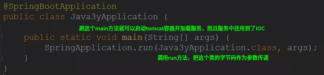
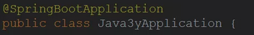
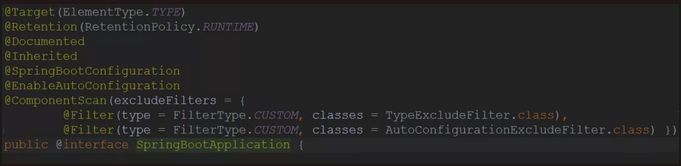
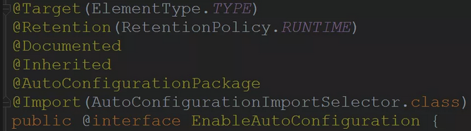
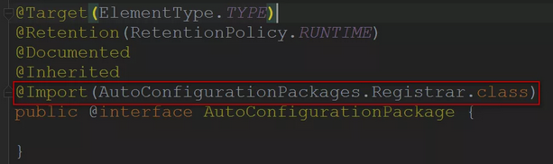
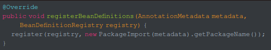
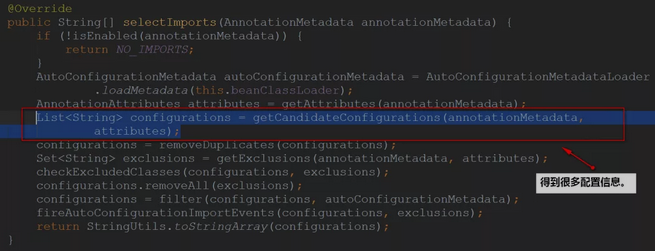
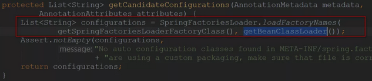
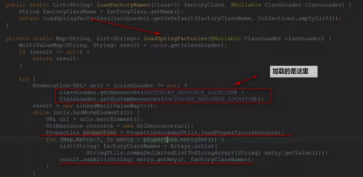
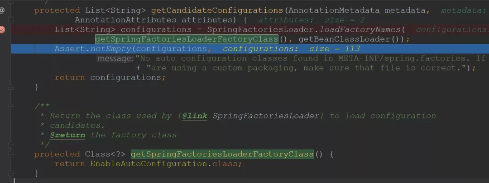

## SpringBoot


### 创建项目 ( IDEA 中的springboot插件)

1. file -> module -> spring initializr 
2. 选择jdk1.8 -> next 
3. 组织名, 项目名, type选maven project -> next
4. 选中web->web, 右上角设置spring boot 版本2.0 -> next
5. finish


> 生成的项目中的pox.xml 中的
>
> parent标签: 代表该项目继承于springboot项目
>
> properties标签: 属性配置
>
> build标签: 配置项目插件


6. 生成的项目中会在src->java的最底级目录中自动生成程序的启动类

   ```java
   //开启spring自动配置
   @SpringBootApplication
   public class Application{
       
       public static void main(String[] args){
           //使用Application这个类启动内置的tomcat服务器, 这里就是本类
           SpringApplication.run(Application.class, args);
       } 
   }
   ```

   

7. 在java文件夹的最底文件夹中新建controller文件夹, 用于放控制器类

8. 在controller文件夹中新建HelloController类 ( 控制器类能被自动加载的原因是路径位于程序入口类的下级 )

   ```java
   @Controller
   public class HelloController{
       
       //注解同springmvc
       //访问路径
       @RequestMapping("hello")
       //设置返回方式为json字符串
       @ResponseBody
       public String hello(){
           return "hello";
       }
   }
   ```

   

9. 运行程序的main方法

10. 访问本地8080端口加控制器路径, 无需加项目名, 默认没有


> 项目中的各层类应当位于程序主类的下级或同级


### 创建项目 ( maven创建 )

1. file -> new module -> maven -> 选择jdk1.8 -> next -> 设置 add as module to 和parent都为none -> 输入项目名和组织名 -> next -> finish

2. 在pom中添加springboot为父级依赖

   ```xml
   <parent>
           <groupId>org.springframework.boot</groupId>
           <artifactId>spring-boot-starter-parent</artifactId>
           <version>2.2.5.RELEASE</version>
           <relativePath/> <!-- lookup parent from repository -->
   </parent>
   ```

   


### springboot核心配置

* 使用resources下的application.properties配置文件进行配置  (  也可使用.yml文件配置  )

  ```properties
  #配置服务启动端口
  server.port=8080
  #配置服务启动项目名
  server.context-path=/02-springboot-web
  ```

  * 使用yml配置如上  ( 配置文件名字应当为application.yml )

    ```yml
    server:
    	port: 9090
    	context-path: /02-springboot-web
    ```
    
    

* 多环境配置文件  , 使用多个配置文件, 根据主配置文件选择使用哪个

  1. 在resources下有多个配置文件  `application.properties` , `application-dev.properties`  , `application-online.properties`  , `application-test.properties`

  2. 其中  `application.properties`  为主配置文件

  3. 在  `application.properties`  中配置使用哪个配置文件

     ```properties
     #其他配置文件必须使用上述命名规则, 此项设置当前使用哪个配置文件, 为'-'之后的名称
     #指定激活配置文件中的配置会覆盖主配置文件中的配置
     spring.profiles.active=dev
     ```
     
     

* 使用自定义的配置 ( 实际上是sping中的自动注入中的值绑定@Value )

  1. 在配置文件中写自定义的属性

     ```properties
     name=123
     ```

     

  2. 在类中使用@Value来自动绑定值

     ```java
     @Controller
     class HelloCOntroller{
         @Value("${name}")
         public String name;
         
         @RequestMapping("obtainName")
         @ResponseBody
         public String obtainName(){
             return name;
         }
     }
     ```
     
     

  > 如果出现中文乱码, 在项目设置中设置配置文件编码格式为utf-8  file->settings->editor->file encoding->project encoding和default encoding for properties files设置为utf-8, 选中transparent native-to-ascii conversion -> apply -> ok

* 使用映射配置文件中统一前缀的属性为一个类的方法来使用自定义的配置文件

  1. 配置文件中要映射的属性统一前缀命名

     ```properties
     #统一命名前缀为boot
     boot.name=123
     boot.location=bj
     ```

     

  2. 创建一个类来映射一个前缀的属性
  
     ```java
     @Component
     //使用这个注解映射符合前缀的属性
     @ConfigurationProperties(prefix = "boot")
     class ConfigInfo{
         private String name;
         private String location;
         
         //属性的get和set方法...
     }
     ```
  
     
  
  3. 使用该类的实例来使用配置属性


### springboot中的springmvc 

>   与springmvc完全相同 

* @Controller
* @RestController
  * 在类上使用, 相当于同时使用了@Controller和@ResponseBody
  * 使用了这个注解的类中的所有方法都会返回json
* @GetMapping
  * 等同于设置了get请求方式的@RequestMapping
* @PostMapping
  * 等同于设置了post请求方式的@RequestMapping


### springboot使用jsp返回  

>    配置springmvc的视图解析器 

1. 在pom中加入jsp的依赖包

   * tomcat-embed-jasper
   * javax.servlet-api
   * javax.servlet.jsp-api ( 父级项目中没有, 要加版本号 2.3.1 )
   * jstl

2. 在application.properties中配置视图解析器

   ```properties
   #直接写/配置的是webapp文件夹下
   spring.mvc.view.prefix=/
   #配置后缀为.jsp
   spring.mvc.view.suffix=.jsp
   ```

   

3. 在src/main下新建webapp目录用于放jsp文件

4. 使用controller类来返回jsp页面

5. 如果是在idea中进行开发, 那么会出现404的错误, 因为编译的后jsp文件找不到, 在pom配置文件中配置编译的路径

   ```xml
   <build>
       <!--放在build中-->
       <resources>
           <resource>
           	<directory>src/main/java</directory>
               <includes>
               	<include>**/*.xml</include>
               </includes>
           </resource>
           <resource>
               <directory>src/main/resources</directory>
               <includes>
               	<include>**/*.*</include>
               </includes>
           </resource>
           <resource>
               <!--把webapp编译到meta-inf下-->
           	<directory>src/main/webapp</directory>
               <targetPath>META-INF/resources</targetPath>
               <includes>
               	<include>**/*.*</include>
               </includes>
           </resource>
       </resources>
   </build>
   ```
   
   


### 在springboot中使用mybatis

1. 在pom中添加依赖

   * mybatis-spring-boot-starter ( 1.3.1 )
   * mysql-connector-java
   * spring-boot-starter-web ( web程序起步依赖 )

2. 在java的最底路径下创建文件夹mapper用于放mybatis的mapper配置文件

3. 在application.properties配置文件中配置mapper配置文件的所在位置  和 数据源参数

   >   application.properties 文件应当在 resources文件夹下

   ```properties
   #由于上一步将mapper放在了类路径下, 所以使用classpath
   #具体路径根据实际情况来写
   #使用*.xml通配所有xml文件
   mybatis.mapper-locations=classpath:com/itheima/springboot/mapper/*.xml
   
   #配置数据源
   spring.datasource.username=root
   spring.datasource.password=123456
   spring.datasource.driver-class-name=com.mysql.jdbc.Driver
   spring.datasource.url=jdbc:mysql://localhost:3306/数据库名
   
   ```

   

4. 新建数据表 和 对应实体类 和 dao层接口 和 接口配置文件

   * 这一步可以使用mybatis-generator-maven-plugin插件自动生成
     1. 在pom的插件中添加上述插件
     2. 编辑该插件使用的xml配置文件
     3. 在插件配置中指定要使用的xml文件
     4. 在右侧maven工具栏中, 找到该插件, 双击运行, 即可自动生成代码

5. 在dao层接口类上添加 `@Mapper`  使其被容器加载, 效果同 `@Component`  ,  或者不加这个注解, 在运行的主类上添加 `@MapperScan(basePackages="com.itheima.springboot.mapper")`  来扫描mapper类使其加入容器, 路径根据实际来写

6. 写一套controller和service接口和service实现类来调用dao层方法 ( 使用自动注入对象 )

7. 运行main函数开启服务, 访问测试

8. 如果报错未找到dao层接口 的配置文件 , 查看target编译路径中是否有mapper的配置文件, 如果没有, 使用上述解决jsp页面未找到的处理方法: pom中的resource配置编译路径


> www.haojson.com json格式化的网站


### springboot中使用事务

>   ( spring的事务 )

1. 在运行的主类上加注解 `@EnableTransactionManagement`
2. 在service实现类的方法上加 `@Transactional` 指定该方法使用事务


### springboot中创建restful接口

1. 在RequestMapping中添加参数的映射, 然后在处理方法的参数上使用PathVariable来绑定参数

   ```java
   //这是一个controller
   
   //地址中添加参数的映射
   @RequestMapping("boot/user/{id}")
   //参数使用地址中的参数映射
   public Object user (@PathVariable("id")int id){
   	//这个id就是请求地址中的参数id
   }
   ```
   
   


### springboot热部署 

>   ( 修改代码自动重新加载 )

1. 在pom中添加依赖

   ```xml
   <dependency>
   	<groupId>org.springframework.boot</groupId>
       <artifactId>spring-boot-devtools</artifactId>
       <optional>true</optional>
   </dependency>
   ```

   

2. 重启项目

3. 如果使用eclipse开发, 修改代码后会自动重新加载, 如果使用idea开发, 修改代码后, 需要点击工具栏build->build module <当前项目名> 才会重新加载

4. 该插件可能偶尔会出现重新加载后还是老代码的问题, 手动重启项目


### springboot单元测试

[单元测试](https://www.jianshu.com/p/72b19e24a602)

1.  引入

    ```xml
     <dependency>
                <groupId>org.springframework.boot</groupId>
                <artifactId>spring-boot-starter-test</artifactId>
                <scope>test</scope>
            </dependency>
    ```

2.  首先搭建好能跑起来的springboot项目结构, 也就是程序主入口 Application.java

3.  在项目的test目录下创建测试代码, 其实写在哪里都一样, 只是为了规范, 测试代码应当放到 test目录下

    ```java
    @RunWith(SpringRunner.class)
    @SpringBootTest
    public class mainTest {
        //获取到自动注入对象
        @Autowired
        UserService userService;
    
        //执行测试方法
        @Test
        public void TestGetAllUser(){
            List<User> userList = userService.getUserList();
            System.out.println(userList);
        }
    }
    ```

    


### 在springboot中使用redis

1. 引入依赖

   ```xml
   <dependency>
   	<groupId>org.springframework.boot</groupId>
       <artifactId>sping-boot-starter-data-redis</artifactId>
   </dependency>
   ```

   

2. 在核心配置文件中配置连接redis服务器的参数

   ```properties
   spring.redis.host=192.168.230.128
   spring.redis.port=6379
   spring.redis.password=123456
   ```

   

3. 此时启动程序, 容器中将会加载一个 redisTemplate 对象

4. 在要使用redisTemplate的地方使用自动注入  

   ```java
   //使用容器 中的这个对象, 只有这两种泛型可以使用
   
   @Autowired
   private RedisTemplate<String , String> redisTemplate;
   @Autowired
   private RedisTemplate<Object , Object> redisTemplate1;
   ```
   
   

* 对于高并发,可能出现缓存穿透问题, 在service层使用synchronized来解决

* 对于高并发的测试, 使用 Executors 创建线程池来测试

  ```java
  //新建一个线程池25个线程, 个数根据cup数来定, 4核就8个, 16核就32个
  ExecutorService executorService = Executors.newFixedThreadPool("25");
  //创建10000个线程并执行
  for(int i=0;i<10000;i++){
      executorService.submit(new Runnale(){
          @Override
          public void run(){
              //每个线程做什么...
          }
      })
  }
  ```

  

> 项目中的实体类都应当实现序列化接口 Serializable


> synchronized 同步 ( 即线程排队执行 ), 可用在方法上, 可用在代码块上


### springboot使用springmvc中的拦截器

1. 创建拦截器类实现HandlerInterceptor接口

   ```java
   class LoginInterceptor implements HandlderInterceptor{
       @Override
       public boolean preHandler(
           HttpServletRequest request, HttpServletResponse response)
       {
           //预处理方法
           return true;
       }
       
       @Override
       public void postHandler(
           HttpServletRequest request, HttpServletResponse response)
       {
       	
       }
       
       @Override
       public void afterCompletion(
       	HttpServletRequest request, HttpServletResponse response)
       {
       	
       }
   }
   ```

2. 新建配置类继承WebMvcConfigurerAdapter

   ```java
   //使用注解使这个类成��在 src/main/resources/static 下
   
    

### 使用actuator监控服务状态

* actuator使用一个端口开启一个监控服务, 通过url访问该地址获取状态信息

1. 在pom中引入依赖
* spring-boot-starter-actuator 
2. 在配置文件中配置actuator监控端口和项目及接口

   ```properties
   #设置监控服务使用哪个端口, 如果不指定端口, 默认使用服务的端口
   management.server.port=8080
   #设置监控服务开启端口的上下文, 在访问监控服务时, 要使用这个作为项目名
   management.server.servlet.context-path=/03-springboot-web
   #默认只开启health和info的监控, 设置为*来监控所有的web入口端点
   management.endpoints.web.exposure.include=*
   ```

3. 启动main方法, 控制台显示开启了两个服务, 一个是tomcat服务, 一个是监控服务

4. 在浏览器使用监控服务的端口和上下文来访问监控服务提供的状态信息 ( 上下文和状态之间添加actuator )

   * 默认开启的两个信息端口

     `localhost:8100/03-springboot-web/actuator/health`

     `localhost:8100/03-springboot-web/actuator/info`


### springboot使用dubbo

* 最佳实践: 一个公共的服务接口项目( 放服务的接口和实体类 ), 一个服务的提供者项目 ,一个服务的消费者项目 
* 如果其他项目引用本地的公共项目引用不到 , 那么进入本地仓库 , 进入公共项目的版本目录中 , 删除 _remote.repositories 文件 ,重启idea重新引入 
* 尽量使用自己安装的maven , 不要使用idea自带的maven

##### ----创建公共的接口项目
1. 创建一个maven项目, 作为公共接口项目, 在其中添加service层和model层, 添加service接口和model实体类, 在maven project中使用install在本地maven仓库生成打包后的jar包

##### ----创建提供者项目
1. 创建一个带web功能的springboot项目, 作为服务提供者
2. 加入dubbo起步依赖, 和zookeeper客户端的依赖包
```xml
<!--dubbo-->
<dependency>
    <groupId>com.alibaba.spring.boot</groupId>
    <artifactId>dubbo-spring-boot-starter</artifactId>
    <version>1.0.0</version>
</dependency>
<!--zookeeper-->
<denpendency>
    <groupId>com.101tec</groupId>
    <artifactId>zkclient</artifactId>
    <version>0.10</version>
</denpendency>
```
3. 在springboot配置文件中配置dubbo

   ```properties
   #内置的tomcat服务端口
   server.port=8080
   #dubbo配置
   spring.dubbo.appname=springboot-dubbo-provider
   spring.dubbo.registry=zookeeper://192.168.230.128:2181
   ```

4. 在提供者的pom文件中引入公共的接口项目的jar包, 通过在接口项目中定义的groupid, artifactid ,version来引入

   ```xml
   <dependency>
       <!--复制接口项目pom文件中的组id , 项目id, 版本号信息过来-->
   </dependency>
   ```

5. 写接口的实现类

   ```java
   //dubbo家的注解
   @Service
   //spring家的注解
   @Component
   public class UserServiceImpl implements UserService{
       @Override
       public String sya(String name){
           return "hello " + name;
       }
   }
   ```

6. 在main方法的类上添加 `@EnableDubboConfiguration` 开启dubbo注解

7. 启动zookeeper注册中心服务

8. 启动main方法来注册到注册中心

##### ----创建消费者项目

1. 创建一个带web的springboot项目

2. 在pom中添加dubbo起步依赖 & zookeeper客户端依赖包

3. 在springboot配置文件中配置dubbo

   ```properties
   server.port=9090
   #dubbo配置
   spring.dubbo.appname=spring-boot-consumer
   spring.dubbo.registry=zookeeper://192.168.91.29:2181
   ```

4. 在pom中添加公共接口项目的依赖jar

5. 编写controller来远程调用提供者的方法

   ```java
   @Controller
   public class helloCOntroller{
       @Reference //dubbo家的注解, 自动注入远方的提供者实例, 如果提供者中设置了版本号, 那么在这里就要设置相应的版本号
       UserService userService;
       //直接使用service对象即可
       @ResponseBody
       @RequestMapping("hi")
       public String sya(String mess){
           return userService.sya()+mess;
       }
   }
   ```

6. 在main方法的类上添加 `@EnableDubboConfiguration` 开启dubbo注解

7. 运行main方法启动消费者, 使用浏览器访问接口测试远程调用结果


### springboot + dubbo + mybatis + redis + thymeleaf案例

1. 创建项目
    * dubbo接口项目 , 为普通的maven项目
    * dubbo提供者项目, 引入dubbo接口项目 , 为带web功能的springboot项目
    * dubbo消费者项目 , springboot项目, 带web功能
2. 准备数据库 , 准备表 user
3. 在dubbo提供者中准备mybatis接口类 , 可使用插件生成 , 同时在提供者中配置myabtis环境保证可访问数据库
4. 在dubbo接口项目中准备实体类(实体类需要实现可序列化) 和 service接口层
5. 在dubbo提供者中添加service实现层 , 提供者引用了接口项目 , 需要先把 接口项目 install 到maven本地仓库 , 然后在 提供者的pom文件中添加 接口项目为依赖
6. 提供者中的 service实现类实现service接口 , 其中通过调用dao层接口来访问数据库 , 该实现类应当使用 Component和dubbo的service 注解
7. 通过配置将提供者和消费者加入到dubbo的注册中心
8. 在 虚拟机中启动zookeeper
9. 启动提供者服务
10. 配置消费者项目的 dubbo相关设置, 使其可正常访问提供者的服务 
11. 配置消费者的springmvc环境 , 使得可通过页面进行访问消费者服务
12. 写前端的thymeleaf页面 , 在其中调用消费者从提供者获取的服务
13. 启动消费者项目通过页面测试dubbo调用情况
14. 准备redis
15. 在提供者中连接redis并测试
16. 将 优先使用redis的逻辑 添加到提供者service实现类逻辑中
17. 启动消费者和提供者测试整个系统


## 原理解析

从一句代码开始



那么关键就在这个注解上，可以推断出，springboot根据这个注解找到相关的spring配置，加载相关的bean，然后启动 tomcat 容器并加载服务



点进去 `@SpringBootApplicaiton` 接口



其中包含三个重要的注解

*   `@SpringBootConfiguration`：我们点进去以后可以发现底层是**Configuration**注解，说白了就是支持**JavaConfig**的方式来进行配置(**使用Configuration配置类等同于XML文件**)。

*   `@EnableAutoConfiguration`：开启**自动配置**功能(后文详解)

*   `@ComponentScan`：这个注解，学过Spring的同学应该对它不会陌生，就是**扫描**注解，默认是扫描**当前类下**的package。将`@Controller/@Service/@Component/@Repository`等注解加载到IOC容器中


重点 `@EnableAutoConfiguration`

我们点进去看一下，发现有**两个**比较重要的注解：



-   `@AutoConfigurationPackage`：加载实体类到 IOC 容器

    

    我们可以发现，依靠的还是`@Import`注解，再点进去查看，我们发现重要的就是以下的代码：

    

    在**默认**的情况下就是将：主配置类(`@SpringBootApplication`)的所在包及其子包里边的组件扫描到Spring容器中

    比如说，你用了Spring Data JPA，可能会在实体类上写`@Entity`注解。这个`@Entity`注解由`@AutoConfigurationPackage`扫描并加载，而我们平时开发用的`@Controller/@Service/@Component/@Repository`这些注解是由`@ComponentScan`来扫描并加载的

-   `@Import`：给IOC容器导入组件

    我们回到`@Import(AutoConfigurationImportSelector.class)`这句代码上，再点进去`AutoConfigurationImportSelector.class`看看具体的实现是什么：

    

    我们再进去看一下这些配置信息是从哪里来的(进去getCandidateConfigurations方法)：

    

    这里包装了一层，我们看到的只是通过SpringFactoriesLoader来加载，还没看到关键信息，继续进去：

    

    -   `FACTORIES_RESOURCE_LOCATION`的值是`META-INF/spring.factories`
    -   Spring启动的时候会扫描所有jar路径下的`META-INF/spring.factories`，将其文件包装成Properties对象
    -   从Properties对象获取到key值为`EnableAutoConfiguration`的数据，然后添加到容器里边。

    最后我们会默认加载113个默认的配置类：

    


总结

`@SpringBootApplication`等同于下面三个注解：

-   `@SpringBootConfiguration`
-   `@EnableAutoConfiguration` 加载 实体类bean 和 其他组件 到IOC容器
-   `@ComponentScan`  加载自己写的 component/service/controller 到IOC容器

其中`@EnableAutoConfiguration`是关键(启用自动配置)，内部实际上就去加载`META-INF/spring.factories`文件的信息，然后筛选出以`EnableAutoConfiguration`为key的数据，加载到IOC容器中，实现自动配置功能

