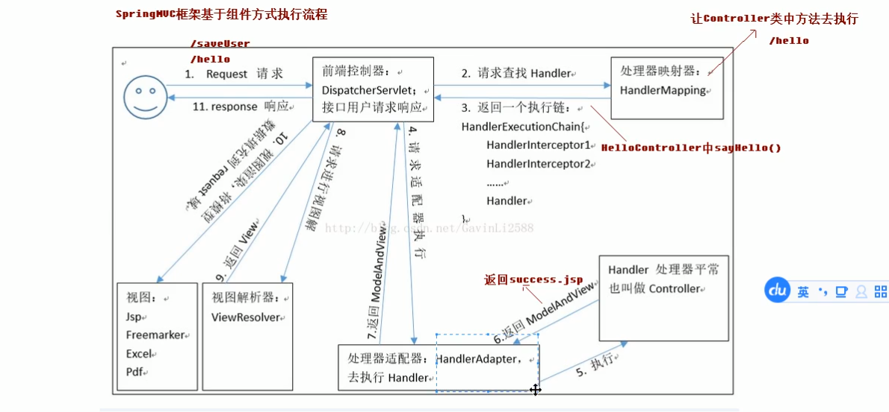

> web应用程序运行本质 : 
>
> 1. 自己的代码在项目中的 src 下
> 2. 源代码经过编译来到了 target 下
> 3. 源代码中的java文件编译成了 class 文件, 其他类型的文件保持原样复制到了 target 下
> 4. web程序运行实际上运行的是 target 下的 class 文件
> 5. springmvc的前端控制器会接管 class 文件中的所有servlet接口
> 6. 在springmvc 中配置了 mvc:resources 的路径和文件前端控制器将不会再插手接管

## SpringMVC

#### sm 和 Struts2的区别

* sm入口是servlet, Struts2入口是filter
* sm基于方法设计, Struts2基于类设计
* sm处理ajax更方便


#### springmvc项目配置

1. new -> module

2. 新建maven项目

   1. 选择jdk1.8, 选中构建骨架项目, 选择 maven-archetype-webapp骨架
   2. 输入 groupid, artifactid
   3. 在生成的参数列表预览中加入 `archetypeCatlog:internal` 的键值对, 避免创建项目时从网上下载而过慢的问题
   4. 项目创建完成

3. 补全项目结构

   1. 在`main/`下创建文件夹 `java` 存放java代码, 在 `java` 文件夹上右键, 选择mark direcroty as -> source root , 使其成为源文件夹
   2. 在 `main/` 下创建文件夹 `resources` 存放资源文件, 同上 , 使 该文件夹成为 resources root

4. 引入sm的相关jar包 (`pom.xml`)

   ```xml
   <!--版本锁定-->
   <properties>
       <spring.version>5.0.2.RELEASE</spring.version>
   </properties>
   
   <dependencies>
       
       <dependency>
           <groupId>org.springframework</groupId>
           <artifactId>spring-context</artifactId>
           <version>${spring.version}</version>
       </dependency>
       
       <dependency>
           <groupId>org.springframework</groupId>
           <artifactId>spring-web</artifactId>
           <version>${spring.version}</version>
       </dependency>
       
       <dependency>
           <groupId>org.springframework</groupId>
           <artifactId>spring-webmvc</artifactId>
           <version>${spring.version}</version>
       </dependency>
       
       <dependency>
           <groupId>javax.servlet</groupId>
           <artifactId>servlet-api</artifactId>
           <version>2.5</version>
           <scope>provided</scope>
       </dependency>
       
       <dependency>
           <groupId>javax.servlet.jsp</groupId>
           <artifactId>jsp-api</artifactId>
           <version>2.0</version>
           <scope>provided</scope>
       </dependency>
       
   </dependencies>
   ```

   

5. 在 `web.xml` 中配置前端过滤器, 使得所有请求都从这个sm过滤器进入

   ```xml
   <servlet>
       <servlet-name>dispatcherServlet</servlet-name>
       <servlet-class>org.springframework.web.servlet.DispatcherServlet</servlet-class>
       <!-- 使得加载过滤器的时候就加载springMVC的配置文件 -->
       <init-param>
           <param-name>contextConfigLocation</param-name>
           <!--如果启动服务后主页显示404, 回到这里确认这个springMVC.xml是否正确的加载(idea中按住ctrl鼠标点击会进入这个文件,出现404可能是因为它定位的是src/main/java下的配置文件)-->
           <param-value>classpath:springmvc.xml</param-value>
       </init-param>
       <!-- 使得过滤器在启动服务器的时候就加载 -->
       <load-on-startup>1</load-on-startup>
   </servlet>
   <servlet-mapping>
   	<servlet-name>dispatcherServlet</servlet-name>
       <url-pattern>/</url-pattern>
   </servlet-mapping>
   ```

   

6. 在`resources`文件夹下创建并编辑springMVC的配置文件 `springmvc.xml`

   ```xml
   <!--开启注解扫描 ( 设置哪里可以使用sm中的注解 )-->
   <context:component-scan base-package="java文件夹下的包"/>
   
   <!-- 配置视图解析器 -->
   <!-- 配置要返回的页面在哪里, 要怎么解析返回的视图名称字符串(前缀和后缀) -->
   <bean id="internalResourceViewResolver" class="org.springframework.web.servlet.view.InternalResourceViewResolver">
       <property name="prefix" value="/WEB-INF/pages/"/>
       <property name="suffix" value=".jsp"/>
   </bean>
   
   <!-- 配置前端控制器不拦截静态资源(js,css之类) -->
   <mvc:resources mapping="/js/**" location="/js/**" />
   <mvc:resources mapping="/css/**" location="/css/**" />
   <mvc:resources mapping="/images/**" location="/images/**" />
   
   <!-- 开启springmvc框架注解支持(配置默认的处理器映射器和处理器适配器) -->
   <mvc:annotation-driven/>
   ```

   

8. 在 `webapp` 文件夹下新建页面 `index.jsp`, 页面中添加 带有请求的超链接

8. 在 `java` 文件夹下新建 `controller` 文件夹, 在文件夹下 新建 控制器类 `helloController`, 在类上加 `@Controller` 注解使其变为控制器 , 在 `helloController` 中添加接口方法, 在方法上加 `@RequestMapping(path="/hello")`

   ```java
   @Controller
   public class HelloController{
       
       @RequestMapping(path="/hello")
       public String sayHello(){
           //会返回名字为 success.jsp 的页面
           return "success";
       }
   }
   ```

   

10. 在 `WEB-INF/pages/` 下新建 `success.jsp` 的返回页面

11. 启动服务器进行测试

    

    #### sm框架执行的流程

    

    

      #### @RequestMapping

    * 可用于类和方法上
    * 只有path属性时, path可省略不写
    * `method = Request.GET` 请求方式, 使用{} 设置多种请求方式
    * `params={"name=hehe","age"}` 请求参数,这边设置了, 请求的时候必须传对应的参数( 如果设置了值, 那么值也必须相同)
    * `headers={Accept}`请求必须包含这里设置的请求头参数


#### 请求参数绑定

```java
@RequestMapping("/hello")
//自动绑定名字为name和age的属性
//绑定bean对象时, 前端的name字段写bean对象中的属性名, 接口参数列表直接写bean对象, 会自动根据属性名查找set方法并执行实现bean参数的传递
//如果bean中还包含bean, 那么在传参的时候设置name属性为 user.name 形式即可
// 对于bean中存在list和map类型的属性
// list: 在传参的时候 使用 list[0].name , list[0].age 形式 将user对象传到bean对象中的list类型的属性中, 这里的list为bean对象中list类型的属性名称
// map: 同上, 使用 map['one'].name 和 map['one'].age 的形式, 将user对象传到bean对象中map类型的属性中 , 其中键为'one', 值为user对象, 这里的map为bean对象中map类型的属性名称
public String paramsBind(String name , int age){
    ...
}
```


#### 通过配置过滤器解决post请求中文乱码问题

`web.xml`

```xml
<filter>
	<filter-name>characterEncodingFilter</filter-name>
    <filter-class>org.springframework.web.filter.CharacterEncodingFilter</filter-class>
    <init-param>
    	<param-name>encoding</param-name>
        <param-value>UTF-8</param-value>
    </init-param>
</filter>
<filter-mapping>
	<filter-name>characterEncodingFilter</filter-name>
    <url-pattern>/*</url-pattern>
</filter-mapping>

```


#### 自定义类型转换器 

用于传参的时候, 将参数转换成想要类型数据

1. 自定义转换器 ( 字符串到日期 )

   ```java
   //实现sm框架提供的类型转换接口
   public class StringToDate implements Converter<String, Date>{
       //实现方法
       public Date convert(String source){
           //...
           //转换逻辑
           //...
           return ...;
       }
   }
   ```

   

2. 注册自定义的转换器 

   `springmvc.xml`

   ```xml
   <bean id="conversionService" class="org.springframework.context.support.ConversionServiceFactoryBean">
       <property name="converters">
           <set>
           	<bean class="自定义转换器的全路径类名"/>
           </set>
       </property>
   </bean>
        
   <!--修改注解支持使得上面的配置生效( 使用以上的conversionservice作为配置实例 )-->
   <mvc:annotation-driven conversion-service="conversionService"/>
   ```

   

3. 直接使用自定义转换的类型传参即可


#### 在接口中使用servlet原生的api

直接在方法参数列表中加上对应类型的参数即可获得原生的request和response对象

```java
//直接在参数列表中添加即可使用
@RequestMapping("/testServlet")
public String getServlet(HttpServletRequest request, HttpServletResponse response){
    ...
}
```


#### @RequestParam 

映射传参和参数列表

```java
@RequestMapping("/requestParam")
public String test(@RequestParam(name="name")String username){
    ...
}
```


#### @RequestBody

获取请求体

```java
@RequestMapping
public String test(@RequestBody String body){
    //body为请求体
    //该接口只接受post请求, 因为get请求无请求体
}
```


#### @PathVariable

使用restful风格的请求路径 ( 请求参数放在路径中: "test/zhangsan/10" )

```java
@RequestMapping("/test/{sid}")
public String test(@PathVariable(name="sid")String id){   //从路径中取参数
    ....
}
```


#### @RequestHeader

获取请求头

```java
@RequestMapping("/test")
public String test(@RequestHeader(value="Accept")String header){
    //header就是请求头中accept属性的值
}
```


#### @CookieValue

获取cookie的值

```java
@RequestMapping("/test")
public String test(@CookieValue(value="JSESIONID")String cookie){
    //cookie就是浏览器cookie中JSESSIONID的值
}
```


#### @ModelAttribute 用于表单数据验证

*  用于方法上, 会使得该方法优先于触发的控制器方法执行 , 可用于实现表单数据完整性验证

  ```java
  //接收到请求的控制器
  @RequestMapping("/test")
  public String test(User user){
      ...
  }
  
  //表单数据验证 优先于控制器方法执行
  @ModelAttribute
  public User before(String name , int age){
      //验证表单, 保证完整性
      User u = new User();
      //...
      //返回User对象给控制器方法
      return u;
  }
  ```

  

* 用于参数列表上, 使得验证方法无需返回值, 而是将处理完的数据保存到一个map中, 控制器参数再到map中取数据

  ```java
  //接收到请求的控制器
  //使用参数上的modelAttribute注解绑定参数数据
  @RequestMapping("/test")
  public String test(@ModelAttribute("abc")User user){
      ...
  }
  
  //表单数据验证 优先于控制器方法执行
  @ModelAttribute
  public User before(String name , int age, Map<String, User> map){
      //验证表单, 保证完整性
      User u = new User();
      //...
      //无需返回User对象给控制器方法, 而是存到map对象中
      map.put("abc", u);
  }
  ```
  
  


#### SessionAttributes 用于操作多个请求之间的共享数据 ( 就是把数据存到session中 )

```java
@Controller
@SessionAttributes(value={"msg"})  //将键为msg的键值对存放到session中
public class Test{

	@RequestMapping("add")
	public String addSession(Model model){  
        //这个方法会将数据存放到request作用域中, 因为设置了sessionattributes注解, 所以同时也会将数据存到session中
        model.setAttribute("msg","美美");
        ...
    } 
    
    @RequestMapping("get")
    public String getSession(ModelMap modelmap){
        //ModelMap对象的这个方法会从session中获取数据
        String msg = (String)modelmap.get("msg");
        ...
    }
    
    @RequestMapping("del")
    public String delSession(SessionStatus status){
        //这个方法会清空session
        status.setComplete();
        ...
    }
    
}
```


```jsp
<!--在jsp头标签中设置 isELIgnored=false 以启用el表达式-->
${ requestScope.msg }
${ sessionScope.msg }
```


> **request.getContextPath() 获得项目名称**


#### 关于接口的响应

* 返回值为String类型就按照 返回的字符串 对返回的页面进行匹配

* 返回值为Void类型则按照该方法的 请求路径 来作为页面的名字 进行页面匹配 (/user/test.jsp)

* 返回ModelAndView 对象,返回带数据的页面( 返回String的简化版 )

  ```java
  @RequestMapping("test")
  public ModelAndView reMV(){
      ModelAndView mv = new ModelAndView();
      //从数据库中查询数据...
      User u = new User();
      mv.addObject("user",u);  //设置数据
      mv.setView("success");  //设置返回的页面
      return mv;
  }
  ```

  

* 使用关键字进行请求转发

  ```java
  //将会使用转发的方式跳转, 同时不会使用视图解析器, 所以路径要写全
  return "forward:/WEB-INF/pages/success.jsp";
  ```

  

* 使用关键字进行请求重定向 

  ```java
  //将会使用重定向的方式跳转, 同时不需要写项目名称, 底层会自动加上
  return "redirect:/index.jsp";
  ```
  
  


#### @ResponseBody 响应异步请求 (ajax)

* 使用jackson系列jar包 , 实现json类型的bean的转换

  1. 引入jar包

     ```xml
     <dependency>
     	<groupId>com.fasterxml.jackson.core</groupId>
         <artifactId>jackson-databind</artifactId>
         <version>2.9.0</version>
     </dependency>
     <dependency>
     	<groupId>com.fasterxml.jackson.core</groupId>
         <artifactId>jackson-core</artifactId>
         <version>2.9.0</version>
     </dependency>
     <dependency>
     	<groupId>com.fasterxml.jackson.core</groupId>
         <artifactId>jackson-annotations</artifactId>
         <version>2.9.0</version>
     </dependency>
     ```

     

  2. 直接使用bean接收json类型的参数即可

     ```java
     @RequestMapping("tset")
     public String test(@RequestBody User user){
         ...
     }
     ```
     
     

* **使用@ResponseBody**

  ```java
  //@ResponseBody使返回的user对象作为响应体进行返回(自动转换为json的格式进行返回)
  @RequestMapping("test")
  public @ResponseBody User getUser(@RequestBody User user){
      //通过查询数据库然后对user进行修改...
      return user;
  }
  ```

  

#### 文件上传

* 设置表单enctype属性为: multipart/form-data , 会将表单数据分成几个部分发送给后台, 每部分都是MIME类型描述的正文, request.getParameters() 方法就无法解析出属性.

  ( 默认为 application/x-www-form-urlencoded, 键值对的方式 )

* 设置表单请求方式为 post

* 提供文件域 `<input type="file"/>`

* 使用 `Commons-fileupload` 组件实现对文件表单的解析

  1. 导入 `commons-fileupload-1.3.1.jar` 和 `commons-io-2.4.jar` 

     ```xml
     <dependency>
         <groupId>commons-fileupload</groupId>
         <artifactId>commons-fileupload</artifactId>
         <version>1.3.1</version>
     </dependency>
     <dependency>
         <groupId>commons-io</groupId>
         <artifactId>commons-io</artifactId>
         <version>2.4</version>
     </dependency>
     ```

     

  2. 传统文件解析方法...

* ***使用springmvc提供的文件解析器实现文件上传***

  * 原理: 前端控制器将表单数据发送给文件解析器, 数据经过文件解析器解析后返回给前端控制器, 前端控制器再把数据绑定到控制器方法的参数上
  * 控制器接收文件的参数名字必须和表单中上传文件框的name属性相同

  1. 导入文件上传的工具包 `commons-fileupload-1.3.1.jar` 和 `commons-io-2.4.jar` 

  2. 在`springmvc.xml` 中配置文件解析器对象

     ```xml
     <!--id必须是multipartResolver-->
     <bean id="multipartResolver" class="org.springframework.web.multipart.commons.CommonsMultipartResolver">
     	<property name="maxUploadSize" value="10485760"/>
     </bean>
     ```

     

  3. 在控制器方法参数列表中加上文件类型的参数 `MultipartFile upload` (名称必须和name属性一致)

  4. 文件上传

     ```java
     @RequestMapping("tset")
     public String fileUpload(HttpServletRequest request, MultipartFile upload) throws Exception{
         //获取上传的位置(判断有无, 无责新建)
         //这里设置的上传位置为 target 下的 uploads 文件夹
         //注意: web程序运行时执行的程序都来自 target 目录下文件, web项目中的src目录只是存放自己写的源代码的地方, 这些代码经过编译都会来到 target 目录下
         String path = request.getSession().getServletContext().getRealPath("/uploads/");
         File file = new File(path);
         if(!file.exists()){
             file.mkdirs();
         }
         
         //获取上传文件的名称
         String filename = upload.getOriginalFilename();
         //使用uuid使得文件名唯一
         String uuid = UUID.randomUUID().toString().replace("-","");
         filename = uuid + "_" + filename;
         //文件上传
         upload.transferTo(new File(path, filename));
         
         return "success";
     }
     ```
     
     
     
  5. 修改springmvc对资源文件的过滤规则 , 将上一步设置的 uploads 文件夹设置为springmvc中的资源文件夹, 使得可以直接访问该路径下的文件

      ```xml
      <!--在springmvc的配置文件中添加如下, 将对uploads文件夹的访问设置为对资源文件的访问-->
      <!--本质是设置这样的访问不经过springmvc的前端控制器-->
      <!--注意 : 如果是在idea中, 这样的配置会智能提示报红, 即src下的webapps下没有这个uploads文件夹,这个报红并不会影响程序的运行, 在该路径下新建该文件夹即可消除报红-->
      <mvc:resources mapping="/uploads/**" location="/uploads/**" />
      ```

      

* ***使用jersey实现对文件的跨服务器上传***

  * 实际开发中 , 文件会单独存放到一个 文件服务器上.

  1. 搭建文件服务器

     1. 新建maven->webapp->jdk1.8项目
     2. 在项目的 `target/项目名/` 目录下新建uploads文件夹用于存放文件
     3. 使用另外一个端口新建一个tomcat服务器, 运行这个项目

  2. 在应用服务器中引入jar包

     ```xml
     <dependency>
     	<groupId>com.sun.jersey</groupId>
         <artifactId>jersey-core</artifactId>
         <version>1.18.1</version>
     </dependency>
     <dependency>
     	<groupId>com.sun.jersey</groupId>
         <artifactId>jersey-cliend</artifactId>
         <version>1.18.1</version>
     </dependency>
     ```

     

  3. 实现上传
  
     ```java
     @RequestMapping("test")
     public String fileUPload(MultipartFile upload){
         //定义文件服务器的路径
         String path = "http://localhost:9090/uploads/";
         //设置上传文件的名称
         String uuid = UUID.randomUUID().toString().replace("-","");
         String filename = upload.getOriginalFilename();
         filename = uuid + "_" + filename;
         
         //创建jersey连接文件服务器的客户端对象
         Client client = Client.create();
         //客户端对象连接服务器, 获取目标资源文件对象
         WebResource webResource = client.resource(path + filename);
         //上传资源文件
         webResource.put(upload.getBytes());
         
         return "success";
     }
     ```


### SpringMVC的异常处理

* 使用异常处理器处理异常

  1. 创建异常类 ( 用于存放提示信息的类 )

     ```java
     public class SYSExcetion{
         private String msg;
         public void setMsg(String msg){
             this.msg = msg;
         }
         public String getMsg(){
             return this.msg;
         }
         public SYSException(String msg){
             this.msg = msg;
         }
     }
     ```

     

  2. 创建异常处理类 ( 自定义的异常处理方法 )
  
     ```java
     //实现接口成为一个异常处理器
     //ex为接收到的异常
     public class SYSResolver implements HandlerExceptionResolver{
         public ModelAndView resolveException(HttpServletRequest request, HttpServletResponse response , Object handler, Exception ex){
      		SYSException e = null;
             if(ex instanceof SYSException){
                 e = (SYSException)ex;
                 //对sysexception异常进行页面的返回
                 ModelAndView mv = new ModelAndView();
                 mv.addObject("error", e.getMsg());
                 mv.setViewName("error");
                 return null;
             }       
             return null;
         }
     }
     ```

     
  
  3. 配置异常处理器  `springmvc.xml`
  
     ```xml
     <!--配置完后系统抛出的异常会使用该类进行处理-->
     <bean id="exceptionResolver" class="自定义的异常处理类的全路径类名"/>
     ```
  
     

### springMVC拦截器

* 类似于servlet中的filter过滤器
* 拦截器是springmvc框架中的技术
* 拦截器只会拦截对控制器方法的请求, 不会拦截静态资源之类的. 过滤器可以拦截所有请求
* 自定义拦截器需要实现HandlerInterceptor接口

1. 实现自定义的拦截器类

```java
//实现拦截器接口, 该接口提供默认实现
public class myIntercepter implements HandlerInterceptor{
    
    //重写预处理方法, 登录验证
    public boolean preHandle(HttpServletRequest request, HttpServletResponse response, Object handle) throws Exception{
        //返回true为放行, false为拦截
        return true;
    }
    //后处理方法, 在控制器方法逻辑执行完之后跳转页面之前执行
    //最后处理方法, 在跳转页面之后执行, 释放资源
}
```

2. 配置拦截器类 `springmvc.xml`

```xml
<mvc:interceptors>
    <!--多个拦截器配置多个此标签, 会链式执行拦截器方法-->
	<mvc:interceptor>
        <!--配置要拦截的路径-->
    	<mvc:mapping path="/user/*"/>
        <!--配置用哪个拦截器拦截-->
        <bean class="自定义拦截器的全类名"/>
    </mvc:interceptor>
</mvc:interceptors>
```


## ssm整合

1. 准备数据库表

2. new module -> maven -> webapp 项目

3. 导入jar包

   * aspectjweaver
   * spring-aop
   * spring-context
   * spring-web
   * spring-webmvc
   * spring-test
   * spring-tx
   * spring-jdbc
   * junit 
   * mysql-connector-java
   * servlet-api
   * jsp-api
   * jstl
   * log4j
   * slf4j-api
   * slf4j-log4j12
   * mybatis
   * mybatis-spring
   * c3p0

4. 在 `main` 下创建 `java` 文件夹和 `resources` 文件夹 , 在`Java` 文件夹中新建 实体, 控制器, 服务层, dao层的文件夹

5. 新建实体 Account{id,name,money}

6. 新建dao接口 ( mybatis中只需要写接口即可,无需写实现类 )

   AccountDao -> findAll(), saveAccount()

7. 新建 AccountService 接口 

   AccountService -> findAll(),saveAccount()

8. 在service文件夹下新建实现类文件夹 `Impl`

   新建实现类 AccountServiceImpl 实现 AccountService ( **service注解要加在实现类上** )

9. 新建控制器类 AccountController

10. 为了使用aoc, 使用注解实现对象自动绑定数据的方法, 在 `resources` 文件夹下 新建 `applicationContext.xml` 文件对spring容器进行配置

    先修改xml文件的约束为spring 的约束 ( 有自动补全 )

    ```xml
    <!--applicationContext配置文件:-->
    <!--开启注解扫描, 扫描范围应为service层和dao层, 不应该扫描控制器的文件夹, 控制器文件夹应交给springMVC的扫描-->
    <context:component-scan base-package="cn.itcast">
    	<!--配置不扫描的注解(控制器注解)-->
        <context:exclude-filter type="annotation" expression="org.springframework.stereotype.Controller">
    </context:component-scan>
    ```

    

12. 在 `AccountServiceImpl`的类上加注解 `@Service("accountService")`  (将service这个类交给aoc容器管理, 成为spring容器中的一个bean对象, 然后就可以通过注解的方式直接自动绑定)

> 测试spring的环境 ( 直接加载配置文件的方式 )

```java
@Test
public void t1(){
    //加载配置文件
    ApplicationContext ac = new ClassPathXmlApplicationContext("classpath:applicationContext.xml");
    //获取对象,  这个传入的id是12步中给注解中的参数
    AccountService as = (AccountService) ac.getBean("accountService");
    //调用方法
    as.findAll();
}
```


13. 搭建springMVC环境

    1. 在 `web.xml` 配置前端控制器

    2. 新建 `springmvc.xml` 的配置文件

       ```xml
       <!--与之前不同的是, 注解扫描只扫描controller下的类-->
       <context:component-scan base-package="cn.itcast">
       	<context:include-filter type="annotation" expression="org.springframework.stereotype.Controller"/>
       </context:component-scan>
       
       <!--配置视图解析器...-->
       
       <!--过滤静态资源...-->
       
       <!--开启springmvc注解的支持...-->
       
       ```

       > 测试springmvc环境

       1. 在webapp下新建index.jsp包含a标签发送请求
       2. 新建对应的controller类
       3. 实现接口方法
       4. 测试响应效果

       

14. spring整合springmvc环境 ( 使得可以在controller中调用service对象中的方法 )

> 目的: 在启动tomcat服务器时 , 加载spring的配置文件, 从而开启spring 的注解扫描, 将对象加载到容器中

> 加载思路:
>
> 1. servlet中的ServletContext域对象为应用域对象, 会在服务器启动项目的时候被加载, 在服务器关闭的时候被销毁
> 2. 使用监听器监听ServletContext对象的创建和销毁, 该监听器方法将会在服务器启动时执行
> 3. 在该监听器中加载spring的配置文件, 并将创建的 web版本工厂 存储到ServletContext对象中

在 `web.xml` 中添加监听器来加载spring的配置文件

```xml
<!--配置spring的监听器, 默认只加载 WEB-INF 下的applicationContext.xml文件-->
<listener>
<listener-class>org.springframework.web.context.ContextLoaderListener</listener-class>
</listener>
<!--设置配置文件路径-->
<context-param>
	<param-name>contextConfigLocation</param-name>
	<param-value>classpath:applicationContext.xml</param-value>
</context-param>
```


15. 测试spring整合springMVC

    在controller接口方法中使用注解实现对象自动绑定,并调用其方法查看结果

    ```java
    //自动绑定
    @Autowired
    private AccountService as;
    
    @RequestMapping("/test")
    public String test(){
        //直接使用
        as.findAll();
        return "success";
    }
    ```

    

16. 搭建mybatis环境

    1. 使用注解的方式给dao方法绑定相应的sql语句

    ```java
    @Select("select * from account")
    public List<Account> findAll();
    
    @Insert("insert into account (name,money) values (#{name},#{money})")
    public void saveAccount(Account account);
    ```

    2. 在 `resources` 文件夹中新建mybatis的配置文件 `SqlMapConfig.xml`

    ```xml
    <?xml version="1.0" encoding="UTF-8"?>
    <!DOCTYPE configuration PUBLIC "-//mybatis.org//DTD Config 3.0//EN""http://mybatis.org/dtd/mybatis-3-config.dtd">
    
    <configuration>
    	<!--配置环境-->
        <!--默认使用id为mysql的环境-->
        <environments default="mysql">
            <environment id="mysql">
                <!--事务的类型-->
            	<transactionManager type="JDBC"/>
                <!--设置使用连接池-->
                <dataSource	type="POOLED">
                    <!--配置连接池属性-->
                	<property name="driver" value="com.mysql.jdbc.Driver"/>
                    <property name="url" value="jdbc:mysql://localhost:3306/ssm"/>
                    <property name="username" value="root"/>
                    <property name="password" value="root"/>
                </dataSource>
            </environment>
        </environments>
        
        <!--引入映射配置文件, mybatis可以使用配置文件的方式映射sql语句和dao方法, 这里使用注解方式绑定sql, 所以写class属性为dao的全路径类名-->
        <mappers>
        	<!-- <mapper class="cn.itcast.dao.AccountDao"/> -->
            <!--或者写包, 那么该包下的所有类都会被加载-->
            <package name="cn.itcast.dao"/>
        </mappers>
    </configuration>
    ```

> 测试mybatis环境

```java
@Test
public void test(){
    //加载配置文件, Resources是mybatis包中的
    InputStream in = Resources.getResourceAsStream("SqlMapConfig.xml");
    //创建sqlSessionFactory对象
    SqlSessionFactory factory = new SqlSessionFactoryBuilder().build(in);
    //创建SqlSession对象
    SqlSession session = factory.openSession();
    //获取代理对象 
    AccountDao dao = session.getMapper(AccountDao.class);
    //调用方法
    dao.saveAccount(new Account(null,"美美",20));
    //提交事务 ( 查询无需提交 )
    session.commit();
    //关闭资源
    session.close();
    in.close();
}
```


17. spring整合mybatis环境 ( 在service层中可以获得dao层的对象并调用其方法, 应当将dao层的代理对象存到IOC的容器中 )

在spring的配置文件 `applicationContext.xml` 中配置mybatis的参数和代理对象, 此时不再需要单独的mybatis的配置文件

```xml
<!--spring整合mybatis-->
<!--配置连接池-->
<bean id="dataSource" class="com.mchange.v2.c3p0.ComboPooledDataSource">
	<property name="driver" value="com.mysql.jdbc.Driver"/>
	<property name="url" value="jdbc:mysql://localhost:3306/ssm"/>
	<property name="username" value="root"/>
	<property name="password" value="root"/>
</bean>
<!--使用以上配置的连接池对象配置SqlSessionFactory工厂, 完事后就能生成sqlsession, 然后就能生成dao的代理对象, 从而实现对dao对象的自动绑定-->
<bean id="sqlSessionFactory" class="org.mybatis.spring.SqlSessionFactoryBean">
	<property name="dataSource" ref="dataSource"/>
</bean>
<!--配置AccountDao所在的包, 从而使得spring知道要将哪些接口生成代理对象存到容器中-->
<bean id="mapperScanner" class="org.mybatis.spring.mapper.MapperScannerConfigurer">
	<property name="basePackage" value="cn.itcast.dao"/>
</bean>


<!--配置spring框架声明式事务管理-->
<!--配置事务管理器-->
<bean id="transactionManager" class="org.springframework.jdbc.datasource.DataSourceTransactionManger">
	<property name="dataSource" ref="dataSource"/>
</bean>
<!--配置事务通知-->
<tx:advice id="txAdvice" transaction-manager="transactionManager">
    <tx:attributes>
    	<tx:method name="find*" read-only="true"/>
        <tx:method name="*" isolation="DEFAULT"/>
    </tx:attributes>
</tx:advice>
<!--配置AOP增强-->
<aop:config>
	<aop:advisor advice-ref="txAdvice" 
                 pointcut="execution(* cn.itcast.service.impl.*ServiceImpl.*(..))"/>
</aop:config>
```


18. 在dao层的接口上加注解 `@Repository` , 代表将该接口交给容器接管

19. 测试spring和mybatis的整合 , 即在service层的实现类中使用自动绑定的注解并调用dao对象的方法

```java
@Autowired
private AccountDao accountDao;

public void saveAccount(Account account){
    accountDao.saveAccount(account);
}
```


> 在jsp中使用jstl进行遍历
>
> ```jsp
> <%@ taglib prefix="c" url="http://java.sun.com/jsp/jstl/core" %> <%--引入jstl--%>
> <%@page isELIgnored="false"%> <%--开启el--%>
> <c:forEach items="${list1}" var="account">
> 
> ​	${ account.name }
> 
> </ c:forEach>
> ```
>
> 


> 在controller层中调用另外一个接口的方法: 使用response的重定向
>
> response.sendRedirect( request.getContextPath() + "/user/findAll" );


