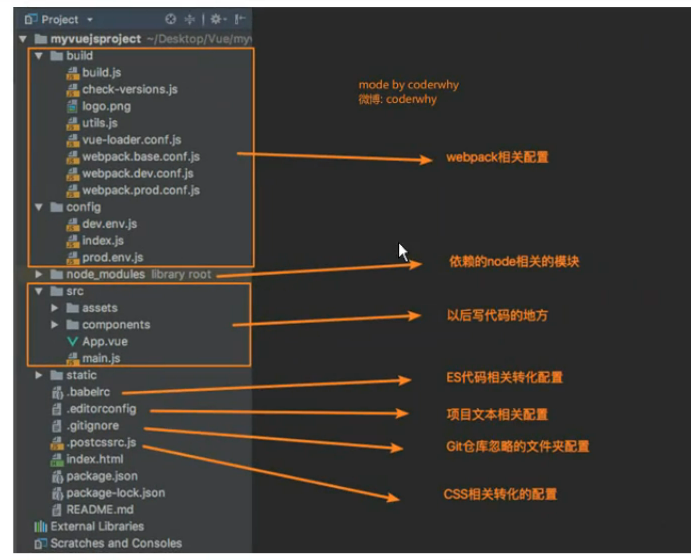
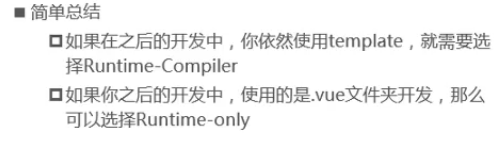
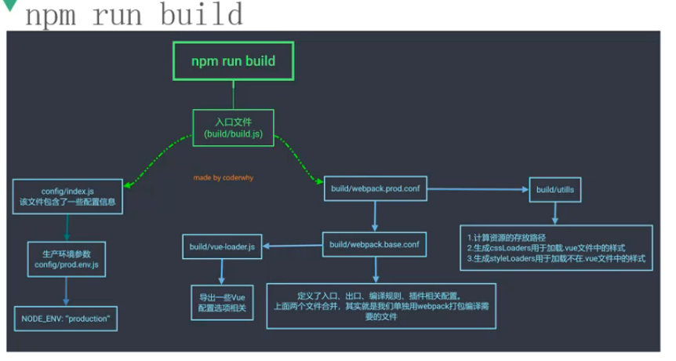
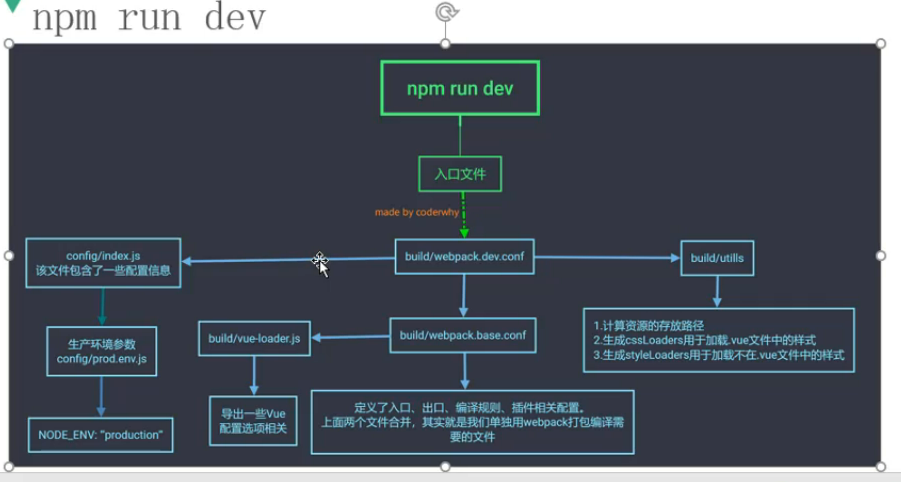
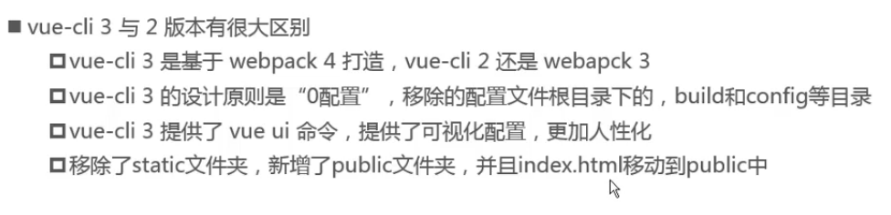
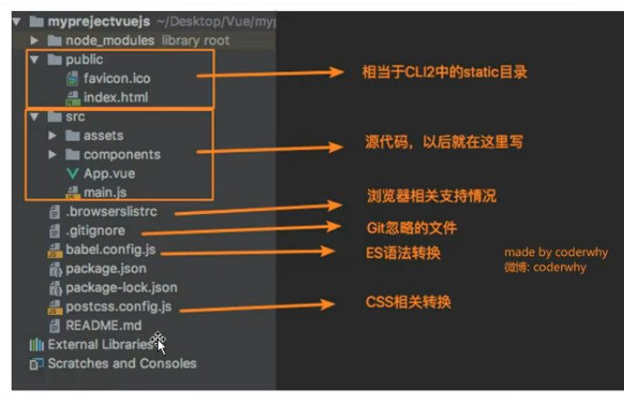
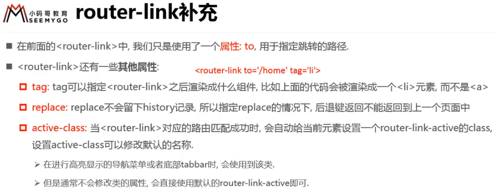
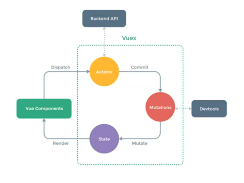
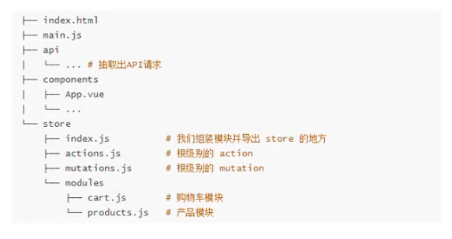

# Vue

>   响应式： 当数据发生变化时， 界面自动发生变换

>   命令式编程： 在代码中指定所有的操作步骤，也就是使用原生js操作DOM元素的方式
>
>   声明式编程： 只需指定目的值，即可完成操作，相当于直接进行设置， 也就是Vue的使用方式， 其实就是中间加了一层用来读取声明， 然后自动执行具体操作

>   注意: 
>
>   ​	所有在初始化 Vue实例时指定的参数 , 都可以在它的子组件中通过 `$属性名` 来获取到该参数配置的对象 
>
>   ​	因为在vue源码中, 初始化时把 options 里的每一项参数都设置到 Vue原型对象的 `$属性名` 上
>
>   ​	因为所有子组件都继承自 Vue对象, 所以在所有的子组件中都可以直接使用 `$属性名`

##### MVVM

model : 数据

view : DOM元素

viewmodel ： 就是Vue这个中间组件， 负责将model中的数据设置到view元素中； 同时负责对发生在view元素上的事件进行监听，进而执行定义的方法。 所以vue实现了将view和model连接起来的功能


##### Vue机制

*   虚拟DOM和复用机制

    ​	在渲染之前, 先解析页面为虚拟DOM, 然后查看要渲染的内容和之前已经存在的元素是否有重复, 默认复用重复部分, 也就是这些重复的元素不会重新创建, 而是直接通过修改属性的方式作为新虚拟DOM中的元素, 最后将虚拟DOM渲染为真实DOM

    ​	但是这样会造成问题, 如果要实现两个输入框的切换, 那么用户在第一个输入框中输入内容后, 点击切换为第二个输入框, 此时由于元素被复用, 会依然保留在第一个输入框中输入的内容.

    ```html
    <!--两个完全一样的输入框, 默认切换时会复用, 加上不同的key之后可以保证不会被复用-->
    <input name='username' v-if='isUser' placeholder='输入用户名' key='username'/>
    <input name='email' v-else placeholder='输入邮箱' key='email'/>
    ```

    ​	如果想解决这个元素被复用带来的问题, 给两个输入框加上不同的 key 属性即可, 因为在解析虚拟DOM时会检查key是否相同, 如果不相同, 那么直接就判定为不可复用, 进而会重新创建.


##### 指令属性

*   v-once 一次性绑定

*   v-html 按照html进行解析

*   v-text 等同于{{}} ，但是不常用

*   v-pre 原封不动显示， {{msg}} 直接显示为 {{msg}}

*   v-cloak 如果浏览器解析到该元素时，还未解析到vue代码，那么该元素不显示， 直至vue把值填充进去之后，才显示这个元素，能够防止因为vue代码部分解析延迟而造成界面先显示 {{msg}}， 然后变为 值 的抖动情况

    本质就是设置带有 v-cloak属性的元素display：none， 然后vue解析之后，把v-cloak属性删除，就显示这个元素出来
    
    

以上都是绑定元素内容的方法，即绑定两个标签之间的内容，如果要绑定元素属性的值，使用v-bind

>   v-bind中绑定的值如果不加单引号则解析为data中的变量, 如果加上单引号, 则解析为普通字符串

*   v-bind 绑定元素属性值, 简写为 :属性名, 例如 v-bind:src="imgUrl"
*   v-bind 绑定对象   v-bind:class="{'类名1': bool值, '类名2': bool值}"  给class属性绑定一个对象, 其中包含多个类名, 根据对应的bool值来确定该类名是否生效, 一般这个bool值使用data中的数据, 然后通过对data中的数据进行操作来控制类名
*   v-bind 绑定方法    v-bind:xxx="方法名()"  也可以绑定方法, 然后通过该方法返回要绑定的对象或值
*   v-bind 绑定数组    v-bind:class="['a','b','c']"  绑定数组

>   同理, v-bind:style 是一样的用法, 可以绑定对象, 也可以绑定方法


##### 事件监听

*   v-on:xxx="方法名(参数)" 或者 @xxx="方法名(参数)"  绑定事件

    *   如果方法没有参数, 那么可以省略小括号

    *   如果方法有参数, 且省略了小括号, 那么默认传递一个参数为浏览器生成的event对象

    *   如果方法有参数, 且只写了小括号, 那么就是没有传递任何参数

    *   如果方法有参数, 其中既要求传递event事件对象, 又要求传递其他参数

        那么在参数列表中使用 $event 来传递event对象

    *   如果传递的参数是数字或者加引号的字符串, 那直接按照值进行传递

        如果传递的参数是字符串且没有加引号, 那么将认为传递的是data中的属性

*   事件修饰符

    *   @事件名.stop    阻止事件冒泡传播
    *   @事件名.prevent    阻止默认事件, 比如form中submit按钮的提交事件
    *   @事件名.按键名    监听指定按键的指定事件, 比如enter按键的keyup事件, 可以写为 @keyup.enter="xxx"
    *   @事件名.once    只触发一次

    


##### 分支属性

*   v-if="变量或者表达式"

*   v-else

*   v-else-if="变量或者表达式"

*   v-show='xxx'  同样是控制是否显示, 与 v-if 不同的是, 这个本质是设置 display:none, 而v-if直接删除元素, 所以v-show切换显示隐藏性能更高

*   v-for='item in items'   能遍历数组, 也能遍历对象

    \<li v-for="item in items"\>{{item}}\</li> 循环, 使用在要被循环的元素中

    v-for="(item, index) in items" 可以获取下标

    v-for="(val, key) in items"  或者  v-for="val in items"  或者  v-for="(val, key, index) in items"  遍历对象

    v-for 遍历数组时, 非常建议加上 :key="item" 属性, 因为复用机制的存在, 如果是在数组中间插入元素, 那么相同key的元素会直接复用, 提高构建虚拟DOM的效率；而如果没有设置key, 那么创建新的虚拟DOM时将会把后面的元素依次设置向后一位的值, 浪费性能

    ***注意*** :　直接使用 this.nums[0] = 'aaa' 下标的方式改变v-for使用的数组元素不会实时更新到界面上, 也就是这种方式不是响应式, 如果要改变某个元素的值, 使用 js中的splice函数或者 Vue.set() 函数


##### v-model双向绑定

​	以上的数据绑定方式只是单向绑定, 也就是data中的数据改变时, 界面会自动改变, 但是界面中的值改变时, data中的值不会自动改变

​	v-model一般用于 input 和 textarea 元素, 当data改变时, 元素的value自动改变, 当input的value改变时, data 自动改变

​	本质就是设置了 :value 值绑定 和 @input 事件绑定

​	也就是

`<input v-model="msg"/>`

​	等同于

`<input :value="msg" @input="msg = $event.target.value"/>`

v-model用于radio元素

```html
<label for="man">男</label>
	<input id='man' type='radio' value='男' v-model='sex'/>
<label for="female">女</label>
	<input id='female' type='radio' value='女' v-model='sex'/>
...
data:{
	sex:'男'
}
```

v-model用于checkbox单选

```html
<label for="agree">同意协议</label>
	<input id='agree' type='checkbox' v-model='isAgree'/>
...
data:{
	isAgree:true
}
```

v-model用于checkbox多选

```html
<input type='checkbox' v-model='hobby' value='篮球'/>篮球
<input type='checkbox' v-model='hobby' value='篮球'/>足球
<input type='checkbox' v-model='hobby' value='游泳'/>游泳
...
data:{
	hobby:[]
}
```

v-model用于select单选

```html
<select v-model="fruit">
    <option value="apple">apple</option>
    <option value="orange">orange</option>
    <option value="banana">banana</option>
</select>
...
data:{
	fruit:'apple'
}
```

v-model用于select多选

```html
<select v-model="fruits" multiple>
    <option value="apple">apple</option>
    <option value="orange">orange</option>
    <option value="banana">banana</option>
</select>
...
data:{
	fruits:[]
}
```

v-model上的修饰符

*   v-model.lazy="xxx"  设置为懒加载模式, 当input失去焦点或者用户点击enter时, 才同步数据到data中
*   v-model.number = "xxx"  设置绑定到data中的属性保存为number类型, 默认将数据同步回data时都是string类型
*   v-mode.trim="xxx" 默认将input中输入的内容前后trim后再保存回data


##### 钩子函数

| 钩子函数       | 触发的行为                                                   | 在此阶段可以做的事情                                |
| -------------- | ------------------------------------------------------------ | --------------------------------------------------- |
| beforeCreadted | vue实例的挂载元素$el和数据对象data都为undefined，还未初始化。 | 加loading事件                                       |
| created        | vue实例的数据对象data有了，$el还没有                         | 结束loading、请求数据为mounted渲染做准备            |
| beforeMount    | vue实例的$el和data都初始化了，但还是虚拟的dom节点，具体的data.filter还未替换。 | ..                                                  |
| mounted        | vue实例挂载完成，data.filter成功渲染                         | 配合路由钩子使用                                    |
| beforeUpdate   | data更新前触发                                               |                                                     |
| updated        | data更新后触发                                               | 数据更新时，做一些处理（此处也可以用watch进行观测） |
| beforeDestroy  | 组件销毁前触发                                               |                                                     |
| destroyed      | 组件销毁后触发，vue实例解除了事件监听以及和dom的绑定（无响应了），但DOM节点依旧存在 | 组件销毁时进行提示                                  |


##### 数据

1.  在data属性中定义变量
2.  在其他地方直接使用

##### 方法

1.  在methods属性中定义方法
2.  在其他地方直接使用

##### 计算属性

1.  定义

    ```html
    new Vue({
    	computed:{
    		属性名:　function(){
    			return 使用其他属性进行计算的结果
    		}
    	}
    })
    ```

2.  使用

    直接当成属性来使用`<div>{{计算属性名}}</div>`

    当然计算属性使用方法来实现也可以, 然后使用的时候`<div>{{方法名()}}</div>`, 但是在{{}}中调用方法而不是属性不符合规范, 而且method每次调用时都会执行一次, 而computed属性只是第一次调用时执行, 所以computed性能更好

##### 过滤器

>   将数据预先处理，用于格式化展示数据

1.  在 filters 属性中定义个过滤器, 形式为方法

2.  {{xxx | 过滤器名}} 使用过滤器


##### watch监听器

>   对props属性或者data属性进行监听

```js
watch:{
    //写为方法的形式, 方法名是要监听的属性名, 方法参数为(新值,旧值)
    name(newVal, oldVal){...}
}
```


##### Vue.set和Vue.delete

>   用于 添加 和 删除 数组 或者 对象 中的 元素 或者 属性
>
>   使用这两个方法对数据的操作是响应式的, 因为总是会给对应的 元素 或者 属性 加入 响应式监听


##### 组件化

###### 组件化

代码复用， 方便维护

1.  创建组件构造器

    ```js
    //一般不使用这种方式构造组件， 而是直接使用语法糖来注册组件， 也就是省略这一步， 直接在使用下面步骤注册
    const mycon = Vue.extend({
        template:`<div>模板内容</div>`
    })
    ```

2.  注册组件

    ```js
    //全局注册方式， 可以在多个vue实例控制的元素下使用
    //多个vue实例， 就是创建多个vue实例分别控制多个元素
    Vue.Component('my-con', mycon)
    //局部注册方式， 只能在当前vue实例控制的元素下使用
    new Vue({
        template:{
            //属性名是在html中使用的标签名
            my-con: myCon
        }
    })
    
    //更加方便的语法糖注册方式
    //全局
    Vue.Component('my-con', {template:`<div>this is my component</div>`})
    //局部
    new Vue({
        template:{
            my-con:{template:`<div>this is my component</div>`}
        }
    })
    ```

3.  使用组件

    ```html
    <!--注意只能在vue控制的元素下使用， 意思就是只有在它下面注册了， 才能在它控制的元素中使用该组件-->
    <my-con/>
    ```

###### 子组件

*   子组件应当将数据保存到自己的data属性中， 而且不能直接使用父组件中data的值， 为的是组件化的独立性

*   子组件中的data属性必须是函数， 且返回一个对象， 该对象就是该组件的data值

    ***为什么必须是函数且返回一个对象？*** 

    ​	因为如果返回的直接是一个对象的话， 那么每个子组件实例将指向同一个data对象， 造成的情况就是， 在一个子组件实例中改变了data值， 其他子组件实例中的值也会一起改变

    ​	所以为了组件实例的数据独立性， 必须设计为每个组件使用单独的数据对象

```html
<script>
	Vue.Component('myCon', {
        template:``,
        data(){
            return {xxx:xxx}
        }
    })
</script>
```

###### 父子组件的基本使用

```html
<div id='app'></div>
<script>
    //<!--child component-->
    //子组件，只注册在父组件上， 那么就只能在父组件上使用， 而不能直接在根组件上使用
	const c1 = Vue.extend({
        template:`<div>this is component1</div>`
    })
    //<!--parent component-->
    //父组件，在它上面注册了c1, 那么就能在它控制的元素上使用c1
    const c2 = Vue.extend({
        template:`<div>this is parent component</div> <con1></con1>`,
        component:{ con1: c1 }
    })
    //<!--root component-->
	//Vue实例也是一个组件，相当于根组件，在它上面注册了吃c2组件，那么就能在它控制的元素中使用c2
    const app = new Vue({
        el:'#app',
        component:{ con2:c2 }
    })
</script>
```

###### 抽离模板内容

```html
<!--将模板抽离到单独的template标签中， 并指定id-->
<template id='con1'>
	<div>
        this is my component con1...
    </div>
</template>
<script>
	Vue.Component({
        //直接通过id绑定模板
        myCon1: '#con1'
    })
</script>
```

###### 插槽

1.  先在组件的模板中定义插槽slot

    可以给slot设置 name 属性

    可以给slot设置默认值

    ```html
    <template id='con1'>
        <slot name='slot1'><div>this is default slot content...</div></slot>
    </template>
    ```

2.  然后在使用该组件的时候指明替换插槽的内容, 不指明的话则使用插槽默认值

    ```html
    <con1>
    	<div slot='slot1'>
            this is slot content...
        </div>
    </con1>
    ```

###### 作用域插槽

​	这样的需求, 父组件需要对子组件插槽的结构进行自定义, 其中又需要使用子组件中的数据

比如子组件中有数组 arr, 而且子组件中有插槽slot1, 父组件想要把子组件中的arr以列表的形式定义到插槽slot1上.

1.  在子组件的模板中的slot1插槽上设置自定义属性, 名字随便, 值为要在父组件中使用的 arr

2.  在要使用子组件属性arr的地方定义template, 设置当前要填充的插槽的名字, 随便起, 然后使用这个名字.属性 来获取子组件中的arr, 这里的属性值为第一步中自定义的属性名

    ```html
    <div id='app'>
        <con1>
            <!--这一块用来填充模板中的slot-->
        	<div>
                <!--在填充slot的部分中, 使用slot-scope给当前插槽起个名字-->
                <template slot-scope='slot1'>
                	<ul>
                        <!--使用 插槽名字.属性 来获取子组件向外暴露的属性值-->
                        <li v-for='item in slot1.data'>{{item}}</li>
                    </ul>
                </template>
            </div>
        </con1>
    </div>
    
    
    <template id='con1'>
        <!--设置在使用该插槽时可以获取到的值arr-->
    	<slot :data='arr'></slot>
    </template>
    
    <script>
    	new Vue({
            el:'#app',
            component:{
                con1:{
                    template:'#con1',
                    //子组件中有属性arr
                    data:{
                        arr:['alice','blice','clice']
                    }
                }
            }
        })
    </script>
    ```

    

###### 父传给子组件

>   本质就是把值设置给子组件中的自定义参数上， 然后子组件可以直接使用自定义参数中传递过来的值

>   　注意: Vue规定, 不要在子组件中直接修改props是中的属性值, 如果确实要修改, 应当先把props属性的值保存到自己的data中, 然后修改data属性值

1.  在子组件中设置props属性，表示在子组件中可以使用的属性， 值的形式可以是数组或者对象

2.  在使用子组件的标签上设置绑定props中属性值为当前组件中拥有的属性

    <span style='color:red;'>注意，绑定的属性值不能写成驼峰形式，不支持</span>

    `<con1 :cMsg='msg'></con1>`, 说的就是这个cMsg，不能这样写

    <span style="color:cyan;">如果子组件中该属性值确实是驼峰，那么绑定的时候改为破折号写法</span>

    `<con1 :c-msg='msg'></con1>`

3.  在子组件中直接使用props中设置过的属性

    ```html
    <div id='app'>
        <!--2. 发送自己的数据到子组件的属性-->
    	<con1 :msg='pmsg'></con1>
    </div>
    <template id='con1'>
        <!--3. 在子组件中可直接使用prop中传过来的属性值-->
        <div>{{msg}}</div>
    </template>
    <script>
    	const app = new Vue({
            el: 'app',
            data:{
              pmsg: 'this is parent msg...'  
            },
            component:{
                con1:{
                    template: '#con1',
                    props:['msg'], //1.在子组件上设置prop属性
                    //prop:{msg:pmasg} 
                    //或者也可以用对象的方式设置prop属性值，一般都使用对象的方式
                    //对象的方式即可以限定该属性的类型，也可以设置默认值
                }
            }
        })
    </script>
    ```


###### 子传给父组件

>   本质就是子组件发出一个自定义事件并传递参数，父组件监听这个自定义事件并接收参数

1.  在子组件的方法中emit一个自定义事件， 同时传递参数

2.  在父组件中使用子组件的地方监听这个自定义事件，设置对应的处理函数，并接受参数

    ```html
    <!--页面内容-->
    <div id='app'>
        <!--使用子组件，监听自定义事件-->
    	<con1 @cus-click='handlCusClick'></con1>
    </div>
    
    <!--子组件模板-->
    <template id='con1'>
    	<div>
            <!--子组件中每一项设置点击事件，点击时就触发自定义事件-->
            <ul v-for='item in list'>
                <li @click='clickItem(item)'>{{item}}</li>
            </ul>
        </div>
    </template>
    
    <script>
    	const app = new Vue({
            el:'#app',
            component:{
                con1:{
                    template:'#con1',
                    data:{
                        list:[{id:1,name:'alice'},{id:2,name:'blice'}]
                    },
                    methods:{
                        clickItem(item){
                            //触发一个名为cus-click的自定义事件，并传递参数item
                            this.$emit('cus-click',item)
                        }
                    }
                }
            },
            methods:{
                //父组件中监听子组件自定义事件的方法
                //因为页面中设置该处理方法时没有写括号，所以默认将子组件中送过来的item参数传递过来
            	handlCusClick(item){
                    console.log('收到子组件传递的：'+item)
                }
        	}
        })
    </script>
    ```


###### 父访问子组件

>   　在父组件的方法中可以通过 this.$children 或者 this.$refs 来获取子组件实例

>   　获取到子组件实例后, 就可以直接访问子组件的属性值, 或者调用子组件中的方法

*   this.$children 获取到当前组件下的所有子组件, 返回列表

*   this.$refs 获取到所有设置了ref属性的子组件,  返回对象, key为ref属性值, value为子组件实例

    ```html
    <!--这里是使用子组件的地方, 设置了ref属性后便可以通过refs来获取-->
    <con ref='con1'></con>
    ...
    <!---->
    <script>
    	//在父组件的方法中, 使用this.$refs获取设置了ref属性的子组件
        new Vue({
            methods:{
                func1(){
          			this.$refs          
                }
            }
        })
    </script>
    ```

    ###### 子访问父组件

    >   使用 $parent 获取父组件实例
    >
    >   使用 $root 获取根组件实例, 也就是 Vue 实例

    >   非常不建议使用, 这样会破坏掉子组件的独立性


##### 模块化

###### 为什么要有模块化

​	传统的 js 开发中, 因为所有导入的 js 文件中的全局变量会相互覆盖, 所以将会导致很多问题, 此时就只能利用函数中的变量有作用域这个特性, 使用闭包来解决这个问题, 也就是

```js
//因为变量在函数中有作用域, 所以不会与其他 js 中的变量相互冲突
(funciton(){
 	var name
 	function sum(){}
 })()
```

但是此时把变量和方法都封装到一个封闭的函数中, 就失去了代码的复用能力, 所以传统的做法是用一个对象把要复用的内容返回出去, 也就是

```js
//此时把功能通过 module1 对象返回出去, 只要保证各个 js 文件返回的对象名称不同即可不冲突
module1 = (function(){
    var obj={}
    var name
    function sum(){}
    obj.name = name 
    obj.sum = sum
    return obj
})
```

以上是基于 es5 传统的模块化方法, 后来人们提出了各种模块化的规范, 比如 CommonJs , AMD, CMD, es6 modules

常用的规范是 CommonJs 和 es6 modules, 这些规范提供了导入和导出的关键字, 但是没有浏览器的支持, 也就是说按照这些规范写出来的代码浏览器不能直接运行, 所以就需要 webpack 之类的工具将代码转换为 浏览器支持的 es5 语法

###### commonjs规范下的模块化

```js
var name
function sum(){}

//用module.export导出
module.export={
    name,
    sum
}
```

```js
//导入这边使用 require 关键字导入
var {name, sum} = require('./aaa.js')
```

###### ES6中的模块化

1.  首先得在引用js文件的地方设置使用模块化, 也就是每个js文件的作用域是独立的, 此时就只能通过导入和导出来相互引用

    ```html
    <!--设置 type='module' 后,浏览器按照模块化进行解析-->
    <script src="./aaa.js" type='module'></script>
    ```

2.  导出这边用 export 导出 , 可以且仅可以有一个 export default

    ```js
    let name
    function sum(){}
    //export导出
    export {name,sum}
    //还可以 export 一个 default , 导入那边直接导入的话, 导入的是这个 default
    export default function(){...}
    ```

3.  导入这边用 import 导入, 可以用 * 导入所有

    ```js
    //导入一个内容
    import {name} from './aaa.js';
    //导入默认内容
    import defFun from './aaa.js';
    //导入所有内容, 同时得起一个名字, 然后用 名字.属性 来使用导入的内容
    import * as mod from './aaa.js';
    mod.name
    ```

    

##### webpack

>   使用webpack打包vue文件为浏览器可以识别的文件

>   webpack本质上是一个nodejs的程序

>   npm是nodejs的包管理工具, 使用npm可直接下载nodejs的包

`sudo apt-get install nodejs`  安装nodejs

`sudo apt-get install npm`  安装npm

`npm install webpack@3.6.0 -g` 安装webpack, 默认安装路径 `/usr/local/lib/node_modules`, 这里安装3.6版本, 因为 vue-cli2.0 要使用这个版本

`npm install webpack@3.6.0 -D` 注意一定要在本地安装webpack, 避免使用 npm run 执行 webapck 时使用全局的webpack版本对不上而打包错误


##### 使用webpack构建vue

>   实际开发中都是使用这种方式, 只不过以下构建项目步骤一般使用 vue-cli 来自动实现

1.  `npm init` 初始化nodejs项目

2.  创建 dist文件夹 , src文件夹 , index.html文件 ,  src/main.js文件 ,  构建项目的基本结构

3.  `npm install webpack@3.6.0 -D` 安装webpack

4.  编辑 package.json 文件, 添加运行 webpack命令 的 scripts , 也就是 `"bulid":"webpack"`

5.  编辑 webpack.config.js 文件, 设置各个参数, 包括输入输出位置, 使用到的loaders 等等

6.  `npm install vue --save` 本地安装vue

7.  在main.js 文件中 `import vue from 'Vue'` 引入 vue 实例使用

8.  因为打包时默认使用 vue 的 runtime-only 版本, 代码中不能使用任何的 template , 所以会运行不起来, 所以要在 webpack 中设置使用 runtime-complie 版本进行打包

    编辑 webpack.config.js , 在entry属性同级添加

    ```js
    resolve:{
        alias:{
            //这个意思就是每当引用结尾为 vue 的文件时, 都是引用 vue 包中的 vue.esm.js 文件, 这个文件就是 runtime-complie 版本
            //默认使用 vue.min.js , 也就是 runtime-only 版本
            //如果没有改这个配置, 那么打包后运行会报错 you are running in runtime-only where is template are not avilable...
            'vue$': 'vue/dist/vue.esm.js'
        }
    }
    ```

9.  执行 `npm run build` 命令进行打包 , 在 index.html 中引用打包生成的 js 文件

10.  打开 index.html 页面查看 vue 使用情况

**接下来按照模块抽离vue组件**

1.  创建 src/vue/App.vue 文件, 一个vue文件就是一个独立的组件, 其中包含 template, script, css, 这个 App组件就是项目的根组件

    ```vue
    <template>
      <div class="title">
          {{msg}}
      </div>
    </template>
    
    <script>
    export default {
        //where is contain all attributes of this component
        data(){
            return {
                msg:'this the msg of App component'
            }
        }
    }
    </script>
    
    <style>
    .title{
        color: red;
    }
    </style>
    ```

2.  在 index.js 中引用 App.vue组件, 然后把App设置为 template, 这样页面中就会使用App作为唯一根组件

    ```js
    import Vue from 'vue'
    
    //In `index.js`, only import the root component -- App.
    import App from './vue/App.vue'
    
    //`index.js` only content the root component-App, and `index.js` will not be modify on your develop.
    //what you should do in develop is only to create and edit independent components.
    //When use `el` and `template` in the same time,
    //the `template value` will replace the element which is setted by `el`
    const app = new Vue({
        el:'#app',
        template: `<App/>`,
        components:{App}
    })
    ```

3.  此时webpack还不能打包vue文件, 所以 `npm install vue-loader vue-template-compiler`

4.  默认下载的 vue-loader 15版本, 打包需要另外的 vue 插件, 那么可以手动修改 package.json 中 vue-loader 版本为 ^13.0.0 , 然后 `npm install` 重新安装这个版本, 这样就不需要额外下载 vue 插件

5.  然后在 webpack.config.js 中配置 vue 文件使用 vue-loader 打包

    ```js
    {
        //vue-loader
        test: /\.vue$/,
        use:['vue-loader']
    }
    ```

6.  执行 `npm run build` 打包

7.  打开 index.html 页面查看结果

**接下来安装一些开发时所需的效率功能**

1.  安装 html-webpack-plugin , 自动生成 index.html 到 output 目录

2.  安装 webpack-dev-server , 热部署代码 `npm install webpack-dev-server@2.9.1 -D --save-dev`, 因为上面安装的是 webpack3.6.0, 所以这里安装对应版本 2.9.1

3.  如果要使用多种 webpack.config.js 的配置 , 比如生成环境和开发环境不同, 

    那么可以使用 webpackMerge插件, 先抽离出来一个公共的配置文件 , 然后分别创建开发环境配置文件和生产环境配置文件

    最后在执行 webpack 打包命令时使用 --config 参数指定使用哪个配置文件

以上, 是手动构建使用webpack管理的vue项目

##### 使用vue-cli构建项目

1.  确保有 nodejs

2.  确保有 webpack

3.  `npm install -g @vue/cli` 安装

4.  默认安装的是 vue-cli3 版本, 只能创建版本3结构的项目

    如果想要创建版本2结构的项目 `npm install -g @vue/cli-init`

5.  创建项目

    vue-cli3版本的项目 `vue create project_name`

    vue-cli2版本的项目 `vue init webpack project_name`

    

###### vue-cli2创建项目

vue2-cli 的项目结构



关于创建项目时选择  runtime-only 还是 runtime-compiler 的问题

>   也就是说如果选择了 runtime-only, 那么就只能用 .vue 文件来组织组件, 但是这种方式打包出来的文件更小, 性能更高



关于创建完项目后执行 `npm run build` 时具体的执行步骤



关于创建完项目后执行 `npm run dev` 时具体的执行步骤




vue-cli2 和 vue-cli3 的区别

>   其实直观上就是创建出来的项目结构不同




###### vue-cli3创建项目

>   vue-cli3基于零配置原则, 创建出来的项目不再直接显示所有的配置文件, 而是使用默认配置, 并且将配置保存到 node_modules/@vue/webpack.config.js中, 且这个默认的配置文件不允许修改
>
>   如果要修改配置, 可以通过 `vue ui` 命令打开配置页面 , 然后导入 vue 项目进行配置
>
>   也可以在项目根目录下新建 `vue.config.js` 文件, 在其中 `export.modules={}` 自定义的配置, 自定义的配置会覆盖默认配置, 其余配置将使用默认配置




##### 路由

1.  后端渲染阶段

    ​	浏览器发送请求到后端, 后端负责把数据加载到html页面中生成jsp页面返回, 返回的jsp页面中只包含html和css, 所有的操作都对应后端的接口, 由后端对页面进行修改后返回

2.  前后端分离阶段

    ​	浏览器对静态资源如html,css,js的请求指向静态资源服务器, 比如apache, nginx, 页面中的操作使用ajax请求 api服务器, api服务器只负责接收请求处理数据, 返回数据给浏览器后, 在浏览器端通过js解析数据并修改页面

3.  前端路由阶段

    ​	采用SPA-单页面富应用开发, 也就是静态资源服务器上只有一个页面, 
    
    ​	这个页面中包含了所有网站要用到的页面, 这里说的所有页面对应到 vue 中实际上就是组件, 一个页面对应一个组件, 而在这些个组件中, 又可以包含其他组件
    
    ​	浏览器一次性把这个页面请求下来, 每次只展示其中的一个页面(组件), 当通过url进行页面跳转时, 前端路由解析url, 把对应的页面(组件)展示出来, 所以切换页面的操作全部是在前端完成, 请求不再发给服务器. 


那么怎么实现url改变而不重新发起请求呢?

这里有两种实现方式, vue-router 中两种实现方式都有提供, 可以选择

1.  使用切换锚点的方式, 就是把url改成  `localhost:8080/index/#/about` 之类的

    使用js代码改变锚点的方式为, `loaction.hash='home'`, 那么 vue-router 只要监听这个事件的触发, 然后作出对应的页面切换即可

2.  使用html5中提供的 history 方法, 只改变 url 而不重新发出请求

    在js代码中 ,

    *   `history.replace({},'','home')` , 将当前uri 替换为 home

    *   `history.pushState({},'','home')` 在历史请求uri栈中添加 home, 并且把 uri 改为 home, 因为uri保存到栈中, 所以可以通过后退和前进按钮来切换 uri
    *   `history.forword()` 和 `history.back()` 切换到uri栈中的上一个或者下一个 uri, 效果同点击后退和前进按钮
    *   `history.go(n)` 在uri栈中前进或者后退n步, 负数时后退, 正数时前进

    

###### 使用vue-router

>   vue-router相当于一个插件

1.  使用cli创建项目时可选择是否安装vue-router, 如果没有安装, `npm install vue-router --save`

2.  在src目录下创建router文件夹, 用于存放所有路由

3.  创建 src/router/indexRouter.js 主路由文件

    ```js
    import VueRouter  from 'vue-router'
    import Vue from 'vue'
    
    //import page components 
    import home from '../components/home'
    import about from '../components/about'
    
    //1. all plugins of vue should be used before they are used.
    Vue.use(VueRouter)
    
    //2. create routers
    const routes = [
        //set router rules, 
        //eg, when the uri contain '/home', home component would appear in the element 'router-view'
        //设置默认打开链接时重定向到 /home 页面, 也就是设置默认显示的主页内容
        {
            path: '',
            redirect: '/home'
        },
        {path: '/home', component: home},
        {path: '/about', component: about}
    ]
    
    //3. create a router instance
    const vueRouter = new VueRouter({
        routes,
        //默认使用锚点定位模式, 那么url中会包含#
        //如果要使用history模式, 这里设置history
        mode: 'history'
    })
    
    //4. export the vue-router instance
    export default vueRouter
    
    ```

4.  在程序入口js也就是 main.js 中引入主路由文件, 并使用其导出的 router 对象作为映射规则

    ```js
    import Vue from 'vue'
    import App from './App'
    //导入主路由文件
    import vueRouter from './routers/indexRouter'
    
    Vue.config.productionTip = false
    
    /* eslint-disable no-new */
    new Vue({
      el: '#app',
      //set the routers
      router: vueRouter,
      render: h => h(App)
    })
    ```

5.  在主组件 App.vue 中使用 router-link 和 router-view 来定义要跳转到的路径, 以及显示的组件出现在哪里

    >   router-link 的本质就是 a 标签, 然后设置 href 属性为 #/xxx, 也就是设置定位到某锚点

    router-link属性

    

    >   router-view 的作用是占位, 该位置用来显示通过 router-link 切换显示的内容

    ```js
    <template>
      <div id="app">
        <div>
          <!--router-link define the path where to go, it just like <a> element-->
          <!--when click the router-link ele, the path whould become the value of 'to'-->
          <!--and then the countpart component(page) whould appear in the place where the tag router-view exsits-->
          <router-link to="/home" tag='button' replace>home</router-link>
          <router-link to="/about">about</router-link>
    	  <!--tag属性设置这个标签使用什么元素展示-->
          <!--replace属性设置点击该标签后是否可以按浏览器上的后退按钮来后退-->
        </div>
        <router-view></router-view>
      </div>
    </template>
    ```

6.  打开页面查看页面跳转效果

7.  也可以手动实现跳转, 也就是在对应的事件处理函数中

    `this.$router.push('/home')` 或者 `this.$router.replace('/home')`来跳转

**如果要使用 restful 风格的接口**

1.  先在主路由文件中定义restful风格的接口

    `{path:'/user/:username', component: user}`

    其中 :username 表示该位置接收的参数保存到 `this.$route.params.username` 属性中

2.  然后在 router-link 中设置带参数的 to 属性路径, 比如 `:to="'/user/'+userName"`, 这里使用了 v-bind参数绑定, username 参数来自于本组件的 data 属性中, 是动态设置的

3.  在接口对应的组件中通过 `this.$route.params.username` 属性获取参数

**你还应该使用路由懒加载的方式**

>   在 vue-cli2 中默认配置的打包方式是将所有js文件打包成三个js文件
>
>   app.js 用来存放所有的业务逻辑, 也就是自己写的代码
>
>   manifest.js 用来存放所有底层支持的代码, 其他两个js文件中的内容都是高级写法比如es6, 这个文件就提供了将高级写法转换为常规写法的功能
>
>   vendor.js 用来存放所有引用到的第三方的代码, 比如 vue , vue-router, vuex, axois 的代码

>   默认的分开打包方式是远远不够的, 用户从浏览器请求页面还是要一次性请求三个 js 文件, 所以就需要使用路由懒加载的方式, 每次只请求 *必要的js文件* 和 *当前访问的页面的js文件*
>
>   也就是说, 应当打包时一个页面对应一个js文件

1.  在主路由文件中使用懒加载的方式加载页面

    ```js
    {
            //you should use lazy load to enhance speed of request
            path: 'lazyPage',
            component: () => import('../components/lazyPage')
    }
    ```

2.  使用 `npm run build` 进行打包, 查看 dist 下会给每一个页面生成对应的一个js文件, 形如 0.js, 1.js ...

**如果你要使用多级路由**

>   也就是应用最大层级上分为四个模块, 然后在每个模块中又包含多个小页面

1.  在主路由文件中添加子路由路径

    ```js
    {
            path: '/home',
            component: home,
            //子级路由
            children:[
                {
                    path:'',
                    redirect: '/home/news'
                },
                {//注意: 子级路由路径前不要加/
                    path:'news',
                    component: news
                },
                {
                    path:'msgs',
                    component: msgs
                },
            ]
        },
    ```

2.  然后把对应的子级页面组件创建出来

3.  在父级组件中(这里的父级组件就是 home组件) 添加 router-link 和 router-view, 用来显示跳转到子级组件的链接和子级组件显示在哪里

    ```js
    <template>
      <div>
        <span>this is home page...</span>
    	<!--父级组件中使用 router-link 和 router-view-->
        <router-link to="/home/news">to news</router-link>
        <router-link to="/home/msgs">to msgs</router-link>
        <router-view></router-view>
      </div>
    </template>
    ```

4.  打开页面查看多级跳转效果

**如果想要切换页面的同时通过url传递参数**

1.  使用 router-link 时指定 to 属性为对象, 其中设置 path 和 query

    ```vue
    <!--convey query when go to the path-->
          <router-link :to="{
            path: '/getQuery',
            query: {name:'alice',age:22}
          }" tag="button">getQuery</router-link>
    ```

2.  如果是在自定义的事件中带参数跳转, 那么使用 `this.$router.push({to:'xxx',query:{xxx:xxx}})`

    ```js
    this.$router.push({
        to:'/xxx',
        query:{
            name:xxx,
            age:xxx
        }
    })
    ```

3.  在对应的组件中使用 `$route.query.xxx` 来获取query参数

    ```vue
    <template>
      <div>
          this is get query page... <br>
          <!--get query by $route.query-->
          name is :{{$route.query.name}} <br>
          age is :{{$route.query.age}}    
      </div>
    </template>
    ```

    

**关于$router和$route**

所有的组件都继承自 Vue 类, 而在调用 Vue.use(VueRouter) 时, 会将 $router 和 $route 两个属性加到 Vue 的 prototype上, 也就是所有的 Vue 实例都会有这两个属性, 所以在所有的组件中都可以使用这两个属性

$router 是初始化 Vue 实例时设置的 router 属性值, 也就是主路由对象

$route 是当前处于active状态的 route 对象, route对象就是在主路由实例中配置的那一系列映射关系对象


**路由拦截器**

>   这东西在vue文档中叫路由守卫

>   在发生路由跳转之前的切入点, 可以在该拦截器中设置统一的操作, 比如修改网页的 title, 比如验证登录

>   也可以指定跳转之后为切入点, 然后统一做点什么

1.  在创建主路由对象时指定指定拦截器做什么

    ```js
    //在主路由的js文件中设置拦截器
    //set router's aop
    vueRouter.beforeEach((to, from, next)=>{
        //it will be execute before ench router change
        console.log('accur router change : ' + from + ' to ' + to)
        //don't forget invoke next()
        next()
        //可以使用
        //next('/login')
        //跳转到指定页面
    })
    ```

    

每次切换组件时都会将其销毁, 待到切换回来时再重新创建, 这样会丢失组件之前的状态

**如果你想要在下次切换回来时依然保持组件内状态, 使用 keek-alive 标签包裹 router-view 标签**

>   keep-alive 标签是 vue 中自带的标签, 用它包裹 router-view 标签时, router-view 内组件切换时不会被销毁

>   在使用了 keep-alive 标签包裹后, 被包裹的组件就多了两个生命周期函数 actived 和 deactived

>   keep-alive 两个属性:
>
>   *   include 只保存指定的组件
>   *   exclude 除了指定的组件其他的都保存
>
>   这两个属性值使用的是组件中 name 属性的值, 如果存在多个使用 逗号 连接, 而且中间任何地方不要加空格

```vue
    <!-- save status by keep-alive -->
    <keep-alive>
      <router-view class="mainView"></router-view>
    </keep-alive>
```


##### vuex

>   作为一个全局的对象, 用于各个组件之间的变量共享

>   vuex里面的数据也是响应式的, 也就是当这个里面数据改变时, 用到这里面数据的页面都会自动改变

一般这些数据存到vuex中比较好:

*   用户的登录信息
*   用户位置信息
*   收藏商品
*   购物车

###### state属性

1.  `npm install --save vuex`

2.  创建 src/store 文件夹, 创建 src/store/vuexIndex.js

    >   ​	这一步跟router文件夹一个道理, 关于use和创建vuex实例的逻辑完全可以直接在入口js中写, 这样分开写是为了代码结构更加清晰

    ```js
    import Vue from 'vue'
    import Vuex from 'vuex'
    
    //1. 记得use组件
    Vue.use(Vuex)
    
    //2. 创建vuex实例
    const store = new Vuex.Store({
        //这里存放全局数据
        state:{
            g_name: 'ultraman'
        },
        //这里存放修改全局数据的方法
        mutations:{
    
        }
    })
    
    //3. 导出vuex实例
    export default store
    ```

3.  然后在main.js中引用并设置 vuex实例

    ```js
    new Vue({
      el: '#app',
      //set the routers
      router: vueRouter,
      //设置vuex
      store: store,
      render: h => h(App)
    })
    ```

4.  此时可以在多个组件中通过 `$store.state.xxx` 来获取共享属性值

5.  如果要修改全局属性, 不要直接操作 `$store.state.xxx` 来修改, 如下图, 如果这样修改, 就相当于直接从 vue components 到 state, 不经过 mutations, 因此 devtools 也检测不到修改, 那么就无法在 devtools  中查看修改操作详情

    

    


###### getters属性

>   与 state 平级, 用来返回经过处理的 state数据, 功能类似于 计算属性

1.  在全局store对象中添加getters属性

    ```js
    //这里存放经过变换的全局数据, 相当于组件中的计算属性
    //这里的函数都默认带两个参数: 
    //  全局数据中的 state 属性 和 全局数据中的 getters属性, 
    //  可以从state中取全局数据,可以从 getters 中取其他的 getter
    getters:{
        g_num_pow2(state, getters){
            return state.g_num*state.g_num
        }
    }
    ```

2.  在其他地方使用 `$store.getters.属性名` 来获取getters中定义的属性

    ```vue
    <div>get global getter: {{$store.getters.g_num_pow2}}</div>
    ```


###### mutations属性

**所以如果要修改全局数据, 要通过 mutations**

1.  先在 mutations中设置修改全局变量的方法

    >   调用mutation时传递的参数, 官方称为payload

    ```js
    //2. 创建vuex实例
    const store = new Vuex.Store({
        //这里存放全局数据
        state:{
            g_num: 20
        },
        //这里存放修改全局数据的方法
        mutations:{
            //这里面的方法默认自带state全局对象参数
            //如果有传递参数, 那么方法的第二个参数就是传递过来的参数
            incre(state, num){
                state.g_num+=num
            }
        }
    })
    ```

2.  然后在要修改全局变量的地方使用 `this.$store.commit('mutation中的方法名')` 来调用mutation中的方法进而修改全局变量

    ```js
    //调用mutation中的方法修改全局变量
    //如果想要传递参数, 调用commit的时候在后面多加一个参数即可
    //如果要传递多个参数, 那么后面追加的参数使用对象的形式
    addition(){
        this.$store.commit('incre', 10)
    }
    ```

**如果全局变量中包含类型为对象的属性**

>   vue会在初始化时给所有全局对象中的属性添加响应式监听
>
>   如果某个属性是个对象, 那么会给这个对象中所有的属性添加响应式监听
>
>   但是如果在使用过程中给这个对象添加属性, 或者删除属性, 那么添加或者删除的属性并不会被加入到响应式监听中, 那么页面就不能自动变化
>
>   所以, 在给对象添加属性时, 应当使用 `Vue.set(对象,'要添加的属性', 要添加属性的值)` 来添加, 这样该属性就会被加入到响应式的监听中
>
>   同理, 在删除对象中属性时, 应当使用 `Vue.delete(对象, '要删除的属性')` 来删除


###### actions属性

**如果全局数据的操作是异步的**

那么一定要在 actions 中定义并调用, 如果在 mutations 中进行操作的话, 虽然界面仍然能够做到响应式, 但是 devtools 将捕获不到数据的修改, 也就是显示的还会是旧的数据

>   使用actions操作全局数据的流程:
>
>   前端事件 dispatch 调用 action > 在 action 中进行异步操作并且调用 mutations 中的方法来改变全局数据

1.  在 actions 中定义异步操作, 其中涉及到修改全局变量的操作要调用 mutations 中定义的方法

    ```js
     //这边放对全局数据的异步操作
    actions:{
        //action 第一个参数是当前的 vuex(store) 对象, 因此可以直接commit 调用 mutations 中的方法
        //第二个参数是自定义传递过来的参数
        //这里使用 settimeout 模拟一个异步操作
        action_increment(context, param){
            setTimeout(() => {
                console.log('action get the param : '+ param);
                context.commit('incre', param)
            }, 100);
        }
    }
    ```

2.  在其他要发起异步操作修改全局变量的地方通过 `$store.dispatch('action名字', 附带传递的参数)` 来调用actions

    ```js
    //调用action然后异步修改全局数据
    callAction(){
    	this.$store.dispatch('action_increment', 15)	
    }
    ```


###### modules属性

**如果要分模块保存全局数据**

>   如果把所有全局数据到放到一起保存会很乱, 可以分模块保存
>
>   就是在主vuex实例中设置moduls属性, 每一对key,val都是一个vuex实例, 代表子模块

```js
//用来将一个vuex对象分为多个模块, 便于数据的管理
    //这里边每一个key,val都是一个独立的vuex实例
    modules:{
      mod1:{
        //如果要用模块中的state, 使用 $store.state.模块名.属性名
        state:{name:'mod1_name'},
        //如果要调用模块中的mutations, 直接 $store.commit('方法名', 参数)
        mutations:{
            modifyName(state){
                state.name='new_mod1_name'       
            }
        },
        //如果要调用模块中的actions, 直接 $store.dispatch('方法名', 参数)
        actions:{
            mod1_modify_name_action(context){
                setTimeout(() => {
                    context.commit('modifyName')
                }, 1000);
            }
        },
        //如果要调用模块中的getters, 直接 $store.getters.属性名
        getters:{
            getFullName(state){
                return state.name + 'full'
            }
        }
      }
    }
```


###### vuex应有的样子

最后, 如果把vuex所有的属性都写到一起就太乱了, 应当把他们都抽离出来成为单独的文件, 这样才方便管理




##### 使用axios发送请求

>   为什么不用jquery中的ajax , 因为 jquery代码1w+, vue代码才1w+, 为了用一个网络请求的小功能就要引入整个jquery, 得不偿失

1.  `npm install axios --save`

2.  在使用之前应当统一配置相同的设置, 避免之后发起请求时每次都要设置

    

    

3.  如果后端是分布式, 不同模块对应不同的服务器地址, 那么就需要多套配置 , 此时应当使用 `axios.create()`来创建多个axios实例, 给每一个实例不同的设置, 使用多个实例分别请求不同的服务器

    ```js
    import axiox from 'axios'
    
    //创建多个axios给不同的配置
    ax1 = axiox.create({
        baseURL:'127.9.1.120',
        timeout: 5000
    })
    ax2 = axiox.create({
        baseURL:'220.89.1.109',
        timeout: 3000
    })
    //然后可以使用不同的实例对不同的服务器发起请求
    ax1({
        URL: '/getName'
    })
    ax2({
        URL: '/getAge'
    })
    ```

4.  不要直接在业务代码中使用类似于 axios 这种第三方包

    因为, 如果这个第三方包更新了, 或者出问题了, 或者项目要换一个第三方包来代替这个包, 那么对于维护这个项目来说将是毁灭性的, 假如有50个页面都直接使用了这个包, 那么修改时就只能50个文件一个一个地修改.

    所以, 在使用这类第三方包时, 一定要自己对其封装, 然后在业务代码中使用自己封装的api, 那么哪怕以后这个第三方包出了问题, 或者是要换掉这个包, 只需要修改自己封装的api即可.
    
5.  也可以配置请求拦截器 http://www.axios-js.com/zh-cn/docs/#%E6%8B%A6%E6%88%AA%E5%99%A8

    请求拦截器

    *   适用于发送请求之前和之后显示和隐藏加载图标

    *   适用于登录的预先验证, 如果没有携带 token 之类的登录信息, 跳转到登录页面

    响应拦截器

    *   适用于对接受到的数据预先统一处理
    *   适用于错误的响应统一处理


# ES6

###### let

>   es5中的var类型的变量在if, for, 块代码 中没有作用域, 只有在函数中才有作用域
>
>   所以可能发生如下情况

```js
//想要每个按钮点击后打印不同的值,但是由于for没有作用域, 所以最后所有按钮打印的都是该变量最后的值
btns = document.getElementByTagName('button')
for(var i=0;i<btns.length;i++){
    btns[i].addEventListener('click',function(){
        console.log('btn '+i+' is clicked');
    })
}
//最后各个按钮打印的是
//btn 5 is clicked
//btn 5 is clicked
//btn 5 is clicked
//btn 5 is clicked
//btn 5 is clicked
//如果想要实现目的功能, 需要利用函数的作用域即使用闭包
for(var i=0;i<btns.length;i++){
    (function(i){
        btns[i].addEventListener('click',function(){
        	console.log('btn '+i+' is clicked');
    	})
    })(i)
}
//此问题也可直接通过使用ES6中的let来实现, 因为let变量以if,for,块代码,函数为作用域
for(let i=0;i<btns.length;i++){
    btns[i].addEventListener('click',function(){
        console.log('btn '+i+' is clicked');
    })
}
```

###### const

>   常量，不可被再次赋值
>
>   在定义时必须进行赋值
>
>   常量对象的指向不可改变，但是对象中的属性可修改

###### 遍历

1.  `for(let i in arr)` 遍历索引
2.  `for(let n of arr)` 直接遍历值

###### filter函数

`res = arr.filter(n=>n>100)` 直接根据条件过滤数组并返回过滤后的新数组

###### map函数

`res=arr.map(n=>n*2)` 对数组中的每一个元素操作后返回新数组

###### reduce函数

`res=arr.reduce((prevVal, n)=>prevVal+n,0)` 汇总所有元素, 最后返回一个值, 第二个参数是初始值, 这里是返回所有元素的加和

第二个参数不传的话默认是0


