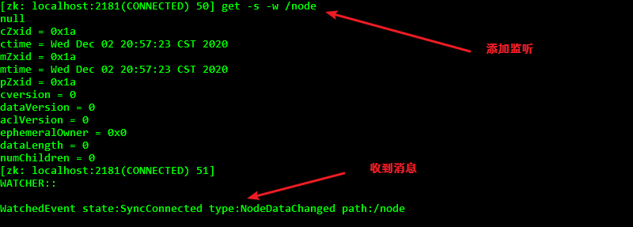
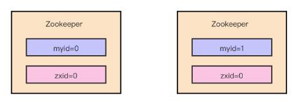

#### 分布式系统的CAP理论

C: consistency 一致性, 要求各个节点每时每刻都保持数据一致

A: Avalibility 可用性, 系统要求一直能够提供正常有效的服务

P: Partition Tolerance 分区容错性, 某个节点出现错误时, 整个系统仍然能对外正常提供服务

***P*** 是一定要满足的, 因为如果某个节点除了故障系统就瘫痪, 那么整这个分布式还有什么意义, 还不如直接单机运行

而且, CAP不同三个同时满足, 因此就必须从 C 或者 A 中舍弃一点


#### zookeeper 实操

​	用于存放分布式系统中的共享数据, 它主要是用来解决分布式应用中经常遇到的一些数据管理问题，如：统一命名服务、状态同步服务、集群管理、分布式应用 配置项的管理等

​	zookeeper满足的是CP, 不能确保总是可以正常访问, 但是保证数据绝对给你整对了

​	zookeeper学术上来说是 ***分布式协调系统*** , 以集群的方式给分布式系统提供统一的数据服务, 而且要从外边看像是一台单机, 它的优势就在于能够很快地完成数据的同步, 作为一个成熟的程序, 其他框架也就不自己再造轮子, 直接就使用zk, 因此zk才会流行起来


###### 读写分离?

​	分为leader, fllower, observer节点, 只有leader执行写操作, 其他节点提供读服务

###### session?

​	客户端与服务端建立连接时创建session, 定时心跳检测连接状态, 并且客户端可以watch节点变换, 当对应节点发生变化时, 服务端通知客户端, 然后客户端再读取新的值

###### 临时与永久节点?

​	可以选择创建临时或者永久节点, 临时节点在断开session连接时就自动删除

###### 节点存储?

​	数据节点按照文件的组织方式存储, /xxx/yyy/zzz

###### 数据发布与订阅?

​	发布者在指定节点添加信息, 订阅者watch这些节点实时获取到最新信息

###### 命名管理?

​	可以用作分布式命名管理系统, 使用自增值的节点作为分布式数据库记录的id, 可保证分布式数据库系统id不重复

###### 监听机制?

​	与zookeeper建立连接的会话可以选择监听感兴趣的节点的事件, 当发生这些事件时, 会话收到通知

###### 分布式锁?

​	请求临界数据时向zookeeper中添加临时编号节点, 然后检查是否为当前最小节点, 是则认为拿到了锁, 否则监听前一个编号节点的删除事件, 直至收到通知, 才代表获得了锁

###### 注册中心?

​	生产者在上面注册节点, 消费者从上面查看可用节点进行访问

###### 配置中心?

​	将分布式服务要用到的公共配置放到其节点上, 各个服务从上面取配置使用, 这样在配置需要修改时只需要修改zookeeper上的节点值即可


###### 分布式paxos算法

​	<span style='color:cyan;'>用于保证分布式系统中, 各个节点的数据一致性问题</span>

​	在该算法中, 分为 提议者, 接收者, 学习者 三种角色

***提议者***: 其实就是客户端, 用来向分布式系统中发送数据

***接收者***: 其实就是分布式系统的节点, 它们不仅要接收提议者的数据, 还要保证每个节点的数据都一致

***学习者***: 用来做数据冗余, 可以看作是分布式系统中的 slave

​	因为要保证所有节点的数据一致, 所以提议者每次有新的数据时都要向所有的接收者发送一份.

​	首先假设接收者一旦接收到提议者的数据就保存下来, 如果此时有多个提议者在发送数据, 而且存在网络波动, 那么它们的数据到达的时间将是乱序的, 那么肯定会造成各个接收者上最后保存下来的数据不尽相同, 来自于各个提议者, 此时分布式系统就处于数据不一致的境地.

​	paxos算法, 为了解决分布式系统各个节点的数据一致性问题

​	提议者向接收者写数据的过程分为两个阶段, ***准备*** 和 ***接收***

​	<span style='color:cyan;'>准备阶段</span>

​	各个提议者都产生一个编号发给各个接收者, 各个接收者都选最大的编号给予响应, 因为编号越大代表数据越新

​	<span style='color:cyan;'>接收阶段</span>

​	发送了小编号的提议者自然没有收到接收者的响应, 那么瞬间就明白了自己的数据不是最新的, 也就是本次写数据失败. 

​	而对于发送了最大编号的提议者, 它将会收到大部分接收者的响应, 也就是收到大部分节点说 "大, 你这个大, 我们存你的数", 然后这个最大编号提议者就把自己的值发送给所有的接收者 

​	接收者一看, 是这个最大编号对应的值, 就保存下来, 此时所有提议者节点都保存了最新的值 , 它们的数据是一致的 

​	最后学习者也默默地备份下这个值, 如果此时接收者中少数还没更新到最新值, 就由学习者发给它最新的值保存下来.

​	paxos算法能够保持所有节点数据一致性的本质在于, 第一次的响应是用来确定最后要用哪个值, 然后没说上话的提议者一看不是自己就不再写数据了, 第二阶段就只剩下被选中的提议者, 相当于它干掉了其他提议者, 最后把自己的值写到各个节点.

​	分成两个步骤的目的就是单独用第一个步骤确定最后要的, 到第二步时才真正进行写数据


###### zab协议

***写操作***

​	leader 节点用来执行写操作,  fllower节点用来执行读操作, 客户端随便连接一个节点, 如果是读操作那么直接进行, 如果是写操作那么转发给leader节点执行.

​	leader节点首先将写操作广播给其他fllower节点, fllower 节点收到消息后开始写事务, 然后返回给 leader 节点确认写消息, leader 收到大部分确认写操作后, 认定为本次写操作成功, 也就是 "我的小弟们都同意了"

​	然后再次广播提交写事务, 各个 fllower 收到后就提交写事务, 完成本次写操作的数据更新

***leader崩溃时***

​	选举新的leader , 然后其他 fllower 与新 leader 进行数据同步, 当大部分节点都完成了数据同步时, 认为系统恢复正常

***保证消息有序***

​	每个在集群中发送的广播都会带上一个编号zxid, 节点接收到编号后按照编号顺序执行


#### zookeeper 使用指南

> kafka 使用 zookeeper 作为服务注册发现中心

> 树形结构存储数据, 所有节点的路径都是 /xxx/xxx

##### 安装和启动

1. 下载并解压
2. 在目录下创建 data 文件夹, 用于存放数据
3. 复制 conf/zoo_sample.cfg 文件为 zoo.cfg 并修改 数据存放位置为上步新建的 data 文件夹
4. 在cmd中执行 bin 中的 zkServe.cmd

##### 使用zkCli.sh操作

> 执行 bin 中的 zkCli.cmd 默认连接本机2181端口
>
> 连接其他机器上的zookeeper时可设置 -server 参数来连接
>
> quit 退出

##### 列出节点

```shell
ls [路径]
```

##### 查看节点值

```shell
#无论节点是否有子节点, 它都能有值
get [节点路径]
```

##### 查看节点属性

```shell
stat [节点路径]
```

| **状态属性**   | **说明**                                                     |
| -------------- | ------------------------------------------------------------ |
| cZxid          | 数据节点创建时的事务ID                                       |
| ctime          | 数据节点创建时的时间                                         |
| mZxid          | 数据节点最后一次更新时的事务ID                               |
| mtime          | 数据节点最后一次更新时的时间                                 |
| pZxid          | 数据节点的子节点列表最后一次被修改（是子节点列表变更，而不是子节点内容变更）时的事务ID |
| cversion       | 子节点的版本号                                               |
| dataVersion    | 数据节点的版本号                                             |
| aclVersion     | 数据节点的ACL版本号                                          |
| ephemeralOwner | 如果节点是临时节点，则表示创建该节点的会话的SessionID；如果节点是持久节点，则该属性值为0 |
| dataLength     | 数据内容的长度                                               |
| numChildren    | 数据节点当前的子节点个数                                     |

##### 增加节点

有序节点做分布数据库id

> 有序节点可以作为分布式数据库数据的主键, 具体做法是首先规定一个有序节点名称作为数据库主键序号的生成节点, 每个客户端在往数据库存数据之前, 新增该有序节点, 因为zookeeper会自动在该节点后面加上唯一且递增的序号, 所以可以使用该序号作为要插入数据库数据的主键, 就保证了分库情况下数据主键的唯一.
>
> 
>
> 由图可知, 不断添加相同名称的有序节点, 后面的序号会逐个递增且不重复

有序节点做分布式锁

> 同样是使用有序节点, 创建 /Locks/Lock_ 的临时有序节点, 节点叫什么无所谓
>
> 对带锁保护的内容进行操作前, 先判断当前拿到的这个 Lock_节点序号的前一个节点是否存在, 不存在就代表轮到你了, 可以操作, 反之就代表被被人正操作着, 此时应当监听前一个节点的删除事件, 当其删除时, 就代表轮到自己了

使用方法

```shell
#创建持久节点, 不赋值默认为null
create [节点路径] [节点值]
#创建有序节点, 生成的节点名会后接序号
create -s [节点路径]
#创建临时节点, 该节点仅在本次shell中有效
create -e [节点路径]
#创建子节点, 首先得保证存在父节点, 如此时存在 node 节点, 为其创建子节点
create /node/second [值]
```

##### 修改节点

```shell
#普通修改节点
set [节点路径] [值]
#匹配版本号才能修改节点, 节点每修改一次, 版本号加一, 使用这种方式修改节点, 只有当前节点版本号等于给定版本号时, 才能修改成功
set [节点路径] [值] [版本号]
```

##### 删除节点

```shell
#只能删除没有子节点的节点
delete [节点路径]
#删除有子节点的节点
deleteall [节点路径]
```

##### 添加节点值监听

> 监听是一次性的, 捕获到一次动作后就失效 

> 这个可以做分布式配置共享, 将配置项设置为 节点值, 然后监听这些节点, 当收到变动消息时更新配置值

```shell
#先在一个 zkCli 中设置监听
get -s -w [节点路径]
#或者用 stat 添加监听也行, 没区别
stat -w [节点路径]
```

```shell
#再开一个 zkCli 修改监听的节点
set [节点路径] [值]
```

然后就会在添加监听的cmd中收到监听消息



##### 添加节点监听

> 监听是一次性的, 捕获到一次动作后就失效

> 这个能监听该节点的子节点个数变化, 节点值变化不会监听

```shell
#先添加监听
ls -w [节点路径]
```

```shell
#然后在另外一个zkCli中给该节点添加子节点
create [节点路径]
```

##### acl权限控制列表

> 设置不同的服务器对zookeeper上节点数据的操作权限

>  使用：schema(模式)​ : id(用户) : ​permission(权限列表) 来标识 

###### 模式包括

| 方案   | 描述                                                | 对应的id       | 权限格式                |
| ------ | --------------------------------------------------- | -------------- | ----------------------- |
| world  | 只有一个用户：anyone，代表所有人（默认）            | 只有一个anyone | world:anyone:[权限列表] |
| ip     | 使用IP地址认证                                      | 目标的ip地址   | ip:[ip地址]:[权限列表]  |
| auth   | 使用已添加认证的用户认证, 就是明文用户名和密码      | 目标用户名     |                         |
| digest | 使用“用户名:密码”方式认证, 就是用户名和加密后的密码 | 目标用户名     |                         |

###### 权限列表

> 比如拥有所有权限表示为  cdrwa

| 权限   | ACL简写 | 描述                             |
| ------ | ------- | -------------------------------- |
| CREATE | c       | 可以创建子节点                   |
| DELETE | d       | 可以删除子节点（仅下一级节点）   |
| READ   | r       | 可以读取节点数据及显示子节点列表 |
| WRITE  | w       | 可以设置节点数据                 |
| ADMIN  | a       | 可以设置节点访问控制列表权限     |

###### 查看某节点权限列表

```shell
getAcl [节点路径]
```


###### 设置权限列表

> 使用 setAcl <节点路径> <权限格式>

* 设置 world 模式的权限

    ```shell
    setAcl <节点路径> world:anyone:<权限列表>
    ```

* 设置 IP 模式的权限

    ```shell
    #设置赋予一个ip权限, 那么就只有该IP有权限
    setAcl <节点路径> ip:<IP地址>:<权限列表>
    #可同时设置多个ip权限,即同时设置多个权限规则
    setAcl <节点路径> ip:<IP地址>:<权限列表>,ip:<IP地址>:<权限列表>
    ```

* 设置 auth 模式的权限

    ```shell
    #首先得添加用户
    addauth digest <用户名>:<密码>
    
    #然后才能对该用户设置权限
    setAcl <节点路径> auth:<用户名>:<权限列表>
    ```

    ```shell
    #此时在别的机器上对该节点访问就需要先添加有权限的用户
    addauth digest <用户名>:<密码>
    #然后才能对该节点拥有对应的权限
    ```

* 设置 digest 模式的权限

    ```shell
    #首先使用linux命令生成用户名和密码的密文
    echo -n <用户名>:<密码> | openssl dgsl -binary -shal | openssl base64
    ```

    ```shell
    #同样是对用户的权限设置, 不同的是不需要先添加用户, 且使用加密后的密码
    setAcl <节点路径> digest:<用户名>:<上一步生成的密文>:<权限列表>
    #设置后需要添加对应用户才能拥有对应权限
    addauth digest <用户名>:<未经加密的密码>
    ```

* 同时设置多种权限模式, 使用 , 逗号分割多种权限格式

###### 设置内置的超管

> 为防止对节点设置了权限后忘了密码之类的尴尬, 应当设置一个内置的超级管理员账户, 通过修改 zkServer.bat 文件来实现, linux 下修改 zkServer.sh

1. 假设要添加的超管账号和密码是 super:admin, 还是先使用linux内置命令生成密文

    ```shell
    echo -n super:admin | openssl dgsl -binary -shal | openssl base64
    ```

2. 然后打开 zkServer 文件, 找到 `nohup $JAVA "-Dzookeeper.log.dir=${ZOO_LOG_DIR}" "-Dzookeeper.root.logger=${ZOO_LOG4J_PROP}"`, 在后面添加 `"-Dzookeeper.DigestAuthenticationProvider.superDigest=super:<上一步生成的密文>"`

3. 然后重启 zkServer

4. 然后添加 super 超管认证用户, 就拥有了所有节点的所有权限

    ```shell
    addauth digest super:admin
    ```

    

##### 集群部署

> 集群其实就是数据冗余, 所有节点都存一套数据

1. 整三个服务器, 使用同一台机器的三个不同端口也可以

2. 在各个节点的 zoo.cfg 文件中添加如下集群地址信息

    ```cfg
    server.1=<IP地址:端口:leader选举端口>
    server.2=<IP地址:端口:leader选举端口>
    server.3=<IP地址:端口:leader选举端口>
    ```

    如果是在一台机器的不同端口上开启服务, 记得修改 data 路径 和 端口号

3. 然后在各个节点的 data 目录下新建文件 myid , 编辑内容分别为 1,2,3

4. 分别使用 `zkServe` 启动服务

5. 使用 `zkServer.bat status` 检查启动状态

6. 使用 `zkCli.bat -server <IP地址:端口>` 可连接集群中指定的节点

> 集群中节点的几种类型:
>
> leader, fellower, observer

leader节点就相当于主节点, 写操作都会转发给 leader 节点来执行

fellower节点就相当于从节点

服务器启动时会进行 leader 选举, 就是谁的 myid 大谁就是 leader, 存在 leader 后就不再选举

observer节点不参与 leader 节点的选举, 不参与写数据时的ack反馈, 也就是写数据时不关心oberser节点写没写进去

配置一个 observer 节点:

1. 首先得有一个集群

2. 然后将各个节点的 zoo.cfg 配置文件将要作为 observer 节点的配置后面加上 :observer

    ```cfg
    server.1=<IP地址:端口:leader选举端口>
    server.2=<IP地址:端口:leader选举端口>
    #比如要用这台机器作为observer节点, 那么就在配置后面加上:observer
    server.3=<IP地址:端口:leader选举端口>:observer
    ```

3. 在 observer 节点的 zoo.cfg 中额外加上这样一句

    ```cfg
    peerType=observer
    ```

    

图形化工具

1、下载https://issues.apache.org/jira/secure/attachment/12436620/ZooInspector.zip

2、运行zookeeper-dev-ZooInspector.jar

  2.1 解压，进入目录ZooInspector\build

  2.2 在build目录，按住shift键右键鼠标，在右键菜单出选择“在此处打开命令窗口

  2.3 java -jar zookeeper-dev-ZooInspector.jar //执行成功后，会弹出java ui client

3、点击左上角连接按钮，输入zk服务地址：ip:2181


#### --------Questions--------

###### Zk介绍

​	    ZooKeeper是一个***分布式***的，开放源码的分布式***应用程序协调服务***，是Google的Chubby一个开源的实现，它是***集群的管理者***，***监视着集群中各个节点的状态根据节点提交的反馈进行下一步合理操作***。最终，将简单易用的接口和性能高效、功能稳定的系统提供给用户。

​		客户端的 ***读请求***可以被集群中的 ***任意一台机器处理***，如果读请求在节点上注册了监听器，这个监听器也是由所连接的zookeeper机器来处理。

​		对于***写请求***，这些请求会同***时发给其他zookeeper机器并且达成一致后，请求才会返回成功***。因此，随着***zookeeper的集群机器增多，读请求的吞吐会提高但是写请求的吞吐会下降***。

​		有序性是zookeeper中非常重要的一个特性，所有的***更新都是全局有序的***，每个更新都有一个***唯一的时间戳***，这个时间戳称为***zxid（Zookeeper Transaction Id）***。而***读请求只会相对于更新有序***，也就是读请求的返回结果中会带有这个***zookeeper最新的zxid***。


###### zxid

​		zookeeper采用了***递增的事务Id***来标识，所有的proposal（提议）都在被提出的时候加上了zxid，zxid实际上是一个64位的数字，高32位是epoch（时期; 纪元; 世; 新时代）用来标识leader是否发生改变，如果有新的leader产生出来，epoch会自增，***低32位用来递增计数***。

​		当新产生proposal的时候，会依据数据库的两阶段过程，首先会向其他的server发出事务执行请求，如果超过半数的机器都能执行并且能够成功，那么就会开始执行。


###### zk中节点状态

每个Server在工作过程中有三种状态： 
LOOKING：当前Server ***不知道leader是谁***，正在搜寻
LEADING：当前Server即为选举出来的leader
FOLLOWING：leader已经选举出来，当前Server与之同步


###### zab协议

（zookeeper atomic broadcast ）zk原子广播协议，本质上就是用来保证集群中各个几点数据一致性的方案

分为两种模式：恢复模式 和 同步模式

（1）当服务器初始化 或者 服务器无法连接到leader时，触发恢复模式，用来选取新的leader

（2）当集群中的leader选定后，则进入同步模式，同步各个节点的数据，直至数据一致


###### zk选主



1.  首先所有的节点都保存有自己的编号 myid，并且都保存当前最新消息编号 zxid

2.  当启动节点时，首先进入 looking 状态，最少2个节点才能完成选主

3.  假设当前集群中有两个节点，分别保存的 (myid, zxid) 为 (0,0) 和 (1,0)

4.  开始选主，第一次节点都会推荐自己为主节点，那么分别发送 (0,0) 和 (1,0)

5.  此时 0 号节点会收到 (1,0) 的推荐信息，1 号节点会收到 (0,0) 的推荐信息

6.  两台服务器在接收到投票后，将别人的票和自己的投票进行PK。

    PK的是规则是：

    （a）<span style='color:cyan;'>优先对比ZXID，ZXID大的优先作为Leader（ZXID大的表示数据多）</span>

    （b）<span style='color:cyan;'>如果ZXID一样的话，那么就比较myid，让myid大的作为Leader服务器</span>

    ​		那根据这个规则的话

    ​		第一台服务器，接受到的投票是(1,0)，跟自己的投票（0,0）比，ZXID是一样的，但是myid比接收到的投票的小，所以第一台原先是推荐自己投票为(0,0), 现在进行了PK以后，投票修改为(1,0)。

    ​		第二台服务器，接受到的投票是(0,0),跟自己的投票(1,0)比，ZXID是一样的，但是myid是比接受到的投票的大，所以坚持自己的投票(1,0)。两台服务器再次进行投票

7.  每次投票以后，服务器都会统计所有的投票，只要过半的机器投了相同的机器，那么Leader就选举成功了，上面的两台服务器进行第二次投票之后，两台服务器都会收到相同的投票(1,0)。那么此时myid为1的服务器就是Leader了

8.  后续就是节点将自身设置为对应状态，如果是新的 leader，则标记为 leader，否则看看配置文件后决定设置为 fellower 或者 observer


在leader崩溃后，会使用上述步骤重新选主


###### zk同步流程


选完Leader以后，zk就进入状态同步过程，也就是同步完成数据的节点才能处理客户端的请求
 1、Leader等待server连接； 
 2、Follower连接leader，将最大的zxid发送给leader； 
 3、Leader根据follower的zxid确定同步点； 
 4、完成同步后通知follower 已经成为uptodate状态； 
 5、Follower收到uptodate消息后，又可以重新接受client的请求进行服务了。


###### zk角色设定

*   leader：领导者，执行写操作，提供读服务，负责集群数据的更新

*   follower：跟随者，提供读服务，将接收到的写请求转发给leader节点，参与leader节点的竞选，参与“过半写成功”的投票

*   observer：观察者，只提供读服务，不参与leader节点的竞选，不参与“过半写成功”的投票，目的为在不影响 <span style='color:cyan;'>写性能</span> 的同时提高 <span style='color:cyan;'>读性能</span>


###### zk节点属性值


zxid系列

zxid为64位数字，前32位是epoch，代表一个leader统治的时期，每次更换leader，更新前32位值，后32位是全局唯一的时间戳，代表了本次操作的时序

*   czxid : 节点创建时间戳
*   mzxid：修改节点的时间戳
*   pzxid：子节点的创建/删除时间戳，注，孙节点的创建或删除不计入这里

version系列

每次修改节点，version递增


###### watch机制

添加对某个节点或者其子节点的watch，当目标节点发生增删改时，触发watch回调事件

实现服务注册与发现

1.  提供者在zk上添加临时节点，表示当前服务提供者在线
2.  消费者watch该zk节点，当提供者下线时，临时节点被删除，此时消费者会收到watch的通知，然后在消费者中重新拉取在线提供者列表并重新逐个添加watch，完成服务的注册与发现

watch的一次性特性

每次watch后，只会触发一次回调事件，如果想要持续watch，需要在watch的回调中再次watch

为什么watch是一次性的

如果服务端不断变化，而添加watch的客户端有很多，那么每次更新状态需要花很多时间用来通知，太影响性能，而实际上往往只需要保证能够得到最新的数据即可，不需要得知每一次变化
