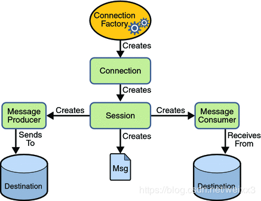

# activeMQ

> 其实就是用java做的一个服务, 然后配备了可视化的前台页面
>
> 遵循了jms的编码架构规范
>
> 所有遵循了规范的落地产品都是按照规范架构来的 , 所以要从规范下手
>
> javaEE 是技术体系 , 也是一整套的开发规范





##### 安装并启动 

###### 普通部署启动

直接下载压缩包解压


普通启动: 在bin下 `./activemq start` , 默认启动在61616端口

验证启动: `ps -ef|grep activemq|grep -v grep` 或者 `netstat -anp|grep 61616`

带运行日志的启动 :  `./activemq start > 输出日志位置.log`

指定配置文件启动: `./activemq start xbean:file:配置文件路径`


重启 : 在bin下 `./activemq restart`

关闭: 在bin下 `./activemq stop` 


访问activemq的前端页面 , 如果访问不到, 检查双方防火墙

> < ip >:8161/admin/  , 同户名/密码 admin/admin
>
> 前台端口为8161, 后台端口为61616


###### 在java程序中使用嵌入式broker启动

1. 导包

    * jackson-databind  2.9.5
    * activemq-all 5.15.9
    * xbean-spring 3.16

2. ```java
    psvm{
        BrokerService bs = new BrokerService();
        bs.setUseJmx(true);
        bs.addConnector("tcp://localhost:61616");
        bs.start();
    }
    ```

    
    
3. 执行即可启动嵌入式的activemq


##### 使用

1. 创建maven工程

2. 引入依赖包

    * activemq-all 5.15.9
    * xbean-spring 3.16

3. 创建消息

    ```java
    private final static String ACTIVEMQ_URL = "activemq地址";
    private final static String QUEUE_NAME = '队列名/主题名';
    
    psvm{
        //创建连接工厂
        ActiveMQConnectionFactory acf = new ActiveMQConnectionFactory(ACTIVEMQ_URL);
        //获取连接对象, 启动连接
       Connection con = acf.createConnection();
        con.start();
        //创建回话
        //*事务
        //*签收
        Session se = con.createSession(false, Session.ACKNOWLEDGE);
        //创建目的地(队列or主题)
        
        //1.创建队列, 要使用jms包里的Queue
        Queue qu = se.createQueue(QUEUE_NAME);
        //2.或者创建主题
        Topic qu = se.createTopic(QUEUE_NAME);
        
        //创建消息生产者
        MessageProducer mp = se.createProducer(qu);
        //发送消息
        mp.send(se.createTextMessage("这是消息"));
        //关闭资源
        mp.close();
        se.close();
        con.close();    
    }
    ```

    

4. 运行以上生产者代码 , 在acmq的前端页面查看发出的消息

5. 创建消费者

    ```java
    private final static String ACTIVEMQ_URL = "activemq地址";
    private final static String QUEUE_NAME = '队列名';
    
    psvm{
        //创建连接工厂
        ActiveMQConnectionFactory acf = new ActiveMQConnectionFactory(ACTIVEMQ_URL);
        //获取连接对象, 启动连接
       Connection con = acf.createConnection();
        con.start();
        //创建回话
        //*事务
        //*签收
        Session se = con.createSession(false, Session.ACKNOWLEDGE);
        //创建目的地(队列or主题)
        
        //1.创建队列, 要使用jms包里的Queue
        Queue qu = se.createQueue(QUEUE_NAME);
        //2.或者创建主题
        Topic qu = se.createTopic(QUEUE_NAME);
        
    	//创建消费者
        MessageConsumer consumer = se.createConsumer(qu);
        
        //1.---------------------------------
        //接收消息 - 使用同步阻塞的receive方式
        while(True){
            TextMessage txMessage = (TextMessage)consumer.receive();
            if(null != txMessage){
                sout("消息为: " + txMessage.getText());
            }else{
                break;
            }
        }
        
        //2.--------------------------------
        //接收消息 - 使用异步非阻塞监听器的方式
        consumer.setMessageListener(new MessageListener{
            @Override
            public void onMessage(Message mes){
                if(null != mes && mes instanceof TextMessage){
                    print('接收到消息为: ' + ((TextMessage)mes).getText());
                }
            }
        });
            //手动阻塞, 保持监听
        System.in.read();
        
        //关闭资源
        consumer.close();
        se.close();
        con.close();
    ```

    > topic : 一对多
    >
    > queue : 一对一


##### 规范及接口

###### JMSMessage

* 消息头
    * JMSDestination 消息发送的目的地
    * JMSDeliveryMode  消息传递模式(是否持久化)
    * JMSExpiration 消息过期时间
    * JMSPriority 消息优先级(0~9, 默认为4)
    * JMSMessageID 消息唯一标识
* 消息体
    * TextMessage
    * MapMessage
    * BytesMessage
    * StreamMessage
    * ObjectMessage
* 消息属性 : 设置自定义的消息属性 , 消息头中是内置的属性
    * textMessage.setStringProperty("键","值");
    * ...各种不同类型的属性设置api


###### 消息可靠性

* 持久化 : 

    * 对于Queue默认开启持久化

    ```java
    //消息持久化设置 DeliveryMode.NON_PERSISTENT | DeliveryMode.PERSISTENT
    messageProducer.setDeliveryMode(DeliveryMode.PERSISTENT);
    ```

    * 对于Topic需要手动开启持久化 , 分为持久化的提供者 和 持久化的消费者, 持久化的消费者拥有ID, 会出现在管理页面中订阅者一览中, 即使订阅者下线 , 当其再次上线时 , 还是会收到未读的订阅消息

* 事务

    * 如需使用事务需要在创建session时设置开启事务 , 那么在使用生产者向队列send消息后 , 还需要调用commit来提交事务 , 在消费者中使用事务即为确认接收到消息

* 签收

    * 在session创建时第二个参数上设置签收方式 , 手动签收适用于消费者
    * 未开事务时, 设置手动签收, 需要手动调用 message.acknowledge()
    * 开启事务时, 如果commit了事务 , 那么无需调用签收函数 , 事务的优先级大于签收


##### 在spring中使用acmq

1. 导包

    * spring 相关包
    * activemq-pool 5.15.9
    * spring-jms 4.3.23

2. 配置applicationContext.xml

    ```xml
    <beans>
        <!--spring的包扫描设置-->
        <context:component-scan base-package="xxx"/>
        
        <!--设置连接工厂-->
        <bean id="jmsFactory" class="org.apache.activemq.pool.PooledConnectionFactory" destroy-method="stop">
            <property name="connectionFactory">
            	<bean class="org.apache.activemq.ActiveMQConnectionFactory">
                	<property name="brokerURL" value="tcp://activemq部署的地址"></property>
                </bean>
            </property>
            <property name="maxProperty" value="100"></property>
        </bean>
        
        <!--设置目的地队列对象-->
        <bean id="destinationQueue" class="org.apache.activemq.command.ActiveMQQueue">
        	<constructor-arg index="0" value="spring-active-queue"/>
        </bean>
        
        <!--设置目的地主题对象-->
        <bean id="destinationTopic" class="org.apache.activemq.command.ActiveMQTopic">
        	<constructor-arg index="0" value="spring-active-topic"/>
        </bean>
        
        <!--设置jms操作对象, 提供发送接收消息的功能-->
        <bean id="jmsTemplate" class="org.springframework.jms.core.JmsTemplate">
            <property name="connectionFactory" ref="jmsFactory"></property>
            <!--如果使用队列,这里引用队列对象, 如果使用主题, 这里引用主题对象-->
            <property name="defaultDestination" ref="destinationQueue"/>
            <property name="messageConverter">
            	<bean                  class="org.springframework.jms.support.converter.SimpleMessageConverter"/>
            </property>
        </bean>
        
    </beans>
    ```

3. 使用容器中的jmsTemplate对象

    ```java
    psvm{
        ApplicationContext ctx = 
            new ClassPathXmlApplicationContext("applicationContext.xml");
        JmsTemplate jmsTemplate = (JmsTemplate)ctx.getBean("jmsTemplate");
        //生产者发送消息
        jmsTemplate.send(new MessageCreator(){
            @Override
            public Message createMessage(Session session){
                return session.createTextMessage("生产了消息...");
            }
        });
        //消费者接收消息
        String res = (String)jmsTemplate.receiveAndConvert();
        sout("接收到消息为 : " + res);
    }
    ```

    在spring中使用监听器的异步非阻塞方式实现消费者

    1. 在applicationContext.xml 中添加配置

        ```xml
        <bean id="jmsContainer" class="org.springframework.jms.listener.DefaultMessageListenerContainer">
        	<property name="connectionFactory" ref="jmsFactory"/>
            <property name="destination" ref="destinationTopic"/>
            <!--因为使用监听器的方式实现消费者需要实现监听器接口,所以这里的ref为自己实现监听器接口类的bean对象-->
            <property name="messageListener" ref="myMessageListener"/>
        </bean>
        ```

    2. 新建监听器实现类

        ```java
        //加入spring容器
        @Component
        class MyMessageListener implements MessageListener{
            @Override
            public void onMessage(Message message){
                if(null != message && message instanceof TextMessage){
                    sout(((TextMessage)message).getText());
                }
            }
        }
        ```

    3. 使用生产者发送消息, 消费者监听器逻辑会自动执行


##### 在springboot中使用acmq

1. 导包

    * springboot相关包
    * spring-boot-starter-activemq 2.1.5

2. 配置application.yml

    ```yml
    server:
      port: 7777
      
    spring:
     activemq:
       broker-url: acmq地址
       user: admin
       password: admin
     jms: 
       pub-sub-domain: false #false => topic模式 , true => queue模式
       
    #自定义的队列名称
    myqueue: acmq-queue
    
    #自定义的主题名称
    mytopic: acmq-topic
    ```

3. 配置生产者的使用的队列队列对象

    1. 配置队列对象到容器中

        ```java
        @Component
        @EnableJms
        public class ConfigBean{
            //使用了application配置文件中的值
            @Value("${myqueue}")
            private String myQueue;
            //将队列对象加入到容器中, 然后使用jmsMessageTemplate对其进行操作
            @Bean
            public Queue queue(){
                return new ActiveMQQueue(myQueue);
            }
        }
        ```

    2. 或者配置主题对象到容器中

        ```java
        @Component
        @EnableJms
        public class ConfigBean{
            //使用了application配置文件中的值
            @Value("${mytopic}")
            private String myTopic;
            //将主题对象加入到容器中, 然后使用jmsMessageTemplate对其进行操作
            @Bean
            public Topic topic(){
                return new ActiveMQTopic(myTopic);
            }
        }
        ```

4. 生产消息/消费消息

    1. 使用JmsMessageTemplate对象生产消息到队列或主题

    ```java
    @Component
    public class Queue_produce{
        @Autowired
        private JmsMessageTemplate jmsMessageTemplate;
        @Autowired
        private Queue queue;
        @Autowired
        private Topic topic;
        
        //调用该方法测试生产队列消息
        public void produceMessageQ(){
            jmsMessageTemplate.convertAndSend(queue, "生产了消息并发送到了指定的队列中");
        }
        
        //调用该方法测试生产主题消息
        public void produceMessageT(){
            jmsMessageTemplate.convertAndSend(topic, "生产了消息并发送到了指定的主题中");
        }
        
        //直接启动主启动类即可开始执行该定时方法 , 测试间隔3秒定时生产
        @Scheduled(fixedDelay = 3000)
        public void schedualProduceMsg(){
            jmsMessageTemplate.convertAndSend(queue, "这是定时生产的内容");
        }
    }
    ```

    2. 消费者消费指定队列或主题(监听方式)

        ```java
        @Component
        public class Queue_Consumer{
            //设置该方法为jms的监听器方法, 监听指定的队列名/主题名
            @JmsListener(destination="${myqueue}")
            public void reveice(TextMessage tm) throws JMSException{
                sout("消费到的消息为 : "+ tm.getText());
            }
        }
        ```

5. 在主启动类上添加开启定时任务功能的注解

    ```java
    @EnableScheduling
    ```

    


##### acmq传输协议

* 默认使用tcp协议 , 即在设置生产者和消费者时, 地址为 tcp://ip:port
* 在 acmq安装目录/conf/activemq.xml  中的 < transportConnectors >标签中可配置传输协议
* 不同的协议性能不同 , 对应的创建连接代码也不同 , 其中使用NIO协议可提高性能

###### tcp

`tcp://ip:port?key=value`

将数据序列化成字节流在网络中传输 , 兼容性好, 稳定性高, 传输速度快

可通过设置参数进行连接设置

###### nio

`nio://ip:port?key=val`

nio使用更加底层的连接方式 , 可同时支持更多的client连接到服务器 , 比tcp性能更高

###### 配置使用nio

1. 在conf/activemq.xml中的transportConnectors节点下添加nio的设置

    ```xml
    <transportConnector name="nio" uri="nio://0.0.0.0:61618?trace=true"/>
    ```

    

2. 将连接acmq服务的地址由 `tcp://ip:61616` 改为 `nio://ip:61618`

###### 配置acmq同时支持nio协议和其他多协议

1. 在conf/activemq.xml中的transportConnectors节点下添加nio+auto的设置

    ```xml
    <transportConnector name="auto+nio" uri="auto+nio://0.0.0.0:61608?maximumConnections=1000&amp;wireFormat.maxFrameSize=104857600&amp;org.apache.activemq.transport.nio.SelectorManager.corePoolSize=20&amp;org.apache.activemq.transport.nio.SelectorManager.maximumPoolSize=50"/>
    ```

    

2. 此时既可以创建tcp类型的连接 , 又可以创建nio类型的连接


##### 消息持久化

* 在 conf/activemq.xml 中的 < persistenceAdapter > 配置持久化

使用levelDB或kahaDB等存储方式将消息存储到另外一台机器上, 当acmq故障后, 可从该机器上恢复消息

###### AMQ Message Store : 

使用文件进行消息存储, 凉了

###### kahaDB :

目前推荐且默认的存储方式

通过记录日志到文件中对消息进行存储 , 通过从索引文件中查找到日志在日志文件中的位置来读取消息 

默认存储文件在 安装目录/data/kahaDB/ 下

其中包含:

* db-< numer >.log : 数据文件
* db.data : 索引文件
* db.free : 记录db.data中的空闲页面
* db.redo : 强制退出又重启后用于恢复db.data的数据
* lock : 文件锁信息

###### JDBC存储机制:

将消息直接存到数据库中 , 可靠性高 , 性能较慢

1. 将mysql的驱动包 和 连接池的包 复制到 安装目录/lib/ 下

2. 配置 activemq.xml 中的 persistenceAdapter标签

    ```xml
    <persistenceAdapter>
    	<jdbcPersistenceAdapter dataSource="#mysql-ds"
                                createTableOnStartup="true"/>
    </persistenceAdapter>
    <!--createTableOnStartup设置是否在启动的时候创建数据表,默认为true,一般是在第一次启动使用true后,之后把true改为false-->
    ```

    

    ```xml
    <!--这一段同样放到activemq.xml中,但是要放在beans标签里面-->
    <!--数据库连接池设置,在上面被引用-->
    <bean id="mysql-ds" class="org.apache.commons.dbcp2.BasicDataSource" destory-method="close">
    	<property name="driverClassName" value="com.mysql.jdbc.Driver"/>
        <property name="url" 
                  value="jdbc:mysql//数据库ip:3306/数据库名?relaxAutoCommit=true"/>
        <property name="username" value="用户名"/>
        <property name="password" value="密码"/>
        <property name="maxTotal" value="200"/>
        <property name="poolPreparedStatements" value="true"/>
    </bean>
    ```

    

3. 在数据库中创建对应的数据库

4. 启动activemq, 会自动在数据库中创建三张表 , ACTIVEMQ_MSGS(队列消息) , ACTIVEMQ_ACKS(订阅消息) , ACTIVEMQ_LOCK(在集群环境下,记录master节点信息)

5. 在代码中开启消息持久化

    ```java
    messageProducer.setDeliveryMode(DeliveryMode.PERSISTENT);
    ```

    

6. 发送消息后在数据库中查看持久化结果

**jdbc message store with activemq journal ( jdbc带缓存的增强 ):**

* 带高速缓存的jdbc存储机制 , 性能比仅用jdbc快

1. 在使用jdbc的基础上 , 修改 activemq.xml 中的 persistenceAdapter为

    ```xml
    <persistenceFactory>
        <journalPersistenceAdapterFactory
                                          journalLogFiles="4"
                                          journalLogFileSize="32768"
                                          useJournal="true"
                                          useQuickJournal="true"
                                          dataSource="#mysql-ds"
                                          dataDirectory="activemq-data"/>
    </persistenceFactory>
    ```

    

2. 重启activemq生效

3. 发送消息查看缓存效果, 即不会立即同步到数据库

###### LevelDB:

比kahaDB更新更快的存储方式 ,同样基于本地文件的存储

在persistenceAdapter节点下配置 `< levelDBdirectory = "activemq-data" >` 使用


##### activemq高可用

* zookeeper + replicated levelDB

* zookeeper和acmq集群都至少包含3个节点

    1. 环境准备

        * zookeeper-3.4.9
        * activemq-5.15.9

    2. 关闭防火墙保证服务机和本机可以ping

    3. 部署zookeeper集群

    4. 部署三台activemq服务器

        * 如果是在同一台机器上开三个acmq, 需要在 安装目录/conf/jetty.xml 中修改后台端口

        * 在linux 中 `vim /etc/hosts` 修改hostname映射

    5. 修改 activemq.xml , 使得三个acmq处于同一个broker中

        ```xml
        <!--修改三个的brokerName为相同-->
        <broker xmlns="..." brokerName="acmqBroker" dataDirectory="...">...</broker>
        ```

        

    6. 修改三个服务 activemq.xml 中的持久化配置为 levelDB 同时使用zookeeper集群
    
    7. 修改三个服务 activemq.xml 中前台端口(连接端口)

    8. 启动zookeeper集群
    
    9. 启动三个acmq服务
    
    10. 让zookeeper连接到acmq集群中的任意一台来连接整个acmq集群
    
        `>./zkCli.sh -server acmq地址:端口`
    
    11. 使用 `>get 在acmq中设置连接到zookeeper上的路径` 查看acmq节点信息
    
    12. 此时代码中获取acmq连接的地址前应当带上 failover(故障迁移) 
    
    13. 测试acmq集群效果


##### 异步投递

> 适合生产者快 , 消费者慢 , 且可以容许消息丢失的情况

> ​		异步投递的意思是, 只管将消息发送出去, 然后不阻塞等待消息发送成功或者失败的结果通知, 而是定义回调函数来处理消息发送结果

* 可以通过在代码中设置连接url参数开启  `tcp://xxxxx:xxxx?jms.useAsyncSend=true`

* 可以调用连接工厂对象的设置方法使用异步 

    `((ActiveMQConnectionFactory)connectionFactory).setUseAsyncSend(true)`

* 可以调用连接对象的设置方法使用异步

    `((ActiveMQConnection)connection).setUseAsyncSend(true)`

> 开启了异步投递之后 , 需要使用 ActiveMQMessageProducer 类型的生产者来发送消息 , 同时需要给消息添加ID来统计发送成功或失败的消息 , 然后在调用send方法时需要添加 <span style='color:cyan;'>回调函数</span> 以确认消息发送成功或失败


##### 延迟投递和定时投递

1. 在activemq.xml的broker标签中设置schedulerSupport="true" 并重启acmq服务

    ```xml
    <broker ... schedulerSupport="true"></broker>
    ```

2. 在代码中设置message的延时或定时或间隔属性

    ```java
    //设置延迟发送
    message.setLongProperty(ScheduledMessage.AMQ_SCHEDULED_DELAY, 3*1000);
    //设置发送间隔
    message.setLongProperty(ScheduledMessage.AMQ_SCHEDULED_PERIOD, 4*1000);
    //设置重复发送次数
    message.setIntProperty(ScheduledMessage.AMQ_SCHEDULED_REPEAT, 5);
    ```

    

##### 消费重试机制

* 该机制下的属性可在代码中进行设置 , 具体属性可在官网查询
* 使用spring的情况下, 可在配置文件中配置 *重发机制对象的bean* 来修改这些属性

> 什么情况下会消息重发?
>
> 1. 消费者使用了事务且调用了rollback()
> 2. 消费者使用了事务且没有调用commit()
> 3. 消费者使用了签收且调用了recover()
>
> 默认的重发间隔和次数?
>
> 间隔: 1s
>
> 次数: 6

###### 有毒消息

> 当一个消息发送到达6次且还发送失败 , 就标记为有毒消息, 并记录在死信队列中, 死信队列同样可在acmq前台页面的queue中查看

###### 死信队列

> 默认只会把持久化的消息放到死信队列, 可通过在配置中配置把非持久的消息也放到死信队列中
>
> 默认所有的队列中出错的消息都会放到一个死信队列中, 同样可通过配置将其放到指定的独立的死信队列中


##### 如何避免重复发送消息

幂等性消息

> ​		如果是拿数据库做持久化 , 应当给消息设置ID , 那么如果是重复插入 , 会因为ID不能重复而插入失败从内容避免重复记录

缓存消费记录

> ​		在消费成功时将消息的唯一标识记录到redis中 , 消费前先去redis中查询将要消费的消息是否存在于redis中 , 如果存在则说明消费过了 

