# JVM

***JVM***

```english
	A JVM implementation is a computer program that meets the requirements of the JVM specification. An instance of a JVM is an implementation running in a process that executes a computer program compiled into Java bytecode.
```

***JRE***

```english
	Java Runtime Environment (JRE) is a software package that contains what is required to run a Java program. It includes a Java Virtual Machine implementation together with an implementation of the Java Class Library. 
```

***JDK***

```
	Java Development Kit (JDK) is a superset of a JRE and contains tools for Java programmers, e.g. a javaccompiler. 
```


>   JVM本质就是一个程序
>
>   用来运行java代码 (不是, 只要能够编译成.class文件的语言代码都可以)
>
>   JVM本质是解析.class字节码指令的程序


#### 内存结构


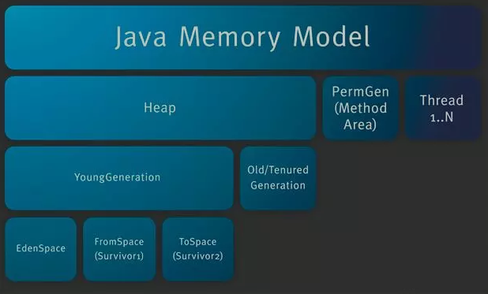


##### 程序计数器(PC Register)

> java源码 --编译--> 二进制字节码(jvm指令) --解释器--> 机器码 ----> cpu执行
>
> 在解释器对 jvm 指令进行翻译时, 程序计数器存放下一条 jvm 指令的位置, 解释器执行完一句jvm指令后 , 会去程序计数器中读取下一条指令的地址.
>
> 程序计数器的本质就是一个寄存器
>
> 程序计数器是线程所私有的 : java支持多线程, 即同时在多个线程中执行不同的代码, 每一个线程都私有地拥有一个程序计数器, 当线程用完cpu分配给它的时间片后, 会将当前程序运行到的位置存到自己私有的程序寄存器中, 待到再次得到执行权, 就从自己的程序计数器中获取到程序运行的位置继续运行.


##### 栈

###### 虚拟机栈(JVM Stacks)

> 程序开启的线程在执行代码时实际上就是在执行一个个的方法, 而这些方法都需要一段内存来存放参数和变量, 虚拟机栈就是用于存放每个方法的参数和变量的一个栈.
>
> 在虚拟机栈中, 每当执行一个方法, 就会生成一个 栈帧 用于存放该方法的参数和变量 , 并将这个 栈帧 放入栈中, 当方法执行完毕后, 这个栈帧就会出栈.
>
> 在栈顶部的 即正在执行的方法, 被称为 活动栈帧
>
> 在 idea 中, 以debug的方式运行代码, 在执行某个方法的调用之前断点, 逐行执行代码 ,会在debug面板中的 Frames 选项卡中查看到 栈帧的入栈和出栈的过程

虚拟机栈的特点

> 垃圾回收不需要管这个栈, 因为它会随之方法的执行自动地入栈和出栈
>
> 可以通过 -Xss< size > 运行参数来设置栈的大小 , idea 中就是运行设置里的 vm options
>
> 栈内存不宜过大, 因为内存总大小就那么大, 栈内存大了, 可以开的线程数就少了, 这样就会影响到运行的效率

栈内存机制涉及的线程安全问题:

> 方法内的变量是线程安全的, 就是如果有多个线程在同时调用这个方法, 那么它们会在各自的栈中创建各自的一份 栈帧, 这些栈帧都是独立的, 所以不会影响到其他栈中的栈帧.  
>
> 但是全局的静态变量是线程不安全的, 因为多个线程每次都要从全局来读取它, 这样就会造成数据的读写混乱.
>
> 如果方法内的变量是引用类型且仅仅在方法内自己玩 , 也就是随着方法的调用结束而被回收, 那么它是线程安全的, 但是如果它的不是仅仅在方法内自己玩, 它就不是线程安全的

栈内存溢出:

> 1. 栈帧过多会导致栈内存溢出 , 例如没有结束条件的递归
> 2. 栈帧过大会导致栈内存溢出


###### 本地方法栈

> 有些与操作系统交互的方法仅靠java无法实现,所以需要调用一些 c 或者 c++ 实现的方法, 这些方法被称为本地方法, 使用 native 修饰 
>
> 本地方法栈就用来提供本地方法运行时所需要的内存空间


##### 堆

###### 对象实例

> 通过new 创建的对象都会放到堆中
>
> 堆中的数据都是线程共享的
>
> 堆中的数据会被gc回收
>
> 可通过运行参数 -Xmx< size > 来设置

堆内存溢出

> 在对象不被回收的情况下, 无限创建对象 会导致堆内存溢出

###### 常量池

> 用于存放java程序编译成为 class 对象后每一步java指令所使用的 值

###### stringtable

> stringtable 就是用来存放字符串常量的
>
> 每当出现一个新的字符串常量时, 就生成一个新的串存到串池里, 下次在使用字符串常量时, 先在串池中查找, 有则直接使用, 没有就创建新的放入stringtable

> 在版本1.6中, 串池( stringtable )位于常量池
>
> 在版本1.6以后, stringtable 位于堆内存中 , 因为堆的垃圾回收更加频繁, 能够减少字符串常量所占的内存

> 在java代码中通过调用 String类型变量的 intern() 方法手动将该String对应的字符串存到 StringTable中, 然后返回该字符串在 stringtable 中的地址
>
> 在 1.6 中, 调用 intern() 方法时, 会复制一份字符串常量存到stringtable中
>
> 在 1.8 中, 调用 intern() 方法时, 直接将该String对象的地址存到stringtable中 

stringtable调优

> stringtable的数据结构是hash表, 即总共有 n 个 bucket, 每一个 bucket中以链表的方式 存放一定hash范围内的数据
>
> 这个总的 bucket 的个数越多, 也就是hash分段越细, 那么在向 stringtable 中添加新的 字符串常量时就越容易找得到它应当被存到哪个 bucket 中, 从而存储效率也就越高.
>
> 所以如果有很多个 字符串常量要存储在 stringtable 中时, 适当的增大 bucket 个数, 能够提高数据存储的效率
>
> 通过运行参数 -XX:StringTableSize=200000 来设置 bucket 的个数

stringtable的应用

> ⭐ 假设有大量的字符串数据, 其中有不少是重复的, 现在要在程序中将它们存储到一个 List 中
>
> 1️⃣ 如果使用 new String 的方式来创建它们, 那么这些字符串会一个不差地被创建为新的 String 对象被存到堆中
>
> 2️⃣ 如果将这些字符串 通过调用 intern() 放入 stringtable 中, 然后将该方法返回的值即它在 stringtable 中地址存到 List 中, 因为 stringtable 不会存重复数据的特性, 所以这就相当于使用了更少的空间存储了更多的数据, 极大地降低了内存的使用 


##### 方法区

> 存放类的字段, 方法 和 运行时常量池
>
> 1.8以前叫 永久代, 1.8以后叫 元空间
>
> 在java1.8及以后, 该区域直接使用物理内存空间, 就是主机的内存
>
> java1.8 以及以后 , 通过运行参数 -XX:MaxMetaspaceSize=8m 来设置大小
>
> java1.8 以前 , 通过运行参数 -XX:MaxPermSize=8m 来设置大小


##### 直接内存

> 这一部分的内存来自物理内存, 不属于分配给 java 程序的内存
>
> 一般用于 nio 读写文件操作时的缓冲区域
>
> 调用 ByteBuffer.allocateDirect(_1GB); 可从操作系统获得对应大小的物理内存
>
> ( 不推荐, 这个方法一般是jdk内部自己调用 )或者调用 Unsafe 类型实例的 allocateMemory(_1Gb) 获取直接内存
>
> 回收时调用 Unsafe 实例的 freeMemory() 方法
>
> ByteBuffer.allocateDirect() 实际上也是调用了 Unsafe 的 allocateMemory() 方法, 然后由 Cleaner 虚引用来监测 ByteBuffer 的状态, 当 ByteBuffer 被回收时, cleaner 调用 freeMemory() 方法实现释放直接内存

> 在运行参数中设置 -XX:+DisableExplicitGC 禁用在代码中显式地调用垃圾回收,即 System.GC() , 这样会造成直接内存不会被释放直到对应的变量被销毁, 此时可以通过调用 unsafe 对象的 freeMemory() 实现对直接内存的回收


#### 垃圾回收

##### 如何判断对象是否可以回收

1. 引用计数法

   ​	就是当对象被引用时计数加一, 失去被引用计数减一, 当引用数为零时, 意味着它可以被回收

   ​	但是如果存在两个对象的相互引用, 那么这两个对象就永远不会被垃圾回收, jvm中不采用此种回收机制

2. 可达性分析算法

   ​	先确定根对象,即GC Root对象, 然后查看目标对象是否被根对象所引用, 如果没有被根引用则可以作为垃圾进行回收

   ​	jvm中使用这种回收机制


##### 四种引用

1. 强引用

   一般在代码中创建的对象都是强引用类型

   通过 new 新建的对象然后通过 = 赋值给一个变量, 这种就被成为强引用, 只要某一对象存在被 gc root 对象强引用, 就不会被垃圾回收

2. 软引用

   在垃圾回收之后仍然内存不足时, 会发起对软引用对象的回收, 在代码中通过 new SoftReference() 来创建软引用对象,

   创建软引用对象时可通过传参指定绑定一个 引用队列, 当软引用对象引用的对象被回收时, 该软引用对象会被加入到 引用队列中, 此时可通过引用队列中的元素来回收指定的软引用对象

3. 弱引用

   在垃圾回收时就会被回收的引用类型, 在代码中通过 new WeakReference() 来创建

   同 软引用 可配合引用队列来实现 对引用对象本身的记录和清理

4. 虚引用

5. 终结器引用

##### 垃圾回收算法

> 三种方法在 jvm 中分不同的情况都有使用

###### 标记清除

先看看对象是否与 GC Root 对象有引用关系 , 如果没有, 那么就把这个对象占用的起始和终止位置记录到空闲内存列表中, 供新对象创建时查询并使用

优点: 快

缺点: 会产生内存碎片

###### 标记整理

先看看对象是否与 GC Root 对象有引用关系 , 如果没有, 那么就把这个对象占用的位置标记为空闲, 然后将内存中其他对象使用这些空闲位置进行紧凑整理, 结果就是没有了内存碎片

优点: 没有内存碎片

缺点: 慢

###### 复制

将整个内存分为两个大小相同的区域 , 分别为 from 和 to, 其中只用 from 来存对象, to 保持为空, 当垃圾回收时, 先根据 GC Root 的引用关系对对象进行是否被回收的标记, 然后将存活的对象都复制到 to 区中, 随后清空 from 区, 最后交换 from 和 to 的名字

优点: 没有内存碎片, 相对标记整理快

缺点: 浪费内存

##### 分代垃圾回收

>  jvm 将内存分为新生代和老年代 , 对新生代进行较频繁的垃圾回收, 对老年代进行不频繁的垃圾回收

新生代包括 伊甸园区, 幸存区from , 幸存区to

***分代垃圾回收的流程***: 

> 新创建的对象保存到 伊甸园区 中

> 伊甸园满了时, 触发 minor gc 垃圾回收, 存活的对象复制到 幸存区 from 中, 并且标记它的寿命加一 , 然后清空伊甸园

> 依次循环, 当一个对象在寿命大于默认阈值 15 或 新生代内存确实不够 时, 将其转移到 老年代 中

> 当老年代满了时 , 触发对整个内存的 full gc 垃圾回收 , 本次回收完后, 如果发现内存还是不够, 那么会抛异常 outofmemory

> gc时, 为防数据混乱, 会暂停其他线程只运行垃圾回收这个线程

> 对于大小超过了新生代总容量的对象, 如果老年代能存下, 直接存到老年代中

> 子线程内发生的内存溢出不会影响主线程的正常运行

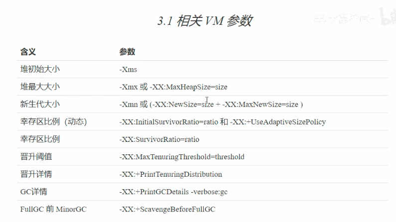


##### 垃圾回收器的种类

###### 串行垃圾回收器

> 通过设置虚拟机参数启用 -XX:+UseSerialGC=Serial+SerialOld

* 单线程执行垃圾回收任务
* 适合堆内存较小时的情况, 就一个线程在这干活, 堆内存太大了得回收很长时间, 适合单核的cpu, 因为单核cpu只能开一个线程

如果在多核机器上使用了串行垃圾回收器, 那么流程如下:

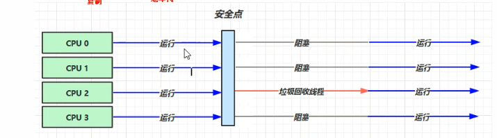

###### 吞吐量优先回收器

> 通过设置虚拟机参数启用 -XX:+UseParallelGC 开启该回收器 , 在 jdk1.8中默认使用这个
>
> 通过设置参数设置使用的线程数: -XX:ParallelGCThreads=n

* 多线程执行垃圾回收
* 适合多核cpu , 因为只有多核才能真正开多个线程, 从而提高效率
* 策略是让单位时间内, 执行垃圾回收时其他线程停止的时间尽量短, 从全局考虑问题

垃圾回收时的流程:

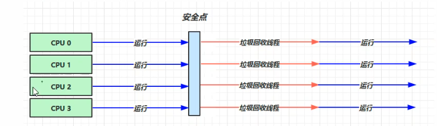

###### 响应时间优先回收器

> 通过设置参数开启该回收器 -XX:+UseConcMarkSweepGC

* 多线程执行垃圾回收
* 适合多核cpu
* 策略是让单次垃圾回收时, 其他线程停止的时间尽量短, 仅着眼于眼前考虑问题

垃圾回收的流程:

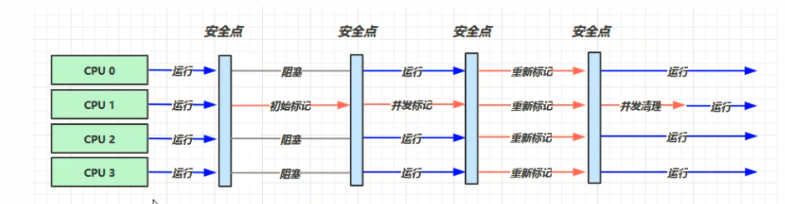

###### G1 垃圾回收器

> 一种同时注重吞吐量和低延迟的回收器
>
> 在 jdk9 及之后为默认的垃圾回收器
>
> 通过设置参数 -XX:+UseG1GC 使用该垃圾回收器


#### 类加载

> 首先将 java 文本文件编译成 class 文件

###### class文件的结构

> 详情可查看 oracle 官方 jvm规范

> class 文件的结构应当遵循 jvm 规范, class文件使用十六进制表示
>
> class 文件中各个位置的数据代表含义如下
>
> 其中 u4, u2 代表4个字节和2个字节(一个字节是二进制八位, 这里是十六进制, 所以一个字节就是一对挨着的数字)

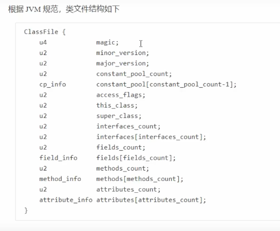

> class 文件的前四个字节 : 魔数 , 用来表示它是否是 class 类型的文件 , 不同的 魔数 代表不同类型的文件, class 文件的 魔数 是 cafe babe

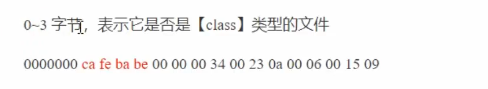

> 接下来四个字节是 版本号


> 常量个数

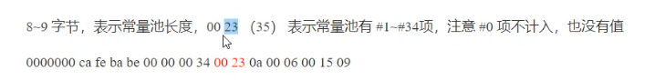

> 接下来就是各个常量的具体数据

> 其中每一个常量的前两位代表该常量的类型, 对应关系如下表
>
> 常量的存储格式 : 常量类型(一个字节) + 常量长度(两个字节) + 常量数据(常量长度值的字节数)

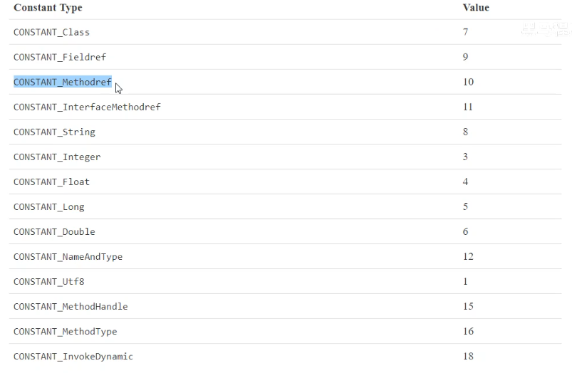

> 例如

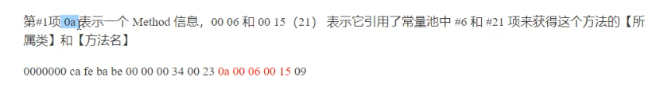

> 访问标识
>
> 访问标识对应关系如下表

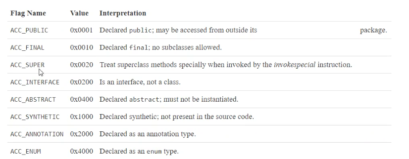

> field成员变量
>
> 成员变量类型对应如下表

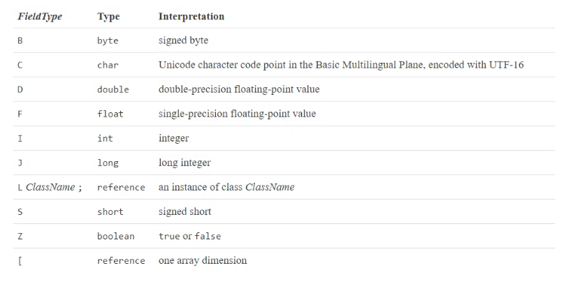

###### 反编译 class 文件

>   使用javap 反编译 class 文件

```
// -v 代表同时编译常量池信息
# javap -v xxx.class
// 接下来会显示该 class 文件的结构信息
```

###### 指令集方法执行流程

> 字节码文件中的 字节码指令 对应一套 指令集 , 这套指令集只是为了方便人们理解的一种表示方式

1. 将常量池的内容加载到 运行时常量池中

2. 将用到的类加载到 堆内存 中

3. 将方法代码转换成为 指令集, 加载到 方法区

4. 开始执行方法时, 执行引擎创建一个 帧栈 来执行该方法, 每一层方法的调用都会为其创建一个帧栈 

   该帧栈包括 :

   参数槽 : 用来存放参数和变量 , 其个数事先根据方法计算得出

   操作栈 : 用来执行数据的操作 , 先将数据加载到操作栈中, 然后在其中进行运算

5. 参数和变量保存到 参数槽 中, 进行运算时就把数据加载到 操作栈中 进行操作

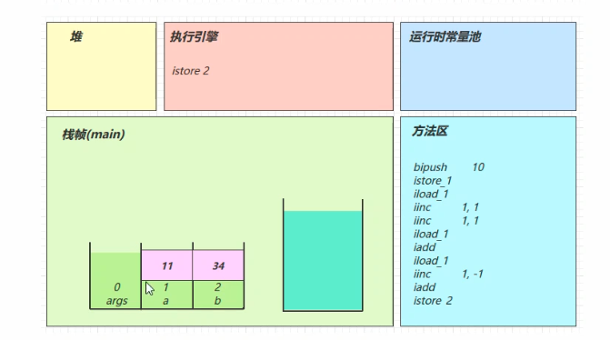

> 关于 ++ 操作:
>
> ++ 操作是可以直接在参数槽上执行的指令
>
> a++ 和 ++a 的本质区别在于, 是先将数据加载到操作栈中然后再在参数槽上自增 , 还是先在参数槽上自增然后再加载到操作栈中

> 条件判断指令 和 循环控制指令 :
>
> 本质上是先使用判断指令得到结果, 然后使用 goto 指令跳转到代码的指定行
>
> while 和 for 的字节码指令实际上一模一样

###### cinit初始化

> 编译器会将代码中的静态代码部分整合为一个方法, 这个方法被称为 cinit 方法, 在执行常规的方法代码前执行该方法

###### init初始化

> 在类的初始化时, 会首先将类内的 {} 代码块和对成员变量的赋值整合成一个方法, 这个方法被称为 init 方法, init 方法会在 类的构造方法 之前调用

###### try/catch/finally 的实现

> 带有 try/catch 的代码会在编译后生成一个 exception table ,用于记录那些行的执行结果需要被监控是否出现了指定的异常, 有则 goto 跳转到 catch代码块编译后的指令行

> finally 实际上是在编译过程中, 将 finally 代码块中的内容复制了三份分别放到了 try 代码块后面, catch 代码块后面 , catch 为捕获类型的异常代码后面

> 如果在 finally 代码块中包含了 return 语句, 那么编译为字节码指令后将不会生成 athrow 指令(抛异常), 同时使用 finally中的return作为返回标准, 即使 try 中也包含 return语句, 所以***不要***在finally 代码中写 return 语句, 会导致异常被吞掉

#### 类加载器

###### 类加载器做什么?

​	JVM运行class文件, 需要先将其中的类加载到方法区, 之后才能在运行代码时找到这些类然后创建实例, 类加载器就是将class文件中的类读取到方法区.

###### JVM自带的类加载器?

​	JVM里面自带了 Bootstrap ClassLoader , Extention ClassLoader, Application ClassLoader, 用来加载java核心类, java扩展类, 自定义引用的第三方类, 它们自右向左依次继承, JVM在运行之初, 就把这些类加载到了方法区

###### JVM类加载器的逻辑?

​	JVM 的类加载机制: 首先获取到指定的类加载器, 然后交给其父类加载器处理, 一直向上, 直至到达最基础的 Bootstrap ClassLoader , 如果某个父加载器无法加载, 就使用当前类加载器加载, 所以类加载器实际上就是一段代码, 大致逻辑就是通过io流读取class文件, 然后将读取到的字节流转换为类的定义, 然后将类定义放到方法区.

###### 自定义类加载器的作用?

1.  同时加载同一个类的多个版本

​	但是, 如果要同时加载多个相同的类, 那就无法实现, 因为它们的全限定类名相同, 而且类加载器相同, 所以在加载的时候一看两个一样, 那么就只会加载一个 

​	如果想要同时加载多个全限定类名相同的类, 可以使用自定义的类加载器来加载, 因为JVM判断两个要加载的类是否完全相同的依据是 `全限定类名+使用什么类加载器加载` , 所以使用不同的类加载器加载, 就可以实现同时加载多个完全相同的类

​	这在大型项目中很有用处, 因为多个第三方可能同时依赖了同一个包的多个不同版本, 如果直接使用 JVM的默认类加载, 那么这些类不能同时加载, 就可能出现 `NoSuchMethod` 错误

2.  热加载

​    每当业务代码中的类更新时, 就需要对内存中业务代码部分进行更新吧? 此时就需要调用它的类加载器更新内存上的对应部分

​	如果使用默认的类加载器, 那么会将整个项目都重新加载一次, 而业务代码往往在项目中占比是很小的, 因为很小的改动就需要重新加载整个项目到内存上, 这无疑是在浪费时间 

​	高效的做法是使用自定义的类加载器, 在其中只加载业务代码部分, 然后在项目启动时开一个线程, 监听业务代码的改动, 每当业务代码有改变时, 就执行自定义的类加载器只更新内存中业务代码部分, 这样就省去了大量时间, 也就实现了热加载.

3.  给class文件加密

​    通常情况下, 因为从 .java 文件到 .class 文件都遵守严格的 jvm 规则, 那么也可以根据这个规则, 从 .class 反编译得到 .java 文件 

​	如果不想让别人得到源码, 就需要对 .class 进行加密, 但是 jvm显然是不能识别加密后的 .class 文件的, 因此可以先把 .class 根据自己的规则加密, 然后使用自定义的类加载器, 在加载 .class的时候先对其进行解密, 然后就可以将解密后的类加载到内存中.


几种类型的类加载器

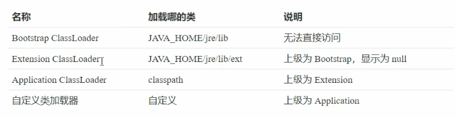


#### 线程安全

线程安全问题可以通过 synchronized 和 CAS技术 来实现

###### synchronized 

> 实际上就是使用一个对象将其标记为锁对象, 然后执行目标加锁代码, 这要求多个线程同时使用同一个对象作为锁对象
>
> 该方法的实现的思想为 悲观锁, 即我来了就把对象锁住, 其他人不能访问,我走之后别人才能访问

###### CAS

> 实际上就是多次尝试, 每次执行完操作后都对原值进行检查, 如果检查后发现原值和实际值不相同, 那就说明在我操作的过程中别的线程对该数据进行了操作, 那么此时就重新再操作一次, 直至检查后发现原值和实际值相同, 才把操作结果返回. 
>
> 该方法的思想为 乐观锁, 即我不断尝试进行操作, 如果别人把原来的值改了, 那我就重新再做一次. 
>
> CAS是无锁的线程安全的操作, 能够提高程序运行的效率

