##### k8s简介

​		k8s本质是一个 docker 容器管理工具，通过 k8s 实现对 docker 容器的高效管理

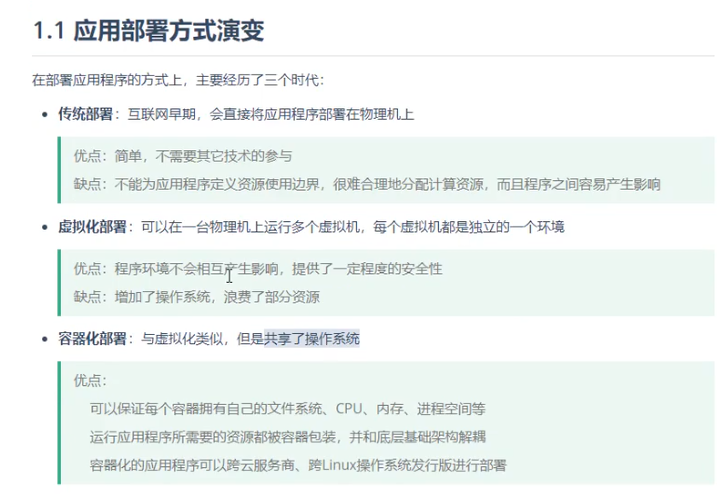

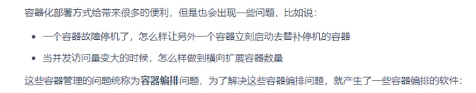

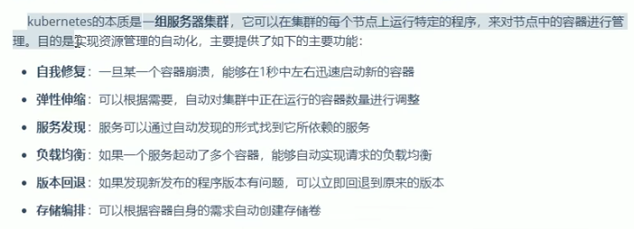

##### k8s组件

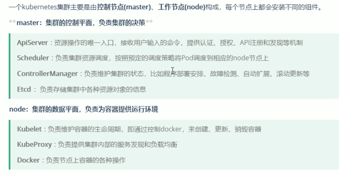

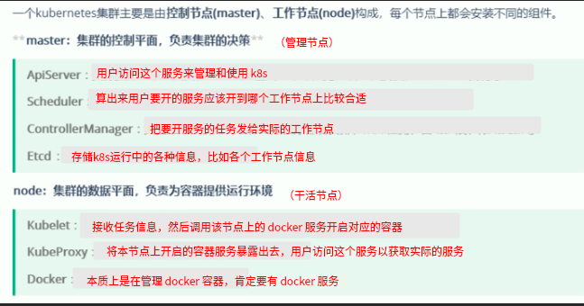

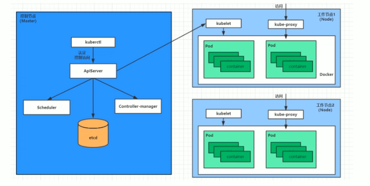

##### k8s概念

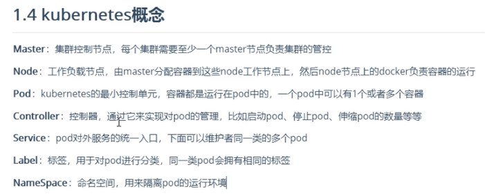

##### 集群搭建

k8s 本身就是一个集群，至少有一个 **管理节点**，一个 **工作节点**

搭建方式可以是 <del>一主多从</del> 或者 **多主多从** 

(一主多从只有一个管理节点，不稳定不适合生产环境)

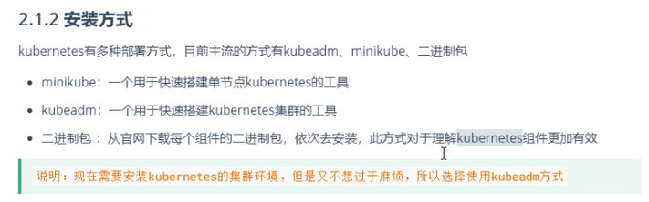

##### 资源管理

在k8s中，所有的内容都抽象为资源，用户通过操作资源来管理k8s

docker 容器跑在 pod 中，pod是 k8s 中对 docker 容器的封装，也是最小管理单位

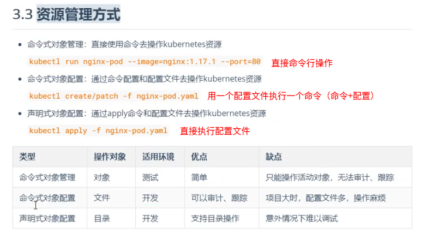

*   命令行操作

    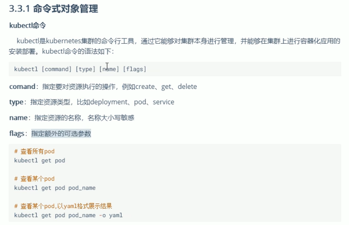

*   命令+配置文件（在配置文件中定义资源）

    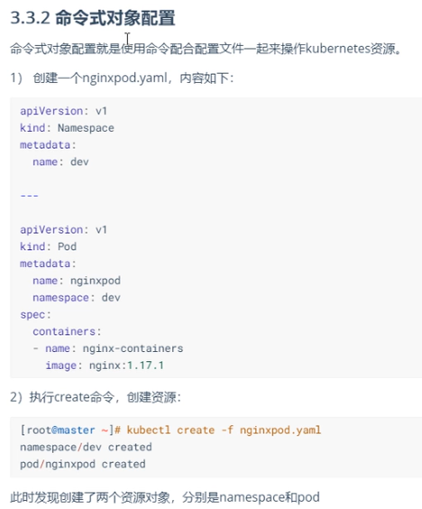

*   声明式管理（使用 apply 命令，应用资源配置文件为最终状态）

    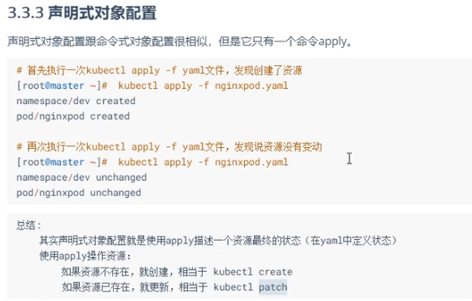

实践建议

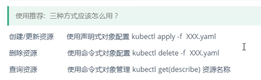

如果想在 ***工作节点*** 上执行资源管理

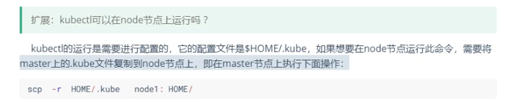

###### namespace

​		逻辑上定义的组，实现资源和访问的隔离，可以给不同的用户授权不同 namespace 的访问权限

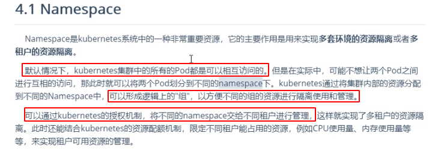

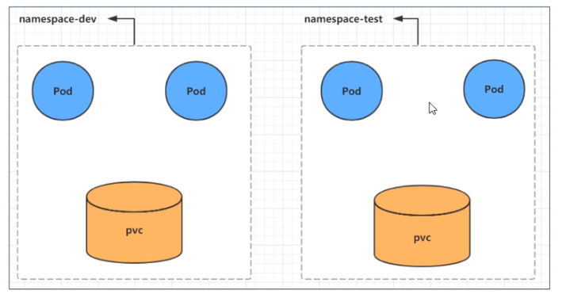

默认创建的几个 namespace

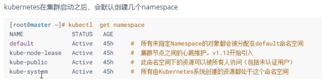

