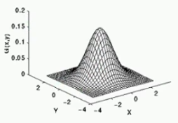

openCV


###### 色彩范围提取

  

> 原理为先将 RGB 转换为 HSV , 然后使用 cv.inRange 函数根据目标色彩的三通道范围值对原数据进行筛选, 最后将筛选结果显示

```python
import cv2 as cv
import numpy as np

# 读取图片
img = cv.imread("./yang.jpg")
# RGB转换为HSV格式
hsv_img = cv.cvtColor(img, cv.COLOR_RGB2HSV)
# 使用筛选函数对目标颜色进行筛选, 值范围上下限参照表格
img_hsv_filter = cv.inRange(hsv_img, np.array([11, 43, 46]), np.array([25, 255, 255]))
# 显示颜色筛选后的图片
cv.imshow('yang', img_hsv_filter)
# 阻塞等待
cv.waitKey(0)
cv.destroyAllWindows()
```


###### 像素运算api

```python
# 读取图片, 要保证两张参与运算的图片的shape相同
img1 = cv.imread("./imgs/LinuxLogo.jpg")
img2 = cv.imread("./imgs/WindowsLogo.jpg")
# 像素运算, + - * /
res = cv.add(img1, img2)
res = cv.divide(img1, img2)
res = cv.multiply(img1, img2)
res = cv.subtract(img1, img2)
# 逻辑运算
res = cv.bitwise_and(img1, img2)  # 逻辑与
res = cv.bitwise_or(img1, img2)  # 逻辑或
res = cv.bitwise_not(img1)  # 逻辑非
res = cv.bitwise_xor(img1, img2)  # 逻辑异或
# 显示结果
cv.imshow("result", res)
# 阻塞等待
key = cv.waitKey(0)
if key == 27:
    cv.destroyAllWindows()
```


###### 调亮度和对比度

```python
def contrast_bright_adjust(img, c, b):
    h, w, ch = img.shape
    blank = np.zeros([h, w, ch], img.dtype)
    dst = cv.addWeighted(img, c, blank, 1 - c, b)
    return dst


# 读取待调整亮度和对比度的图片
lena = cv.imread("./imgs/lena.jpg")
cv.imshow("origin", lena)
# 调整图片亮度和对比度
res = contrast_bright_adjust(lena, 1.5, 0)
cv.imshow("contrast_bright_result", res)
# 阻塞等待
cv.waitKey(0)
cv.destroyAllWindows()
```


###### 泛洪填充

```python
def fill_color(img):
    copyImg = img.copy()
    h, w = img.shape[:2]
    mask = np.zeros([h + 2, w + 2], np.uint8)
    # 泛洪填充
    cv.floodFill(copyImg, mask,
                 (100, 100), (0, 0, 255),
                 (50, 50, 50), (50, 50, 50),
                 cv.FLOODFILL_FIXED_RANGE)
    cv.imshow("fill result", copyImg)


# 读取待调整亮度和对比度的图片
lena = cv.imread("./imgs/lena.jpg")
cv.imshow("origin", lena)
# 泛洪填充, 相当于油漆桶工具
fill_color(lena)
# 阻塞等待
cv.waitKey(0)
cv.destroyAllWindows()
```


###### 模糊

> 模糊的本质是像素数据卷积
>
> 高斯模糊使用这样的卷积核

```python
# 读取图片
lena = cv.imread("./imgs/lena.jpg")
cv.imshow("origin", lena)
# 均值模糊, 根据自定大小且全为1的卷积核进行卷积
res = cv.blur(lena, (15, 1))
cv.imshow("res", res)
# 中值模糊, 适合去除椒盐噪声
res = cv.medianBlur(lena, 5)
cv.imshow("res", res)
# 自定义模糊, 根据自定义数值且自定义大小的卷积核进行卷积
# 该卷积核为锐化
k = np.array([[0, -1, 0], [-1, 5, -1], [0, -1, 0]])
res = cv.filter2D(lena, -1, kernel=k)
cv.imshow("res", res)
# 阻塞等待
cv.waitKey(0)
cv.destroyAllWindows()
```


