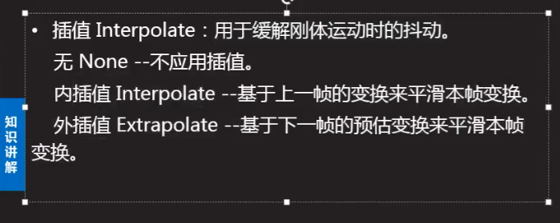
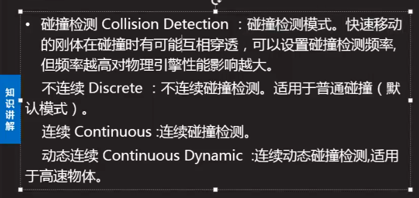
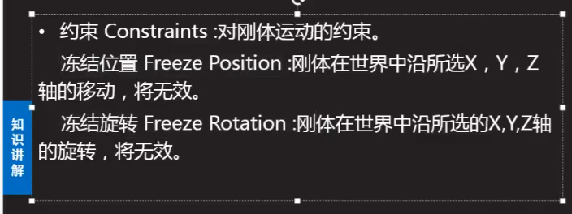
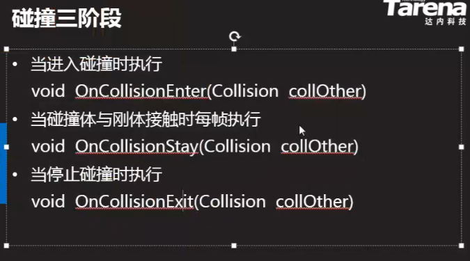
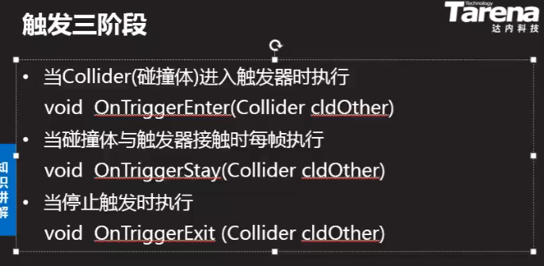

##### Debug

Debug.DrawLine() 画线, 得在update中调用

Debug.print()  在unity编辑器的控制台中打印


##### Time

`Tiem.time` 从游戏开始运行到现在的时长

`Time.deltaTime` 上一帧的渲染时间, 如果是做动作要乘该值保证不同帧率下的运动速率是相同的


##### Input

使用` Input.GetMouseDown() `和` Input.GetKey() `来判断输入


##### InputManager

> 菜单栏 -> edit -> project settings -> input manager
>
> 每一个虚拟按钮的name都可以修改, 在脚本中通过该 name 来访问该虚拟按钮
>
> 每一个虚拟按钮能绑定四个真实按钮, 包括两个正向, 两个负向
>
> sensitivity 设置按钮的灵敏度
>
> gravity 设置按钮的弹回速度

在该面板中绑定虚拟按钮和真实按钮,  在程序中始终使用虚拟按钮的name来获取输入事件, 就能使即使真实按钮需要改变, 也无需改代码

在脚本中使用` Input.GetButton("虚拟按钮的name") `即可获取其绑定的真实按钮是否被按下

在脚本中使用` Input.GetAxis("虚拟按钮的name") `获取其绑定的真实按钮在轴向上的移动距离

> 如果要捕获鼠标移动事件, 使用虚拟按钮 `Mouse X` 和 `Mouse Y`

```c#
//获取鼠标 x 和 y 方向上的移动距离
x_offset = Input.GetAxis("Mouse X");
y_offset = Input.GetAxis("Mouse Y");
//沿y旋转, 应当以自身坐标系为参照
transform.Rotate(-y_offset * Time.deltaTime * speed, 0, 0);
//沿x旋转, 应当以世界坐标系为参照
transform.Rotate(0, x_offset * Time.deltaTime * speed, 0, Space.World);
```


##### Vector3

`Vector3.Distance( v1, v2 )` 两点间距

`ins.magnitude` 向量模长

`ins.normalized ` 返回向量归一化后结果

`Vector3.Angle( v1, v2 )` 返回两个向量的夹角, 内部实现为点乘, 直接使用此api更简单

`Vector3.orthoNormalize( a,b,c )` 先将a归一, 然后将三维空间中 垂直于 a 的两条单位向量赋值给 b 和 c 

`Vector3.Project( a,b )` 返回 向量a 在 向量b 上的 投影向量

`Vector3.ProjectOnPlane( a,b )` 返回 向量a 在 垂直于向量b的面 上的投影向量

`Vector3.Reflect( a,b )` 返回以b为法线, a 为入射向量 的 反射向量

`Vector3.MoveTowards( a,b,v )` 以 v 为速度匀速返回从 a 到 b 的过程中的位置 , 将此返回值赋给物体的 position 就是匀速移动

`Vector3.Lerp( a,b,p )` 每次返回当前 a 和 b 的距离中 p% 的长度, 

如果 a 设置为物体的position , a b 间距不断减小, 那么每次返回的值会逐渐减小, 将其赋值给物体的position则为减速运动, 注意永远无法使得物体到达终点, 应当判断物体距离终点小于某个值时, 就认为已经到达终点, 结束移动

如果想要自定义运动速率曲线, 添加 `public AnimationCurve acv` 属性, 在编辑器中自定义该属性曲线 , 然后在 Lerp 中使用该曲线

```c#
//定义x为曲线的x
float x = 0;
//在要更新运动的地方更新x
x += Time.deltaTime;
//使用x获取曲线对应的y
Vector3.Lerp(Vector3.zero, target, acv.Evaluate(x));
```

Lerp方法在使用自定义曲线时 y 值最多为1, 也就是无法超过终点, 如果想要超过终点, 使用 LerpUnclamped方法


###### 向量点乘

假设

向量1 `(x1, y1, z1)` ; 向量2 `(x2 , y2 , z2)`

那么

向量1 点乘 向量2  :  `x1x2 + y1y2 + z1z2`

同时

点乘等于 : ` |向量1| * |向量2| * cos<向量1, 向量2>`

因此

可以通过点乘结果除以 `|向量1| * |向量2|` 求得 `cos<向量1, 向量2>`

如果

`|向量1|` 和 `|向量2|` 都为1, 即两个向量膜长都为 1

那么

两个向量的点乘结果直接等于 `cos<向量1, 向量2>`

然后

通过 arccos 求得两个向量的角度

在unity中提供点乘 api `Vector3.Dot( v1, v2 )` , 然后可利用 `Mathf.Acos( x )` 来求得两个向量的夹角

但是

`Dot方法` 返回的总是小于180°夹角的 cos 值, 也就是无法区分两个向量的先后顺序, 此时可以结合叉乘来判断两个向量的顺序 


###### 向量叉乘

假设

有 a , b 两个向量

那么

a, b 叉乘, 返回一个垂直于 ab 组成平面 , 且长度为 |a| * |b| * sin<a,b> 的向量

此时

如果 a 在 b 的象限正方向上, 那么叉乘结果向量方向向上 , 反之则结果方向向下

在 unity 中

提供 `Vector3.Cross( v1, v2 )` 计算两个向量的叉乘结果


###### 欧拉角

使用 三个数分别 表示物体沿 x , y , z 轴旋转的角度, 其中 x , z 以自身轴为参照 , y 以世界轴为参照

在unity editor编辑器中物体的 rotation 属性设置的就是欧拉角的三个数

在脚本中通过 `this.transform.eulerRotation` 获取欧拉角的三个数

但是当物体沿 x 轴 或 z 轴旋转 90°时, 此时无论是沿着 z 轴 还是 x轴 旋转, 效果都等同于沿 y轴旋转, 这种现象为 万向节死锁


###### 四元数

使用四个数 x,y,z,w 来表示物体的旋转

前三个数为旋转轴的三个向量分量, 最后一个数为沿该轴旋转的角度

该方法能够避免欧拉角带来的 万向节死锁 问题

`this.transform.rotation` 的值为四元数

在脚本中使用 `this.transform.rotaion = Quaternion.Euler(x轴旋转角度, y轴旋转角度, z轴旋转角度)`  通过给定欧拉角的方式来简化四元数的设置

如果要在当前基础上累加旋转 , 使用 *= `this.transform.rotation *= Quaternion.Euler(1,0,0)`

当然可以直接使用封装好的 `Rotate()` 方法 , `this.transform.Rotate(1,0,0)`

* <span style="color:cyan;">四元数左乘向量, 表示将该向量按照四元数表示的角度旋转</span>
* <span style="color:cyan;">两个四元数相乘, 表示组合两个四元数表示的旋转角度</span>

`ins.eulerAngles` 返回四元数对应的欧拉角

`Quaternion.AngleAxis( angle, axis )` 返回按照 axis 旋转 angle 的四元数

`Quaternion.LookRotaion( v )`  返回仅 z轴 指向 向量v 的四元数

`Quaternion.RotateTowards( q1, q2, p )`  同理Vector3的MoveTowards方法, 固定间隔返回从旋转起点到终点之间的每个四元数

`Quaternion.Lerp( q1, q2, p )` 同理Vector3的Lerp方法, 每次返回从 四元数q1 到 四元数q2 之间p%的值 , 将此值持续设置给物体的 rotation属性则为逐渐改变角度

因为 Lerp 旋转无法使得旋转角度完全等于目标角度, 所以应当使用 `Quaternion.Angle( q1,q2 )` 来获取当前两个四元数代表角度之间的差值


坐标系统

* local space	物体自身坐标
* world space    世界坐标
* screen space    屏幕坐标, 左下角为0,0, 使用屏幕像素值
* viewpoint space   视口坐标, 左下角为0,0, 使用0~1的比例值


local space <--> world space

`transform.forward` 物体在世界坐标中z轴正方向加1的坐标值

`transform.up` 物体在世界坐标中y轴正方向加1的坐标值

`transform.right` 物体在世界坐标中x轴正方向加1的坐标值


`transform.TransformPoint()` 返回对应的世界坐标, 受自身位置, 旋转和缩放的影响

`transform.TransformDirection()` 返回对应的世界坐标, 仅仅受自身旋转的影响

`transform.TransformVector()` 返回对应的世界坐标, 仅仅受自身旋转和缩放的影响


`transform.InverseTransformPoint()` 返回对应的自身坐标, 受自身位置, 旋转和缩放的影响

`transform.InverseTransformDirection()` 返回对应的自身坐标, 仅仅受自身旋转的影响

`transform.InverseTransformVector()` 返回对应的自身坐标, 仅仅受自身旋转和缩放的影响


world space <---> screen space

`Camera.main.WorldToScreenPoint` 

`Camera.main.ScreenToWorldPoint` 

`Screen.width` 屏幕宽度


##### 物理引擎

> 用于模拟真实世界中的重力, 摩擦力, 质量, 势能等相关因素

###### rigidbody

> 刚体组件, 加上该组件, 物体便有了重力, 摩擦力 和 质量

> 带着 rigidbody 的物体在运动时会时刻被物理引擎监测是否与其他物体发生碰撞, 此时会与其他带着碰撞器的物体发生碰撞









###### xxx collider

> 碰撞器, 单有刚体的物体会自由落体, 但不能与其他物体产生碰撞, 此时应当给其加上 xxx collider 使其具有碰撞面

> 不同的 collider 只不过是碰撞模型的不同, 其中 Mesh collider 的碰撞模型完全同该物体的 mesh renderer , 这种碰撞模型效果最好,但是最消耗性能, 所以在使用该碰撞模型时, 必须勾选  `canvex` 即使用大致拟合其真实 mesh 网格的碰撞模型, 才能在运行时产生真实的碰撞效果



只有发起碰撞的物体带着 刚体 才会被物理引擎所管理并触发以上方法

如果在碰撞器中勾选了 is trigger 属性 , 那么该碰撞器为触发器, 带有触发器的物体与其他物体接触时不会产生碰撞效果, 同时触发以下三个方法

触发器适用于子弹击中物体, 此时双方都不应当被弹开, 而是执行掉血等操作

触发需要满足的三个条件:

* 两个物体都有碰撞器
* 两个物体之一有刚体
* 两个物体之一 is trigger




###### 射线检测碰撞

> 碰撞检测会在每次 update 时执行, 但是如果物体移动速度过快, 就会上一帧在目标前面, 下一帧在目标后面, 从而使得碰撞检测失效, 此时应当使用射线检测的方式

> 此方式适用于子弹击中物体的检测

```C#
//挂给子弹的脚本
public class bullet : MonoBehaviour
{
    //选择射线能看到哪些layer
    public LayerMask layerMask;
    //设置物体移动速度
    public float speed;
    //射线检测到碰撞时的碰撞信息
    RaycastHit hitInfo;

    void Start()
    {
        //先整一个射线
        if (Physics.Raycast(this.transform.position, transform.forward, out hitInfo, 100f, layerMask))
        {
            //如果检测到射线上发生了碰撞
            print("接触到: " + hitInfo.collider.gameObject.name);
            Destroy(this.gameObject);
        }
    }

    void Update()
    {
        //然后物体照常运动
        this.transform.position = Vector3.MoveTowards(transform.position, transform.forward * 500f, Time.deltaTime * speed);
    }
}

```

