###### [语义化标签](https://segmentfault.com/a/1190000013901244)

*   nav
*   header
*   footer
*   aside
*   section
*   article
*   main
*   cite


###### [input标签类型](https://blog.csdn.net/qq_36171618/article/details/80802588)

*   text
*   password
*   number
*   range
*   time
*   date
*   color
*   sumbit
*   reset
*   button
*   radio
*   checkbox
*   file
*   image


###### [伪类和伪元素](https://www.jianshu.com/p/c7dcb3008e5c)

伪类：根据类名选择已有元素，使用方法为 `选择器:伪类名` ，通常使用到的有 hover，active，visited，focus，first-child，last-child，n-child(odd)，n-child(even)，n-child(n)

伪元素：选择不存在的元素，使用方法为 `选择器::伪元素名` ，通常使用到的有 `before` 和 `after`，一定要给定 content 属性值，哪怕是 `''` , 否则伪元素不会显示


###### [元素水平垂直居中](https://www.cnblogs.com/linsinan/p/6132241.html)

*   父 relative，子absolute，left，right，top，bottom 0, margin auto
*   父 relative，子absolute，top，left 50%, margin-left，margin-top -元素一半的宽高
*   父 relative，子absolute，top，left 50%, translate：transform(-50%,-50%)
*   父 flex，jcc，aic
*   父 text-align：center


###### [position属性值](https://blog.csdn.net/weixin_44589540/article/details/115400664)

*   relative：不脱离文档流，在原先位置上调整
*   absolute：脱离文档流，绝对定位于第一个 relative 的父元素
*   fixed：固定于屏幕某位置
*   striky：未超出屏幕时表现为 relative，超过屏幕时 fixed
*   static：默认行为


###### [css选择器](https://blog.csdn.net/lucky541788/article/details/81625347)

*   ID选择器    `#xxx`
*   类选择器    `.xxx`
*   后代选择器   ` 选择器1  选择器2`
*   儿子选择器  `选择器1>选择器2`
*   并集选择器    
*   交集选择器    `选择器1, 选择器2, 选择器3`
*   标签选择器    `元素标签`
*   属性选择器    `[属性]`
*   属性值选择器    `[属性=值]`


###### [回流和重绘](https://www.cnblogs.com/youguo2/p/10933043.html)

*   回流：文档流的渲染排版发生变化时，从发生改变的地方开始重新排列文档流，例如，元素大小改变，增加删除元素，替换元素
*   重绘：文档流的排版并不会改变，只是其中某些元素的外观发生变化，仅仅对该元素进行重新绘制，例如改变颜色，改变字体，改变文字


###### [Js数据类型](https://www.runoob.com/js/js-datatypes.html)

**值类型(基本类型)**

​		字符串（String）、数字(Number)、布尔(Boolean)、空（Null）、未定义（Undefined）、Symbol

**引用数据类型**

​		对象(Object)、数组(Array)、函数(Function)


###### [null和undifined区别](https://www.cnblogs.com/shengmo/p/8671803.html)

null可以看做是一个对象，用来表示空值

undefined 直接就是没有赋值


###### [Symbol](https://www.runoob.com/w3cnote/es6-symbol.html)


###### [Js原型](https://www.jianshu.com/p/72156bc03ac1)		

​		在js中，本质上类都是函数，通过在函数中设置 this 的属性值来完成对类实例的初始化，最后返回包含这些属性值的新的对象实例，通过 new 关键字调用函数来获得对象实例

​		所有的函数都有一个属性 prototype，即类原型，在该对象上添加的属性和方法，将会默认作为该函数创建出来对象的属性和方法，也就是说，prototype 可以看做这个类的父类，该类从中继承了全部内容

​	


###### constructor(通用属性)

在js中, 每个实例, 函数, 对象, 数组都对应一个 constructor 函数, 通过这个 constructor 函数来创建它

任何对象, 函数都有构造函数, 如下图

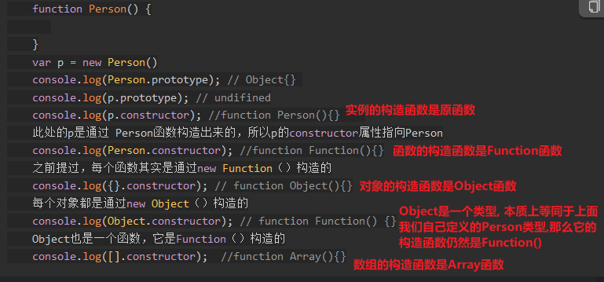

因为 Object 类型本质就是 `function Object(){}`, 它是由 `function Function(){}`构造出来的, 所以 Object 类型是 Function 类型的实例; 所以有

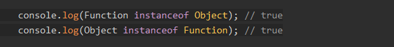


###### \__proto__(实例属性)

每个对象实例都有一个属性 \__proto\__, 返回的是该对象的原型类实例, 原型类就是父类

所有的类都由 Object 类型逐级向下继承

这里的 *\_proto_* 属性返回的就是当前实例类型的父类实例


###### prototype(静态属性)

对于每个类型, 都存在原型类(父类)

使用 *类型.prototype* 获得其父类实例

对于一个类型的 prototype 和 其实例的 *\__proto__*, 它们是相等的, 因为都是其父类型的实例

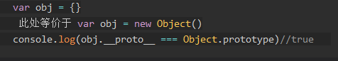

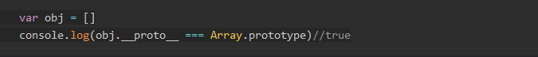


###### [Js new的真相](https://www.cnblogs.com/echolun/p/10903290.html)

​		表面上来看，使用 new 关键字调用一个函数后，会获得一个全新的对象实例，那么其实内部是做了哪些事呢？

​		首先是新建一个该函数的 prototype 实例，此时该实例包含所有 prototype 上面的属性和方法，然后将其设置为函数内的 this，所以，在函数中指定 this 的属性值时，就是在指定该实例的属性，最后，将该实例隐式返回，那么也就获得了一个全新的对象，它上面即包含从 prototype 中继承来的属性和方法，又包含在函数中通过 this 设置的属性和方法


可以使用 `Object.create(类名.prototype)` 来创建指定的对象实例


###### http协议

无状态，客户端/服务器模式，快速响应的设计，同时存在安全问题

<span style='color:cyan;'>请求格式</span>

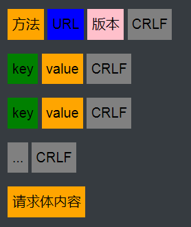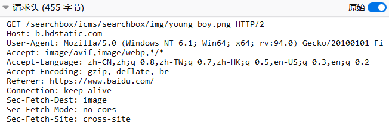

<span style='color:cyan;'>响应格式</span>

<div style='display:inline-block;padding:5px;background:orange;color:black;'>版本</div>	<div style='display:inline-block;padding:5px;background:blue;color:black;'>状态码</div>	<div style='display:inline-block;padding:5px;background:pink;color:black;'>状态码描述</div>	<div style='display:inline-block;padding:5px;background:gray;color:black;'>CRLF</div>
<div style='display:inline-block;padding:5px;background:green;color:black;'>key</div>	<div style='display:inline-block;padding:5px;background:orange;color:black;'>value</div>	<div style='display:inline-block;padding:5px;background:gray;color:black;'>CRLF</div>
<div style='display:inline-block;padding:5px;background:green;color:black;'>key</div>	<div style='display:inline-block;padding:5px;background:orange;color:black;'>value</div>	<div style='display:inline-block;padding:5px;background:gray;color:black;'>CRLF</div>
<div style='display:inline-block;padding:5px;background:gray;color:black;'>...</div>
<div style='display:inline-block;padding:5px;background:gray;color:black;'>CRLF</div>
<div style='display:inline-block;padding:5px;background:orange;color:black;'>响应体内容</div>
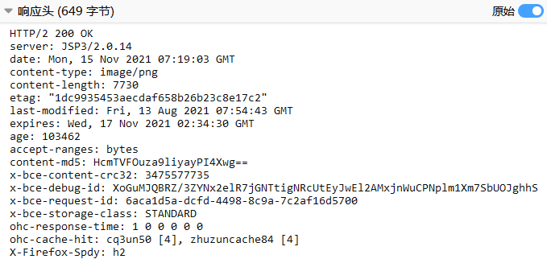


###### CRLF注入

​		因为在请求数据中，它是根据CRLF，也就是 \r\n 来表示某一行的结束，那么用户就可以恶意的在 URL 后面手动加上 CRLF ，然后再加一些恶意的 key：value，这样服务端就会解析到恶意的 key：value，从而造成安全问题

​		解决方法是在服务端对请求数据进行清理，去掉不符合规范的 CRLF 字符


​		利用CRLF注入关闭浏览器XSS过滤器功能，然后再使用XSS攻击


###### http调优

http请求基于tcp连接来通信，首先是得两台要通信的计算机建立tcp连接，

然后在该连接上发送和接收http格式的数据

<span style='color:yellow;'>*长连接*</span>

​		http请求具有短暂和突发的特点，也就是定不准什么时候就突然请求一下资源

那么如果每次要发送http请求时，都重新建立tcp连接，那么就得每次都经历三次握手和四次挥手的申请内存和释放内存的活动，这样时间将都被浪费在这里，

所以，应当使用长连接的方式，复用同一个tcp连接，多次进行http请求，这样就初步提高了http的性能，该方案就是 http1.1 做出的改进

<span style='color:yellow;'>*tcp慢启动*</span>

​		但是还存在一个问题，就是tcp连接存在慢启动机制，还记得在linux中的tcp设置吗？其中有一个设置是发送和接收窗口的大小，这里设置的是一个范围，也就是刚建立连接时，设置窗口大小为初始值，然后根据网络情况不断增大至最佳性能，这个设计的目的是避免多个tcp连接一上来就发送大的数据包从而造成路由器缓存被占满从停止响应的问题，这就是慢启动机制

​		显然，http请求属于时不时来一下子的数据交互，因为慢启动机制的存在，http请求将总会吃到最开始的慢速度，所以最直接的方式就是关闭linux中tcp设置的慢启动功能

​		就像这样关闭了，就可以很直接地提升http请求的用户体验


<span style='color:yellow;'>*拥塞窗口的初始值*</span>

​		看完了tcp慢启动问题，显然，我们也可以通过把拥塞窗口的初始值大小设置得大一些来直接提高http的用户体验


###### http版本差别

http协议就是纯粹的一种数据格式规定, 发送方(浏览器) 按照格式包装数据, 接收方(服务器) 按照格式解析数据

1.0

短连接，一个http请求建立一个tcp连接, 服务端返回响应后就断开 tcp 连接

只定义了 get， post， head 三种

1.1

支持六种 get，post，head，delete，put，options

长连接，一个tcp连接一直用来进行http请求和响应，直至http请求中设置 connection: close，但是这些http请求是串行地使用这个tcp连接

2.0

多路复用tcp连接，也就是在一个tcp连接中可以同时发送多个http请求和响应，它们根据不同的id号区分

客户端和服务端同时保存head cache，那么在发送http请求时，不再需要发送重复的请求头参数，只需要增量发送请求头参数即可

使用二进制的方式传递数据，也就是数据都使用01的方式传递，这样就避免了字符传递时大部分的错误，之前都是字符文本传输

支持服务端主动向客户端发送数据了

数据压缩传输，这样更节省带宽


###### get和post

*   get一般用于请求资源，post一般用于数据提交

*   get把请求数据放到url中不安全且有长度限制

    post把数据放到请求体中较为安全无长度限制

*   get请求返回的数据会被浏览器自动缓存

    post请求返回的数据默认不被浏览器缓存

*   浏览器中前进后退功能对于get来说无影响就相当于多次请求

    对于post请求会造成表单的多次提交问题

*   get请求一次性发送给服务器并接收返回数据

    post请求分两次发送给服务器，第一次发送请求头，服务器返回状态码100, 然后再发起第二次请求将请求体发送过去，然后服务器返回状态码200


###### 浏览器的本质

`tcp客户端 + js解析器 + html解析器`

1. 客户端程序
2. 本质是一个 JS 代码运行时
3. 提供给用户请求指定IP地址资源的功能
4. 包含 DNS 解析功能, 读取操作系统设置的 DNS 服务器地址, 每次先将用户输入的域名解析为 Ip地址再继续
5. 每当用户输入 url 后, 就建立 tcp 连接, 封装 http 格式的数据发送到指定服务器上, 接收到服务器响应后, 将内容根据 html 的格式解析出来到页面上, 同时在 windows.history 上记录访问过的历史, 是一个栈的结构
6. 每当收到 get 请求的响应数据后, 都会将数据缓存下来, 可能是个 map, key 是 url , value 是数据, 下次再访问的时候, 先发送一次请求, 看下是否有变化, 没有变化则直接加载缓存内容, 否则重新加载并缓存
7. 包含本地存储功能, 每个页面都有专属的 map 集合, 用来保存 cookies 和 localstorage 数据, 在当前页面实例中发起的请求都将自动带上该页面的 cookies


###### [XSS攻击](https://zhuanlan.zhihu.com/p/26177815)

先上一段标准解释（摘自百度百科）

>   “XSS是跨站脚本攻击(Cross Site  Scripting)，为不和层叠样式表(Cascading Style Sheets,  CSS)的缩写混淆，故将跨站脚本攻击缩写为XSS。恶意攻击者往Web页面里插入恶意Script代码，当用户浏览该页之时，嵌入其中Web里面的Script代码会被执行，从而达到恶意攻击用户的目的。”

​		相信以上的解释也不难理解，但为了再具体些，这里举一个简单的例子，就是留言板。我们知道留言板通常的任务就是把用户留言的内容展示出来。正常情况下，用户的留言都是正常的语言文字，留言板显示的内容也就没毛病。然而这个时候如果有人不按套路出牌，在留言内容中丢进去一行

```js
<script>alert(“hey!you are attacked”)</script>
```

那么留言板界面的网页代码就会变成形如以下：

```html
<html>
    <head>
       <title>留言板</title>
    </head>
<body>
<div id=”board” 
        <script>alert(“hey!you are attacked”)</script>
</div>     
    </body>
</html>
```

​		那么这个时候问题就来了，当浏览器解析到用户输入的代码那一行时会发生什么呢？答案很显然，浏览器并不知道这些代码改变了原本程序的意图，会照做弹出一个信息框。

​		其实归根结底，XSS的攻击方式就是想办法“教唆”用户的浏览器去执行一些这个网页中原本不存在的前端代码。

**XSS攻击能做什么**

*   **窃取网页浏览中的cookie值**

    ```js
    // 使用该api获取cookie
    document.cookie
    ```

*   **劫持流量实现恶意跳转**

    ```js
    <script>window.location.href="http://www.baidu.com";</script>
    ```

**如何绕过XSS检查**

*   **大小写绕过**

    >   http://192.168.1.102/xss/example2.php?name=<sCript>alert("hey!")</scRipt>

*   **利用过滤后返回语句再次构成攻击语句来绕过**

    删一个 script 标签，还剩一个 script 标签

    >   http://192.168.1.102/xss/example3.php?name=<sCri<script>pt>alert("hey!")</scRi</script>pt>

*   **利用其他标签的事件来插入代码**

    >   http://192.168.1.102/xss/example4.php?name=\   src='w.123' onerror='alert("hey!")'>

*   **用eval执行编码后的代码**

    例如alert(1)编码过后就是

    ```text
    \u0061\u006c\u0065\u0072\u0074(1)
    ```

    所以构建出来的攻击语句如下：

    >   [http://192.168.1.102/xss/example5.php?name=eval(\u0061\u006c\u0065\u0072\u0074(1))](https://link.zhihu.com/?target=http%3A//192.168.1.102/xss/example5.php%3Fname%3D%3Cscript%3Eeval(/u0061/u006c/u0065/u0072/u0074(1))%3C/script%3E)

**XSS攻击大致上分为两类：**

>   一类是反射型XSS，又称非持久型XSS，
>   一类是储存型XSS，也就是持久型XSS。

**什么是反射型XSS**

​		其实，我们上面讲XSS的利用手段时所举的例子都是非持久型XSS。

​		也就是攻击相对于访问者而言是一次性的，具体表现在我们把我们的恶意脚本通过url的方式传递给了服务器，而服务器则只是不加处理的把脚本“反射”回访问者的浏览器而使访问者的浏览器执行相应的脚本。

​		也就是说想要触发漏洞，需要访问特定的链接才能够实现。

**什么是储存型XSS**

​		它与反射型XSS最大的不同就是服务器再接收到我们的恶意脚本时会将其做一些处理。

​		例如储存到数据库中，然后当我们再次访问相同页面时，将恶意脚本从数据库中取出并返回给浏览器执行。这就意味着只要访问了这个页面的访客，都有可能会执行这段恶意脚本，因此储存型XSS的危害会更大。

​		还记得在文章开头提到的留言板的例子吗？那通常就是储存型XSS。当有人在留言内容中插入恶意脚本时，由于服务器要像每一个访客展示之前的留言内容，所以后面的访客自然会接收到之前留言中的恶意脚本而不幸躺枪。

​		这个过程一般而言只要用户访问这个界面就行了，不像反射型XSS，需要访问特定的URL。

**防范手段**

-   首先是过滤。对诸如<script>、、<a>等标签进行过滤。
-   其次是编码。像一些常见的符号，如<>在输入的时候要对其进行转换编码，这样做浏览器是不会对该标签进行解释执行的，同时也不影响显示效果。
-   最后是限制。通过以上的案例我们不难发现xss攻击要能达成往往需要较长的字符串，因此对于一些可以预期的输入可以通过限制长度强制截断来进行防御。


###### Http-Only

​		如果支持HttpOnly的浏览器检测到包含HttpOnly标志的cookie，并且客户端脚本代码尝试读取该cookie，则浏览器将返回一个空字符串作为结果。这会通过阻止恶意代码（通常是XSS）将数据发送到攻击者的网站来使攻击失败。

​		也就是说，Http-Only 用于防范 XSS 攻击中的窃取 cookies 操作


###### Script中的defer和async

普通script

也就是遇到什么解析什么，串行解析并执行

文档解析的过程中，如果遇到`script`脚本，就会停止页面的解析进行下载（但是Chrome会做一个优化，如果遇到`script`脚本，会快速的查看后边有没有需要下载其他资源的，如果有的话，会先下载那些资源，然后再进行下载`script`所对应的资源，这样能够节省一部分下载的时间 ）
资源的下载是在解析过程中进行的，虽说`script1`脚本会很快的加载完毕，但是他前边的`script2`并没有加载&执行，所以他只能处于一个挂起的状态，等待`script2`执行完毕后再执行。
当这两个脚本都执行完毕后，才会继续解析页面。


defer

遇到 js 文件时，先并行下载，等到文档树解析完毕后，串行执行之前下载的 js 文件

文档解析时，遇到设置了`defer`的脚本，就会在后台进行下载，但是并不会阻止文档的渲染，当页面解析&渲染完毕后。
会等到所有的`defer`脚本加载完毕并按照顺序执行，也就是说，defer 的 js文件 计入 `DOMContentLoaded` 事件，得等执行完毕后才会触发 `DOMContentLoaded` 事件。


async

遇到 js 文件后，先并行下载，然后那个下载完毕就执行哪个，所以执行的先后顺序是不确定的

`async`脚本会在加载完毕后执行。
`async`脚本的加载不计入`DOMContentLoaded`事件统计，也就是说下图两种情况都是有可能发生的


推荐的应用场景

defer

​		如果你的脚本代码依赖于页面中的`DOM`元素（文档是否解析完毕），或者被其他脚本文件依赖。

1.  评论框
2.  代码语法高亮
3.  `polyfill.js`

async

​		如果你的脚本并不关心页面中的`DOM`元素（文档是否解析完毕），并且也不会产生其他脚本需要的数据。

1.  百度统计

如果不太能确定的话，用`defer`总是会比`async`稳定


###### DOMContentLoaded事件

​		该事件的触发时机是页面中文档树解析完毕后, 也就是说, 当触发这个事件时, 用户已经可以在浏览器上看到内容了, 那么, 该事件的平均触发时点是网页加载性能的重要衡量标准

​		该事件属于 document 的事件, 通过 addEventListener()  添加回调函数

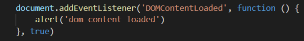

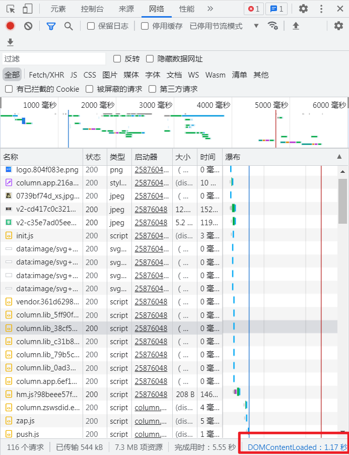


###### DOM加载顺序

  （1）解析html结构

  （2）加载外部脚本和样式表文件

  （3）解析并执行脚本代码

  （4）构造HTML DOM模型  

​			//DOMContentLoaded执行点，此时已经具有所有的Dom节点，适合使用js进行操作

  （5）加载图片等外部文件

  （6）页面加载完毕 

​			//load，此时已经加载完所有的Dom节点以及各种外部资源比如图片字体

总结，DOMContentLoaded 钩子函数时，所有的Dom已经就绪，也就是说此时已经可以使用js操作dom了，如果等到 load 钩子函数时再执行 js 操作，那么还得再等一段时间来加载 图片等外部资源，这将会降低用户体验

**JQuery中的 ready 和 load**

JQuery中有 

`$(document).ready(function(){...})`   对应 DomCententLoaded 钩子函数

`$(document).load(function(){...})`   对应 load 钩子函数


###### window 对象

​		window 是客户端浏览器对象模型的基类，window 对象是客户端 [JavaScript](http://c.biancheng.net/js/) 的全局对象。一个 window 对象实际上就是一个独立的窗口，对于框架页面来说，浏览器窗口每个框架（iframe或者frame标签）都对应一个 window 对象

​		浏览器本质上就是维护了一系列的 window 对象，然后将它们的 document 属性值解析为 dom 树然后图形化展示在浏览器页面上

​		在js中定义的全局变量和全局函数，其实都是挂在了 window 对象上

```js
    var a = "window.a";  //全局变量，其实是加到了 window 对象上
    function f () {  //全局函数， 其实是加到了 window 对象上
        console.log(a);
    }
    console.log(window.a);  //返回字符串“window.a”
    window.f();  //返回字符串“window.a”
```

​		window对象是浏览器窗口的根对象，使用 window 对象可以访问客户端其他对象，这种关系构成浏览器对象模型，window 对象代表根节点，浏览器对象关系的关系如图所示，每个对象说明如下。

-   window：客户端 JavaScript 顶层对象。每当 <body> 或 <frameset> 标签出现时，window 对象就会被自动创建。
    -   navigator：包含客户端有关浏览器信息，但是具有误导性，因为可以被用户修改

        

    -   screen：包含客户端屏幕的信息

    -   history：包含浏览器窗口访问过的 URL 信息, 提供访问前进后退刷新等操作

        `history.back()` 后退到history中保存的前面一个地址

        `history.forward()` 前进到history中保存的后面一个地址

        `history.go(n)`  指定后退几步或者前进几步，传参为0时，刷新当前页面

        `history.pushState(obj,title,url)` 

        在history中添加一项 url，并且直接把地址栏变为该url，但是并不会尝试跳转该 url甚至不会检验该url是否有效，

        仅仅在 history中添加一项以及改变地址栏显示，

        vue中 vue-router 使用该方法实现页面路由

        第一个参数接收对象，将会在 popstate 事件中被获取

        第二个参数接受字符串，将会作为该页面的标题进行显示，但是绝大多数浏览器会直接忽略掉这个规定

        `popState事件` 在 history 对象通过用户点击前进后退或者调用 back，forward，go的时候触发

        ```js
        //该事件绑定在window对象上
        window.onpopstate=function(e){
            // e.state 就是在 pushstate 中设置的第一个参数对象
            console.log(e.state)
        }
        ```

        `history.replaceState(obj, title, url)` 参数含义以及表现行为同 pushstate，不同之处在于该函数的功能用于修改 history 中已有的记录 

    -   location：包含当前网页文档的 URL 

    -   document：包含整个 HTML 文档，可被用来访问文档内容及其所有页面元素。


​		另外，在js中可以直接使用的 alert 函数，confirm函数，setTimeout函数，setinterval函数等都是 window 对象上的方法，直接调用实际上是省略了 `window.` 的写法


###### document 对象

document对象是 window 对象上最重要的属性, 用来记录文档树中所有的节点内容

浏览器是响应式模型, 即实现定义好事件以及回调函数, 然后根据不同的用户行为触发执行不同事件回调

DOMContentLoaded 事件 是 document对象和window对象独有的事件


###### addEventListener() 函数

使用方法 `element.addEventListener('事件名', 回调函数, 是否捕获)`, 这意味着任何元素都可以添加事件监听

[第一个参数为小写字母开头的事件名](https://www.runoob.com/jsref/dom-obj-event.html)

第二个参数为回调函数, 回调函数接收一个 event 参数 , event.target 获得触发该事件的元素

第三个参数是否捕获, 如果捕获了, 那么就不会冒泡传递了

兼容性问题, 在 IE9.0 之前, Opera7.0 之前, 不支持该方法, 使用 `attachEvent` 来绑定事件


###### [JWT( Json Web Token )](http://www.ruanyifeng.com/blog/2018/07/json_web_token-tutorial.html)

​		JSON Web Token（缩写 JWT）用于解决分布式服务器如何存储用户 session 的问题

​		传统 session_id 的方法能够很好地作用于单机服务器上，如果想要作用于分布式服务器上，就还需要考虑 session 共享的问题

**JWT的思路**

JWT思路是不再将验证信息存储到服务器上，而是存储到浏览器本地，发送请求时带上 JWT，在服务端对其进行验证

JWT就是一个字符串，包含三个部分 `{header. payload. signature}`，三个部分使用 . 符号隔开组成一个字符串


**Header** 部分是一个 JSON 对象，描述 JWT 的元数据，通常是下面的样子。

```json
{
  "alg": "HS256",
  "typ": "JWT"
}
```

上面代码中，`alg`属性表示签名的算法（algorithm），默认是 HMAC SHA256（写成 HS256）；`typ`属性表示这个令牌（token）的类型（type），JWT 令牌统一写为`JWT`。

最后，将上面的 JSON 对象使用 Base64URL 算法转成字符串。


**Payload** 部分也是一个 JSON 对象，用来存放实际需要传递的数据。JWT 规定了7个官方字段，供选用

>   -   iss (issuer)：签发人
>   -   exp (expiration time)：过期时间
>   -   sub (subject)：主题
>   -   aud (audience)：受众
>   -   nbf (Not Before)：生效时间
>   -   iat (Issued At)：签发时间
>   -   jti (JWT ID)：编号

除了官方字段，你还可以在这个部分定义私有字段，下面就是一个例子。

```json
{
  "sub": "1234567890",
  "name": "John Doe",
  "admin": true
}
```

<span style='color:pink;'>注意，JWT 默认是不加密的，任何人都可以读到，所以不要把秘密信息放在这个部分，如果要存放秘密信息，请使用 https 的方式传输 JWT</span>

这个 JSON 对象也要使用 Base64URL 算法转成字符串。


**Signature** 部分是对前两部分的签名，防止数据篡改。

首先，需要指定一个密钥（secret）。这个密钥只有服务器才知道，不能泄露给用户。然后，使用 Header 里面指定的签名算法（默认是 HMAC SHA256），按照下面的公式产生签名。

```javascript
HMACSHA256(
  base64UrlEncode(header) + "." +
  base64UrlEncode(payload),
  secret)
```


**这里的原理是，**

密钥只有服务端知道，那么使用密钥对前面两部分进行加密，得到签名

如果用户私自更改了前面两部分，而用户又不知道密钥，那么等待服务器收到 JWT 后，会使用密钥对前两部分进行加密，得到签名，然后与第三部分的签名对比，如果相同，则代表前面两个部分没有被篡改，反之则认为前两部分无效， JWT 无效


客户端收到服务器返回的 JWT，可以储存在 Cookie 里面，也可以储存在 localStorage。

然后请求服务器时，带上这个 JWT， 可以放到HTTP 请求的头信息`Authorization`字段里面，也可以放到 cookie 里面发送，也可以放到 Post请求体中发送


**JWT的大缺点，**

服务端不保存 session 状态，那么一旦发配了一个 JWT，在其指定的失效时间之前，将不能使其失效，所以 JWT 的失效时间应当适当地设置小一点


###### [AJAX](http://javascript.ruanyifeng.com/bom/ajax.html)

​		本质上就是 js 的一个 API, 然后由浏览器提供实现

​		1999年，微软公司发布 IE 浏览器5.0版，第一次引入新功能：允许 JavaScript 脚本向服务器发起 HTTP 请求。所以说白了，就是在这之后，可以使用 js 请求服务器，然后得到服务器的响应结果，最后根据响应结果执行 js 操作 dom修改界面，而在这之前，想要修改界面中的内容，只能通过向浏览器导航栏中重新输入 url 然后回车刷新整个页面来实现。

​		2005年2月，AJAX 这个词第一次正式提出，它是 Asynchronous JavaScript and XML 的缩写，指的是通过  JavaScript 的异步通信，从服务器获取 XML 文档从中提取数据，再更新当前网页的对应部分，而不用刷新整个网页。后来，AJAX  这个词就成为 JavaScript 脚本发起 HTTP 通信的代名词，也就是说，只要用脚本发起通信，就可以叫做 AJAX 通信。

​		通过上面可以得知，Ajax 的实现方式，无非就是调用 js 提供的网络请求接口，这个接口就是 `XMLHttpRequest` 对象

具体来说，AJAX 包括以下几个步骤。

1.  创建 XMLHttpRequest 实例
2.  发出 HTTP 请求
3.  接收服务器传回的数据
4.  使用js通过操作 dom 更新网页内容

那么，现在只需要了解 js 中提供的 `XMLHttpRequest` 接口 Api 即可

通常是

```js
// 1. 新建一个xhr实例
var xhr = new XMLHttpRequest();
// 2. 设置下请求方法和url, 第三个参数是否异步
xhr.open('GET', 'http://www.example.com/page.php', true);
// 3. 设置xhr一些属性和回调函数
xhr.onreadystatechange = function(){
  // 通信成功时，状态值为4
  if (xhr.readyState === 4){
    if (xhr.status === 200){ // 状态码200代表请求成功，进而解析数据
      console.log(xhr.responseText);
    } else {
      console.error(xhr.statusText);
    }
  }
};
xhr.onerror = function (e) {
  console.error(xhr.statusText);
};
// 4. 使用 send函数 真正发出请求, 参数是请求体数据
xhr.send(null);
```


###### [同源政策](http://javascript.ruanyifeng.com/bom/same-origin.html)

> 是浏览器为了实现网站的安全而进行的一项设定

所谓“同源”指的是”三个相同“

`协议://域名:端口/路径`

>   -   协议相同
>   -   域名相同
>   -   端口相同

目前，如果非同源，共有三种行为受到限制

>   （1） 无法读取非同源网页的 Cookie、LocalStorage 和 IndexedDB
>
>   （2） 无法接触非同源网页的 DOM
>
>   （3） 无法向非同源地址发送 AJAX 请求（可以发送，但浏览器会拒绝接受响应）

**目的**

​		同源政策的目的，是为了保证用户信息的安全，防止恶意的网站窃取数据。

​		设想这样一种情况：A 网站是一家银行，用户登录以后，A 网站在用户的机器上设置了一个  Cookie，包含了一些隐私信息（比如存款总额）。用户离开 A 网站以后，又去访问 B 网站，如果没有同源限制，B 网站可以读取 A 网站的  Cookie，那么隐私信息就会泄漏。更可怕的是，Cookie  往往用来保存用户的登录状态，如果用户没有退出登录，其他网站就可以冒充用户，为所欲为。因为浏览器同时还规定，提交表单不受同源政策的限制。

​		由此可见，同源政策是必需的，否则 Cookie 可以共享，互联网就毫无安全可言了。

***解除 Ajax 同源限制*** 

*   JSONP ：使用 script 标签，然后指定 src为目标接口，并指定回调函数名称为参数，服务端接收到函数名后，在返回的js文件中, 添加 `函数名+"("+数据+")"` 响应回去，js 收到返回后会被执行, 进而调用回调函数，获得的参数即目标数据

*   WebSocket ： 本身无同源限制

*   [CORS](http://www.ruanyifeng.com/blog/2016/04/cors.html) 

    ​		一开始的同源政策限制了 Ajax 可访问的服务只能是同源服务器，但是随着前后分离的开发场景，确实需要 Ajax 可以访问非同源服务器的功能，于是，就制订了 CORS 这个标准，使用这个标准流程，可以安全地进行非同源的 Ajax 访问

    ***对于简单请求，***

    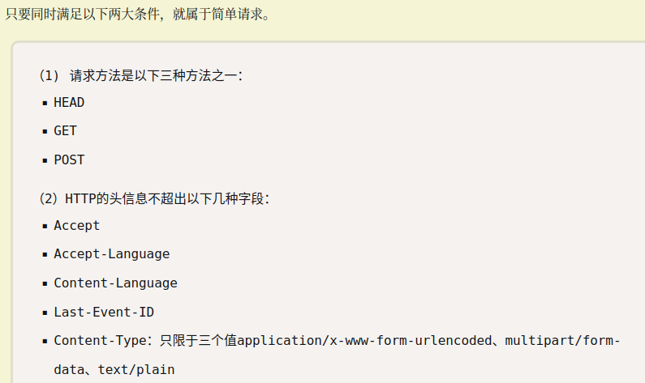

    首先是浏览器在请求头带上 <span style='color:cyan;'>Origin</span> 参数，代表来自哪个源的请求，

    然后服务器端对该源进行判断，如果在允许列表中，则返回 <span style='color:cyan;'>Access-control</span> 的一系列字段，表示同意该 Ajax 请求，同时正常返回数据，

    浏览器收到正常的返回后即解析数据，完成 Ajax

    ***对于非简单请求，得进行两次请求，***

    首先是浏览器发送一个 <span style='color:cyan;'>Options</span> 类型的请求，此次请求称为 “预检” 请求，在请求头带上 Origin 参数，代表来自哪个源的请求，

    然后服务器端对该源进行判断，如果在允许列表中，则返回 Access-control 的一系列字段，表示同意该 Ajax 请求，

    注：如果服务器不同意该请求源，会触发 xhr 对象的 onerror事件，收到这样的错误

    ```
    XMLHttpRequest cannot load xxx
    Origin xxx is not allowed by Access-Control-Allow-Origin.
    ```

    浏览器收到服务器的确认后，再次发起原先的请求，

    服务器返回正常的数据，

    浏览器解析数据完成 Ajax

    在 CORS 流程中，这些操作对于用户来说都是透明的，不可见的，开发人员只需要在服务端设置 <span style='color:cyan;'>`允许非同源`</span> 以及 <span style='color:cyan;'>`允许的非同源列表`</span> 即可

    因为非简单请求可能需要携带大量的请求体，如果在第一次请求就带上这些数据，而且origin 不被接受，那么这将会是浪费带宽和时间，所以要先发送一个简短的option确认请求，确定可以了再发送真正的请求

    使用了CORS方法，就可以安全地进行非同源的 Ajax了，但是此时 cookie 还是不能发给非同源，所以就又有一种方案（规定），

    首先在 xhr 请求中显式设置 <span style='color:cyan;'>`withCrendiente=true`</span>，此时发起非同源请求时浏览器会带上 cookie，

    然后在服务端设置 <span style='color:cyan;'>`Access-Control-Allow-Creditials=true`</span>， 此时服务器同意接收来自非同源的 cookie，

    这样下来，就能通过使用 cookie 完成用户的认证功能


###### [盒模型](https://www.runoob.com/css/css-boxmodel.html)


css中设置的 width 和 height 其实是 <span style='color:cyan;'>content</span> 的 宽度 和 高度

所以

盒模型的总宽度 = 宽度+左填充+右填充+左边框+右边框+左边距+右边距

盒模型的总高度 = 高度+顶部填充+底部填充+上边框+下边框+上边距+下边距

但是

IE5.X 和 6 在怪异模式中使用自己的非标准模型。这些浏览器的 width 属性不是内容的宽度，而是内容、内边距和边框的宽度的总和

要兼容

就不要设置 padding 和 margin，再套一个父容器来实现


###### [Flex布局](http://www.ruanyifeng.com/blog/2015/07/flex-grammar.html)

容器属性

>   -   flex-direction	元素排列方向
>   -   flex-wrap    超出一行是否换行
>   -   flex-flow    前两个的缩写
>   -   justify-content    元素在主轴上的对齐方式
>   -   align-items    元素在副轴上的对齐方式
>   -   align-content    多根轴线时，它们的对齐方式

元素属性

>   -   `order`    元素排列优先度
>   -   `flex-grow`    有空余空间时扩张
>   -   `flex-shrink`   空间不足时压缩
>   -   `flex-basis`    指定固定长度/宽度
>   -   `flex`    前面三个缩写
>   -   `align-self`   单独指定其在主轴上的对其方式，覆盖容器的 align-item 设置


###### [Grid布局](https://www.jianshu.com/p/3762f214cd6f)

Flex布局只是在一根轴线上对子项进行排列, 而 Grid 布局提供了更加灵活的网格, 可以在两个方向上同时布局


###### this指向

通常情况下，this 指向实际调用时直接调用它的对象，也就是 this 的指向是不固定的，只有在调用的时候才知道

比如，

```javascript
function foo(){
	console.log(this.a);
}
var a = 2 ;
// 这里调用 this 的方法 foo 属于 window 对象，所以 this.a 取到 window.a
foo(); // 2
```

```javascript
function foo(){
	console.log(this.a);
}
var obj = {
	a:2,
	foo:foo
}
// 这里 foo 的调用由 obj 对象发起，所以 this.a = obj.a
obj.foo(); // 2
```

使用 call 和 apply 手动指定 this 对象

​		apply 和 call 的唯一区别在于传参方式不同，call 接收可变长参数， apply 接受一个数组作为参数列表

```js
const obj1 = {a:99}
const obj2 = {
  foo:function(){
    console.log(this.a)
  }
}
obj2.foo() // undefined
// 设置 this 指向的对象为 obj1
obj2.foo.call(obj1) // 99
obj2.foo.apply(obj1) // 99
```

使用了箭头函数后，this 的指向在定义时即确定，之后调用时总是返回相同的结果，

箭头函数本身并没有this值，其使用的 this 来自作用域链，来自更高层函数的作用域。

比如，

```js
// 使用普通函数，this将会指向 window
var circle = {
    radius: 10,
    outerDiameter() {
        var innerDiameter = function() {
            console.log(2 * this.radius);
        };
        innerDiameter();
    }
};
circle.outerDiameter(); // 打印undefined
```

此时可以替换为箭头函数，使得 this 指向 circle 对象

```js
// 使用箭头函数
var circle = {
    radius: 10,
    outerDiameter() {
        var innerDiameter = () => {
        	console.log(2 * this.radius);
        };
        innerDiameter();
    }
};
circle.outerDiameter(); // 打印20
```


###### [前端页面优化](https://www.jianshu.com/p/d9c20eafa67e)

*   <span style='color:cyan;'>减少 http 请求数</span>，尽量合并请求，因为一次请求伴随着漫长的流程，而且浏览器支持的并行请求数是有限的
*   <span style='color:cyan;'>简化您的界面结构</span>，否则将会花大量时间来解析 dom
*   <span style='color:cyan;'>减少 js 操作 dom 而造成的页面回流</span>，其中包括增删元素，改变元素大小，使用动画
*   <span style='color:cyan;'>使用缓存</span>，减少服务器请求
*   <span style='color:cyan;'>压缩合并</span>外部资源
*   <span style='color:cyan;'>图片转码</span>, 小图片考虑 base64，大图片限定图片大小
*   <span style='color:cyan;'>懒加载</span>页面，尽量让第一版页面尽快展示在观众面前

*   <span style='color:cyan;'>避免连续高频事件触发</span>, 在处理 onscroll 或者 ontouchmove 之类的回调事件时，注意要给出间隔处理时间，能够满足视觉残留效果即可，否则高频的调用会导致卡顿


###### [浏览器缓存]()

说了那么多，什么强制缓存，协商缓存的，其实说白了就是

先找缓存，找到了看看缓存有没有过期，没过期就直接用（强制缓存），过期了就问问服务器有没有新的修改，没有修改还是用缓存，有修改则接收新的内容并更新缓存（协商缓存）

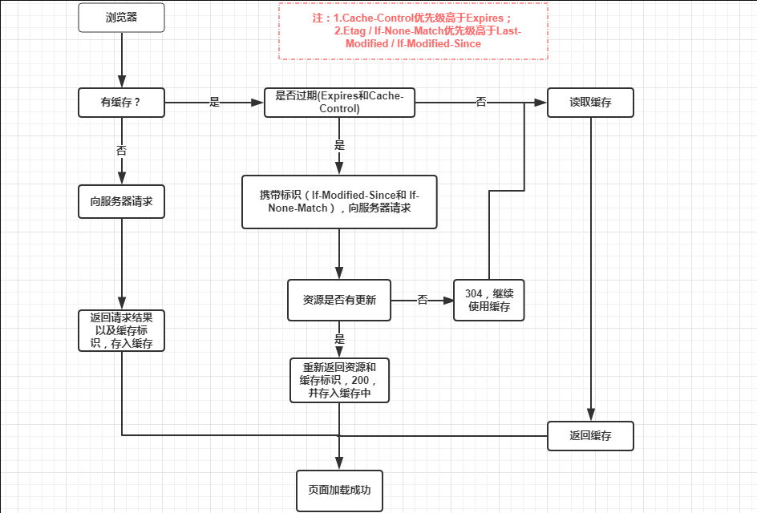

[设置不缓存页面的方式](https://blog.csdn.net/qq_33949023/article/details/111070365?spm=1001.2101.3001.6661.1&utm_medium=distribute.pc_relevant_t0.none-task-blog-2%7Edefault%7ECTRLIST%7Edefault-1.no_search_link&depth_1-utm_source=distribute.pc_relevant_t0.none-task-blog-2%7Edefault%7ECTRLIST%7Edefault-1.no_search_link)

1. 设置页面meta标签

   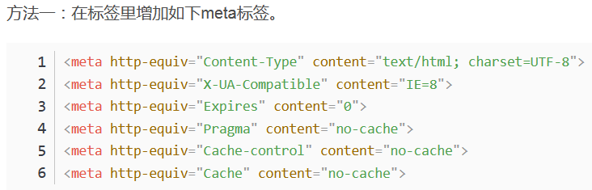

2. 设置响应头

   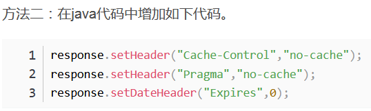


###### [Js事件绑定](https://www.cnblogs.com/wuliangfan/p/11168569.html)

* 直接在 html 标签中作为属性绑定

  ```html
  <button onclick="show();print()" id="btn1">html标签事件绑定</button>
  //一个事件，触发两个方法
  ```

  此时如果想要获得事件对象, 需要借用 window 对象

  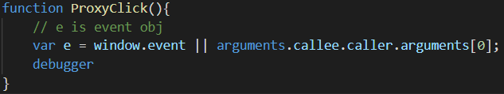

* 在 js 中获取到 dom 元素，然后设置属性绑定

  ```js
  // 这种只能绑定一个方法 
  document.getElementById("btn2").onclick = show;
  // 此时可以直接在方法的形参列表中定义时间对象
  function show(e){}
  ```

*   在 js 中获取到 dom 元素，然后使用 addEventListener 添加绑定

    ```js
    //show和print两个方法都可以触发
    document.getElementById("btn3").addEventListener("click",show);
    document.getElementById("btn3").addEventListener("click",print);
    // 此时可以直接在方法的形参列表中定义时间对象
function show(e){}
    ```
    
    

###### [事件对象event](https://www.cnblogs.com/zxktxj/archive/2012/02/26/2369176.html)

在 event 对象中可以获取到当前事件的各种信息

`e.target` 获取触发此事件的最顶级元素, 比如在父元素上定义的点击事件, 当点击子元素时也会触发该事件, 此时该属性为子元素, 那么该属性就可以用来实现事件委托

`e.currentTarget` 获取实际触发此事件的元素, 比如在父元素上定义的点击事件, 当点击子元素时也会触发该事件, 此时该属性为父元素


###### JS修改元素

* 使用 `var obj = createElement('div')` 创建元素, 然后使用 `ele.append(obj)` 添加元素
* 使用 `obj.innerHtml` 直接修改元素, 可解析标签
* 使用 `document.write(xxx)` 后清空页面, 然后将 xxx 写到 body 中


###### JS插入元素

```js
function insertone(){
    // 创建一个元素
        var d = document.createElement('div')
        d.innerText = "is new"
    // 调用 insertBefore 插入元素, 使用方法为 父元素.insertBefore(新元素, 被插入元素)
        document.getElementById('box').insertBefore(d, document.getElementById('ddd'))
}
```


###### ==和===

`==` 先判断是否类型相同，如果类型相同，返回值得比较结果，如果类型不同，那么尝试执行类型转换为相同类型，然后返回值比较结果

*   null 和 undefined ，直接返回 true
*   字符串 和 数字，将字符串转数字，然后比较是否相同

`===` 先判断类型是否相同，不同直接返回false，相同才能继续比较值是否相同，进而返回值比较结果

*   null 和 undefined，直接返回 false
*   数字 和 数字，返回值比较结果
*   字符串 和 字符串，返回字符序列比较结果
*   引用 和 引用，返回是否引用了同一个对象或函数


###### [css 长度单位](https://blog.csdn.net/weixin_44296929/article/details/102860588)

绝对长度：px、in、cm、mm、pt、pc
相对长度：em、rem、ex、vh、vw、vmin、vmax、%、fr

***绝对长度***

px: 像素

in：英寸，会被映射为像素，windows中 `96像素/英寸` , mac中 `72像素/英寸`

cm：厘米，会被映射为像素

mm：毫米，会被映射为像素

pt：点（Points）也是物理长度单位。（1pt == 1/72in == 96/72px）

pc：派卡（Pica）和 points 一样，只不过（1pc == 12pt）

***相对长度***

`em`：`1em==当前位置的font-size的值`，如果当前位置没有显式设置 font-size，那么向上逐级寻找 font-size 属性值，直至根元素

​		就等同于当前字体大写字母 M 的尺寸

​		font-family 改变时，em不会改变

​		em是一个相对单位，相对于当前对象内文本的字体尺寸，如当前对行内的字体尺寸未被人设置，则相对于浏览器 的默认字体尺寸，`em` 会继承`父级元素`的字体大小

在没有任何CSS规则的前提下：

​		`1em == 16px` == 0.17in == 12pt == 1pc == 4.2mm == 0.42cm

也就是说默认情况下  `1em==16px`

`rem`：rem 和 em 一样是一个相对单位，但是和 em 不同的是 `rem` 总是相对于`根元素`（如：root{}），而不像em一样使用级联的方式来计算尺寸。这种相对单位使用起来更简单

`ex`：当前 font-size 一半的高度

​		相当于当前字体中字母 x 的高度，也就是 font-size 的一半

​		当 font-family 改变时，x的高度随之改变，也就是 ex 会随之改变

`ch`：当前字体中数字 0 的宽度

​		当 font-family 改变时，0的宽度随之改变，也就是 ch 会随之改变

`vw`：vw（viewpoint width）是 `可视宽度` 单位（视窗宽度），`1vw` 等于可视区宽度的 `百分之一`

`vh`：vh（viewport height）和vw（viewport width）单位一样，不同的vh是相对于`可视区的高度`（视窗高度）

`vmin`：vmin的值是当前vw和vh中 `较小` 的值，在标准 尺寸类型的使用实例中，和由自己确定屏幕大小的vw、vh单位相比，vmin是一个更有用的度量标准

`vmax`：vmax的值是vw和vh中 `较大` 的那个值

`%`：百分比，父元素相同属性的百分比，如果父容器都没有设置该属性，那么使用百分比获得的值总是0


###### 原生Js模块化

*   手动包装到一个对象中，然后使用 `对象.属性` 来调用

    但是，这样即不能保证对象名不冲突，又不能控制属性的可访问权限

    

    

*   立即执行函数的写法

    将模块内容包装到匿名函数中，然后直接调用

    当然这样就失去了模块的共享功能，此时可以将要共享的内容返回出来，使用变量接收

    这样就能在实现共享的前提下，对访问权限进行控制

    同时，可以选择匿名函数接收 window 对象作为参数，并且把要导出的属性设置到 window 对象上，jQuery就是这样做的

    


###### CommonJS模块化

CommonJS是一种规范，使用 module.exports 和 require 来导出、导入模块

nodejs中使用 CommonJS 的模块化方式，即可以直接在 js 中使用 Commonjs的模块化关键字，然后使用 node 命令执行


注意：commonjs的导入和导出语法浏览器是不能直接识别的，就像下图这样，此时就需要通过打包构建工具如 webpack将其转换为浏览器可识别的 es5 语法，然后执行


###### [ES6模块化](https://www.jianshu.com/p/9e5f39e4792b)

​		在ES6中每一个模块即是一个文件，在文件中定义的变量，函数，对象在外部是无法获取的。如果你希望外部可以读取模块当中的内容，就必须使用export来对其进行暴露（输出），然后使用 import 进行导入

常规用法


支持一个默认导出


​		


###### Commonjs和ES6模块化区别

CommonJS

*   cjs中使用的导入语法 require 实际上就是一个方法，调用该方法从指定路径获取 module.exports 对象

*   如果导出方导出的是引用类型，那么这里得到的仅仅是引用的复制，属于浅拷贝，如果改变导出方原对象的值，导入方的值也会跟着改变；

*   如果导出方是值类型，那么导入方获得变量的复制

*   当使用require命令加载某个模块时，就会运行整个模块的代码

*   当使用require命令加载同一个模块时，不会再执行该模块，而是取到缓存之中的值。也就是说，CommonJS模块无论加载多少次，都只会在第一次加载时运行一次，以后再加载，就返回第一次运行的结果，除非手动清除系统缓存

*   cjs 的导入是运行时导入，本质上就是函数的调用和对象的传递，所以可以在任意地方导入，由于是运行时导入，所以性能上会稍微逊色

    

ES6

*   ES6 模块化的语法是语言层面支持的导入导出，在编译时导入，然后运行时可以直接使用，所以性能上稍微优秀

*   ES6的 import 导入必须写在文件的开头

*   <span style='color:cyan;'>import 进来的对象是 [动态只读引用]，也就是说，在解析到 import 时，生成目标对象的引用，当使用到这个对象时，去原文件中取值</span>

*   所以不管是基本类型还是引用类型，如果在原文件中进行了修改，那么在导入处得到的值总是会同步修改

*   <span style='color:cyan;'>同时，因为只读的特性，不能将其赋值给新的对象，但是可以改变原对象中的属性值</span>

    


###### ES5和ES6继承的区别

ES5中使用函数创建对象，继承的过程是，先创建子类对象，指定属性值后指向 this，然后将父类的方法 apply 到 this 对象上，`Parent.apply(this)`，最后返回 this

ES6中使用 class 定义类，使用 extends 关键字继承父类，继承的过程是，先创建父类对象，然后将子类构造函数中指定的属性值设置到父类对象上，最后返回这个父类对象，所以必须要在构造函数中首先调用` super()` 来创建父类对象，否则直接报错


###### Cookie、sessionStorage、localStorage的区别

共同点：都是保存在浏览器端，并且是同源的

> 注意这个 sessionStorage 跟服务端那个 session 不是一回事, 这里指的是在一个页面打开的时间段内存在的数据

不同点：

*   Cookie：cookie数据始终在同源的http请求中携带（即使不需要），即cookie在浏览器和服务器间来回传递。而sessionStorage和localStorage不会自动把数据发给服务器，仅在本地保存。cookie数据还有路径（path）的概念，可以限制cookie只属于某个路径下,存储的大小很小只有4K左右。

*   sessionStorage：仅在当前浏览器窗口关闭前有效，自然也就不可能持久保持

    localStorage：始终有效，窗口或浏览器关闭也一直保存，因此用作持久数据；

    cookie：只在设置的cookie过期时间之前一直有效，即使窗口或浏览器关闭。

*   localStorage：localStorage 在所有同源窗口中都是共享的；

    cookie也是在所有同源窗口中都是共享的。


###### 浏览器事件循环机制

即同步事件，宏任务，微任务机制


###### https中间人攻击

中间人就是夹在服务器和客户端之间的第三者，能够窃取交互数据

首先中间人截获服务器公钥，然后把自己的公钥发给客户端，客户端返回加密密钥后，中间人用自己的私钥解密，那么中间人就获得了本次服务器和客户端交互使用的对称密钥，接下来的事就好办了

防范：

客户端要求服务器发送CA证书，先检验CA证书有效性，无效则不继续进行


###### vue虚拟dom的好处

虚拟dom相当于真实dom的缓存，可以预先计算好需要进行哪些渲染，然后还可以复用元素，从而提高了性能


###### 元素不可见的方式

opacity: 0  不删除元素，占空间，可触发点击事件

visibility: hidden  不删除元素，占空间，不触发点击事件

display: none  删除元素，不占空间


###### 变量提升

这是一个 js 的语言特性，实际上应当被称为声明提升

js引擎会将 `var a=1` 拆分为 `var a` 和 `a=1` 两句，并且将 `var a` 移动到所在作用域的顶部，然后才开始顺序执行

注意，这只是一个js 的语言特性，并不是为了实现什么或者解决什么问题而存在的特征, 可能的作用就是可以变量先使用, 后声明

**声明提升**

函数的定义同变量的定义，也会在编译时直接移动到所在<span style='color:cyan;'>作用域</span>的顶端

```js
console.log(v1)
var v1 =100
function foo(){
  console.log(v1)
  var v1 = 200
  console.log(v1)
}
foo()
console.log(v1)
// 打印
// undefined
// undefined
// 200
// 100
```

**函数也提升**

函数的声明同样会被自动提升到作用域顶部，此时就可以实现在函数声明之前就调用函数的功能

```js
foo() // 100
function foo(){
  console.log(100)
}
```

**函数更优先**

如果对一个变量同时有被声明为函数，又被重新声明为变量，那么最终结果它是函数，因为函数声明优先级高，不管函数声明是在变量声明上面还是下面

```js
console.log(foo)
// 函数声明在上面
function foo(){
  console.log(1)
}
var foo = "alice"
// 打印结果: [Function: foo]
```

```js
console.log(foo)

var foo = "alice"
// 函数声明在上面
function foo(){
    console.log(1)
}
// 打印结果: [Function: foo]
```


###### Js作用域

不加关键字直接声明的变量默认挂到 windows 对象上，是全局作用域

```js
name = 'alice'
```

加 var 关键字声明的变量在当前函数作用域中生效，而且声明会被自动提升到作用域首部

```js
var name = 'alice'
```

加 let 关键字声明的变量仅在当前块级作用域生效，声明不会被自动提升到作用域首部

```js
let name = 'alice'
```


###### Js内存分配

js内存分配分为 ***堆*** 和 ***栈***

堆：用来存放引用类型对象的值，该区域对象不能直接访问，必须通过栈中指向它的指针来访问

栈：用来存放所有变量，其中变量分为原始类型变量和引用类型变量，原始变量直接将值存放到栈中，引用变量在栈中存放指针，该指针指向实际存放值的堆中的内存部分


###### Js运行过程

1.  首先创建根对象 - window 对象，并且初始化 window 对象的各个属性值
2.  检查js文件中所有变量和函数的声明，将他们的定义提升到js文件的首部，根据上下文挂到 window 对象或者其他对象上，这一步称为 ***预编译***
3.  然后逐行加载代码并执行，这被称为 ***解释运行***

在解释运行中，对于代码 `a=b`，使用 `Left-Hand-Side` 和 `Right-Hand-Side` 方法，分别为：

*   对于等号左边的变量，向上寻找该变量，如果不存在则创建全局变量
*   对于等号右边的变量，向上寻找该变量，如果不存在则报错


###### Js事件委托

> 在父元素上绑定事件

如果想在js中给一个父元素的所有子元素绑定事件，那么需要手动获取子元素，然后遍历绑定事件，这是非常消耗性能的

此时可以利用js的事件冒泡机制，在父元素上绑定事件，那么此时任何子元素都可以触发该事件，在触发的事件逻辑中，判断是哪一个子元素触发了事件，然后做对应的逻辑，这样就实现了一次绑定，对所有子元素生效的功能，这就是事件委托

事件委托不仅仅避免了遍历绑定的性能消耗，而且对于后期动态加入的新元素，也已经包含了此事件


###### meta标签

meta标签用来标明需要附加的头信息（给浏览器看）和页面相关信息（给搜索引擎看）

*   http-equiv 和 content 是附加头信息，给浏览器看的

    <meta http-equiv="xxx" content="xxx">

    http-equiv 可选属性 ：

    -   content-type，设置页面内容类型
    -   expires，设置过期时间
    -   refresh，重定向到目标地址
    -   set-cookie，设置cookie

*   name 和 content 是页面相关信息，给搜索引擎看的

    <meta name="xxx" content="xxx">

    name 可选属性 ：

    *   author：作者信息
    *   description：描述信息
    *   keywords，用于搜索引擎的关键字
    *   generator，
    *   revised，
    *   others，


###### 主线程和合成线程

常说js是单线程，实际上说的就是这里的主线程，在浏览器中，有两个线程，一个就是用来运行js的主线程，一个是负责渲染的合成线程

主线程

>   简单来说，主线程解析DOM，解析CSS，执行JS，生成DOM树并且生成对应的位图，然后将位图交给合成线程来渲染

-   运行JS代码
-   计算HTML元素的CSS样式
-   布局页面
-   将元素绘制成一副或多幅位图
-   将位图传给排版线程

合成线程

>   简单来说，合成线程就是负责将位图交给GPU渲染出来，同时负责计算哪一部分需要展示以及哪些不需要展示

-   通过GPU，将位图绘制到屏幕上
-   对可见或即将可见的区域，询问主线程是否进行位图更新。
-   计算页面的可见区域
-   当滚动屏幕时，计算出即将可见的区域
-   当滚动时移动页面区域


###### css3过渡优化

css3中支持过渡动画，但是不恰当地使用动画会对性能造成很大的影响

综下所述，强烈推荐使用 transform 来定义动画，这种方式能够极大提高性能，但是同时需要考虑浏览器的兼容问题

1.  你可以使用 left 子类的属性来定义动画，像这样

    ```css
    div {
        height: 100px;
        transition: height 1s linear;
    }
     
    div:hover {
        height: 200px;
    }
    ```

    此时主线程和合成线程的工作流程是这样的，也就是说，每次只会改变一个 pix，然后重新计算布局，然后加载到 GPU 内存中，最后渲染，图中橙色部分是十分耗时的

    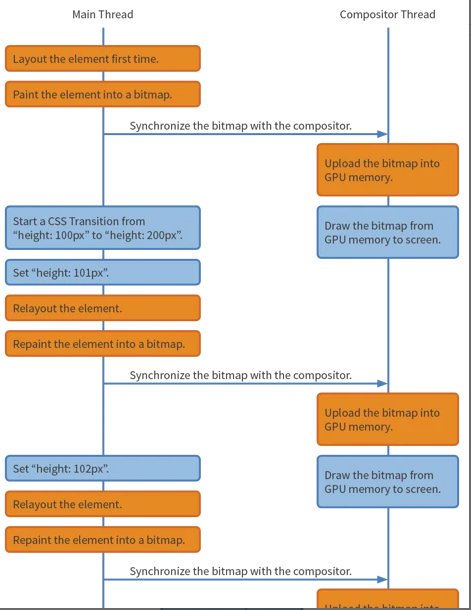

2.  你可以使用 transform 函数来定义动画，像这样

    ```css
    div {
        transform: scale(0.5);
        transition: transform 1s linear;
    }
     
    div:hover {
        transform: scale(1.0);
    }
    ```

    此时工作流程是这样的，也就是说，只有第一次将位图加载到GPU内存中，接下来的变换直接在GPU内存中进行，这样就剩去了绝大部分的重新计算布局时间以及加载位图到GPU内存时间，提高了性能

    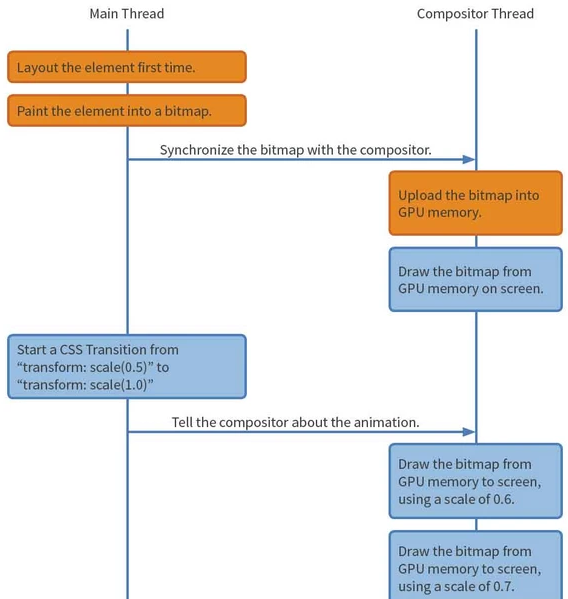

    


###### [css3动画优化思路](https://www.jianshu.com/p/fd4505898a18)

*   使用transform 

    使用 transform 代替 left 之类的直接属性设置方式定义 translate，也就是上面说的

*   单独给元素一个图层

    考虑到浏览器的分图层计算布局和渲染，可以考虑将包含动画的元素单独分到一个图层，或者简化该元素所在图层的结构

    浏览器在渲染一个页面时，会将页面分为很多个图层，图层有大有小，每个图层上有一个或多个节点。

    在渲染DOM的时候，浏览器所做的工作实际上是：

    1.获取DOM后分割为多个图层

    2.对每个图层的节点计算样式结果（Recalculate style--样式重计算）

    3.为每个节点生成图形和位置（Layout--回流和重布局）

    4.将每个节点绘制填充到图层位图中（Paint Setup和Paint--重绘）

    5.图层作为纹理上传至GPU

    6.符合多个图层到页面上生成最终屏幕图像（Composite Layers--图层重组）

    那么可以使用 `translateZ(0)` 或者 `translate3d(0,0,0)` 手动将该元素放到单独的图层中，这样在进行动画时，触发的回流以及重新布局就不需要太多的工作

*   js动画和css动画的选择

    JS动画，JavaScript在浏览器的主线程中运行，而其中还有很多其他需要运行的JavaScript、样式计算、布局、绘制等对其干扰。这也就导致了线程可能出现阻塞，从而造成丢帧的情况

    但是JavaScript的动画与CSS预先定义好的动画不同，可以在其动画过程中对其进行控制：开始、暂停、回放、中止、取消都是可以做到的。而且一些动画效果，比如视差滚动效果，只有JavaScript能够完成

    CSS动画缺乏强大的控制能力。而且很难以有意义的方式结合到一起，使得动画变得复杂且易于出问题。

    CSS动画好在浏览器可以对动画进行优化。它必要时可以创建图层，然后在主线程之外运行。


###### 项目困难点

监控图性能问题

需求：

1.  `星型拓扑+树形拓扑` 展示节点图，层级结构
2.  结构树动态平衡
3.  动态表现节点的状态转变过程
4.  动态表现节点的上线和下线动作
5.  双击显示隐藏数据面板
6.  鼠标常悬连接线后，显示该连接信息pop
7.  鼠标双击节点后，显示该节点信息pop
8.  ctrl+f 显示筛选窗口，选择筛选条件后，拓扑图更新为筛选结构，退出筛选后，拓扑图恢复原状

实现：

1.  echarts实现监控图，在连接线上使用拖尾炫光特效（仅仅canvas支持）
2.  节点使用icon图标
3.  结构树动态平衡需要每次重新计算当前节点树，然后计算新的位置，保留原先部分，计算偏移，使用js控制移动，添加或者删除分支
4.  图标状态切换
    *   [SVG Morpheus](https://www.oschina.net/p/svg-morpheus) 部分使用该库，实现图标补间动画，本质是将 from 图标和to图标都先转换为 path，然后将两个 path 中点个数对应，然后手动控制path中对应的点向目标点转换，涉及不断的计算和渲染，性能十分不友好，所以只能局限于图标的转换
    *   部分选择使用css3过渡效果，IE10-浏览器不兼容
    *   选择使用雪碧图，连续移动，兼容性方案，使用js控制做动画，没做
5.  图标上线下线动作，使用 Animate.css 库，不兼容IE9-，使用css3的 animation，关键帧动画
6.  详细数据面板使用 fixed 脱离文档流
7.  常悬连接线使用计时器，到时创建pop显示，在pop上截断一切冒泡事件，鼠标离开pop时，pop销毁，记录鼠标是否进入过pop，如果直接离开，则pop直接消失，否则按照正常逻辑
8.  截断节点的双击事件，防止与双击空白显示和隐藏数据面板冲突
9.  开启筛选后，对比剩余部分，直接设置隐藏不显示部分

优化：

1.  <span style='color:cyan;'>canvas与svg选择问题</span>

    考虑不使用 canvas，换作 svg，此时不支持拖尾

    手动实现拖尾特效，创建一队粒子元素，亮度逐渐降低，每次自适应调整布局后，保存当前布局中的所有路径，然后使用定时器移动粒子

    结果发现性能还不如之前

2.  <span style='color:cyan;'>缩放问题</span>

    缩放会影响清晰度，采用的策略为禁用缩放，手动输入缩放比例，然后一次性重新计算并加载布局

3.  <span style='color:cyan;'>供不应求问题</span>

    频繁状态改变问题，可能出现的情况是在动画未完成时收到新的状态改变

    解决方案：

    *   压缩状态显示，每次收到消息，首先检查是否已经正在进行展示，是则代表存在定时器，将该状态保存到最终状态变量中，待到定时器结束，将节点状态一步变为最终状态；如果不存在正在进行的展示，开启定时器（时间同动画时间）并且修改标记量，然后开始演示动画
    *   加速状态显示，来消息时，先检查是否正在执行动画，是则将消息加入任务队列，否则标记开始执行动画，并且执行该动画，执行完动画后，判断任务队列中是否有任务，是则递减动画执行时间（最少为0），然后取出消息队列中的第一个消息来执行动画，否则重置动画执行时间

4.  <span style='color:cyan;'>differ数据改到后端</span>

    differ节点状态造成的性能问题，需要在js中对大量的data进行遍历对比，找到差别，这很影响性能，那么修改为差量更新，前端只接收差量数据，直接处理差量数据

5.  <span style='color:cyan;'>轮询改双向连接</span>

    起初的短轮询性能极差，后改为 websocket 由服务器主动推送数据

6.  <span style='color:cyan;'>复用pop元素</span>

    起初pop随用随创建，不用即销毁，后改为固定存在的一个pop，通过控制其显示隐藏和位置，替换内容来实现同一个元素的复用

7.  <span style='color:cyan;'>复用分支元素</span>

    起初所有的分支在同一个echarts实例中创建，那么每次更新布局需要重新计算位置，然后销毁，然后重新生成布局，最后渲染，这在代码实现上很简单，但是性能不友好，后改为多个echarts实例，放到多个div中，使用zindex按照玫瑰图方法排列，加入分支或者删除分支时，只需要旋转各个叶片，然后插入或者删除某个分支div即可

    这种方式需要设置父元素 `background：rgba(0,0,0,0) `, 这样就可以父元素透明而子元素不透明


1.  <span style='color:cyan;'>canvas与svg选择问题</span>
2.  <span style='color:cyan;'>缩放问题</span>
3.  <span style='color:cyan;'>供不应求问题</span>
4.  <span style='color:cyan;'>differ数据改到后端</span>
5.  <span style='color:cyan;'>轮询改双向连接</span>
6.  <span style='color:cyan;'>复用pop元素</span>
7.  <span style='color:cyan;'>复用分支元素</span>


##### JSAPI


###### `Array.from`

`Array.from(arrayLike, [mapFn], [thisArg])`  从类数组对象中新建数据对象

第一个参数可以是字符串, set, array, map, arguments

第二个参数是在生成新数组时对原来元素的操作

第三个参数设定第二个参数函数中的this指向

>  注意 IE 全系列不支持该函数


###### `obj.hasOwnProperty`

`obj.hasOwnProperty('xxx')` 返回obj实例是否包含xxx属性


###### `obj1.isPrototypeOf(obj2)`

`obj1.isPrototypeOf(obj2)` 返回obj1是否存在于obj2的原型链上


###### `Array.isArray(obj)`

判断是否是数组


##### [Map和Object的区别](https://blog.csdn.net/ckwang6/article/details/89215396)


##### [get请求url长度限制是浏览器的限制](https://www.cnblogs.com/elian91/p/11125201.html)


[使用Ajax上传文件](https://www.cnblogs.com/jiangxiaobo/p/5892146.html)

将文件对象封装到 FormData 对象中, 作为 xhr 的数据 send 即可

