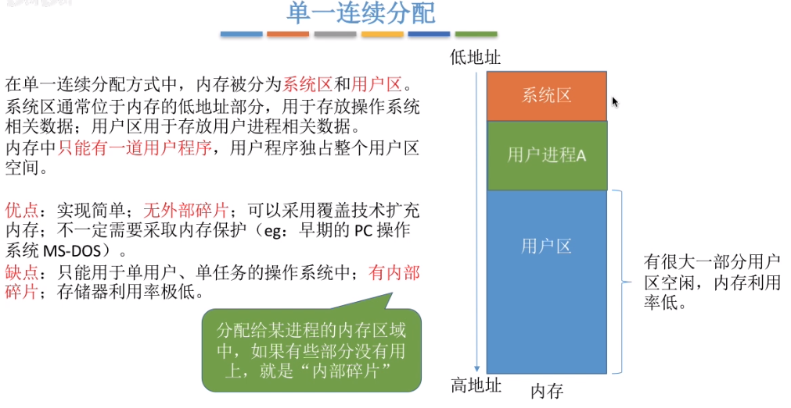

#### 处理器的两种状态

​	处理器根据当前状态判断是否可以执行特权指令, 处理器的状态根据***程序状态寄存器***中存储的值来标识

* 用户态(目态) : 用户态下只能执行非特权指令
* 内核态(管态) : 内核态下可以执行特权指令和非特权指令


指令 : cpu直接执行的命令

* 特权指令 : 涉及敏感操作的指令 , 例如清除内存中的值

* 非特权指令 : 就是普通的指令, 例如创建变量, 加减乘除


应用程序

* 内核程序 : 可以执行特权程序的程序, 运行在内核态

* 用户程序 : 只能执行非特权指令的程序, 运行在用户态


#### 操作系统内核

​	操作系统中提供基本的管理硬件的功能部分, 称为内核. 其他的附加在操作系统中的功能就不属于内核, 比如操作系统的任务管理器, 计算器,

* 大内核 : 将从操作系统主要功能模块都作为系统内核, 这些程序都运行在核心态
  * 优点: 这些程序都运行在核心态, 无需频繁切换处理器状态, 因此运行效率高
  * 缺点: 系统不够精简, 内部代码量大, 难以维护
* 微内核 : 仅将必要的功能作为系统内核, 所以仅有这些最主要的程序运行在核心态
  * 优点 : 内核功能少, 维护方便
  * 缺点: 需要频繁切换处理器状态, 性能低


#### 中断

​	中断由计时器触发, 每跑完一个处理器时间片, 就发出一次中断, 因为中断的存在, 才能实现多个程序的并发执行

所以多个程序并发执行时流程如下:

cpu跑程序1(用户态) > 中断 > cpu转内核态 > 操作系统任务调度程序设置下一个运行的程序 > cpu转用户态 > cpu运行程序2 > 中断 > ......

中断分类

* 内中断 : 程序主动触发中断, 可能的原因有 
  * 发生异常
  * 请求系统调用, 也就是需要执行核心态才能完成的操作, 但是程序又运行在用户态没权限, 那怎么办呢, 就只能主动中断, 向操作系统发起请求, 让操作系统在核心态下代替执行特权操作, 例如调用其他硬件, 请求分配内存
  * 硬件故障
* 外中断 : 来自cpu外部的原因导致的中断, 可能的原因有
  * I/O操作完成, 发出中断信号, 就是喊, 我搞完了
  * 用户强制终止进程


#### 系统调用

​	系统调用(程序接口) , 就是操作系统提供给应用程序用来使用共享资源例如硬件资源的接口, 这些共享的资源不应当被应用程序任意的使用, 否则容易造成混乱和崩溃, 因此由操作系统对资源进行统一管理, 应用程序只能通过系统调用的接口告诉操作系统要使用哪些资源.

​	高级操作语言中提供的库函数就是对系统调用接口的封装, 屏蔽了不同操作系统中系统调用接口的差异, 同时也封装了系统调用的细节, 使其更加容易使用


#### 进程

​		进程其实就是执行一段程序代码，进程的本质就是PCB，进程控制块，创建一个进程实际上就是创建一个 pcb 结构体实例并且保存到相应的 pcb链表中 , 然后在内存中给它分配位置

<span style='color:cyan;'>进程调度程序</span>

​		在操作系统的内核程序中，有一个程序专门用来管理进程调度和资源分配，该程序中维护了不同状态的pcb链表，用以实现进程的调度

​		不同状态的pcb实例被保存到不同的链表中，比如就绪队列，阻塞队列

###### PCB

​		进程控制块, 保存进程的各种信息

*   进程号, 用户号
*   进程状态，进程优先级
*   程序计数器值
*   分配到的 程序段内存地址, 数据段内存地址
*   cpu寄存器的值，进程切换时，将寄存器中的值临时保存到pcb中，以便下次恢复

​	一个进程包含三个部分: PCB, 程序段, 数据段

​		选择进程运行实际上就是使得运行指针指向就绪队列中的某个元素，然后将该pcb中的寄存器值复制到cpu寄存器上，然后根据程序计数器值执行代码，<span style='color:cyan;'>进程的上下文</span>切换实际上就是切换寄存器中值的过程

​		（其实现在的操作系统的都是以线程为基本调度单位，如果切换前后两次属于不同进程，才会发生进程切换）

<span style='color:cyan;'>进程上下文切换的情况</span>

1.  进程调度切换进程

2.  发生硬件中断事件，比如网卡接收到数据

    （硬件中断事件yyds，只要硬件中断，总是最优先执行中断处理程序）

3.  剩余内存不足以运行当前进程，会切换到能够得以执行的进程执行

4.  进程自己调用 sleep 函数把自己挂起


<span style='color:cyan;'>创建进程</span>

​		操作系统为该程序创建并初始化 PCB实例 然后加入就绪队列中, 以及分配一段内存用来存放程序段和数据段

<span style='color:cyan;'>终止进程</span>

​		从几个进程队列中查找该进程 pcb，将其指向的内存释放，将其从进程队列中删除

​		如果该进程正在cpu运行，立即停止运行让出cpu给其他进程

​		如果该进程还有子进程，先终止所有子进程

<span style='color:cyan;'>阻塞进程</span>

​		先从进程队列中查找该进程pcb，将其移动到阻塞队列中，如果正在运行，先保存寄存器的值到pcb中

<span style='color:cyan;'>唤醒进程</span>

​		先找到进程pcb，然后把它移动到就绪队列


###### 进程的状态

* 创建态 : 进程刚刚发出创建请求, 操作系统正在为其分配 PCB, 内存等资源

* 就绪态 : 达到运行条件, 但是苦于没有cpu资源

* 运行态 : 正在占用cpu

* 阻塞态 : 因为等待其他的事件而不能执行, 比如等 io 操作的完成

* 终止态 : 进程已经停止运行, 操作系统正在回收分配给它的资源, 删除PCB

* <span style='color:pink;'>挂起态</span> : 因为虚拟内存机制的存在，进程可能出现缺页的情况，那么此时会进入挂起状态

    挂起状态分两种，<span style='color:pink;'>就绪挂起状态</span> 和 <span style='color:pink;'>阻塞挂起状态</span>，意思是如果在就绪状态下缺页，那么会进入就绪挂起状态，如果在阻塞状态下缺页，那么会进入阻塞挂起状态

    也就是说，一个进程要想进入运行态，不仅要处于就绪态，还要保证不发生缺页


###### 进程通信的三种方式

* 共享内存 

    直接在内存中给两个要通信的进程分配一段内存， 两个进程互斥地访问共享内存

* 管道通信  

    1.  匿名管道

        ​		管道通信的中介是存储到内存中的特殊文件, 通信方式是半双工, 一方读, 一方写， 写满后才能读，写满后不能写，两个进程同样需要互斥的访问管道，防止数据出错，数据一旦被读出，就离开了管道，意味着只能有一个读进程从管道中获取数据

        ​		匿名管道应当在父进程中被创建，然后再父进程中 fork 一个子进程，最后该子进程与父进程通过该管道通信，也就是说，匿名管道只能用于父进程与子进程之间的通信

    2.  命名管道

        ​		命名管道以设备文件的方式存在于硬盘上，可供两个任意进程进行通信，命名管道数据先进先出，在使用该管道之前要先调用 open 函数打开该管道(文件)

* 消息传递（信号量）  

    直接通过原语程序将消息发送到接收方的消息队列中, 然后接收方使用接收原语程序读取消息，每个进程的结构体中都有一个字段为数组类型，即消息队列，其他进程发送给该进程的消息都将加入到该数组中

###### fork()

​	fork叉子函数, 执行fork()之后, 直观上来看就是父进程开始裂变, 多出一个分支子进程

​	本质是操作系统将父进程的PCB, 程序段, 数据段在内存中完全复制了一份, <span style='color:cyan'>只修改PCB中的PID</span>, 新复制的这个进程就是子进程

​	由于是完全复制 , 所以子进程PCB的程序计数器也完全和父进程相同, 也就是说, ***子进程会从 fork()的地方继续执行*** , 而且它的数据和父进程之间也是独立的.

​	fork函数返回的是当前进程的pid , 父进程该值为子进程的pid大于0, 子进程该值等于0, 如果fork失败, 该值为负数 , 因此, 可以根据pid判断当前是哪个进程, 从而做不同的事

​	fork()创建失败即返回负数的原因 :  内存不足以创建子进程 或者 当前进程数到达上限

###### copy on write

​	但是, 子进程被创建出来的目的显然不是跟父进程干同样的事的, 要不然花这么多时间再复制一份数据干什么

​	所以, 一般都是先 fork() 出来一个子进程, 然后调用 exec() 把子进程内存段的程序段和数据段全部替换为想要的功能, 此时子进程就可以做跟父进程完全不同的事了

​	既然通常都要 exec() 子进程, 那么一开始 fork() 的时候干嘛还大费周折地复制父进程的数据呢? 

​	这一步显然是在浪费时间, 因此操作系统一般都使用 copy on write 的策略, 一开始fork()的时候只复制PCB, 不复制数据段和程序段, 此时子进程还是指向父进程的数据段和程序段, 然后把父进程的数据段设置为 read-only 

​	当子进程 exec() 时(也就是要写数据时), 由于指向的是父进程的数据段, 然后会触发 page-fault 异常, 此时进入中断, 内核程序就知道 子进程需要干自己的事了, 然后才真正的给子进程复制需要的数据段, 然后加载指定的程序和数据

​	这样做就省去了 fork() 时复制父进程数据这个无用且耗时的操作, fork() 就仅仅复制一个 PCB, 那么效率就很高了.

​	简单来说, copy on write 就是一开始不给它分配内存, 真正用到的时候才给它分配内存, 这样即节省了内存, 也提高了效率


###### shell运行命令的本质

​	在shell中输入命令后, fork() 一个子进程, 然后 exec() 将数据段和程序段替换为指定的程序, 此时在shell中运行的命令的父进程就是 shell ,所以当 shell 被关闭时, 如果这些进程是前台进程, 将自动被关闭

​	在 shell 中 ctrl+c 实质上是执行 kill -9 pid 指令, 向对应的进程发送 sigkill 的信号, 该信号将保存到进程的 task_struct 结构体中, 每次进程被cpu选中切换到运行态时, 都会首先检查是否有未处理的信号, 有则执行对应的信号处理程序, 而此时得到的是 sigkill 的信号, 那么执行结束自己的逻辑

​	信号在不同的操作系统中有不同的种类, 可以通过 htop 中 kill 选项查看, 而且应用程序可以对不同的信号量设置自定义的行为, 但是 sigkill 是无法自定义的


###### kill指令的本质

​		kill本身是一个程序, 用来向指定进程的 task_struct 中发送指定的信号量

​		-9 代表发送的是 sigkill 信号量, 待到下次该进程运行时, 首先检查是否有未处理的信号量并且进行处理

​		但是 -9 是强制终止不优雅，使用 -15 终止后程序会先释放资源然后再终止，是较好的选择


###### 进程的切换

>   本质上就是 
>
>   1.  切换程序使用的页表
>   2.  切换cpu寄存器中存放的进程数据， 这些数据被称为上下文

>   ​		相对于进程切换，线程切换无需切换页表，也无需切换上下文，所以线程的切换比进程快的多

<span style='color:cyan'>切换页表</span>

​		为了更有效地利用内存，应用程序在操作系统中都是使用地址转换技术来运行（虚地址），即对于程序来说它们访问的内存地址总是从零开始，而且是连续的

​		但是实际上该程序分配到的实际内存不一定是连续的，而且起始地址也不会是从零开始，因此就需要在程序运行时对使用到的地址进行地址转换，一方面是屏蔽掉内存地址不从零开始的问题，一方面是可以使用虚内存来对实际内存进行扩展，当发生缺页时（要访问的数据不在实际内存中而在虚内存上），就进行页的替换

​		每个进程运行时所需的页表不同，那么就需要在进程切换时切换使用的页表

<span style='color:cyan'>切换上下文</span>

​		进行进程切换就是从正在运行的进程中收回处理器，然后再使待运行进程来占用处理器。

　　这里所说的从某个进程收回处理器，实质上就是把进程存放在处理器的寄存器中的中间数据找个地方存起来，从而把处理器的寄存器腾出来让其他进程使用。那么被中止运行进程的中问数据存在何处好呢？当然这个地方应该是进程的私有堆栈。

　　让进程来占用处理器，实质上是把某个进程存放在私有堆栈中寄存器的数据（前一次本进程被中止时的中间数据）再恢复到处理器的寄存器中去，并把待运行进程的断点送入处理器的程序指针PC，于是待运行进程就开始被处理器运行了，也就是这个进程已经占有处理器的使用权了。

　　这就像多个同学要分时使用同一张课桌一样9说是要收回正在使用课桌同学的课桌使用权，实质上就是让他把属于他的东西拿走；而赋予某个同学课桌使用权，只不过就是让他把他的东西放到课桌上罢了。

　　在切换时，一个进程存储在处理器各寄存器中的中间数据叫做进程的上下文，所以进程的 切换实质上就是被中止运行进程与待运行进程上下文的切换。在进程未占用处理器时，进程 的上下文是存储在进程的私有堆栈中的。

　　从上面的叙述可知，调度器进程切换的代码应有如下功能：

　　●保存处理器PC寄存器的值到被中止进程的私有堆栈；

　　●保存处理器PSW寄存器的值到被中止进程的私有堆栈；

　　●保存处理器SP寄存器的值到被中止进程的进程控制块；

　　●保存处理器其他寄存器的值到被中止进程的私有堆栈；

　　●自待运行进程的进程控制块取SP值并存入处理器的寄存器SP；

　　●自待运行进程的私有堆栈恢复处理器各寄存器的值；

　　●自待运行进程的私有堆栈中弹出PSW值并送入处理器的PSW；

　　●自待运行进程的私有堆栈中弹出PC值并送入处理器的PC。


#### 线程

​	一个进程中可以包含多个线程, 这些线程之间可以并发执行, 例如QQ进程中, 包含视频聊天, 发送文件的线程, 那么就可以视频聊天的同时进行文件传输

​	在线程出现之前, 进程是cpu的最小执行单位, 一个进程就对应着一份代码, 而在线程出现之后, 线程是cpu的最小执行单位, 一个进程中包含多个线程的意思就是一个进程包含多段代码, 这些代码被并发执行.

​		线程是cpu执行的最小单位, 进程是资源分配的最小单位, 操作系统每次是将资源分配给进程, 这样这个进程下的所有线程都可以使用这些资源

​		线程相较于进程, 使得可以在一个进程中并发地执行多道任务

​		线程的切换，如果不涉及进程切换，那么所需切换的上下文数据是非常少的，仅仅包含寄存器上不公用的值，因为同一个进程中线程公用同一套虚拟内存地址，也就是无需切换页表，因此线程的切换要极大地快于进程的切换

​		多cpu的计算机中, 同一个进程下的不同线程可以同时占用多个cpu, 因为操作系统视线程为调度单位.

​	每一个线程也对应着 TCB 线程控制块

​	线程也三种状态 : 运行, 就绪, 阻塞

##### 线程的类型

> ​		goroutine 是在内核级别线程上创建多个用户级别线程, 同时动态调整每一个 goroutine 分配到的栈大小, 所以能够同时创建极多的 goroutine
>
> ​		java的线程是内核线程

* 用户级线程

  ​		线程在应用程序中由用户自己定义, 线程的管理和调度也由用户自己实现, 在操作系统的角度看, 只是在为一个进程分配资源, 所以这些线程运行在用户态下
  
  ​		优点，用户自定义的线程，可以在不支持内核线程的操作系统上运行，线程的切换用户自定义实现，无需触发操作系统内核态和用户态的切换
  
  ​		缺点，在操作系统看来只有一个进程，那么被分到的时间片就少，一个线程发生阻塞就得使得其他线程也进入阻塞
  
* 内核级线程

  ​		线程是操作系统级别的线程, 在操作系统的角度下, 是在为多个线程分配资源, 因此这种运行在内核态, 线程的切换和调度只能通过请求操作系统来完成
  
  ​		优点，能分到更多的时间片，同一个进程中，一个线程阻塞不会影响其他线程的运行


##### 多线程模型

* 多对一 , 多个用户级线程对应一个内核级线程, 本质上还是一个线程在被操作系统调度, 并不能分配到更多的时间片, 并不能提高并发
* 一对一 , 一个用户级线程对应一个内核级线程, 多个线程能够公平地被调度, 能够分到更多的事件片, 能够提高并发, 但是内核级线程总数是有上限的, 而且内核级线程分配的最小内存大小是固定的, 那么就不可避免造成内存的浪费, 同时切换线程的操作需要切换到内核态, 浪费性能, java的多线程是这种模型
* 多对多, 多个用户级别对应多个内核级别, 既能够提高并发, 又能够避免内存浪费, 又能够避免内核态切换浪费时间, golang的多线程模型是这种


#### 线程调度

*   **非抢占式调度算法**

    ​		挑选一个进程，然后让该进程运行直到被阻塞，或者直到该进程退出，才会调用另外一个进程，也就是说不会理时钟中断这个事情

*   **抢占式调度算法**

    ​		挑选一个进程，然后让该进程只运行某段时间，如果在该时段结束时，该进程仍然在运行时，则会把它挂起，接着调度程序从就绪队列挑选另外一个进程。这种抢占式调度处理，需要在时间间隔的末端发生**时钟中断**，以便把 CPU 控制返回给调度程序进行调度，也就是常说的**时间片机制**。


#### 内存

​	用来衔接硬盘和处理器的硬件, 弥补了硬盘传输速度慢与处理器处理速度快之间的速度不匹配问题

​	每个程序运行后都会分配到一段内存, 其中包括 PCB, 程序段, 数据段, 处理器每次从程序段中读取程序, 从数据段中读取数据来运行程序.

##### 为什么32位系统最多只支持4G内存?

​	操作系统根据内存地址去对应的位置取数据, 32位系统使用32个二进制位存储数据内存地址, 而32位二进制位最多表示4G的地址.

​	如果把给数据分配地址看作是在大楼中分配门牌号, 那么就相当于手里只有4G的门牌号, 哪怕是总容量是8G的大楼, 那么后面4G也分配不到门牌号, 也就是说后面4G的内容会因为没有门牌号而无法访问.

##### 用户空间和内核空间

​	首先, 内核程序运行需要使用内存, 用户程序运行也需要使用内存, 那么为了保护内核程序的安全性, 如何防止用户程序操作内核程序使用的数据呢? 

​	操作系统将内存划分为用户空间和内核空间, 最简便的方法就是直接在内存中间切一刀, 低于这个地址的部分给内核程序使用, 高于这个地址的部分给用户程序使用, 这样在检查用户程序是否要操作内核程序数据时就变得很简单, 只要判断其访问的数据地址是否在内核空间里即可.

​	具体的, 在linux中, 如果内存大小为4G, 那么前1G将被分配为内核空间, 后3G将会分配为用户空间.

##### 内存的地址转换

​	应用程序使用高级语言, 在交给处理器执行之前都要先经过编译为处理器能够识别的指令, 同时需要指定使用到的数据的地址, 这里的地址使用的都是逻辑地址, 即数据相对于数据段第一个位置的偏移量, 在运行的时候根据数据段第一个位置和偏移量转换为实际地址, 然后去该地址取值.

##### 内存的空间扩充

* 覆盖技术 : 如果程序本身都比内存大, 那么肯定不能全部加载到内存. 覆盖技术是指在程序有明确的层次结构时, 根据程序的层次调用情况, 根据每层模块可能使用的最大内存来分配内存, 这样就能减小内存的使用量 , 但是这种层次结构需要程序员手动定义, 十分麻烦, 现在已经被淘汰
* 交换技术 : 将硬盘分为文件区和交换区, 文件区使用离散存储的方式为了提高磁盘利用率, 交换区采用连续的存储方式为了提高io速度, 在内存吃紧的情况下, 将内存中的一些程序数据暂时移动到硬盘的交换区, 待到内存宽松时再读取回来.

##### 内存的存储保护

​	内存中操作系统和每个程序都分配到独立的空间, 应当保证某个程序不能操作其他程序的内存, 否则会造成极大的危险, 所以需要对内存进行隔离分段保护.

​	可以在寄存器中保存当前程序内存的上下限地址, 处理器在运行指令时先检查是否符合上下限规范, 不符合则拒绝操作.

​	也可以在寄存器中保存当前程序内存的起始地址和内存段总长度, 然后处理方法同上.

#### 内存分配与回收

##### 连续的内存分配

* 单一内存分配 : 淘汰

  
  
* 固定分区分配 : 淘汰

  

  那么操作系统怎么知道哪些分区有没有被分配呢?

  

* 动态分区分配

  

  那么采用什么样的数据结构来存储分区分配状态呢?

  

  

##### 离散的内存分配

###### 分页离散分配


将内存分为多个大小相同的内存段, 称为 页框

将应用程序需要的在内存中存储的数据分为与 页框 大小相同的数据段, 称为 页面

将页面放到页框中, 形成一一对应的关系, 这样就实现了数据的离散存储

* 基本地址变换机构

​	将所有程序的页面起始位置和页面长度以表的形式保存到内存中, 称为页表 . 要访问某个页面时, 首先去页表查询页面所在位置, 然后再去访问该位置.

* 具有快表的地址变换机构

​	使用一个寄存器作为页表的缓存, 首先去寄存器中查询页面位置信息, 如果有则直接返回, 没有则去页表查询. 这个寄存器的作用就相当于 redis 缓存机制.

* 使用两级页表的变换机构

  	1. 如果程序占用很多个页面, 那么它的页表也会相应的很大, 而页表又需要连续存储, 这就使得页表在内存中占用很多连续的页框, 使得离散分页机制失去了作用.
  	2. 其实没有必要让整个页表都常驻内存, 因为往往只有少部分页面会被频繁访问

  所以可以将页表拆分为多个小页表, 然后为它们建立目录, 称为二级页表, 那么查询时, 首先查询二级页表, 然后查询页表, 然后查询数据.

###### 分段存储管理

分段存储类似于分页存储, 不同的是分出来的段长度不同, 且这些段根据<span style='color:cyan;'>程序员从逻辑上</span>的进行定义

分段存储同样需要类似于分页技术中页表的目录, 称为段表, 用来记录各个段所在位置和长度, 查询时首先查询段表, 然后去对应位置访问分段.

分段式的内存分配可以很容易实现数据的分段管理，<span style='color:cyan;'>数据共享和数据保护</span>，比如将该程序中私有数据分到一个单独的段，将共享数据分到一个段，这样只需要将共享内存段设置为可共享访问即可实现数据的共享


###### 段页式管理

​	仅仅页表式管理能够对内存有效的利用, 但是不利于程序按照逻辑分模块的共享数据

​	仅仅段表式管理能够方便地实现程序按照逻辑分模块的共享数据, 但是因为分段的大小是不固定的, 动态分配的, 所以可能产生较多的外部碎片, 降低内存的利用率.

​	段页式管理首先使用段表式将程序按照逻辑模块分别存储, 然后再每一个分段中, 又按照进行分页存储, 这样就可以同时利用两种管理方式的优点. 所以段页式管理中一个程序对应一个段表, 然后每个分段对应一个页表.


#### 高速缓存

​	


​	内存的读写速度和cpu的处理速度存在数量级的差异, 在内存和cpu之间添加读写更高速的高速缓存可以在一定程度上弥补这种差异, 这里的高速缓存机制就类似于 redis.

​	那么将哪些数据存到高速缓存中比较好呢 ? 可以将内存中频繁访问的数据保存到更快速的存储设备中, 这样就可以提高程序的运行速度.

​	那么寄存器和高速缓存的区别在哪里呢 ? 

​	寄存器是cpu执行指令时直接用到的内存单元, 相当于工作台, 其大小只需要足够执行一句指令即可.

​	高速缓存是对内存读写速度不足的进一步弥补, 一次取一批数据放到高速缓存中供cpu使用.

​	两者都集成在cpu中, 高速缓存分为 L1/L2/L3 三种, L1/L2是cpu独享缓存, L3是多cpu共享缓存.


#### 虚拟内存

​	如果程序直接使用物理内存地址，那么在一个内存条上，肯定是不能同时运行多个程序的，因为各个程序又不能确保自己当前使用的物理地址是否已经被其他程序所占用，如果硬来同时跑多个程序，肯定会造成数据冲突和错乱

​	因此，操作系统使用虚拟内存技术来解决这个问题，各个程序无需关注实际使用的物理地址而是直接使用从0开始计数的相对地址，由操作系统对各个程序分配内存，并且把这个相对地址转换为实际的物理地址

​	同时，程序运行时, 只将必要部分装入内存, 其余部分暂时存储到外存, 然后随用随取

​	如果内存不够, 也会将内存中的数据暂时移动到外存, 待到内存充足时再移动回内存，这样就能使得内存看起来很大能够同时运行所有的程序


缺页

​	因为虚拟内存机制的存在, 所以可能造成要用到的数据当时没在内存中, 那么会产生缺页中断, 此时需要操作系统介入, 将请求的页面加载到内存中, 如果此时内存又是满的, 那么操作系统需要决定把哪个页面换出去.

​	那么如何知道当前请求的页面是否在内存中呢 ? 这个信息被作为字段存储到页表中, 同时需要记录该页在外存中的地址.


#### 文件管理

​	操作系统将文件分段存储到多个磁盘块中, 磁盘块是磁盘的基本存储单位, 每次 IO操作只能读取一个磁盘块, 因此将数据尽量存储到更少的磁盘块中能够减少 IO的次数, 从而提高性能.

>   linux 中使用 fopen 函数创建文件

FCB

​	操作系统对每个文件夹都保存一个文件控制块(FCB) , 用来保存当前文件夹下所有文件对应的磁盘块的位置 以及 各个文件的详细属性信息.

带索引的FCB

​	FCB中保存了每个文件的所有属性信息, 占用空间较大, 每个磁盘块能够存放的 FCB就比较少, 在对文件进行检索时, 需要读取多个磁盘块进行多次IO操作, 这就不利于性能. 

​	此时, 可以建立文件索引信息表, 仅存放文件名和其对应的 FCB所在的位置, 这个索引表就很小, 一个磁盘块中就可以存放更多的索引, 在进行检索时, 只需要进行少量的IO就可以找到目标文件的索引, 然后根据索引取得FCB, 最后获取其在磁盘上的位置, 这样就可以大幅提高检索性能.

​	这种索引就相当于 ***B+树*** 的道理.


文件分配方式

​	文件被分成段在磁盘块上存储, 这里涉及几种存放方式

* 连续分配 : 一个文件分配到连续的磁盘块上

  * 优点 : 

    因为读取磁盘块需要移动磁头到该位置, 连续的存储时磁头需要移动的位置短, 所需时间短

    连续的存放方式支持随机访问(直接访问), 也就是直接定位到文件的某个位置

  * 缺点 : 

    会造成大量磁盘碎片

    文件在扩展时需要整体迁移, 及其消耗性能

* 链接分配 : 离散的存储文件在多个磁盘块, 磁盘块每一块上存储下一块的地址或者直接把所有的文件占用磁盘块信息都统一存储到一个表中

  * 优点 : 文件容易扩展
  * 缺点 : 只能连续访问, 不能随机访问, 如果是统一存储到一个表中的话, 支持随机访问


存储空间的划分

​	操作系统会将物理磁盘分为多个逻辑分区, 每个逻辑分区又分为目录区和文件区, 目录区用于存放该分区中的FCB和存储空间管理信息


文件操作 

* 打开文件 

  1. 操作系统首先根据给定的目录找到对应的目录表

  2. 然后从中找到文件信息, 其中包括文件的各项属性, 在磁盘中的位置, 用户权限等所有信息

  3. 根据发起操作的用户从文件信息中查看是否具有打开权限, 没有则拒绝操作

  4. 将文件信息其加载到内存的 ***打开文件表*** 中, 之后使用内存中打开文件表的记录来指明要操作的文件

     * 打开文件表 : 分为系统打开文件表和用户进程打开文件表, 系统的存储所有被打开的文件以及被多少个用户进程打开, 用户进程打开文件表只存放当前进程打开的文件. 因为系统的表有计数功能, 所以可以以此实现"文件被占用"等功能.

       

* 关闭文件

  1. 从打开文件表中删除该文件信息记录
  2. 从内存中清除分配给该文件的部分

* 读文件

  1. 打开文件, 即将查询到的文件信息保存到打开文件表中
  2. 指明读入多少个数据到内存的哪里

* 写文件

  1. 打开文件, 即将查询到的文件信息保存到打开文件表中
  2. 指定从内存中哪一块取多大的数据, 并指明要写回到外存中的什么位置


#### 磁盘


#### IO模型

​	大多数操作系统使用的是 ***缓存IO机制*** , 也就是先将文件内容读取到内存中内核空间部分, 然后再从内核空间读取到用户空间

​	那么为什么需要先将文件读取到内核空间?

​	因为IO操作属于特权指令, 只能由内核程序来执行, 所以用户程序在执行IO操作时, 总是需要call系统调用, 然后由内核程序完成指定的IO操作, 因此理所当然的做法是, 内核程序先将文件数据都读取到自己的内存空间下, 然后再一次性地将数据发送到用户空间中.

###### 五种IO机制

*   阻塞IO

    ​	用户程序从开始发起系统调用直到收到IO操作结束的消息之前, 都处于阻塞态不占用cpu资源

    

*   非阻塞IO

    ​	用户程序发起系统调用后, 内核程序开始IO操作, 如果还没有操作完成, 那么直接给用户程序返回error, 用户程序收到消息一看是error, 那么就知道了还没读完, 然后用户程序就不断轮询发送系统调用, 直到内核程序完成了IO操作, 此时返回ok

    ​	这种方式用户程序全程不闲着, 一直问, 好了吗好了吗

    

*   IO多路复用

    ​	如果同时来了10个IO请求

    ​	阻塞IO,  如果只有一个进程一个线程, 那就得等了, 每次处理完上一个才能处理下一个, 如果想要并行处理这些请求, 就得相应地开10个线程, 请求一多起来, 那资源肯定抗不住

    ​	非阻塞IO, 这种方法每多一个请求就得多一套轮询, cpu顶不住

    ​	IO多路复用, 整一个单独的线程 , 专门用来轮询问结果, 接收请求的线程在收到请求时就往轮询线程使用的IO列表中添加一项, 这样的话, 接收请求的线程就能一直接收请求不阻塞. 而当某个IO操作完成后, 轮询线程也就问到了结果, 此时就可以再开一个工作线程处理这个结果.

    ​	总体看来, IO多路复用就是一个线程接客, 一个线程往后厨报菜并且不断的问做好了没, n个线程当服务员, 哪个菜做好了就呈上来.

    

*   信号驱动IO

*   异步IO

    ​	首先用户程序向内核程序发起IO操作的系统调用, 内核程序立即进行返回, 然后接近着执行用户程序指定的IO操作. 直到IO操作读完了, 并且把数据从内核空间转移到用户空间后, 内核程序通知用户程序数据已经读完了

    ​	因为内核程序一旦接收到系统调用就直接返回, 那么用户程序这边就不要任何等待, 直接就能往下执行程序, 所以用户程序全程都是非阻塞状态.

    

五种模型各阶段阻塞状态比较

​	只有异步IO是真正的全程无阻塞, 其他的多多少少都被阻塞了


#### 操作系统&网络交叉

###### 计算机如何接收网络数据?

[参考资料](https://blog.csdn.net/armlinuxww/article/details/92803381)

1.  以下是常规使用 ***recv系统调用*** 建立服务开启监听接收客户端数据的流程

    ```
        //创建socket 
        int s = socket(AF_INET, SOCK_STREAM, 0);    
        //绑定 
        bind(s, ...) 
        //监听 
        listen(s, ...) 
        //接受客户端连接 
        int c = accept(s, ...) 
        //接收客户端数据 
        recv(c, ...); 
        //将数据打印出来 
        printf(...) 
    ```

    

2.  执行到accept之前时, 操作系统会根据创建的socket在本地内存创建TCP/UDP缓存, 用于存放要发送和接收的数据

    

    socket包括:

    *   发送缓冲区
    *   接收缓冲区
    *   <span style="color:cyan;">等待列表  ( 这个是select慢的原因 )</span>

3.  recv 方法是阻塞方法

    执行到recv时, 将该用户进程置为阻塞状态, 并且把该进程的id设置到对应的 socket 的等待列表中 

    此时程序会一直等待直到收到客户端的请求

4.  操作系统内核程序中有一个程序专门用来处理网络数据, 将其称为A, 它使用一块内存上的内核空间称为M

    当网卡收到来自网络上的数据时, 网卡先直接把数据写到M上

5.  然后给cpu特定的针脚发送一个电信号, 比如发一个高电位到cpu的148引脚, 这代表着收到了网络数据

6.  cpu挨电之后直到来网络数据了, 就进入中断, 切换到内核程序-网卡数据处理程序A

7.  网卡处理程序拿出网络数据, 从中获取到对应的端口, 将其复制到指定端口对应的socket的接收缓冲区中

    然后获取到该socket的等待队列中相关的进程号, 将这些用户程序状态改为运行态

    最后把该用户进程号从等待队列中删除

8.  然后这个用到网络数据的用户程序就会在接下来的某个时间点被运行, 且此时它的socket中已经包含了网络数据


###### 服务器如何同时监控多个socket?

​	以上使用 系统调用recv 的方法只是开启了一个socket, 然后就进入阻塞直到有用户访问. 而服务器往往需要同时与多个客户端保持连接, 显然上述方法不能同时与多个客户端建立连接

​	一个进程同时监控多个socket的需求, 在早期的操作系统中均采用select的机制实现

​	select机制, 通常提供一个select()的系统调用, 接收一个socket列表, 在用户进程中, 先创建多个socket, 然后将其作为列表传给select系统调用, 此时用户进程进入阻塞, 直到某个socket接收到网络数据


```
    //首先创建一堆socket
    int s = socket(AF_INET, SOCK_STREAM, 0);   
    bind(s, ...) 
    listen(s, ...) 
     
    int fds[] =  存放需要监听的socket 
     
    while(1){
    	// 然后把这些socket传给select就进入阻塞等着它的返回
        int n = select(..., fds, ...) 
        // 收到数据时也不知道是哪个连接的数据, 还得自己遍历
        for(int i=0; i < fds.count; i++){ 
            if(FD_ISSET(fds[i], ...)){ 
                //fds[i]的数据处理 
            } 
        } 
    } 
```

​	select机制的底层实现是, 在调用select时, 将该用户进程逐个加入到socket列表每一项的等待队列中

​	当某个socket接收到网络数据时, 先把数据复制到对应的socket中, 然后找到等待列表中关联的进程号, 将这个进程置为运行态, 最后再遍历socket列表, 将等待列表逐个清空, 

​	而在用户程序这边, 因为不知道select函数的返回值是属于哪个连接的, 所以需要在接收到数据后, 也要遍历整个socket列表, 找到是哪个连接接收到了数据, 然后才能进行处理.

​	综上, 使用select系统调用时, ***每次接收到网络数据, 内核程序需要对所有socket遍历一次, 然后用户程序需要对所有socket遍历一次***, 如果连接数很大, 那么这里两次遍历将极大影响效率, 所以在最早期版本select系统调用中, 规定socket列表个数最多为1024, 稍后期的poll系统调用中, 取消了这个限制 


epoll


​	在后期的操作系统中, 又使用另外一种方法实现了一个进程监听多个socket连接, 这种机制称为epoll

​	epoll提供三个系统调用, epoll_create, epoll_ctl, epoll_wait

​	<span style="color:cyan;">epoll_create</span> 创建一个 epoll 对象并返回

​	epoll对象有一个list类型的属性rdlist, 用来存放已经接收到数据的socket的指针们

​	epoll对象有一个属性等待队列, 用来存放相关的进入阻塞的用户进程号

​	<span style="color:cyan;">epoll_ctl</span> 将 epoll对象设置到指定的socket列表中每一项的等待列表中

​	<span style="color:cyan;">epoll_wait</span>, 被调用时, 如果此时 epoll 对象中的 rdlist 为空, 则进程进入阻塞, 否则返回 rdlist 中的 socket指针们

​	当接收到网络数据时, cpu中断执行网络数据处理程序, 根据数据找到对应的socket并且把数据复制过去, 然后找到该socket的等待队列中设置的epoll对象, 把该socket的地址追加到epoll对象的rdlist中, 然后找到该epoll对象, 获取等待队列属性, 将这里面的用户进程设置为运行态, 接下来当用户进程恢复运行后, 可直接访问epoll对象的rdlist属性获取到该数据来自于哪个socket

​	因为每次接收到数据后, 不再需要遍历socket列表, 删除每一个中的等待队列, 这省去了原本select机制中的第一次遍历

​	同时当用户程序再次运行接收到数据时, 可直接从rdlist中获取到对应的socket引用, 那么就省去了用户程序对socket列表的第二次遍历

​	因为上面省去了select机制中最耗时的步骤, 所以epoll机制在性能上极大地优于select

使用指南

1.  首先使用epoll_create创建epoll对象, 也创建一堆socket对象
2.  然后使用epoll_ctl 将 epoll 对象设置到 socket对象的等待队列中
3.  最后调用epoll_wait接收这些socket中的网络数据

```
    // 整几个socket对象
    int s = socket(AF_INET, SOCK_STREAM, 0);    
    bind(s, ...) 
    listen(s, ...) 
     
    // 整一个epoll对象
    int epfd = epoll_create(...); 
    // 将 epoll 设置到每一个 socket 对象的等待队列中
    epoll_ctl(epfd, ...); //将所有需要监听的socket添加到epfd中 
     
    while(1){ 
    	// 接收socket中的网络数据
        int n = epoll_wait(...) 
        for(接收到数据的socket){ 
            //处理 
        } 
    } 
```

​	

epoll的水平触发和边缘触发

水平触发: 只要监视的文件描述符上有可读写数据就会唤醒用户进程

边缘触发: 只有当监视的文件描述符上可读写数据发生变化时才唤醒用户进程


#### 软链接和硬链接

<span style='color:cyan;'>*文件的本质*</span>

​		linux中所有文件本质上是一个文件指针，指向硬盘上指定的位置， 这个指针称为 inode，只要对硬盘上某块地址还存在 inode 指向它，那么该区域的数据就被认为是有效的

<span style='color:cyan;'>*删除 inode*</span>

​		使用rm命令删除文件时，实际上就是删除这个 inode 指针，当指向该硬盘区域的 inode 指针数为 0 时，则认为该区域上的数据是无效的，即已被删除

<span style='color:cyan;'>*查看inode*</span>

​		使用 `stat 文件名` 命令查看该文件的详细信息，包括 inode 号

<span style='color:cyan;'>*硬链接*</span>

​		直接使用 `ln` 命令创建的链接为 硬链接，本质上是再为该硬盘区域创建一个 inode指针（该inode和原来的相同）指向它，那么此时该硬盘区域就有多个 inode 指针指向它，当删除其中几个 inode指针时，只要还有 inode指针指向它，该区域的数据就被认为是有效数据，创建硬连接可以实现对数据的保护，防止文件被误删

<span style='color:cyan;'>*软链接*</span>

​		使用 `ln -s` 命令创建软链接，软链接实际上是指向原 inode 的 inode，inode号和原 inode号不同，当访问软链接时，找到其指向的 inode，然后访问实际的数据，所以软链接只是相当于文件的快捷方式，删除源文件后，软链接失效

