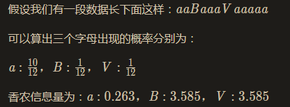
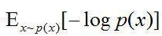
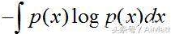
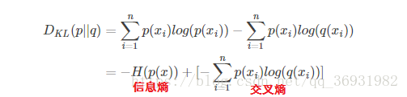
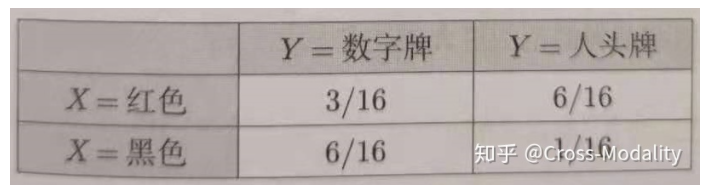

###### 公式

* -logx = log(1/x)

  > log(1/x) = log1 - logx = 0 - logx = -logx

###### 香农信息量

> 等号两个边只是两个等价的表达形式

> p(x) 为随机变量 X = x 处的概率

> 香农信息量用于表示如果要消除随机变量所处的不确定性所需的信息量大小, 单位为 比特 

> 所以一个事件的概率越大 , 其信息量越小

###### 信息熵

> 信息熵是整个概率空间上所有位置上的香农信息量的总和

> 公式中 相当于概率空间中所有点上的香农信息量的和
>
> 如果将所有点的香农信息量作为y轴, 画出曲线, 那么上式就可以看做是在求该曲线与x轴之间的面积, 因此可以转换为积分问题, 即等式最右边的 

> 信息熵用来衡量消除一个概率模型的不确定性所需的信息量

###### 相对熵(KL散度)

> 用于描述两个概率分布的相似性

> 相对熵越小, 两个概率分布越相近

###### 交叉熵

> 用于描述两个概率分布的差异性

> 交叉熵越小, 两个概率分布越接近

>  交叉熵为相对熵的简化形式

> 相对熵 = 信息熵 + 交叉熵

###### 边缘概率

> 单一一个条件的概率, 即为边缘分布, 比如 P(X=红色)=9/16

###### 联合概率

> 同时考虑多个条件的概率, 即为联合概率, 比如 P(X=红色, Y=数字牌)=3/16

###### 条件概率

> 首先根据条件重新筛选的到新的样本总量, 然后在该样本的基础上, 计算边缘概率
>
> 比如 P(Y=数字牌|X=红色)=3/9, 先选出 X=红色 的牌作为总样本, 然后计算 Y=数字牌 在这些样本中的概率

###### 线性变换/非线性变换

线性变换就是只改变旋转或者缩放原函数的图像, 不能使其变形, 线性变换就是导数为常数的变换

非线性变换就是对原函数图像进行形变, 除了 y=kx+b 之外的变换函数都是非线性变换

###### [拉格朗日乘子法](https://www.matongxue.com/madocs/939/)

用来求一个函数图像上距离原点最近点的方法

​		这个问题等价于，使用 函数f 作为约束，求得 另一个函数g 能够满足该函数约束时参数的最小取值

举例子
$$
f(x,y)=x^2y\\
g(x,y)=x^2+y^2+b\\
那么问题就是\\
在满足f的前提下，求b的最小取值\\
写作 \min\max{f}, \space s.t. \space g=0\\
这里的 s.t. 代表subject\ to,即满足该条件
$$
