# **机器学习**

> sklearn 使用python实现的了各种机器学习基本算法的包


## [模型评估](https://zhuanlan.zhihu.com/p/114391603)

#### 模型验证

>   关于 训练集、验证集、测试集


​		通常对于同一个问题，我们会选取多个候选模型

​		为了能够验证各个模型的泛化能力，从而选择一个最佳的模型，需要将数据分为训练集和测试集，将模型在训练集上训练，对训练完成的多个模型，在测试集上进行测试，根据测试结果对各个模型的超参数进行调整，最后选出最优的模型

​		此时由于该模型是拟合训练集和测试集后的结果，所以无法得知其在真实数据分布上的效果，因此需要在一开始的时候将数据分为 训练集，验证集，测试集，三个部分，其中 训练集和验证集用于模型选择和超参数调整，待到选择出来最优模型及其超参数后，记录该模型以及超参数

​		因为训练数据的大小决定了模型的能力强弱，所以最后使用该模型，固定超参数，重新使用 训练集+验证集 进行训练，使用 测试集 对模型进行评估

​		因为测试集不作为训练数据，其中的数据是模型从未见过的，也不曾根据测试数据进行拟合，所以模型在测试数据上的表现能够客观地反应模型的泛化能力


#### 交叉验证

​		对于上述方案，需要将总数据分为三个部分，如果总数据量很小，除去测试集，剩下的数据怎样划分为 训练集和验证集 都将是个问题：如果训练集小，那么必然造成模型能力差；如果验证集小，那么验证结果不能够真实全面地反映出模型的真实评分。

​		交叉验证即，除去总是需要单列的测试集，将剩下的数据多次划分为训练集和验证集，然后使用这些多组数据进行验证，取多次验证结果的平均值作为验证误差来优化模型，这就是所谓的 “交叉验证”

交叉验证的方法

*   留一法

    假设总共m个样本，每次取出一个作为验证集，进行m次交叉验证，取验证误差平均值确定是得进行m次交叉验证和训练，巨费时间

*   K折交叉验证

    说白了就是把样本均分为k份，取其中一份作为验证集，那么交叉验证次数为k

*   多次K折交叉验证

    跟k折方法一样，不同之处在于将k折验证重复多次，每次的区别仅仅在于均分数据的位置不同

*   蒙特卡洛交叉验证

    就是将普通的随机划分训练集、验证集、测试集的步骤重复几次，然后取几次的验证误差平均值


#### 性能度量

###### 均方误差

说白了就是将所有样本点的预测结果与实际结果之间的差值加起来


如果预测出来的结果是带概率的结果，那么就给每一项上乘以这个概率值


###### 错误率

就是 `错的个数/总的个数`


其中，代表后面括号里的成立则返回1, 否则返回0


###### 精度（正确率）

就是 `1-错误率`


###### 代价敏感错误率

上述的错误率将所有出错的情况都记为1, 如果实际问题中每种错误都有不同的权重，那么就需要在计算错误率时就应当考虑权重


这个公式本质上就是 `所有错误权重之和/总样本个数`


###### 查准率和查全率

>   查准率简称 P
>
>   查全率简称 R

比如有100个结果，都是1或0, 真实分布是 60个1 和 40个0

预测结果是 70个1 和 30个0

那么这预测出来的结果 70个1 中， 肯定有真正是1的，也有真实是0的

于是就有如下表格


然后根据公式计算差准率和查全率


PR反向变动


​		根据分布混淆矩阵得知，P 和 R 是反向变动的，即  P 增大时， R减小

​		比如，预测结果变为 80个1 和 20个0 时，相当于表格中垂直的分割线向右移动，此时FN减小，FP增大，那么 P 减小，R 增大

​		所以，P 和 R 随着判别标准阈值的变化而变化，我们需要选取一个合适的阈值得到对应的 P 和 R 来作为判别一个模型性能的标准


为什么要使用P、R？

​		对于判别5和非5问题，假设10个样本，其中只有一个样本是5, 那么模型只需要将所有结果都输出非5, 即可达到90%的正确率，这显然是不合理的

​		对于该问题，该模型的 P = 0, R = 0, 即可得知该模型并不ok


那么，如何选取合适的阈值并以此衡量一个模型的性能呢？

*   P 和 R 呈反向关系

    但是对于不同的问题，需要使用不同的思路来选择P 和 R的值，有些问题高P低R可能好一些，有些问题低P高R可能好一些，所以不能一概而论一味地选择高P高R

    

*   如果要选择高P高R，那么直接取平均数比较即可，$\frac{P+R}{2}$

*   但是对于倾斜数据的问题，如果模型恒给出高分布的选择，那么PR平均值将会很高，显然这个模型不是好的模型，这不合理

    所以就出现了一些其他的方法均衡考虑P和R值，比如f1值，无需担心它为什么叫f1值，没有任何特殊含义
    $$
    f1 = 2\frac{PR}{P+R}
    $$


利用P和R对多个模型性能进行比较

​		不同模型对应有不同的PR曲线，我们的原则是尽可能让 P 和 R 都较大，那么如下图


​		B曲线在R相同的情况下，P总是高于C曲线的值，那么就说明B模型总是优于C模型

​		而对于A曲线和B曲线，在不同的位置，它们的P和R的大小关系并不确定，此时可以根据曲线的面积等其他方式确定较优模型


TPR和FPR


​		由此可知，TP和TN是我们期望尽可能大的值，那么我们就希望 TPR 尽量的大，而FPR尽量地小

​		在判别阈值不断增大的过程中，预测结果中 TP 和 FP 也会随之增大，那么此时 TPR 和 FPR 都会增大，所以我们的衡量标准为，既然 TPR 和 FPR 都在增大，就选择 TPR 增速快而 FPR 增速的慢的模型

​		由此可以得出以下ROC曲线，其中应当选择阴影区域面积大的模型，为较优模型


###### ROC和AUC

上图，ROC为图中的曲线，AUC为曲线下面的阴影区域面积


###### rank-loss

`rank-loss=1-AUC`

rank-loss 就是上图中ROC曲线上面非AUC的区域面积


#### 假设检验

​		通常在模型训练完成后，会在测试集上计算其准确率，但是测试集毕竟不一定能够反映真实的数据集，那么如何检验在测试集上得到的这个正确率是否可信呢？

​		假设检验的方法就是，假设在测试集上得到的正确率是可信的，然后根据该正确率计算该模型预测结果的置信区间，最后再拿该模型对测试集进行测试，如果测试结果落到置信区间内，那么则认为该正确率可信

<span style='color:cyan;'>举例子</span>

​		对于一个模型，在测试集上得到的正确率是0.7，这意味着对于每个测试样例，都有0.7的概率预测正确，0.3的概率预测错误

那么，取十个测试用例, 预测正确10个的概率为 
$$
C^0_{10}(0.3)^0*(0.7)^{10}
$$
依次类推，预测正确9,8,7....个的概率为
$$
C^{1}_{10}(0.3)^1*(0.7)^{9} \\
C^{2}_{10}(0.3)^{2}*(0.7)^{8} \\
C^{2}_{10}(0.3)^{2}*(0.7)^{8} \\
...
$$
将这些概率计算出来，得到概率曲线，可以得知大致呈现正态分布，预测正确5个的概率最大


​		然后规定取90%为置信区间，也就是如果测试结果落在前90%的情况时，认为该正确率可信，否则不可信（因为后10%概率都很低几乎不能达到）


## 分类问题

​		分类问题面临的是离散的数据，需要给出的结果是离散范围内的值，直观来说，是找到分割不同分类的线，依次划分数据集


### KNN


​		事先给出几类数据的分布, 然后对新的数据进行分类时, 首先给定一个k值，然后算得这个新数据与原样本点所有的距离，选择最近的k个样本点，使用这k个样本点的分类给新数据点进行投票分类

缺点：需要计算跟每一个样本数据的距离 , 所以如果样本数据的大小很影响运行效率


###### 使用knn的电影分类案例

```python
#导包
import numpy as np
import pandas as pd
from sklearn.neighbors import KNeighborsClassifier

#加载数据
#只加载第一个sheet中的内容
movie = pd.read_excel('./knn表.xls',sheet_name=0)
movie

#取出决定类型的数据
X = movie[['武打镜头','接吻镜头']]
X
#取出分类结果数据
y = movie['分类情况']
y

#初始化一个分类器 , 设置使用投票的数据数量为 5
knn = KNeighborsClassifier(n_neighbors = 5)

#传入数据和分类结果训练分类器
knn.fit(X,y)

#对新数据进行分类
X_test = pd.DataFrame({'武打镜头':[100], '接吻镜头':[3]})
X_test
#返回预测的分类结果
knn.predict(X_test)
#返回预测分类的概率
knn.predict_proba(X_test)

#原理 : 分别求新数据与原来数据的距离, 然后从小到大排列, 然后取前n_neighbors的数据, 使用它们的 分类情况 进行投票, 最后返回票数最多的那个分类
```

###### 使用knn进行手写文字的识别

> 首先准备数据:  
>
> 10 个文件夹, 文件夹命名分别为 0 ~ 9
>
> 每个文件夹下存放该文件夹对应数字的类型为 bmp类型的手写数据文件500个 , 命名为 x_xxx.bmp , 这些文件应当都是黑白图

```python
import numpy as np
import matplotlib.pyplot as plt
%matplotlib inline
from sklearn.neighbors import KNeignborsClassifier

#读取数据
data = []
for i in range(10):
    for j in range(1,501):
        data.append( plt.imread('./%d/%d_%d.bmp' % (i,i,j)) )
        
data
len(data)
X = np.array(data)

#创建初始的分类数据
#前500个是0, 500~1000个是1, 以此类推
y = [0,1,2,3,4,5,6,7,8,9]*500
y = np.array(y)
y.sort()
y

#随机选4000个数据作为训练模型使用的数据
#随机选1000个数据作为测试模型使用的数据
#此时 X_train 是三维数据 , 而knn只接受二维的样本数据, 所以要把数据转换为二维的, reshape时第二个参数为图片的宽*高, 也就是将图片的二维数据转换为一维数据, 因为knn只是计算距离, 所以样本数据的二维信息对它来说没有用
index = np.random.randint(0,5000,size=4000)
X_train = X[index]
X_train = X_train.reshape(4000, [图片的宽*高])
y_train = y[index]

index = np.random.randint(0,5000,size=1000)
X_test = X[index]
X_test = X_test.reshape(1000, [图片的宽*高])
y_test = y[index]

#使用样本训练模型
#初始化分类器时, 可以调整 n_neighbors 来优化分类结果, 也可以设置 weights 方式来优化
#设置 p 指定使用的距离计量方式
knn = KNeighborsClassifier(n_neighbors = 5)
knn.fit(X_train, y_train)

#预测测试数据
y_ = knn.predict(X_test)
#对比预测结果和真实结果
y_[:20]
y_test[:20]
(y_ == y_test).mean()
knn.score(X_test, y_test)
```

###### knn准确率提升

```python
# 1. 调整分类器的参数

# 2. 归一化样本数据
# 如果样本数据各个属性的取值范围差距很大, 那么在求距离的过程中就相当于给这些属性加上了权重, 但是这并不是我们想要的, 因为每个属性的权重应当是一致的
#导包
from sklearn.preprocessing import StandardScaler
#获取归一化器
s = StandardScaler()
#归一化样本, X是样本数据
X2 = s.fit_transform(X)
X2
```


###### sklearn中的分割数据

> 将数据按照指定的比例随机分割为 训练数据和测试数据

```python
#导包
from sklearn.model_selection import train_test_split

#原数据
data = np.arange(100)

#分割数据
d_train, d_test = train_test_split(data, test_size=0.2)

#显示分割结果
display(d_train, d_test)
```

###### sklearn保存训练好的分类器

```python
#导包
from sklearn.externals import joblib

#存储模型为文件
joblib.dump(knn, './model')

#加载模型文件
model = joblib.load('./model')
model

#knn模型在保存时, 保存每一个样本点, 所以保存的文件较大
```

### Logistics 回归(LR)

>   针对二分类问题的方法，也可以扩展应用到多分类问题

$$
h_\theta(x)=\frac{1}{1+e^{-\theta^Tx}}\\
这里的{-\theta^Tx}就是分割线方程\\
将分割线方程简化为一个变量z\\
那么方程变为h_\theta(x)=\frac{1}{1+e^{-z}}\\
此时z为自变量，由此可见，z的正负决定了h_\theta(x)是否大于0.5,并依此给出分类结果
$$


​		本质是求得两个分类之间的分割线 ，然后大于该分割线的直接分为一类，小于该分割线的直接分为一类

​		这条分割线被称为“决策边界”


logistic回归时，损失函数如何确定？

​		在使用logistics回归时，最终的输出值为 0~1 范围内的值

​		显然，对于y=1的数据，期望输出的值应当是越接近1越好；对于y=0的数据，期望输出的值应当是越接近0越好

​		那么损失函数就应当依这个判断依据来定

​		在线性回归问题中，通常使用的是最小二乘法来确定损失函数，即
$$
J(\theta)=\frac{1}{m}\sum^{m}_{i=1}\frac{1}{2}(h_\theta(x^{(i)})-y^{(i)})^2\\
其中，h_\theta(x^{(i)})模型预测的结果，y^{(i)}为实际的结果
$$
​		在logistics回归问题中，可以简单地将 $h_\theta(x^{(i)})$ 替换为 logistics函数，然后计算 $J(\theta)$ 的导数，求其最小值

​		但是实际是，由于logistics函数是非线性函数，其导数不是凸曲线（non convex function），这就导致存在多个局部最优解，如果使用梯度下降法求解，将难以求得真正的最优解

​		所以对于logistics回归，应当选取其他的损失函数

​		首先将损失函数写成一种更通用的形式
$$
J(\theta)=\frac{1}{m}\sum^{m}_{i=1}Cost(h(\theta)^i,y^i)\\
再进行简化\\
J(\theta)=Cost(h(\theta),y)\\
$$
​		那么我们要替换的就是Cost部分，因为剩下的任务就是对 Cost函数 求导取最小值，进而求得各个 $\theta$ 的值

​		对于该问题，显然只要满足

*   实际结果是1, 预测结果越接近1， cost函数值越小，反之越大

*   实际结果是0, 预测结果越接近0， cost函数值越小，反之越大

    ​		那么给出较合适的Cost函数为如下，它不仅仅满足以上条件，而且还是凸曲线，不存在多个局部最优解
    $$
    Cost(h_\theta(x),y)={
    -log(h_\theta(x))\ \ \ \ \ \ \ \ if\ y=1  \atop  
    -log(1-h_\theta(x))\ if\ y=0}
    $$
    如果 y = 1，那么损失函数图像为，这意味着预测值越接近1, 损失越小，反之越大

    

    如果 y = 0，那么损失函数图像为，这意味着预测值越接近0, 损失越小，反之越大

    

    鉴于上述的损失函数组较为复杂，这里可以使用一种等价的形式来整合表达
    $$
    Cost(h_\theta(x), y)=-y\log(h_\theta(x))-(1-y)\log(1-h_\theta(x))\\
    因为y只有等于0或者等于1两种情况，所以该式子中总是只有一部分生效，\\那么就等同于上述函数组
    $$
    那么，此时的代价函数为
    $$
    J(\theta)=\frac{1}{m}\sum^{m}_{i=1}Cost(h(\theta)^i,y^i)\\
    =-\frac{1}{m}[\sum^{m}_{i=1}y^{(i)}\log(h_\theta(x^{(i)}))+(1-y^{(i)})\log(1-h_\theta(x^{(i)}))]
    $$
    To fit parameters $\theta$, we should :
    $$
    \min_{\theta}J(\theta)
    $$
    Then, we get parameters $\theta$, to make a prediction given new $x$:
    $$
    Output\ h_\theta(x)=\frac{1}{1+e^{-\theta^Tx}}
    $$

将逻辑回归应用到多分类问题


那么决策边界函数中的参数如何确定？


那么决策边界函数的形式如何确定，是使用二次多项式还是三次多项式？这是个问题


```python
#导包
from sklearn.linear_model import LogisticRegression

#获取❀花分类问题的数据
import sklearn.datasets as datasets
iris = datasets.load_iris()
iris
#150个拥有4个属性的样本
X = iris['data']
y = iris['target']
from sklearn.model_selection import train_test_split
X_train, X_test, y_train, y_test = train_test_split(X, y)
#使用Logistic模型训练数据
lg = LogisticRegression()
lg.fit(X_train, y_train)
y_ = lg.predict(X_test)
display(y_, y_test)
#查看各个分类的概率结果
lg.predict_proba(X_test)
#查看求解出的线性方程的系数
lg.coef_
```


## 回归问题

> 回归问题就是找出变量之间的函数关系, 然后使用这个函数对未来的值进行预测

回归问题预测的是连续的值，学习过程实质上是拟合曲线

**拟合** : 使用线性回归的方法求解通用函数的系数的过程, 就称为 拟合

**过拟合** : 求出的函数系数特别多, 或者系数特别大 , 那么函数不具有普遍适用性, 只有在数据的属性高度符合条件时, 才能给出相对正确的结果 , 就是学习特征的过程中学过头了.

换种方式理解 , 就是求出的函数顾虑了( 经过 )太多的样本点, 从而呈现出剧烈地不稳定性(百转千回), 而不是一条平滑的曲线或直线 , 这就使得系数们( 斜率 )变得很大,   那么在预测新数据时, 就不能很好的给出结果.

**函数正则化** : 对于求解出来的函数 , 如果各个系数波动很大, 那么这个函数则不稳定.

正则化就是压制各个系数. 从而防止出现过拟合的情况 , 使得求出的函数具有普遍适应性.


### 方法


###### 梯度下降法

​		计算损失函数的梯度，根据次梯度对参数进行调整，求得 预测函数 和 真实函数 的差值的二次方的最小值

​		梯度下降法对于优化问题更加通用，本质就是在一个正确的方向上一点点地试

>   **思路** : 在导数方向上进行固定步幅的移动, 越接近最值, x每次移动的值就越小( 因为导数会越来越小 ), 当x单次移动的值小于设定的值时, 即为近似的最值

**实现** : 首先函数是一元二次函数, 

​	在函数上随机选择一个点, 设置导数方向每次移动的步幅 step, 设置一个精确度 p, 即当 x 单次移动量不超过这个值时, 终止移动

​	 然后无限循环, 每一次使得 x 移动导数方向上 step 距离对应的 x 的距离 , 直至 x 单次移动的值小于精确度 , 终止循环, 此时 x 即为近似的结果

**关于 step** : 不能设置太大, 否则会跨过最值从而导致 x 无限增大

在sklearn的 LinearRegression 中, 如果设置了求截距, 那么它会使用梯度下降的方法求截距和参数.


###### 直接方程法

​		将特征值写为特征矩阵的形式，将样本结果写成结果向量的形式，根据公式直接计算求得最优的参数，公式为
$$
\theta=(X^TX)^{-1}X^Ty\\
这里的\theta为要求的最优拟合方程中的参数
$$
​		可见，直接方程法仅仅适用于线性回归来拟合曲线的问题，得到的是曲线的参数值

​		对于特征数量较少（少于1w）时，使用直接方程法的效率通常高于梯度下降法，因为求矩阵X和X转置矩阵乘积的逆矩阵这一步骤，时间复杂度是 O(n^3)，n是特征值个数

​		反之，梯度下降法效率更高


当然，$X^TX$ 这一部分可能是不可逆矩阵，此时就无法成功计算得到结果，那么怎样的情况可能导致该部分不可逆？

*   存在多余的属性

    比如房子的宽度（米），房子的宽度（分米），此时这两个属性就是多余的属性，它们严格按照1：10的线性关系存在，此时会因为存在多余属性使得无法计算逆矩阵

*   太多的属性值个数，而太少的样本个数

    假设有100个属性值，只有10个样本，也就是要用10个方程组求得100个未知数，这显然是不可能的

    对于这种情况，可以删除多余的属性值

    或者利用正则化操作，这将允许使用少量样本求得大量的参数值


### 线性回归(Linear R)

#### 方法 : 矩阵运算求函数

> 假设样本有 n 个属性 , 那么线性回归求出来的函数就是 n 元一次方程 , 线性回归计算器返回的目标方程系数就有 n 个
>
> 换一个思路 : 这个求得的 n 个系数就是这 n 个属性的权重

```python
#导入sklearn 中自带的数据集
import sklearn.datasets as datasets

#获取波士顿房价数据 , 这个数据集属于回归问题数据集, 因为样本结果不是有限个分类, 而是无限个数字
data = datasets.load_boston()
data

#获取样本值
X = data['data']
X.shape

#获取样本对应的结果
y = data['target']
y.shape

#导入线性回归工具包
from sklearn.linear_model import LinearRegression

#分割数据为样本数据和测试数据
from sklearn.model_selection import train_test_split
X_train, X_test, y_train, y_test = train_test_split(X,y, test_size=0.1)

#创建一个线性回归计算器 - 用来计算 x 和 y 之间的函数关系
#设置 fit_intercept = False , 设置计算出来的函数不包含截距, 也就是函数过原点
lr = LinearRegression(fit_intercept = False)

#使用线性回归计算器计算目标函数
lr.fit(X_train, y_train)

#预测测试数据的结果
lr.predict(X_test).round(2)

#对比真实结果
y_test

#查看求出的线性函数的参数, 这里样本数据有 13个属性,这个返回的参数列表就有 13 个元素
W_ = lr.coef_
w_

#查看结果函数的截距, 前面设置了不要截距, 那么返回的就是0
b_ = lr.intercept_
b_

#实际上 lr.predict() 就相当于系数矩阵 w_ 乘 测试的数据
X_test.dot(w_)
```

### Ridge 回归(Linear R+L2)

​	The meaning of "Ridge" is a function of sklearn, it combins LinearRegression and L2 regularition

> **Ridge回归就是使得求出函数的系数变小的线性回归方法**
>
> **Ridge回归是 线性回归的优化算法 , 是实现了L2正则化的线性回归算法**
>
> **L2正则化** : 在最小二乘法的损失函数基础上, 添加一个系数和的二次方 , 使用该二次方项来约束目标函数的系数使其变小

```python
#导包
import numpy as np
from sklearn.linear_model import LinearRegression, Ridge
import sklearn.datasets as datasets

#使用内置的波士顿房价数据
boston = datasets.load_bostom()
X = boston['data']
y = boston['target']

#切割数据
from sklearn.model_selection import train_test_split
X_train, X_test, y_train, y_test = train_test_split(X,y, test_size=0.2)

#使用线性回归
lr = LinearRegression()
lr.fit(X_train, y_train)
display( lr.coef_, lr.score(X_test, y_test) )

#使用Ridge回归
#alpha 设置求解回归函数的方程中的 a 的值, 具体如何求解可在 sklearn 官网查看
#tol 设置精确度
#max_iter 设置最大迭代次数
ridge = Ridge(alpha=10)
ridge.fit(X_train, y_train)
display(ridge.coef_, ridge.score(X_test, y_test))

#对比两个回归方式得出的 coef_ , 可发现 Ridge 回归中的 coef_ 相对更接近于 0 
```

### Lasso 回归(Linear R+L1)

> **Lasso回归是 线性回归的优化算法 , 是实现了L1正则化的线性回归算法**
>
> **L1正则化** : 在原最小二乘法损失函数的基础上, 添加了系数和的一次项, 使用这个一次项来约目标函数使其系数***归零***或减小

```python
#导包
import numpy as np
import matplotlib.pyplot as plt
%matplotlib inline
from sklearn.linear_model import LinearRegression, Ridge, Lasso

#生成数据
#有200个属性的样本50个
X = np.random.randn(50,200)
X
#生成系数w
w = np.random.randn(200)
w
#随机选择190个系数使其为0
index = np.arange(200)
np.random.shuffle(index)
index
w[index[:190]] = 0
w
#生成目标值 y
y = X.dot(w)

#分别使用三种回归方式求系数
lr = LinearRegression(fit_intercept=False)
ridge = Ridge(alpha=1, fit_intercept=False)
lasso = Lasso(alpha=0.1, fit_intercept=False)

lr.fit(X,y)
ridge.fit(X,y)
lasso.fit(X,y)

#得到三种回归方式求得的系数
lr_w = lr.coef_
ridge_w = ridge.coef_
lasso_w = lasso.coef_

#将真实系数和三种方式求得的系数画图表示
plt.figure(figsize= (12,9))
ax = plt.subplot(2,2,1)
ax.plot(w)
ax.set_title('真实系数')

ax = plt.subplot(2,2,2)
ax.plot(lr_w)
ax.set_title('线性回归')

ax = plt.subplot(2,2,3)
ax.plot(ridge_w)
ax.set_title('ridge回归')

ax = plt.subplot(2,2,1)
ax.plot(lasso_w)
ax.set_title('lasso回归')

#对于该问题,因为真实系数属于稀松矩阵,大部分都是零, 而lasso回归将大部分系数都归为0, 所以在该问题中, lasso表现更好
```


### Eg: 回归算法人脸补全

```python
#导包
import numpy as np
import matplotlib.pyplot as plt
%matplotlib inline
from sklearn.linear_model import LinearRegression, Ridge, Lasso
#使用knn求解线性函数的模型
from sklearn.neighbors import KNeighborsRegressor
import sklearn.datasets as datasets

#获取数据
faces = datasets.fetch_olivetti_faces()
faces
data = faces['images']
#400张64*64的图片
data.shape

#随机选择一张图片预览
index = np.random.randint(400,size=1)[0]
plt.imshow(data[index], cmap=plt.cm.gray)

#上下分割这400张图片, 上半部分作为 X 样本数据, 下半部分作为 y 目标数据
#然后将数据改成二维的方便之后训练
X = data[:,:32].reshape(400,-1)
y = data[:,32:].reshape(400,-1)

#分割数据为训练数据和测试数据
from sklearn.model_selection import train_test_split
#保留10条数据作为测试数据
X_train, X_test, y_train, y_test = train_test_split(X, y, test_size = 10)
X_train.shape

#随机选择一张图片预览上下分割效果
index = np.random.randint(390,size=1)[0]
face_up = X_train[index].reshape(32,64)
face_down = y_train[index].reshape(32,64)
ax = plt.subplot(1,2,1)
ax.imshow(face_up, cmap=plt.cm.gray)
ax = plt.subplot(1,2,2)
ax.imshow(face_down, cmap=plt.cm.gray)

#分别使用四种回归算法进行函数的计算
es  = {}
es['knn'] = KNeighborsRegressor(n_neighbors=5)
es['lr'] = LinearRegression()
es['ridge'] = Ridge(alpha=1)
es['lasso'] = Lasso(alpha=1)
predict_ = {}
for key, model in es.items():
	model.fit(X_train, y_train)
	y_ = model.predict(X_test)
	predict_[key] = y_
    
#显示各种算法预测的结果 10行6列
plt.figure(figsize=(6*2, 10*2))
for i in range(10):
    #第一列 , 真实的整个人脸
    ax = plt.subplot(10, 6, 1+i*6)
    face_up = X_test[i].reshape(32,64)
    face_down = y_test[i].reshape(32,64)
    ax.imshow(np.concatenate([face_up, face_down], axis=0),cmap='gray')
    ax.axis('off')
    ax.set_title('true')
    
    #第二列 , 上半个人脸
    ax = plt.subplot(10, 6, 2+i*6)
    face_up = X_test[i].reshape(32,64)
    ax.imshow(face_up ,cmap='gray')
    ax.axis('off')
    ax.set_title('face_up')

    #3,4,5,6列, 各种算法预测的下半张人脸
    for j,key in enumerate(predict_):
        ax = plt.subplot(10, 6, 3+j+i*6)
        y_ = predict_[key]
        face_down_ = y_[i].reshape(32,64)
        ax.imshow(np.concatenate([face_up, face_down_], axis=0), cmap = plt.cm.gray)
        ax.axis('off')
        ax.set_title(key)
        
```


## 聚类问题

>   无监督分类问题


#### [K-means 聚类](https://zhuanlan.zhihu.com/p/78798251)


> 1. 打算把一堆点分成 k 类
> 2. 先随机选 k 个点 , 将这 k 个点周围离它相对近的点分为一类
> 3. 将生成的几个类别中的重心点作为这一类的中心点, 再次按照周围离它较近的点划分为一类
> 4. 循环以上两步最终将得到分类


算法调优

*   数据归一化，标准化
*   模型受异常点影响大，因此事先做异常点检测
*   如果在当前维度无法进行建模，使用核函数将特征映射到高维空间

K值选择

*   手肘法，计算不同K值时，对应模型中距离总和，得到曲线图，取手肘处的K值

    

*   Gap statistic

    

    

足球队梯队聚类

```python
#上图为使用到的数据集 , 读取到 data 变量中
#使用 k-means 对足球队水平进行聚类
from sklearn.cluster import KMeans

X = data.iloc[:,1:]
#创建聚类算法
#n_cluster 设置分为几类
kmeans = KMeans(n_cluster=3)
#fit数据, 没有标签, 不需要y
kmeans.fit(X)
#查看聚类结果
y_ = kmeans.predict(X)
y_
#分为三类, 分别是 0, 1, 2
for i in range(3):
    print((data['国家'].values)[np.argwhere(y_==i).ravel()])
```

```python
import sklearn.datasets as datasets

#生成三个聚类的每个元素包含两个特征值且总数为100个的样本点
X,y = datasets.make_blobs()
plt.scatter(X[:,0], X[:,1], c=y)

#使用kmeans进行聚类, 如果设置的分类数不符合样本数据本身的分类情况, 那么多次执行聚类会发现其分类结果都不相同
kmeans = KMeans(5)
kmeans.fit(X)
y_ = kmeans.predict(X)
plt.scatter(X[:,0], X[:,1], c=y_)

#使用轮廓系数来评价聚类得分, 分越高越好
from sklearn.metrics import silhouette_score
silhouette_score(X, y_)
```


#### 密度聚类(DBSCAN)

>   extend

​		选取起始点，以该点为圆心，做指定半径的圆形，在圆形范围内的样本点被标记为一类，且不断画圆扩张，直至所有扩张点包含的样本点数量小于给定阈值


#### 层次聚类

每次将距离最近的点分为一类，并更新聚类的中心位置，多次聚类合并，直至聚为一类

在某层聚类中进行截取，可以获得任意分类数的聚类结果


## [EM算法](https://zhuanlan.zhihu.com/p/78311644)

>   Expectation Maximization Algorithm 期望最大算法

​		在使用最大似然估计预测模型时，如果需要同时对多个样本进行预测，进而得到多个最大似然估计函数，但是此时提供的样本集中，又缺失了属于哪个样本集的标签，此时可以使用EM算法，迭代优化求出各个最大似然估计函数

​		例如，有两个硬币，每次随机选择一枚硬币抛十次，记录每次的正反面比例，在多次实验后，将分别得到硬币1和硬币2的样本数据，由于抛硬币事件为伯努利事件----只有两种可能，那么此时可以通过实验结果来估算每个硬币每次抛出时，结果为正面的概率，如下图，可以很容易求出硬币一的正面概率为0.8, 硬币二的正面概率为0.45


​		但是，如果此时不知道每次实验是来自于哪个硬币呢，此时得到的样本集为下图，这就相当于给最大似然估计添加了隐变量


​		此时，可以使用EM算法，迭代优化得到真实的硬币一参数和硬币二参数

1.  首先给硬币一和硬币二分别随机一个参数，比如

2.  然后计算在该参数下，每次实验结果来自于硬币一和硬币二分别的概率，然后得到每次实验中来自各自硬币的概率

    

    

3.  假设每次实验中，实验结果来自于两个硬币的结果之和，它们按照上面计算的概率各自贡献正面次数和反面次数，进而计算当前概率下，每次实验每个硬币的贡献次数

    

    得到每次实验各自的贡献值，总结为下表

    

4.  根据上个步骤中得到的新的正反分布结果，可以重新计算各自的参数

    

5.  重复上述步骤，迭代至收敛


## 决策树

### 信息熵

>   信息熵用来衡量信息的确定情况
>
>   具体来说，信息熵就是用来形容一个随机事件模型等同于抛几个硬币的问题，比如信息熵为 1bit 则相当于抛一个硬币的问题

***如何衡量事件的信息熵***

*   等概率事件

​		比如我去买一个瓜，且我并不了解如何挑一个好瓜，那么我买到好瓜的概率就是一半，1/2，这个问题等价于抛一个硬币，此时正反的几率是相同的，都是 50%，此时该事件的信息熵就是 1bit

依次类推，存在4种等可能情况的事件，等同于抛两个硬币问题，那么它的信息熵就是 2bit

由此得出，在等概率事件中，信息熵的计算方式为 
$$
n = log_2^m  (m是等概率事件的个数)
$$


*   不等概率事件

    ​		不等概率问题可以转换为等概率问题

    ​		比如问题中有三种事件，A:1/2, B:1/3, C:1/6, 那么它们可以等价为6个等概率事件，如下图，每个不等概率事件或多或少相当于多个等概率事件 

    

    那么 A事件，B事件，C事件包含的信息熵分别为
    $$
    n_A = \frac{1}{2}(log_2^6-log_2^3)=\frac{1}{2}log_2^{\frac{6}{3}}=-\frac{1}{2}log_2^{\frac{3}{6}}=-\frac{1}{2}log_2^{\frac{1}{2}}\\
    n_B = \frac{1}{3}(log_2^6-log_2^2)=\frac{1}{3}log_2^{\frac{6}{2}}=-\frac{1}{3}log_2^{\frac{2}{6}}=-\frac{1}{3}log_2^{\frac{1}{3}}\\
    n_C = \frac{1}{6}(log_2^6-log_2^1)=\frac{1}{6}log_2^{\frac{6}{1}}=-\frac{1}{6}log_2^{\frac{1}{6}}=-\frac{1}{6}log_2^{\frac{1}{6}}
    $$
    那么该事件总的信息熵为 
    $$
    n = n_A+n_B+n_C = -\sum_{k=1}^{|y|}p_klog_2^{P_k}
    $$


***通过信息熵量化信息***

​		既然信息熵是用来形容一个事件模型包含多少确定因素，那么对于一个问题，在对其提供一条信息的前后，其信息熵是不同的，此时可以使用前后两个信息熵之差来量化该信息的容量

举例子

​		一道有ABCD四个选项的选择题，在什么都不知道的情况下，四个选项的概率都是 1/4，此时计算得知信息熵为 2, 然后提供一条信息：“C选项的概率是1/2”，那么此时计算得知信息熵为 1.79, 那么该条信息的容量为 `2-1.79=0.21`


***通过量化信息生成决策树***

​		分别计算每类信息的信息容量，依次从大到小作为生成决策树的分支条件，每个分支都是一个属性，直至分至叶子节点，得到最终分类结果


### 基尼系数

​		基尼系数用来衡量一个属性对分类结果的作用程度，因此可以通过计算比较基尼系数然后生成决策树

举例子

有三个属性用来判断是否得了心脏病


​		然后根据统计，可得知，根据不同属性的值，可以将数据进行分类，显然如果经过某个属性进行划分后，如果是否得了心脏病被清晰地划分在不同的部分，那么该属性对分类结果的作用就大


​		基尼系数就是计算一个经过属性一个属性的分类后，数据被正确划分的程度，具体来说


$$
基尼系数 = 在一批分类结果中（上图的绿色块）随机选择两个样本，它们不同的概率\\
=1-（在一批分类结果中随机选择两个样本，它们相同的概率）\\
比如对于左上角绿色块\\
=1-[(\frac{105}{105+39})^2+(\frac{39}{105+39})^2]\approx0.39
$$
​		

​		由此可得，一个属性的基尼系数越大，代表根据它划分后的数据越不纯，所以应当依次选择较小的基尼系数属性来生成决策树


### id3生成决策树

根据信息熵的思想，熵越大，代表数据越无序，那么可以使用这个准则计算每个特征进行分支时带来的信息增益

每次计算所有特征的条件熵，也就是使用该特征生成新的分支后，样本集的信息熵，计算每个特征作为决策树时的信息增益，使用信息增益最大的特征作为下一个分支

当前数据集的信息熵为下图，也就是各类样本子集的信息熵之和


条件熵的计算方式如下图，也就是使用该特征进行分类后，各个子集的信息熵之和


最后，计算各个特征的信息增益


这是最基本的决策树生成思想，缺点在于


其中，第二条缺点，如果某个特征为编号性质，那么会存在很多个分类，使用这个特征作为分支计算条件熵时，将会得到 $\frac{|D_i|}{|D|}$ 接近0, 此时条件熵接近0, 那么得到的信息增益约等于原本的信息熵，将会特别大，导致总是优先使用该特征生成新的分支，这就是一个 bug


### c4.5生成决策树

C4.5在id3的基础上进行改进，克服id3的缺点

1.  分支生成算法改进

    id3的信息增益计算方式会偏袒于编号属性，c4.5中使用信息增益率进行辅助判断

    ​		信息增益率为下图，其中如果特征类别越少，$D_i$ 越大，那么 $\frac{|D_i|}{|D|}$ 和 $log_2{\frac{|D_i|}{D}}$ 都会越大，那么 $H_A(D)$ 就越小，此时得到的信息增益率就越大，这意味着信息增益率对类别少的特征有偏好

    

    ​		判断的流程为：先计算所有特征的信息增益值，然后选出高于平均值的特征，最后计算这些候选特征的信息增益率，选择信息增益率最高的作为生成分支特征

2.  使用后剪枝策略防止决策树过拟合

3.  对于连续取值的特征，选择每个取值之间的值作为划分点，每个划分点之间的样本为被该特征分为一类的子集，进而可以计算条件熵

4.  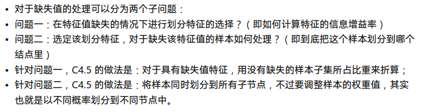

该方案的缺点如下


### [CART生成决策树](https://zhuanlan.zhihu.com/p/145215188)

CART算法是继续id3和c4.5之后的一种生成决策树方法，是sklearn中使用的生成决策树算法

CART算法生成的决策树为二分树，使用后剪枝方案

<span style="color:cyan;">CART算法即可以生成回归树，也可以生成分类树</span>

*   <span style="color:pink;">生成回归树</span>

    >   ​		回归树说白了就是生成的决策树中，每个叶子节点代表一个小的x取值范围，当给到这个范围内的x时，返回对应的y值，树分得越细，得到的回归结果越精细

​		假设样本分布如图中黄色的点，该样本可以使用决策树来表示，那么如何确定决策树中每个分支的阈值？

​		CART算法，就是从0开始作为阈值（y轴，绿色的线），计算得出每个阈值下其他所有黄色的点到绿色线的直线距离之和（均方差），取均方差最小的阈值作为决策树分叉条件，该思想等同于线性回归，就是计算能将数据分为两部分的最佳直线


*   <span style="color:pink;">生成分类树</span>

1.  生成判别标准

    之前的生成方法使用信息增益（率）作为生成节点的判别依据，这其中要涉及到很多的log运算，非常消耗性能

    在CART中该用基尼系数作为生成依据，省去了大量运算，且获得了更高的生成正确率

    基尼系数为下图

    

    ​		在实际的应用时，因为CART只有二分类节点，所以使用二分类下的条件基尼系数，也就是计算二分类后的两个子集的基尼系数之和

    

    

<span style="color:cyan;">[CART剪枝--代价复杂度剪枝](https://blog.csdn.net/moxiaoxuan123/article/details/81414479)</span>

1.  ​		计算所有子树的损失值，以及该节点的损失值。计算方式如下，其中 $T$ 代表子树的节点个数，$\alpha$ 代表惩罚变量，$C_\alpha(T)$ 代表该子树的损失值，$C_\alpha(t)$ 代表去除子树后，该节点的损失值

    

    

    ​		可以得知，当 $\alpha $ 为 0 时如下，因为对于同样的训练数据，子树的损失值肯定比单个节点的低

    

    ​		但是，因为惩罚部分的存在，随着 $\alpha$ 的增大，两者的损失值都会增大，但是子树的损失值增速更快，因为它带有更高的惩罚部分

    ​		因此，在 $\alpha$ 增大的过程中，必定存在一个 $\alpha$ 的值，使得子树的损失值等于节点的损失值，那么此时有

    

    ​		将这个临界值 $\alpha$ 计为 $g(t)$，那么可以想象得到，花了越大的 $\alpha$ 才使得相等的，说明得给子树施加很大的惩罚才能使其效果等同于节点效果，这意味着将子树替换为节点后，决策树会得到很高的正确率损失，这种子树显然就不适合被剪枝

    ​		而那些稍微增大 $\alpha $ 就使两者相等的，说明子树并没有多少优势，这些应当被剪枝，因此，计算所有节点的临界值 $\alpha$ ，然后去掉最小的子树，作为备选树 $T_1$

2.  在 $T_1$ 的基础上，重复步骤一，不断剪枝得到 $T_1,T_2,T_3...$，直至只剩根结点，此时这些 $T$ 作为备选树

3.  使用交叉验证的方式，对备选树 $T$ 进行比较，选择正确率最高的树，作为最终生成决策树


<span style="color:cyan;">CART缺失值处理</span>

1.  首先忽略缺失值，计算每个特征的分裂增益，如果得到的最大收益分裂特征包含缺失值，那么选择无缺失值且分裂收益最大的特征进行分裂，这种情况下，最终用来分裂的特征被称为<span style="color:cyan;">代理特征</span>

2.  如果所有特征都包含缺失值，或者不包含缺失值的特征中无法得到与最高收益满足预期差距的特征，那么选择最大收益的特征作为分裂节点，然后将特征缺失样本归到个数最大的节点中

    

    


### [id3,c4.5,CART比较](https://zhuanlan.zhihu.com/p/85731206)


### 决策树集成学习

​		集成学习通过结合多个模型，能够提供较单个模型更好的预测结果，本质上是改善了模型的 <span style="color:cyan;">bias</span> 和 <span style="color:cyan;">various</span>，有三种思路

*   Bagging, 将训练数据分为多个部分，同时训练多个基模型，然后使用所有模型同时预测，投票决定输出结果
*   Boosting, 按照顺序依次训练多个基模型，后一个基模型在前一个模型的基础上进行训练，最后综合多个模型的给出输出结果，综合的方式通常为加权法
*   Stacking，先将训练数据分为多个部分，同时训练多个基模型，然后使用所有模型对每个样本进行预测，使用给出的多个预测值作为样本新的特征值，使用新的特征值训练一个模型，使用最后的模型的输出作为预测结果

集成学习模型的 bias 和 various 可根据每个基模型的期望（bias）和偏差（various）来计算


#### 思路：Bagging


#### 思路：Boosting


#### 随机森林

随机森林的步骤


​		这里的随机选择特征是指每个树都根据随机分配到的样本进行生成，因此它们选择的分支特征都是不尽相同的


#### [AdaBoost](https://zhuanlan.zhihu.com/p/27126737?utm_source=wechat_session&utm_medium=social&utm_oi=1044170377731248128)

​		AdaBoost 使用集成学习的思路，先后训练多个个体学习器，期间根据分类结果不断调整样本权重，最后将多个分类器结果集成起来，达到较高的准确率

1.  初始每个样本权重相同，每个分类器的重要程度相同
2.  训练一个分类器，基于最大正确权重比例的原则，使用阈值一刀切的方法进行分类，将样本分为两类
3.  查看第一个分类器的错误样本，提升这些被分类错误样本的权重
4.  训练第二个分类器，基于最大正确比例的原则，使用阈值一刀切的方法进行分类，将样本分为两类
5.  查看第二个分类器的错误样本，提升这些被分类错误样本的权重
6.  ……循环往复训练多个分类器
7.  将 所有分类器的重要程度 乘 其对某个数据的分类结果给出对该数据的最终分类结果


> ​		首先设置样本数据中每个属性的权重都相同, 生成第一个决策树, 然后多次迭代生成决策树, 每次迭代都根据上一次的分类结果将属性权重进行调整 ,  最后将这些决策树按照权重线性组合成为一个最后的决策树作为分类器输出


```python
from sklearn.ensemble import AdaBoostClassifier
#from sklearn.model_selectin import cross_val_score

ada = AdaBoostClassifier()
ada.fit(X_train, y_train)
ada.score(X_test, y_test)
```


#### GBDT梯度提升决策树 

>   Gridient Boosting Decision Tree，可以处理分类问题, 也可处理回归问题

>   ​		构建多个根据不同属性进行分类的深度为1的决策树, 每个树中的每一种分支对应一个值, 处理回归问题时, 将数据遍历经过每一个树的到的结果加起来返回为预测值.

回归问题生成过程

1.  根据样本集训练得到模型1, 将模型1的预测结果与实际的样本数据做差得到残差数据
2.  根据残差数据训练模型2, 将 `模型1+模型2` 的预测结果与残差数据做差得到新的残差数据
3.  不断重复上述两步，使用新的残差数据训练多个模型
4.  最终将多个模型结合到一起


第一次拟合模型


第一次残差数据以及残差数据拟合

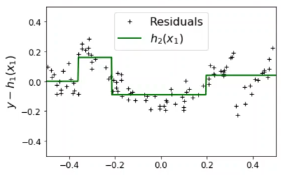

将模型1和模型2相加得到新的残差数据


根据再次残差数据训练模型3


最终将所有模型相加作为最终模型


```python
#处理回归问题
from sklearn.ensemble import GradienBoostingClassifier
from sklearn.ensemble import GradienBoostingRegressor
from pandas import Series, DataFrame

#准备数据, 两个属性, 使用这两个属性回归计算用户的年龄 
X = DataFrame({'购物':[500,500,1500,1500], '是否百度回答': [0,1,0,1]})
y = np.array([14,16,24,26])

#使用梯度提升决策树回归
gbdt = GradienBoostingClassifier()
gbdt.fit(X,y)
#生成的决策树们
gbdt.estimators_
```


#### XGBoost

##### XGBoost 思想

>   ​		Xgboost 本质是一种 boosting 的方法，是一种基于累加函数建模的思路，基模型不一定是决策树

> 对梯度提升决策树的改进
>
> 可处理分类问题和回归问题
>
> 使用该算法需要 pip install XGBoost
>
> 使用方法同 sklearn 中各种分类器的使用

XGBoost 是一个由 k 个基模型组成的加法运算式


因为使用函数式表达，所以损失值为所有样本的损失值之和


那么模型的代价函数为 $损失值+正则项$


因为是 boosting 模型，所以后一个模型的预测值等于前一个模型预测值加上当前模型预测值


那么此时代价函数可以表示为


此时要优化当前模型，就是优化  使得 代价 尽可能得小

>   根据泰特展开式 


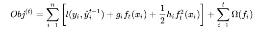


假设损失函数为平方损失函数，即 =

那么此时的 $g_i$ 和 $h_i$ 分别为


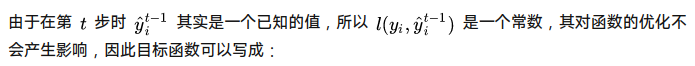

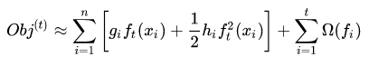

那么此时只需要优化上面这个代价函数，得到最优的 $f_t(x_i)$ 即为当前模型的函数

至此，我们已经得知的有，想要优化当前基模型的函数，那么需要事先计算前一个基模型函数的 ==一阶导数== 和 ==二阶导数==

XGBoosting 是一个函数累加模型方法，本质思想在于 ==将代价函数近似为二阶泰勒展开式==，然后优化得到当前基模型函数，最后将所有基模型的预测结果加到一起作为预测结果输出


##### XGBoost 决策树

>   ​		前面提到，XGBoost 只是一种利用了泰勒展开式进行优化的累加函数模型，它的基模型可以是任意可由函数表达式表达的模型，这里使用决策树作为基模型构建XGBoost模型

首先将决策树表示为函数形式


定义决策树正则项为如下


将决策树函数表达式和正则项代入代价函数，得到当前决策树基模型的代价函数为


​		从第二步到第三步是因为，第二步是在遍历所有样本的损失值，然后计算损失值之和，因为在决策树中每一条样本最后会落到叶子节点上，所以遍历所有叶子节点上的样本值，计算它们的损失和等同于原本的操作，因此可以替换为遍历每个叶子节点

因为每个叶子节点会包含0~n个样本，所以需要依次遍历每个叶子节点上的每个样本求其损失值，$\sum_{i \in I_j}$ 代表每个叶子上的多个样本

上图第二步和第三步中间差了一步
$$
=\sum_{i=1}^n[g_iw_{q(x_i)}+\frac{1}{2}h_iw^2_{q(x_i)}]+\gamma T+\frac{1}{2}\lambda \sum^T_{j=1}w_j^2 \\
=\sum_{j=1}^T[(\sum_{i \in I_j}g_i)w_j+\frac{1}{2}(\sum_{i \in I_j}h_i)w^2_j]+\gamma T +\frac{1}{2}\lambda \sum_{j=1}^Tw^2_j\\
=\sum^T_{j=1}[(\sum_{i \in I_j})w_j+\frac{1}{2}w^2_j(\sum_{i \in I_j}h_i+\lambda)]+\gamma T
$$


​		至此，已经有了量化用来构建XGBoost模型的基模型决策树的标准，即上述 $Obj$ 代价函数，接下来就是如何去生成一颗决策树

>   Xgboost 支持两种分裂节点的方法——贪心算法和近似算法

1.  贪心算法

    每次分裂时枚举所有候选特征的最佳分裂点

    其中涉及依次遍历使用每个特征作为节点特征时，最佳的分裂位置，以及所有候选特征的最佳分裂点，最后比较所有特征的分裂收益，最后选择分裂特征以及分裂点

    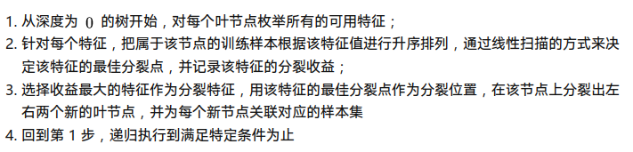

    

    根据分裂收益的公式定义，我们可以得知，如果要计算一个节点的分裂收益，只需要计算分裂后样本子集在前一个模型的 ==一阶导数之和G== 以及 ==二阶导数之和H== 即可

    那么，每次进行分裂时，只需要线性扫描，依次计算每个样本的 ==一阶导数值== 与 ==二阶导数值==，将它们保存下来，然后选择最佳的分裂点即可

    

    对于某些分裂，可能带来的最佳分裂特征不如不分裂，那么此处不分裂

2.  近似算法

    在贪婪算法中，需要一次性计算并保存所有样本的导数值，对于大样本，这样的方案会被内存大小限制而无法进行，因此可以使用近似算法，仅计算和保存大致的分裂

    <span style="color:cyan;">将数据近似得分为n个桶，在每个范围内的样本属于一个桶，对该桶计算导数并保存，在该桶中的样本都使用所在桶的导数值，这样来看，内存的占用大小取决于分桶的个数</span>

    

    

    


事实上，根据公式可证明，==二阶导数== 对代价值有权重的作用，因此在实作中，在分桶时应当考虑二阶导数进行分桶


XGBoost对缺失特征值的处理


其他优化

*   块预先存储

    事先对每个特征值进行排序，保存到块结构中，然后每个样本指向其梯度统计索引，在分裂时，可以使用多线程同时计算不同特征的分裂收益，提高分裂效率

    

*   梯度缓存优化

    为每个线程新建梯度值缓存区，存放所有导数值，提高查找效率

    

*   块读取加速

    使用额外的线程读取硬盘上的块数据

    

*   块压缩与解压，尽量减少因为内存不足而把块存储到硬盘上的情况

*   块拆分，能够同时从多个硬盘上读取，减少IO时间

    

XGBoost优缺点


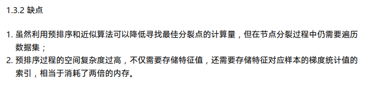


#### LightGBM 决策树

> 微软开发的, 对梯度提升决策树的改进
>
> 使用该算法需要 pip install lightgbm
>
> 使用方法同 sklearn 中各种分类器的使用


### 决策树过拟合--剪枝

决策树过拟合的原因可能有

1.  样本噪声过大，导致模型过分拟合了噪声的分布，而不能拟合样本的真实分布
2.  样本过少，或者抽取样本的方式不对，导致样本不能反映数据的真实分布
3.  建模时使用了过多的不相关输入变量，导致模型不是在对样本进行拟合

应对决策树过拟合的方法

1.  先剪枝--early stop，这种方法在生成决策树的过程中就防止树过度生长而造成过拟合，具体的策略可以分为以下几种

    *   限制树的高度
    *   限制节点的样本数量，当节点样本数据量小于阈值时，该节点停止继续生长
    *   定义增益阈值，当某个节点的最优子树相对于无子树时的增益小于阈值时，停止对该节点的增长

2.  后剪枝--两阶段的树生成方法，先生成完整的决策树，然后使用如下策略进行剪枝，剪枝过程为，逐个删除子树，对比与之前的性能，如果减去子树后性能不比之前差，那么减去子树

    *   REP剪枝，将样本分为训练数据与验证数据，使用训练数据生成决策树，然后使用验证数据剪枝

        这种方法能够去除训练数据中的随机噪声误差，毕竟在验证数据中产生同样的噪声概率很小

        缺点在于可能造成过渡修剪，因为有些原本对的分支用来处理验证集中不存在的样本，在使用验证集进行测试时，减去这些分支并无影响，因此会对这些分支剪枝，造成过渡剪枝

    *   [PEP悲观错误剪枝](https://www.cnblogs.com/ldphoebe/p/4934113.html)，使用同样的数据训练与验证决策树

        *   在每个叶子节点中至少包含一个样本，那么每个叶子节点都有一定的误判率，使用所有叶子节点的总误判率作为保留子树情况下的误判率 

        *   使用当前子树中最优子正确率叶子节点的分类结果作为去除子树后节点的分类结果，计算其正确率 

        此时可以发现，对于相同的数据，肯定分支更多的子树比单个节点带来的正确率更高，所以引入超参数惩罚变量，假设设定为 0.5

        *   对于每个叶子节点，其中包含N个样本，E个错误，那么该叶子节点的误判率为 $(E+0.5)/N$ 
        *   对于剪枝后的节点误判率，同样加上该惩罚变量，其中包含N个样本，J个错误，那么该剪枝后的误判率为 $(J+0.5)/N$

        加上惩罚变量后，子树未必能占到便宜

        


### sk-learn决策树代码

> sklearn中使用的决策树为 CART 方式, 即二叉树. 

>   ​		单颗决策树进行分类可能效果不佳 , 实际生产中并不会使用单个决策树, 而是使用多个决策树共同决策的森林.

```python
#导包
import numpy as np
from sklearn.tree import DecisionTreeClassifier
import sklearn.datasets as datasets

#获取数据
iris = datasets.load_iris()
X = iris['data']
y = iris['target']
from sklearn.model_selection import train_test_split
X_train, X_test, y_train, y_test = train_test_split(X, y, test_size=0.2)

#使用决策树分类器分类
#criterion 设置生成决策树使用的标准, entropy为信息熵
#max_depth 设置生成决策树的最大深度
clf = DecisionTreeClassifier()
clf.fit(X_train, y_train)
clf.score(X_test, y_test)

#绘制决策树图形
#需要事先安装 pip install graphviz
#需要事先安装 graphviz-2.38.msi 这个软件, 软件安装完要配置环境变量
import graphviz
from sklearn import tree
data = tree.export_graphviz(clf, out_file=None,
                           feature_names = iris.feature_names,
                           class_names = iris.target_names,
                           filled = True)
graph = graphviz.Source(data)
graph
#保存决策树为pdf
graph.render('./iris')
#从文件中读取决策树
with open('./iris.pdf') as fp:
    dot = fp.read()
graphgiz.Source(dot)
```


### sk-learn决策树森林代码

> **随机决策树森林** : 随机选取训练数据的多个子集训练生成多个决策树, 在进行分类预测时多个树同时给出结果, 然后选取这些结果中数量最多的分类作为结果输出.
>
> **极度随机决策树森林** : 在随机决策树森林的基础上, 把树中每个节点的分类值( 阈值 )改为随机生成并选取信息增益最大的分类值( 阈值 ). 

```python
#随机决策树森林
from sklearn.ensemble import RandomForestClassifier

#构建随机森林分类器
#n_estimators 指定使用多少个决策树, 默认10个
forest = RandomForestClassifier(n_estimators=20)
#训练和预测
forest.fit(X_train, y_train)
forest.score(X_test, y_test)

#极度随机决策树森林
from sklearn.ensemble import ExtraTreesClassifier
extra = ExtraTreesClassifier()
extra.fit(X_train, y_train)
extra.score(X_test, y_test)
```


## SVM


### Max Margin Classifier

对于两批数据，可以通过使用它们边界样本点中间位置作为分界线来对两批数据进行划分


​		这通常是符合逻辑效果不错的，但是一旦出现某个异常数据点，将会极大地影响分界线的位置，这样进行的划分可以说是完全错误的


### Support Vector Classifier

​		svc用于解决mmc中因为异常样本造成的重大误差问题

​		通过交叉验证等方法，从两批数据中选择出来具有代表性的两个点，用来分别表示两批数据，然后使用这两个点作为边界点计算得知分界点

​		这些超出边界点的数据点被称为支持向量


### SVM(large margin classifier)

​		支持向量机，就是使用了支持向量的方法对数据进行划分的“机器”，添加了自适应维度的机制，如果一批数据在当前维度无法被划分，如下图，那么就对该数据进行升维映射到高维度，然后再进行支持向量划分，如下下图


###### 点到直线的距离

假设直线为 
$$
Ax+By+b=0
$$
那么点 $(x_0,y_0)$, 到该直线的距离为
$$
d = \frac{|Ax_0+By_0+b|}{\sqrt{A^2+B^2}}
$$
对于可能存在多个维度的向量 w，可以将其表示为超平面 (w,b)

那么与 w 维度相同的向量 x 到该超平面的距离为
$$
r= \frac{|w^Tx+b|}{||w||} \\
其中, ||w||表示\sqrt{w_1^2+w_2^2+...}
$$


###### [SVM问题的核心](https://blog.csdn.net/Sunshine_in_Moon/article/details/51321461?spm=1001.2101.3001.6650.10&utm_medium=distribute.pc_relevant.none-task-blog-2%7Edefault%7EBlogCommendFromBaidu%7ERate-10.pc_relevant_default&depth_1-utm_source=distribute.pc_relevant.none-task-blog-2%7Edefault%7EBlogCommendFromBaidu%7ERate-10.pc_relevant_default&utm_relevant_index=15)

SVM问题的核心在于如何求得数据集分割线（超平面）

对于一维的数据集，可以使用一个点来进行分割，此时分割点的方程为
$$
w_1x_1+b=0 \\
x_1=-\frac{b}{w_1}
$$
对于二维的数据集，可以使用一条线来进行分割，此时的分割线方程为
$$
w_1x_1+w_2x_2+b=0
$$
依次类推，分割超平面的方程为
$$
w_1x_1+w_2x_2+...+b=0
$$
那么问题就可以总结为，求得最佳分割线中 向量w的各个分量，即w1,w2...，以及 b的值，这样就能确定一个分割超平面

那么如何确定一条最佳的分割线呢？

显然能够将数据集分割的更开的分割线最佳，也就是两批数据中数据点到分割线的距离最大为最佳

以二维数据为例，我们要计算的是一条分割线，将数据分为两份，一份都记为 +1，一份都记为 -1，假设该分割线为
$$
w_1x_1+w_2x_2+b=0
$$
那么在分割线上的点都符合该公式

在分割线上面的点应当为
$$
w_1x_1+w_2x_2+b>0
$$
在分割线下面的点应当为
$$
w_1x_1+w_2x_2+b<0
$$
现从两批数据中确定两个边界点，如图所示，人为规定它们分别为


$$
w_1x_1+w_2x_2+b=1\\
和\\
w_1x_1+w_2x_2+b=-1
$$
 那么此时可以通过这两个点量化分割线的分割效果，即两个点到分割线的距离之和，为
$$
r=\frac{|w_1x_1+w_2x_2+b|}{||w||} + \frac{|w_1x_1+w_2x_2+b|}{||w||} \\
=\frac{|1|}{||w||} + \frac{|-1|}{||w||}\\
=\frac{2}{||w||}
$$
同时包含一个约束条件，即
$$
s.t. \ y_i(w^Tx^i+b)\geq1,\ i=1,2,3...,m\\
其中y_i取值为+1或-1,\ |w^Tx^i+b|\geq1,\ 所以得出上述约束
$$
此时问题转化为，求在w取什么值时，r能取最大值，即
$$
\underset{w,b}{\max}\frac{2}{||w||}\\
显然需要最大化这个式子，本质就是最小化||w||\\
这同时等价于最小化||w||^2\\
那么问题就转化为 \\
\underset{w,b}{\min}\frac{1}{2}{||w||^2}\\
假设w包含两个分量w_1和w_2,那么该式子等于
\underset{w}{\min}\frac{1}{2}{(w_1^2+w_2^2)}\\
也就是求f(w_1,w_2)=\frac{1}{2}{(w_1^2+w_2^2)}取最小值时w_1和w_2的取值
$$
接着带上约束条件，这就顺势转换为拉格朗日乘子法问题，即，求在一个（多个）函数约束下，另外一个函数的最小取值时各个分量的值
$$
{
\underset{w}{\min}\frac{1}{2}{(w_1^2+w_2^2)} 
\atop 
s.t. \ y_i(w^Tx^i+b)\geq1,\ i=1,2,3...,m
}\\
其中 y_i 和 x_i 是已知的值
$$
因为拉格朗日乘子法的另外一种形式为，将约束函数与原函数结合为一个函数，然后在这个函数中对各个变量求偏导使其等于0，最后得到方程组，进而求得各个变量，即


得到三个函数
$$
\frac{F}{\partial{x}}=0 \\
\frac{F}{\partial{y}}=0 \\
\frac{F}{\partial{z}}=0
$$
对这三个函数求解即可得出各个变量的值

同样，该问题同样可以使用这种形式表示，即
$$
F=\frac{1}{2}||w||^2+\sum^{m}_{i=1}\alpha_i[1-y_i(w^Tx_i+b)]\\
此时包含三个约束\\
\alpha_i\geq0\\
y_if(x_i)-1\geq0\\
\alpha_i(y_if(x_i)-1)=0
$$
接下来对该式子各个变量求偏导并使其等于0
$$
w=\sum^{m}_{i=1}\alpha_iy_ix_i\\
0=\sum^{m}_{i=1}\alpha_iy_i
$$
这个求偏导的问题，可以等价地转换为其对偶问题，即求以下式子
$$
\max_{\alpha}\sum_{i=1}^{m}\alpha_i-\frac{1}{2}\sum_{i=1}^{m}\sum_{j=1}^{m}\alpha_i\alpha_jy_iy_jx_ix_j
$$
即可求得各个变量值, 得到分割线函数


###### [拉格朗日乘子法之KKT条件](https://blog.csdn.net/qq_32742009/article/details/81411151)

​		拉格朗日乘子法用来求解约束问题，其步骤为，首先将原约束问题转化为拉格朗日函数，然后最小化该函数，得到的 x 值即为原约束问题的结果

​		对于不等式约束问题，问题形式为


​		当使用拉格朗日乘子法去求解时，首先得到拉格朗日函数为


​		然后求解 $min_xL(x,\alpha,\beta)$ ，得到的结果即为拉格朗日函数的解，同时也是原不等式约束问题的解

​		但是，这个解应当如何求？此时，根据不等式约束问题的性质，可以得知，拉格朗日函数的解都满足KKT条件，即如下几个条件


​		这意味着，我们可以根据KKT条件组成方程组，进而求得拉格朗日函数的解，所以说，KKT条件是用来求解拉格朗日函数的方法


###### [核函数](http://www.blogjava.net/zhenandaci/archive/2009/03/06/258288.html)

​		如果原数据分布无法在当前维度进行分割，那么需要对原数据集进行升维处理，然后再进行分割

​		也就是将原来的样本 x ，经过某个函数处理后，变为 
$$
\phi(x)
$$
​		那么此时求分割超平面的对偶问题变为
$$
\max_{\alpha}\sum_{i=1}^{m}\alpha_i-\frac{1}{2}\sum_{i=1}^{m}\sum_{j=1}^{m}\alpha_i\alpha_jy_iy_j\phi(x_i)^T\phi(x_j)
$$
​		注意其中包含升维函数相关的部分为 
$$
\phi(x_i)^T\phi(x_j)
$$
​		而在实际的问题中，该升维函数的计算可能极为复杂

​		此时可以使用核函数技巧简化计算

​		具体来说，就是使用原维度的样本数据 x 进行运算，得到与  相同的计算结果，也就是这样
$$
使用函数k对原维度的数据进行计算，得到等同于升维后数据的计算结果\\
k(x_i,x_j)=\phi(x_i)^T\phi(x_j)
$$
举例子

首先升维函数如图所示


$$
经验证得知\\
(a^Tb)^2=\phi(a)^T\phi(b)\\
那么核函数 k=(a^Tb)^2
$$


这里使用原维度样本数据进行的计算部分被称为核函数，不同的核函数代表不同的升维函数，同一个核函数也可能等同于多种升维函数的效果

因此，<span style='color:cyan;'>切换核函数就是在切换升维函数，不同的升维函数能够带来不同的分割效果</span>


另外一种解释

​		假设存在这样的样本分布


​		需要使用一个多项式来分割，但是各个特征如何组合，是一个问题，而且大量的项会带来计算上的困难


​		此时，我们可以手动定义几个特征，首先选定几个特征点 $l$


​		然后计算每个样本点与这些特征点 $l$ 的相似度 $sim(x,l_{(i)})$ ，作为新的特征 $f_{(i)}$

这里的 $sim()$ 就是核函数，可以使用不同的规则计算相似度，也就是使用不同的核函数

例如使用高斯核作为核函数，那么意味着样本点离参照点越近，得到的值越接近1，否则为0


图像是这样式的，这就很形象地说明了，以上步骤在做什么事，就是将原本二维的特征值，转换为三维的特征，根据第三个维度上的值，给出判别结果，这样的话，就能实现非线性的分割


最后使用这些新的特征 $f_{(1)},f_{(2)},f_{(3)}...$ 组成多项式，给出判别结果，具体规则可以是这样


所以最后得到的决策边界为如下图

​		二维的特征被升维为三维，使用了高斯核后，圈圈中的样本被顶起来了，即被判别为一种情况，其余的判别为另外一种情况

​		那么可以得知，只要对特征升一个维度，就能实现任意的分类，拿高斯核来说，我可以把任意位置的样本顶起来作为一种分类，没被顶起来的作为另外一种分类，这就是核函数的思想


那么，问题是，我们如何确定这些参照点？

一种常规的思路是将每个样本点位置都作为参照点，这样就能够实现最细粒度的建模


不过与此同时，将得到一个及其复杂的判别式
$$
predict\ y=1,\ if\ \ \theta_0+\theta_1f_1+\theta_2f_2+...\geq0\\
包含的项数同样本个数
$$
​		在使用了核函数后，特征值将不再是原本的样本点中 $x$ 的分量，而是替换为与各个参照点的相似度 $f$，那么此时要优化的代价函数为


​		而在具体的实现中，一般都会将代价函数最后一项等价替换为 $\theta^TM\theta$，这里的 $M$ 是一个矩阵，因为最后一项实际上就是求向量 $\theta$ 的内积，也就是 $\theta^T\theta$，那么再乘上一个矩阵也不会改变最后的结果

​		但是正是这一点微小的改变，减少了计算量，上面提到的会因为样本量巨大而造成参数量及大进而导致计算困难的问题，将会得到改善


SVM实践指南

​		显然，已经有很多现成的库实现了SVM，我们只需要调用即可，在使用之前，唯一需要指定的超参数有：

*   代价函数中的 C，也就是用来控制正则化程度的参数
*   核函数，当然也可以指定不使用核函数，这将会直接使用样本数据进行svm

​		对于实际的问题，应当通过尝试后根据分割效果决定使用哪个核函数，不同的核函数会提供不同的函数参数供调整，对于这些参数，应当采用网格遍历法挨个试试，选择效果好的参数作为结果


sklearn中的核函数


*   线性核函数

    ​		如果你的样本有很多特征，而不拥有大量的样本，此时就适合使用简单的线性模型来进行分割，而不是使用复杂的模型从而导致过拟合

*   高斯核函数

    ​		高斯核函数提供了更灵活的非线性分割模型，与此同时，我们需要选择超参数 $\sigma$，这个参数决定了高斯分布的胖瘦，进而决定了模型的偏差与方差的折中情况

    此外，使用高斯核时，请事先对特征值做归一化，使其落到一个量级上

    例如，房价预测模型，存在两个特征值，房子面积，卧室数量，房子面积可能在500~1000这个量级，卧室数量可能在1~5这个量级

    高斯核函数为

    

    将实际的特征值代入，得到的结果为

    

    此时 $x_1$ 项将会很大，$x_2$ 项将会很小，那么得到的新特征值将会基本上都在受 特征$x_1$ 的影响，这不合理，所以要对特征值事先归一化


###### [SVM过拟合--带松弛变量的SVM](http://www.blogjava.net/zhenandaci/archive/2009/03/15/259786.html)

SVM在过于精细时，也会造成过拟合的情况


对于SVM的过拟合情况， 可以采用松弛变量的方式来缓解


对于图中的情况，如果按照灰色的点计算SVM分割线，将会得到H，这看起来很合理

但是，如果加入了黄色的点，该点的类别为方块，那么此时再计算SVM分割线，将会得到截然不同的结果，然而，这个黄色点显然是异常数据，在计算分割线时理应当将其忽略

因此，在要优化的函数中，加入松弛变量部分，以减轻异常点对计算结果的影响

原始的SVM中要优化的函数为


加入松弛变量，要优化的函数为


其中，$\zeta$ 为松弛变量，该值大于等于0，也就是，允许样本点超过分界线，同时期望这个超过的值尽量小，使用超参数 C 控制对异常点的重视程度，C越大，则异常点对函数结果的影响越大，在优化目标函数时，会更多地考虑到这些异常点，当C为无穷大时，则代表对异常点零容忍，此时等同于原始SVM

值得指出的是，对于每个样本点，它们的超参数C都可以不同，这意味着可以对不同的异常点使用不同的重视程度

[松弛变量解决样本不均衡问题](http://www.blogjava.net/zhenandaci/archive/2009/03/17/260315.html)

这种可以对不同样本点使用不同重视程度的方式，可以用来解决样本点不均衡的问题，如下图，在样本点不均衡的情况下，少数派因为不能全面反映其分布，很容易造成SVM分割线被“压制”到靠近少数派这边，此时可以对少数派样本使用更高的超参数C，对多数派使用更小的超参数C，从而达到缓解被“压制”的问题


<span style="color:cyan;">核函数与松弛变量</span>

​		其实，从另外一个角度看，松弛变量的方法也是在解决样本线性不可分的问题，同核函数的方法一样，不同的是，核函数专注于将样本点从大规模的方面转换为线性可分的情况；而松弛变量则更加适用于核函数升维后，处理“顽固不灵”的异常点

​		某些情况下，在当前维度的样本点，完全混杂在一起，此时使用核函数可以很好地使其变为线性可分，而使用松弛变量则会使得结果变得不可预测


###### logistics regression vs svm

>   `logistics` $_{进化}\rightarrow$ `神经网络`

>   `svm` $_{进化}\rightarrow$ `带核svm`

​		神经网络是升级版本的logistics回归，带来超强的拟合能力，代价是训练过程计算量巨大

​		svm分为带核函数和不带核函数两种，不带核函数的svm与logistics回归在能力上并无任何差异，都是使用了分割线将数据分为两部分，带核svm将特征升一维度，理论上具备究极的二分能力，可以实现任意地分割，与神经网络对比，计算量要小的多，但是又具备优秀的拟合能力，不失作为一种强大的方法

特征数量n，样本数量m

*   如果n很大，m很小，比如n=10000，m=10~1000，意味着没有足够的样本来拟合，那么此时适合使用logistics或者SVM
*   如果n很小，m适中，比如n=1~1000,m=10~10000，那么使用高斯核SVM较为合适
*   如果n很小，m很大，比如n=1~1000,m=50000~1000000，那么应当适当的增加特征，然后使用logistics或者SVM，因为使用带核SVM会导致运算量很大很慢
*   任何时候都可以使用神经网络，但是要考虑时间性价比，有的时候简单的模型可能更合适，比如带核SVM，且SVM的优化问题是凸函数优化，总是能够找到全局最优解，而神经网络可能落入局部最优解


###### 分类模型性能比较

***logistics*** 

拟合能力：🌟🌟

计算量：    🌟

适用范围：🌟🌟

***SVM***

拟合能力：🌟🌟

计算量：    🌟

适用范围：🌟🌟

***带核SVM***

拟合能力：🌟🌟🌟🌟

计算量：    🌟🌟🌟

适用范围：🌟🌟🌟🌟

***神经网络***

拟合能力：🌟🌟🌟🌟🌟

计算量：    🌟🌟🌟🌟🌟

适用范围：🌟🌟🌟🌟🌟


## SVM代码

### SVM - 回归问题

#### SVM处理回归问题 - 多项式回归

> 使用sklearn中的 svr 算法

> 线性问题就是求出来的是一条直线
>
> svr 算法求多项式时, 对二次幂方程表现不佳, 对更高次幂表现尚可
>
> 如果数据本身符合多项式的分布, 那么使用多项式算出来的函数能够较好地拟合过去或将来的数据

```python
import numpy as np
import matplotlib.pyplot as plt
%matplotlib inline
#导包
from sklearn.svm import SCR

#生成训练数据
X = np.linspace(-5,5,30).reshape(-1,1)
y = (X-2)**2 + X*5 + 12
#绘制真实的数据图形
plt.scatter(X,y)

#使用svm进行回归计算
# kernel 设置求得的回归函数的类型, poly是多项式, 即一元多次方程
# degree 设置多项式中最高的次幂
svr = SVR(kernel = 'ploy', degree=2)
svr.fit(X,y)
y_ = svr.predict(X)
#绘制预测的函数图形
plt.plot(X,y_)


#使用数据预处理将原本多次幂方程中一维的 X 数据变为二维数据
#从而可以使得 线性回归算法可以使用预处理后生成的数据对多次幂方程进行回归计算
from sklearn.preprocessing import PolynomialFeatures
#自变量数据转换
# degree 设置将原来的数据进行最高扩展为几次幂
poly = PolynomialFeature(degree = 3)
X_train = poly.fit_transform(X)
X_train.shape
#使用转换后的数据进行训练
lr = LinearRegression()
lr.fit(X_train,y)
#因为现在用于训练的样本集形状已经改变, 所以测试集也要使用相同形状的数据
X_test = poly.fit_transform(np.linspace(-10,10,100).reshape(-1,1))
y_ = lr.predict(X_test)
#此时便实现了使用线性回归解决非线性方程的计算问题
```

#### SVM处理回归问题 - 基于半径回归

> 如果数据能够被基于半径的回归算法拟合, 那么也仅仅是在样本范围内能较好地拟合, 出了样本范围就不能很好地拟合, 参照如下 对 sin 函数的回归

```python
#准备一个sin的数据(非线性)
X = np.linspace(0, 3*np.pi, 50).reshape(-1,1) 
y = np.sin(X)
plt.scatter(X,y)

#分别使用不同的算法对数据进行fit
svr_linear = SVR(kernel='linear')
svr_rbf = SVR(kernel='rbf')
svr_poly = SVR(kernel='poly')
svr_linear.fit(X,y)
svr_rbf.fit(X,y)
svr_poly.fit(X,y)

#准备测试数据
X_test = np.linspace(0, 3*np.pi, 180).reshape(-1,1)

#使用不同的算法进行测试
y1 = svr_linear.predict(X_test)
y2 = svr_rbf.predict(X_test)
y3 = svr_poly.predict(X_test)
#画图比较, 发现高斯分布的rbf算法能够对sin函数进行拟合, 但是超出样本的范围后, 预测函数就放飞自我了
plt.scatter(X,y)
plt.plot(X_test, y1)
plt.plot(X_test, y2)
plt.plot(X_test, y3)
```


### SVM - 分类问题

#### svm处理分类问题 - 线性划分

> svm分类使用 sklearn中的svc算法

> 此类问题中, 二维坐标系中的点可直接使用一条直线进行分类

```python
from sklearn.svm import SVC
import sklearn.datasets as datasets

#在坐标系中 生成一堆随机散布在 指定的中心点周围 的点
#n_sample 指定生成多少个点
#center 设置有几个中心点
#n_features 设置使用的是几维的坐标系, 也就是生成的点是几维的数据
#返回的 X 是样本点, y 是类别标签,y的种类数就是指定的center数
X, y = datasets.make_blobs(n_samples=50, center=2)
X.shape
y

#画图展示样本点
#c 指定点的颜色 , 如果给的是一个数组 , 那么按照数组中的数据的分类情况给点指定不同的颜色
#cmap 指定点颜色的映射值
from matplotlib.colors import ListedColormap
colors = ListedColormap(['r','b'])
plt.scatter(X[:,0], X[:,1], c=y, cmap=colors)

#创建一个svm分类器, 指定分类数据的类型为linear线性的, 默认是高斯分布
svc = SVC(kernel = 'linear')
#分类
svc.fit(X,y)
#获取到计算得出的系数和截距, 因为样本数据X有两个属性, 所以这里系数有两个
w1,w2 = svc.coef_[0]
b, = svc.intercept_
#此时求得的分割线应当为 y=x1*w1 + x2*w2 + b, 将样本点X的数据依次代入这个方程, 得到的y的值就是该点距离这条分割线的距离
#当上面这个方程的 y 等于 0 时, 即 0=x1*w1 + x2*w2 + b, 就是这条分割线
#其中 x1 和 x2 分别是 样本数据X中每一项的 x 的值和 y 的值
#那么就得到了这条直线在当前这个坐标系中的方程 , 即 0=w1*x + w2*y +b , 就是 y = (-w1/w2)*x - b/w2
#根据如上将分割线的斜率和截距求出
w_ = -w1/w2
b_ = -b/w2
#画出这条分割线
x = np.linspace(-2,2,50)
plt.plot(x, x*w_+b_)

#查看支持向量点
support_vectors_ = svc.support_vectors_
#画出支持向量点
plt.scatter(support_vectors_[:,0], support_vectors_[:,1], color='purple', s=300, alpha=0.3)
#画出过支持向量点的线
#就是画出距离分割线距离为 1 和 -1 的线
# 1=w1*x + w2*y +b 和 -1=w1*x + w2*y +b
# 由此可求出两条线各自的截距
b1 = -(b+1) / w2
b2 = -(b-1) / w2
#画线
plt.plot(x, x*w_+b1, ls='--')
plt.plot(x, x*w_+b2, ls='--')
```


#### svm处理分类问题 - 超平面划分 

> 此类问题中,二维坐标系中的点不可使用一条线进行划分, 所以需要将这些点映射到三维空间中, 使用一个平面划分

```python
#生成状态分布的300个二维的点
X = np.random.randn(300,2)
plt.scatter(X[:,0],X[:,1])

#使用点的坐标相乘, 如果大于0那么这个点就在一三象限, 反之则在二四象限
#使用该条件作为绘制图形颜色的分类, 可将点分为两类进行绘制
x = X[:,0]
y = X[:,1]
z = x*y
cond = z>=0
plt.scatter(x,y, c=cond)

#使用svm对点进行象限上的分类, 一三象限为一类, 二四象限为一类
#设置kernel为rbf指定数据分布情况为高斯分布
#样本中的分类数据则为上一步求出来的是否大于0的bool数组
svc = SVC(kernel='rbf')
svc.fit(X, cond)

#生成测试数据
x1 = np.linspace(-3,3,100)
y1 = np.linspace(-3,3,100)
X1, Y1 = np.meshgrid(x1, y1)
X_test = np.concatenate([X1.reshape(-1,1), Y1.reshape(-1,1)], axis=-1)
plt.scatter(X_test[:,0], X_test[:,1])

#使用svm进行分类
y_ = svc.predict(X_test)
plt.scatter(X_test[:,0], X_test[:,1], c=y_)

#查看各个点距离分类超平面的距离
d_ = svc.decision_function(X_test)
d_

#绘制各个点距离分类平面的等高线图
#在图中颜色越深离分离平面越远
plt.contourf(X1, Y1, d_.reshape(100,100))
```


### SVM 人脸识别案例 - 分类问题

```python
import numpy as np
import matplotlib.pyplot as plt
%matplotlib inline
import sklearn.datasets as datasets
from sklearn.svm import SVC

#获取人脸数据的训练集
#min_faces_per_person 设置每个人至少70张图片才列入到训练集中
#返回的是字典类型数据
faces = datasets.fetch_lfw_people(min_faces_per_person=70,resize=1)
faces

#获取样本数据, X就是图片每个像素的数据
X = faces['data']
y = faces['target']
names = faces.target_names
#1k多张人脸图片数据
images = faces['images']
images.shape

#随机查看一张图片
index = np.random.randint(1288,size=1)[0]
plt.imshow(image[index], cmap=plt.cm.gray)
names[y[index]]

#分割数据
X_train, X_test, y_train, y_test = train_test_split(X,y, test_size=0.2)

#创建svm分类器fit数据
svc = SVC(kernel='rbf')
svc.fit(X_train, y_train)
svc.score(X_test, y_test)

#然后发现效果很差, 因为样本数据中的特征过多, 有1w多个
#使用PCA主成分分析法对样本数据特征进行降维, 降维后的数据能够更好地反映数据的特征
from sklearn.decomposition import PCA
#n_components 设置将特征数据降维至多少维, 也就是保留多少个特征, 也可以设置百分比, 就是保留重要性前xx%的特征
#whiten 设置数据是否归一化, 归一化能对预测结果准确率有很大的提升
pca = PCA(n_components=0.9, whiten=True)
X_pca = pca.fit_transform(X)
#此时发现返回的结果数据中只保留了设置的特征数
X_pca.shape

#使用pca处理后的数据进行训练, 然后发现准确率大大提升
X_train, X_test, y_train, y_test = train_test_split(X_pca, y, test_size=0.2)
svc = SVC(kernel='rbf')
svc.fit(X_train, y_train)
svc.score(X_test, y_test)

y
#此时输出 y 发现训练样本中包含7个人 , 也就是将样本分为 7 类, 但是这七类的样本数据数量并不均衡, 这可能会影响模型的准确率 
#使用 imblearn 下的对样本均衡化
#需要 pip install imblearn
#如果下载之后无法使用, 可以手动下载这个包然后复制到 Anaconda > Lib > site-packages 中
from imblearn.over_sampling import SMOTE
#将原数据过采样, 也就是增加数据使其各个分类的样本数据平衡
X2, y2 = smote.fit_resample(X,y)
#使用均衡后的样本进行fit ,发现准确率又会有所提升
pca = PCA(n_components=0.9, whiten=True)
X2_pca = pca.fit_transform(X2)
#因为降维后的数据没法画图, 所以这里将原图数据也切分保留
face_train, face_test, X_train, X_test, y_train, y_test = 
	train_test_split(X2, X2_pca, y2, test_size=0.2)
svc = SVC(kernel='rbf')
svc.fit(X_train, y_train)
svc.score(X_test, y_test)
#预测的结果数据
y_ = svc.predict(X_test)
#将测试数据前100张原图画出来, 其中模糊的图片就是过采样造出来的数据
for i in range(100):
    ax = plt.subplot(10,10,i+1)
    face = face_test[i].reshape(127,94) #一维数据无法画图, 需要转换
    ax.imshow(face, cmap='gray')
    ax.axis('off')
    t = names[y_test[i]] #真实值
    p = names[y_[i]] #预测值
    ax.set_title('True: %s\nPredict: %s' % (t,p)) #对比真实值和预测值
```


## 朴素贝叶斯:分类问题

> [贝叶斯公式](https://www.matongxue.com/madocs/279) : 求在一个指定事件B发生的前提下, 另外的一个事件A 或一组事件A1~An 发生的概率的公式
>
> sklearn 中对贝叶斯公式采用了 独立性假设, 
>
> ​	即事件组 A1~An 都是独立发生的, 
>
> ​	此时 P(A1,...,An) = P(A1)* ... *P(An) , P(A1,...,An | B) = P(A1|B) * ... * P(An|B)

贝叶斯分类的理论依据来源于以下公式
$$
P(A|B) = \frac{P(A|B)P(B)}{P(A)}\\
换个形式，明朗很多\\
P(类别|特征) = \frac{P(特征|类别)P(类别)}{P(特征)}
$$


### 使用贝叶斯对三种数据模型分类

1. #### 正态分布 ( 高斯情况 )

2. #### 二分布( 投硬币 ) ( 伯努利情况 )

3. #### 多均匀分布( 掷骰子 )

```python
import matplotlib.pyplot as plt
%matplotlib inline

#导包
from sklearn.naive_bayes import GaussionNB, MultinomialNB, BernoulliNB

#使用skl 自带的数据
import sklearn.datasets as datasets
iris = datasets.load_iris()
X = iris['data']
y = iris['target']
from sklearn.model_selection import train_test_split
X_train, X_test, y_train, y_test = train_test_split(X,y,test_size=0.2)

#通过画图可知该数据集大致符合正态分布
plt.hist(X[:,0], bin=30)

#使用GaussionNB进行分类
gnb = GaussionNB()
gnb.fit(X_train, y_train)
gnb.score(X_test, y_test)

#使用MultinomialNB分类
mnb = MultinomialNB()
mnb.fit(X_train, y_train)
mnb.score(X_test, y_test)

#使用MultinomialNB分类
bnb = BernoulliNB()
bnb.fit(X_train, y_train)
bnb.score(X_test, y_test)
#因为数据并不符合二分布, 所以使用这种方法分类结果很差
```


## 最大似然估计法

​		根据统计猜测事件参数，然后使用事件参数去验证发生这个统计情况的概率，概率高的则参数准确度高

举例子

比如抛硬币10次得到6次花，那么统计就是 “花：6/10”

此时可以猜测硬币的参数，即抛一次得到花的概率，为0.5，那么计算此参数下发生上述事件的概率为 


此时也可以猜测硬币的参数，为0.6，那么计算此参数下发生上述事件的概率为


显然参数为 0.6 的猜测更加靠谱

此时可以得到似然函数为如下，其中 theta 为事件参数


那么可以根据实际发生的事件，计算得到每个参数时对应的概率，如下图


那么这个问题就等同于，求在 theta 等于多少时，似然函数 L(theta) 能够取得最大值

将该问题推广，如果进行多组实验，每组实验同样抛硬币十次，记录下每次实验结果

假设多次的实验结果花面次数分别为 {2,4,4,5,5,6}

那么此时的似然函数如下，也就是该事件发生的概率

（先投了10次，得花面2次，然后投了10次，得花面4次……）
$$
L(\theta)=P(2|\theta)*P(4|\theta)*P(4|\theta)*P(5|\theta)*P(5|\theta)*P(6|\theta)\\
则需要求得使得\ L(\theta)\ 最大的\ \theta\ 值\\
也就是 \theta^{'}=\underset {\theta}{\operatorname {arg\,max} }L(\theta)
$$


##### 异常检测

###### 原理

​		最大似然估计作为异常检测算法的原理，思路是先估计出数据的高斯分布，然后对于新数据使用该高斯模型来进行估计，如果落在概率很低的地方，则认为是异常

1.  收集样本数据

2.  根据样本数据估算高斯分布的参数

    

3.  对于新数据点，计算其在高斯模型上的位置，得到概率

    

4.  根据概率信息判定是否为异常点

直观的例子

1.  收集数据

    

2.  计算高斯分布

    

3.  判定新数据

    

4.  注意，此时仅仅是单纯地独立计算每个特征分量上的高斯分布，判别结果也仅仅是单纯地将所有分量上的概率相乘，这样可能会造成误判

    

5.  改进高斯模型，不再是一个个独立的高斯分布，而是直接使用多元高斯分布，将所有分量上的概率整合到一个多维度高斯模型上

    

    

6.  多元高斯分布的函数中，均值为一个向量，方差为一个矩阵，可以使用样本数据计算得到这两项

    

7.  对于新数据预测，同样只需要代入多元高斯分布函数，得到概率即可

    

8.  实际上，分量高斯分布是多元高斯分布的一种特殊形式，也就是分布图像不倾斜时的情况，而多元高斯分布的图像也可以任意倾斜

    

9.  如何选择使用分量高斯分布还是多元高斯分布

    *   如果建模使用的是手动创建的特征而不是原始特征时，分量高斯分布就已经足够

        多元高斯分布的优势在于对于原始特征的建模能够获得更多的特征间的关联信息

        而通常都会使用手动创建的特征来建模，所以分量高斯模型足矣

    *   分量高斯模型在计算上具有大量优势，多元高斯分布的计算量昂贵

        因此样本量大时，推荐分量高斯模型

    *   分量高斯模型对样本数量无要求，即使是小量数据也能进行建模

        多元高斯模型要求样本量大于特征数，否则方差矩阵将不可逆，无法计算

    *   如果存在冗余特征，多元高斯分布的方差矩阵将不可逆，无法计算

    *   综上所述，基本上都是使用分量高斯分布

    

    


###### 异常检测 vs 监督学习

-   反例样本量

    ​		异常检测的思路是对正例样本进行建模，然后使用该模型判断新数据是否出现在该模型范围中，这意味着异常检测算法不需要反例数据即可实现，因此异常检测算法适用于反例样本稀少的情况

    ​		监督学习的思路是使用分割线对正例数据和反例数据进行分割，这意味着样本数据需要能够真实地反应正反例数据的实际分布，这就要求需要对等数量的正例和反例样本，因此监督学习算法适用于正反例样本充足的情况

-   反例分布

    ​		异常检测只认正例分布，除此之外都判定为反例，那么只要不是正例，便是反例，这意味着在建模时，无需了解反例的分布情况，说白了就是异常检测能够对以前没有出现过的异常进行检测

    ​		监督学习需要知道正例和反例的分布，这就要求在建模时同时了解正反例的分布，在后续的使用过程中，对于建模时未出现的反例数据，可能无法检测出来

-   模型评估

    ​		异常检测模型只需要少量的反例数据即可进行测试

    ​		监督学习需要提供等量的正反例数据才能完成测试


###### 异常检测指南

*   实操中，样本数据很可能不符合高斯分布，那么应当将其转换为高斯分布，再进行建模，那么在后来的新数据检测时，需要对新数据做同样的转换然后再进行检测

    通常的方法有 取原值的<1次幂 $x^{n}\ (n<1)$ 或 取对数 $\log_{n}^{x+c}\ (n是底数，c是常数)$

    

*   怎样选定要进行建模的特征

    利用误差分析的思想

    ​		首先随便选几个特征进行建模，然后使用验证数据进行验证，如果发现某些数据本来是反例数据却得到了很高的正例概率，那么就观察这些判断失误的数据，从它们身上获得启发，可能哪些特征对于建模有帮助，那么就添加使用这些新特征重新进行建模，直至误差符合预期


## 无监督学习

>   使用机器学习算法，给定无标签的数据集，得到其隐含的聚类信息

应用范围


K-mean

​		例如二分类问题，先随机生成两个点作为两个分类的中心，然后将数据根据到这两个点的距离远近标记为各属于两个分类，然后重新计算两个分类的中心点，然后再次分类，重复此步骤直至分类中心点不再变化，分类结束


​		为了避免类似的局部最优解情况，可以采用多次随机初始化然后多次聚类的方法来避免这种情况，随机初始化聚类中心点的最佳实践是随机选择k个样本点作为聚类中心

​		对于k值的取值，应当根据实际需求的分类数量而定


## 集成学习

​		多个个体学习器分别进行学习，给出结果，然后使用少数服从多数等策略，得到最终结果，每个个体学习器可以使用不同的结构


集成学习的方式能够有效地提高系统的准确性


集成学习的基模型可以但不局限于决策树


## 自然语言处理

#### sklearn中的词频统计

```python
#导包
from sklearn.feature_extraction.text import CountVectorizer

#创建词频统计器
#可设置参数 stop_words = 'english' , 统计时会自动忽略内置的英语中某些没用的词
cv = CountVectorizer()
#统计词频, 这里的 X 是自然语言文本的数组类型 , 
#返回一个 形状是 a*b的稀松矩阵, 其中a是句子的个数, b是所有句子中非重复单词的个数
#这个返回的稀松矩阵可作为以上分类问题中的样本数据, 然后配合文本的标签就可以训练给文本分类的模型
X_cv = cv.fit_transform(X)
#查看统计结果
print(X_cv)
#该算法将各个单词都映射成一个数字 , 可通过属性查看映射关系
cv.vocabulary_
```

#### sklearn - nlp - 新闻分类案例

```python
#导包
from sklearn.naive_bayes import MultinomialNB, BernoulliNB
import sklearn.datasets as datasets

#新闻数据
#设置参数只要标签和正文部分
data = datasets.fetch_20newsgroups(remove=('headers','footers','quotes'))

#新闻标签
y = data.target
#新闻正文
X = data.data

#文本数据单词量化
from sklearn.feature_extration.text import CountVectorizer,TfidVectorizer

cv = CountVectorizer(stop_words='english')
X2 = cv.fit_transform(X)
X2

#分割数据为训练数据和测试数据
X_train, X_test, y_train, y_test = train_test_split(X2, y, test_size=0.2)

#使用多分类分类器进行训练
mnb = MultinomialNB()
mnb.fit(X_train, y_train)
mnb.score(X_test, y_test)

#使用二分类分类器进行训练, 因为新闻的分类数不是二分类问题, 所以这种方式效果很差
bnb = BernoulliNB()
bnb.fit(X_train, y_train)
bnb.score(X_test, y_test)

#对文本数据进行带权重的量化
tfidf = TfidfVectorizer(stop_words='english')
X3 = tfidf.fit_transform(X)
X3
#分割数据
X_train, X_test, y_train, y_test = train_test_split(X3, y, test_size=0.2)
#使用多分类分类器进行训练 , 结果发现带权重的单词量化分类结果更好
mnb = MultinomialNB()
mnb.fit(X_train, y_train)
mnb.score(X_test, y_test)

#对文本数据进行考虑词组的量化
#ngram_range 指定考虑词组的长度
#因为考虑了词组的划分, 所以这样返回的单词频次矩阵会成倍增大
cv = CountVectorizer(stop_words='english', ngram_range=(1,3))
X4 = cv.fit_transform(X)
X4
```


#### nltk

> 一个独立的专门用来处理自然语言的工具包
>
> pip install nltk
>
> 官网需要翻墙


#### gensim 家的 word2vec

> pip install gensim


#### jieba : 中文处理工具

> pip install jieba
>
> 在处理中文时要注意两个 包含相同单词 但是语序不同 的句子 表达的意思不相同 的情况, 此时如果单纯按照单个单词进行向量化而不考虑词组 , 那么两个意义不同的句子返回的特征矩阵将会是相同的, 所以为了区分意义, 应当在单词向量化时考虑词组.


## [特征工程](https://www.cnblogs.com/jasonfreak/p/5448385.html)


### 特征缩放

>   特征缩放有利于提高梯度下降的效率


​		对于多个特征不在一个数据量级的样本数据，其损失函数会呈现出特别细长的等高线，此时使用梯度下降法进行求解，其优化路径将会特别震荡且不是抵达谷底的最优路径

​		如果将特征都缩放到一个数量级，那么其向谷底优化的方向将会比较平缓且路径较优，具体做法就是在拟合模型之前，将所有的特征归一化，缩放到一个数据量级中，然后再拟合模型

​		待到进行数据预测时，对输入数据进行同样的归一化操作，即同样的特征缩放方式，然后再进行预测


### 数据降维

#### PCA -- 数据降维

>   主成分分析, 用于对数据降维，可以对数据进行多次连续PCA，不断降低数据维度

>   同样是找到一条拟合曲线（曲面），PCA可以看做是特殊版本的线性回归问题
>
>   不同的是，线性回归的代价函数是样本误差，而PCA的代价函数是投影长度
>
>   

###### Why

-   数据压缩
    -   减少存储数据的内存/硬盘占用
    -   加速机器学习算法的学习速度
-   数据可视化，50维度的数据无法直观展示，可以通过PCA降维到3维度，即可进行展示
-   不要使用PCA来处理过拟合，因为PCA会丢特征，改变特征分布，而应当使用正则化

###### How

1.  假设有一批二维数据

    

2.  求所有数据点的均值点

    

3.  将原点移动到均值点 （数据值-均值）

    

4.  确定一条过原点的直线，使得所有点到该直线的投影之和最大

    这里可以利用勾股定理，其中原点到数据点的距离总是不变，投影是c边，那么这意味着要求的问题就是最大化c的和，或者最小化b的和

    

5.  得到目标直线，该直线为PC1轴

    

6.  在与主轴垂直的面上找到一条直线，同样使得数据点的映射和最大，因为这里是二维，垂直于主轴的仅仅是一条线，那么直接取该线作为PC2即可

7.  使用主轴对数据进行映射，得到降维后的数据

    （对于高维数据，比如三维，需要在PC1和PC2组成的面上对数据进行映射

    依次类推，如果是四维，那么需要确定三条直线PC1,PC2和PC3,并以此进行数据映射）

    

```python
import numpy as np
import sklearn.datasets as datasets
from sklearn.decomposition import PCA

iris = datasets.load_iris()
X = iris['data']
y = iris['target']

#PCA降维
pca = PCA(n_components=0.95,whiten=False)
X_pca = pca.fit_transform(X)
X_pca

#PCA的计算原理
#1. 去中心化 , 就是每个元素都减去其所在列的平均值
A = X - X.mean(axis=0)
#2. 求协方差
V = np.cov(A, rowvar = False)
#3. 特征值和特征向量
T,Tv = np.linalg.eig(V)
#4. 选取大于95%的特征值所对应的的特征向量
cond = (T.cumsum()/T.sum()) > 0.95
P = Tv.loc[:, cond]
#5. 使用选取出来的特征向量和原始数据进行矩阵运算 , 这个结果就是上面pca求出来的结果
X.dot(P)
```


### 正则化


对样本数据的过拟合导致模型效果差，过拟合的本质是模型过于精细，那么解决这个问题的思路就是让模型不再这样精致

假设要预测的问题有4个特征，那么我们的模型要有4个参数，分别代表不同的特征的重要程度

假设我们选择使用四次函数来作为模型，那么可能拟合出来的曲线如下，这很糟糕


回顾代价函数，为 

此时如果将代价函数改为如下，也就是三次项参数和四次项参数尽可能地减小，那么这些参数项就相当于不存在，就等同于简化了模型函数，其中 $1000\theta_3^2$ 和 $1000\theta_4^2$ 就是所谓的惩罚项，用来约束参数


简化完事的模型约等于 ，曲线图像如下，那么就避免了过拟合


所以可以将代价函数修改为如下，其中即包含了最小化损失，又包含了最小化某些参数

​		但是我们并不知道要减小哪个参数，所以只能同时减小所有参数，此时代价函数写作如下，其中 $\lambda$ 是可调参数，代表压制参数大小多一点还是考虑拟合样本数据多一点
$$
J(\theta) = \frac{1}{2m}[\sum_{i=1}^{m}(h_\theta(x^{(i)})-y^{(i)})^2+\lambda\sum_{i=1}^{m}\theta_j^2]
$$
​		如果 $\lambda$ 非常大，就相当于去除了所有的参数，此时模型约等于一条直线


在logistics回归方法中，原本的代价函数为
$$
J(\theta)=-\frac{1}{m}[\sum^{m}_{i=1}y^{(i)}\log(h_\theta(x^{(i)}))+(1-y^{(i)})\log(1-h_\theta(x^{(i)}))]
$$
同样可以在其中添加正则项，用于约束模型参数，使其不至于过拟合
$$
J(\theta)=-\frac{1}{m}[\sum^{m}_{i=1}y^{(i)}\log(h_\theta(x^{(i)}))+(1-y^{(i)})\log(1-h_\theta(x^{(i)}))]+\frac{\lambda}{2m}\sum_{j=1}^{n}\theta_{j}^{2}
$$
选择正则化超参数 $\lambda$，就是一个个地试，通过验证集选择该超参数


### 特征筛选

> 去除原数据中 方差较小的特征属性

```python
#导包
from sklearn.feature_selection import VarianceThreshold
import sklearn.datasets as datasets

iris = datasets.load_iris()
X = iris['data']
X
X.var()
#特征方差筛选器, 经过方差筛选, 部分特征属性会被筛选去除, 留下特征的方差大于指定的值
v = VarianceThreshold(3)
X2 = v.fit_transform(X)
X2
X2.var()
```


## 参数交叉验证

> 在使用以上 sklearn 中的机器学习算法时, 很多时候需要通过多次对多个参数进行调整来获取更好的训练结果
>
> 这个过程就很繁琐且无聊
>
> 使用 GridSearchCV 方法可以一次性交叉尝试很多参数组合然后一次性返回所有参数下的训练结果

```python
#导包
from sklearn.model_selection import GridSearchCV

#以 svc 为例使用 GridSearchCV, 其中C和tol是SVC中的可调参数
C = [1,2,3]
tol = [1e-4, 1e-3, 1e-2]
svc = SVC()
clf = GridSearchCV(svc, param_grid={'C': C, 'tol':tol})
clf.fit(X_train, y_train)
#查看得分最高的参数组合, 此时直接使用 clf 进行预测使用的就是最佳参数的 SVC
clf.best_params_
clf.score(X_test, y_test)
#获取得分最高的 SVC 实例
clf.best_estimator_
```


## 神经网络

###### 从logistics模型开始

神经网络实际上是线性模型的逐层累加

举例子，最简单的神经网络，仅仅包含一个输入层和一个输出值，输入层包含三个神经元

图中输出值得计算方式为
$$
output = sigmod(a_0*\theta_0+a_1*\theta_1+a_2*\theta_2+a_3*\theta_3)\\
其中\ a_0\ 为固定值1,\ \theta\ 则代表logistics回归线性模型中的偏置值\\
此时可发现该神经网络只不过是logistics回归线性模型换了一种表示方式
$$


​		假设上一层有 m 个神经元，下一层有 n 个神经元，将每一层之间的参数（连线）表示为 $\theta$ 矩阵，那么该矩阵的形状为 m*n


​		所谓的前向传播本质上就是从前到后依次计算每层logistics回归的结果

​		所谓的反向传播本质上就是等同于梯度下降求线性模型参数的过程，先用结果与实际结果对比得到差值，然后向上一层计算每个参数 $\theta$ 的偏导数，最后根据该偏导集合步长更新每个参数


###### 神经网络比logistics强在哪里

>   本质还是在画决策边界，不同的是可以画出非线性的决策边界

​		神经网络与logistics回归模型唯一不同的是，神经网络将多个logistics回归累加组合到一起，隐藏层的输入值取决于上一层的输出值。普通的logistics模型能够划出一条分割线，将数据分为两部分，此时称为线性划分，但是对于某些复杂的问题，显然不能使用一条线进行划分，比如下图，而神经网络（logistics模型）的累加提供了非线性划分的能力


###### 应用在多分类问题的神经网络

>   本质上就是多个 “是” or “否” 分类器

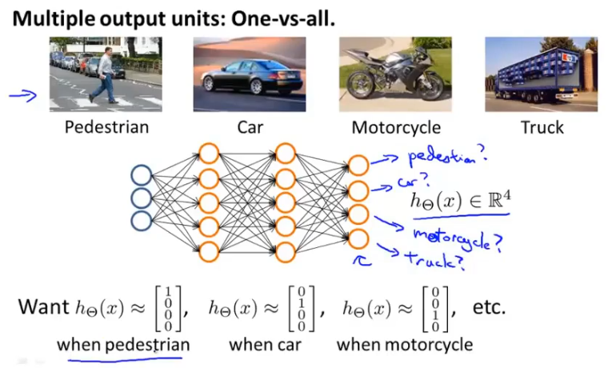


###### 神经网络的代价函数

​		神经网络是累加版本的 logistics线性模型，不同的是，神经网络最终的输出包含多个 logistics线性模型输出，那么其代价函数将是这些 logistics模型的代价总和

​		以上，有常规的 logistics代价函数，为


​		那么将其进行推广，神经网络的代价函数只不过是多个 logistics代价函数的累加，值得注意的是，正则项应当用来压制整个神经网络中的所有参数


###### 反向传播

>   反向传播是用来计算每个参数偏导数的一种高效率方法

​		上面有神经网络的代价函数，那么我们要做的是，根据样本输入，经过网络计算得到结果，然后与真实结果对比根据代价函数计算得知代价，通过调整神经网络参数，将该代价值最小化

​		具体来说，需要计算每个参数的偏导数，即
$$
\frac{\partial}{\partial\Theta^{(l)}_{ij}}J(\Theta)
$$
Example

Given one training example(x, y),  and network like this

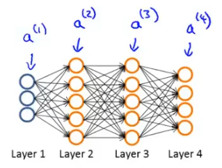

then we forward propagation


compute $\delta^{(l)}_j='error'$  of each node $j$ in layer $l$

这里的 $\delta^{(l)}_j$ 代表 第 $l$ 层，第 $j$ 个节点激活值的误差


以上是只有一个样本的情况，如果存在多个样本，那么计算每个节点误差时需要考虑所有节点

support we have training set $\{(x^{(1)},y^{(1)}),...,(x^{(m)},y^{(m)})\}$

使用 $\Delta^{(l)}_{ij}$ 矩阵保存整个神经网络中所有参数的累加误差

然后遍历所有样本数据，经过前向传播，反向传播后，计算每个参数的累加误差


最后根据累加误差，计算每个参数的平均误差 $D^{(l)}_{ij}$


这个平均误差 $D^{(l)}_{ij}$ 实际上就是每个参数的偏导数


使用偏导数，结合步长，优化网络参数，直至代价函数收敛


###### 偏导数验证

>   ​		偏导数验证的计算方法是低效率且不准确的，所以只能用来做验证，不要试图将这种方法用于实际的网络优化

​		以上可以通过反向传播计算各个参数的偏导数，但是在实际的计算过程中，可能存到bug导致偏导数计算错误，那么就需要一种方法来验证反向传播结果的正确性


双侧差分，估计 $\theta$ 点的导数，只要 $\epsilon$ 取值足够小，那么估计值就足够准确

将该方法使用在偏导数上，即可求得各个参数的偏导数估计值


​		最后将偏导数估计值与通过反向传播计算得到的偏导数对比，如果 $\approx$ ，那么意味着反向传播算法没问题


###### 随机初始化参数

​			如果将所有参数都初始化为同样的值，这意味着在同一层中的所有激活值将会全部相同，那么在接下来的反向传播中，每个激活值将会得到完全相同的误差值，也就是得到了相同的偏导数，使用这些相同的偏导数进行梯度下降，这将导致所有激活值总是相同的，这使得神经网络失去了处理数据的能力

​			最佳实践是随机初始化所有参数在 $[-\epsilon,\epsilon]$ 内


## 模型选择

在机器学习的流程中，最开始涉及到的是模型选择问题，即使用什么样的模型来拟合数据

例如对于线性模型，我们需要选定使用的是一元多项式还是二元多项式etc...

模型选择阶段，需要做的是，将所有待选择模型都优化出来，然后比较它们的准确率，从而选择具体使用哪个模型


## 模型评估

###### 分割样本集

在对模型代价函数优化完成后，需要对模型进行评估以确保不会出现欠拟合或者过拟合的情况

模型评估的方法就是将样本数据随机分为 训练集，验证集，测试集

通常模型的训练包括模型选择这个步骤

​		比如使用线性模型，那么需要选择使用一元多项式还是二元多项式或者是三元多项式etc... 这个几元多项式就是一个超参数，它应当在一开始时被选定，不随模型优化而改变

​		涉及到模型选择问题时，应当把所有的模型都优化得到结果，然后使用测试集测试哪个模型的损失最小，进而选定使用哪个模型（超参数）

​		如果按照常规的数据分割方法，将样本数据分为训练集和测试集，使用训练集优化参数，使用测试集选择超参数，那么最后选定的模型在测试集上的测试结果将不能真实反映该模型的泛化能力，因为该模型一开始就是为了拟合测试数据而选择的超参数，所以可能是在测试集上过拟合，而实际的泛化能力很差

综上，最佳实践是将样本数据分为 训练集，验证集，测试集

多个备选模型在训练集上优化参数

然后使用验证集选定使用哪个模型，即选择超参数

最后在测试集上测试选定的模型，此时给出的正确率才能够切实地反应该模型的泛化能力


###### 偏差和方差

简单的模型容易造成欠拟合，复杂的模型容易造成过拟合，只有合适的模型才能较好地表达


根据验证集错误率和训练集错误率曲线，可以得知合适的模型选择


###### 学习曲线

​		通常我们需要一种方法来得知模型处于高偏差（bias）或者高方差（various）或者两者都有，然后根据模型的问题，采取对应措施来优化模型

​		学习曲线给我们提供了一种更加直观的方式，来反映模型存在的实际问题

学习曲线，x轴为训练数据集大小，y轴为错误率，通常应当将 
$$
J_{train}(\theta)\ 训练数据代价函数 \\和\\ J_{cv}(\theta)\ 验证集数据代价函数
$$
 曲线绘制出来，然后分析问题

+   模型太简单 - - high bias

    这种情况表现为 $J_{cv}(\theta)$ 稳定减小，$J_{train}(\theta)$ 稳定增大，最后两者大致交汇在很高的错误率

    设想，使用一条直线作为模型，在只有一个点或者两个点的时候，能够很好地拟合，但是点一旦都起来，就没有办法拟合所有数据，所以当训练数据增大时，训练集代价函数会增大；

    在只有一个点时，只要能够拟合这个点，就表示已经优化到最佳，此时模型和实际的数据分布可能相差很大，所以在验证集代价函数上会表现地错误率很大，而随着数据量的增大，模型逐渐可以拟合数据的大致分布，所以在验证集代价函数上表现为错误率逐渐下降

    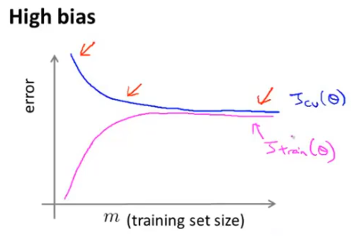

    

+   模型太复杂 - - high various

    表现为 $J_{cv}(\theta)$ 一直很大，虽然在减小，但是基本不减小，$J_{train}(\theta)$ 一直就很小，虽然在增大，但是基本不增大

    

    

+   数据不够

    ​		表现为  $J_{cv}(\theta)$ 正常减小，$J_{train}(\theta)$ 正常增大，但是两者还未交汇，这意味着训练数据不足，此时增加训练数据可有效优化模型


###### 优化模型

*   更多的训练数据，当出现 cv 和 train 的学习曲线未相交时，此方法有效
*   减少特征数量，可作为过拟合时的尝试
*   添加特征数量，可作为欠拟合时的尝试
*   增加组合 特征，比如 $(x_1^2,x_2^2,x_1x_2,etc)$，可作为欠拟合时的尝试
*   增大 $\lambda$，压制曲线，可作为过拟合时的尝试
*   减小 $\lambda$，放开曲线，可作为欠拟合时的尝试


## 大数据集

​		对于机器学习问题，大数据集在很多情况下都可以提高算法的准确率，我们我可以通过画出学习曲线得知，大数据集是否对当前问题有帮助

​		但是大数据集又带来一个棘手的问题，即昂贵的计算量，通常，我们有如下公式来更新某个模型参数，这仅仅是一步梯度下降，假设有1亿条数据，那么每次梯度下降，都需要对每个参数进行1亿次累加，这将会很慢

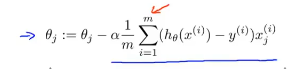


##### 随机梯度下降

​		与常规的一次性计算所有样本的梯度不同，每次选取一条数据，用这条数据计算梯度，更新参数，当遍历完全部样本数据后，结束一次总遍历，然后重复多次总遍历，得到优化结果

​		随机梯度下降的优势在于不需要每次梯度下降时都计算所有样本的梯度然后累加，每次只选取一条样本数据计算梯度，极大地提高了计算速度

1.  随机打乱样本数据集

2.  ```
    重复 1~10 次{    // epoch，遍历整个数据集1~10次来完成梯度下降
    	for(i=0...m){ 	//m为样本条数，该层循环对整个样本集进行一次遍历
    		计算该条数据梯度，更新参数
    	}
    }
    ```

    


##### mini-batch梯度下降

​		与随机梯度下降不同，每次取指定条数样本数据计算梯度更新参数，是常规批量梯度下降与随机梯度下降的中间版本

​		如果使用合适的向量化方式，那么mini-batch的方式能够更好地利用gpu进行并行计算，提高计算效率，此时计算快于随机梯度下降


## MapReduce

>   ​		MapReduce 在于并行计算，不一定需要多台主机，如果一台主机上有多个计算核心，也可以实现该方法来并行计算

​		在使用常规批量梯度下降算法来优化模型时，面临着每次梯度下降都要累加等同于样本量的梯度的问题，这会导致计算速度及其慢

​		MapReduce的思路为，将梯度的累加计算均分到计算机集群中每台计算机上，每个计算机计算一部分梯度累加和，最后汇总发送给中心服务器，由中心服务器对所有累加梯度进行汇总，并更新参数

​		Hadoop就是实现了MapReduce的一套系统


使用mapreduce方法的条件

​		只要涉及到可均分的累加累乘操作，都可以使用此方法实现并行计算，提高计算效率


## 上限分析

在实际的机器学习落地项目中，必然涉及很多个算法模块组成工作流来完成任务

比如对于文字识别项目，其可能的工作流为

`文字检测->字符分割->字符识别`

在这个典型的项目中，就涉及到三个算法模块，它们接收上一个模块的输出，然后对其进行处理，最后给出新的输出

如果我们想要对该项目进行优化，那问题就在于对哪个模块进行优化会收益最大

​		此时可以使用上限分析的思路，本质上就是单元测试的思想，不断假定工作流中前面部分已经完美，然后测出后面部分的准确率，从而得出提升哪个模块对最终的效果收益最大

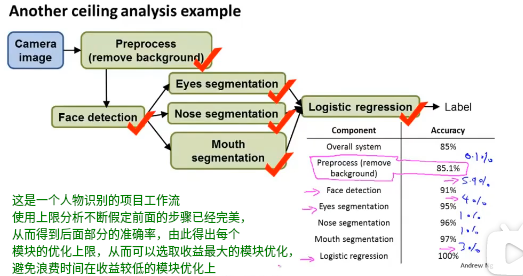


## 推荐系统

根据用户的历史行为进行建模，预测该用户可能感兴趣且未接触过的新商品、书籍、电影


##### 基于内容的推荐系统

举例子，电影推荐

前提，假设每部电影都有几个特征，且我们有每部电影的各项特征信息


1.  收集用户评分数据

2.  根据每个用户的评分结合电影特征进行建模，x=电影特征，y=评分，为每个用户线性回归建立模型

3.  拿到新电影的特征值，代入每个用户的评分模型，计算每个用户可能给出的评分，如果评分高，将其推荐给该用户

    


##### 基于协同过滤的推荐系统


​		上述的基于内容的推荐系统需要我们事先知道电影的各项特征值，比如romance值、action值，但是实际上这些特征值并不那么容易获取

那么这个问题可以换一种思路，我们本来要线性回归的函数类似于
$$
y=\theta_1x_1+\theta_2x_2+...+\theta_nx_n\\
\theta为待求的每个用户的参数\\
x为每个电影的各项特征值
$$
其中，$x$ 已知，求 $\theta$ 

那么我们可以反过来，直接管用户要 $\theta$ ，即该用户对每种电影的喜欢程度


然后就可以 $\theta$ 已知，求 $x$ ，求得每个电影的各项特征值


​		建模完成后，就可以根据用户给定的对电影类型的喜爱程度，给其推荐该类型特征值较大的电影

​		这种思路相当于每个用户都在协同给定电影特征值，构建推荐系统，所以被称为协同过滤推荐系统

​		在实际的时间中，往往又无法得到每个用户的偏爱参数，那么此时我们可以从一组随机的 $\theta$ 开始，计算对应的 $x$，然后再计算 $\theta$ ，然后再计算 $x$ ，如此往复，直至代价函数收敛


​		不过在实际使用时，不必要交替优化 $\theta$ 和 $x$ ，只需要把两个代价函数加到一起，优化这个代价总和即可


总结，协同过滤算法的过程为


​		注意，最后得到的特征值并不具有语义性，也就是我们难以解释这些特征值具体代表什么含义，但是这些特征值恰恰能够有效地表达数据的特征

##### 相似推荐

​		那么可以推断出，相似的数据，它们的特征向量之间的欧式距离也较短，因此，可以利用这个特性，找出相似的电影（特征空间距离较短的）推荐给用户


##### 均值归一化

​		对于上述问题，如果某个用户对所有电影都没有评分，那么在优化完该用户的模型后，显然将得到该用户的所有参数 $\theta=0$ 这样的结果，那么此时对于任何电影，预测该用户给出的评分，都是0，这就无法给该用户推荐任何电影


​		均值归一化的思想本质上就是利用其他用户给该电影的评分均值作为预测评分参照

1.  首先计算所有电影评价过的用户评分均值 $电影均值=\frac{评分总和}{评分人数}$

2.  然后将原样本数据中所有评分都减去对应的电影均值，未评分的不减

    

3.  使用更新后的样本数据优化 $\theta$ 和 $x$ ，构建模型

4.  预测函数变为 $y=\theta_1x_1+\theta_2x_2+...+\theta_nx_n+该电影评分均值$

    

5.  此时即使是 参数$\theta$全为0的用户模型，也能够获得到电影均值评分的预测值

为什么不直接用均值填充未评分位置？

​		如果用均值直接填充，那么该用户的参数将是根据均值计算出来的参数，这不能反映实际情况，而使用均值归一化优化的模型，该用户的参数仍然为0，这能够反映该用户的实际情况


## 附录

#### 回归问题

回归问题的本质是使用函数来拟合数据和结果之间的对应关系

衡量一个函数模型的好坏有两个标准 :  bias 和 various 

* bias 指该模型预测的结果整体与真实值之间的差异, 如果模型过于简单, 此时会造成 bias 过大, 也就是完全不能反映数据集的分布特点, 称之为欠拟合
* various 指该模型的各个预测点之间的差异, 如果模型过于复杂, 此时函数图像会跌宕起伏, 微小的自变量变化也会引起结果的剧烈变化, 且此时对测试集表现出极大的偏差, 称之为过拟合

解决欠拟合和过拟合?

欠拟合 : 适当增加参数的个数, 或者提高函数的复杂性,即增大函数的最大次幂

过拟合 : 使用更大的训练数据集能够很好的约束该复杂模型, 如果受限于训练数据集, 那么也可以尝试添加正则化参数, 正则化项会减缓原函数的跌宕起伏


#### 分类问题

分类问题的本质是根据 gaussion distribution ( 正态分布 ) 来算测试数据为某一类的可能性,  然后根据概率公式求出可能为该类的概率

步骤:

1. 使用给定的训练数据集, 每一个分类下有一批数据, 根据这批数据求出该分类的 gaussion distribution 函数, 也即是函数图像上的一个圆
2. 然后使用该 gaussion distribution 函数计算测试数据
3. 离圆心越近的为该分类的概率越大
4. 使用概率公式求出该分类的概率


#### 模型过拟合怎么办


1.  减少特征值数量

    ​	－ 手动删除某些特征

    ​	－ 使用模型选择算法自动选择模型，比如二元一次方程还是二元二次方程

    如果实际上所有特征都对结果有影响，那么删除掉某些特征就是不合适的做法

2.  正则化样本数据

    ​	－ 保持所有的样本特征，但是减小模型参数的值

    这种方式保留了所有特征对结果的影响，同时能够有效避免过拟合
