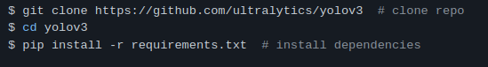
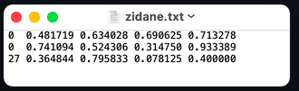
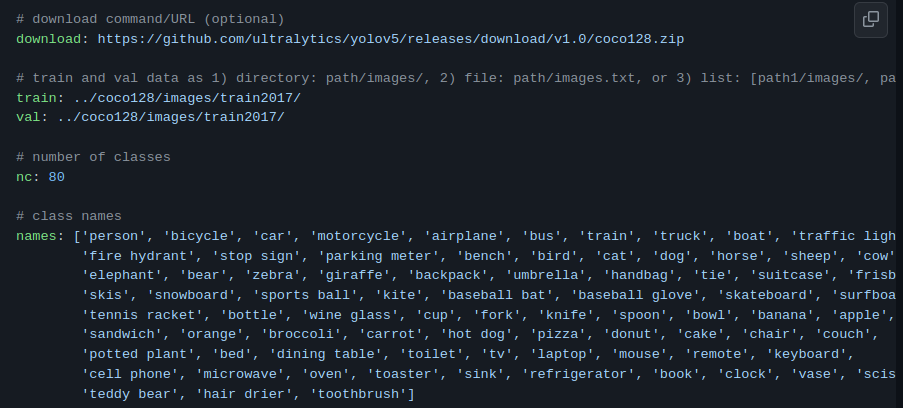
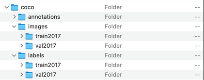
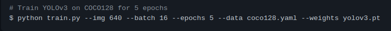
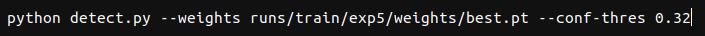

##### [训练自己的数据集](https://github.com/ultralytics/yolov3/wiki/Train-Custom-Data)

1.  [下载项目](https://github.com/ultralytics/yolov3)

    

2.  标注数据

    1.  安装pyqt5, pillow，labelme

    2.  命令行直接打开 labelme 标注数据并保存为json文件，注意使用 conda 时要切换到安装了labelme 的环境

    3.  写脚本从 json 文件中读取数据并保存为 yolo 支持的标注数据格式

        

        ```yolo
        类别号 中心点x 中心点y 宽 高
        // 这些都是0~1的相对坐标
        ```

        

3.  改数据配置文件 `./data/xxx.yaml`

    

    

4.  把`训练图片`和`标注数据`分别放到上一步骤中配置的 `train` 和 `val` 路径中，它们的名字一一对应

    

5.  模型参数在 `./weigths/` 中 , 比如 `yolov3.pt`

    

6.  运行 train.py 开始训练

    

    --img 把图片都整理为这个大小输入网络

    --batch 随机梯度下降一个batch数据量

    --epochs 跑多少遍所有数据

    --data 数据配置文件

    --weights 预训练参数路径

7.  训练的每个 epoch 结果都保存到 `./runs/train/` 下

8.  

    --weights 使用训练完成的最佳参数

    --conf_thres 设置置信度阈值，从训练时最后一波的统计图中取峰值

    预测结果默认保存到 `runs/detect/expn` 

