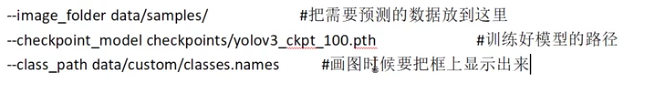

##### 训练自己的数据集

1.  安装pyqt5, pillow，labelme

2.  命令行直接打开 labelme 标注数据并保存为json文件，注意使用 conda 时要切换到安装了labelme 的环境

3.  写脚本从 json 文件中读取数据并保存为 yolo 支持的标注数据格式

    ```
    类别号 中心点x 中心点y 宽 高
    这些都是0~1的相对坐标
    ```

4.  因为分类任务为自定义分类，分类个数不同于原yolo，所以要改模型，使用 `config/create_custom_model.sh <分类个数>` 可直接生成指定分类个数的模型配置文件

5.  整理训练图片和标注数据分别放到单独的文件夹，它们的名字应当一一对应

6.  改 classes.names 为所有类别的名字

7.  写脚本把训练图片的路径都保存到一个文件中 train.txt，把验证数据路径都保存到一个文件中 val.txt

8.  改 custom.data 文件

9.  运行 train.py 指定命令行参数

    --model_def 模型cfg文件路径

    --data_config custom.data文件路径

    --pretrained_weights 使用的预训练参数文件路径

10.  训练的参数将保存到 checkpoint 下面

11.  运行 detect.py 检测目标

     

