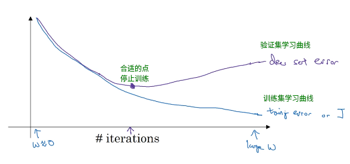

> 神经网络只是一个大概的结构的泛指, 即经过多层处理将原数据不断提取特征的过程
>
> 这里面每一层的操作并不是固定的 , 对于图片数据, 可以使用卷积操作和池化作为每一层中的提取特征的操作, 对于分类数据, 可以使用函数作为每一层中的操作  


# Tensorflow

> tf 的本质就是 拿着一堆矩阵 设置一系列的权重 进行一系列的运算

> pip install tensorflow
>
> pip install tensorflow-gpu 
>
> gpu版本还需安装 CUDA, CUDNN , 且版本必须匹配
>
> gpu版本使用gpu进行计算, gpu核心多但是都不强, 适合计算密集型程序
>
> gpu需要独显且3G以上显存
>
> cpu 核心较少 , 但是每一个核心都很强, 适合复杂计算型程序

#### tf 基本使用

> tf中的内容在 run 之前其实都是式子

```python
import numpy as np
#导包
import tensorflow as tf

#所有的 常量或变量 想要查看值 都需要在 session 中 run 

#常量
#常量都是 tensor 类型的对象, 直接调用返回的是一个对象并不是其中的值
a = tf.constant(1024)
b = tf.constant([1,2,3])
c = tf.constant('hello')
display(a,b,c)

#变量
#变量在 session 中 run 之前, 需要先进行全局变量初始化
a = np.random.randint(0,10,size=1)[0]
v = tf.Variable(initial_value = a)
#修改变量
v = tf.assign(v, 1000)

#占位符量, 同变量, 就是没数据
# shape中设置 None 就是任意高度
A = tf.placeholder(dtype=tf.float32, shape=[3,5])
B = tf.placeholder(dtype=tf.float32, shape=[5,None])
#没数据时如果 run 需要设置 feed_dict 来指定数据,否则报错
C = tf.matmul(A, B)
with tf.Session() as s:
    res = s.run(C, feed_dict={A:np.random.randint(0,10,size=(3,5)),
                             B:np.random.randint(0,10,size=(5,5))})
    print(res)


#运算, 运算时需要注意类型, float和int无法运算
a + b
#数的四则运算
tf.add(a,b)
tf.multipy(a,b)
#矩阵相乘 matrix multipy
a = tf.constant(np.random.randint(0,10,size=(3,2)), dtype=tf.float32)
b = tf.constant(np.random.randint(0,10,size=(2,4)), dtype=tf.float32)
c = tf.matmul(a,b)
c


#创建会话, 调用run方法返回传入的 表达式或常量 的值
s = tf.Session()
s.run(a) #返回常量a的值
s.run(tf.global_variables_initializer()) #run变量之前需要先全局变量初始化
s.run(v) #返回变量v的值

#关闭会话
s.close()

#或者直接使用 with 打开 session
with tf.Session() as s:
    pass


#tf中的常用方法
d = tf.reduce_mean(c, axis=1) #求平均值
```

#### tf 基本使用流程

1. 定义变量和占位符
2. 根据数学原理写方程
3. 定义损失函数 cost
4. 定义优化梯度下降 (GradientDescentOptimizer)
5. 在Session 中 for循环来训练参数
6. 保存 Saver


#### tf 反向传播

> tf  实际上也是在求一个函数模型 , 只不过求函数的方式是先瞎蒙一个, 然后通过不断地反向传播, 也就是调整参数来获取最优解
>
> https://www.cnblogs.com/charlotte77/p/5629865.html


#### tf 回归

###### tf  线性 回归

```python
import numpy as np
import matplotlib.pyplot as plt
%matplotlib inline
from sklearn.linear_model import LinearRegression
import tensorflow as tf

#生成大致为线性分布的数据
X_train = np.linspace(0,12,20).reshape(-1,1)
y_train = np.linspace(3,6,20) + np.random.randn(20)*0.4
plt.scatter(X_train, y_train)

#使用 sklearn的线性回归计算函数
lr = LinearRegression()
lr.fit(X_train, y_train)
plt.plot(np.linspace(0,12,100), lr.coef_*np.linspace(0,12,100)+lr.intercept_)

#使用 tf 线性回归
X = tf.placeholder(dtype=np.float32, shape=[20,1])
y = tf.placeholder(dtype=np.float32, shape=[20])
#随机给一个斜率值, tf中的random就是抄np的
#这里 w 就相当于一个矩阵, w和X相乘就相当于矩阵运算
w = tf.Variable(initial_value=tf.random_normal(shape=[1,1])) 
b = tf.Variable(initial_value=tf.random_normal(shape=[1,1])) 
#创建线性函数模型
pred = tf.matmul(X,w) + b
#最小二乘法求误差的平方的平均值 也就是损失值
cost = tf.reduce_mean((pred - tf.reshape(y, shape=[20,1]))**2)
#创建一个梯度下降计算器, 设置步幅为 0.01
gd = tf.train.GradientDescentOptimizer(0.01)
#使用梯度下降计算器对损失进行优化
optimizer = gd.minimize(cost)
optimizer
#循环进行梯度下降求最佳的 w 和 b
epoches = 1000 #设置梯度下降循环100次
with tf.Session() as s:
    s.run(tf.global_variables_initializer())
    for i in range(epoches):
        s.run(optimizer, feed_dict={X:X_train, y:y_train}) #梯度下降优化参数 w 和 b
        w_,b_ = s.run(fetches = [w,b]) #每次循环都获取并显示当前的 w 和 b
        print(w_, b_)
#然后会发现最后求得的 w 和 b 与sklearn中求出来的一样        
```

###### tf logistics 回归 : TODO

```python
import numpy as np
import matplotlib.pyplot as plt
%matplotlib inline
import tensorflow as tf
#导入数据
from tensorflow.examples.tutorials.mnist import input_data

mnist = input_data.read_data_sets('./', one_hot=True)
images = mnist.train.images #样本数据
images.shape
mnist.train.labels #样本目标值
plt.imshow(images[0].reshape(28,28))


X = tf.placeholder(dtype=tf.float32, shape=[None,784])
y = tf.placeholder(dtype=tf.float32, shape=[None,10])
W = tf.placeholder(dtype=tf.float32, shape=[None,10])


#softmax,就是将一个元素为float类型的数组中每个数都转换为概率, 转换之后所有的概率总和为 1
a = np.array([-1,2,3.0])
b = tf.nn.softmax(a)
with tf.Session() as s:
    print(s.run(b))
```


#### tf 卷积

> 卷积操作二维数据 ( 黑白图片 )

```python
#原数据 , 原数据可以使用图片数据 , 然后设置不同的卷积核对图片数据进行滤波等操作
data = np.array([[2,1,2,3,4],[1,2,3,1,3],[4,2,4,6,7],[6,4,3,3,1],[5,2,1,4,3]])
#卷积核
fllter = np.array([[-1,0,1],[-1,0,1],[-1,0,1]])
#转换原数据和卷积核转换为规定形状 和 float类型
input_data = tf.reshape(data, shape=[1,5,5,1])
input_data = tf.cast(input_data, dtype=tf.float32)
fllter = tf.cast(tf.reshape(fllter, shape=[3,3,1,1]), dtype=tf.float32)
#卷积操作
# input 设置原数据, 为四维的数据, 处理图片时, 对应含义为 [多少张图片, 图片的高, 图片的宽, 图片通道数]
# filter 设置卷积核, 为四维数据, 处理图片时, 对应的含义为 [卷积核的高, 卷积核的宽, 输入几个通道的数据, 最后输出几个通道的数据也就是有几个卷积核] 通用的含义 :[卷积核的高,卷积核的宽,输入的数据有多少层,输出的数据要多少层]
# padding 设置在卷积时是否填充一个边框, 使得卷积之后输出的结果形状和原数据形状相同, VALID随缘, SAME添加padding
conv = tf.nn.conv2d(input=input_data, filter=fllter, 
             strides=[1,1,1,1], padding='VALID', use_cudnn_on_gpu=False)
with tf.Session() as s:
    res = s.run(conv)
    print(res.reshape(3,3))
```

> 卷积操作三维数据 ( 彩色图片 )

```python
#读取图片数据
image = plt.imread('./xxx.jpg')
plt.imshow(image)
image.shape

#卷积核, 彩色图片三个通道对应三个二维卷积核, 所以卷积核就是三维的
#卷积核是 3*3 , 有 3 个卷积核, 每次从每个通道的每一个卷积位上获取1/27的值, 将三个通道上27个卷积位的值合到一起, 最后输出为一个通道
fllter = np.full(shape=[3,3,3], fill_value=1/27).reshape(3,3,3,1)
#创建卷积操作
conv = tf.nn.conv2d(input = image.reshape(1,图片的高, 图片的宽, 图片通道数).astype(np.float32),
            filter = fllter,
            strides = [1,1,1,1],
            padding = 'SAME')
#卷积
with tf.Session() as s:
    res = s.run(conv)
    plt.imshow(res.reshape(图片的高, 图片的宽), cmap = 'gray')
```


#### 神经网络

> 神经网络的本质就是一开始有几个初始的函数, 然后将它们随机线性组合和激活函数瞎蒙修改 , 看看结合出来的函数的图像能不能对问题进行分类, 然后根据误差调整线性组合时的权重, 一直循环直到误差很小 

##### 激活函数

> 其实就是将原数据经过一个函数运算, 然后取返回的数值
>
> 因为输入的函数就那么几个, 所以如果直接线性组合它们, 那么输出的结果就不能多样化, 所以激活函数的本质就是用另外一个函数对输出的结果再进行处理, 使得最后的结果更具多样性, 选用什么激活函数就是一个瞎蒙的过程

###### ReLu

```python
a = np.random.randint(-5,10,size=20)
b = tf.nn.relu(a)
with tf.Session() as s:    
    print(s.run(b))
```

##### dropout

> 样本量较小时, 可能发生过拟合, 此时就使用 dropout , 即屏蔽一部分的神经元, 使得输出的结果更具普适性 , 这个过程是一个瞎蒙的过程

##### tf 实现卷积神经网络


```python
#实现如上的卷积神经网络
#初始数据 32*32 
input_data = np.random.randn(32,32).reshape(1,32,32,1)

#卷积核 5*5*8
filter_ = np.random.randn(5,5,8).reshape(5,5,1,8)
#第一次卷积
conv = tf.nn.conv2d(input=input_data,filter=filter_,strides=[1,1,1,1],padding='VALID')
#第一次池化
pool = tf.nn.max_pool(conv, ksize=[1,2,2,1],strides=[1,2,2,1],padding='SAME')
#第一次激活
relu = tf.nn.relu(pool)
#第一次dropout, keep_prob 设置保留下来正常工作的神经元的比例
dropout = tf.nn.dropout(relu, keep_prob=0.6)

#第二次卷积, 上一层输出的结果有8层, 所以这里要有8个二维的卷积核
filter2 = np.random.randn(5,5,8,20)
conv2 = tf.nn.conv2d(input = dropout, filter=filter2,strides=[1,1,1,1],padding='VALID')
#池化
pool2 = tf.nn.max_pool(conv2, ksize=[1,2,2,1],strides=[1,2,2,1],padding='SAME')
#激活
sigmoid = tf.nn.sigmoid(pool2)
#dropout
do2 = tf.nn.dropout(sigmoid, keep_prob=0.5)

#全连接 
#全连接其实就是将上一步输出的结果的所有的元素与一个与它个数相同的数组进行矩阵乘法, 最后返回一个数
#这里上一步的 do2 的形状是 1*5*5*20 , 那么它总共有 1*5*5*20 个元素, 那么就需要有 1*5*5*20 个系数分别与它们相乘然后加到一起
#这里使用 120套系数, 最后就返回120个结果 , 也就是返回一个形状为 1*120 的矩阵
#给这500个数随机生成 120 套系数
dense = np.random.randn(500,120)
#将上一步返回的结果排排站成一行
fc = tf.reshape(do2, shape=[1,1*5*5*20])
#进行所谓的全连接操作, 其实就是给它120套系数进行矩阵乘法, 最后返回 120 个数
conn = tf.matmul(fc, dense)
conn

#全连接之后再给它 9 套包含120个系数的矩阵进行 "全连接", 然后再加上一个 截距 b
#就是所谓的最终输出了 9 个特征
w = np.random.randn(120, 9)
b = np.random.randn(9)
out = tf.matmul(conn, w) + b
out
```


##### 卷积神经网络实现手写数字识别

> 数据样本集在此  https://blog.csdn.net/sinat_34715587/article/details/89228065

``` python
import numpy as np
import tensorflowa as tf
from tensorflow.examples.tutorials.mnist import input_data

#读取样本数据压缩文件 , 需要事先下载, 放到当前目录下
#one_hot 的读取方式可将数据转换成概率的形式
mnist = input_data.read_data_sets('./',one_hot=True)

#查看数据文件中的一张图片
img = mnist.train.images[0]
img.shape

#创建变量占位符
X = tf.placeholder(dtype=tf.float64, shape=[None, 样本图片的像素个数])
y = tf.placeholder(dtype=tf.float64, shape=[None, 10])

#卷积核在卷积神经网络中是变量, 因为要不断调整卷积核使得卷积结果不断接近真实值
#定义一个生成卷积核变量的方法
def gen_v(shape):
    #根据形状生成 方差为0.1且平局值为 0 的卷积核, 这样生成的卷积核中各个元素都接近于0
    # stddev 设置方差
    return tf.Variable(initial_value=tf.random_normal(dtype=tf.float64,shape=shape,stddev=0.1),
                      dtype=tf.float64)

#定义进行卷积操作的方法
def conv(input_data, filter_):
    return tf.nn.conv2d(input = input_data, filter=filter_,
                       strides=[1,1,1,1],padding='SAME')

#定义池化的方法
def pool(input_data):
    return tf.nn.max_pool(value=input_data, ksize=[1,2,2,1],strides=[1,2,2,1],padding='SAME')


###############################

#第一层卷积
#输入数据, 这里读取的数据是一维的784个像素一个通道的黑白图片, 所以这里需要转换为二维的数据
input_data = tf.reshape(X, shape=[-1,28,28,1])
#卷积核
filter1 = gen_v(shape=[3,3,1,64])
#偏差, 卷积之后生成 64 层 , 给每一层都加上一个随机的偏差
b1 = gen_v(shape=[64])
#卷积
conv1 = conv(input_data, filter1) + b1
#池化
pool1 = pool(conv1)
#激活函数
ac1 = tf.nn.relu(pool1)
ac1

#第二层卷积
filter2 = gen_v(shape=[3,3,64,64])
b2 = gen_v(shape=[64])
conv2 = conv(ac1, filter2) + b2
pool2 = pool(conv2)
ac2 = tf.nn.sigmoid(pool2)
ac2

#全连接
#这里使用 1024套参数对其进行全连接
fc_w = gen_v(shape=[7*7*64,1024])
fc_b = gen_v(shape=[1024])

conn = tf.matmul(tf.reshape(ac2, shape=[-1,7*7*64]), fc_w) + fc_b
conn

#dropout 防止过拟合
kp = tf.placeholder(dtype=tf.float64)
dropout = tf.nn.dropout(conn, keep_prob = kp)
dropout

#输出层out
#应当输出 10 个类别, 所以就整 10 套全连接参数
out_w = gen_v(shape=[1024,10])
out_b = gen_v(shape=[10])

out = tf.matmul(dropout, out_w) + out_b
out

#将10个类别转换成概率的形式
#目前这10个概率就是上面这些网络随机预测出来的概率
prob = tf.nn.sorfmax(out)
prob

#现在真实的概率是 y
y

#使用现有的 预测概率 和 真实概率 , 根据交叉熵公式求损失
cost = tf.reduce_mean(tf.reduce_sum(y*tf.log(1/prob),axis=-1))
cost

# 创建并使用优化算法
# 这个是基于梯度下降的一个优化算法
adam = tf.train.AdamOptimizer()
optimizer = adam.minimize(cost)
optimizer

#创建一个保存参数器
saver = tf.train.Saver()

# for 循环 run 上面的神经网络训练参数
with tf.Session() as s:
    s.run(tf.global_variables_initializer())
    #总共有55000条样本
    #优化10次
    #每一次优化都将 55000 样本分成 100 次计算损失, 最后将100次损失加到一起, 这样计算快些
    for i in range(10):
        c = 0
        for j in range(100):
            X_train , y_train = mnist.train.next_batch(550)
            optimizer_, cost_ = s.run(fetches=[optimizer, cost], 
                                      feed_dict={X:X_trian,y:y_train,kp:0.5})
            c += cost_/100
            print('里层执行次数: %d, 当次损失是: %0.4f' % (j,cost_))
            
        print('-----------执行次数: %d, 当前损失是: %0.4f--------------' % (i,c))
        #每次优化都保存参数, 保存路径需要事先创建
        saver.save(s, save_path='./cnn/model',global_step=i)
        
#以上代码运行完之后会在指定目录生成 10 个名字为 model-x 的模型参数文件
#加载最后一次生成的参数文件进行测试
with tf.Session() as s:
    saver.restore(s, './cnn/model-9')
    X_test, y_test = mnist.test.next_batch(2000)
    #代入测试数据到网络中, 求得预测出来的概率
    prob_ = s.run( prob, feed_dict={X:X_test,kp:1.0} )
    #求得真实值, 因为是 one_hot 的读取方式, 所以最大值的位置就是对应的真实值
    y_test = y_test.argmax(axis = -1)
    #求得预测的值
    prob_ = prob_.argmax(axis=-1)
    #比对下有多少个预测对的, 通过求平均值获取预测准确率 
    print((y_test == prob_).mean())
```


##### 卷积神经网络实现验证码识别 : 

> 样本数据文件夹名 Discuz

```python
import numpy as np
import cv2 as cv2
import tensorflow as tf


```


# Keras 

> 傻瓜版的 tensorflow , 将tf中创建神经网络的细节封装起来成为一些简单的 api

#### 图片数据集生成器

> 实际问题的处理中, 总不是能够获得到刚刚好大小和比例且图片主题在正中间的样本集
>
> 这个时候就可以使用图片生成器把不规整的图片都批量处理成为规整大小和比例的样本集

1. 将图片按照如下结构存放到文件系统中

   

2. 使用图片生成器

   ```python
   #导包
   from tensorflow.keras.preprocessing.image import ImageDataGenerator
   
   #生成器实例
   #设置将生成的数据除以 255 以标准化
   train_datagen = ImageDataGenerator(rescale = 1./255)
   # barch_size 一次生成多少张
   # class_mode 这是一个几分类问题
   # train_dir 源图片路径, 这个路径应当是包含图片目录的路径
   train_gen = train_datagen.flow_from_directory(train_dir, target_size=(300,300),
                                                batch_size = 128, class_mode='binary')
   
   #测试集数据生成, 同上
   test_datagen = ImageDataGenerator(rescale = 1./255)
   validation_gen = test_datagen.flow_from_directory(validation_dir, target_size=(300,300),
                                                batch_size = 32, class_mode='binary')
   
   ```

   


# TensorBoard

> tensorflow 自带的可视化工具
>
> 安装 TensorFlow 时就自动安装了这个

1. 在代码中生成网络的结构图文件

```python
import numpy as np
import tensorflow as tf

#定义一个名字为 xxx 的命名域, 这个域就是可视化界面中显示的一个模块
#然后在这个域中添加 常量 和 操作
#这里的域就相当于一个分组, 对于复杂的网络能够较好的理清关系. 当然也可以不创建这个域
#对于一个完整的网络, 应当以多个域分别给每一步操作进行分组
with tf.name_scope(name = 'xxx') as scope:
    # name 属性设置在结构图中显示的名字
    m1 = tf.constant(np.random.randint(0,10,size=(2,3)), name ='m1')
    m2 = tf.constant(np.random.randint(0,10,size=(3,5)), name ='m2')
    
    pro = tf.matmul(m1, m2, name = 'product')

sess = tf.Session()
#将指定 session 的结构图保存到指定文件夹下, 没有则自动创建
tf.summary.FileWriter('./logs', sess.gragh)
sess.run(pro)
sess.close()
```

2. 打开生成文件所在的路径下的 cmd

> 执行命令会开启一个web服务, 在 6006端口, 浏览器访问该端口可查看可视化界面

```shell
> tensorboard --logdir logs
```


# 神经网络

#### [反向传播](https://zhuanlan.zhihu.com/p/32819991)

在训练神经网络时, 先输入训练数据, 然后使用输出与真实结果计算 loss , 根据 loss 的期望方向对网络中的各个权重以及偏置参数进行调整.

假设网络的输出为 10个值, 那么想要改变这10个数的值就应当从 <span style="color:cyan;">与其相连的权重</span>, <span style="color:cyan;">偏置</span> 以及 <span style="color:cyan;">前一层的激活值</span> 下手, 

实际上应当从这三个方面同时下手进行调整, 才能最大化优化的速度. 

其中, <span style="color:cyan;">前一层的激活值</span>不能直接调整, 而是通过前一层神经元上的权重及其偏置下手进行调整, 因此, 从这一方面考虑调整时, 可以一直向前追溯每一层的三个调整方面, 从而对每一个神经元上的权重和偏置给出调整方向, 进而对其进行调整; 而对于 <span style="color:cyan;">与其相连的权重</span> 和 <span style="color:cyan;">偏置</span>, 则可以直接计算它们对 loss 值的偏导, 然后进行调整.

所以综上, 当网络接收一批训练数据后, 应当对这些数据计算 loss 后取平均, 这个平均 loss 就代表了兼顾当前输入所有数据的调整方向, 然后根据这个 loss  <span style="color:cyan;font-weight:bold;">更新网络中的所有参数</span>  达到优化的目的.

<span style='color:lightgreen;'>假设网络包含两层，那么我们有</span>

*   参数矩阵 $W^{[1]},W^{[2]}$
*   偏置参数矩阵 $b^{[1]},b^{[2]}$
*   输入值 $x^{[0]}$
*   每层的计算值 $z^{[1]},z^{[2]}$
*   每层的激活函数 $g^{[1]},g^{[2]}$
*   每层的激活值 $a^{[1]},a^{[2]}$

*   损失函数 $cost(y,y')，其中y=a^{[2]}$
*   代价函数 $L=\sum_{i=1}^{m}cost(y,y')$

<span style='color:cyan;'>正向传播为 </span>
$$
x^{[0]}为输入\\
z^{[1]}=g(W^{[1]}x^{[0]}+b^{[1]})\\
a^{[1]}=g(z^{[1]})\\
z^{[2]}=g(W^{[2]}a^{[1]}+b^{[2]})\\
a^{[2]}=g(z^{[2]})\\
a^{[2]}为输出
$$
<span style='color:cyan;'>反向传播为</span>

​		为了最小化代价函数 $L$ 的值，那么需要求得 $W^{[1]},W^{[2]},b^{[1]},b^{[2]}$ 在函数 $L$ 中的偏导数，从而梯度下降更新它们使得 $L$ 达到最小值，那么
$$
根据顺序，从后向前使用链式求导法则，逐渐求偏导数\\
dZ^{[2]} = A^{[2]}-Y\\
dW^{[2]} = \frac{1}{m}dZ^{[2]}(A^{[1]})^T\\
db^{[2]} = \frac{1}{m}np.sum(dZ^{[2]},axis=1,keepdims=True)\\
dZ^{[1]} = (W^{[2]})^TdZ^{[2]}g^{[1]}(Z^{[1]})\\
dW^{[1]} = \frac{1}{m}dZ^{[1]}X^T\\
db^{[1]} = \frac{1}{m}np.sum(dZ^{[1]},axis=1,keepdims=True)\\
以上为该模型的反向传播偏导数公式，如果网络包含更多层，那么可继续推导
$$

>   ​		注，由上述公式可总结得知
>
>   ​		反向传播逐渐向前求导数的过程中，实际上是在逐个求得 $dZ^{[l]}$ 的过程（求得了 $dZ^{[l]}$，即可得到 $dW^{[l]}$ 和 $db^{[l]}$）
>
>   ​		而为了求 $dZ^{[l]}$，只需要提供 $dZ^{[l+1]},Z^{[l]}$ 即可
>
>   ​		所以反向传播同正向传播一样，是一个模式化的过程，只需要按照顺序从后向前迭代，不断套用公式即可求得所有偏导数
>
>   

求得每层参数的偏导数后，使用梯度下降结合步长更新参数
$$
W^{[1]}=W^{[1]}-\alpha*dW^{[1]}\\
b^{[1]}=b^{[1]}-\alpha*db^{[1]}\\
...
$$
​		然后重新进行预测，得到y，多次反向传播更新参数，直至与真实y的误差小于某个阈值或者达到指定迭代次数


#### 随机梯度下降

理论上, 神经网络应当一次性接收所有的训练数据, 得到兼顾所有数据的正确的梯度, 然后进行调整, 但是实际上训练数据的海量导致如果一次性兼顾所有训练数据的话, 将会使得训练速度极慢.

所以, 将所有的数据打乱后分批输出网络多次进行优化才能较好的选择, 这种方式虽然不能保证每次优化的方向都是完全正确的, 但是所有批次的优化汇总到一起总会与正确的方向是一致的.

这种分批次进行优化的方式称为随机梯度下降, 这种方法极大地提高了训练的速度.


​	


#### Nomalization

在实际训练网络时, 训练数据会分批输入到网络进行训练, 如果就直接给数据分批然后输入网络, 那么很可能这些批次的数据的分布都差的挺多的, 不能真实的反映整个训练数据集的分布, 网络优化的本质就是习得训练数据的分布, 这样就会导致网络的训练变的飘忽不定, 效果不好.

所以, 要在数据输入网络之前, 进行规范化, 使其能够反映整个数据集的分布, 这样的操作就是 Nomalization , 这个操作用在输入层	


#### [BN](https://www.cnblogs.com/eilearn/p/9780696.html)

> Batch normalization

	BN是用在隐藏层神经元上的操作
	
	在训练神经网络时, 如果某次给定的一批训练数据中有噪声数据, 也就是跟其他大部分数据的分布差很远的那种, 不合群的那种, 跟大体的数据分布范围差了八竿子远的那种.
	
	因为网络在本次优化时要兼顾考虑这一批数据中的所有项, 所以这不合理的数据也被考虑进来了, 就会导致优化的方向就那么的不太好,

这种现象被称为  Internal Covariate Shift 

	正则化操作就是把所有的数据都拉到一个较小范围内, 这样就避免了那种不合群的数据对网络优化造成的骚扰.
	
	BN 的操作, 就是求数据的 mean , 求数据的 various , 然后根据这两个值把原数据换算到这个圆形分布上
	
	下图为BN的操作公式, 把数据分布想象到二维平面上, 先用一个圆 $C_1$ 把数据大致框起来, mean 大致为圆心位置, various 大致为 $C_1$ 半径的一半 


BN的好处 :

1. <span style='color:cyan;'>初始化</span>网络的时候不需要那么谨慎了

   	在常规的网络中, 可以看做数据每经过一层神经元, 就被映射为另外一个分布, 如果数据经过某层神经元映射出来的分布包含哪种放飞自我的不合群的分布点, 那么就把它后面层的网络害了, 因为后面层的网络要兼顾这些不合群的点计算梯度反向传播优化网络
		
   	如果在每一层网络的输出后面都整上一层 正则化 操作, 那么网络中将不会再出现不合群的分布点, 也就提高了网络训练的稳定度

2. <span style='color:cyan;'>学习率</span>的设定也不用那么谨慎了

   	同上, 在常规的网络中不加正则的情况下, 可能搞出来不合群的分布点, 这个时候带来的优化方向就是不怎么样的, 如果这个时候徐诶率也恰好很大, 那么就是在往错误的方向走了一大步, 搞得优化操作变成了南辕北辙, 白忙活半天了

3. <span style='color:cyan;'>减少dropout的使用</span>

   	dropout的使用是为了降低过拟合的风险, 因为BN是对分布进行了调整, 所以使用BN后本身就不再是对数据本身进行训练, 所以使用BN后提高了模型的泛化能力

4. <span style='color:cyan;'>解决了反向传播过程中梯度消失的问题</span>

   	因为底层的权重是经过多个sigmod求的导数, 所以很容易导致梯度消失, 使用BN后, 数据分布集中在 sigmod 的高效区域, 就不会再造成梯度消失的问题


[Dropout](https://zhuanlan.zhihu.com/p/38200980)


RNN -> LSTM -> transformer


[LSTM](https://zhuanlan.zhihu.com/p/32085405)


#### 激活函数

​		对于分类问题模型，通常选择sigmoid函数作为输出层的激活函数，而在隐藏层中，一般不使用sigmoid函数

​		可以在隐藏层中尝试使用 tanh 函数

​		一般默认在隐藏层中使用 relu 函数，少数情况下，使用 leaked relu


###### sigmoid函数

​		全连接神经网络中 , 每个神经元的值都是由前一层的神经元乘以权重矩阵 , 然后加上bias矩阵, 最后经过调整函数来得到的, 早期的网络中多使用 sigmod 函数作为调整函数

​		但是 sigmod 函数存在一个问题, 即仅仅在大概 -5 ~ 5 的范围内, 对应的值才有区分度, 超过了这个范围的值区分度微乎其微, 在这种情况下, 当对某个神经元前边的神经元求偏微分时, 可能因为该神经元本身的值超出了 -5 ~ 5 的范围而造成当前值的偏微分接近于0, 

​		因为对底层的权重求梯度时使用链式法则, 所以在计算过程中必然包含了对 sigmod 的求导, 如果 sigmod 的导数很小, 那么将会导致最后求得的梯度极小, 那么此时底层的权重根据梯度进行的调整将微乎其微, 此时神经网络的梯度下降过程将接近停止, 使得网络失去优化的能力, 这种情况就是梯度消失

​		为了改善 sigmod 函数带来的梯度消失问题, 现行做法一般是将该调整函数改为其他函数如 ReLu 

###### 为什么激活函数

​		不使用激活函数时，再多的隐藏层也相当于是线性模型，无法带来更多的分类能力

###### 激活函数的导数

$$
a=g(z) \ 其中a为激活值，g为激活函数，z=WX+b
$$

*   sigmoid
    $$
    g(z)=\frac{1}{1+e^{-z}}\\
    g'(z)=g(z)(1-g(z))\\
    becouse\ a=g(z)\\
    so\ g'(z)=a(1-a)
    $$

*   tanh
    $$
    g(z)=tanh(z)=\frac{e^z-e^{-z}}{e^z+e^{-z}}\\
    g'(z)=1-(tanh(z))^2\\
    becouse\ a=g(z)=tanh(z)\\
    so\ g'(z)=1-a^2
    $$

*   ReLU
    $$
    g(z)=max(0,z)\\
    g'(z)=0,if\ z<0\\
    g'(z)=1,if\ z>0\\
    g'(z)=undefined,if\ z=0
    $$
    

*   Leaked ReLU
    $$
    g(z)=max(0.01z,z)\\
    g'(z)=0.01,if\ z<0\\
    g'(z)=1,if\ z>0\\
    g'(z)=undefined,if\ z=0
    $$
    


#### 随机初始化

​		神经网络中的 参数W 应当随机初始化为很小的随机数而不是全置为0，偏置参数b则可以全置为0

​		如果参数W全部置为0，那么同一层中的神经元都将给出同样的输出值，进而每个参数 w 得到的偏导数都是相同的，无论进行多少次正向&反向传播，同一层中的参数一直保持一致，这样同一层中的神经元都在干一样的事，没有意义

​		而对于偏置参数b，不需要随机初始化为随机数，因为在参数W进行随机初始化之后，同一层中每个神经元已经不一致，那么此时就无需再随机b

​		如果神经网络中存在 sigmoid 激活函数，那么最佳实践是随机初始化参数W为 `np.random.randn((n,m))*0.01` ，乘以0.01是为了参数都非常小，避免落入 sigmoid 函数中导数很小的区域


#### 超参数

​		在神经网络的构建中，有一些需要我们实现定义好而不会随着后来的训练而变化的参数，这些参数控制着模型的构建与训练，这些参数将会影响将来参数的训练，所以把这些参数称为超参数

​		超参数的选择是经验决定以及实践出真知，实际尝试不同的超参数然后决定使用哪个值

常见的超参数

*   梯度下降学习率 
*   迭代优化的次数
*   隐藏层数
*   隐藏层的单元个数
*   激活函数的选择


#### 正则化

​		模型在训练集上出现高准确率而测试集上出现低准确率时，考虑是出现高 various 的情况

​		通常解决高 various 的方法有，使用正则化参数压制参数，使用更多的训练样本，毕竟越多的样本代表神经网络越不能更好地拟合，从而降低 various，但是更多的样本往往涉及大量的工作量，所以使用正则化总是最佳实践

​		正则化即在代价函数中添加正则化参数，最小化代价函数的同时，也最小化正则化项，也就是压制模型参数的大小，降低其拟合能力

<span style='color:cyan;'>L2正则化</span>

>   在实践中，大多数都会采用L2正则化

$$
J(w,b)=\frac{1}{m}\sum_{i=1}^{m}L(y'^{(i)},y^{(i)})+\frac{\lambda}{2m}||w||_2^2\\
其中 \frac{\lambda}{2m}||w||_2^2 是正则项\\
||w||_2^2=\sum^{n_x}_{j=1}w^2_j=w^Tw=\sum^{n^{[l-1]}}_{i=1}\sum^{n^{[l]}}_{j=1}(w_{ij}^{[l]})^2\\
也就是参数矩阵W中所有元素的平方和
$$

<span style='color:cyan;'>L1正则化</span>

>   经检验证明，L1正则化会带来更多的参数为0的情况，也就是参数W矩阵将会是稀疏矩阵

$$
J(w,b)=\frac{1}{m}\sum_{i=1}^{m}L(y'^{(i)},y^{(i)})+\frac{\lambda}{2m}||w||_1
$$

$\lambda$ 作为超参数，通常通过验证集来确定

​		加入了正则化项后，在计算代价函数 $J$ 中W的偏导数的时候，总是会多出来一个由超参数 $\lambda$ 控制的关于参数矩阵 $W$ 的项，那么在接下来的梯度下降更新参数时，就要多减去一些，这就压制了参数 $W$ 的大小，因此 L2正则化也被称为 “权重衰减”

<span style='color:cyan;'>Dropout正则化</span>

​		dropout正则化的方法，在训练阶段每次梯度下降之前，随机关闭某些节点，然后进行一次前向和反向传播，每次梯度下降前，随机切换关闭的节点

​		在测试阶段，不执行dropout逻辑

一次Dropout操作包括：

>   事先指定保留的概率：keep-prob

1.  对要进行dropout的层随机生成形状相同的0~1随机数矩阵 d
2.  使用全员操作，结合keep-prob将随机数矩阵 d 转换为 true or false 矩阵，代表该位置的单元是否在本次梯度下降中保留
3.  计算无dropout时，本层计算结果激活值矩阵 a
4.  使用 true or false 矩阵对激活值矩阵 a 中的元素进行筛选保留
5.  将激活值矩阵 a 中的每个元素除以 keep-prob，得到修正后的激活值矩阵 a，作为dropout结果输出到下一层

<span style='color:cyan;'>为什么第五步中要每个激活值除以 keep-prob？</span>

​		原先无 dropout 时，下一层得到的激活值为 $a^{[l+1]}=g^{[l]}(w^{[l]}a^{[l]}+b^{[l]})$

​		现在对该层进行dropout，去除了 $(1-keep-prob\%)$ 的节点，那么下一层得到的激活值将会是原先能够得到激活值的 $(1-keep-prob\%)$

​		此时为了保持下一层得到的激活值不变，那么对每个激活值除以 keep-prob 得以实现

<span style='color:cyan;'>为什么dropout行？</span>

​		每次随机关闭不同的节点，这就使得每个节点参数都有被优化的概率，这样就不必担心总是在优化某一些节点而导致最终生成的模型过拟合训练数据，也就是压制所有参数的大小，这与L2正则化是异曲同工的

<span style='color:cyan;'>dropout最佳实践</span>

*   对于参数众多的隐藏层，采用较低的keep-prob，也就是保留较少的单元
*   对于参数较少的隐藏层，采用较高的keep-prob


#### 过拟合

过拟合怎么办

*   L1,L2正则化

*   dropout正则化

*   扩增训练数据，使其不易过拟合

*   绘制学习曲线，看情况提前结束训练，避免模型向过拟合的方向继续

    


#### 归一化

​		归一化 包括 `归一化均值` 和 `归一化方差` 两步骤，目的是将数据的分布拉回到原点附近，且每个特征方向上数量级相同

​		使用归一化后的训练数据训练模型，然后需要使用同样的均值和方差调整测试集数据，再输入模型


<span style='color:cyan;'>为什么归一化</span>

​		假设模型包含两个特征 $x_1,x_2$ ,其不在一个量级，那么对应的，模型的参数 $w_1,w_2$ 也就会不在一个量级

​		结果就是，以参数 $w_1,w_2$ 为变量对 $代价函数J$ 进行优化时，呈现出来的图形将会是狭长的碗形状，对于这样的代价函数，我们需要谨慎选择学习步长，否则将消耗更多的步数才能抵达最优解

​		如果将特征 $x_1,x_2$ 归一化到同一个量级，那么相应的代价函数将会是一个均匀的碗形状，此时无奈从哪里出发开始优化，所需抵达最优解的步骤都是很少的

​		也就是说，归一化能够减少训练步数，加快训练速度


<span style='color:cyan;'>何时归一化</span>

​		如果各个特征不在一个量级，那么归一化很合适；反之，归一化不会有太大作用，但是也没有任何副作用

​		所以，一般都会归一化，作为一个默认操作

​		


#### 梯度消失&梯度爆炸

​		在训练过程中，如果出现某些参数的梯度特别大或者特别小，则被称为梯度消失&梯度爆炸，这往往导致我们需要谨慎选择训练步长，而导致训练速度慢


#### 梯度检验

>   *   不要在训练时使用梯度检验，它很慢
>   *   不要同时使用 dropout 和 梯度检验，因为每次 dropout 都会随机关闭某些节点，而我们无法得知

在实行每一步反向传播后，计算得到的偏导数，如何判断是否计算正确？

​		同机器学习，神经网络中依然使用双边导数估计法得到某个参数的估计偏导数，然后与反向传播计算得到的偏导数进行对比，如果很接近，则认为反向传播计算得到的偏导数正确

最佳实践是将所有参数组合为一个总的参数矩阵 $\theta$

1.  将 $w_1,w_2,b_1,b_2...$ 等使用一个参数矩阵 $\theta$ 来表示
2.  每次使用反向传播计算得到每个参数的偏导数后，将所有参数的偏导数组合为一个偏导数矩阵 $d\theta$
3.  使用双边导数估计法，逐个估计每个参数的偏导数，将其组合成为一个估计偏导数矩阵 $d\theta_{approx}$
4.  计算 $d\theta$ 与 $d\theta_{approx}$ 之间的距离，使用公式 $\frac{||d\theta_{approx}-d\theta||_2}{||d\theta_{approx}||_2+||d\theta||_2}$
5.  如果两者距离很小，比如小于 $10^{-7}$ ，那么认为正确，否则认为出现了bug


 


#### 优化算法


##### batch 梯度下降

最基本的梯度下降方法，每次梯度下降计算所有样本的损失，然后取平均值作为代价值

如果样本量很大，那么将会极慢


##### mini-batch 梯度下降

​		将整个样本集分为多个 mini batch， 例如每个 mini-batch 包含1000个样本，每次梯度下降时使用当前的 mini-batch 取平均值求代价，遍历完整个样本集时称为一个 epoch，一般进行1~10个epoch

​		优势在于每次梯度下降的速度大幅提升，且最终优化结果与 batch 梯度下降无差别


##### 随机梯度下降

​		相当于是每个 mini-batch 取一个样本的 mini-batch 梯度下降，不过这样会失去向量化带来的计算加速


##### 指数加权平均数

>   用来估计数据的大致平均数，形容数据的大致走势，会有向后偏移，偏移量根据设定的参数而改变

>   ###### 		指数加权平均数的优势在于只需要依次迭代即可得到大致的平均数，无需额外的内存存储变量的总和，相对于平均数的计算，占用内存少，计算速度快，且效果与实际的平均数相差无几

​		比如一批数据为全年中每天的气温，设定 $v_0=0$ 为起始平均值，向后逐天计算加权平均数，公式为 $v_n=\beta v_{n-1}+(1-\beta)\theta_n$ ，其中 $\theta_n$ 为当前天的温度值，最后可得到关于加权平均数 $v$ 的曲线，大致形容出这批数据的走势

​		因为每次求得的平均值一部分来源于之前的加权平均数，$\beta$ 为当前天数据的权重，不同的是前面数据，离当前数据越远，得到的权重越小，所以某个位置的平均数大致表示前面m条数据的平均数（包括当前数据，且当前数据权重最大，向前数据的权重指数减小）

​		m取决于 $\beta$ 的设定

​		假设 $\beta=0.9$，那么当前数据占据 0.1 的权重，前面的数据权重依次为 
$$
0.1*0.9^1\\0.1*0.9^2\\0.1*0.9^3\\...
$$
​		直至前面第10条数据，其权重为 $0.1*0.9^{10}\approx 0.035\approx 0.1*\frac{1}{e}$，其权重微乎其微可以不计，所以 $\beta=0.9$ 时大约就是取前10条数据的加权平均数

​		同理，当 $\beta=0.98$ 时，大约前面第50条数据时权重约等于 $\frac{1}{e}$，也就是大约取前50条数据的加权平均数 


###### 偏差修正

>   ​		不过在应用到实际的优化算法中时，一般不会使用偏差修正，因为初始的偏差并不会影响后来的结果


​		实际上，在运行指数加权平均数后，得到的平均数曲线并不是图中的理想状态-绿线（绿线后半部分与紫线重合），而紫线才是实际状态

​		分析原因，是因为前期的 $v$ 从零开始，且每次计算加权平均值时，当前数据仅仅占据小部分权重，那么得到的结果肯定也会很小

​		为了解决这个偏差问题，可以修改 $v_n$ 的计算公式为
$$
先\ v_n=\beta v_{n-1}+(1-\beta)\theta_n\\
然后\ v_n=\frac{v_n}{1-\beta^n}
$$
​		这样，在初期的时候，n 较小，$v_n$ 将会除以一个远小于 1 的数，将会被修正大，随着n 的增大，$v_n$ 将会逐渐偏向除以 1, 此时无修正效果，这样的做法就很好地对平均数曲线做了修正

###### 动量梯度下降法


​		对于梯度下降，如果代价函数呈现狭长的椭圆形，那么在竖直方向的分量上，每次剧烈变换的梯度将导致优化路径上下振动，这就需要更多的训练迭代次数才能达到最优化

​		此时可以计算垂直分量的梯度的 ==指数加权平均数==，然后梯度下降时使用这个平均数作为梯度进行更新，因为相较于原数据，平均数曲线较为平缓且能够反映原数据的实际走向，所以使用平均数进行优化，能够减小优化过程中垂直方向上的震荡，从而放心选择学习率，减少迭代次数，加速训练过程

​		那么每次梯度下降时，先计算各个分量梯度的指数加权平均数，然后使用该平均数进行梯度下降


##### RMSprop梯度下降

​		同动量梯度下降，该方法同样是为了解决梯度下降过程中某个分量方向上的梯度震荡问题

​		不同于动量梯度下降，该方法不再使用指数加权平均数作为实际的梯度进行更新，而是使用平方均值来修正梯度

​		这个方法能做到，在震荡分量上，削弱震荡程度，在前进分量上，加速前进步伐


##### Adam梯度下降

`adam = 动量梯度下降 + RMSprop`

>   adam 需要执行 偏差修正

>   adam 结合了 动量梯度下降稳的特点  和 RMSprop快的特点，无脑用

所以包含的超参数有

*   $\alpha$ 学习步长，通常进行多次调整比较得到最适合的值
*   $\beta_1$ 动量梯度下降的权重 ，默认0.9,通常不调整
*   $\beta_2$ RMSprop的权重，默认0.999,通常不调整
*   $\epsilon$ RMSprop防止除以零的调整值，默认 $10^{-8}$ 通常不调整


##### 学习率衰减

设置学习步长逐渐减小通常是个快速到达最优点的好办法


#### 超参数指南

​		以上的优化算法会带来大量的超参数，不过实际上，这些超参数重要程度都不一致，按照重要程度从上到下，大致可以分为以下，当然这些不是绝对的，需要跟着直觉来

*   $\alpha$ 学习步长
*   $\beta$
*   隐藏层的单元数
*   mini-batch size
*   隐藏层数
*   学习步长衰减率
*   $\beta_1,\beta_2,\epsilon$


那么这么多的超参数，如何调整？


​		通常会选择使用均匀随机生成的方法，在超参数组成的多维空间中，随机生成分布点，然后建模对比

​		在确定了较为合适的几个点后，可以进一步在这几个点组成的小范围内再次均匀随机生成，逐渐降低搜索范围

​		不要使用网格法生成分布点，这样会减少尝试的数值，而使用随机分布，每次都能尝试到不同的值，收益更大


## 附

###### 深度学习

​		深度学习本质上就是使用包含多层隐藏层的模型来解决问题的方法

​		对于同一个函数要使用神经网络表示出来，神经元在深度方向上的组合可以给模型带来更多的表达能力，只需要 $O(log^n)$ 个神经元，而如果只有一个隐藏层， 仍然想要实现相同的函数，那么需要 $O(n^2)$ 个神经元

​		至于神经网络的深度，<span style='color:pink'>不要为了追求深度</span>而一开始就设定很多隐藏层，而是应当从 logistics 回归模型开始，将隐藏层数作为超参数来对比验证，最终选定较为合适的层数，毕竟神经网络本质上就是 logistics模型的累加

