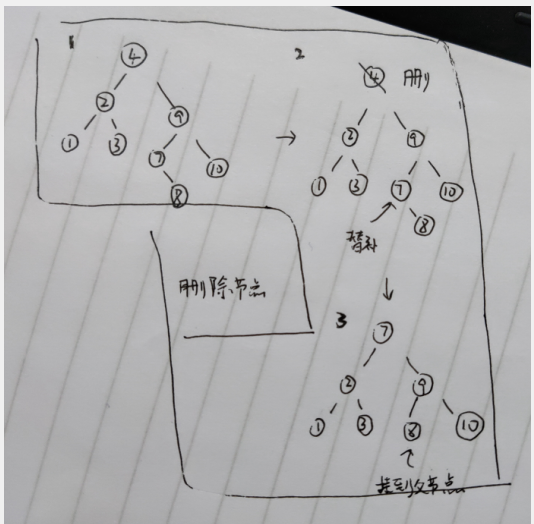
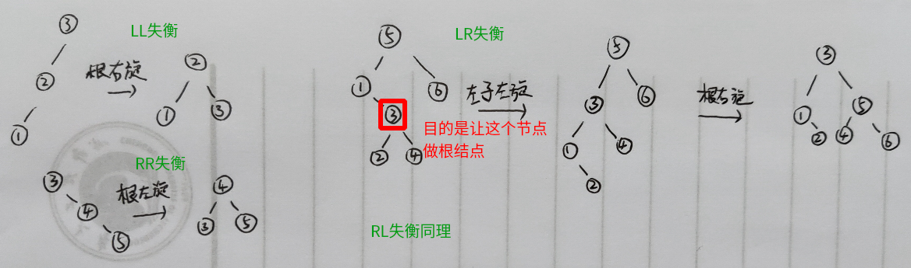
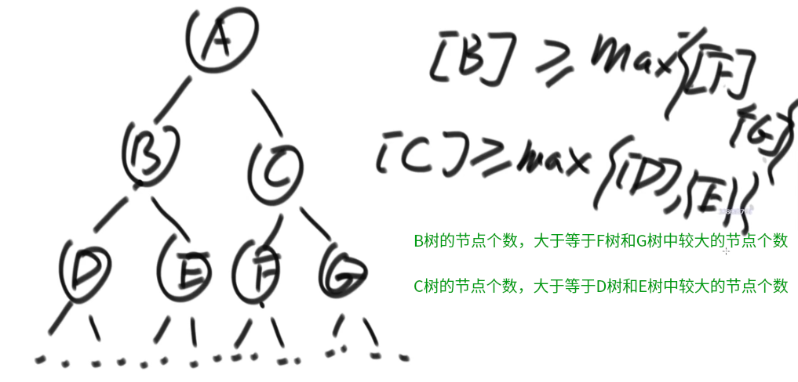
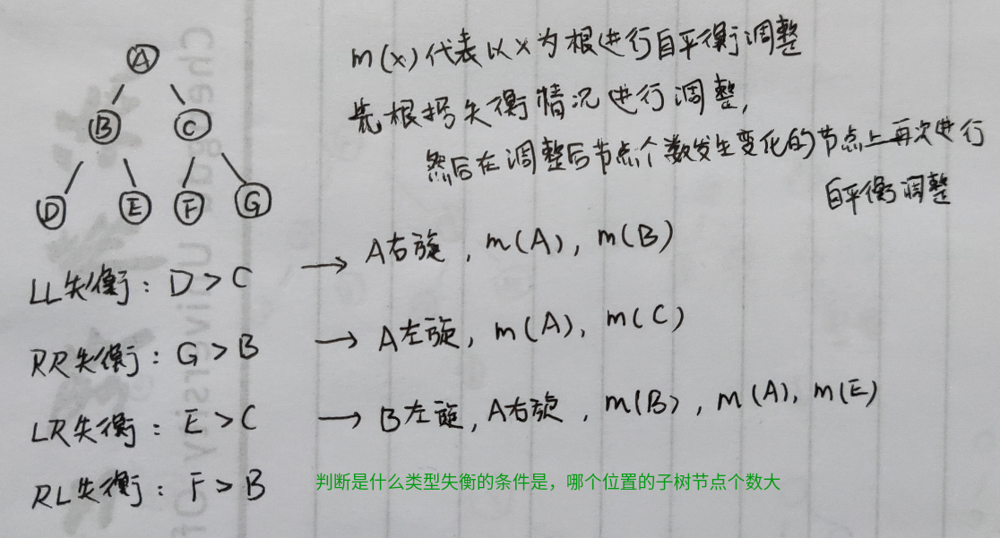
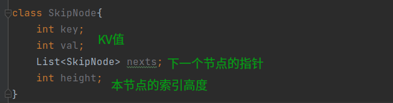
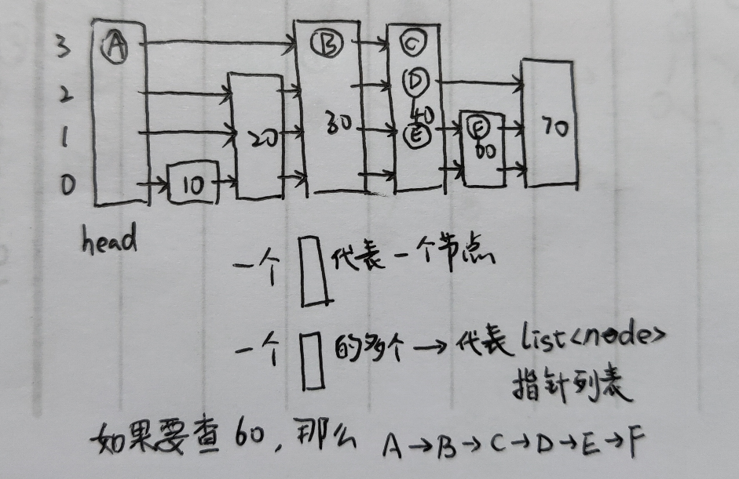

##### BST

二叉搜索树

符合 左子树所有节点小于当前节点 且 右子树所有节点大于当前节点 的二叉树

可能因为不平衡退化为链表结构

1.  插入节点：按照搜索顺序确定插入位置

2.  删除节点： 

    

*   如果删除的节点没有子树，直接删除
*   如果删除的节点有一个子树，直接删除，然后使用它的子树替代它的位置
*   如果删除的节点有两个子树，先删除该节点，然后选择 左子树中最右节点 或者 右子树中最左节点 替补上来，替补节点的子树直接挂到其原先的父节点上

##### AVL

自平衡二叉树

保持二叉树中每个节点的左子树和右子树高度差不超过1

在树失去平衡时，使用左旋和右旋操作恢复平衡

左旋和右旋：

​		代表根结点向左倒或右倒

*   左旋根结点向左倒，倒完新根结点原来的左子树挂到原来根结点的右边
*   右旋根结点向右倒，倒完新根结点原来的右子树挂到原来根结点的左边

检查树平衡性的时机：

1.  插入节点时，从插入节点的父节点开始，向上逐个检查父结点的子树是否平衡
2.  删除节点时

节点失衡的情况有四种，及其自平衡方法：

1.  LL， 左子树高度高，且左子树有左子树无右子树，直接根结点右旋
2.  RR， 右子树高度高，且右子树有右子树无左子树，直接根结点左旋
3.  LR， 左子树高度高，且左子树有右子树无左子树，左子树根结点左旋 + 根结点右旋，目的是让 产生LR 失衡的节点 成为根结点
4.  RL， 右子树高度高，且右子树有左子树无右子树，右子树根结点右旋 + 根结点左旋，目的是让 产生RL 失衡的节点 成为根结点

SBT

size balance tree 自平衡树

同样通过左旋和右旋操作实现平衡

平衡性判断标准

自平衡操作过程

##### 红黑树

自平衡树

同样通过左旋和右旋实现平衡

平衡性定义：

1.  所有节点非黑即红
2.  树根节点和叶子空节点必须是黑色
3.  红色节点不相邻
4.  从任意一个节点到叶子节点的所有路径，黑色节点个数相同

##### 跳表

实现二分查找效率的链表

通过随机概率生成多级索引，在高级索引上可以直接跳过某些节点实现查找的加速

1.  每个链表节点模型为 [k, v, list\<next>, height]

    

2.  初始时只有一个 kv 为 null 的头节点，且 height 为 1

3.  插入新节点时，首先新建节点，设置其索引高度为1，然后以 0.5 的概率决定是否生成下一层索引，假设最终新节点随机出来的高度值为 h，此时检查初始节点高度是否到达该值，达不到则增加初始节点索引高度

4.  在初始节点中从高位索引开始查找，找到小于新节点值的最大值，然后向低位索引查找，直至到0位索引，将新节点插入到该节点后面，并按照新节点索引高度建立索引

跳表数据结构可视化

跳表查找时间复杂度证明

​		因为每次生成的索引高度都是 0.5 概率随机，那么认为在样本数足够大的时候，假设第一层有 n 个节点，那么第二层有大概 n/2 个节点，第三层大概有 n/4 个节点，其结构类似于满二叉树，那么认为每次使用上级索引 next 向下走一步时，大概跳过下一层中 2 个节点，查找效率接近二分查找，为 $O(\log_2^n)$

