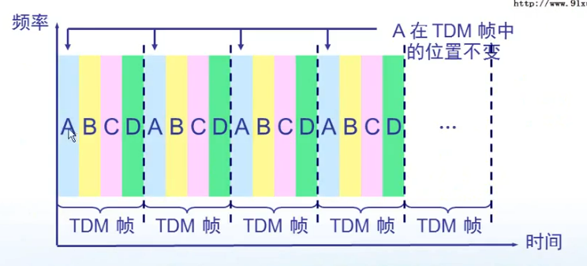

windows 中, `命令 -?` 可查看当前命令帮助文档

Ethereal 可以用来抓包

ccproxy 可以用来开代理服务器

###### 网络的层级结构

物理机 -> 交换机 -> 路由器 -> 主网络节点

一个交换机下面的物理机组成一个子网, 使用分配的网段, 例如 16.109.10.1, 也就是这个子网中所有物理机 ip地址的前三位都相同

一台物理机可以是多个子网中的节点, 在控制面板 -> 网络设置中的多个连接就代表该物理机在不同的交换机子网中扮演着不同的角色, 通过 `ipconfig` 可查看该物理机在各个子网中分配到的 ip 地址

###### ISO 网络标准体系结构

1. 应用层 : 直接跟用户交互并且产生网络流量, 也就是联网的应用程序

2. 表示层 : 将通信产生的数据进行编码和解码, 加密等操作, 也就是程序里的编码解码逻辑

3. 会话层 : 客户端与服务器的稳定通信需要建立在会话上

   ​				使用tcp协议进行通信, 就需要先建立会话

   `netstat -nb` 查看当前开启的所有会话及程序名称, 可使用该命令查看可疑木马程序是否在后台开启了会话

4. 传输层 : 负责建立可靠传输(开启会话) , 不可靠传输(不开启会话), 以及实现流量控制功能

5. 网络层 :  负责网络寻址, 匹配最佳传输路径

6. 数据链路层 : 给数据添加物理地址(MAC)信息

7. 物理层 : 规定了物理设备的电压和接口标准

    

###### 手动更改MAC地址

>   本质是使用设置的mac地址进行通信, 网卡硬件上的mac是固定的不能改的

本地连接 -> 属性 -> 配置 -> 高级 -> 网络地址

###### 网络的通信速率和双工模式

设置网络的通信速率 , 该速率需要发送方和接收方保持相同的速率, 才能正常通信, 一般选择自动协商即可:

本地连接 -> 属性 -> 配置 -> 高级 -> 速度和双工

###### 模拟信号和数字信号

​	模拟信号是连续的信号, 数字信号是离散的信号

​	在数据通信的典型模型中, 先将输入字符转换为数字信号, 然后经过调制解调器转换为模拟信号, 然后通过电话网将模拟信号发送出去, 到达对方时再通过调制解调器将模拟信号转换为数字信号, 最后解码为字符

​	但是在实际的网络通信中, 一般不会使用电话网而是直接使用计算机网络, 因此也就不需要调制解调为模拟信号, 可以直接以数字信号的形式在网络中传输

###### 基带信号和带通信号

信源直接产生的信号就是基带信号, 没有经过任何处理

为了使得基带信号能够传播得更远, 需要将它们调制至更高频率, 具有更高的能量, 调制后的信号就是带通信号

###### 信号调制的方法

###### 虚拟机中的网络配置

工具栏 -> 编辑 -> 虚拟网络编辑器

​	这个页面中会列出当前创建的所有虚拟交换机 , 每一个虚拟交换机都可以选择不同的连接 , 在具体某个虚拟机的网络选项中可以选择连接到在这里已经设置的虚拟交换机

​	所以如果想要多个虚拟机通信, 需要设置它们到同一个虚拟交换机上

桥接模式 : 该虚拟机与物理机在网络中平级, 作为真实交换机子网中的一台设备存在, 此时虚拟机访问物理机直接使用物理机在真实网络中的 IP 地址进行访问

NAT(网络地址转换模式) : 使用该模式的虚拟机可以通过宿主机对真实网络进行访问,  网络返回的数据将经由宿主机传递给该虚拟机, 使用该模式时, 应当先在 `虚拟网络编辑器 -> NAT 设置 -> 设置网关`, 然后进入虚拟机系统的网络设置, `设置该网络的网关为之前设置的地址`, 然后虚拟机便可正常上网.

###### 三网

###### 数据交换方式

>   计算机网络使用的是分组交换

*   电路交换

    ​	电话网使用的交换方式, 所有客户端都与一个交换机连接, 当一个客户端与另外一个客户端发起连接时, 就把它们之间的电路连接起来

    ​	因此同时一个客户端只能与一个客户端通信, 也就会产生占线的情况

    ​	适合数据量很大且需要实时传输的场景, 核心路由器之间有可能使用该方式

*   分组交换

    ​	数据分为多段, 加上首部后在网络中进行路由传输, 到达目的地后去除首部然后再拼接起来

    ​	多个数据段在网络中可根据情况选择不同的路径发送, 不会产生占线的情况

    ​	同时路由器有存储转发的功能, 即多个数据段来到后按照顺序依次转发

    ​	但是这种方式可能会造成时延

    ​	计算机网络均采用此方法

*   报文交换

    ​	报文交换就是不进行数据分段的分组交换, 所以每次转发到下一个路由器的时间都是整个报文传输的时间, 而分组交换中多个分组可以同时传输, 所以报文交换肯定比分组交换时延更长

    

###### 计算机网络的分类

###### mac和ip的问题

​	起初仅仅使用交换机组成的子网中, 仅仅使用mac地址来进行通信

​	随着互联网的发展, 就需要把各个交换机组成的子网组成一个大的网络, 此时如果直接通过交换机扩展计算机进来, 肯定是不现实的

​	哪怕能够把全球的计算机都接到一个交换机上, 那么某个计算机发送数据时, 数据将在整个互联网中进行广播

​	因此, 就出现了网络层设备 - `路由器`, 路由器每个端口连接一个由交换机组成的子网, 能够根据目标ip得知应当将数据转发给哪个路由器

​	当数据被转发至目标主机所在的子网中时, 就可以根据mac地址转发给指定的计算机

​	所以是先有的mac地址, 然后才有的ip地址

##### 概念篇

###### 信道

　一个客户端程序与服务端之间传输数据的连接称为信道，因此一台计算机可以同时拥有多个信道来通信

###### 信道复用

>   是指多个信号使用一个信道同时进行传输

*   频分复用

    每个信号使用指定的一种频率进行调制和解调, 信道中传输的是所有信号的总和信号

    先

    

    然后

    

*   时分复用

    把一段数据分成多端代表多条数据, 取数据的时候按照规则从相应位置取

    这种方式下, 用户量越多, 每个用户分到的位置就越小, 发送数据就越不方便

    而且如果某个用户当前没有发送数据, 那么这一块就会空着, 浪费带宽

    

*   统计时分复用

    同时分复用的方法, 不同的是不再事先分配位置, 所有用户随意发送数据, 在发送数据头加上标识信息即可表明该数据来自于哪个用户

*   码分复用

    CDMA技术, 也就是联通使用的方法

    每个手机卡都有一个唯一标识码片, 是一个二进制的序列

    每次基站都是向所有的手机卡发送信号, 手机收到信号后, 把信号与自己的码片进行内积运算, 可能得到 

    1 (代表收到一个二进制位1) 

    0 (代表没有收到信号) 

    -1 (代表收到一个二进制位0)

    

###### 带宽

​	指当前计算机与其他计算机同时传输数据的最大速率

###### 吞吐量

​	指单位时间内通过某个网络的所有的数据量

###### 时延

>   `ping 地址` 时显示的是发送加接收的总时延

*   发送时延

    数据包从准备开始到完全从网卡发送出去的时间

*   传播时延

    数据包在网络中传播的时间

*   处理时延

    接收方接收处理数据包的时间

*   排队时延

    数据包在接收方或者中继路由器上排队消耗的时间

###### mac地址

计算机的唯一标识, 由48位二进制组成, 在网卡出厂时就已经刻录到网卡上, 前24位是厂家编号, 后24位是设备编号, 但是可以在操作系统中设置使用其他的mac地址

在同一个子网中, mac地址不能冲突, 否则无法正常通信, 因为在子网中根据mac地址进行数据通信

`mac帧格式`

###### LAN和VLAN

LAN: 本地局域网, 处于一个交换机下的子网就称为一个本地局域网, 此时该子网中的所有计算机都可以相互通信

VLAN: 虚拟本地局域网, 如果不想让同一个交换机下子网中的计算机都能互相通信, 比如要分为多个独立的部门, 那么就可以在交换机上创建多个VLAN, 把各个计算机划分到不同的VLAN中, 只有同一个VLAN中的计算机才能通信

##### Internet发展史

1.  以太网阶段

    >   本质就是拿一根总线把几台计算机连接起来形成一个局域网, 这种结构能够保证带宽, 但是网络中同时只能有一个发送方和接收方传递数据, 而且因为广播的性质, 导致极不安全

    

##### 如何上网?

###### ADSL拨号

就是电脑接到电话线上, 然后通过电话线同时传输电话信号和网络信号, 当然它们使用不同的频率来传输, 用的是频分复用技术

###### HFC 光纤同轴混合网

就是电脑接到电视线上, 通过频分复用的技术跟电视信号使用同一条线路

###### FTTx 光纤到x

就是直接把接到Internet的光纤接到家里, 就是直接接入互联网的方法

##### 设备篇

###### 各层设备总结

###### 集线器

>   物理层

​	连接多台计算机, 进行信号传输, 只有信号放大和重发的功能, 为的是扩大信号的传输范围, 没有路由的功能, 信息在集线器组成的子网中是广播的形式传播, 因此安全性极低, 现在该设备已被淘汰

###### 网桥

>   本质是带存储功能的集线器
>
>   集线器相当于直接把几台计算机多对多连接起来
>
>   网桥则能够在收到计算机请求时保存`该计算机的mac地址`与`当前接口`的对应关系, 待到下次发给这台计算机数据时, 就只向之前保存的这个接口中发送数据, 这样就不会影响其他接口下计算机的通信
>
>   网桥有存储转发的排队功能

###### 交换机

>   豪华版本的网桥
>
>   ​	使用网桥扩展的网络是 : 计算机 -> 集线器 -> 网桥
>
>   ​	使用交换机扩展的网络是 : 计算机 -> 交换机
>
>   每个计算机都独享交换机上的一个接口, 极大的提高了数据传输效率, 也不再有广播的情况产生, 提高了安全性
>
* 交换机一开始地址映射表也是空的, 也得根据请求不断更新
* 交换机上可以配置端口mac地址绑定, 也就是某个端口只能接某个mac地址的计算机, 如果接了别的mac地址, 那么该端口自动关闭
* 交换机上可以配置端口最大mac地址数量, 也就是限制直接连接到该端口的计算机数量
* 交换机根据mac地址转发数据

###### 路由器

​	网关实际上就是本子网的路由器, 一般选择本网段的第一个或者最后一个地址, 是为了防止和子网中其他计算机ip地址冲突, 本质上可以使用本网段中任一地址

​	路由器一个接口就是一个网段

##### 七层模型

###### 物理层

传输介质-光纤

短波和微波

*   短波通信通过地球电离层的反射进行通信, 覆盖范围广但信号差
*   微波通信通过覆盖全球的信号塔传输信号, 通信质量好但是需要实现建设信号塔

###### 数据链路层

​	该层负责对传输数据进行差错控制

​	该层可以使用`点到点的通信方式`和`广播的通信方式`

`帧头和帧尾`

​	在发送方将数据加头加尾然后转换为电信号发送出去, 接收方则负责去头去尾得到原数据, 如果一个数据帧中没有同时包含头和尾, 那么作为无效数据直接丢弃

`循环冗余检校码`

>   循环冗余检查只保证数据传输过来是正确的, 不提供差错重传功能, 要求重传的功能由上层应用实现

 	在发送的数据头中加入`循环冗余检校码`, 用来检查数据部分是否正确传输, 具体是

1.  双方根据协议事先规定一个除数, 在原数据后面补上相应位数的0, 然后用原数据除以除数, 会得到一个余数, 如果用这个余数加回原数据, 那么此时的原数据就刚好能整除除数
2.  把上面得到的`余数`连同数据一起发送给接收方, 接收方收到余数后, 把原数据加上余数, 然后除以除数, 如果能整除, 则认为接收到的数据和原数据相同
3.  这种方法的缺点是如果数据传输时发生了错误, 然后刚好它加上余数后还能被除数整除, 这样的错误将不会被检测出来
4.  减少这种情况发生的方法就是使用一个更大的除数

`PPP-点到点协议`

*   其中的7E分别代表帧头和帧尾
*   协议部分用来标识数据部分的类型

`CSMA/CD-广播通信协议`

>   使用碰撞检测机制, 实现局域网中半双工的广播通信
>
>   碰撞检测的时间为`两倍的到达目的地时间`, 超过这个时间没有收到冲突, 则认为不存在冲突, 进而继续发送数据, 否则停止发送数据, 等待随机时间后再次发出消息

###### 网络层

​	网络层依然不保证数据的可靠传输, 也就是如果发现数据传输错误, 就直接丢弃该数据, 数据包的可靠性传输应当由上层应用实现

`网络层提供的两种服务`

*   虚电路服务 (静态路由)

    ​	数据的传送路径事先由网络管理员规定好, 然后数据就直接使用规定的路径传送, 在大型网络中显然无法实现

*   数据报服务 (动态路由)

    ​	数据交给路由器动态地决定传送路径, 因此稳定性较高, 因为一条线路断了还可以使用其他的线路, 但是相应的传输效率会降低

`网络层的四种协议`

`ip地址分类`

根据ip地址前八位可判断是哪类地址, 进而可以得知默认的子网掩码

*   0~127 A类地址
*   128~191 B类地址
*   192~223 C类地址
*   224~255 D类地址

`特殊的ip地址`

127.0.0.x 本机

169.254.0.X  在windows中设置为ip自动获得且多次尝试获取ip地址但是没有收到被分配的ip地址后自动使用的ip地址

10.0.0.0 保留地址

172.16.0.0 ~ 172.31.0.0 保留地址

192.168.0.0 ~ 192.168.255.0 保留地址

这些保留地址在公网上都不存在

另外, 每个网段主机部分全为0 (代表当前网段) 或者全为1 (代表在本网段中广播) 的地址不能作为计算机ip地址

`子网掩码`

​	子网掩码用来标识ip地址哪部分是网络部分, 哪部分是主机部分

​	计算机发起网络请求时, 操作系统首先判断目标地址是否与自己在同一个网段, 是则直接在子网中发送请求, 否则将请求发送给网关

`网络层协议-arp`

arp协议规定了由ip地址获取到mac地址的流程

​	在计算机发起请求时, 操作系统首先判断是否是本网段的地址, 是则在本网段中广播 who is ip地址, tell mac xxx , 然后目标计算机收到后, 回应 i'm ip地址, my mac is xxx, 当发送方收到回应后, 就存下该ip与mac的对应关系, 下次再请求这个ip地址时, 就直接请求这个mac地址

`arp -a` 查看当前缓存的ip与mac对应关系

`arp -s ip mac` 手动设置该ip与该mac是对应关系

arp欺骗

​	当计算机问 who is ip xxx, tell mac xxx 时, 行骗的计算机就回应一个自己的mac地址, 然后发送方就存下了错误的对应关系, 以后该计算机的流量就都发给了行骗计算机

`网络层协议-rarp`

​	该协议规定了由mac地址获取到ip地址的流程, 计算机请求分配ip地址就是这个协议

`网络层协议-ip`

​	该协议规定了数据应当在网络层如何封装以及如何解封

*   版本 ipv4/ipv6

*   首部长度 : 首部的总长度

*   区分服务(Qos-服务质量) : 标识该数据包的发送优先级, 这个属性得配合路由器的优先级设置才能生效

*   总长度 : 该数据包的总长度

*   标识 : 计数器, 每产生一个数据包, 该标识加一

*   标志 : 标识该包是否为分片的包 (数据包过大时, 会分片传输)

*   片偏移: 当数据包为分片包时, 该包在总数据包中的位置

*   生存时间(TTL) : 该包在网络中最多经过的路由器数量, 如果经过的路由器数量超过这个值, 直接丢弃该包不再继续传输, 为的是防止一个永远也到不了目的地的包在网络中无线传输

    `ping xxx` 时会显示还剩多少个ttl

    `ping xxx -i n` ping, 同时设置使用的ttl数量

*   协议 : 表明数据部分使用什么协议

*   首部检验和 : 验证数据头是否正确传输

*   源地址/目标地址 : 源ip/目标ip

