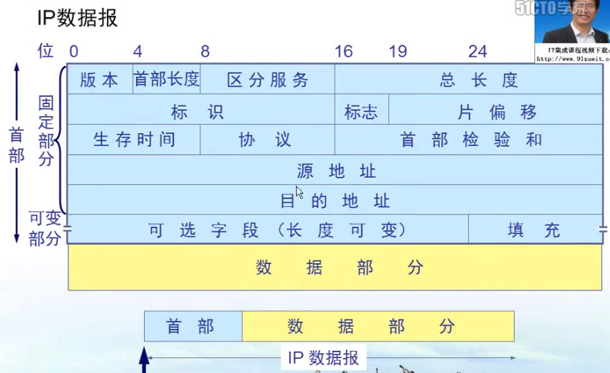

windows 中, `命令 -?` 可查看当前命令帮助文档

Ethereal 可以用来抓包

ccproxy 可以用来开代理服务器

cain 利用arp欺骗可以截获/篡改/中断/伪造本网段中其他计算机的请求, 用这个的前提是安装抓包驱动 - winpcap, 让网卡接收给任何人的数据包

###### 网络的层级结构

物理机 -> 交换机 -> 路由器 -> 主网络节点

一个交换机下面的物理机组成一个子网, 使用分配的网段, 例如 16.109.10.1, 也就是这个子网中所有物理机 ip地址的前三位都相同

一台物理机可以是多个子网中的节点, 在控制面板 -> 网络设置中的多个连接就代表该物理机在不同的交换机子网中扮演着不同的角色, 通过 `ipconfig` 可查看该物理机在各个子网中分配到的 ip 地址

###### ISO 网络标准体系结构

1. 应用层 : 直接跟用户交互并且产生网络流量, 也就是联网的应用程序

2. 表示层 : 将通信产生的数据进行编码和解码, 加密等操作, 也就是程序里的编码解码逻辑

3. 会话层 : 客户端与服务器的稳定通信需要建立在会话上

   ​				使用tcp协议进行通信, 就需要先建立会话

   ​				会话层功能由操作系统实现, 即在内存中给socket分配空间

   `netstat -nb` 查看当前开启的所有会话及程序名称, 可使用该命令查看可疑木马程序是否在后台开启了会话

4. 传输层 : 负责建立可靠传输(开启会话) , 不可靠传输(不开启会话), 以及实现流量控制功能

5. 网络层 :  负责网络寻址, 匹配最佳传输路径

6. 数据链路层 : 给数据添加物理地址(MAC)信息

7. 物理层 : 规定了物理设备的电压和接口标准

    

###### 手动更改MAC地址

>   本质是使用设置的mac地址进行通信, 网卡硬件上的mac是固定的不能改的

本地连接 -> 属性 -> 配置 -> 高级 -> 网络地址

###### 网络的通信速率和双工模式

设置网络的通信速率 , 该速率需要发送方和接收方保持相同的速率, 才能正常通信, 一般选择自动协商即可:

本地连接 -> 属性 -> 配置 -> 高级 -> 速度和双工

###### 模拟信号和数字信号

​	模拟信号是连续的信号, 数字信号是离散的信号

​	在数据通信的典型模型中, 先将输入字符转换为数字信号, 然后经过调制解调器转换为模拟信号, 然后通过电话网将模拟信号发送出去, 到达对方时再通过调制解调器将模拟信号转换为数字信号, 最后解码为字符

​	但是在实际的网络通信中, 一般不会使用电话网而是直接使用计算机网络, 因此也就不需要调制解调为模拟信号, 可以直接以数字信号的形式在网络中传输

###### 基带信号和带通信号

信源直接产生的信号就是基带信号, 没有经过任何处理

为了使得基带信号能够传播得更远, 需要将它们调制至更高频率, 具有更高的能量, 调制后的信号就是带通信号

###### 信号调制的方法

###### 虚拟机中的网络配置

工具栏 -> 编辑 -> 虚拟网络编辑器

​	这里面每个 VMnetx 都代表一个VLAN, 一个独立的子网, 然后在虚拟机设置中可以选择加入这些子网

​	这个页面中会列出当前创建的所有虚拟路由器 , 每一个虚拟交换机都可以选择不同的连接 , 在具体某个虚拟机的网络选项中可以选择连接到在这里已经设置的虚拟交换机

​	所以如果想要多个虚拟机通信, 需要设置它们到同一个虚拟交换机上

桥接模式 : 该虚拟机与物理机在网络中平级, 作为真实交换机子网中的一台设备存在, 此时虚拟机访问物理机直接使用物理机在真实网络中的 IP 地址进行访问

NAT(网络地址转换模式) : 使用该模式的虚拟机可以通过宿主机对真实网络进行访问,  网络返回的数据将经由宿主机传递给该虚拟机, 使用该模式时, 应当先在 `虚拟网络编辑器 -> NAT 设置 -> 设置网关`, 然后进入虚拟机系统的网络设置, `设置该网络的网关为之前设置的地址`, 然后虚拟机便可正常上网.

###### 三网

###### 数据交换方式

>   计算机网络使用的是分组交换

*   电路交换

    ​	电话网使用的交换方式, 所有客户端都与一个交换机连接, 当一个客户端与另外一个客户端发起连接时, 就把它们之间的电路连接起来

    ​	因此同时一个客户端只能与一个客户端通信, 也就会产生占线的情况

    ​	适合数据量很大且需要实时传输的场景, 核心路由器之间有可能使用该方式

*   分组交换

    ​	数据分为多段, 加上首部后在网络中进行路由传输, 到达目的地后去除首部然后再拼接起来

    ​	多个数据段在网络中可根据情况选择不同的路径发送, 不会产生占线的情况

    ​	同时路由器有存储转发的功能, 即多个数据段来到后按照顺序依次转发

    ​	但是这种方式可能会造成时延

    ​	计算机网络均采用此方法

*   报文交换

    ​	报文交换就是不进行数据分段的分组交换, 所以每次转发到下一个路由器的时间都是整个报文传输的时间, 而分组交换中多个分组可以同时传输, 所以报文交换肯定比分组交换时延更长

    

###### 计算机网络的分类

###### mac和ip的问题

​	起初仅仅使用交换机组成的子网中, 仅仅使用mac地址来进行通信

​	随着互联网的发展, 就需要把各个交换机组成的子网组成一个大的网络, 此时如果直接通过交换机扩展计算机进来, 肯定是不现实的

​	哪怕能够把全球的计算机都接到一个交换机上, 那么某个计算机发送数据时, 数据将在整个互联网中进行广播

​	因此, 就出现了网络层设备 - `路由器`, 路由器每个端口连接一个由交换机组成的子网, 能够根据目标ip得知应当将数据转发给哪个路由器

​	当数据被转发至目标主机所在的子网中时, 就可以根据mac地址转发给指定的计算机

​	所以是先有的mac地址, 然后才有的ip地址

###### VPN

​	在私有子网中整一个服务器, 这个服务器一方面连接到私有子网, 另一方面连接到公网, 有两个 IP地址, 分别是私网ip 和 公网ip

​	现在在公网中的计算机想要访问私网中的资源, 首先需要访问VPN服务器, 然后VPN服务器给其分配一个私网中的IP地址并返回

​	以后这台公网计算机要访问私网资源时, 就需要给数据包加两层IP数据头, 先套一层在私网中使用的IP数据头, 然后再套一层公网中使用的IP数据头

​	先通过公网把数据包发送给VPN服务器, 然后VPN服务器去掉外层IP数据头, 取得内层IP数据头, 发送给私网中指定的计算机, 收到回复后, 再加装一层用于公网中的IP数据头发送给公网中的计算机

​	**连接到VPN的本质可以看作把自己的机子搬到私网里面去了**

windows中创建vpn连接

1.  网络连接

2.  创建新连接

3.  连接到工作区

4.  使用新连接

5.  使用vpn进行连接

6.  输入VPN服务器地址

7.  输入用户名/密码

8.  可以设置该连接的 ipv4 设置 -> 高级 -> 在远程网络上使用默认网关

    这个选项勾选了就是连接了VPN之后, 再访问外网时会通过私网的网关访问目标网站

    不勾选就是连接了VPN之后, 访问外网时依然直接通过本地网关连接外网

windows开启VPN服务

......

隧道连接技术

​	假设有两个部门在不同的地方, 现在想要它们之间组件虚拟专用网, 不需要拨号, 那么就可以使用隧道技术, 在部门A和部门B的路由器上都设置使用隧道, 那么此时两个子网就可以实现专有互通, 且其中的计算机都不要拨号就能互相访问

###### NAT地址转换

​	内网中的计算机只有内网IP, 此时如果要访问外网资源, 那么请求可以通过网关发送到目标地址, 但是由于发送IP是内网IP, 外网中的路由器不知道怎么走, 所以外网计算机的响应就无法返回给内网计算机

​	此时可以使用NAT的方法, 当内网计算机访问外网资源时, 首先经过网关, 网关将源IP换成自己的IP, 因为网关IP在外网路由器中有记录, 所以此时网关可以收到外网计算机的响应, 然后根据记录再发送给子网中的对应计算机

​	使用NAT的方法使得子网中的计算机可以访问外网资源, 且外网计算机不可以访问内网计算机

###### 端口映射

​	如果想要外网计算机可以访问内网计算机上的某个服务, 那么可以使用端口映射

​	假设该子网的`网关`是 A , A同时连接着外网和内网, 此时可以在A上面设置端口映射, 把自己的端口映射到子网中某台计算机的某个端口, 设置后, 外网中其他计算机可通过访问网关的这个端口来访问内网中计算机的映射端口

​	在windows虚拟机中也可以设置端口映射功能

​	假设windows中开了一个虚拟机, 虚拟机中配置了一个使用NAT的网段 VMnet8, 该网段中包含一台虚拟机

​	那么此时可以在虚拟机网络设置 -> VMnet8 -> Nat settings -> port forwarding -> add -> 添加端口映射

​	完事之后跟本机处在同一子网中的计算机就能通过访问本机的映射端口来访问虚拟机 

###### windows防火墙

​	本质就是关闭计算机上所有的端口, 那么此时就相当于不对外开放任何端口, 任何来自于外部的请求都进不来, 当计算机主动访问外部资源时, 临时开启相应端口, 用完后再关闭

​	开启了防火墙就意味着其他计算机无法访问本机的任何服务

##### 概念篇

###### 信道

　一个客户端程序与服务端之间传输数据的连接称为信道，因此一台计算机可以同时拥有多个信道来通信

###### 信道复用

>   是指多个信号使用一个信道同时进行传输

*   频分复用

    每个信号使用指定的一种频率进行调制和解调, 信道中传输的是所有信号的总和信号

    先

    

    然后

    

*   时分复用

    把一段数据分成多端代表多条数据, 取数据的时候按照规则从相应位置取

    这种方式下, 用户量越多, 每个用户分到的位置就越小, 发送数据就越不方便

    而且如果某个用户当前没有发送数据, 那么这一块就会空着, 浪费带宽

    

*   统计时分复用

    同时分复用的方法, 不同的是不再事先分配位置, 所有用户随意发送数据, 在发送数据头加上标识信息即可表明该数据来自于哪个用户

*   码分复用

    CDMA技术, 也就是联通使用的方法

    每个手机卡都有一个唯一标识码片, 是一个二进制的序列

    每次基站都是向所有的手机卡发送信号, 手机收到信号后, 把信号与自己的码片进行内积运算, 可能得到 

    1 (代表收到一个二进制位1) 

    0 (代表没有收到信号) 

    -1 (代表收到一个二进制位0)

    

###### 带宽

​	指当前计算机与其他计算机同时传输数据的最大速率

###### 吞吐量

​	指单位时间内通过某个网络的所有的数据量

###### 时延

>   `ping 地址` 时显示的是发送加接收的总时延

*   发送时延

    数据包从准备开始到完全从网卡发送出去的时间

*   传播时延

    数据包在网络中传播的时间

*   处理时延

    接收方接收处理数据包的时间

*   排队时延

    数据包在接收方或者中继路由器上排队消耗的时间

###### mac地址

计算机的唯一标识, 由48位二进制组成, 在网卡出厂时就已经刻录到网卡上, 前24位是厂家编号, 后24位是设备编号, 但是可以在操作系统中设置使用其他的mac地址

在同一个子网中, mac地址不能冲突, 否则无法正常通信, 因为在子网中根据mac地址进行数据通信

`mac帧格式`

###### LAN和VLAN

LAN: 本地局域网, 处于一个交换机下的子网就称为一个本地局域网, 此时该子网中的所有计算机都可以相互通信

VLAN: 虚拟本地局域网, 如果不想让同一个交换机下子网中的计算机都能互相通信, 比如要分为多个独立的部门, 那么就可以在交换机上创建多个VLAN, 把各个计算机划分到不同的VLAN中, 只有同一个VLAN中的计算机才能通信

##### Internet发展史

1.  以太网阶段

    >   本质就是拿一根总线把几台计算机连接起来形成一个局域网, 这种结构能够保证带宽, 但是网络中同时只能有一个发送方和接收方传递数据, 而且因为广播的性质, 导致极不安全

    

##### 如何上网?

###### ADSL拨号

就是电脑接到电话线上, 然后通过电话线同时传输电话信号和网络信号, 当然它们使用不同的频率来传输, 用的是频分复用技术

###### HFC 光纤同轴混合网

就是电脑接到电视线上, 通过频分复用的技术跟电视信号使用同一条线路

###### FTTx 光纤到x

就是直接把接到Internet的光纤接到家里, 就是直接接入互联网的方法

##### 设备篇

###### 各层设备总结

###### 集线器

>   物理层

​	连接多台计算机, 进行信号传输, 只有信号放大和重发的功能, 为的是扩大信号的传输范围, 没有路由的功能, 信息在集线器组成的子网中是广播的形式传播, 因此安全性极低, 现在该设备已被淘汰

###### 网桥

>   本质是带存储功能的集线器
>
>   集线器相当于直接把几台计算机多对多连接起来
>
>   网桥则能够在收到计算机请求时保存`该计算机的mac地址`与`当前接口`的对应关系, 待到下次发给这台计算机数据时, 就只向之前保存的这个接口中发送数据, 这样就不会影响其他接口下计算机的通信
>
>   网桥有存储转发的排队功能

###### 交换机

>   豪华版本的网桥
>
>   ​	使用网桥扩展的网络是 : 计算机 -> 集线器 -> 网桥
>
>   ​	使用交换机扩展的网络是 : 计算机 -> 交换机
>
>   每个计算机都独享交换机上的一个接口, 极大的提高了数据传输效率, 也不再有广播的情况产生, 提高了安全性
* 交换机一开始地址映射表也是空的, 也得根据请求不断更新
* 交换机上可以配置端口mac地址绑定, 也就是某个端口只能接某个mac地址的计算机, 如果接了别的mac地址, 那么该端口自动关闭
* 交换机上可以配置端口最大mac地址数量, 也就是限制直接连接到该端口的计算机数量
* 交换机根据mac地址转发数据

###### 路由器

​	网关实际上就是本子网的路由器, 一般选择本网段的第一个或者最后一个地址, 是为了防止和子网中其他计算机ip地址冲突, 本质上可以使用本网段中任一地址

​	路由器一个接口就是一个网段

##### 七层模型

###### 物理层

传输介质-光纤

短波和微波

*   短波通信通过地球电离层的反射进行通信, 覆盖范围广但信号差
*   微波通信通过覆盖全球的信号塔传输信号, 通信质量好但是需要实现建设信号塔

###### 数据链路层

​	该层负责对传输数据进行差错控制

​	该层可以使用`点到点的通信方式`和`广播的通信方式`

`帧头和帧尾`

​	在发送方将数据加头加尾然后转换为电信号发送出去, 接收方则负责去头去尾得到原数据, 如果一个数据帧中没有同时包含头和尾, 那么作为无效数据直接丢弃

`循环冗余检校码`

>   循环冗余检查只保证数据传输过来是正确的, 不提供差错重传功能, 要求重传的功能由上层应用实现

 	在发送的数据头中加入`循环冗余检校码`, 用来检查数据部分是否正确传输, 具体是

1.  双方根据协议事先规定一个除数, 在原数据后面补上相应位数的0, 然后用原数据除以除数, 会得到一个余数, 如果用这个余数加回原数据, 那么此时的原数据就刚好能整除除数
2.  把上面得到的`余数`连同数据一起发送给接收方, 接收方收到余数后, 把原数据加上余数, 然后除以除数, 如果能整除, 则认为接收到的数据和原数据相同
3.  这种方法的缺点是如果数据传输时发生了错误, 然后刚好它加上余数后还能被除数整除, 这样的错误将不会被检测出来
4.  减少这种情况发生的方法就是使用一个更大的除数

`PPP-点到点协议`

*   其中的7E分别代表帧头和帧尾
*   协议部分用来标识数据部分的类型

`CSMA/CD-广播通信协议`

>   使用碰撞检测机制, 实现局域网中半双工的广播通信
>
>   碰撞检测的时间为`两倍的到达目的地时间`, 超过这个时间没有收到冲突, 则认为不存在冲突, 进而继续发送数据, 否则停止发送数据, 等待随机时间后再次发出消息

###### 网络层

​	网络层依然不保证数据的可靠传输, 也就是如果发现数据传输错误, 就直接丢弃该数据, 数据包的可靠性传输应当由上层应用实现

`网络层提供的两种服务`

*   虚电路服务 (静态路由)

    ​	数据的传送路径事先由网络管理员规定好, 然后数据就直接使用规定的路径传送, 在大型网络中显然无法实现

*   数据报服务 (动态路由)

    ​	数据交给路由器动态地决定传送路径, 因此稳定性较高, 因为一条线路断了还可以使用其他的线路, 但是相应的传输效率会降低

`网络层的四种协议`

`ip地址分类`

根据ip地址前八位可判断是哪类地址, 进而可以得知默认的子网掩码

*   0~127 A类地址
*   128~191 B类地址
*   192~223 C类地址
*   224~255 D类地址

`特殊的ip地址`

127.0.0.x 本机

169.254.0.X  在windows中设置为ip自动获得且多次尝试获取ip地址但是没有收到被分配的ip地址后自动使用的ip地址

10.0.0.0 保留地址

172.16.0.0 ~ 172.31.0.0 保留地址

192.168.0.0 ~ 192.168.255.0 保留地址

这些保留地址在公网上都不存在

另外, 每个网段主机部分全为0 (代表当前网段) 或者全为1 (代表在本网段中广播) 的地址不能作为计算机ip地址

`子网掩码`

​	子网掩码用来标识ip地址哪部分是网络部分, 哪部分是主机部分

​	计算机发起网络请求时, 操作系统首先判断目标地址是否与自己在同一个网段, 是则直接在子网中发送请求, 否则将请求发送给网关

`网络层协议-arp`

arp协议规定了由ip地址获取到mac地址的流程

​	在计算机发起请求时, 操作系统首先判断是否是本网段的地址, 是则在本网段中广播 who is ip地址, tell mac xxx , 然后目标计算机收到后, 回应 i'm ip地址, my mac is xxx, 当发送方收到回应后, 就存下该ip与mac的对应关系, 下次再请求这个ip地址时, 就直接请求这个mac地址

`arp -a` 查看当前缓存的ip与mac对应关系

`arp -s ip mac` 手动设置该ip与该mac是对应关系

arp欺骗

​	当计算机问 who is ip xxx, tell mac xxx 时, 行骗的计算机就回应一个自己的mac地址, 然后发送方就存下了错误的对应关系, 以后该计算机的流量就都发给了行骗计算机

`网络层协议-rarp`

​	该协议规定了由mac地址获取到ip地址的流程, 计算机请求分配ip地址就是这个协议

`网络层协议-ip`

​	该协议规定了数据应当在网络层如何封装以及如何解封

*   版本 ipv4/ipv6

*   首部长度 : 首部的总长度

*   区分服务(Qos-服务质量) : 标识该数据包的发送优先级, 这个属性得配合路由器的优先级设置才能生效

*   总长度 : 该数据包的总长度

*   标识 : 计数器, 每产生一个数据包, 该标识加一

*   标志 : 标识该包是否为分片的包 (数据包过大时, 会分片传输)

*   片偏移: 当数据包为分片包时, 该包在总数据包中的位置

*   生存时间(TTL) : 该包在网络中最多经过的路由器数量, 如果经过的路由器数量超过这个值, 直接丢弃该包不再继续传输, 为的是防止一个永远也到不了目的地的包在网络中无线传输

    `ping xxx` 时会显示还剩多少个ttl

    `ping xxx -i n` ping, 同时设置使用的ttl数量

*   协议 : 表明数据部分使用什么协议

*   首部检验和 : 验证数据头是否正确传输

*   源地址/目标地址 : 源ip/目标ip

`数据路由`

数据在网络中转发寻址的方法, 分为静态路由和动态路由的方法

>   在操作系统中可以手动设置静态路由 `route add ip mask 掩码 下一跳ip`
>
>   显示路由表 `route print`

*   静态路由: 网络管理员在路由器上手动指定网段和端口的对应关系, 这显然不现实

*   动态路由: 路由器动态地更新路由表

    *   RIP动态路由协议

        ​	网络中的每个路由器周期性广播自己连接的网段信息, 其他路由器接收到广播信息后就保存为路由表, 如果收到某个地址的多个映射关系, 选择跳数少的保留

        ​	如果连续几个周期都没有收到某个端口的广播, 则认为该端口连接的路由器已经完蛋, 此时向周围广播该路由器已经完蛋的信息, 进而删除相关路由表记录

        ​	rip协议在路由器上设置使用

    *   OSPF动态路由协议

        ​	只是在网络初始时交换路由信息并保存为链路状态表, 同时保存一个邻居表, 每隔一段时间向邻居发送hello包确认邻居是否健在

        ​	当收到多种目的地相同的链路时, 选取带宽最大的路径保存

`网络层协议-ICMP`

一种网络层的数据包, 用来验证网络是否畅通, ping命令发送的就是ICMP数据包

另外, 可以使用 `pathping ip` 统计到目标ip途径各个路由的畅通情况

`网络层协议-IGMP`

一种网络层的数据包, 这种数据包会被多播, 也就是发送给多个接收端, 适用于直播和会议之类

###### 传输层

​	本质就是计算机上有一个程序, 当计算机收到IP类型的网络数据包后

​	首先判断IP数据头的中指定的下层协议是TCP还是UDP

​	然后将数据交给TCP处理程序或者UDP处理程序

​	假设是TCP类型的数据, 那么TCP程序就查看使用的是哪个端口, 然后交给监听了指定端口的应用程序

​	比如是数据是http类型的, 而且它使用的端口是80, 那么就交给监听了80端口的服务程序进行处理

`传输控制协议-TCP`

*   源端口/目标端口 : 表明这个tcp连接来自于发送方哪个端口和要给到接收方哪个端口

*   序号 : 当前数据包在整个数据中的位置

*   确认号 : 接收方返回的确认消息, 告诉发送方该发第几个数据包

*   数据偏移 : tcp首部的总长度

*   保留 : 没有用

*   URG : 该数据包是否优先传输

*   ACK : 确认号是否有效

*   SYN : 是否为建立会话的数据包

    ​	SYN攻击: 向被攻击计算机大量发送源地址为不存在地址的请求建立会话的消息, 此时被攻击计算机就需要占用资源依次回应, 而又迟迟得不到响应, 那么就会大量消耗其资源造成宕机

*   PSH : 该数据包到达接收方后是否优先发给应用程序

*   RST : 是否出现异常需要重新建立连接才能继续通信, 比如浏览器点了 X 停止加载

*   FIN : 是否数据传输完毕, 释放连接

*   窗口 : 告诉对方自己的接收缓存是多大, 对方收到后根据这个值设置发送缓存, 双方的发送和接收缓存应当匹配, 否则造成发的过快来不及收或者发的过慢浪费了接收缓存的情况

*   检验和 : 用来验证数据是否被正确传输

*   紧急指针 : URG为1时生效, 表明数据部分哪部分需要紧急发送

*   一种保证可靠传输的方法

    ​	停止等待协议(方法) : 数据被分为多个数据包进行传输, 其中每一个数据包的发送都使用如下的确认方法, 这种方法虽然能够保证数据包正确可靠地到达, 但是将会浪费掉大量的时间去等待, 所以信道利用率很低, 因此, 这种方法被抛弃

    

    

    ​	流水线传输方法: 使用滑动窗口, 每次选中TCP缓存中的一部分数据进行发送, 多个数据报顺序进行发送, 不再等到上一个数据包确认到达, 后面每次收到确认消息时就移动滑动窗口不再包括已经确认到达的部分.

    ​	下图为滑动窗口示意图, 其中每个数字代表一个数据包, 每当收到前面的确认收到消息后, 就向后移动窗口, 此时把已经确认的部分从TCP缓存中清除, 并把新加入到窗口的数据包发送出去

    ​	如果接收方某个数据包没有收到, 那么返回的确认也将是不连续的, 此时发送方就根据缺失的部分进行数据包重发

    

*   需要建立会话, `netstat -n` 查看建立的会话

    ​	

    

    释放连接的流程
    
    1.  A: 我完事了(FIN=1)
    2.  B: 发送数据ing...
    3.  B: 我也完事了(FIN=1)
    4.  A: 行, 知道了
    5.  A: 等ing...
    6.  A: 下线

    为什么A要最后一次确认释放连接后要等一会?

    >   ​		等待时间为 2MSL（maximum segment lifetime，因为ttl的存在，一个数据包在网络中的生存时间是固定的，msl就是这个时间）

    ​		不等的话, 如果A最后一次的确认又没有到达B, 然后B会认为它发的FIN=1的消息A没有收到, 就会再发一次, 这个时候, A已经下线了, 那么A自然就永远不会给B最后的确认, B就永远收不到最后的确认也就永远不能释放连接, 不能释放内存

    ​		还有一点，就是如果在之前的数据通信中，被动方发送过来的数据包被延迟了，如果主动方不在关闭连接最后等待一段时间，而且主动方关闭连接后紧接着又与其他客户端建立了新的连接，那么上一个连接延迟的数据包可能在下一个连接中收到，被认为是当前连接的数据包而造成数据错乱

    

    为什么三次握手?

    ​	如果不是在再次收到A的确认连接消息后才建立连接 ( 分配TCP缓存 ), 而是第一次收到请求连接时就直接建立连接

    ​	现假设A第一次发的请求走了远路, 过了好久都没到达B, 此时A会认为发送失败进而重新发送

    ​	而恰好第二次请求很快就到达了B, B收到请求后即分配内存建立连接
    
    ​	然后过了一会, A的第一次请求也到达了B, B同样会再一次为A分配内存建立连接
    
    ​	那么此时B上面就多为A分配了一次无用的内存, 造成B的资源浪费
    
    ​	而有了再次确认的机制后, B收到请求后不会直接为其分配内存, 而是返回一个确认连接消息, A给B多次发送了请求连接, 进而A会收到多次确认连接消息, 而A只认为第一次B的确认连接有效, 以后再收到的就是无效, 那么B将只会收到一次第二次的确认消息, 进而也顶多为A分配一次内存, 避免了内存的浪费

*   所谓会话

    ​	就是使用本机的一个端口发送请求, 访问目标服务器的指定端口

    ​	当计算机收到来自目标服务器目标端口的数据时, 再返回给发出请求的端口的应用程序

    ​	本质就是首先得知道要访问哪个服务, 然后还得知道是谁发起的请求, 这样数据才能有去有回, 完成一次请求和响应

*   一种能够实现流量控制的方法

*   一种能够实现拥塞控制的方法

    ​	使用拥塞窗口 (cwnd) 的方法进行控制, 实际的滑动窗口的大小为 `min[rwnd, cwnd]`

    ​	慢开始门限的方法每次发生拥塞时就把拥塞窗口又至为初始值, 这样并不能最大化地利用信道

    

    ​	快重传方法能够在丢包的情况下更快地进行响应要求重传

    

    

*   一种面向字节流的传输方法

    ​	意思就是无论发送的是图片, 文字还是视频, 都先转换为二进制的字节流, 然后周期性选取随机大小将字节流加载到TCP缓存中进行发送

    ​	而在接收方, 使用同样大小的TCP缓存, 每次接收到数据后, 将数据拼接起来保存到TCP缓存中, 然后周期性地选取随机大小的数据写入文件

*   套接字 = ip:port , 说白了就是一种格式

*   总结下来, TCP方法传输数据的流程为

    1.  双方建立连接, 根据协商分别创建发送缓存和接收缓存
    2.  数据转换为二进制字节流
    3.  字节流加载到发送方TCP缓存
    4.  滑动窗口每次选一部分数据包发送
    5.  接收方将收到的数据包重组后保存到接收方TCP缓存中
    6.  接收方收到数据包后返回确认收到消息
    7.  接收方周期性将TCP缓存中的数据发送给对应的应用程序
    8.  发送方收到确认收到消息后移动滑动窗口, 发送接下来的数据包

`用户数据报协议-UDP`

*   不建立连接
*   直接根据目标地址目标端口一次性发过去就完事
*   不能保证可靠传输, 数据报丢了就丢了
*   适合直播等场景

###### 应用层

​	本质上就是解析 TCP/UDP 数据包的方式, 不同应用程序使用不同格式的数据, 这些个格式就被称为应用层协议

​	在操作系统中可以配置对外开放的端口, 尽量关闭不必要的端口只剩下必要的服务端口, 能够防止通过端口被攻击, 提高安全性

​	windows中设置对外开放的端口: 本地连接 > 属性 > Internet协议(TCP/IP) >属性 > 选项 > 属性 > 设置对外开放的端口

​	使用 `telnet ip port` 可检测目标主机目标端口是否开启

DNS服务

域名解析服务, 拿着域名问IP地址

`222.222.222.222` 电信DNS地址

`8.8.8.8` 谷歌DNS地址

`nslookup 域名`  查看DNS解析结果

DNS服务的结构: 一个根DNS, 保存各个类型域名DNS的地址, 根DNS有负载均衡的备用机

1.  计算机 问 .com DNS : www.xxx.net IP是多少 

2.  .com DNS: 我也不知道啊  

3.  于是, .com DNS 问 根DNS:  .net DNS地址是多少 

4.  根DNS告诉了它, 然后 .com DNS 去问 .net DNS : www.xxx.net ip地址是多少 , .net DNS 回答了它

5.  最后 .com DNS 就拿着结果给了计算机

开启私有的DNS服务

​	如果域名没有在公网上注册, 且仅仅想在内网中使用, 那么可以开启自己的DNS服务, 然后使用这个DNS, windows 中可以直接开启DNS服务

​	开启私有DNS还可以节省内网中访问DNS的流量

DHCP动态主机配置服务

​	DHCP服务器的ip地址必须设置为静态IP

​	动态给计算机分配ip地址

​	计算机接入网络后, 首先发广播问人要ip地址, DHCP服务器收到请求后就给它分配一个地址, 然后计算机收到ip地址后, 返回一个确认使用的消息给dhcp服务器 , DHCP服务器再把剩下的信息全部发送给计算机, 这样计算机就的到了一个ip地址

​	windows中可以开启DHCP服务

FTP文件传输协议

​	windows中可以开启FTP服务端, 然后在其他计算机上使用ftp客户端连接

Telnet远程控制服务

​	首先得在被控制计算机上开启telnet服务, 然后再其他计算机上使用telnet命令远程控制该计算机

`telnet ip port` 也能用来检测目标端口是否开启

RDP远程桌面服务

​	windows中用于远程控制桌面的服务, 首先得在被控制计算机上打开允许远程连接, 然后使用 `mstsc` 连接到远程桌面

`http超文本传输协议`

##### 网络安全

>   可以使用 `msconfig` 之后, 隐藏微软服务后查看可疑服务

DOS攻击

​	不断地给目标主机发送数据包, 致使其带宽阻塞, 进而无法对外提供服务

DDos攻击

​	首先搜集有安全漏洞的主机, 然后批量控制它们向目标主机发送数据包, 致使其带宽阻塞, 无法提供服务

###### 加密技术

`对称加密`

​	加密方和解密方使用同样的密钥加密和解密.

​	这种方式效率较高

​	但是如果密钥在网上传输, 有可能被截获, 那么加密数据就失去了安全性

​	同时这种方法需要一个发送方和一个接收方之间就要有一个密钥, 如果有n个发送方, m个接收方, 就需要 n*m 个密钥, 难以维护

`非对称加密`

​	每个用户有自己的一对公钥和私钥, 先把公钥发给别人, 然后别人拿着公钥对数据进行加密, 收到数据后, 使用自己的私钥解密, 私钥不在网上传输, 也就不用担心加密数据被破解

​	但是这种方式加密的效率很低

`结合对称加密和非对称加密`

​	既然使用公钥加密整个数据效率很低

​	那么可以先用对称密钥对数据加密, 然后使用公钥对对称密钥加密, 把经过加密的对称密钥和数据一同发送过去

​	接收方收到这些东西后, 使用私钥对对称密钥进行解密, 然后使用对称密钥解密数据

​	这样即利用了非对称加密的安全性, 也利用了对称加密的高效率

`数字签名`

​	数字签名用来验证数据是否被修改

​	首先用原数据经过单项散列函数计算出128位摘要A, 然后用发送方私钥加密摘要A得到摘要B

​	发送方把 `原数据 + 摘要B + 公钥` 发送给接收方

​	接收方收到这一套后, 用原数据经过单项散列函数计算出摘要C, 然后使用公钥解密摘要B得到摘要A, 比价摘要A和摘要C是否相同, 是则表明原数据没有没修改, 否则表明被篡改

​	因为不同的原数据经过单项散列函数计算出来的内容肯定不一样, 所以如果原数据被修改, 那么得到的摘要一定和原摘要不同

`CA-颁发公钥私钥`

>   ​	windows中可以开启CA服务, 给其他计算机发证, 这显然只适用于内网, 自己开的CA给自己发的证显然是不被公网上的计算机所承认的

​	企业不能随便造一对密钥对就说这是自己的密钥对, 就好像自己造的身份证不会被认可

​	企业的密钥对由公认的CA机构颁发, 只有CA颁发的公钥和私钥对, 才被认可. 所以企业应当向CA申请密钥对, 然后用于数字签名

企业向CA申请合法密钥对的流程：

1.  企业自己生成公钥，公钥和企业的身份信息交给CA
2.  CA使用自己的私钥对企业的公钥加密，得到数字证书
3.  CA对数字证书hash得到数字证书的摘要，使用CA的私钥对数字证书加密得到加密摘要
4.  CA将数字证书和加密摘要返回给企业
5.  企业向其他人发送公钥时，共发送公钥，数字证书，加密摘要
6.  接收方收到后，使用加密摘要结合CA公钥解密得到摘要A，对数字证书hash得到摘要B，比较摘要A和摘要B，相同则认为数字证书有效，进而认为企业提供的公钥可信

`https`

​	具体的实现方式是在应用层和传输层之间加了`ssl层`, 用来验证数字证书是否有效 

​	一种保证安全通信的方法

​	首先客户端向服务器发出请求传输数据的请求, 然后服务器返回它的公钥, 客户端收到公钥后, 随机生成对称密钥, 使用公钥对对称密钥加密, 然后返回给服务器, 此时服务器和客户端就协商好了加密的对称密钥, 之后就使用这个对称密钥加密数据相互通信

​	哪怕一开始协商对称密钥时, 经过公钥加密的对称密钥被截获, 也会因为没有私钥而无法解密对称密钥

##### 网络上的音频视频

要求: 带宽高, 网速恒定, 延迟低

流媒体服务器

​	在windows中添加软件 windows media service , 然后打开windows media service主界面 , 在公告一览中可以查看访问当前服务器上各个视频的url, 通过访问该url可远程访问视频

直播的实现方式

​	编码器接流媒体服务器, 把视频实时编码放到流媒体服务器上, 然后用户访问流媒体服务器实时获取直播视频

1.  在编码器服务器上安装 windows media 编码器 软件, 然后打开该软件, 开始录像并编码并设置供流媒体服务器访问的url
2.  在流媒体服务器上添加发布点, 选择来自于编码器并设置编码器服务器地址, 最后设置别人访问该发布点的url
3.  在其他计算机上访问流媒体服务器观看直播

##### 无线网络

​	无线路由器开的网络称为无线AP - 无线接入点

`无线路由器`

​	无线路由器相当于三个设备  `路由器 + 交换机 + 无线接入点`

​	首先接收到网络信号, 经过路由器部分, 然后经过交换机部分, 最后到达子网内计算机上.

​	所以无线路由上的输入接口相当于路由器的输入接口, 几个输出接口相当于交换机的输出接口, 这几个接口以及处于无线接入点之下的计算机在同一个网段

​	无线路由器还提供了一个重要功能, 即连接到调制解调器后, 每次开机都会按照设置的帐号和密码`自动拨号上网`, 这样就实现了自动上网的功能

典型的无线路由器使用指南

扩展无线路由器指南

##### 相关问题

###### 长连接和短连接 ?

​	实质上说的是 TCP 连接的保持, 比如一个 web 页面要从服务器请求资源, 请求资源必定要建立 TCP 连接, 而一个页面中又有很多js,css,html文件, 如果每请求一个文件, 都要建立一个连接, 用完后释放, 那么就太消耗服务器资源了

​	所以可以设置保持这个连接一段时间, 在这段时间内, 所有由这个客户端到服务器发起的请求都走这条连接, 就省去了不停创建和释放连接的时间, 这就是长连接

###### 长轮询和短轮询 ?

​	短轮询就是客户端无限循环向服务器发请求问结果, 然后服务器收到请求后就给出响应. 很消耗客户端和服务器资源.

​	长轮询就是客户端依然无限循环向服务器发请求问结果, 但是服务器收到请求后先看看要的数据有没有变化, 有的话就直接返回, 没有的话就暂时不给响应, 而是开一个线程监控这个数据的变换, 等到有变化或者到了预定的超时时间时, 才给客户端响应, 这样的话, 请求和响应的频率就下降了, 但是每来一个请求服务器都开一个线程监控变化也是很浪费服务器资源的.

###### ping的原理 ?

​	本质上, ping是操作系统内核的一个程序, 发起ping的发送方构建icmp数据包, 然后再包装一层IP首部, 最后发送到目标主机, 当目标主机收到数据包后, 解析到 IP 首部中 ***协议*** 是 icmp, 于是交给 icmp处理程序, icmp处理程序收到消息后,  构建一个固定大小的 icmp 包, 返回给发送方. 

​	ping 命令主要用来测试主机之间网络是否可达.

​	也可以在操作系统上设置忽略 icmp 类型的消息, 也就是收到 icmp 类型的数据包时不交给 icmp 处理程序处理, 那么也就不会给发送方返回消息包.

**ICMP** : 更确切地应该说是 ICMP 类型的消息, 包含了 ICMP类型的首部, 跟 TCP 和 UDP 是一个档次的协议. 加装了 IP首部的数据包可以通过网络传输到目的主机, 到达目的主机后, 操作系统根据 IP 首部中 ***协议*** 字段判断 IP 数据包部分应该交给 TCP处理程序, UDP处理程序 还是 ICMP处理程序来处理.

###### DNS 流程

1. 查查浏览器缓存
2. 查看操作系统缓存(hosts文件)
3. 问本地 DNS服务器要
4. 问 RootDNS服务器要, 给一个主域名DNS服务器, 比如要的是 .com 的, 那么给的就是管理所有 .com 的DNS地址
5. 问目标区域的主服务器地址要, 给一个目标域名注册到的 Name server服务器地址
6. 问 Name server 地址
7. 本地DNS缓存下
8. 浏览器缓存下

###### 如何使用 UDP 进行可靠传输 ?

​	UDP协议不建立连接, 没有滑动窗口, 最小窗口, 确认重传, 序号和确认号机制, 只管把数据发给目的主机就完了.

所以如果想使用 UDP 的情况下保证可靠传输, 应当在应用层实现以上功能.

###### HTTP1.0, 1.1 , 2.0 区别?

1.0 默认短连接, 仅支持 get , post , head 请求

1.1 默认长连接, 添加支持 put, delete, patch , 支持断点续传

2.0 多路复用, 降低开销, 基于二进制解析因此错误更少(1.x基于文本解析), 报头压缩, 节省带宽

###### 状态码

`301永久重定向`  `302暂时重定向` 对于浏览器来说，都是对目标地址直接发起访问

`304 Not Modified` 浏览器向nginx请求页面时，如果本地有缓存，先确认缓存的文件是否还有效，如果自缓存后服务器未对文件做修改，则返回304给浏览器，浏览器就直接使用本地缓存，否则返回200，以及新文件，浏览器使用新文件

`400 bad request`

`401 Authorization Required` 需要用户认证但是没有认证，在nginx开启认证功能后，如果不先登录，直接访问静态页面，会返回401

`403 forbidden` 服务器文件无访问权限，剥夺nginx静态资源的访问权限，会返回403

`404` 不存在的资源

`405` 请求方法不被允许，比如使用post方式请求get资源

`413` 请求体过大，一般是上传的文件超过了限制的大小

`414` 请求的url过长

`499` （nginx的状态码）在nginx返回响应之前客户端断开了连接

`500` 服务器代码报错

`502 bad gateway` 首先说明了该请求是有走代理服务器的，如nginx，但是因为后端服务器没有返回正常的响应或者超时未响应，此时nginx就会给客户端返回该错误

​		考虑可能的原因有，后端服务器同时接收了太多的请求以至于响应不过来，后端服务器处理逻辑太繁琐，后端服务器访问数据库速度太慢

`503 Service Temporarily Unavailable` 因为服务器的限流策略，因为达到流量限制，不接受当前请求，限流策略可在nginx中设置

`504 Gateway Time-out` 后端服务响应超时

