###### 适配器模式--接口转换

 举个真实的例子，读卡器是作为内存卡和笔记本之间的适配器。您将内存卡插入读卡器，再将读卡器插入笔记本，这样就可以通过笔记本来读取内存卡。 

 **意图：**将一个类的接口转换成客户希望的另外一个接口。适配器模式使得原本由于接口不兼容而不能一起工作的那些类可以一起工作。 

 **主要解决：**主要解决在软件系统中，常常要将一些"现存的对象"放到新的环境中，而新环境要求的接口是现对象不能满足的。 


###### 责任链模式--层层传递

多个类实现同一个接口, 包含同样的处理方法, 并且都保存下一个节点, 最后使用多个实现类节点组成链式结构, 链首接收请求, 不能处理时则传递给后面的节点, 层层传递直至链尾

js中的事件冒泡机制就是典型的责任链模式

springmvc中的拦截器就是责任链模式

也叫过滤器模式

创建过滤器接口, 包含过滤方法

创建多个过滤接口实现类, 在其中维护 被过滤对象数组, 接受一个被过滤对象数组, 使用不同的过滤规则保存过滤结果到内部数组, 最后返回

总的来说

`过滤器接口`

`过滤器接口实现类1` `过滤器接口实现类2` `过滤器接口实现类3`

`过滤结果数组 = 过滤器接口实现类实例.过滤方法(被过滤对象数组)`


###### 简单工厂--返回子类型示例

简单工厂模式管理的是子类示例

简单工厂模式，通过一个单独的工厂类，接收不同的输入参数，判断要返回的实际子类型示例

所有可供返回的子类型示例均实现统一接口，利用了多态的特性

不足之处在于，添加子类型时，需要修改工厂类以添加对新的类型的支持，也就是增加 switch  的分支，对于该缺点，可以采用反射机制来解决，反射，通过类路径加载类实例，那么可以事先组织要加载的类文件路径，然后直接根据传入的类型名称，直接加载对应的类实例返回

```java
// 使用反射改进简单工厂
class Factory{
    // 接收类型名称, 返回实例
    public Bean(String type){
        Bean b = (Bean)Reflect.forname("xxx.xxx"+type);
        return b;
    }
    
    // 常规的简单工厂
    public Bean(String type){
        switch(type){
            case "dog": return new Dog();
            case "cat": return new Cat();
            default: return new Person();
        }
    }
}
```


###### 工厂方法模式--定制工厂

简单工厂模式需要在工厂类中根据用户传入的参数使用判断返回实际的对象示例，如果需要新增产品类型，那么需要修改工厂类中的原有代码，增加判断分支，这违背了 “封闭-开放原则”

工厂方法模式中，为每一种产品定义一种工厂，不同工厂返回对应的产品示例，在新增产品时，只需要新增产品类和对应的工厂类，不需要修改原有的工厂代码，然而需要用户指定创建具体的工厂

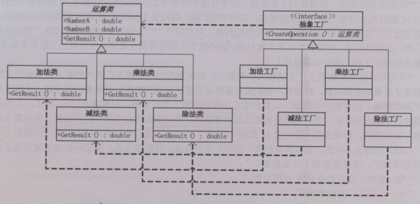


###### 策略模式--装载不同策略

策略模式管理的是子类实现逻辑

策略模式思路大体同工厂模式，均为对同一种类型下，不同实现子类的统一管理

不同的是，策略模式封装的是不同的算法表现，而不是返回不同子类的实例

策略模式将不同实现的子类算法表现封装到策略上下文方法中，用户只需通过策略上下文实例即可调用不同的实现

适合的场景: 对于一个方法有多种实现, 那么只需要更换策略实例部分即可, 而不是使用大量的 if else

1. 一个包含策略方法的接口

   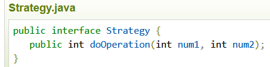

2. 几个实现该策略接口的类, 对于指定的方法有不同的实现

   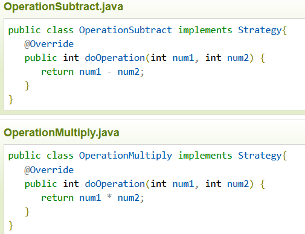

3. 一个context类, 包含策略类型的字段, 通过向构造函数中传递不同的策略实现类, 保存不同的策略

   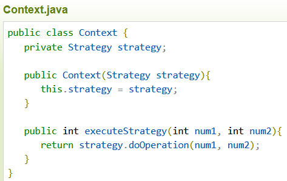
   
4. 调用

    ```java
    // 通过传入不同的策略类示例指定，executeStrategy 的具体表现
    Context cxt = new Context(new OperationSubtract());
    // 将不同表现都封装到 context 示例的 executeStrategy 方法中
    cxt.executeStrategy(1,2);
    ```

    


###### [门面模式](https://www.runoob.com/w3cnote/facade-pattern-3.html)--提供统一入口

也称--外观模式

对于一个有多个模块的系统, 用户需要根据不同的需求访问这些个模块, 此时用户需要处理的逻辑就是复杂的

此时可以创建一个单独的 门面实例, 整合了系统中所有模块的接口, 那么用户只需要拿着自己的需求跟门面类打交道即可, 极大地方便了用户的处理逻辑

例如，MVC三层架构即为门面模式的体现

例如, 医院系统, 包含多个子系统, 此时可以创建一个 接待员的角色, 用户只需要跟接待员交互即可, 实际的操作由接待员分发给各个子系统

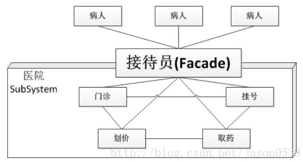


###### 享元模式--共享实例

对于需要创建大量相同实例且其内部数据相似的情况，如果全部创建，那么将会浪费内存空间，使用共享模式抽取相同的内容，只保留一份，然后额外保存不同部分，能够降低内存内存的消耗

字符串常量池就是享元模式的应用


###### 命令模式--封装命令

抽象命令为独立对象，使用接收者执行命令，使用调用者发起命令

客户端只需向调用者提交请求，无需直接与接收者交互，即可完成任务的执行

优势在于解耦，能够容易地实现命令队列，且能够提供撤销或重做功能，对于新加入的命令，不需要修改其他命令代码

要点是将命令抽象为不同的实现类

1. 创建多个实现了命令接口的实现类

2. 创建可维护命令类型数组的命令调用类, 其中提供添加命令方法, 执行命令方法

   添加命令方法会将命令添加到内部命令数组

   执行命令方法会执行命令数组中所有命令并清空该数组

3. 使用时首先创建命令调用类实例, 然后调用添加命令方法, 最后调用执行命令方法


###### 观察者模式--维护观察者数组逐个调用

也叫--发布/订阅模式

观察者模式用来实现当一个 subject 改变时，所有观察这个 subject 的观察者，都能收到通知并执行预制的逻辑

C# 中的 delegate 委托类型，就是实现该功能，具体为创建 delegate 示例，然后将观察者中要执行的方法挂到 delegate 实例上，当需要通知时，直接执行该 delegate 实例，即可调用所有挂在上面的方法，实现通知的功能

观察者模式能够做到状态与观察者的解耦, 实现事件随状态自动触发的效果 (实际上还不是自己事先写好了调用逻辑)

1. 观察者接口
2. 多种实现观察者接口的观察者类
3. 主题类, 维护观察者数组, 维护状态值, 当状态发生变化时, 遍历观察者数组, 逐个调用其通知事件


###### 装饰器模式--逐渐增强

装饰器模式使用独立的装饰器接收基类示例，对其原本逻辑进行扩充增强

装饰器模式的增强顺序等同于构建装饰器的过程

1.  基类

    ```java
    class person{
        public void op(){
            sout("基本功能");
        }
    }
    ```

2.  装饰器接口

    ```java
    // 继承基类以便连续装饰
    interface Decorator extends person{
        person p;
        // 保存被装饰的对象示例
        public Decorator(person p){ this.p=p; }
        // 增强方法
        public void op();
    }
    ```

3.  装饰器具体实现类

    ```java
    class DecratorA implements Decrator{
        @Override
        public void op(){
            // 先执行原逻辑
            super.op();
            // 再执行增强逻辑
            sout("装饰增强内容");
        }
    }
    ```

4.  使用装饰器

    ```java
    psvm(){
        // 基类对象 
        person p = new person();
        // 装饰基类对象
        Decorator d = new DecoratorA(p);
        // 执行装饰后的逻辑
        d.op();
    }
    ```

    


###### 代理模式--再套一层

通过使用代理对象来调用真实对象的逻辑

能够实现：

1.  **远程代理**，使得用户对于实际的对象位置无感知，看到的只是代理对象，例如存在远程数据库，那么此时可以使用代理对象对其接口进行代理，用户只需与代理对象交互

2.  **虚拟代理**，可以在代理对象中预制实际对象的属性或方法，如果实际对象很大，需要很久的加载时间，那么可以先直接使用代理对象中的预制内容作为替补

    浏览器在加载一个很大的网页时，会很迅速显示，但是只有文字，图片会慢慢加载出来，此时使用的就是代理对象，加载的是代理对象中的预制内容，以取得较好的用户体验

3.  **安全代理**，代理对象可以对实际对象中的内容进行权限控制

4.  **增强代理**，代理对象可以对原本的逻辑进行前置或后置增强


###### 原型模式--克隆

利用 ctrl+c 和 ctrl+v 的思想，在需要创建大量重复对象时，使用克隆原对象的方式减少构造新对象带来的开销

克隆涉及深拷贝和浅拷贝的问题，如果想要实现深拷贝，应当实现所有类型的 clone 方法深拷贝逻辑，即返回一个状态等同于当前实例的新实例，java 中 object 下的 clone 即为此思想的实现，因此所有类型均包含 clone 方法

不使用克隆操作，需要多次重复实例化

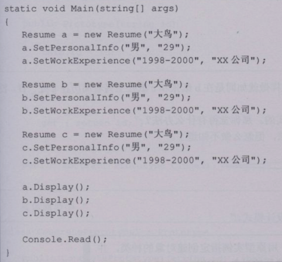

使用克隆，只需要多次克隆

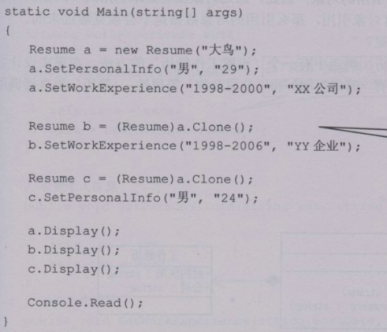


###### 模板模式--抽取公共逻辑

在父类中实现公共部分逻辑，将可变部分抽取为抽象方法，由子类具体实现，减少了各子类对对重复部分逻辑的定义

java 的 AQS 即为模板模式


###### 建造者模式--模子造物

也叫--生成器模式

建造者模式使用规法化的方式创建对象，用户只需要跟指挥者和建造者交互，无需关心实际的建造过程，即可获得规范的实例

1.  假设创建实例需要多个规范的流程步骤
2.  将创建实例的步骤抽取到一个统一接口中，builder接口
3.  实现 builder 接口以实现所有具体的操作
4.  创建 dircetor 类型，接收 builder 类型实例，定义固定的创建实例流程并将其抽取为方法公开
5.  用户创建指定类型的 builder，构建 director，调用创建实例的方法获得新实例

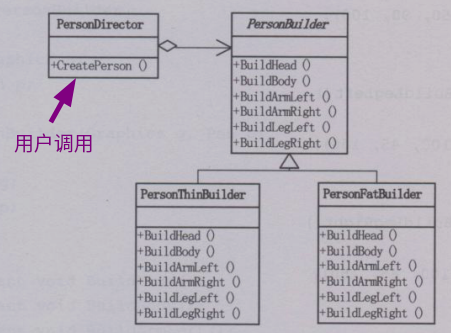

套餐思想

对于一个复杂对象, 该对象由多个小的组件组成, 而创建复杂对象的组成又是多变的, 此时可以将各个小的组件抽离为统一的子组件, 然后使用建造者对象根据需求创建不同的复杂对象

比如: 

点餐的时候点的是套餐, 实际上其本质就是 汉堡, 可乐, 薯条, 炸鸡 组成的不同组合, 

那么我们就可以把这些单品抽离为统一的 Item , 

然后定义套餐类 Meal, 其中维护一个 Item数组, 用来保存当前套餐包含的单品, 

最后, 定义 MealBuilder类, 提供不同的方法用来快捷地创建不同的 套餐, 

使用这种方式, 如果以后再想添加新的套餐, 只需要在 MealBuilder 类中添加对应的用来创建 Meal 实例的方法即可


###### 备忘录模式--存档

备忘录模式使用额外的备忘录管理者对象，对实例状态进行保存，能够按需求保存指定属性，且客户端只需调用管理者即可实现备份，无需关注备份细节


###### 迭代器模式--提供迭代

迭代器模式中，集合应当返回一个实现可迭代接口的实例，使用该迭代器实例遍历集合内元素

在迭代器的使用过程中，无需关心内部如何迭代，只需直接迭代使用即可

各语言中的 foreach 或者 iteratable 即是迭代器模式的实现


###### 桥接模式--连接两种变数

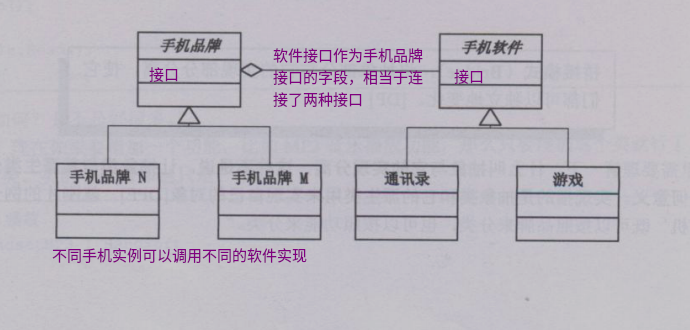


###### 中介者模式--中心管理信息

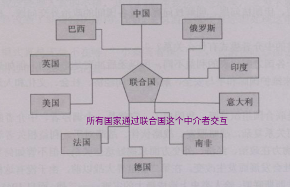

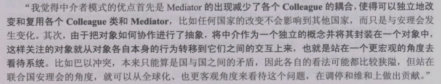

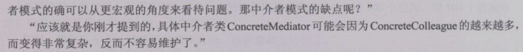


###### 访问者模式

使用不同的访问者对数据进行访问

适用于数据稳定不变化的情况，能够灵活增加对数据的访问方式

